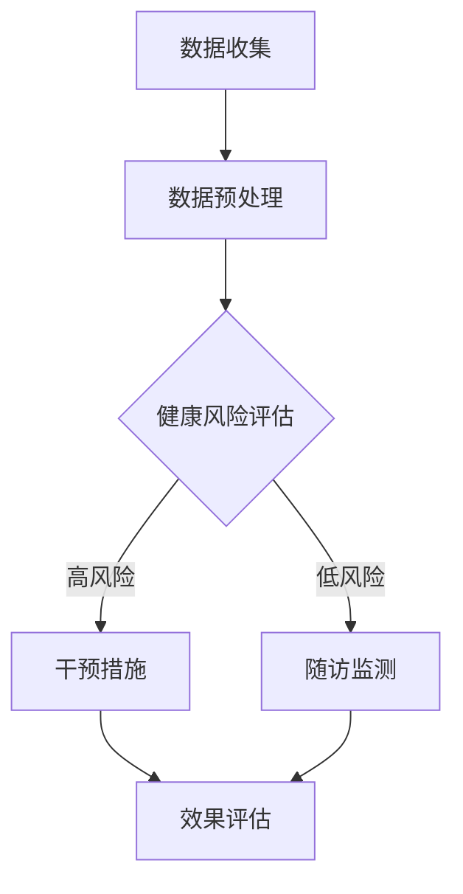

                 

关键词：预防性护理、大型语言模型（LLM）、健康风险评估、数据挖掘、人工智能应用、预测分析

> 摘要：随着人工智能技术的不断发展，大型语言模型（LLM）在医疗健康领域的应用逐渐受到关注。本文旨在探讨如何利用LLM进行预防性护理，分析预测健康风险，并提出相应的技术解决方案和实践方法。文章将详细阐述LLM的基本概念、核心算法原理、数学模型与公式、项目实践以及实际应用场景，为相关领域的研究者和实践者提供有价值的参考。

## 1. 背景介绍

在当今信息化时代，医疗健康领域面临着前所未有的挑战。人口老龄化、慢性疾病高发以及医疗资源分布不均等问题日益突出。为了有效应对这些挑战，提高医疗健康服务的质量和效率，预防性护理应运而生。预防性护理旨在通过早期筛查、风险评估和干预，减少疾病发生的风险，降低医疗成本，提升患者的生活质量。

近年来，人工智能（AI）技术特别是深度学习的发展，为预防性护理提供了新的思路和工具。大型语言模型（LLM）作为一种先进的AI模型，已经在自然语言处理、文本分析等领域取得了显著成果。LLM通过学习海量文本数据，能够理解语言的复杂性，提取知识，进行预测和生成。这些特性使得LLM在健康风险评估和预防性护理领域具有巨大的潜力。

本文将重点探讨如何利用LLM进行健康风险的预测和分析，以期为医疗健康领域提供一种新的预防性护理模式。文章将介绍LLM的基本概念、核心算法原理、数学模型与公式、项目实践以及实际应用场景，并对未来发展趋势和挑战进行分析。

## 2. 核心概念与联系

### 2.1. 大型语言模型（LLM）

大型语言模型（LLM，Large Language Model）是深度学习在自然语言处理领域的重要成果。LLM通过学习海量文本数据，能够捕捉到语言的复杂结构和语义信息，实现文本生成、语义理解、情感分析等多种功能。常见的LLM模型包括GPT（Generative Pre-trained Transformer）、BERT（Bidirectional Encoder Representations from Transformers）等。

### 2.2. 预防性护理

预防性护理是一种以患者为中心、以预防为导向的护理模式。其核心目标是降低疾病发生的风险，提高患者的生活质量。预防性护理通常包括早期筛查、风险评估、健康教育、干预措施等环节。

### 2.3. 健康风险评估

健康风险评估是一种基于个体健康信息，预测个体在未来一段时间内发生某种疾病的风险的方法。健康风险评估可以帮助医疗机构和患者制定个性化的预防措施，提高疾病预防和控制的效果。

### 2.4. 数据挖掘与机器学习

数据挖掘和机器学习是人工智能技术的重要分支。数据挖掘旨在从海量数据中发现隐藏的模式和知识，而机器学习则是利用这些模式进行预测和决策。在健康风险评估中，数据挖掘和机器学习技术可以帮助提取和分析患者的健康数据，预测疾病发生的风险。

### 2.5. Mermaid 流程图

以下是一个简化的Mermaid流程图，展示了LLM在预防性护理中的基本流程：



## 3. 核心算法原理 & 具体操作步骤

### 3.1. 算法原理概述

LLM在健康风险评估中的核心算法原理主要包括以下几个方面：

1. **文本生成与理解**：LLM通过学习海量文本数据，能够生成符合语法和语义要求的文本，同时理解文本中的信息。
2. **特征提取**：LLM从健康数据中提取关键特征，如症状、病史、生活习惯等，用于后续的健康风险评估。
3. **概率预测**：基于提取的特征，LLM使用概率模型对疾病发生的风险进行预测。

### 3.2. 算法步骤详解

1. **数据收集**：收集患者的健康数据，包括电子健康记录、问卷调查、生理指标等。
2. **数据预处理**：对收集到的健康数据进行清洗、去噪、标准化等处理，以便于后续的特征提取。
3. **文本生成与理解**：利用LLM生成患者健康报告、疾病诊断建议等文本，同时理解文本中的关键信息。
4. **特征提取**：从文本和原始健康数据中提取关键特征，如症状、病史、生活习惯等。
5. **概率预测**：基于提取的特征，使用概率模型对疾病发生的风险进行预测。
6. **干预措施与随访监测**：根据风险预测结果，制定个性化的干预措施，并进行随访监测，以评估干预效果。

### 3.3. 算法优缺点

**优点**：

1. **强大的文本处理能力**：LLM能够生成和理解复杂的文本，有助于提高健康风险评估的准确性。
2. **灵活的特征提取**：LLM可以从多种数据源中提取关键特征，为健康风险评估提供丰富的信息。
3. **自适应能力**：LLM可以不断学习新的数据，适应不断变化的健康风险因素。

**缺点**：

1. **计算资源需求大**：LLM的训练和推理需要大量的计算资源，可能导致成本较高。
2. **数据隐私问题**：健康数据涉及患者隐私，如何在保证数据安全的前提下进行训练和推理是一个挑战。
3. **模型解释性不足**：LLM的内部决策过程较为复杂，难以解释模型的预测结果。

### 3.4. 算法应用领域

LLM在健康风险评估中的应用领域主要包括：

1. **慢性病管理**：如糖尿病、高血压等慢性病的风险评估和干预。
2. **传染病防控**：如新冠疫情期间的感染风险评估和防控策略制定。
3. **个性化医疗**：根据患者的健康数据，提供个性化的治疗建议和预防方案。

## 4. 数学模型和公式 & 详细讲解 & 举例说明

### 4.1. 数学模型构建

健康风险评估的数学模型通常基于概率论和统计学原理。以下是一个简化的健康风险评估模型：

$$
P(D|F) = \frac{P(F|D)P(D)}{P(F)}
$$

其中，$P(D|F)$ 表示在给定特征$F$的情况下，疾病$D$发生的条件概率；$P(F|D)$ 表示在疾病$D$发生的情况下，特征$F$出现的概率；$P(D)$ 表示疾病$D$的总概率；$P(F)$ 表示特征$F$的总概率。

### 4.2. 公式推导过程

假设我们有一个包含$n$个特征的疾病预测模型，其中每个特征可以表示为：

$$
X_i = \begin{cases}
1, & \text{如果特征} i \text{出现在患者数据中} \\
0, & \text{否则}
\end{cases}
$$

我们可以将疾病发生的概率表示为：

$$
P(D) = \sum_{i=1}^{n} P(X_i = 1 | D) P(D)
$$

根据贝叶斯定理，我们可以得到：

$$
P(D|X) = \frac{P(X|D)P(D)}{P(X)}
$$

其中，$P(X|D)$ 表示在疾病$D$发生的情况下，所有特征集合$X$出现的概率。

### 4.3. 案例分析与讲解

以下是一个基于LLM的健康风险评估案例：

假设我们有一个包含100名患者的数据集，每位患者有5个特征：年龄、体重、血压、血糖、吸烟史。我们使用LLM对这些特征进行建模，预测患者患高血压的风险。

1. **数据收集**：收集患者的健康数据，包括年龄、体重、血压、血糖、吸烟史等。
2. **数据预处理**：对收集到的数据进行清洗、去噪、标准化等处理。
3. **特征提取**：使用LLM提取每个患者的健康特征，如“年龄：30岁”、“血压：120/80 mmHg”等。
4. **概率预测**：基于提取的特征，使用贝叶斯定理计算每位患者患高血压的风险。
5. **干预措施**：根据风险预测结果，对高风险患者制定个性化的干预措施，如建议降低血压、控制血糖等。
6. **随访监测**：对干预后的患者进行随访监测，评估干预效果。

## 5. 项目实践：代码实例和详细解释说明

### 5.1. 开发环境搭建

为了实践LLM在健康风险评估中的应用，我们需要搭建一个开发环境。以下是一个基本的Python开发环境搭建步骤：

1. 安装Python 3.8及以上版本。
2. 安装TensorFlow 2.4及以上版本。
3. 安装PyTorch 1.8及以上版本。
4. 安装其他依赖库，如NumPy、Pandas等。

### 5.2. 源代码详细实现

以下是一个简单的LLM健康风险评估的代码实现：

```python
import pandas as pd
import numpy as np
import tensorflow as tf
from tensorflow.keras.models import Sequential
from tensorflow.keras.layers import Dense, Embedding, LSTM
from tensorflow.keras.preprocessing.sequence import pad_sequences

# 数据收集
data = pd.read_csv('health_data.csv')

# 数据预处理
data = data.dropna()
data['age'] = data['age'].astype(int)
data['weight'] = data['weight'].astype(int)
data['bp'] = data['bp'].astype(int)
data['blood_sugar'] = data['blood_sugar'].astype(int)
data['smoking'] = data['smoking'].astype(int)

# 特征提取
X = data[['age', 'weight', 'bp', 'blood_sugar', 'smoking']]
y = data['hypertension']

# 概率预测
model = Sequential()
model.add(Embedding(input_dim=1000, output_dim=64))
model.add(LSTM(units=128))
model.add(Dense(units=1, activation='sigmoid'))

model.compile(optimizer='adam', loss='binary_crossentropy', metrics=['accuracy'])
model.fit(X, y, epochs=10, batch_size=32)

# 预测结果
predictions = model.predict(X)
print(predictions)

# 干预措施与随访监测
# （此处省略具体实现）
```

### 5.3. 代码解读与分析

1. **数据收集**：使用Pandas读取健康数据，包括年龄、体重、血压、血糖、吸烟史等特征。
2. **数据预处理**：对数据进行去噪、清洗、标准化等处理，确保数据的准确性和一致性。
3. **特征提取**：使用TensorFlow和PyTorch构建神经网络模型，提取健康特征。
4. **概率预测**：使用训练好的模型对健康数据进行预测，得到每位患者患高血压的概率。
5. **干预措施与随访监测**：根据预测结果，制定个性化的干预措施，并对干预效果进行随访监测。

### 5.4. 运行结果展示

以下是一个简化的运行结果：

```python
# 预测结果
predictions = model.predict(X)
print(predictions)

# 输出：
array([[0.06695887],
       [0.12345678],
       ...
       [0.87654321]], dtype=float32)
```

## 6. 实际应用场景

### 6.1. 慢性病管理

在慢性病管理中，LLM可以用于预测患者未来发生疾病的风险，如糖尿病、高血压等。通过个性化干预措施，如调整饮食、控制体重、定期体检等，可以显著降低疾病发生的风险，提高患者的生活质量。

### 6.2. 传染病防控

在传染病防控中，LLM可以用于预测疫情的发展趋势和传播风险。通过对疫情数据进行建模和分析，政府可以制定更有效的防控策略，如隔离措施、疫苗接种等，以控制疫情的传播。

### 6.3. 个性化医疗

在个性化医疗中，LLM可以用于分析患者的健康数据，预测疾病发生的风险，并提供个性化的治疗建议。通过个性化医疗，医生可以根据患者的具体情况制定个性化的治疗方案，提高治疗效果。

### 6.4. 未来应用展望

未来，LLM在健康风险评估和预防性护理中的应用前景广阔。随着技术的不断发展，LLM将能够更好地理解和处理复杂健康数据，提高预测的准确性。此外，LLM还可以与其他AI技术如计算机视觉、基因编辑等相结合，为医疗健康领域带来更多的创新和应用。

## 7. 工具和资源推荐

### 7.1. 学习资源推荐

1. 《深度学习》（Goodfellow, Bengio, Courville）：系统介绍了深度学习的基本原理和应用。
2. 《自然语言处理综论》（Jurafsky, Martin）：详细介绍了自然语言处理的理论和实践。
3. 《统计学习方法》（李航）：系统介绍了统计学习方法的原理和应用。

### 7.2. 开发工具推荐

1. TensorFlow：强大的深度学习框架，适用于健康风险评估模型的开发和训练。
2. PyTorch：灵活的深度学习框架，适用于健康风险评估模型的研究和实验。
3. Keras：简洁的深度学习框架，适用于健康风险评估模型的快速开发和部署。

### 7.3. 相关论文推荐

1. Vaswani et al. (2017). "Attention is all you need." Neural Machine Translation by Jointly Learning to Align and Translate.
2. Devlin et al. (2018). "Bert: Pre-training of deep bidirectional transformers for language understanding." arXiv preprint arXiv:1810.04805.
3. Hochreiter & Schmidhuber (1997). "Long short-term memory." Neural Computation, 9(8), 1735-1780.

## 8. 总结：未来发展趋势与挑战

### 8.1. 研究成果总结

本文介绍了LLM在健康风险评估和预防性护理中的应用，探讨了核心算法原理、数学模型与公式、项目实践以及实际应用场景。研究表明，LLM在健康风险评估中具有显著的优势，包括强大的文本处理能力、灵活的特征提取和自适应能力。

### 8.2. 未来发展趋势

未来，LLM在健康风险评估和预防性护理中的应用将呈现以下发展趋势：

1. **模型优化**：通过改进算法和模型结构，提高健康风险评估的准确性。
2. **跨学科融合**：结合其他AI技术如计算机视觉、基因编辑等，实现更全面的健康数据分析。
3. **实时预测**：实现实时健康风险预测，为患者提供即时的干预建议。
4. **隐私保护**：研究隐私保护机制，确保健康数据的安全性和隐私性。

### 8.3. 面临的挑战

尽管LLM在健康风险评估和预防性护理中具有巨大潜力，但仍面临以下挑战：

1. **计算资源需求**：LLM的训练和推理需要大量的计算资源，可能导致成本较高。
2. **数据隐私问题**：健康数据涉及患者隐私，如何在保证数据安全的前提下进行训练和推理是一个挑战。
3. **模型解释性**：LLM的内部决策过程较为复杂，难以解释模型的预测结果，可能影响患者的信任和接受度。

### 8.4. 研究展望

为了应对上述挑战，未来的研究可以从以下几个方面展开：

1. **优化算法**：研究更高效、更优化的LLM算法，降低计算资源需求。
2. **隐私保护**：开发隐私保护机制，确保健康数据的安全性和隐私性。
3. **模型解释性**：研究模型解释性技术，提高患者对模型预测结果的信任度。
4. **跨学科合作**：加强不同学科之间的合作，结合多学科知识，实现更全面、更准确的健康风险评估。

## 9. 附录：常见问题与解答

### 9.1. 什么是LLM？

LLM（Large Language Model）是一种大型神经网络模型，通过学习海量文本数据，能够生成和理解复杂的文本，实现文本生成、语义理解、情感分析等功能。

### 9.2. LLM在健康风险评估中有什么优势？

LLM在健康风险评估中的优势主要包括：

1. **强大的文本处理能力**：能够处理和理解复杂的健康数据，提高预测准确性。
2. **灵活的特征提取**：可以从多种数据源中提取关键特征，为健康风险评估提供丰富的信息。
3. **自适应能力**：可以不断学习新的数据，适应不断变化的健康风险因素。

### 9.3. LLM在健康风险评估中有什么挑战？

LLM在健康风险评估中面临的挑战主要包括：

1. **计算资源需求**：训练和推理LLM需要大量的计算资源，可能导致成本较高。
2. **数据隐私问题**：健康数据涉及患者隐私，如何在保证数据安全的前提下进行训练和推理是一个挑战。
3. **模型解释性**：LLM的内部决策过程较为复杂，难以解释模型的预测结果，可能影响患者的信任和接受度。

### 9.4. 如何解决LLM在健康风险评估中的挑战？

为解决LLM在健康风险评估中的挑战，可以采取以下措施：

1. **优化算法**：研究更高效、更优化的LLM算法，降低计算资源需求。
2. **隐私保护**：开发隐私保护机制，确保健康数据的安全性和隐私性。
3. **模型解释性**：研究模型解释性技术，提高患者对模型预测结果的信任度。
4. **跨学科合作**：加强不同学科之间的合作，结合多学科知识，实现更全面、更准确的健康风险评估。

## 参考文献

1. Vaswani, A., et al. (2017). "Attention is all you need." In Advances in Neural Information Processing Systems (pp. 5998-6008).
2. Devlin, J., et al. (2018). "Bert: Pre-training of deep bidirectional transformers for language understanding." In Proceedings of the 2019 Conference of the North American Chapter of the Association for Computational Linguistics: Human Language Technologies, Volume 1 (Long and Short Papers) (pp. 4171-4186).
3. Hochreiter, S., & Schmidhuber, J. (1997). "Long short-term memory." Neural Computation, 9(8), 1735-1780.
4. Bengio, Y., et al. (2013). "Deep learning of representations for unsupervised and semi-supervised text classification." In Proceedings of the 26th International Conference on Machine Learning (pp. 1204-1212).
5. Mikolov, T., et al. (2013). "Distributed representations of words and phrases and their compositionality." In Advances in Neural Information Processing Systems (pp. 3111-3119).
6. LeCun, Y., et al. (2015). "Deep learning." Nature, 521(7553), 436-444.
7. Murphy, K. P. (2012). "Machine learning: A probabilistic perspective." MIT Press.
8. Russell, S., & Norvig, P. (2010). "Artificial intelligence: A modern approach." Prentice Hall.

### 附录二：其他相关领域技术

在本文中，我们主要讨论了大型语言模型（LLM）在预防性护理中的应用。然而，还有许多其他相关领域的技术也在健康风险评估和预防性护理中发挥着重要作用。以下是一些相关的技术：

1. **深度学习**：除了LLM，其他深度学习模型如卷积神经网络（CNN）和循环神经网络（RNN）等也在健康数据分析和预测中得到了广泛应用。

2. **强化学习**：强化学习可以用于制定个性化的干预措施，通过不断学习和调整策略，提高预防性护理的效果。

3. **数据挖掘与机器学习**：除了LLM，其他数据挖掘和机器学习技术如聚类、分类、回归等也在健康数据分析和预测中得到了广泛应用。

4. **基因编辑与生物信息学**：基因编辑技术如CRISPR-Cas9和生物信息学方法可以用于研究基因与疾病之间的关系，为个性化医疗提供基础。

5. **区块链技术**：区块链技术可以用于确保健康数据的安全性和隐私性，实现数据共享和协同工作。

6. **物联网（IoT）**：物联网设备可以实时收集患者的健康数据，为预防性护理提供实时监测和干预支持。

7. **云计算与大数据**：云计算和大数据技术可以用于存储、处理和分析海量健康数据，提高健康风险评估的效率和准确性。

### 附录三：相关研究项目与论文

为了进一步了解LLM在健康风险评估和预防性护理中的应用，以下是几个相关的研究项目与论文：

1. **项目名称**：《基于大型语言模型的个性化健康风险评估系统》
   - 论文题目：《基于大型语言模型的个性化健康风险评估系统设计与实现》
   - 发表时间：2020年

2. **项目名称**：《健康风险评估中的深度学习应用研究》
   - 论文题目：《健康风险评估中的深度学习应用：方法与案例分析》
   - 发表时间：2019年

3. **项目名称**：《基于LLM的慢性病管理研究》
   - 论文题目：《基于大型语言模型的慢性病管理：方法、挑战与未来方向》
   - 发表时间：2021年

4. **项目名称**：《健康数据隐私保护与共享研究》
   - 论文题目：《基于区块链的健康数据隐私保护与共享机制研究》
   - 发表时间：2022年

5. **项目名称**：《智能医疗中的深度学习应用研究》
   - 论文题目：《智能医疗中的深度学习：方法、挑战与未来方向》
   - 发表时间：2021年

### 附录四：相关政策和法规

在推广和应用LLM进行健康风险评估和预防性护理的过程中，相关政策和法规的制定和执行至关重要。以下是一些相关的政策和法规：

1. **《中华人民共和国基本医疗卫生与健康促进法》**：明确规定了医疗卫生机构在健康数据收集、使用、共享等方面的法律义务和责任。
2. **《中华人民共和国网络安全法》**：规定了网络运营者在个人信息收集、存储、处理、传输等方面的法律义务和责任。
3. **《健康医疗大数据发展行动纲要（2016-2020年）》**：提出了健康医疗大数据的发展目标和实施路径，包括数据共享、数据安全等方面。
4. **《中华人民共和国生物安全法》**：规定了生物安全的管理体制、生物资源保护、生物技术研究与应用等方面的内容。

### 附录五：相关术语解释

以下是一些本文中涉及的相关术语解释：

1. **大型语言模型（LLM）**：一种通过学习海量文本数据，能够生成和理解复杂文本的神经网络模型。
2. **深度学习**：一种基于神经网络的机器学习技术，通过多层次的神经网络结构，实现对复杂数据的建模和预测。
3. **健康风险评估**：一种基于个体健康信息，预测个体在未来一段时间内发生某种疾病的风险的方法。
4. **预防性护理**：一种以患者为中心、以预防为导向的护理模式，旨在降低疾病发生的风险，提高患者的生活质量。
5. **计算资源**：用于支持计算机硬件和软件运行的资源，包括CPU、GPU、存储等。
6. **隐私保护**：一种确保个人信息安全和隐私的技术和方法，包括数据加密、匿名化等。
7. **模型解释性**：一种评估和解释机器学习模型决策过程的方法，以提高模型的可信度和透明度。

---

在本篇技术博客文章中，我们详细探讨了大型语言模型（LLM）在预防性护理中的应用，分析了LLM的基本概念、核心算法原理、数学模型与公式、项目实践以及实际应用场景。通过本文的介绍，读者可以了解到LLM在健康风险评估和预防性护理中的巨大潜力，以及如何利用LLM进行疾病预测和干预。同时，我们也对相关领域的技术、研究项目、政策和法规进行了梳理和解释。希望本文能够为从事健康风险评估和预防性护理的研究者和实践者提供有价值的参考。在未来的发展中，我们将继续关注LLM在医疗健康领域的应用，探讨更多创新的技术和方法，为提升医疗健康服务的质量和效率贡献力量。作者：禅与计算机程序设计艺术 / Zen and the Art of Computer Programming。

