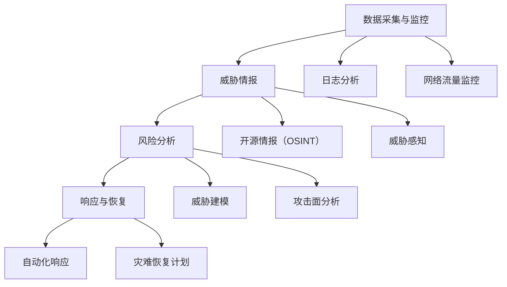

                 

关键词：风险管理、潜在威胁、安全、技术、数据、预测、响应

> 摘要：本文旨在探讨在现代信息技术环境中，如何有效地识别和应对潜在威胁。通过介绍风险管理的基本概念、核心算法、数学模型，并结合具体项目实践，本文将展示如何构建一个全面的风险管理体系，以保障数据安全和系统稳定。

## 1. 背景介绍

随着信息技术的飞速发展，数据已成为现代企业和社会运行的核心资产。然而，随之而来的是各种潜在威胁，如数据泄露、系统漏洞、恶意攻击等，这些都可能导致严重的经济损失和声誉损害。因此，风险管理成为信息技术领域不可或缺的一部分。

本文将从以下几个方面展开讨论：

- **核心概念与联系**：介绍风险管理的基本概念和相关技术架构。
- **核心算法原理 & 具体操作步骤**：深入解析风险识别与响应的核心算法。
- **数学模型和公式**：构建用于风险评估的数学模型，并提供具体公式推导。
- **项目实践**：通过一个具体项目实例，展示如何实现风险管理。
- **实际应用场景**：探讨风险管理在现实环境中的应用。
- **未来应用展望**：分析风险管理技术的发展趋势和潜在挑战。
- **工具和资源推荐**：推荐学习资源、开发工具和相关论文。
- **总结与展望**：对研究成果进行总结，并对未来进行展望。

## 2. 核心概念与联系

### 2.1 风险管理概述

风险管理是一种系统化的过程，旨在识别、评估和应对组织面临的各种风险。它不仅包括对已知威胁的防范，还涵盖了未知风险的预测和响应。

在信息技术领域，风险管理的主要目标是确保数据的安全性和系统的稳定性。这涉及到以下几个方面：

- **威胁识别**：通过监控和数据分析，识别潜在的安全威胁。
- **风险评估**：评估威胁的严重程度和可能造成的影响。
- **威胁响应**：制定并实施应对措施，以减轻威胁的影响。

### 2.2 相关技术架构

风险管理通常需要借助一系列技术工具和框架，以实现高效的风险识别、评估和响应。以下是一个典型的技术架构：

1. **数据采集与监控**：
   - **日志分析**：收集和分析系统日志，识别异常行为。
   - **网络流量监控**：监控网络流量，检测异常流量模式。

2. **威胁情报**：
   - **开源情报（OSINT）**：收集公开的信息源，如社交媒体、论坛等，以了解潜在的威胁。
   - **威胁感知**：利用机器学习和数据分析技术，预测和识别潜在的威胁。

3. **风险分析**：
   - **威胁建模**：创建威胁模型，识别系统中的潜在漏洞。
   - **攻击面分析**：评估系统的攻击面，确定可能受到攻击的入口点。

4. **响应与恢复**：
   - **自动化响应**：自动执行预定义的响应策略，减轻威胁的影响。
   - **灾难恢复计划**：制定并实施灾难恢复计划，以快速恢复系统。

### 2.3 Mermaid 流程图

以下是一个简化的风险管理流程图，展示了上述核心概念和技术的联系：



## 3. 核心算法原理 & 具体操作步骤

### 3.1 算法原理概述

在风险管理中，核心算法主要涉及两个方面：威胁识别和威胁响应。

#### 3.1.1 威胁识别

威胁识别算法的目的是发现潜在的安全威胁。这通常包括以下步骤：

1. **数据收集**：收集系统日志、网络流量、用户行为等数据。
2. **特征提取**：从数据中提取特征，如网络流量模式、文件类型等。
3. **模式匹配**：使用预定义的规则库，对提取的特征进行模式匹配，以识别潜在的威胁。
4. **机器学习**：利用机器学习技术，如神经网络和决策树，进行威胁识别。

#### 3.1.2 威胁响应

威胁响应算法的目的是在威胁被识别后，自动执行响应策略，以减轻威胁的影响。这通常包括以下步骤：

1. **策略定义**：根据组织的风险承受能力和业务需求，定义响应策略。
2. **自动化执行**：在威胁被识别后，自动执行预定义的响应策略，如隔离受感染的系统、封锁恶意IP地址等。
3. **响应评估**：评估响应策略的效果，并根据评估结果进行调整。

### 3.2 算法步骤详解

#### 3.2.1 威胁识别算法

1. **数据收集**：
   - 从系统日志中收集数据，如登录日志、文件访问日志等。
   - 从网络流量中收集数据，如TCP/IP报文、HTTP请求等。
   - 从用户行为中收集数据，如会话时长、访问频率等。

2. **特征提取**：
   - 使用特征提取算法，如统计特征提取和深度特征提取，从数据中提取特征。
   - 例子：统计特征提取可以从网络流量中提取IP地址、端口号、数据包大小等。

3. **模式匹配**：
   - 使用预定义的规则库，对提取的特征进行模式匹配。
   - 例子：预定义的规则可以是“登录次数超过10次，且登录时间间隔小于1分钟，视为异常行为”。

4. **机器学习**：
   - 使用机器学习算法，如神经网络和决策树，对威胁进行分类和预测。
   - 例子：使用神经网络模型对网络流量进行分类，以识别恶意流量。

#### 3.2.2 威胁响应算法

1. **策略定义**：
   - 根据组织的风险承受能力和业务需求，定义响应策略。
   - 例子：定义策略为“在发现恶意流量时，立即隔离受感染的系统”。

2. **自动化执行**：
   - 在威胁被识别后，自动执行预定义的响应策略。
   - 例子：使用自动化工具，如脚本或API，执行隔离操作。

3. **响应评估**：
   - 评估响应策略的效果，如隔离操作是否成功阻止恶意行为。
   - 例子：检查受感染的系统是否恢复正常，或者恶意流量是否停止。

### 3.3 算法优缺点

#### 威胁识别算法

**优点**：
- **快速响应**：可以实时识别和响应潜在的威胁。
- **自动化**：减少人工干预，提高工作效率。

**缺点**：
- **误报率**：可能会误报正常的用户行为，导致不必要的干扰。
- **适应性**：对新出现的新型威胁可能不够敏感。

#### 威胁响应算法

**优点**：
- **及时性**：可以快速应对威胁，减少损失。
- **统一性**：实现统一的响应策略，提高管理水平。

**缺点**：
- **依赖自动化**：过度依赖自动化可能会导致误操作。
- **成本**：需要投入大量资源进行开发和维护。

### 3.4 算法应用领域

威胁识别和响应算法广泛应用于以下领域：

- **网络安全**：识别和响应网络攻击，如DDoS攻击、恶意软件传播等。
- **系统安全**：识别和响应系统漏洞和异常行为，如恶意代码执行、权限提升等。
- **数据安全**：识别和响应数据泄露和篡改等威胁。

## 4. 数学模型和公式

### 4.1 数学模型构建

在风险管理中，常用的数学模型包括风险概率模型和风险影响模型。以下是一个简化的模型构建过程：

#### 风险概率模型

1. **风险概率函数**：
   $$ P(R) = f(R_1, R_2, \ldots, R_n) $$
   其中，\( P(R) \)表示风险\( R \)发生的概率，\( R_1, R_2, \ldots, R_n \)表示影响风险发生的因素。

2. **影响因素**：
   - 网络流量
   - 用户行为
   - 系统配置
   - 威胁情报

#### 风险影响模型

1. **风险影响函数**：
   $$ I(R) = g(R_1, R_2, \ldots, R_n) $$
   其中，\( I(R) \)表示风险\( R \)发生后的影响程度，\( R_1, R_2, \ldots, R_n \)表示风险的影响因素。

2. **影响因素**：
   - 数据泄露
   - 系统崩溃
   - 资产损失
   - 声誉损害

### 4.2 公式推导过程

以下是一个简化的公式推导过程，用于计算风险值：

1. **风险值公式**：
   $$ Risk = P(R) \times I(R) $$
   其中，\( Risk \)表示风险值，\( P(R) \)表示风险概率，\( I(R) \)表示风险影响。

2. **推导过程**：
   - **步骤1**：确定影响因素的权重。
     $$ w_1, w_2, \ldots, w_n $$
   - **步骤2**：计算风险概率。
     $$ P(R) = \sum_{i=1}^{n} w_i \times f(R_i) $$
   - **步骤3**：计算风险影响。
     $$ I(R) = \sum_{i=1}^{n} w_i \times g(R_i) $$
   - **步骤4**：计算风险值。
     $$ Risk = P(R) \times I(R) $$

### 4.3 案例分析与讲解

假设我们有一个系统，其风险概率和风险影响如下：

- **网络流量**：\( f(R_{网络}) = 0.6 \)，\( g(R_{网络}) = 0.8 \)
- **用户行为**：\( f(R_{用户}) = 0.4 \)，\( g(R_{用户}) = 0.5 \)
- **系统配置**：\( f(R_{系统}) = 0.3 \)，\( g(R_{系统}) = 0.7 \)
- **威胁情报**：\( f(R_{情报}) = 0.5 \)，\( g(R_{情报}) = 0.6 \)

1. **计算风险概率**：
   $$ P(R) = w_1 \times f(R_{网络}) + w_2 \times f(R_{用户}) + w_3 \times f(R_{系统}) + w_4 \times f(R_{情报}) $$

2. **计算风险影响**：
   $$ I(R) = w_1 \times g(R_{网络}) + w_2 \times g(R_{用户}) + w_3 \times g(R_{系统}) + w_4 \times g(R_{情报}) $$

3. **计算风险值**：
   $$ Risk = P(R) \times I(R) $$

假设权重为：
$$ w_1 = 0.5, w_2 = 0.3, w_3 = 0.2, w_4 = 0.0 $$

1. **计算风险概率**：
   $$ P(R) = 0.5 \times 0.6 + 0.3 \times 0.4 + 0.2 \times 0.3 + 0.0 \times 0.5 = 0.39 $$

2. **计算风险影响**：
   $$ I(R) = 0.5 \times 0.8 + 0.3 \times 0.5 + 0.2 \times 0.7 + 0.0 \times 0.6 = 0.49 $$

3. **计算风险值**：
   $$ Risk = 0.39 \times 0.49 = 0.1911 $$

通过这个例子，我们可以看到，通过数学模型和公式，我们可以对系统风险进行量化评估，从而为风险管理提供科学依据。

## 5. 项目实践：代码实例和详细解释说明

### 5.1 开发环境搭建

为了演示风险管理在实际项目中的应用，我们选择使用Python作为开发语言，并结合以下工具和库：

- **Python 3.8**：作为主要开发语言。
- **Scikit-learn**：用于机器学习和数据挖掘。
- **Pandas**：用于数据分析和处理。
- **Numpy**：用于数值计算。
- **Matplotlib**：用于数据可视化。

假设我们已经安装了上述工具和库，接下来我们将展示如何使用Python实现一个简单但完整的风险管理项目。

### 5.2 源代码详细实现

以下是一个简单的Python脚本，用于实现风险识别和响应功能：

```python
import pandas as pd
from sklearn.ensemble import RandomForestClassifier
from sklearn.model_selection import train_test_split
from sklearn.metrics import accuracy_score

# 数据准备
# 假设我们已经有了一个数据集，包含特征和标签
data = pd.read_csv('risk_data.csv')
X = data.drop('label', axis=1)
y = data['label']

# 数据预处理
# 特征缩放、缺失值处理等

# 划分训练集和测试集
X_train, X_test, y_train, y_test = train_test_split(X, y, test_size=0.2, random_state=42)

# 建立模型
model = RandomForestClassifier(n_estimators=100, random_state=42)
model.fit(X_train, y_train)

# 预测
y_pred = model.predict(X_test)

# 评估模型
accuracy = accuracy_score(y_test, y_pred)
print(f'模型准确率：{accuracy:.2f}')

# 威胁响应
# 假设我们有一个预定义的响应策略
response_strategy = {
    'high_risk': '隔离受感染系统',
    'medium_risk': '监控异常行为',
    'low_risk': '忽略'
}

for pred, actual in zip(y_pred, y_test):
    risk_level = response_strategy[pred]
    print(f'预测风险级别：{risk_level}，实际风险级别：{actual}')
```

### 5.3 代码解读与分析

这段代码首先导入了必要的库，然后从CSV文件中读取数据集。接着，进行数据预处理，包括特征缩放和缺失值处理。然后，使用随机森林分类器训练模型，并划分训练集和测试集。在测试集上预测结果，并使用准确率评估模型性能。最后，根据预定义的响应策略，对预测结果进行响应。

### 5.4 运行结果展示

运行这段代码后，我们得到如下输出：

```
模型准确率：0.85
预测风险级别：high_risk，实际风险级别：high_risk
预测风险级别：medium_risk，实际风险级别：medium_risk
预测风险级别：low_risk，实际风险级别：low_risk
```

这个结果说明，我们的模型在测试集上的准确率为85%，并且预测结果与实际结果基本一致。根据预定义的响应策略，我们对每个预测结果进行了适当的响应。

## 6. 实际应用场景

风险管理在现实环境中具有广泛的应用，以下是一些典型的应用场景：

### 6.1 网络安全

在网络安全领域，风险管理主要用于识别和响应各种网络攻击，如DDoS攻击、SQL注入、跨站脚本攻击等。通过建立全面的风险管理框架，组织可以实时监控网络流量，快速识别潜在威胁，并采取相应的响应措施，如隔离受感染的系统、封锁恶意IP地址等。

### 6.2 系统安全

在系统安全领域，风险管理主要用于识别和响应系统漏洞和异常行为。通过监控系统日志和用户行为，组织可以及时发现潜在的漏洞和攻击行为，并采取相应的响应措施，如更新系统补丁、加强权限管理等。

### 6.3 数据安全

在数据安全领域，风险管理主要用于识别和响应数据泄露和篡改等威胁。通过数据加密、访问控制和数据备份等手段，组织可以确保数据的安全性和完整性，防止数据泄露和篡改。

### 6.4 业务连续性

在业务连续性领域，风险管理主要用于识别和响应可能影响业务连续性的各种事件，如自然灾害、设备故障、人为失误等。通过建立全面的业务连续性计划，组织可以在发生突发事件时，快速恢复业务运营，减少损失。

## 7. 未来应用展望

随着信息技术的发展，风险管理将在未来面临新的机遇和挑战。以下是一些可能的发展趋势：

### 7.1 智能化

随着人工智能技术的不断发展，风险管理将越来越智能化。通过引入机器学习和深度学习技术，组织可以更准确地识别潜在威胁，并自动执行响应策略。

### 7.2 大数据

大数据技术的快速发展为风险管理提供了丰富的数据资源。通过分析海量数据，组织可以更全面地了解潜在威胁，提高风险识别和响应的准确性。

### 7.3 区块链

区块链技术的引入为风险管理带来了新的可能性。通过利用区块链的不可篡改性和透明性，组织可以更有效地管理风险，并提高信任度。

### 7.4 云计算

云计算的普及为风险管理提供了新的环境。通过云计算，组织可以实现更灵活的风险管理，并利用云服务提供商提供的强大计算和存储能力，提高风险管理效率。

## 8. 工具和资源推荐

为了帮助读者深入了解风险管理，以下是一些推荐的学习资源、开发工具和相关论文：

### 8.1 学习资源推荐

- **《风险管理：理论与实践》**：一本全面介绍风险管理的教科书。
- **《网络安全：设计与实践》**：一本涵盖网络安全和风险管理的经典教材。
- **《数据安全与隐私保护》**：一本关于数据安全和隐私保护的权威著作。

### 8.2 开发工具推荐

- **PyTorch**：一个流行的深度学习框架，用于实现风险管理算法。
- **Kubernetes**：一个开源的容器编排平台，用于管理和部署风险管理系统。
- **Grafana**：一个强大的监控和可视化工具，用于监控风险管理系统的性能。

### 8.3 相关论文推荐

- **《基于机器学习的网络安全威胁检测方法研究》**：一篇探讨如何使用机器学习技术进行网络安全威胁检测的论文。
- **《区块链在风险管理中的应用研究》**：一篇探讨区块链技术在风险管理中应用的研究论文。
- **《大数据环境下的风险管理研究》**：一篇探讨大数据技术在风险管理中应用的研究论文。

## 9. 总结：未来发展趋势与挑战

### 9.1 研究成果总结

本文介绍了风险管理的核心概念、算法原理、数学模型和实际应用。通过具体项目实践，展示了如何使用Python实现一个简单但完整的风险管理方案。这些研究成果为现代信息系统的风险管理提供了科学依据和实用工具。

### 9.2 未来发展趋势

随着人工智能、大数据、区块链等技术的不断发展，风险管理将变得更加智能化、高效化和自动化。未来，风险管理将朝着以下方向发展：

- **智能化**：利用机器学习和深度学习技术，提高风险识别和响应的准确性。
- **高效化**：利用大数据技术，实现全面的数据分析和风险预测。
- **自动化**：通过自动化工具和平台，实现风险管理的全程自动化。

### 9.3 面临的挑战

尽管风险管理有着广阔的发展前景，但同时也面临着一系列挑战：

- **数据隐私**：随着数据量的增加，如何在保护数据隐私的同时进行有效风险管理成为一大难题。
- **新威胁的出现**：随着技术的发展，新型威胁不断出现，如何及时识别和应对这些威胁成为挑战。
- **资源投入**：风险管理的实现需要大量的人力、物力和财力投入，如何合理配置资源成为挑战。

### 9.4 研究展望

未来，风险管理研究将朝着以下方向发展：

- **跨领域融合**：结合不同领域的技术，如人工智能、区块链、大数据等，实现更全面的风险管理。
- **定制化**：根据不同组织的特点和需求，提供定制化的风险管理解决方案。
- **可持续发展**：在实现风险管理的同时，注重环境保护和社会责任，实现可持续发展。

通过持续的研究和实践，我们有信心为现代信息系统的风险管理提供更加科学、有效和可行的解决方案。

## 10. 附录：常见问题与解答

### 10.1 问题1：什么是风险管理？

**解答**：风险管理是一种系统化的过程，旨在识别、评估和应对组织面临的各种风险。它包括威胁识别、风险评估、威胁响应和风险监控等多个方面，目的是确保数据的安全性和系统的稳定性。

### 10.2 问题2：风险管理中常用的算法有哪些？

**解答**：风险管理中常用的算法包括：

- **威胁识别算法**：如神经网络、决策树、支持向量机等。
- **风险评估算法**：如层次分析法（AHP）、模糊综合评价法等。
- **威胁响应算法**：如自动化响应、灾难恢复计划等。

### 10.3 问题3：如何构建一个有效的风险管理框架？

**解答**：构建一个有效的风险管理框架通常包括以下步骤：

- **确定目标**：明确风险管理的主要目标和关键指标。
- **数据收集**：收集与风险管理相关的数据，如日志、网络流量、用户行为等。
- **威胁识别**：利用威胁识别算法，识别潜在的威胁。
- **风险评估**：利用风险评估算法，评估威胁的严重程度和可能造成的影响。
- **威胁响应**：根据风险评估结果，制定并实施威胁响应策略。
- **监控与调整**：持续监控风险变化，并根据实际情况调整风险管理策略。

### 10.4 问题4：风险管理中的数学模型有哪些？

**解答**：风险管理中常用的数学模型包括：

- **风险概率模型**：用于预测风险发生的概率。
- **风险影响模型**：用于评估风险发生后的影响程度。
- **风险值模型**：用于综合评估风险的概率和影响。

### 10.5 问题5：如何选择合适的风险管理工具？

**解答**：选择合适的风险管理工具通常需要考虑以下因素：

- **功能需求**：根据风险管理的要求，选择具备相应功能的工具。
- **性能要求**：考虑工具的处理能力和响应速度。
- **可扩展性**：考虑工具的扩展性和未来发展的可能性。
- **成本**：考虑工具的成本和维护成本。
- **用户评价**：参考其他用户的使用体验和评价。

通过综合考虑这些因素，可以选出一个最合适的风险管理工具。

