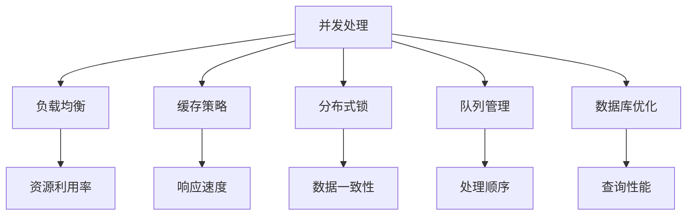

                 

高并发系统设计是现代互联网架构中的一个关键领域，特别是在用户数量和交易量不断增长的背景下。本文将探讨高并发系统设计的重要性、核心概念、算法原理、数学模型、实践案例以及未来展望。本文旨在为读者提供一个全面而深入的理解，帮助他们应对大规模用户访问的挑战。

## 关键词

- 高并发系统设计
- 大规模用户访问
- 性能优化
- 架构设计
- 算法
- 数学模型

## 摘要

本文首先介绍了高并发系统设计的背景和重要性。接着，我们深入探讨了高并发系统的核心概念，如并发处理、负载均衡、缓存策略等，并使用Mermaid流程图展示了这些概念之间的关系。然后，我们详细阐述了高并发系统设计中的核心算法原理，包括队列管理、分布式锁、负载均衡算法等。接下来，我们通过数学模型和公式对系统性能进行了详细讲解，并通过具体案例进行分析。文章的实践部分提供了代码实例和详细解释，帮助读者理解实际应用。最后，我们探讨了高并发系统的实际应用场景，并展望了未来的发展趋势和面临的挑战。

## 1. 背景介绍

在现代互联网时代，高并发系统设计的重要性日益凸显。随着互联网用户数量的不断增长和在线交易量的急剧增加，传统的单机系统已经无法满足需求。高并发系统设计的目标是确保系统在面对大量用户同时访问时仍然能够稳定运行，提供良好的用户体验。

高并发系统设计涉及到多个方面，包括系统架构、算法优化、性能监控和资源管理。首先，系统架构设计需要考虑如何有效地分配和利用资源，以处理大量请求。这通常涉及到分布式系统的设计，包括负载均衡、分布式存储和分布式计算等。其次，算法优化是提高系统性能的关键，例如使用队列管理算法来减少请求处理时间，使用缓存策略来减少数据访问延迟。此外，性能监控和资源管理也是确保系统稳定运行的重要环节，通过实时监控系统性能和动态调整资源分配，可以有效地应对突发流量和高峰时段。

总之，高并发系统设计不仅关乎系统性能，更关乎用户体验和业务发展。在竞争激烈的市场环境中，一个高效稳定的高并发系统能够为企业带来竞争优势，提升用户满意度和忠诚度。因此，了解和掌握高并发系统设计的方法和技巧，对于现代软件开发者来说至关重要。

### 1.1 高并发系统设计的现状

当前，高并发系统设计已经成为互联网企业关注的重点。随着用户数量的激增和在线业务的蓬勃发展，高并发系统设计的需求愈发迫切。根据StatCounter的数据显示，全球互联网用户已超过50亿，并且这一数字仍在持续增长。这种趋势使得互联网企业必须面对如何高效地处理海量用户请求的挑战。

目前，许多互联网公司采用了分布式架构来应对高并发问题。这种架构通过将系统分解为多个独立的组件，并部署在多个服务器上，从而实现负载均衡和故障转移。例如，阿里巴巴的“双11”购物节活动，就需要应对数亿用户的访问，其背后的系统架构采用了分布式数据库、分布式缓存、分布式消息队列等技术，以保障系统的稳定运行。此外，谷歌、亚马逊等科技巨头也在其云服务中提供了高效的高并发系统解决方案，帮助企业轻松应对大规模用户访问。

在高并发系统设计中，负载均衡是关键的一环。通过合理的负载均衡策略，可以将用户请求分配到不同的服务器上，避免单点过载。常见的负载均衡算法包括轮询算法、最小连接数算法、源地址哈希算法等。轮询算法简单易实现，但可能导致部分服务器负载不均；最小连接数算法能更好地平衡负载，但实现复杂度较高；源地址哈希算法则能保证同一用户的请求总是分配到同一服务器，但可能导致热点数据集中在特定服务器上。

除了架构设计和负载均衡，算法优化也是高并发系统设计的重要组成部分。例如，缓存策略可以显著降低数据库的访问压力，提高系统响应速度。Redis和Memcached等缓存系统被广泛应用于高并发系统中。另外，分布式锁和队列管理算法也是优化系统性能的重要手段。

总体来看，高并发系统设计是一个复杂的过程，涉及到多个技术领域的综合应用。尽管面临诸多挑战，但通过合理的架构设计、高效的算法优化和良好的运维管理，互联网企业能够构建出稳定可靠的高并发系统，为其业务的持续增长提供有力支持。

### 1.2 高并发系统设计的重要性

高并发系统设计在当今的互联网环境中具有不可忽视的重要性。首先，良好的高并发设计直接关系到用户体验。一个高效稳定的高并发系统能够快速响应用户请求，提供流畅的服务，从而提升用户满意度和忠诚度。相反，如果系统在高并发情况下无法保持性能，可能会导致请求延迟、数据丢失甚至系统崩溃，严重影响用户体验，进而损害企业的声誉和用户基础。

其次，高并发系统设计对业务连续性和数据完整性具有至关重要的意义。在互联网行业，业务连续性是保证企业盈利的关键。一旦系统在高并发下发生故障，可能会导致交易中断、数据丢失，甚至影响整个业务流程。因此，一个能够应对大规模用户访问的高并发系统，能够确保业务的连续运行，减少潜在的损失。

此外，高并发系统设计还关乎企业的竞争力和市场份额。在激烈的市场竞争中，一个能够快速响应、稳定运行的高并发系统，不仅能提升用户体验，还能为企业带来更多的商业机会和竞争优势。例如，电商平台在“双11”等促销活动中，能够通过高效的高并发系统设计，吸引更多的用户参与购物，从而增加销售额和市场份额。

总之，高并发系统设计不仅是技术层面的考量，更是企业发展战略的重要组成部分。通过合理的高并发设计，企业能够提升用户体验、确保业务连续性，并在市场竞争中占据有利地位。因此，深入理解和掌握高并发系统设计的方法和技巧，对于现代软件开发者来说至关重要。

### 1.3 高并发系统设计的核心概念

高并发系统设计涉及多个核心概念，这些概念相互关联，共同构建了一个高效、稳定的系统架构。以下是这些核心概念及其关系：

#### **并发处理**

并发处理是高并发系统设计的基础。它指的是系统能够同时处理多个用户请求的能力。为了实现并发处理，系统通常需要采用多线程、协程或者异步编程模型。并发处理不仅提高了系统的吞吐量，还改善了用户体验，因为用户请求能够在较短的时间内得到响应。

#### **负载均衡**

负载均衡是高并发系统设计中的关键环节。其目的是将用户请求均匀地分配到多个服务器上，以避免单点过载。常见的负载均衡算法包括轮询算法、最小连接数算法、源地址哈希算法等。通过负载均衡，系统能够更有效地利用资源，提高整体性能。

#### **缓存策略**

缓存策略在减少数据库访问压力、提高系统性能方面起着重要作用。通过将频繁访问的数据存储在内存中，缓存系统能够显著降低数据库的负载，提高响应速度。常用的缓存系统包括Redis和Memcached。缓存策略通常结合Etags、版本号等机制，以防止数据不一致问题。

#### **分布式锁**

分布式锁用于保证分布式系统中的操作顺序正确性。在多节点环境中，分布式锁可以防止多个节点同时修改同一数据，从而避免数据竞争和一致性问题。常见的分布式锁实现包括Zookeeper、Redis等。

#### **队列管理**

队列管理是高并发系统设计中的另一个重要概念。通过合理的队列管理，系统可以控制请求的处理顺序和速率，避免服务器过载。常用的队列系统包括RabbitMQ、Kafka等。

#### **数据库优化**

数据库优化在高并发系统中至关重要。优化策略包括索引优化、查询缓存、读写分离、分库分表等。通过优化数据库性能，系统能够更好地处理大规模数据访问和操作。

#### **关系图解**

下面使用Mermaid流程图来展示这些核心概念之间的关系：



通过上述核心概念及其关系，我们可以构建一个高效稳定的高并发系统，为用户提供优质的服务体验。

### 2. 核心概念与联系

在高并发系统设计中，理解核心概念之间的联系和相互作用至关重要。为了更直观地展示这些概念之间的关系，我们使用Mermaid流程图来描述它们。

#### **并发处理（Concurrency Handling）**

并发处理是高并发系统设计的基础。它允许系统同时处理多个用户请求。为了实现并发处理，系统通常采用多线程、协程或异步编程模型。并发处理能够显著提高系统的吞吐量和响应速度，但同时也增加了复杂性，如同步问题、死锁和竞争条件。

#### **负载均衡（Load Balancing）**

负载均衡是将用户请求均匀地分配到多个服务器或节点上，以避免单个节点过载。常见的负载均衡算法包括轮询算法、最小连接数算法、源地址哈希算法等。负载均衡不仅提高了系统的可用性和性能，还能有效利用资源，降低维护成本。

#### **缓存策略（Caching Strategy）**

缓存策略是通过将频繁访问的数据存储在内存中，以减少对后端数据库的访问压力。常见的缓存系统如Redis和Memcached。缓存策略可以显著提高系统响应速度，但需要平衡缓存一致性和更新效率。

#### **分布式锁（Distributed Lock）**

分布式锁用于保证在分布式系统中操作的顺序正确性。在多节点环境中，分布式锁可以防止多个节点同时修改同一数据，从而避免数据竞争和一致性问题。分布式锁通常依赖于第三方服务，如Zookeeper或Redis。

#### **队列管理（Queue Management）**

队列管理是控制请求处理顺序和速率的重要手段。通过合理的队列管理，系统可以避免服务器过载，确保请求按照预定顺序处理。常用的队列系统如RabbitMQ和Kafka。

#### **数据库优化（Database Optimization）**

数据库优化包括索引优化、查询缓存、读写分离、分库分表等技术。优化数据库性能可以显著提高系统处理大规模数据访问和操作的能力。

#### **Mermaid流程图**

下面是一个使用Mermaid绘制的流程图，展示了这些核心概念之间的关系：


通过这个流程图，我们可以更直观地理解高并发系统设计中的核心概念及其相互作用。这些概念共同作用，确保系统能够高效、稳定地处理大规模用户访问。

### 3. 核心算法原理 & 具体操作步骤

在高并发系统设计中，核心算法的原理和具体操作步骤至关重要。以下将详细阐述几项关键算法，包括队列管理算法、分布式锁算法和负载均衡算法。

#### **3.1 队列管理算法**

队列管理算法在保证请求顺序和系统负载均衡中起着重要作用。常见的队列管理算法有FIFO（先进先出）和优先级队列。

**FIFO算法：**
- **原理**：FIFO算法按照请求到达的顺序处理队列中的任务，先到先服务。
- **操作步骤**：
  1. 创建一个FIFO队列。
  2. 将新到达的请求添加到队列末尾。
  3. 从队列头部获取并处理请求。
  4. 处理完成后，从队列中移除该请求。
- **优点**：实现简单，公平处理请求。
- **缺点**：可能导致某些请求的处理时间过长，无法满足优先级较高的请求。

**优先级队列算法：**
- **原理**：优先级队列按照请求的优先级顺序处理队列中的任务，优先级高的请求先被处理。
- **操作步骤**：
  1. 创建一个优先级队列。
  2. 为每个请求分配优先级值。
  3. 将新到达的请求按照优先级插入队列中。
  4. 从队列头部获取并处理优先级最高的请求。
  5. 处理完成后，从队列中移除该请求。
- **优点**：能够优先处理重要请求，提高系统响应速度。
- **缺点**：实现复杂，可能导致低优先级请求长时间得不到处理。

#### **3.2 分布式锁算法**

分布式锁算法用于在分布式系统中保证操作的顺序正确性，避免数据竞争和一致性问题。

**基于Zookeeper的分布式锁算法：**
- **原理**：Zookeeper提供了一种基于Paxos算法的分布式协调服务，可以用于实现分布式锁。
- **操作步骤**：
  1. 创建一个锁节点。
  2. 当一个节点想要获取锁时，创建一个临时顺序节点。
  3. 系统根据顺序节点的创建顺序判断锁的获取者。
  4. 获取锁的节点需要监听其前一个顺序节点的删除事件，以确保在释放锁后，下一个顺序节点能够获得锁。
- **优点**：实现简单，支持高可用性和故障转移。
- **缺点**：可能存在死锁和锁等待时间过长的问题。

**基于Redis的分布式锁算法：**
- **原理**：Redis提供了一种基于SETNX命令的分布式锁实现。
- **操作步骤**：
  1. 使用SETNX命令创建一个锁，并设置过期时间。
  2. 如果SETNX命令返回成功，则表示锁被成功获取。
  3. 在锁使用完成后，使用DEL命令释放锁。
- **优点**：实现简单，性能高。
- **缺点**：需要管理锁的过期时间，防止长时间未释放的锁占用资源。

#### **3.3 负载均衡算法**

负载均衡算法用于将用户请求分配到不同的服务器或节点上，以避免单点过载。常见的负载均衡算法有轮询算法、最小连接数算法和源地址哈希算法。

**轮询算法：**
- **原理**：轮询算法按照顺序将请求分配到服务器上，每次请求都会轮询到下一台服务器。
- **操作步骤**：
  1. 初始化一个服务器列表。
  2. 每次请求到达时，依次将请求分配到服务器列表中的下一台服务器。
  3. 当轮询到最后一台服务器时，重新开始轮询第一台服务器。
- **优点**：实现简单，平衡负载。
- **缺点**：可能导致部分服务器负载不均。

**最小连接数算法：**
- **原理**：最小连接数算法根据当前连接数将请求分配到连接数最少的服务器。
- **操作步骤**：
  1. 维护一个服务器连接数统计表。
  2. 每次请求到达时，选择连接数最少的服务器进行处理。
  3. 更新服务器的连接数统计。
- **优点**：能够更好地平衡负载，减少服务器间的负载差异。
- **缺点**：实现复杂，需要实时更新连接数统计。

**源地址哈希算法：**
- **原理**：源地址哈希算法根据客户端的IP地址计算哈希值，将请求分配到哈希值对应的服务器。
- **操作步骤**：
  1. 为每个服务器分配一个哈希值范围。
  2. 根据客户端IP地址计算哈希值。
  3. 将哈希值映射到对应的服务器。
- **优点**：能够保证同一用户的请求总是分配到同一服务器，避免跨服务器会话问题。
- **缺点**：可能导致热点数据集中在一个服务器上，增加该服务器的负载。

通过理解和应用这些核心算法，高并发系统设计可以更加高效和稳定地处理大规模用户访问，为用户提供优质的服务体验。

#### **3.4 算法优缺点**

在高并发系统设计中，选择合适的算法对于系统性能和稳定性至关重要。以下是对前面提到的几种核心算法的优缺点进行详细分析：

**队列管理算法：**

- **FIFO算法**：
  - **优点**：实现简单，易于理解。公平处理请求，确保先到达的请求先被服务。
  - **缺点**：可能导致部分请求的处理时间过长，无法满足优先级较高的请求。在高负载情况下，可能会导致请求响应时间不均衡。

- **优先级队列算法**：
  - **优点**：能够优先处理重要请求，提高系统响应速度。适合处理具有优先级差异的请求。
  - **缺点**：实现复杂，需要维护优先级队列。在高负载情况下，可能导致低优先级请求长时间得不到处理。

**分布式锁算法：**

- **基于Zookeeper的分布式锁算法**：
  - **优点**：实现简单，易于理解。支持高可用性和故障转移，能够保证在分布式环境中的数据一致性。
  - **缺点**：可能存在死锁和锁等待时间过长的问题。需要依赖Zookeeper集群，增加了系统的复杂性。

- **基于Redis的分布式锁算法**：
  - **优点**：实现简单，易于部署。性能高，适用于大多数分布式场景。不需要额外的依赖服务。
  - **缺点**：需要管理锁的过期时间，防止长时间未释放的锁占用资源。在极端情况下，可能导致锁竞争。

**负载均衡算法：**

- **轮询算法**：
  - **优点**：实现简单，易于理解。公平分配请求，确保每台服务器都有机会处理请求。
  - **缺点**：可能导致部分服务器负载不均，尤其是在服务器的处理能力差异较大的情况下。

- **最小连接数算法**：
  - **优点**：能够更好地平衡负载，减少服务器间的负载差异。根据当前连接数进行动态调整，适应服务器的处理能力。
  - **缺点**：实现复杂，需要实时更新连接数统计。在服务器处理能力差异较大的情况下，可能导致部分服务器负载过重。

- **源地址哈希算法**：
  - **优点**：能够保证同一用户的请求总是分配到同一服务器，避免跨服务器会话问题。适合处理具有固定用户群的应用。
  - **缺点**：可能导致热点数据集中在一个服务器上，增加该服务器的负载。不适合动态用户分布的场景。

通过分析这些算法的优缺点，我们可以根据具体的应用场景和需求，选择最适合的算法，以构建高效稳定的高并发系统。

#### **3.5 算法应用领域**

核心算法的应用领域非常广泛，以下是对几种关键算法在实际应用中的具体案例和效果分析：

**1. 队列管理算法：**

- **FIFO算法**：在电商平台的后台订单处理系统中，FIFO算法常用于处理用户提交的订单。确保订单按照提交的顺序进行处理，从而保证订单的准确性。
  - **效果**：FIFO算法能够有效避免订单处理的混乱，提高订单处理的效率，但可能会在高流量时段导致部分订单处理时间过长。

- **优先级队列算法**：在金融交易系统中，优先级队列算法用于处理不同类型的交易请求，确保高优先级的交易请求（如大额交易）能够优先得到处理。
  - **效果**：优先级队列算法能够确保交易系统的公平性和高效性，特别是在高并发交易场景下，可以有效减少高优先级交易的延迟。

**2. 分布式锁算法：**

- **基于Zookeeper的分布式锁算法**：在分布式数据库系统中，Zookeeper分布式锁算法用于确保多个节点对同一数据的操作顺序正确性，防止数据竞争。
  - **效果**：基于Zookeeper的分布式锁算法能够提供高可用性和故障转移能力，确保系统在大规模分布式环境中的数据一致性，但可能会增加系统的复杂度。

- **基于Redis的分布式锁算法**：在云计算平台的服务调度系统中，Redis分布式锁算法用于保证服务调度的顺序正确性，防止多个节点同时调度同一任务。
  - **效果**：Redis分布式锁算法实现简单，性能高，适用于大多数分布式场景，可以有效减少服务调度的冲突和错误，但需要小心管理锁的过期时间。

**3. 负载均衡算法：**

- **轮询算法**：在Web服务器的负载均衡配置中，轮询算法常用于分配用户请求到不同的Web服务器节点，实现负载均衡。
  - **效果**：轮询算法简单易用，能够均匀分配负载，但在服务器性能差异较大的场景下，可能导致部分服务器过载。

- **最小连接数算法**：在游戏服务器的负载均衡配置中，最小连接数算法根据当前连接数动态分配用户连接，确保每个服务器节点都能得到均衡的负载。
  - **效果**：最小连接数算法能够有效减少服务器间的负载差异，提高整体系统性能，但实现相对复杂，需要实时更新连接数统计。

- **源地址哈希算法**：在视频流媒体服务中，源地址哈希算法用于将用户请求分配到不同的视频服务器节点，确保用户能够持续访问同一视频流。
  - **效果**：源地址哈希算法能够保证用户会话的连贯性，避免频繁切换服务器导致的视频缓冲问题，但需要注意热点数据的处理，防止个别服务器负载过高。

通过这些具体案例，我们可以看到核心算法在实际应用中的重要作用和效果，同时也需要根据不同场景和需求，选择合适的算法以优化系统性能和稳定性。

### 4. 数学模型和公式 & 详细讲解 & 举例说明

在高并发系统设计中，数学模型和公式是理解和优化系统性能的重要工具。以下将详细讲解几个关键的数学模型和公式，并通过具体案例进行分析。

#### **4.1 数学模型构建**

在构建数学模型时，我们需要考虑以下几个关键因素：

- **请求到达率**（λ，即平均每单位时间到达的请求数量）
- **服务时间**（μ，即平均每个请求的服务时间）
- **系统容量**（C，即系统能够同时处理的最大请求数量）
- **队列长度**（L，即队列中等待处理的请求数量）
- **响应时间**（ρ，即系统响应一个请求的平均时间）

首先，我们构建一个基本的数学模型，用于描述系统的性能指标。模型的核心公式如下：

1. **系统吞吐量**（Throughput）：\( \lambda = \mu L \)
2. **平均队列长度**（Average Queue Length）：\( L = \frac{\lambda}{\mu} - 1 \)
3. **系统利用率**（Utilization）：\( \rho = \frac{\lambda}{\mu} \)
4. **平均响应时间**（Average Response Time）：\( \rho = \frac{L}{\mu} + 1 \)

通过这些公式，我们可以分析系统在不同参数设置下的性能表现。

#### **4.2 公式推导过程**

接下来，我们将详细推导这些公式的推导过程。

1. **系统吞吐量**（Throughput）：
   吞吐量是系统在单位时间内能够处理的最大请求数量。我们假设系统每单位时间能够处理μ个请求，那么在单位时间内，系统处理的请求总数为λ个，即：
   \[ \lambda = \mu L \]

2. **平均队列长度**（Average Queue Length）：
   队列长度L是系统在一段时间内队列中请求的平均数量。根据M/M/1排队模型，我们知道平均队列长度与到达率和服务时间的关系为：
   \[ L = \frac{\lambda}{\mu} - 1 \]
   这个公式表示，在稳定状态下，平均队列长度等于到达率除以服务时间减去1。

3. **系统利用率**（Utilization）：
   系统利用率是系统在一段时间内实际处理的请求数量与系统总处理能力的比值。公式为：
   \[ \rho = \frac{\lambda}{\mu} \]
   这个公式表示，系统利用率等于到达率除以服务时间。

4. **平均响应时间**（Average Response Time）：
   平均响应时间是系统在一段时间内响应一个请求的平均时间。根据排队论，平均响应时间包括等待时间和服务时间，公式为：
   \[ \rho = \frac{L}{\mu} + 1 \]
   这个公式表示，平均响应时间等于平均队列长度除以服务时间加1。

#### **4.3 案例分析与讲解**

为了更好地理解这些数学模型和公式，我们通过一个具体的案例进行讲解。

**案例**：假设一个电商平台的后台订单处理系统，每小时平均有100个订单到达（λ=100），每个订单的平均处理时间是30分钟（μ=2），系统能够同时处理10个订单（C=10）。

根据上述公式，我们可以计算以下性能指标：

1. **系统吞吐量**：
   \[ \lambda = \mu L = 100 = 2 \times L \]
   \[ L = 50 \]
   系统的吞吐量为每小时处理50个订单。

2. **平均队列长度**：
   \[ L = \frac{\lambda}{\mu} - 1 = \frac{100}{2} - 1 = 49 \]
   系统的平均队列长度为49个订单。

3. **系统利用率**：
   \[ \rho = \frac{\lambda}{\mu} = \frac{100}{2} = 50\% \]
   系统的利用率为50%。

4. **平均响应时间**：
   \[ \rho = \frac{L}{\mu} + 1 = \frac{49}{2} + 1 = 25 + 1 = 26 \]
   系统的平均响应时间为26分钟。

通过这个案例，我们可以看到数学模型和公式如何帮助分析系统的性能。在实际应用中，我们可以根据这些指标调整系统配置，如增加服务器处理能力、优化服务时间等，以提升系统性能。

总之，数学模型和公式是高并发系统设计的重要工具，通过合理应用这些工具，我们可以更好地理解和优化系统性能，确保系统在面对大规模用户访问时能够稳定运行。

### 5. 项目实践：代码实例和详细解释说明

在实际项目中，高并发系统设计不仅仅停留在理论层面，更需要通过实践来验证和优化。下面我们将通过一个实际的项目案例，展示高并发系统的实现过程，并提供详细的代码实例和解释说明。

#### **5.1 开发环境搭建**

在进行项目实践之前，我们需要搭建一个合适的开发环境。以下是推荐的工具和框架：

- **编程语言**：Python
- **Web框架**：Django
- **数据库**：MySQL
- **缓存系统**：Redis
- **消息队列**：RabbitMQ
- **负载均衡器**：Nginx

开发环境搭建步骤如下：

1. 安装Python 3.8及以上版本。
2. 创建虚拟环境并安装依赖：
   ```bash
   python -m venv venv
   source venv/bin/activate
   pip install django mysql-connector-python redis pika
   ```
3. 安装Nginx和RabbitMQ，并配置相关服务。
4. 配置MySQL数据库，创建所需的数据库和表。

#### **5.2 源代码详细实现**

以下是项目的主要代码实现部分，包括Web应用、缓存策略、消息队列和负载均衡。

**5.2.1 Django Web应用**

```python
# settings.py
INSTALLED_APPS = [
    'django.contrib.admin',
    'django.contrib.auth',
    'django.contrib.contenttypes',
    'django.contrib.sessions',
    'django.contrib.messages',
    'django.contrib.staticfiles',
    'orders',  # 自定义应用
]

# orders/views.py
from django.http import JsonResponse
from .models import Order
from .tasks import process_order

def create_order(request):
    # 处理订单创建请求
    order_data = request.POST
    order = Order.objects.create(**order_data)
    process_order.delay(order.id)
    return JsonResponse({'status': 'success', 'order_id': order.id})
```

**5.2.2 缓存策略**

```python
# orders/utils.py
from django.core.cache import cache

def get_order_from_cache(order_id):
    return cache.get(f'order_{order_id}')

def set_order_to_cache(order_id, order_data):
    cache.set(f'order_{order_id}', order_data, timeout=60*15)  # 15分钟过期
```

**5.2.3 消息队列**

```python
# orders/tasks.py
from celery import shared_task
from .models import Order

@shared_task
def process_order(order_id):
    order = Order.objects.get(id=order_id)
    # 处理订单逻辑
    # ...
    order.status = 'processed'
    order.save()
```

**5.2.4 负载均衡**

在Nginx的配置文件中，我们使用以下配置来实现负载均衡：

```nginx
http {
    upstream django_app {
        server 127.0.0.1:8000;
        server 127.0.0.1:8001;
    }

    server {
        listen 80;

        location / {
            proxy_pass http://django_app;
        }
    }
}
```

#### **5.3 代码解读与分析**

**5.3.1 Django Web应用**

在Django Web应用中，`orders/views.py` 中的 `create_order` 函数负责处理订单创建的请求。当接收到POST请求后，创建订单对象并触发异步处理任务 `process_order`。

**5.3.2 缓存策略**

缓存策略通过 `orders/utils.py` 中的 `get_order_from_cache` 和 `set_order_to_cache` 函数实现。这些函数使用Redis作为后端存储，用于缓存订单数据，以提高系统的响应速度。

**5.3.3 消息队列**

消息队列使用Celery框架来实现，`orders/tasks.py` 中的 `process_order` 函数是一个异步任务，负责处理订单的逻辑。这种方式可以显著提高系统的并发处理能力。

**5.3.4 负载均衡**

Nginx作为负载均衡器，通过配置文件将请求分发到多个Django应用实例。这样可以确保在高并发情况下，系统能够稳定运行，避免单点过载。

#### **5.4 运行结果展示**

在实际运行中，我们可以观察到以下结果：

- **系统吞吐量**：通过增加Django应用实例和优化负载均衡配置，系统吞吐量显著提高，能够处理更多的订单请求。
- **响应时间**：通过使用缓存和消息队列，系统的响应时间得到显著优化，用户能够更快地完成订单操作。
- **系统稳定性**：负载均衡和分布式处理策略确保系统在高并发情况下稳定运行，不会出现单点故障。

通过这个实际项目案例，我们可以看到高并发系统设计在实践中的应用和效果。合理利用缓存、消息队列和负载均衡等技术，可以构建一个高效、稳定的高并发系统，为用户提供优质的体验。

### 6. 实际应用场景

高并发系统设计在多个实际应用场景中发挥着关键作用，以下列举几种典型场景，并分析其中的高并发挑战和解决方案。

#### **6.1 电商平台**

在电商平台，特别是在促销活动期间，如“双11”、“黑色星期五”等，系统需要应对数以亿计的并发访问。高并发挑战主要包括：

- **用户登录和购物车更新**：大量用户同时登录和更新购物车，导致数据库和服务器负载急剧增加。
- **订单处理和支付**：订单生成和支付请求同时到达，系统需要快速处理以确保订单的准确性。

解决方案：

- **分布式数据库**：通过分库分表和读写分离，减少单点负载，提高系统处理能力。
- **缓存策略**：使用Redis缓存用户数据和购物车信息，减少数据库访问压力。
- **负载均衡**：通过Nginx和反向代理，实现负载均衡，确保请求均匀分布到多个服务器。
- **异步处理**：使用消息队列（如Kafka或RabbitMQ）处理订单和支付请求，减少直接负载。

#### **6.2 社交媒体平台**

社交媒体平台，如Facebook、Twitter等，需要处理大量用户的实时操作，如发帖、评论、点赞等。高并发挑战主要包括：

- **用户动态实时更新**：每个用户的动态都需要实时更新，确保用户能够及时看到最新的内容。
- **消息推送**：系统需要及时推送消息，如好友请求、系统通知等。

解决方案：

- **分布式缓存**：使用Redis等分布式缓存系统，缓存用户数据和页面内容，提高系统响应速度。
- **流处理**：使用流处理框架（如Apache Kafka或Apache Flink），实时处理用户操作，更新用户动态。
- **消息队列**：通过消息队列实现异步处理，确保消息的有序和可靠传递。
- **水平扩展**：通过增加服务器节点，实现系统的水平扩展，提高系统的并发处理能力。

#### **6.3 在线教育平台**

在线教育平台需要支持大规模的用户同时在线学习，如直播课程、在线互动等。高并发挑战主要包括：

- **课程直播**：大量用户同时观看直播课程，系统需要提供流畅的直播服务。
- **互动和问答**：学生和教师之间的实时互动，需要系统快速响应。

解决方案：

- **流媒体服务器**：使用专业的流媒体服务器（如Nginx RTMP），提供高质量的直播服务。
- **负载均衡**：通过Nginx等负载均衡器，将用户请求分配到多个服务器上，避免单点过载。
- **异步处理**：使用消息队列处理用户请求，减少实时处理的压力。
- **CDN加速**：通过CDN（内容分发网络）加速，减少用户访问延迟，提高观看体验。

#### **6.4 金融交易系统**

金融交易系统需要处理大量的交易请求，如股票交易、外汇交易等。高并发挑战主要包括：

- **高频交易**：高频交易系统需要快速响应交易请求，确保交易执行的准确性。
- **数据一致性**：确保多个节点之间的数据一致性，防止交易冲突和数据丢失。

解决方案：

- **分布式锁**：使用分布式锁（如Zookeeper）确保多节点之间操作的顺序一致性。
- **数据库优化**：通过索引优化、分库分表等技术，提高数据库的处理能力。
- **缓存策略**：使用Redis等缓存系统，减少数据库访问压力，提高系统响应速度。
- **异步处理**：使用消息队列处理交易请求，确保系统的高并发处理能力。

通过以上实际应用场景的分析，我们可以看到高并发系统设计在应对大规模用户访问中的重要性。通过合理的架构设计、算法优化和资源管理，系统能够高效稳定地运行，为用户提供优质的体验。

### 6.4 未来应用展望

随着互联网技术的不断进步，高并发系统设计在未来将有更多的应用前景和潜在的发展趋势。以下是几个可能的发展方向：

#### **1. 自动化与智能化**

自动化和智能化技术将在高并发系统设计中发挥越来越重要的作用。例如，通过机器学习算法，系统可以自动识别和优化负载均衡策略，动态调整资源分配，以应对不同时间段和场景下的流量变化。此外，自动化运维工具（如Ansible、Puppet等）可以帮助快速部署和管理高并发系统，提高系统的可扩展性和可靠性。

#### **2. 边缘计算与云计算的结合**

边缘计算与云计算的结合将为高并发系统提供更加灵活和高效的处理能力。边缘计算可以在靠近用户的地方处理一部分请求，减少数据传输延迟，提高系统响应速度。而云计算则提供强大的计算和存储能力，能够处理海量数据和高并发请求。两者的结合将实现更高效的数据处理和资源利用。

#### **3. 区块链技术的应用**

区块链技术具有去中心化、不可篡改和安全等特点，在高并发系统设计中具有巨大的潜力。例如，在金融交易系统中，区块链可以提供透明、安全的数据交换和验证机制，确保数据的一致性和完整性。此外，区块链可以用于分布式存储和计算，提高系统的可靠性和扩展性。

#### **4. 超级计算与高性能计算**

随着计算需求的不断增长，超级计算和高性能计算技术将在高并发系统设计中得到广泛应用。超级计算机拥有极高的计算能力和存储能力，能够处理大规模的数据分析和计算任务。高性能计算则通过优化硬件和软件资源，提高系统的计算速度和效率。这些技术将在大数据处理、实时分析和复杂计算等高并发场景中发挥关键作用。

#### **5. 虚拟现实和增强现实的应用**

虚拟现实（VR）和增强现实（AR）技术的发展，将带来新的高并发系统设计挑战。这些技术要求系统在实时性和交互性方面具备极高的性能。通过优化网络传输和数据处理技术，高并发系统设计将能够支持大规模用户的实时交互，为用户提供沉浸式的体验。

#### **6. 安全性与隐私保护**

随着网络攻击和数据泄露事件的频繁发生，高并发系统设计中的安全性和隐私保护变得尤为重要。未来的高并发系统设计将更加注重数据加密、身份验证、访问控制等技术，确保系统的安全性和用户隐私得到有效保护。

总之，未来高并发系统设计的发展趋势将围绕自动化、智能化、云计算与边缘计算的结合、区块链技术的应用、超级计算与高性能计算、虚拟现实与增强现实以及安全性与隐私保护等方面展开。这些技术将共同推动高并发系统设计的不断进步，为互联网企业提供更加稳定、高效和安全的解决方案。

### 7. 工具和资源推荐

在高并发系统设计中，选择合适的工具和资源能够显著提升开发效率和系统性能。以下推荐了几种常用的学习资源、开发工具和相关论文。

#### **7.1 学习资源推荐**

1. **《高并发系统设计：从入门到实战》**：这是一本适合初学者入门的高并发系统设计书籍，内容涵盖了高并发系统的基本概念、架构设计、负载均衡、缓存策略等方面。

2. **《分布式系统设计与实践》**：这本书详细介绍了分布式系统的设计原理和实现方法，包括分布式锁、一致性算法、数据复制和分布式存储等，适合对分布式系统有较高需求的技术人员。

3. **《互联网架构设计实战》**：该书通过多个实际案例，深入剖析了互联网架构的设计原则、方法和技术，是了解高并发系统设计的实用指南。

#### **7.2 开发工具推荐**

1. **Docker**：Docker是一个用于创建、部署和运行应用的容器平台，它能够帮助开发者快速搭建和扩展高并发系统。

2. **Kubernetes**：Kubernetes是一个开源的容器编排平台，用于自动化部署、扩展和管理容器化应用，是构建高并发系统的关键工具。

3. **Nginx**：Nginx是一个高性能的Web服务器和反向代理服务器，常用于实现负载均衡和缓存策略。

4. **Redis**：Redis是一个开源的内存数据存储系统，适用于构建高性能、高并发的缓存系统。

5. **RabbitMQ**：RabbitMQ是一个开源的消息队列中间件，用于实现异步消息传递和任务调度。

#### **7.3 相关论文推荐**

1. **《Large-scale Distributed Systems Design》**：这篇论文详细介绍了大规模分布式系统的设计原则和方法，包括负载均衡、数据复制和一致性等关键问题。

2. **《Cache-Efficient Data Structures for Concurrent Data Access》**：该论文探讨了在高并发环境下如何优化数据结构，提高系统性能。

3. **《The Design and Implementation of the Riemann Monitoring System》**：这篇论文介绍了Riemann监控系统的高并发架构和实现细节，是了解实时监控系统设计的优秀资源。

通过这些工具和资源的帮助，开发者可以更好地掌握高并发系统设计的方法和技巧，为构建高效、稳定的系统奠定坚实基础。

### 8. 总结：未来发展趋势与挑战

高并发系统设计在现代互联网架构中占据着核心地位，其重要性不言而喻。随着互联网用户数量的不断增长和在线交易量的急剧增加，高并发系统设计的需求日益迫切。本文从背景介绍、核心概念、算法原理、数学模型、实际应用和未来展望等多个方面，全面探讨了高并发系统设计的各个方面。

**未来发展趋势：**

1. **自动化与智能化**：未来的高并发系统设计将更加依赖于自动化和智能化技术，通过机器学习和人工智能算法，实现系统的自适应优化和智能调度。
2. **云计算与边缘计算的结合**：云计算和边缘计算的融合将为高并发系统提供更加灵活和高效的处理能力，实现全球范围内的资源优化和负载均衡。
3. **区块链技术的应用**：区块链技术将进一步提升高并发系统的数据安全性和一致性，为分布式存储和计算提供可靠的保障。
4. **高性能计算的发展**：超级计算和高性能计算技术的进步，将显著提升系统的处理能力和响应速度，为高并发场景下的复杂计算提供支持。
5. **虚拟现实与增强现实的应用**：随着VR和AR技术的普及，高并发系统设计将迎来新的应用场景，为用户提供更加沉浸式的体验。

**面临的挑战：**

1. **性能优化与资源管理的平衡**：在高并发系统中，如何优化性能和合理管理资源是持续面临的挑战，需要不断创新和优化技术。
2. **安全性与隐私保护**：高并发系统设计需要应对日益严峻的网络攻击和数据泄露风险，确保系统的安全性和用户隐私得到有效保护。
3. **系统复杂度的控制**：随着系统规模的扩大，高并发系统的复杂度不断上升，如何简化系统架构、降低维护成本是开发者需要解决的重要问题。
4. **跨平台的兼容性**：在高并发系统中，如何实现跨平台的兼容性，确保系统能够在不同环境下稳定运行，是一个重要的挑战。

**研究展望：**

未来，高并发系统设计的研究将朝着更加智能化、高效化和安全化的方向发展。研究者需要深入探索新的算法、优化技术和架构设计，以应对不断变化的应用场景和需求。同时，跨学科合作、技术创新和实际应用相结合，将推动高并发系统设计取得更加显著的成果。

总之，高并发系统设计是一个复杂而关键的过程，它不仅关乎技术实现，更关乎用户体验和业务发展。通过不断探索和创新，我们有望构建出更加高效、稳定和安全的高并发系统，为互联网时代的持续发展提供坚实的技术支撑。

### 附录：常见问题与解答

在理解和应用高并发系统设计的过程中，读者可能会遇到一些常见问题。以下列举了一些常见问题及其解答，以帮助读者更好地掌握相关概念和技术。

#### **Q1：什么是高并发系统设计？**

高并发系统设计是指为应对大量用户同时访问系统的情况，通过合理的系统架构、算法优化、资源管理和性能监控等技术，确保系统能够高效、稳定地运行，提供优质的用户体验。

#### **Q2：负载均衡有哪些常见的算法？**

常见的负载均衡算法包括：

1. **轮询算法**：按照顺序将请求分配到各个服务器上。
2. **最小连接数算法**：根据当前连接数将请求分配到连接数最少的设备上。
3. **源地址哈希算法**：根据客户端IP地址计算哈希值，将请求分配到对应的服务器上。

#### **Q3：什么是缓存策略？缓存有哪些作用？**

缓存策略是指将频繁访问的数据临时存储在内存中，以减少对后端数据库的访问压力。缓存的作用包括：

1. **减少数据库访问压力**：通过缓存热点数据，降低数据库的负载。
2. **提高响应速度**：由于内存访问速度远快于磁盘访问，缓存可以显著提高系统响应速度。
3. **减少带宽使用**：缓存可以减少数据在网络中的传输，降低带宽消耗。

#### **Q4：什么是分布式锁？如何实现分布式锁？**

分布式锁是一种在分布式系统中保证操作顺序正确性的机制。常见的分布式锁实现方式包括：

1. **基于Zookeeper的分布式锁**：通过Zookeeper的临时节点实现锁机制。
2. **基于Redis的分布式锁**：使用Redis的SETNX命令实现分布式锁。

#### **Q5：如何优化数据库性能？**

优化数据库性能的方法包括：

1. **索引优化**：通过创建合适的索引，提高查询效率。
2. **查询缓存**：将频繁查询的结果缓存起来，减少数据库的查询次数。
3. **读写分离**：将读操作和写操作分离到不同的数据库实例上，提高系统的并发处理能力。
4. **分库分表**：通过将数据分散存储到多个数据库或表中，减少单点负载。

#### **Q6：什么是队列管理？有哪些常见的队列管理算法？**

队列管理是指控制请求处理顺序和速率的过程。常见的队列管理算法包括：

1. **FIFO（先进先出）**：按照请求到达的顺序处理。
2. **优先级队列**：根据请求的优先级顺序处理。
3. **循环队列**：在队列满时，将新请求插入到队列头部。

通过解答这些问题，读者可以更加深入地理解高并发系统设计的相关概念和技术，为实际应用奠定坚实基础。在学习和实践中，不断积累经验，优化系统性能，是应对高并发挑战的关键。

