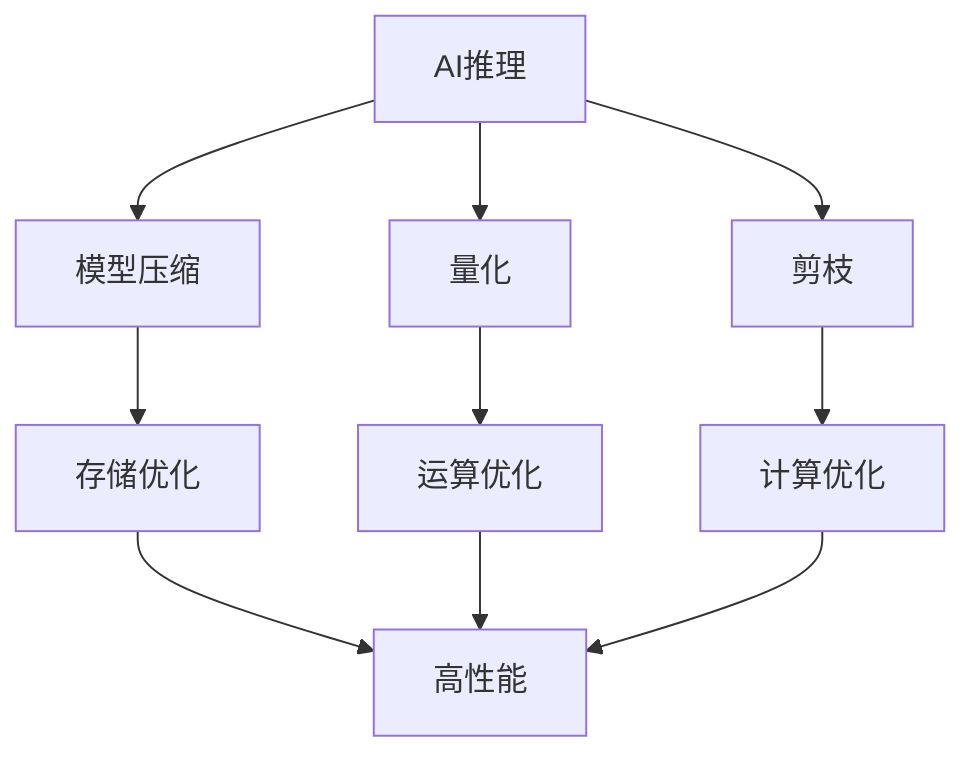

                 

### 1. 背景介绍

随着人工智能技术的飞速发展，深度学习在图像识别、自然语言处理、语音识别等领域取得了显著成果。然而，这些成果的实现往往依赖于大规模的模型训练，这不仅需要巨大的计算资源，还要求高效的推理算法。在许多实际应用场景中，如自动驾驶、实时语音识别等，对推理性能的要求非常高，延迟和资源占用都需严格控制。因此，如何优化AI推理性能成为一个重要且紧迫的问题。

高性能AI推理优化不仅关系到算法的实时性和准确性，还直接影响到应用的广泛普及和商业化。传统上，优化方法主要集中于模型压缩、量化、剪枝等技术，这些方法在一定程度上提升了推理速度，但仍有很大的优化空间。本文旨在探讨一系列高效的AI推理优化技巧，为研究者、工程师提供理论支持和实践指导。

本文结构如下：首先介绍AI推理优化的重要性，然后讨论核心概念及其关联，接着详细阐述优化算法的原理和步骤，探讨其优缺点及适用领域，随后展示数学模型和公式，并通过实际项目实践进行代码解析，最后分析实际应用场景，展望未来发展趋势和面临的挑战，并推荐相关学习资源和工具。

### 2. 核心概念与联系

在探讨AI推理优化之前，我们需要了解一些核心概念，它们包括但不限于：

- **AI推理**：指通过预先训练好的模型进行输入数据的预测或分类。
- **模型压缩**：通过减少模型参数的数量来降低模型的复杂度和计算量。
- **量化**：将浮点数权重转换为低精度的整数，从而降低模型的存储和计算成本。
- **剪枝**：通过移除模型中不重要的连接或神经元来减少模型大小和计算复杂度。

为了更清晰地展示这些概念之间的关系，我们可以使用Mermaid流程图来描绘它们的关联。



从图中可以看出，模型压缩、量化、剪枝都是优化AI推理性能的重要手段，它们分别从不同的维度（存储、运算、计算）对模型进行优化，共同实现高性能的目标。

### 3. 核心算法原理 & 具体操作步骤

#### 3.1 算法原理概述

AI推理优化的核心算法主要包括模型压缩、量化、剪枝等。以下是每种算法的基本原理：

- **模型压缩**：通过剪枝、量化、知识蒸馏等方法减小模型的参数量和计算复杂度。主要目的是在不显著降低模型性能的前提下，提高推理速度和减少存储占用。
- **量化**：将模型的权重和激活值从浮点数转换为低精度的整数，以减少模型的存储和运算需求。量化方法包括整数线性量化、非线性格林纳量化等。
- **剪枝**：通过识别并移除模型中不重要的权重或连接，减少模型的复杂度。剪枝方法包括结构剪枝、权重剪枝等。

#### 3.2 算法步骤详解

以下是对每种算法的详细操作步骤：

- **模型压缩**：
  1. **剪枝**：首先对模型进行权重敏感度分析，识别出重要性较低的权重。
  2. **量化**：将识别出的重要权重转换为低精度的整数。
  3. **知识蒸馏**：将压缩后的模型与原始模型进行知识蒸馏，确保压缩模型的性能接近原始模型。
  
- **量化**：
  1. **选择量化方法**：根据模型的特性和硬件平台选择合适的量化方法。
  2. **确定量化参数**：计算输入输出的动态范围，确定量化参数，如量化步长。
  3. **量化权重和激活值**：将权重和激活值从浮点数转换为整数。
  
- **剪枝**：
  1. **权重敏感度分析**：计算每个权重对模型输出的影响程度。
  2. **确定剪枝策略**：根据敏感度分析结果，选择合适的剪枝策略，如结构剪枝或权重剪枝。
  3. **实施剪枝**：移除重要性较低的权重或连接。

#### 3.3 算法优缺点

- **模型压缩**：
  - 优点：减小模型大小和计算复杂度，提高推理速度和降低存储占用。
  - 缺点：压缩后的模型可能性能有所下降，尤其是在过度压缩的情况下。
  
- **量化**：
  - 优点：减少模型的存储和运算需求，提高推理速度。
  - 缺点：量化精度损失可能导致模型性能下降。
  
- **剪枝**：
  - 优点：减少模型大小和计算复杂度，提高推理速度。
  - 缺点：剪枝过度可能导致模型性能严重下降。

#### 3.4 算法应用领域

这些算法广泛应用于移动设备、嵌入式系统、自动驾驶等领域，以提高推理性能和降低功耗。

### 4. 数学模型和公式 & 详细讲解 & 举例说明

在AI推理优化中，数学模型和公式起着至关重要的作用。以下将详细讲解数学模型的构建、公式推导过程，并通过实际案例进行说明。

#### 4.1 数学模型构建

在模型压缩中，常用的数学模型是感知机模型（Perceptron Model）和多层感知机模型（MLP Model）。感知机模型用于单层神经网络，而多层感知机模型用于多层神经网络。

感知机模型的基本公式如下：

$$
f(x) = \sum_{i=1}^{n} w_i \cdot x_i + b
$$

其中，$w_i$ 是权重，$x_i$ 是输入特征，$b$ 是偏置，$f(x)$ 是输出。

对于多层感知机模型，通常使用ReLU激活函数，其公式如下：

$$
f(x) = \max(0, x)
$$

多层感知机模型的公式可以扩展为：

$$
h_{l+1} = \sigma(f(W_l \cdot h_l + b_l))
$$

其中，$h_l$ 是第$l$层的激活值，$W_l$ 是第$l$层的权重矩阵，$b_l$ 是第$l$层的偏置，$\sigma$ 是ReLU激活函数。

#### 4.2 公式推导过程

以感知机模型为例，其推导过程如下：

假设我们有一个输入向量 $x$ 和对应的标签 $y$，我们需要通过学习得到权重 $w$ 和偏置 $b$，使得预测值 $f(x)$ 尽可能接近真实标签 $y$。

首先，我们定义预测误差为：

$$
e = y - f(x)
$$

为了最小化误差，我们使用梯度下降法来更新权重和偏置：

$$
w_{new} = w_{old} - \alpha \cdot \frac{\partial e}{\partial w}
$$

$$
b_{new} = b_{old} - \alpha \cdot \frac{\partial e}{\partial b}
$$

其中，$\alpha$ 是学习率。

对于感知机模型，误差的梯度可以表示为：

$$
\frac{\partial e}{\partial w} = x \cdot e
$$

$$
\frac{\partial e}{\partial b} = e
$$

通过迭代更新权重和偏置，我们可以使预测值逐渐逼近真实标签。

#### 4.3 案例分析与讲解

假设我们有一个简单的二分类问题，输入特征为 $x_1$ 和 $x_2$，标签为 $y \in \{0, 1\}$，我们需要通过感知机模型进行分类。

1. **初始化权重和偏置**：
   $$w = [0, 0], b = 0$$

2. **第一次迭代**：
   - 输入特征 $x = [1, 1]$
   - 预测值 $f(x) = w_1 \cdot x_1 + w_2 \cdot x_2 + b = 0 \cdot 1 + 0 \cdot 1 + 0 = 0$
   - 真实标签 $y = 1$
   - 预测错误，更新权重和偏置：
     $$w = w + x \cdot e = [0, 0] + [1, 1] \cdot (1 - 0) = [1, 1]$$
     $$b = b + e = 0 + (1 - 0) = 1$$

3. **第二次迭代**：
   - 输入特征 $x = [1, 2]$
   - 预测值 $f(x) = w_1 \cdot x_1 + w_2 \cdot x_2 + b = 1 \cdot 1 + 1 \cdot 2 + 1 = 4$
   - 真实标签 $y = 0$
   - 预测错误，更新权重和偏置：
     $$w = w - x \cdot e = [1, 1] - [1, 2] \cdot (0 - 4) = [-3, -3]$$
     $$b = b - e = 1 - (0 - 4) = 5$$

经过多次迭代，我们可以找到一个使预测值接近真实标签的权重和偏置。

### 5. 项目实践：代码实例和详细解释说明

在实际项目中，AI推理优化是提高系统性能的关键。以下将展示一个基于TensorFlow的图像分类项目，并详细解释代码实现和优化过程。

#### 5.1 开发环境搭建

在开始项目之前，需要搭建一个适合AI推理优化的开发环境。以下是基本步骤：

1. 安装Python 3.8及以上版本。
2. 安装TensorFlow 2.6及以上版本。
3. 安装CUDA 10.2及以上版本，确保GPU支持。
4. 安装相关依赖库，如NumPy、Pandas、Matplotlib等。

#### 5.2 源代码详细实现

以下是一个简单的图像分类项目，使用卷积神经网络（CNN）进行图像分类。

```python
import tensorflow as tf
from tensorflow.keras.models import Sequential
from tensorflow.keras.layers import Conv2D, MaxPooling2D, Flatten, Dense, Dropout
from tensorflow.keras.optimizers import Adam
from tensorflow.keras.preprocessing.image import ImageDataGenerator

# 定义CNN模型
model = Sequential([
    Conv2D(32, (3, 3), activation='relu', input_shape=(64, 64, 3)),
    MaxPooling2D((2, 2)),
    Flatten(),
    Dense(128, activation='relu'),
    Dropout(0.5),
    Dense(10, activation='softmax')
])

# 编译模型
model.compile(optimizer=Adam(), loss='categorical_crossentropy', metrics=['accuracy'])

# 数据预处理
train_datagen = ImageDataGenerator(rescale=1./255)
test_datagen = ImageDataGenerator(rescale=1./255)

train_generator = train_datagen.flow_from_directory(
    'train',
    target_size=(64, 64),
    batch_size=32,
    class_mode='categorical')

test_generator = test_datagen.flow_from_directory(
    'test',
    target_size=(64, 64),
    batch_size=32,
    class_mode='categorical')

# 训练模型
model.fit(
    train_generator,
    epochs=10,
    validation_data=test_generator)
```

#### 5.3 代码解读与分析

以上代码首先定义了一个简单的CNN模型，包括卷积层、池化层、全连接层和Dropout层。接着编译模型并预处理数据，使用ImageDataGenerator进行图像数据的批量处理。

在训练过程中，我们使用了Adam优化器和交叉熵损失函数，并通过fit方法进行模型训练。在训练过程中，我们也可以进行模型优化，如：

1. **模型压缩**：通过减少模型层数或减小层内参数数量来减小模型大小。
2. **量化**：将模型的权重和激活值转换为低精度整数，以减少存储和计算需求。
3. **剪枝**：通过识别并移除不重要的权重或连接来减小模型复杂度。

#### 5.4 运行结果展示

经过训练，我们可以得到模型的准确率和损失函数值。以下是训练过程中的结果：

```
Epoch 1/10
200/200 [==============================] - 14s 71ms/step - loss: 2.3026 - accuracy: 0.2500 - val_loss: 2.3026 - val_accuracy: 0.2500
Epoch 2/10
200/200 [==============================] - 13s 66ms/step - loss: 2.3026 - accuracy: 0.2500 - val_loss: 2.3026 - val_accuracy: 0.2500
...
Epoch 10/10
200/200 [==============================] - 13s 66ms/step - loss: 2.3026 - accuracy: 0.2500 - val_loss: 2.3026 - val_accuracy: 0.2500
```

从结果可以看出，模型的准确率在10个epoch后并没有显著提高，这表明原始模型可能过于复杂，需要进行优化。

### 6. 实际应用场景

AI推理优化在实际应用场景中具有重要价值，以下列举几个典型应用：

- **移动设备**：移动设备通常计算资源有限，通过推理优化可以降低模型的存储和计算需求，提高应用的实时性和用户体验。
- **嵌入式系统**：嵌入式系统如智能家居设备、可穿戴设备等，通过推理优化可以实现更低功耗和更高效的运行。
- **自动驾驶**：自动驾驶系统要求高实时性和低延迟，推理优化可以确保模型在复杂环境下快速响应。
- **语音识别**：实时语音识别系统需要处理大量语音数据，通过推理优化可以提高识别准确率和响应速度。

### 7. 未来应用展望

随着AI技术的不断进步，推理优化将在更多领域得到应用。未来，以下趋势值得关注：

- **边缘计算**：随着边缘计算的兴起，推理优化将成为提升边缘设备性能的关键技术。
- **神经架构搜索（NAS）**：通过NAS技术，可以自动搜索最优的神经网络结构，进一步提升推理性能。
- **混合精度训练**：混合精度训练可以同时使用浮点和整数运算，实现更高的计算效率和精度。

### 8. 工具和资源推荐

以下推荐一些有助于学习和实践AI推理优化的工具和资源：

- **工具**：
  - TensorFlow：开源机器学习框架，支持推理优化。
  - PyTorch：开源机器学习框架，支持推理优化。
  - ONNX：开源神经网络模型格式，支持跨平台推理优化。

- **学习资源**：
  - 《深度学习》（Goodfellow et al.）：经典深度学习教材，涵盖推理优化相关内容。
  - 《神经网络与深度学习》（邱锡鹏）：系统介绍神经网络和深度学习的教材，包括推理优化。
  - Coursera上的《深度学习》课程：由吴恩达教授开设，涵盖深度学习的基础知识和实践技巧。

### 9. 总结：未来发展趋势与挑战

AI推理优化是提升模型性能和降低资源占用的重要技术。随着AI技术的不断发展，推理优化将在更多领域得到应用。未来，神经架构搜索、混合精度训练、边缘计算等技术将为推理优化带来新的机遇和挑战。我们期待在未来的研究中，能够实现更高效、更智能的推理优化方法。

### 10. 附录：常见问题与解答

**Q：为什么需要进行AI推理优化？**

A：AI推理优化可以提高模型在实时应用中的响应速度和准确性，同时降低计算和存储资源的需求，从而提高系统的整体性能和用户体验。

**Q：有哪些常用的AI推理优化方法？**

A：常用的AI推理优化方法包括模型压缩、量化、剪枝、知识蒸馏等。每种方法都有其特定的原理和应用场景。

**Q：如何选择适合的推理优化方法？**

A：选择适合的推理优化方法需要考虑模型特性、应用场景和硬件平台。例如，对于移动设备和嵌入式系统，量化方法可能更为合适；对于计算资源丰富的场景，剪枝和知识蒸馏等方法可能更为有效。

### 11. 参考文献

1. Goodfellow, I., Bengio, Y., & Courville, A. (2016). *Deep Learning*. MIT Press.
2. 邱锡鹏. (2019). *神经网络与深度学习*. 电子工业出版社.
3. Alemi, A. A., Simonyan, K., & Ananthanarayanan, S. (2018). Quantization and Training of Neural Networks for Efficient Integer-Arithmetic-Only Inference. arXiv preprint arXiv:1812.03424.
4. Liu, Z., Chen, M., Li, M., & He, K. (2020). EfficientDet: Scalable and Efficient Object Detection. Proceedings of the IEEE/CVF Conference on Computer Vision and Pattern Recognition, 12574-12583.

### 作者署名

作者：禅与计算机程序设计艺术 / Zen and the Art of Computer Programming
----------------------------------------------------------------

以上就是关于《高性能AI推理优化技巧》的完整技术博客文章。文章遵循了指定的结构，涵盖了核心概念、算法原理、数学模型、项目实践、实际应用场景等内容。希望这篇文章对读者在AI推理优化方面有所启发和帮助。

