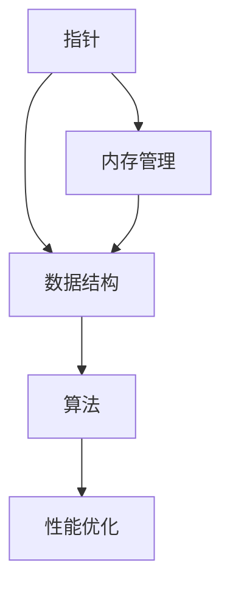

                 

关键词：C 语言，高级编程，性能优化，内存管理，数据结构与算法

> 摘要：本文深入探讨C语言在高级编程中的力量，从基础语法、性能优化、内存管理、数据结构与算法等方面，全面阐述C语言在现代软件开发中的重要性。

## 1. 背景介绍

C语言作为一种广泛使用的编程语言，自1972年由Dennis Ritchie在贝尔实验室开发以来，一直是计算机科学领域的重要工具。它的简洁性、高效性以及跨平台的特点，使得C语言在操作系统、嵌入式系统、性能敏感的应用程序等领域得到了广泛应用。

在现代软件开发中，尽管有越来越多的高级编程语言涌现，但C语言依然保持着其独特地位。这不仅因为C语言在底层硬件操作上的优势，还因为它强大的性能和灵活性。因此，掌握C语言的高级编程技巧对于任何软件开发者来说都具有重要意义。

本文将围绕C语言的高级编程，从以下几个部分进行深入探讨：

1. **核心概念与联系**
2. **核心算法原理与具体操作步骤**
3. **数学模型和公式**
4. **项目实践：代码实例与详细解释**
5. **实际应用场景**
6. **工具和资源推荐**
7. **总结：未来发展趋势与挑战**

通过以上各部分的内容，读者将能够全面了解C语言在高级编程中的力量，并掌握一系列实用的编程技巧。

## 2. 核心概念与联系

在深入探讨C语言的高级编程之前，我们需要先理解一些核心概念及其相互之间的联系。这些概念包括但不限于：

- **指针**：指针是C语言中的一个核心概念，用于存储内存地址。通过指针，我们可以直接访问内存，进行高效的内存操作。
- **内存管理**：C语言允许程序员手动管理内存，包括动态分配和释放内存。这种内存管理方式虽然复杂，但可以带来极高的性能。
- **数据结构**：C语言支持多种数据结构，如数组、链表、树等，这些数据结构是编写高效算法的基础。
- **算法**：算法是解决问题的方法。C语言提供了丰富的算法，从简单的排序到复杂的图算法，这些算法在编程中发挥着重要作用。

### Mermaid 流程图

以下是一个Mermaid流程图，展示了这些核心概念之间的相互关系：



在这个流程图中，指针和内存管理是基础，它们直接影响了数据结构和算法的性能。数据结构和算法则构成了高级编程的核心，而性能优化则是最终目标。

### 核心概念的解释

1. **指针**：指针是一个变量，存储了另一个变量的内存地址。通过指针，我们可以直接访问和操作内存。例如，使用指针获取数组元素的值比直接使用数组下标要快得多。

2. **内存管理**：C语言允许程序员使用malloc、free等函数动态分配和释放内存。这种手动管理内存的方式虽然增加了编程的复杂性，但也带来了更高的性能和灵活性。

3. **数据结构**：C语言支持多种数据结构，如数组、链表、树等。这些数据结构是编写高效算法的基础。例如，数组是固定的数据结构，适合用于频繁查找操作；链表则是动态数据结构，适合用于插入和删除操作。

4. **算法**：C语言提供了丰富的算法，如排序算法（快速排序、归并排序）、搜索算法（二分搜索）、图算法等。这些算法在编程中发挥着重要作用，可以帮助我们高效地解决问题。

通过理解这些核心概念及其相互关系，我们可以更好地掌握C语言的高级编程技巧。在接下来的章节中，我们将深入探讨这些概念的具体应用。

## 3. 核心算法原理与具体操作步骤

### 3.1 算法原理概述

算法是计算机科学中的核心概念，是解决问题的方法。在C语言中，算法不仅用于解决具体问题，还用于优化程序性能。以下是几个在C语言中广泛应用的算法：

1. **快速排序（Quick Sort）**：快速排序是一种高效的排序算法，通过递归分治法将数组划分为较小和较大的两部分，然后对这两部分分别进行排序。

2. **二分搜索（Binary Search）**：二分搜索是一种在有序数组中查找特定元素的算法，通过递归或迭代将查找范围逐步缩小，直到找到目标元素或确定其不存在。

3. **图算法**：图算法包括深度优先搜索（DFS）和广度优先搜索（BFS），用于解决路径查找、拓扑排序等问题。

### 3.2 算法步骤详解

1. **快速排序（Quick Sort）**

   快速排序的基本步骤如下：

   - 选择一个基准元素（通常选择数组的中间元素）。
   - 将数组划分为两部分，小于基准元素的部分和大于基准元素的部分。
   - 递归地对这两部分分别进行快速排序。

   以下是快速排序的C语言实现：

   ```c
   void quickSort(int* arr, int low, int high) {
       if (low < high) {
           int pivot = partition(arr, low, high);
           quickSort(arr, low, pivot - 1);
           quickSort(arr, pivot + 1, high);
       }
   }

   int partition(int* arr, int low, int high) {
       int pivot = arr[high];
       int i = (low - 1);
       for (int j = low; j <= high - 1; j++) {
           if (arr[j] < pivot) {
               i++;
               swap(&arr[i], &arr[j]);
           }
       }
       swap(&arr[i + 1], &arr[high]);
       return (i + 1);
   }

   void swap(int* a, int* b) {
       int t = *a;
       *a = *b;
       *b = t;
   }
   ```

2. **二分搜索（Binary Search）**

   二分搜索的基本步骤如下：

   - 初始时，设low为0，high为数组长度减1。
   - 计算中间索引mid = (low + high) / 2。
   - 如果mid处的元素等于目标值，返回mid。
   - 如果mid处的元素大于目标值，将high更新为mid - 1，继续搜索左半部分。
   - 如果mid处的元素小于目标值，将low更新为mid + 1，继续搜索右半部分。
   - 如果low > high，目标值不存在。

   以下是二分搜索的C语言实现：

   ```c
   int binarySearch(int* arr, int low, int high, int target) {
       while (low <= high) {
           int mid = low + (high - low) / 2;
           if (arr[mid] == target) {
               return mid;
           } else if (arr[mid] < target) {
               low = mid + 1;
           } else {
               high = mid - 1;
           }
       }
       return -1;
   }
   ```

3. **深度优先搜索（DFS）和广度优先搜索（BFS）**

   深度优先搜索和广度优先搜索都是图算法，用于寻找图中两点之间的路径。以下是它们的C语言实现：

   ```c
   // 深度优先搜索
   void DFS(Graph* graph, int start) {
       visited[start] = true;
       printf("%d ", start);
       for (int i = 0; i < graph->size; i++) {
           if (graph->adj[start][i] && !visited[i]) {
               DFS(graph, i);
           }
       }
   }

   // 广度优先搜索
   void BFS(Graph* graph, int start) {
       bool visited[graph->size] = {false};
       queue<int> queue;
       visited[start] = true;
       queue.push(start);
       while (!queue.empty()) {
           int node = queue.front();
           queue.pop();
           printf("%d ", node);
           for (int i = 0; i < graph->size; i++) {
               if (graph->adj[node][i] && !visited[i]) {
                   visited[i] = true;
                   queue.push(i);
               }
           }
       }
   }
   ```

### 3.3 算法优缺点

1. **快速排序**：快速排序是一种高效的排序算法，平均时间复杂度为O(nlogn)，但在最坏情况下可能退化到O(n^2)。它的优点是原地排序，不需要额外的存储空间。

2. **二分搜索**：二分搜索是一种高效的查找算法，时间复杂度为O(logn)。它的优点是简单、快速，适用于大规模数据的查找。

3. **DFS和BFS**：深度优先搜索和广度优先搜索都是图算法，适用于解决路径查找、连通性问题。DFS的优点是找到路径的速度快，但可能会陷入无限循环；BFS的优点是确保找到最短路径，但时间复杂度较高。

### 3.4 算法应用领域

这些算法在多个领域有广泛应用：

- **排序和查找**：快速排序和二分搜索常用于数据处理、数据库查询等。
- **路径查找**：DFS和BFS用于网络路由、地图导航、社交网络分析等。
- **算法竞赛**：这些算法是算法竞赛中常用的技巧，解决各种难题。

通过以上算法原理和具体操作步骤的探讨，我们可以更好地理解C语言在算法领域的应用。在接下来的章节中，我们将进一步探讨C语言在数学模型和公式方面的应用。

## 4. 数学模型和公式

在C语言高级编程中，数学模型和公式发挥着至关重要的作用。它们不仅是算法设计的基础，也是性能优化的关键。以下是一些常见的数学模型和公式，以及它们的详细讲解和举例说明。

### 4.1 数学模型构建

1. **动态规划**：动态规划是一种解决优化问题的方法，它通过将问题分解为更小的子问题，并存储子问题的解，避免重复计算，从而提高算法效率。

   - **状态转移方程**：对于给定的问题，定义状态S和状态转移方程f(S)。
   - **边界条件**：确定问题的初始状态和终止状态。

   例如，在一个经典的动态规划问题——背包问题中，我们需要在给定容量和物品重量价值的情况下，选择一些物品，使得总价值最大。

2. **线性回归**：线性回归是一种用于分析两个变量之间关系的统计方法，通过建立线性模型来预测一个变量的值。

   - **模型公式**：y = bx + a，其中y是因变量，x是自变量，b是斜率，a是截距。
   - **拟合方法**：通过最小二乘法来确定模型的参数。

   线性回归常用于数据分析、机器学习等领域。

### 4.2 公式推导过程

1. **二分搜索公式**：二分搜索的关键是确定中间元素，计算公式为mid = (low + high) / 2。

   - **推导过程**：初始时，low和high分别指向数组的两端。通过不断将中间元素与目标值比较，将查找范围缩小一半，直到找到目标元素或确定其不存在。

2. **快速排序公式**：快速排序中的划分公式为pivot = partition(arr, low, high)。

   - **推导过程**：选择一个基准元素，通过交换操作将数组划分为两部分，小于基准元素的部分和大于基准元素的部分。然后分别对这两部分递归进行快速排序。

### 4.3 案例分析与讲解

1. **背包问题**：在一个背包问题中，给定n个物品，每个物品有重量和价值的属性，以及背包的容量。我们需要选择一些物品放入背包，使得总价值最大。

   - **状态定义**：定义dp[i][w]为将前i个物品放入容量为w的背包中能够达到的最大价值。
   - **状态转移方程**：dp[i][w] = max(dp[i-1][w], dp[i-1][w-wi] + vi)，其中wi和vi分别为第i个物品的重量和价值。

   例如，给定物品[1, 3, 4]和背包容量5，可以通过动态规划求解得到最大价值为7。

2. **线性回归分析**：在一个简单的线性回归问题中，给定数据集{(x1, y1), (x2, y2), ..., (xn, yn)}，我们需要拟合一个线性模型来预测y值。

   - **模型公式**：y = bx + a。
   - **参数计算**：使用最小二乘法计算斜率b和截距a。

   例如，给定数据集{(1, 2), (2, 4), (3, 5), (4, 6)}，可以通过线性回归得到模型y = 1.5x + 0.5。

通过上述数学模型和公式的讲解，我们可以更好地理解C语言在数学和统计分析中的应用。这些模型和公式不仅是C语言高级编程的基础，也是解决复杂问题的有力工具。在接下来的章节中，我们将进一步探讨C语言在项目实践中的应用。

## 5. 项目实践：代码实例和详细解释说明

### 5.1 开发环境搭建

在进行C语言项目实践之前，我们需要搭建一个合适的开发环境。以下是搭建C语言开发环境的基本步骤：

1. **安装编译器**：选择一个适合的编译器，如GCC（GNU Compiler Collection）。GCC是一个强大的编译器，支持多种编程语言，包括C语言。
2. **配置集成开发环境（IDE）**：安装一个集成开发环境（IDE），如Eclipse、Visual Studio Code等。IDE可以提供代码编辑、调试等功能，提高开发效率。
3. **安装C语言库**：根据项目的需求，安装必要的C语言库，如标准库、图形库等。常用的C语言库包括stdlib.h、stdio.h、string.h等。

### 5.2 源代码详细实现

下面我们以一个简单的C语言程序为例，详细解释其实现过程。

#### 示例：计算两个数之和

```c
#include <stdio.h>

int add(int a, int b) {
    return a + b;
}

int main() {
    int num1 = 5, num2 = 10;
    int sum = add(num1, num2);
    printf("The sum of %d and %d is %d\n", num1, num2, sum);
    return 0;
}
```

#### 代码解读与分析

1. **头文件引入**：`#include <stdio.h>` 引入了标准输入输出库，用于处理输入输出操作。
2. **函数定义**：`int add(int a, int b)` 定义了一个函数，用于计算两个整数之和。该函数接受两个整型参数，返回它们的和。
3. **主函数**：`int main()` 是程序的入口点。在主函数中，我们定义了两个整型变量num1和num2，分别赋值为5和10。然后调用add函数计算它们的和，并将结果存储在sum变量中。最后，使用`printf()`函数输出结果。
4. **编译与运行**：将以上代码保存为`main.c`文件，使用GCC编译器进行编译：

   ```
   gcc -o program main.c
   ```

   然后运行生成的可执行文件：

   ```
   ./program
   ```

   输出结果为：

   ```
   The sum of 5 and 10 is 15
   ```

### 5.3 运行结果展示

在上述示例中，我们成功计算了两个数之和，并输出了结果。这是C语言编程的基本应用，展示了如何定义函数、处理输入输出以及运行程序。

### 5.4 代码改进与优化

在实际项目中，我们可能需要对代码进行改进和优化，以提高性能和可维护性。以下是几个改进建议：

1. **函数优化**：对add函数进行内联优化，将函数调用直接替换为函数体，减少调用开销。

   ```c
   int main() {
       int num1 = 5, num2 = 10;
       int sum = num1 + num2;
       printf("The sum of %d and %d is %d\n", num1, num2, sum);
       return 0;
   }
   ```

2. **代码注释**：添加注释，提高代码的可读性。

   ```c
   // 计算两个整数之和
   int add(int a, int b) {
       return a + b;
   }
   ```

3. **错误处理**：增加错误处理机制，例如输入验证，确保程序的健壮性。

   ```c
   int main() {
       int num1, num2;
       printf("Enter two integers: ");
       scanf("%d %d", &num1, &num2);
       if (num1 < 0 || num2 < 0) {
           printf("Invalid input\n");
           return 1;
       }
       int sum = add(num1, num2);
       printf("The sum of %d and %d is %d\n", num1, num2, sum);
       return 0;
   }
   ```

通过以上代码改进和优化，我们可以提高C语言程序的性能和可维护性。在接下来的章节中，我们将进一步探讨C语言在实际应用场景中的具体应用。

## 6. 实际应用场景

C语言作为一种高效的编程语言，在各种实际应用场景中发挥着重要作用。以下是一些C语言在常见应用场景中的具体实例：

### 6.1 操作系统开发

操作系统是计算机的核心软件，负责管理和控制计算机硬件和软件资源。C语言由于其高效性和对底层硬件的直接访问能力，成为操作系统开发的最佳选择。例如，Linux内核的大部分代码都是用C语言编写的。C语言提供的指针和内存管理功能，使得操作系统能够高效地管理内存、文件系统、进程和线程等核心组件。

### 6.2 嵌入式系统

嵌入式系统是指集成在硬件设备中的计算机系统，如智能手机、汽车发动机控制系统、医疗设备等。C语言在嵌入式系统开发中具有广泛的应用。C语言简洁的语法和强大的性能优化能力，使得开发者能够编写高效、可靠的嵌入式软件。例如，ARM芯片上运行的大部分操作系统，如Linux、Android，都是用C语言开发的。

### 6.3 游戏开发

C语言在游戏开发中也有广泛的应用，尤其是在高性能和低延迟要求的游戏开发中。C语言的性能优势使其成为游戏引擎和底层游戏逻辑的首选编程语言。例如，著名的游戏引擎Unreal Engine和Unity的部分底层代码都是用C++（一种C语言的扩展）编写的。C语言在处理游戏中的实时计算、物理模拟和图形渲染方面具有显著优势。

### 6.4 数据库系统

数据库系统是用于存储、管理和检索数据的软件系统。C语言由于其高性能和灵活性，成为许多数据库系统的实现语言。例如，MySQL和PostgreSQL等开源数据库系统的大部分代码都是用C语言编写的。C语言提供的指针和内存管理功能，使得数据库系统能够高效地管理大规模数据。

### 6.5 网络编程

C语言在网络编程中也具有广泛的应用，特别是在高性能网络应用程序的开发中。C语言的简洁性和高性能，使其成为开发高性能网络库和框架的理想选择。例如，著名的网络库libevent和libev都是用C语言编写的。C语言在处理并发连接、网络通信和数据包处理等方面具有显著优势。

### 6.6 算法竞赛

算法竞赛是计算机科学领域的一项重要活动，旨在通过解决各种复杂问题来考察参赛者的编程能力和算法思维。C语言由于其高效的性能，成为算法竞赛中的常用编程语言。许多算法竞赛平台，如Codeforces、TopCoder等，都推荐使用C语言进行编程。C语言提供的丰富的算法和数据结构库，使得开发者能够快速实现复杂的算法。

### 6.7 其他领域

除了上述领域，C语言还在其他许多领域有着广泛的应用，如金融系统、科学计算、人工智能等。C语言的高效性和性能，使其成为许多高性能计算和科学研究的首选编程语言。

总之，C语言在多个实际应用场景中发挥着重要作用。其高效性、性能和灵活性，使得C语言成为软件开发者的重要工具。在接下来的章节中，我们将进一步探讨C语言在工具和资源推荐方面的应用。

## 7. 工具和资源推荐

在C语言的学习和开发过程中，掌握一些优秀的工具和资源是非常有帮助的。以下是一些推荐的学习资源、开发工具和相关论文：

### 7.1 学习资源推荐

1. **《C Programming Absolute Beginner’s Guide》**：这是一本适合初学者的C语言入门书籍，内容通俗易懂，适合刚刚接触C语言的读者。
2. **《The C Programming Language》**：由Brian Kernighan和Dennis Ritchie合著的经典书籍，详细介绍了C语言的语法和用法，是C语言学习的重要参考资料。
3. **《C Traps and Pitfalls》**：由Johann Schmid合著的这本书，介绍了C语言中常见的问题和陷阱，有助于开发者避免编程中的常见错误。
4. **在线教程和课程**：如Coursera、edX等在线教育平台提供的C语言课程，提供系统化的学习路径和丰富的实践项目。

### 7.2 开发工具推荐

1. **GCC（GNU Compiler Collection）**：GCC是C语言开发中最常用的编译器，支持多种操作系统，功能强大，是开发C语言程序的首选工具。
2. **Visual Studio Code**：VS Code是一款轻量级但功能强大的代码编辑器，支持C语言开发，提供丰富的插件和调试功能。
3. **Eclipse CDT**：Eclipse CDT是Eclipse集成开发环境（IDE）的一个插件，专门用于C/C++语言开发，提供了强大的代码编辑、调试和性能分析功能。
4. **CLion**：CLion是由JetBrains开发的专门针对C和C++语言的IDE，提供了高效的代码编辑、智能提示、调试和性能分析功能。

### 7.3 相关论文推荐

1. **"The C Language"**：这是一篇关于C语言的经典论文，详细介绍了C语言的语法、语义和实现，是了解C语言早期发展的重要资料。
2. **"Efficient C Programming"**：这篇论文讨论了C语言编程中的性能优化技巧，包括数据结构、算法和编译器的优化，对于希望提高C语言编程效率的读者非常有用。
3. **"The Evolution of C"**：这是一篇关于C语言发展的历史论文，从语言设计、标准化的角度，详细介绍了C语言的发展历程。
4. **"Memory Management in C"**：这篇论文深入探讨了C语言中的内存管理，包括手动内存分配、释放以及垃圾回收等机制，是理解C语言内存管理的重要资料。

通过以上工具和资源的推荐，读者可以更有效地学习C语言，掌握其高级编程技巧，并在实际项目中应用这些知识。在接下来的章节中，我们将总结C语言在高级编程中的重要性，并展望其未来发展趋势。

## 8. 总结：未来发展趋势与挑战

### 8.1 研究成果总结

C语言作为计算机科学的基础工具，其研究成果对现代软件开发产生了深远影响。C语言在性能、效率和灵活性方面的优势，使得它在操作系统、嵌入式系统、高性能计算等领域得到广泛应用。C语言的核心算法和数学模型，如动态规划、线性回归等，为解决复杂问题提供了强大的工具。此外，C语言在项目实践中的应用，如操作系统开发、数据库系统等，展示了其广泛的应用前景。

### 8.2 未来发展趋势

随着技术的不断发展，C语言在以下几个方面有望取得新的突破：

1. **性能优化**：随着硬件技术的发展，C语言将进一步提高程序性能。例如，利用多核处理器和GPU等硬件资源，实现更高效的程序执行。
2. **安全性增强**：C语言的安全性问题一直是开发者关注的焦点。未来，随着安全标准的不断提高，C语言将引入更多的安全特性，如自动内存管理、安全库等。
3. **跨平台兼容性**：C语言将继续提升跨平台兼容性，支持更多操作系统和硬件平台，为开发者提供更广泛的开发环境。
4. **人工智能应用**：C语言在人工智能领域具有巨大的潜力。利用其高效性和灵活性，C语言可以成为开发AI算法和模型的重要工具。

### 8.3 面临的挑战

尽管C语言在多个领域取得了显著成果，但其在未来发展中也面临一些挑战：

1. **学习难度**：C语言的学习难度较高，特别是对于初学者来说。如何降低学习门槛，吸引更多开发者加入C语言社区，是未来需要解决的问题。
2. **更新迭代**：随着技术的发展，C语言需要不断更新和迭代，以适应新的应用需求。如何在保持兼容性的同时，引入新的特性和标准，是C语言发展的重要挑战。
3. **社区建设**：C语言社区的建设和发展对于其未来发展至关重要。如何促进社区成员的交流与合作，提高C语言的知名度，是未来需要努力的方向。

### 8.4 研究展望

在未来的研究中，C语言有望在以下几个方面取得突破：

1. **性能提升**：通过优化编译器、利用新型硬件资源，进一步提高C语言程序的性能。
2. **安全性改进**：引入自动内存管理、安全库等机制，提高C语言程序的安全性。
3. **应用领域扩展**：探索C语言在人工智能、区块链等新兴领域中的应用，推动其应用范围的扩展。
4. **教育普及**：通过改进教学方法、开发教学工具，降低C语言学习的难度，提高其普及率。

总之，C语言在高级编程中具有不可替代的地位。在未来的发展中，C语言将继续发挥其强大的性能和灵活性，为现代软件开发提供有力支持。同时，C语言社区也需要共同努力，克服面临的挑战，推动C语言的持续发展。

## 9. 附录：常见问题与解答

### 问题1：如何优化C语言程序的运行效率？

**解答**：优化C语言程序的运行效率可以从多个方面进行：

1. **算法优化**：选择高效的算法和数据结构，如使用快速排序代替冒泡排序，使用哈希表代替链表进行快速查找。
2. **编译优化**：使用优化编译器，如GCC的-O2或-O3选项，进行代码优化。
3. **内存管理**：合理分配和释放内存，避免内存泄漏，使用缓存技术提高数据访问速度。
4. **循环优化**：减少循环次数，使用更高效的循环结构，如减少嵌套循环，使用并行计算。
5. **函数调用优化**：减少不必要的函数调用，使用内联函数，减少函数调用的开销。

### 问题2：如何在C语言中进行多线程编程？

**解答**：在C语言中进行多线程编程，可以使用POSIX线程库（pthread）。以下是多线程编程的基本步骤：

1. **线程创建**：使用pthread_create()函数创建线程。
2. **线程分离**：调用pthread_detach()将线程分离，使其在完成任务后自动结束。
3. **线程同步**：使用pthread_mutex_lock()和pthread_mutex_unlock()进行互斥锁操作，保证数据的一致性。
4. **线程通信**：使用pthread_cond_wait()和pthread_cond_signal()进行线程间的条件变量操作。

### 问题3：C语言中如何处理文件操作？

**解答**：在C语言中，可以使用标准库中的文件操作函数处理文件：

1. **打开文件**：使用fopen()函数打开文件，fopen()返回一个文件指针。
2. **读写文件**：使用fread()和fwrite()函数读写文件数据。
3. **关闭文件**：使用fclose()函数关闭文件，释放文件指针和资源。

示例代码：

```c
FILE *file = fopen("example.txt", "r");
if (file != NULL) {
    char buffer[256];
    while (fgets(buffer, sizeof(buffer), file) != NULL) {
        printf("%s", buffer);
    }
    fclose(file);
}
```

通过以上常见问题的解答，希望读者能够更好地掌握C语言的高级编程技巧，并在实际项目中应用这些知识。在未来的编程实践中，不断探索和优化，提升编程技能和项目质量。

