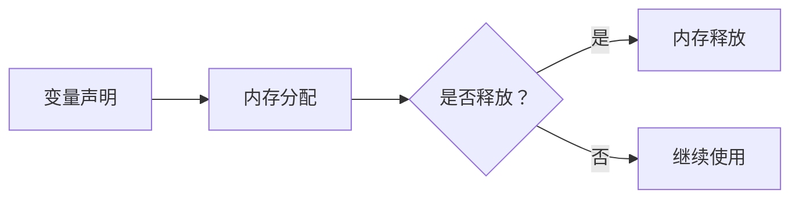
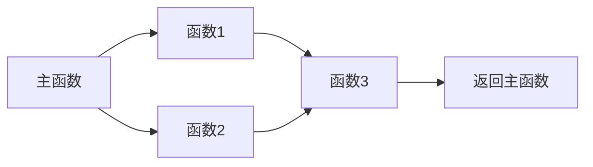

                 

关键词：高级编程、C 语言、编译原理、操作系统、算法优化、并发编程、性能调优

> 摘要：本文旨在深入探讨C语言在高级编程中的广泛应用与独特优势，包括其在编译原理、操作系统开发、算法优化、并发编程以及性能调优等领域的实际应用。通过具体的算法原理分析、数学模型讲解和项目实践实例，我们希望能为读者提供全面的C语言编程指导，帮助其在现代软件工程中充分发挥C语言的力量。

## 1. 背景介绍

C语言，作为一种广泛使用的编程语言，自1972年由Dennis Ritchie在贝尔实验室发明以来，已经经历了数十年的发展和演变。它不仅是历史上第一个广泛使用的编译型语言，也是现代计算机编程的重要基础之一。C语言以其强大的性能、高度的灵活性和可移植性，在操作系统开发、嵌入式系统、系统编程、高性能计算等领域占据了重要的地位。

本文将主要从以下几个方面探讨C语言的力量：

- **编译原理与性能优化**：深入分析C语言的编译原理及其对性能优化的影响。
- **操作系统开发**：探讨C语言在操作系统内核和系统调用中的应用。
- **算法优化**：介绍C语言在常见算法中的性能表现及其优化策略。
- **并发编程**：讲解C语言在多线程编程和并发处理中的使用。
- **性能调优**：探讨如何使用C语言进行代码性能分析和优化。

## 2. 核心概念与联系

### 2.1. C语言的编译过程

C语言的编译过程主要包括以下几个步骤：

1. **预处理**：处理以`#`开头的预处理指令，如宏定义、文件包含等。
2. **编译**：将预处理后的代码转换为汇编语言。
3. **汇编**：将汇编代码转换为机器代码。
4. **链接**：将编译生成的目标文件链接成可执行程序。

下面是一个简单的Mermaid流程图，展示了C语言的编译过程：


### 2.2. C语言的数据类型与内存管理

C语言的数据类型包括基本数据类型、复合数据类型和指针。其中，指针是C语言的重要特性之一，它允许程序员直接操作内存，进行高效的内存管理。内存管理的关键在于理解内存分配与释放，以及如何避免内存泄漏和悬挂指针。

下面是一个展示C语言内存管理的基本流程的Mermaid流程图：



### 2.3. C语言的函数与模块化编程

C语言的函数提供了代码重用和模块化编程的机制。通过函数，程序员可以将复杂的任务分解为较小的、可管理的部分，从而提高代码的可读性和可维护性。模块化编程不仅有助于代码组织，还有助于降低系统复杂度。

下面是一个简单的Mermaid流程图，展示了C语言函数的基本调用流程：



## 3. 核心算法原理 & 具体操作步骤

### 3.1. 算法原理概述

C语言因其高效的性能，常被用于实现各种算法。本节将介绍几种常见的算法原理及其在C语言中的实现：

1. **排序算法**：包括冒泡排序、快速排序、归并排序等。
2. **搜索算法**：包括线性搜索、二分搜索等。
3. **图算法**：包括深度优先搜索、广度优先搜索等。
4. **动态规划**：用于解决最优化问题，如背包问题、最长公共子序列等。

### 3.2. 算法步骤详解

以冒泡排序算法为例，其基本步骤如下：

1. **初始化**：从第一个元素开始，比较相邻的两个元素，如果它们的顺序错误就交换它们。
2. **遍历**：重复步骤1，直到没有需要交换的元素为止。
3. **结束**：此时，数组已按升序排列。

下面是C语言中冒泡排序的代码实现：

```c
void bubbleSort(int arr[], int n) {
    for (int i = 0; i < n-1; i++) {
        for (int j = 0; j < n-i-1; j++) {
            if (arr[j] > arr[j+1]) {
                int temp = arr[j];
                arr[j] = arr[j+1];
                arr[j+1] = temp;
            }
        }
    }
}
```

### 3.3. 算法优缺点

- **冒泡排序**：
  - **优点**：实现简单，易于理解。
  - **缺点**：时间复杂度为O(n^2)，对于大数据集性能较差。

### 3.4. 算法应用领域

C语言因其高效的性能，常用于高性能计算、游戏开发、嵌入式系统等领域。在算法应用方面，C语言可用于实现各种复杂算法，如机器学习算法、图形渲染算法等。

## 4. 数学模型和公式 & 详细讲解 & 举例说明

### 4.1. 数学模型构建

在算法设计中，数学模型是非常重要的工具。以下是一个常见的数学模型——动态规划中的背包问题：

设有一组物品，每个物品有一个重量和一个价值。我们需要在不超过给定重量的前提下，选择若干物品，使得总价值最大。

### 4.2. 公式推导过程

背包问题的动态规划解法基于如下状态转移方程：

\[ dp[i][j] = \begin{cases} 
j & \text{如果 } i = 0 \text{ 或 } j = 0 \\
\max(dp[i-1][j], dp[i-1][j-w[i]] + v[i]) & \text{否则}
\end{cases} \]

其中，\( dp[i][j] \) 表示在前 \( i \) 个物品中选择若干物品，使得总重量不超过 \( j \) 时，所能获得的最大价值。

### 4.3. 案例分析与讲解

假设我们有4个物品，重量分别为2kg、3kg、4kg和5kg，价值分别为6元、10元、15元和20元。背包的最大承重为8kg。使用动态规划求解背包问题的步骤如下：

1. **初始化**：创建一个二维数组 \( dp[4+1][8+1] \)，并初始化第一行和第一列的元素。
2. **状态转移**：根据状态转移方程，依次计算每个状态 \( dp[i][j] \) 的值。
3. **结果提取**：找到 \( dp[4][8] \) 的值，即为最优解。

以下是C语言中动态规划求解背包问题的代码实现：

```c
#include <stdio.h>

int max(int a, int b) {
    return a > b ? a : b;
}

int knapsack(int weights[], int values[], int n, int W) {
    int dp[n+1][W+1];
    for (int i = 0; i <= n; i++) {
        for (int j = 0; j <= W; j++) {
            if (i == 0 || j == 0) {
                dp[i][j] = 0;
            } else if (weights[i-1] <= j) {
                dp[i][j] = max(dp[i-1][j], dp[i-1][j-weights[i-1]] + values[i-1]);
            } else {
                dp[i][j] = dp[i-1][j];
            }
        }
    }
    return dp[n][W];
}

int main() {
    int weights[] = {2, 3, 4, 5};
    int values[] = {6, 10, 15, 20};
    int n = sizeof(weights) / sizeof(weights[0]);
    int W = 8;
    printf("Maximum value in knapsack = %d\n", knapsack(weights, values, n, W));
    return 0;
}
```

运行结果为：Maximum value in knapsack = 35。

## 5. 项目实践：代码实例和详细解释说明

### 5.1. 开发环境搭建

要开始使用C语言进行项目实践，首先需要搭建一个合适的开发环境。以下是使用Visual Studio Code作为开发环境的基本步骤：

1. **安装Visual Studio Code**：从官网下载并安装Visual Studio Code。
2. **安装C语言扩展**：在Visual Studio Code的扩展商店中搜索并安装“C/C++”扩展。
3. **配置编译器**：安装适用于你的操作系统的GCC或Clang编译器。

### 5.2. 源代码详细实现

以下是一个简单的C语言项目，用于计算两个数的和。代码如下：

```c
#include <stdio.h>

int add(int a, int b) {
    return a + b;
}

int main() {
    int num1, num2, sum;
    printf("Enter two numbers: ");
    scanf("%d %d", &num1, &num2);
    sum = add(num1, num2);
    printf("Sum = %d\n", sum);
    return 0;
}
```

### 5.3. 代码解读与分析

1. **头文件包含**：`#include <stdio.h>` 用于引入标准输入输出库。
2. **函数定义**：`int add(int a, int b)` 定义了一个计算两个整数之和的函数。
3. **主函数**：`int main()` 是程序的入口点。它读取用户输入的两个整数，调用 `add` 函数计算和，并输出结果。

### 5.4. 运行结果展示

执行以上代码，程序将等待用户输入两个整数。例如，当输入 `3 5` 时，程序输出：

```
Enter two numbers: 3 5
Sum = 8
```

## 6. 实际应用场景

C语言由于其高效性和灵活性，广泛应用于多个实际应用场景：

- **操作系统开发**：C语言是大多数操作系统内核的主要开发语言，如Linux、Windows等。
- **嵌入式系统**：C语言在嵌入式系统中被广泛使用，因为它提供了对硬件的低级别访问和控制。
- **游戏开发**：许多游戏引擎和图形库（如Unreal Engine、Unity）使用C语言进行核心开发。
- **高性能计算**：C语言在科学计算和工程领域被用于实现高性能算法和模型。

### 6.4. 未来应用展望

随着技术的发展，C语言在未来的应用前景依然广阔。以下是几个可能的发展方向：

- **物联网（IoT）**：C语言将在物联网设备中发挥重要作用，因为它能够提供对硬件的精细控制。
- **人工智能**：C语言将被用于实现高效的人工智能算法和模型。
- **云计算**：C语言在云计算平台的优化和性能调优中具有巨大的潜力。

## 7. 工具和资源推荐

### 7.1. 学习资源推荐

- **《C程序设计语言》（K&R）**：经典的C语言入门教材，适合初学者。
- **《C陷阱与缺陷》**：深入探讨C语言的各种陷阱和缺陷，适合有一定基础的程序员。
- **《深入理解计算机系统》（Randal E. Bryant & David R. O’Hallaron）**：从计算机系统的角度全面讲解C语言。

### 7.2. 开发工具推荐

- **Visual Studio Code**：功能强大的跨平台集成开发环境。
- **GCC**：GNU Compiler Collection，广泛使用的C语言编译器。
- **Clang**：由LLVM项目开发的C语言编译器，性能优秀。

### 7.3. 相关论文推荐

- **《编译原理：艺术与科学》（Alfred V. Aho, Monica S. Lam, Ravi Sethi, Jeffrey D. Ullman）**：全面介绍编译原理的经典教材。
- **《操作系统概念》（Abraham Silberschatz, Peter Baer Galvin, Greg Gagne）**：系统讲解操作系统的原理和实现。

## 8. 总结：未来发展趋势与挑战

C语言作为一种历史悠久且功能强大的编程语言，在未来将继续在多个领域发挥重要作用。然而，随着技术的不断进步，C语言也将面临一些挑战：

- **安全性**：C语言由于其灵活性和低级别访问，更容易引入安全漏洞。未来需要更多的研究和工具来提高C语言的安全性。
- **现代化**：随着其他语言（如Java、Python、Go）的兴起，C语言需要不断现代化，以保持其竞争力。
- **生态系统**：C语言需要建立更完善的生态系统，包括标准库、框架和工具，以支持现代开发需求。

总之，C语言在未来仍然具有巨大的发展潜力，通过不断改进和适应，它将继续在计算机科学和技术领域占据重要地位。

## 9. 附录：常见问题与解答

### 9.1. C语言如何进行内存管理？

C语言提供手动内存管理功能，包括动态分配和释放内存。程序员可以使用`malloc()`和`free()`函数进行内存管理。

### 9.2. C语言有哪些常见的数据结构？

C语言常见的数据结构包括数组、结构体、指针、链表、堆栈和队列等。

### 9.3. C语言如何处理多线程编程？

C语言可以通过POSIX线程库（pthread）进行多线程编程。程序员可以使用`pthread_create()`、`pthread_join()`等函数创建和管理线程。

### 9.4. C语言有哪些性能优化技巧？

C语言性能优化包括编写高效的算法、减少内存分配、使用编译器优化选项等。

### 9.5. C语言如何进行并发编程？

C语言可以通过锁机制（如互斥锁、读写锁）和条件变量进行并发编程。程序员可以使用`pthread_mutex_`系列函数进行并发控制。

---

作者：禅与计算机程序设计艺术 / Zen and the Art of Computer Programming

