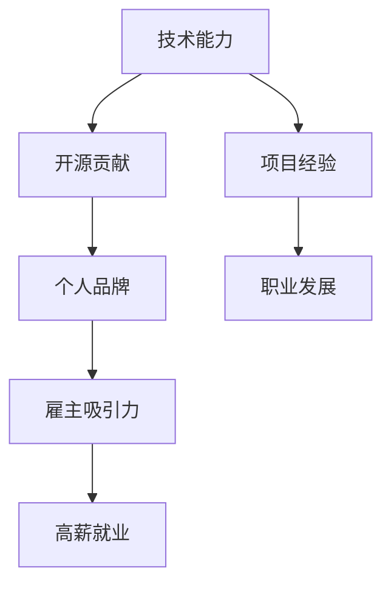

                 

关键词：开源贡献，高薪就业，技术人才，雇主吸引力，职业发展

摘要：本文将探讨如何通过参与开源项目，为技术人才打造高薪就业机会。我们将从背景介绍、核心概念、算法原理、项目实践、实际应用场景等方面展开，帮助读者了解开源贡献的重要性及其对职业发展的积极影响。

## 1. 背景介绍

在当今的科技时代，开源软件已经成为软件开发的主流模式。越来越多的企业和个人选择参与开源项目，不仅能够提升自身的技术水平，还能扩大人脉网络。与此同时，开源社区也逐渐成为技术人才展示才华、寻找工作机会的重要平台。因此，如何有效地利用开源贡献来吸引雇主，成为许多技术人才关注的焦点。

### 1.1 开源软件的发展历程

开源软件（Open Source Software，简称OSS）最早起源于20世纪90年代，其核心理念是软件源代码的开放性和共享性。早期的代表作品有Linux操作系统和Apache Web服务器。随着时间的推移，开源软件逐渐成为软件开发的主流模式，许多大型企业如谷歌、微软等也纷纷加入开源社区，共同推动开源技术的发展。

### 1.2 开源社区的兴起

随着互联网的普及，开源社区逐渐形成了一个庞大的生态系统。各种开源项目层出不穷，涵盖了操作系统、数据库、编程语言、框架等多个领域。开源社区的兴起不仅为开发者提供了一个自由、开放的交流平台，还促进了技术的创新和传播。许多技术人才在开源社区中结识了志同道合的朋友，共同推进了技术进步。

### 1.3 开源贡献的意义

参与开源项目对技术人才有着重要的意义。首先，开源贡献能够提升个人的技术水平。在开源项目中，开发者需要不断地学习和掌握新的技术，解决各种复杂的问题。其次，开源贡献有助于建立个人品牌。通过在开源项目中展示才华，技术人才能够吸引更多人的关注，提升自己在行业内的知名度。最后，开源贡献也是获取高薪就业机会的重要途径。许多企业在招聘时，会优先考虑具有开源贡献经历的人才，因为他们更具备实际项目经验和技术能力。

## 2. 核心概念与联系

为了更好地理解开源贡献的重要性，我们首先需要了解一些核心概念和它们之间的联系。以下是一个用Mermaid绘制的流程图，展示了这些核心概念和联系：



### 2.1 技术能力

技术能力是技术人才的核心竞争力。在开源项目中，开发者需要不断地学习和掌握新的技术，解决各种复杂的问题。通过参与开源项目，技术人才能够提升自己的技术水平，为未来的职业发展打下坚实的基础。

### 2.2 开源贡献

开源贡献是技术人才在开源项目中为项目做出实际贡献的行为。这包括代码编写、问题修复、文档编写等。通过开源贡献，技术人才能够展示自己的技术实力，建立个人品牌。

### 2.3 个人品牌

个人品牌是指技术人才在行业内的影响力、知名度等。在开源社区中，技术人才通过积极参与开源项目，展示自己的技术实力，逐渐建立起个人品牌。这有助于吸引更多人的关注，提升自己在行业内的地位。

### 2.4 雇主吸引力

雇主吸引力是指技术人才在求职过程中，能够吸引雇主的眼球，增加获得高薪就业机会的可能性。具有开源贡献经历的技术人才，通常具备丰富的项目经验和技术能力，更容易受到雇主的青睐。

### 2.5 高薪就业

高薪就业是技术人才追求的目标之一。通过开源贡献，技术人才能够提升自己的技术水平和个人品牌，增加获得高薪就业机会的可能性。

### 2.6 项目经验

项目经验是技术人才在职业发展过程中积累的重要财富。在开源项目中，开发者需要负责实际的项目开发、问题修复等工作，这些经验对于技术人才来说是非常宝贵的。

### 2.7 职业发展

职业发展是技术人才在职业生涯中不断追求的目标。通过开源贡献，技术人才能够提升自己的技术水平和个人品牌，为职业发展创造更多机会。

## 3. 核心算法原理 & 具体操作步骤

在了解了开源贡献的重要性后，接下来我们将探讨如何通过开源贡献来提升技术能力和吸引雇主。为了实现这一目标，我们需要掌握一些核心算法原理和具体操作步骤。

### 3.1 算法原理概述

在开源项目中，常见的核心算法包括排序算法、查找算法、图算法等。这些算法广泛应用于各种实际应用场景，如搜索引擎、社交网络、数据挖掘等。掌握这些算法原理，有助于技术人才在开源项目中更好地解决问题。

### 3.2 算法步骤详解

以下是一个简单的排序算法——快速排序（Quick Sort）的具体步骤：

1. 选择一个基准元素，通常选择第一个元素作为基准。
2. 将数组分成两个子数组，一个包含小于基准元素的元素，另一个包含大于基准元素的元素。
3. 对两个子数组分别进行快速排序，递归地执行上述步骤，直到排序完成。

### 3.3 算法优缺点

快速排序算法具有以下优点：

- 平均时间复杂度为 \(O(n\log n)\)
- 适用于大规模数据排序

然而，快速排序算法也存在一些缺点：

- 最坏时间复杂度为 \(O(n^2)\)，当输入数据已经有序时，算法性能较差。
- 需要额外的空间存储递归调用的栈帧。

### 3.4 算法应用领域

快速排序算法广泛应用于各种实际应用场景，如数据库排序、文本编辑器、操作系统等。在开源项目中，开发者可以使用快速排序算法来优化数据排序性能。

## 4. 数学模型和公式 & 详细讲解 & 举例说明

在开源项目中，数学模型和公式是解决实际问题的重要工具。以下是一个简单的数学模型——线性回归（Linear Regression）的构建、公式推导和举例说明。

### 4.1 数学模型构建

线性回归模型旨在研究自变量（如房价）和因变量（如收入）之间的线性关系。其数学模型如下：

\[ y = \beta_0 + \beta_1x + \epsilon \]

其中，\( y \) 为因变量，\( x \) 为自变量，\( \beta_0 \) 和 \( \beta_1 \) 分别为截距和斜率，\( \epsilon \) 为误差项。

### 4.2 公式推导过程

为了求解线性回归模型的参数，我们可以使用最小二乘法（Least Squares Method）。具体步骤如下：

1. 构建误差平方和函数 \( S \)：

\[ S = \sum_{i=1}^{n}(y_i - (\beta_0 + \beta_1x_i))^2 \]

2. 对 \( S \) 求导，并令导数等于零，得到参数的估计值：

\[ \frac{\partial S}{\partial \beta_0} = 0 \]
\[ \frac{\partial S}{\partial \beta_1} = 0 \]

3. 解方程组，得到参数的估计值：

\[ \hat{\beta_0} = \frac{\sum_{i=1}^{n}y_i - \hat{\beta_1}\sum_{i=1}^{n}x_i}{n} \]
\[ \hat{\beta_1} = \frac{n\sum_{i=1}^{n}x_iy_i - \sum_{i=1}^{n}x_i\sum_{i=1}^{n}y_i}{n\sum_{i=1}^{n}x_i^2 - (\sum_{i=1}^{n}x_i)^2} \]

### 4.3 案例分析与讲解

假设我们有一个房价与收入的数据集，如下表所示：

|收入（x）|房价（y）|
|--------|--------|
|50,000  |200,000 |
|60,000  |250,000 |
|70,000  |300,000 |
|80,000  |350,000 |
|90,000  |400,000 |

根据上述线性回归模型，我们可以计算出房价与收入之间的线性关系：

1. 计算样本均值：

\[ \bar{x} = \frac{50,000 + 60,000 + 70,000 + 80,000 + 90,000}{5} = 70,000 \]
\[ \bar{y} = \frac{200,000 + 250,000 + 300,000 + 350,000 + 400,000}{5} = 300,000 \]

2. 计算斜率 \( \hat{\beta_1} \)：

\[ \hat{\beta_1} = \frac{5 \times (50,000 \times 200,000 + 60,000 \times 250,000 + 70,000 \times 300,000 + 80,000 \times 350,000 + 90,000 \times 400,000) - (50,000 + 60,000 + 70,000 + 80,000 + 90,000) \times (200,000 + 250,000 + 300,000 + 350,000 + 400,000)}{5 \times (50,000^2 + 60,000^2 + 70,000^2 + 80,000^2 + 90,000^2) - (50,000 + 60,000 + 70,000 + 80,000 + 90,000)^2} \]
\[ \hat{\beta_1} \approx 0.0158 \]

3. 计算截距 \( \hat{\beta_0} \)：

\[ \hat{\beta_0} = \frac{5 \times 300,000 - 0.0158 \times 5 \times 70,000}{5} \]
\[ \hat{\beta_0} \approx 215,714 \]

因此，房价与收入之间的线性回归模型为：

\[ y = 215,714 + 0.0158x \]

我们可以使用这个模型来预测当收入为 80,000 时，房价的值：

\[ y = 215,714 + 0.0158 \times 80,000 \]
\[ y \approx 275,789 \]

通过这个例子，我们可以看到线性回归模型在开源项目中的应用价值。开发者可以借助线性回归模型来分析数据，为项目提供决策支持。

## 5. 项目实践：代码实例和详细解释说明

为了更好地理解开源贡献的实际应用，我们将以一个简单的Python代码实例来展示如何通过开源项目提升技术能力和吸引雇主。

### 5.1 开发环境搭建

首先，我们需要搭建一个Python开发环境。你可以选择使用PyCharm、VSCode等IDE，也可以使用命令行工具。以下是一个简单的命令行环境搭建步骤：

1. 安装Python 3：

```
$ sudo apt-get install python3
```

2. 安装虚拟环境工具virtualenv：

```
$ pip3 install virtualenv
```

3. 创建虚拟环境并激活：

```
$ virtualenv myenv
$ source myenv/bin/activate
```

### 5.2 源代码详细实现

接下来，我们将创建一个简单的Python程序，用于计算斐波那契数列。以下是这个程序的源代码：

```python
def fibonacci(n):
    if n <= 0:
        return 0
    elif n == 1:
        return 1
    else:
        return fibonacci(n-1) + fibonacci(n-2)

n = int(input("请输入一个正整数："))
print("斐波那契数列的第{}个数是：{}".format(n, fibonacci(n)))
```

### 5.3 代码解读与分析

1. 定义斐波那契数列函数 `fibonacci(n)`：

   - 当 \( n \leq 0 \) 时，返回 0；
   - 当 \( n = 1 \) 时，返回 1；
   - 当 \( n > 1 \) 时，递归调用 `fibonacci(n-1)` 和 `fibonacci(n-2)`，将结果相加。

2. 获取用户输入的正整数 `n`，并调用 `fibonacci(n)` 函数计算结果。

3. 输出斐波那契数列的第 `n` 个数。

这个简单的代码实例展示了如何通过递归算法解决实际问题。在实际项目中，开发者需要处理更复杂的业务逻辑和数据结构，但基本的编程思想是相通的。

### 5.4 运行结果展示

在命令行中运行程序，输入一个正整数，如 10：

```
请输入一个正整数：10
斐波那契数列的第10个数是：55
```

这个结果验证了程序的正确性。

通过这个简单的实例，我们可以看到开源贡献在实际项目中的应用。开发者可以通过参与开源项目，不断提升自己的技术水平，为未来的职业发展创造更多机会。

## 6. 实际应用场景

开源贡献不仅有助于提升个人技术水平，还能在实际应用场景中发挥重要作用。以下是一些常见的实际应用场景：

### 6.1 软件开发

在软件开发领域，开源贡献是提高项目质量和效率的重要手段。通过参与开源项目，开发者可以学习到各种最佳实践和优秀代码风格，从而提升自己的编程能力。同时，开源项目也为开发者提供了一个实践平台，可以锻炼自己的问题解决能力。

### 6.2 数据分析

在数据分析领域，开源贡献可以应用于数据清洗、数据可视化、机器学习模型构建等方面。例如，开发者可以参与开源数据分析工具（如Pandas、NumPy）的维护和优化，为项目贡献自己的代码和算法。这不仅有助于提升个人技术水平，还能为项目的用户带来更好的体验。

### 6.3 网络安全

在网络安全领域，开源贡献可以帮助开发者发现和修复潜在的安全漏洞。许多安全工具（如Nmap、Wireshark）都是基于开源项目开发的。通过参与这些项目的维护和优化，开发者可以为网络安全领域做出自己的贡献。

### 6.4 云计算与大数据

在云计算和大数据领域，开源贡献广泛应用于分布式存储、数据处理、容器编排等方面。例如，Kubernetes、Hadoop等开源项目都需要大量的开发者参与维护和优化。通过参与这些项目，开发者可以深入了解云计算和大数据的技术架构，提升自己的技术能力。

### 6.5 人工智能

在人工智能领域，开源贡献有助于开发者探索和实现各种前沿算法和技术。例如，TensorFlow、PyTorch等开源深度学习框架都为开发者提供了丰富的资源和工具。通过参与这些项目的开发，开发者可以学习到最先进的AI技术，为未来的职业发展奠定基础。

### 6.6 实际案例

以下是一些实际案例，展示了开源贡献在各个领域的应用：

- **GitHub上的开源项目**：许多开源项目，如GitHub、GitLab等，都是通过开源贡献来提升项目质量和吸引更多用户。开发者可以通过参与这些项目的开发，提高自己的技术水平，同时为开源社区做出贡献。

- **Linux内核**：Linux内核是开源软件的典范。无数开发者通过参与Linux内核的开发，推动了操作系统的创新和发展。这些贡献不仅提高了Linux内核的性能和稳定性，也为开发者们带来了丰富的经验。

- **Apache基金会**：Apache基金会旗下拥有众多开源项目，如Apache HTTP Server、Apache Kafka等。这些项目都是通过开源贡献来不断优化和完善的。开发者可以通过参与这些项目的开发，提升自己的技术能力，同时为开源社区做出贡献。

## 7. 未来应用展望

随着科技的不断发展，开源贡献在未来将扮演更加重要的角色。以下是一些未来应用展望：

### 7.1 开源教育与培训

随着开源社区的不断发展，开源教育将成为未来人才培养的重要途径。通过参与开源项目，学生和开发者可以学习到最新的技术知识，提升自己的编程能力。同时，开源教育也为企业提供了培养人才的契机，通过开源项目来选拔和培养优秀的技术人才。

### 7.2 开源创新与应用

开源贡献不仅有助于提升项目质量和稳定性，还能促进技术的创新和应用。未来，越来越多的企业将选择开源技术来构建自己的业务系统，同时通过开源贡献来推动技术进步。这将为开源社区带来更多的机会和挑战。

### 7.3 开源经济模式

随着开源项目的日益普及，开源经济模式也逐渐崭露头角。通过提供增值服务、定制开发等方式，开源项目可以为企业带来经济收益。未来，开源经济模式将得到进一步发展和完善，为开源社区带来新的发展机遇。

### 7.4 开源社区治理

随着开源社区的不断扩大，如何有效地治理和管理社区成为了一个重要问题。未来，开源社区将需要更加完善的法律制度、道德准则和治理机制，以确保社区的健康发展。

## 8. 工具和资源推荐

为了更好地参与开源项目，以下是一些常用的工具和资源推荐：

### 8.1 学习资源推荐

- **GitHub**：全球最大的代码托管平台，提供丰富的开源项目和文档。
- **GitBook**：用于编写、管理和发布电子书的在线平台，适合撰写开源项目文档。
- **Stack Overflow**：编程问答社区，适合解决开发中的问题。
- **freeCodeCamp**：免费编程学习平台，提供丰富的编程课程和实践项目。

### 8.2 开发工具推荐

- **Visual Studio Code**：一款强大的跨平台代码编辑器，支持多种编程语言和插件。
- **PyCharm**：一款专业的Python开发环境，适合进行Python编程和数据分析。
- **Eclipse**：一款跨平台的Java开发环境，适合进行Java编程。
- **IntelliJ IDEA**：一款功能丰富的Java开发环境，适合进行Java编程。

### 8.3 相关论文推荐

- **"The Cathedral and the Bazaar"**：一篇关于开源软件与传统软件开发的经典论文，阐述了开源软件的优势和挑战。
- **"The Structure and Dynamics of Open Source Software Development Projects"**：一篇关于开源软件项目结构和动力机制的论文，探讨了开源项目的发展规律。
- **"Open Source Development and the Nature of Markets"**：一篇关于开源软件开发和市场经济的论文，分析了开源项目与市场的关系。

## 9. 总结：未来发展趋势与挑战

开源贡献在当今的科技时代具有重要意义，它不仅有助于提升技术人才的技术水平，还能为职业发展带来更多机会。然而，开源贡献也面临一些挑战，如社区治理、知识产权保护等。未来，随着科技的不断发展，开源贡献将发挥更加重要的作用。为了更好地应对这些挑战，技术人才需要不断提升自己的技术水平，积极参与开源项目，为开源社区做出贡献。

## 附录：常见问题与解答

### 问题1：如何选择合适的开源项目参与？

解答：选择合适的开源项目需要考虑以下几个方面：

- **兴趣**：选择自己感兴趣的项目，有助于保持参与的动力。
- **技术水平**：选择与自己技术水平相匹配的项目，可以更好地完成任务。
- **项目活跃度**：选择活跃的开源项目，可以更好地融入社区，获得更多支持。
- **贡献价值**：选择具有实际应用价值的项目，可以为项目带来更多贡献。

### 问题2：如何避免在开源项目中遇到困难？

解答：在开源项目中遇到困难是常见的，以下是一些建议：

- **查阅文档**：仔细阅读项目的文档，了解项目的基本架构和开发流程。
- **寻求帮助**：在GitHub等平台上寻找相关问题的解决方案，或者直接向项目维护者提问。
- **加入社区**：加入开源社区，与其他开发者交流，共同解决问题。
- **分步骤实现**：将复杂问题分解为多个小问题，逐步解决。

### 问题3：开源贡献对个人职业发展有何影响？

解答：开源贡献对个人职业发展具有积极影响，主要体现在以下几个方面：

- **提升技术水平**：参与开源项目可以学习到各种技术知识和最佳实践，提升自己的技术水平。
- **建立个人品牌**：通过在开源项目中展示才华，可以建立个人品牌，吸引更多人的关注。
- **拓展人脉**：开源社区是一个庞大的生态系统，参与开源项目可以结识更多志同道合的朋友，拓展人脉。
- **增加就业机会**：具有开源贡献经历的技术人才在求职过程中更具竞争力，更容易获得高薪就业机会。

## 作者署名

本文作者：禅与计算机程序设计艺术 / Zen and the Art of Computer Programming

感谢您的阅读，希望本文能够帮助您更好地理解开源贡献的重要性及其对职业发展的积极影响。如果您有任何疑问或建议，欢迎在评论区留言。祝您在开源社区中取得丰硕的成果！

