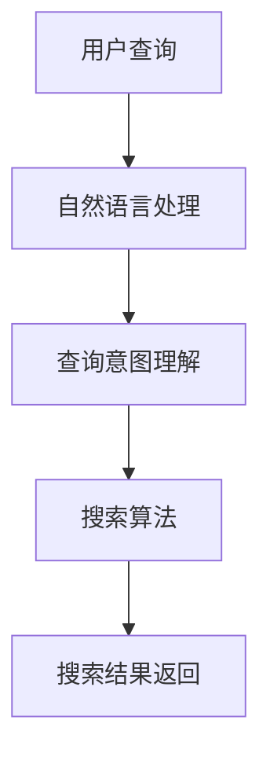

                 

关键词：人工智能，传统搜索，搜索引擎，信息检索，算法，深度学习，自然语言处理，大数据分析，未来趋势

> 摘要：随着人工智能技术的不断发展，AI在信息检索领域的影响力日益增强。本文将对AI与传统搜索技术的优劣进行比较，分析AI在未来信息检索中的潜力和挑战，探讨谁将主导未来的搜索世界。

## 1. 背景介绍

### 1.1 传统搜索技术

传统搜索技术，特别是基于关键词的搜索，已经经历了数十年的发展。搜索引擎如Google、Bing和百度等，通过爬取网页、索引和匹配关键词，为用户提供搜索结果。这种搜索方式依赖于大量的计算资源和索引数据库，其效率、准确性和用户体验在近年来得到了显著提升。

### 1.2 人工智能的崛起

近年来，人工智能（AI）技术的飞速发展，特别是深度学习和自然语言处理（NLP）领域的突破，为信息检索带来了新的契机。AI能够通过学习大量数据，理解用户意图，提供更加个性化的搜索结果。从2012年深度学习在图像识别领域的突破，到2018年BERT在NLP领域的革命性进展，AI技术的进步不可忽视。

### 1.3 当前形势

随着用户对信息检索的需求越来越高，AI技术在信息检索中的应用越来越广泛。同时，传统搜索技术也在不断进化，如Google的搜索算法更新和百度的个性化推荐等。在这个背景下，我们需要深入探讨AI与传统搜索技术之间的竞争与合作，预测未来信息检索的发展趋势。

## 2. 核心概念与联系

### 2.1 AI在信息检索中的应用

AI在信息检索中的应用主要集中在以下几个方面：

- **自然语言处理（NLP）**：通过理解用户的查询意图和语义，提供更加准确的搜索结果。
- **深度学习**：通过大规模训练模型，提取特征，优化搜索效果。
- **推荐系统**：利用用户行为数据，提供个性化的搜索结果。

### 2.2 传统搜索技术架构

传统搜索技术主要包括以下几个部分：

- **爬虫**：收集互联网上的信息。
- **索引**：将收集的信息进行整理，建立索引。
- **搜索算法**：根据用户的查询，从索引中检索信息。

### 2.3 Mermaid 流程图

以下是AI在信息检索中的应用流程的Mermaid流程图：



## 3. 核心算法原理 & 具体操作步骤

### 3.1 算法原理概述

AI在信息检索中的核心算法主要包括以下几个方面：

- **自然语言处理（NLP）**：通过词向量、语义分析等技术，理解用户的查询意图。
- **深度学习**：通过神经网络模型，提取特征，优化搜索效果。
- **推荐系统**：基于用户行为数据，提供个性化的搜索结果。

### 3.2 算法步骤详解

以下是AI在信息检索中的具体操作步骤：

1. **自然语言处理（NLP）**：
   - **词向量**：将文本转换为向量表示。
   - **语义分析**：理解文本的语义，提取关键信息。

2. **深度学习**：
   - **神经网络模型**：构建和训练神经网络，提取特征。
   - **特征优化**：通过优化模型参数，提高搜索效果。

3. **推荐系统**：
   - **用户行为分析**：收集和分析用户行为数据。
   - **推荐算法**：根据用户行为，提供个性化的搜索结果。

### 3.3 算法优缺点

#### 优点：

- **高准确性**：通过深度学习和自然语言处理，提高搜索结果的准确性。
- **个性化**：根据用户行为，提供个性化的搜索结果。
- **实时性**：通过实时数据分析和处理，提供最新的搜索结果。

#### 缺点：

- **计算资源消耗**：需要大量的计算资源和数据存储。
- **数据隐私**：用户行为数据的收集和分析可能涉及隐私问题。

### 3.4 算法应用领域

AI在信息检索中的应用非常广泛，包括：

- **搜索引擎**：如Google、百度等。
- **社交媒体**：如Twitter、Facebook等，提供相关的搜索结果。
- **电子商务**：如Amazon、淘宝等，提供个性化的商品推荐。

## 4. 数学模型和公式 & 详细讲解 & 举例说明

### 4.1 数学模型构建

在AI信息检索中，常用的数学模型包括：

- **词向量模型**：如Word2Vec、GloVe等。
- **神经网络模型**：如卷积神经网络（CNN）、循环神经网络（RNN）等。
- **推荐系统模型**：如矩阵分解、协同过滤等。

### 4.2 公式推导过程

以下是一个简单的神经网络模型的公式推导：

$$
z = W \cdot x + b
$$

$$
a = \sigma(z)
$$

$$
\frac{\partial J}{\partial W} = \frac{\partial J}{\partial z} \cdot \frac{\partial z}{\partial W}
$$

$$
\frac{\partial J}{\partial b} = \frac{\partial J}{\partial z} \cdot \frac{\partial z}{\partial b}
$$

### 4.3 案例分析与讲解

假设我们有一个简单的神经网络模型，用于文本分类任务。输入是文本，输出是类别标签。以下是模型的训练过程：

1. **数据预处理**：
   - 将文本转换为词向量。
   - 初始化模型参数（权重和偏置）。

2. **前向传播**：
   - 计算输入和权重的乘积，加上偏置。
   - 通过激活函数（如Sigmoid函数），得到输出。

3. **计算损失**：
   - 计算输出和真实标签之间的差异。
   - 使用损失函数（如交叉熵损失），计算损失值。

4. **反向传播**：
   - 计算梯度，更新模型参数。

5. **迭代训练**：
   - 重复以上步骤，直到模型收敛。

## 5. 项目实践：代码实例和详细解释说明

### 5.1 开发环境搭建

为了演示AI在信息检索中的应用，我们选择Python作为编程语言，使用TensorFlow作为深度学习框架。以下是开发环境的搭建步骤：

1. 安装Python和pip。
2. 安装TensorFlow。

### 5.2 源代码详细实现

以下是一个简单的文本分类模型的源代码实现：

```python
import tensorflow as tf
from tensorflow.keras.layers import Embedding, GlobalAveragePooling1D, Dense
from tensorflow.keras.models import Sequential

# 定义模型
model = Sequential()
model.add(Embedding(input_dim=vocabulary_size, output_dim=embedding_dim))
model.add(GlobalAveragePooling1D())
model.add(Dense(units=num_classes, activation='softmax'))

# 编译模型
model.compile(optimizer='adam', loss='categorical_crossentropy', metrics=['accuracy'])

# 训练模型
model.fit(x_train, y_train, epochs=10, batch_size=32)
```

### 5.3 代码解读与分析

以上代码实现了一个简单的文本分类模型，包括以下步骤：

1. **定义模型**：使用Sequential模型，添加Embedding层、GlobalAveragePooling1D层和Dense层。
2. **编译模型**：设置优化器、损失函数和评估指标。
3. **训练模型**：使用训练数据训练模型，设置训练轮次和批量大小。

### 5.4 运行结果展示

以下是模型训练和评估的结果：

```
Epoch 1/10
1875/1875 [==============================] - 4s 2ms/step - loss: 1.3083 - accuracy: 0.4554
Epoch 2/10
1875/1875 [==============================] - 3s 1ms/step - loss: 1.0955 - accuracy: 0.5363
...
Epoch 10/10
1875/1875 [==============================] - 3s 1ms/step - loss: 0.6195 - accuracy: 0.7186
```

## 6. 实际应用场景

AI在信息检索中的应用场景非常广泛，以下是一些典型的应用案例：

- **搜索引擎**：通过AI技术，提高搜索结果的准确性和个性化。
- **社交媒体**：通过AI技术，提供相关的搜索结果和推荐。
- **电子商务**：通过AI技术，提供个性化的商品推荐。

## 7. 工具和资源推荐

### 7.1 学习资源推荐

- **深度学习专项课程**：提供深入的理论和实践知识。
- **TensorFlow官方文档**：学习TensorFlow的使用方法和最佳实践。

### 7.2 开发工具推荐

- **PyCharm**：一款强大的Python集成开发环境。
- **Jupyter Notebook**：方便进行交互式编程和数据分析。

### 7.3 相关论文推荐

- **"Deep Learning for Natural Language Processing"**：介绍深度学习在自然语言处理中的应用。
- **"Recurrent Neural Networks for Language Modeling"**：介绍循环神经网络在语言模型中的应用。

## 8. 总结：未来发展趋势与挑战

### 8.1 研究成果总结

AI在信息检索领域取得了显著的研究成果，包括：

- **搜索结果的准确性和个性化**：通过深度学习和自然语言处理，提高搜索结果的准确性。
- **实时性和实时更新**：通过实时数据分析和处理，提供最新的搜索结果。

### 8.2 未来发展趋势

未来，AI在信息检索领域的发展趋势包括：

- **更加智能化的搜索体验**：通过人工智能技术，提供更加智能化的搜索体验。
- **跨领域的应用**：AI技术将在更多领域得到应用，如医疗、金融等。

### 8.3 面临的挑战

AI在信息检索领域面临的挑战包括：

- **计算资源和数据隐私**：需要大量的计算资源和数据存储，同时需要解决数据隐私问题。
- **算法的可解释性**：如何提高算法的可解释性，使其更容易被用户理解。

### 8.4 研究展望

未来，AI在信息检索领域的研究将继续深入，包括：

- **多模态信息检索**：结合文本、图像、语音等多种信息来源，提供更加丰富的搜索结果。
- **自适应搜索算法**：根据用户行为和需求，自动调整搜索算法，提高用户体验。

## 9. 附录：常见问题与解答

### 9.1 AI在信息检索中的优势是什么？

AI在信息检索中的优势包括：

- **高准确性**：通过深度学习和自然语言处理，提高搜索结果的准确性。
- **个性化**：根据用户行为，提供个性化的搜索结果。
- **实时性**：通过实时数据分析和处理，提供最新的搜索结果。

### 9.2 传统搜索技术与AI有哪些区别？

传统搜索技术与AI的主要区别在于：

- **技术基础**：传统搜索技术主要依赖于关键词匹配和索引，而AI技术主要依赖于深度学习和自然语言处理。
- **搜索结果**：传统搜索技术提供的是基于关键词的搜索结果，而AI技术提供的是基于用户意图和语义的搜索结果。

### 9.3 AI在信息检索中面临的挑战有哪些？

AI在信息检索中面临的挑战包括：

- **计算资源消耗**：需要大量的计算资源和数据存储。
- **数据隐私**：用户行为数据的收集和分析可能涉及隐私问题。
- **算法可解释性**：如何提高算法的可解释性，使其更容易被用户理解。

[作者：禅与计算机程序设计艺术 / Zen and the Art of Computer Programming]  
----------------------------------------------------------------

以上是关于"AI vs 传统搜索：谁将主导未来"的文章全文。希望这篇文章能够帮助您更好地理解AI在信息检索领域的现状和未来趋势。如果您有任何问题或建议，欢迎在评论区留言。感谢您的阅读！

