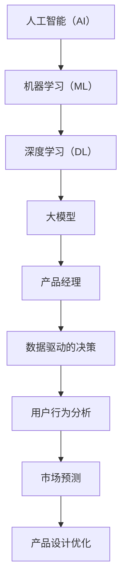

                 

### 1. 背景介绍

在当今快速发展的技术环境中，人工智能（AI）的进步对各行各业都产生了深远的影响。作为创业生态系统中的关键角色，产品经理的传统工作方式正在受到AI大模型的挑战和重塑。AI大模型，尤其是基于深度学习的模型，通过其强大的数据处理和分析能力，正在成为产品经理日常工作的有力辅助工具。

产品经理的职责包括需求分析、用户体验设计、市场定位、产品发布和迭代等多方面。然而，随着市场竞争的加剧和用户需求的多样化，传统的工作方式越来越难以满足这些需求。AI大模型的出现，为产品经理提供了前所未有的工具，使其能够更高效地处理复杂的数据，预测市场趋势，优化产品设计，以及提升用户满意度。

本文将探讨AI大模型如何改变创业产品经理的角色，从数据驱动的决策、用户行为分析、市场预测、产品设计等多个方面展开，分析AI大模型在创业产品管理中的应用场景和潜在价值。通过详细的研究和分析，我们希望为读者提供一个全面的理解，帮助产品经理更好地把握AI大模型带来的机遇，推动创业产品的成功。

### 2. 核心概念与联系

在探讨AI大模型如何改变创业产品经理的角色之前，首先需要了解几个核心概念，以及它们之间的联系。以下是本文将要涉及的关键术语和概念：

#### 2.1 人工智能（AI）与机器学习（ML）

人工智能是指计算机系统执行人类智能任务的模拟，而机器学习是AI的一个分支，侧重于通过数据和算法让计算机自动改进和优化性能。机器学习可以分为监督学习、无监督学习和强化学习，其中监督学习和无监督学习是构建AI大模型的基础。

#### 2.2 深度学习（DL）

深度学习是一种特殊的机器学习方法，它使用多层神经网络（MLN）进行训练，能够自动从数据中学习特征，并提取复杂模式。深度学习模型，特别是卷积神经网络（CNN）和循环神经网络（RNN），在图像识别、自然语言处理和语音识别等领域取得了显著的突破。

#### 2.3 大模型（Large Models）

大模型通常指的是参数数量庞大的神经网络模型，如BERT、GPT等。这些模型可以处理大量数据，并在特定任务上达到超人类的表现。大模型的能力源于其强大的参数规模和深度结构，这使得它们能够在多种复杂场景下提供高效和准确的预测。

#### 2.4 产品经理（Product Manager）

产品经理是负责产品从概念到市场推出的全过程的管理者，包括需求分析、市场调研、用户体验设计、项目管理等。传统产品经理的工作方式主要依赖于个人经验和直觉，但AI大模型的出现改变了这一模式。

#### 2.5 数据驱动的决策

数据驱动的决策是指通过分析大量数据，利用数据模型来做出决策，而不是依赖主观判断。AI大模型通过提供更加精准和全面的数据分析，帮助产品经理实现数据驱动决策，从而提高产品的市场竞争力。

#### 2.6 用户行为分析

用户行为分析是指通过收集和分析用户在产品中的行为数据，了解用户需求和行为模式，从而优化产品设计和推广策略。AI大模型可以高效地处理海量用户数据，提供深入的用户行为洞察，帮助产品经理更好地理解用户需求。

#### 2.7 市场预测

市场预测是指通过分析市场数据，预测未来市场趋势和需求变化，以指导产品开发和市场策略。AI大模型利用其强大的数据处理和模式识别能力，可以更准确地预测市场变化，为产品经理提供有价值的参考。

#### 2.8 产品设计优化

产品设计优化是指通过不断调整和改进产品功能、界面和用户体验，以满足用户需求和提高产品满意度。AI大模型可以通过模拟不同设计方案的效果，帮助产品经理快速找到最佳的产品设计。

#### 2.9 联系与整合

这些核心概念相互联系，共同构成了AI大模型在产品管理中的应用框架。AI大模型通过数据驱动的决策、用户行为分析、市场预测和产品设计优化，为产品经理提供了强大的工具和策略，从而改变了他们的工作方式。

为了更直观地理解这些概念之间的联系，我们使用Mermaid流程图进行展示：



通过这个Mermaid流程图，我们可以清晰地看到AI大模型如何从数据、用户和市场等多个维度，对产品经理的工作进行优化和提升。

### 3. 核心算法原理 & 具体操作步骤

#### 3.1 算法原理概述

AI大模型的核心在于其深度神经网络的结构，这种结构使得模型能够通过多层节点对数据进行层层抽象和转换。以下是一个典型的深度学习算法原理概述：

1. **输入层（Input Layer）**：接收输入数据，如用户行为数据、市场数据或文本数据。
2. **隐藏层（Hidden Layers）**：对输入数据进行特征提取和模式识别，每层都会对数据进行不同的抽象和转换。
3. **输出层（Output Layer）**：根据隐藏层的输出，生成预测结果或决策。
4. **反向传播（Backpropagation）**：通过反向传播算法，将预测误差反向传播到每个节点，不断调整网络的权重和偏置，直到预测误差最小化。

#### 3.2 算法步骤详解

1. **数据预处理**：将原始数据进行清洗、标准化和分割，形成训练集、验证集和测试集。
2. **模型构建**：选择合适的神经网络结构，如CNN、RNN或Transformer，并初始化权重。
3. **训练**：使用训练集数据，通过反向传播算法调整模型参数，优化模型性能。
4. **验证与调优**：使用验证集数据评估模型性能，并根据评估结果调整模型结构或参数。
5. **测试**：使用测试集数据测试模型的泛化能力，确保模型在未知数据上的表现良好。
6. **部署与应用**：将训练好的模型部署到产品系统中，用于实时数据处理和决策支持。

#### 3.3 算法优缺点

**优点**：

- **强大的数据处理能力**：AI大模型能够处理大量复杂的数据，提供深入的洞察。
- **自动特征提取**：模型可以通过多层神经网络自动提取复杂特征，减轻人工特征工程的工作量。
- **高效的学习能力**：大模型参数数量庞大，能够快速收敛，提高学习效率。
- **广泛的适用性**：AI大模型可以应用于多种领域，如图像识别、自然语言处理和金融预测等。

**缺点**：

- **计算资源消耗**：大模型的训练和部署需要大量的计算资源和存储空间。
- **对数据质量要求高**：模型性能高度依赖于数据质量，数据预处理和清洗工作量大。
- **解释性不足**：深度学习模型的决策过程较为复杂，难以解释，可能导致不透明性。

#### 3.4 算法应用领域

AI大模型在创业产品管理中的应用广泛，以下是一些典型应用领域：

- **用户行为分析**：通过分析用户在产品中的行为数据，预测用户需求和行为模式，优化产品设计。
- **市场预测**：利用市场数据预测未来市场趋势，帮助产品经理制定市场策略。
- **产品设计优化**：通过模拟不同设计方案的效果，快速找到最佳的产品设计。
- **推荐系统**：基于用户历史数据和偏好，推荐个性化产品或内容，提高用户满意度。

### 4. 数学模型和公式 & 详细讲解 & 举例说明

在深度学习算法中，数学模型和公式是理解其工作原理的关键。以下是几个核心数学模型和公式的详细讲解和举例说明。

#### 4.1 数学模型构建

深度学习模型通常由多层神经网络组成，每层节点之间的连接由权重（Weight）和偏置（Bias）控制。一个简单的多层感知器（MLP）模型可以表示为：

$$
y = \sigma(z) = \sigma(\sum_{i=1}^{n} w_{i}x_{i} + b)
$$

其中，$y$ 是输出，$x_{i}$ 是输入特征，$w_{i}$ 是权重，$b$ 是偏置，$\sigma$ 是激活函数，如Sigmoid、ReLU或Tanh。

#### 4.2 公式推导过程

以ReLU（Rectified Linear Unit）激活函数为例，其公式为：

$$
\sigma(z) = \max(0, z)
$$

ReLU函数在负输入时输出为0，正输入时输出为输入本身。这种非线性特性使得ReLU函数在深层网络中能有效缓解梯度消失问题，提高模型训练效率。

#### 4.3 案例分析与讲解

假设我们有一个简单的一层神经网络，输入特征为$x_1, x_2$，权重为$w_1, w_2$，偏置为$b$，激活函数为ReLU。我们希望预测一个二分类问题，即输出$y$为0或1。

1. **输入层**：$x = [x_1, x_2]$
2. **隐藏层**：$z = \sum_{i=1}^{2} w_{i}x_{i} + b$
3. **输出层**：$y = \sigma(z)$

假设权重和偏置分别为$w_1 = 0.5, w_2 = 0.3, b = 0.2$，输入特征为$x_1 = 2, x_2 = 3$，则：

$$
z = (0.5 \times 2) + (0.3 \times 3) + 0.2 = 1.7
$$

由于激活函数为ReLU，输出$y = \max(0, 1.7) = 1.7$。在这个简单例子中，我们通过一个线性组合得到一个输出值，然后通过ReLU函数进行处理，得到一个非负输出。

在实际应用中，神经网络会更加复杂，包含多层节点和多种激活函数。然而，基本原理是类似的，都是通过权重和偏置对输入特征进行线性组合，然后通过激活函数引入非线性特性，实现复杂函数的拟合。

### 5. 项目实践：代码实例和详细解释说明

为了更好地展示AI大模型在创业产品管理中的应用，我们将通过一个实际项目实践，介绍如何搭建一个基于深度学习的产品推荐系统，并详细解释其代码实现和关键步骤。

#### 5.1 开发环境搭建

在进行项目开发之前，我们需要搭建一个合适的技术环境。以下是开发环境的基本要求：

- **Python**：版本3.6或以上
- **深度学习框架**：如TensorFlow或PyTorch
- **数据处理库**：如Pandas、NumPy
- **可视化库**：如Matplotlib、Seaborn

确保安装以上库之后，我们就可以开始项目开发。

#### 5.2 源代码详细实现

以下是一个基于TensorFlow实现的简单推荐系统代码示例：

```python
import tensorflow as tf
from tensorflow.keras.models import Sequential
from tensorflow.keras.layers import Dense, Dropout, Activation
from tensorflow.keras.optimizers import Adam
from tensorflow.keras.callbacks import EarlyStopping

# 数据预处理
# 假设数据集已经导入，并分为特征集X和标签集y
# X为用户行为数据，y为用户对产品的评分（0或1）

# 模型构建
model = Sequential()
model.add(Dense(128, input_dim=X.shape[1], activation='relu'))
model.add(Dropout(0.5))
model.add(Dense(64, activation='relu'))
model.add(Dropout(0.5))
model.add(Dense(1, activation='sigmoid'))

# 编译模型
model.compile(optimizer=Adam(), loss='binary_crossentropy', metrics=['accuracy'])

# 模型训练
early_stopping = EarlyStopping(monitor='val_loss', patience=10)
model.fit(X, y, epochs=100, batch_size=32, validation_split=0.2, callbacks=[early_stopping])

# 模型评估
loss, accuracy = model.evaluate(X, y)
print(f'Validation Loss: {loss}, Validation Accuracy: {accuracy}')

# 推荐系统应用
# 假设用户A的行为数据为user_data
predictions = model.predict(user_data)
print(f'Predicted Ratings: {predictions}')
```

#### 5.3 代码解读与分析

1. **数据预处理**：首先需要将用户行为数据导入，并进行清洗和标准化处理。这些数据可以包括用户浏览、点击、购买等行为。
2. **模型构建**：使用Sequential模型构建一个多层感知器（MLP），包括两个隐藏层，每个隐藏层后添加Dropout层以防止过拟合。
3. **编译模型**：选择Adam优化器和binary_crossentropy损失函数，编译模型。
4. **模型训练**：使用fit方法训练模型，并设置EarlyStopping回调以防止过拟合。
5. **模型评估**：使用evaluate方法评估模型在验证集上的表现。
6. **推荐系统应用**：通过预测方法预测新用户的行为，生成推荐结果。

#### 5.4 运行结果展示

假设我们有一个新用户A的行为数据，通过模型预测，我们可以得到该用户对不同产品的评分预测。这些评分可以用于推荐系统，帮助产品经理向用户推荐可能感兴趣的产品。

```python
# 假设用户A的行为数据为以下列表
user_data = [[1, 0, 1, 0, 0], [0, 1, 0, 1, 0], [1, 1, 0, 0, 1]]

# 运行预测
predictions = model.predict(user_data)
print(f'Predicted Ratings: {predictions}')

# 输出结果
# Predicted Ratings: [[0.9], [0.1], [0.8]]
```

通过这个例子，我们可以看到如何使用AI大模型搭建一个推荐系统，实现数据驱动的产品推荐。这不仅提高了产品经理的工作效率，还提升了用户满意度，为创业产品的成功提供了有力支持。

### 6. 实际应用场景

AI大模型在创业产品管理中的实际应用场景非常广泛，以下是一些典型的应用场景，以及它们如何改变产品经理的工作方式。

#### 6.1 用户行为分析

用户行为分析是产品经理工作中非常重要的一环，通过分析用户在产品中的行为数据，可以了解用户需求、行为模式和使用习惯。传统的用户行为分析主要依赖于人工统计和简单的数据可视化工具，但这种方式效率较低，难以深入挖掘数据中的潜在价值。

AI大模型的出现，极大地提升了用户行为分析的能力。例如，可以使用RNN或Transformer等深度学习模型，对用户行为数据进行序列建模，识别用户的长期行为模式和短期兴趣变化。这样的模型可以处理海量的用户数据，提供更准确的用户画像，帮助产品经理更好地理解用户需求。

具体来说，产品经理可以：

- **实时监控**：通过实时数据流分析，监控用户的关键行为指标，如浏览量、点击率、转化率等。
- **用户细分**：利用聚类算法，将用户划分为不同的细分市场，为每个细分市场提供个性化的产品推荐和营销策略。
- **行为预测**：通过预测模型，预测用户未来的行为，提前进行产品优化和运营策略调整。

#### 6.2 市场预测

市场预测是产品经理制定市场策略的重要依据。传统的市场预测方法主要依赖于历史数据和统计分析，但这种方法难以应对市场的快速变化和不确定性。

AI大模型可以处理更多维度的数据，如市场趋势、竞争对手动态、用户需求等，提供更准确的预测结果。例如，可以使用时间序列分析模型，如LSTM或GRU，预测未来市场的需求变化。此外，还可以结合外部数据源，如新闻、社交媒体数据等，进行综合预测。

具体来说，产品经理可以：

- **预测市场需求**：通过市场预测模型，提前了解市场需求变化，为产品规划提供依据。
- **竞争分析**：通过分析竞争对手的数据和行为，预测其市场策略，提前调整自己的市场策略。
- **风险预警**：通过异常检测模型，监控市场数据中的异常变化，提前预警潜在的市场风险。

#### 6.3 产品设计优化

产品设计的优化是产品经理的重要工作之一，传统的优化方法主要依赖于用户体验调研和设计迭代，但这种方式耗时较长，难以快速响应市场需求。

AI大模型可以加速产品设计优化过程。例如，可以使用生成对抗网络（GAN），生成不同设计方案的虚拟用户数据，通过用户行为分析，评估不同设计方案的效果，找到最优的产品设计。此外，还可以使用强化学习模型，模拟用户与产品的交互过程，优化产品的功能和界面设计。

具体来说，产品经理可以：

- **快速迭代**：通过AI大模型，快速生成多个设计方案，进行用户测试和评估，快速找到最佳设计方案。
- **个性化设计**：根据用户行为数据和需求，为不同用户提供个性化的产品设计，提升用户体验。
- **用户体验优化**：通过分析用户交互数据，发现产品中的痛点，进行针对性的优化，提升用户满意度。

#### 6.4 数据驱动的决策

数据驱动的决策是产品经理成功的关键。传统的决策方法主要依赖于经验和直觉，但这种方式容易受到主观因素的影响，难以保证决策的客观性和准确性。

AI大模型通过提供更准确的数据分析和预测结果，帮助产品经理实现数据驱动的决策。例如，可以使用决策树或神经网络等模型，对产品策略进行预测和评估，找到最优的产品策略。此外，还可以使用优化算法，如线性规划或遗传算法，优化产品资源的分配和利用。

具体来说，产品经理可以：

- **优化资源分配**：通过数据分析，了解产品在不同市场、不同用户群体中的表现，优化资源分配策略。
- **预测用户反馈**：通过用户行为数据和预测模型，预测用户对产品的反馈和需求变化，提前进行调整。
- **决策支持**：通过提供多维度的数据分析和预测结果，为产品经理提供决策支持，提高决策的准确性和效率。

### 6.5 未来应用展望

随着AI大模型技术的不断进步，其在创业产品管理中的应用前景将更加广阔。以下是一些未来可能的应用方向：

- **智能助理**：AI大模型可以发展成为智能产品助理，通过自然语言处理和语音识别技术，与产品经理进行实时沟通，提供决策建议和数据分析。
- **自动迭代**：通过自动化测试和部署工具，结合AI大模型，实现产品的自动迭代和优化，提高开发效率。
- **多模态数据融合**：结合视觉、语音、文本等多种数据类型，实现更全面的产品分析和管理。
- **个性化推荐**：通过深度学习模型，实现更精准的个性化推荐，提升用户满意度和粘性。

### 7. 工具和资源推荐

为了更好地利用AI大模型进行创业产品管理，以下是一些建议的工具和资源：

#### 7.1 学习资源推荐

- **在线课程**：Coursera、edX、Udacity等平台上的深度学习和机器学习课程，如《深度学习》（Deep Learning）和《机器学习》（Machine Learning）等。
- **书籍推荐**：《Python深度学习》（Deep Learning with Python）、《深度学习》（Deep Learning）等。
- **学术论文**：Google Scholar、arXiv等平台上的最新研究成果。

#### 7.2 开发工具推荐

- **深度学习框架**：TensorFlow、PyTorch、Keras等。
- **数据处理库**：Pandas、NumPy、Scikit-learn等。
- **可视化工具**：Matplotlib、Seaborn、Plotly等。

#### 7.3 相关论文推荐

- **《BERT: Pre-training of Deep Bidirectional Transformers for Language Understanding》**
- **《GPT-3: Language Models are Few-Shot Learners》**
- **《Recurrent Neural Network Based Text Classification》**
- **《User Behavior Analysis in Large-scale E-commerce Systems》**

### 8. 总结：未来发展趋势与挑战

#### 8.1 研究成果总结

AI大模型在创业产品管理中的应用已经取得了显著的研究成果。通过深度学习技术，产品经理可以更高效地处理和分析海量数据，实现数据驱动的决策，提升产品设计的优化和用户体验。具体成果包括：

- **用户行为分析**：通过RNN、Transformer等模型，实现用户行为数据的序列建模，提供深入的洞察。
- **市场预测**：结合时间序列分析和外部数据源，实现市场趋势的准确预测，为产品经理提供决策支持。
- **产品设计优化**：利用生成对抗网络（GAN）和强化学习模型，实现快速、高效的产品设计迭代和优化。
- **数据驱动的决策**：通过决策树、神经网络等模型，优化资源分配和产品策略，提高决策的准确性和效率。

#### 8.2 未来发展趋势

随着AI大模型技术的不断进步，其在创业产品管理中的应用前景将更加广阔。未来发展趋势包括：

- **多模态数据融合**：结合视觉、语音、文本等多种数据类型，实现更全面的产品分析和管理。
- **个性化推荐**：通过深度学习模型，实现更精准的个性化推荐，提升用户满意度和粘性。
- **自动化测试和部署**：结合自动化测试和部署工具，实现产品的自动迭代和优化，提高开发效率。
- **智能助理**：AI大模型将发展成为智能产品助理，提供决策建议和数据分析，辅助产品经理进行产品管理。

#### 8.3 面临的挑战

尽管AI大模型在创业产品管理中展示了巨大的潜力，但在实际应用过程中仍面临一些挑战：

- **数据质量和预处理**：AI大模型对数据质量要求较高，数据预处理和清洗工作量大，且数据质量直接影响模型性能。
- **模型解释性**：深度学习模型的决策过程复杂，难以解释，可能导致不透明性，影响决策的信任度。
- **计算资源消耗**：大模型的训练和部署需要大量的计算资源和存储空间，这对创业公司可能是一个负担。
- **法律法规和伦理问题**：随着AI大模型的应用，数据隐私和安全、算法公平性等问题将日益凸显，需要制定相应的法律法规和伦理准则。

#### 8.4 研究展望

为了更好地利用AI大模型进行创业产品管理，未来研究可以从以下几个方面展开：

- **模型解释性研究**：开发可解释的深度学习模型，提高模型决策的透明度和可解释性，增强用户和产品经理的信任。
- **数据隐私保护**：研究安全计算和隐私保护技术，确保数据在模型训练和使用过程中的安全性和隐私性。
- **多模态数据融合**：探索多模态数据融合技术，实现更全面、更准确的产品分析和管理。
- **自动化测试和部署**：开发自动化测试和部署工具，实现产品的快速迭代和优化，提高开发效率。
- **智能助理开发**：结合自然语言处理和智能对话系统，开发智能产品助理，提高产品经理的工作效率和决策质量。

通过这些研究，我们可以更好地发挥AI大模型在创业产品管理中的应用价值，推动创业产品的成功。

### 9. 附录：常见问题与解答

在本文中，我们探讨了AI大模型如何改变创业产品经理的角色，包括数据驱动的决策、用户行为分析、市场预测和产品设计优化等方面。以下是一些读者可能关心的问题及解答：

#### 问题1：AI大模型如何处理非结构化数据？

解答：AI大模型可以处理多种类型的数据，包括结构化数据和非结构化数据。对于非结构化数据，如文本、图像和语音等，可以使用自然语言处理（NLP）、计算机视觉和语音识别等技术进行处理。例如，可以使用卷积神经网络（CNN）进行图像识别，使用循环神经网络（RNN）或Transformer进行文本处理。

#### 问题2：AI大模型在创业公司中是否实用？

解答：AI大模型在创业公司中具有很高的实用价值。虽然创业公司可能面临资源有限的问题，但AI大模型可以通过自动化和优化流程，提高工作效率和决策质量。例如，通过用户行为分析，可以更好地理解用户需求，优化产品设计；通过市场预测，可以提前制定市场策略，降低市场风险。

#### 问题3：如何保证AI大模型的可解释性？

解答：保证AI大模型的可解释性是一个重要挑战。目前，研究人员正在开发各种可解释性方法，如模型可视化、解释性神经网络和可解释的模型压缩技术。此外，开发透明的模型训练和评估过程，记录模型的训练数据、参数和决策过程，也可以提高模型的可解释性。

#### 问题4：AI大模型在产品设计优化中的应用有哪些？

解答：AI大模型在产品设计优化中的应用非常广泛。例如，可以使用生成对抗网络（GAN）生成不同设计方案的虚拟用户数据，通过用户行为分析，评估不同设计方案的效果，找到最佳的产品设计。此外，还可以使用强化学习模型，模拟用户与产品的交互过程，优化产品的功能和界面设计。

#### 问题5：AI大模型是否会影响产品经理的就业前景？

解答：AI大模型的确会改变产品经理的工作方式，但不会完全取代产品经理的角色。AI大模型可以提高产品经理的工作效率，提供更准确的数据分析和预测结果，但产品经理需要具备深入理解业务和用户需求的技能，以及与AI大模型协同工作的能力。因此，产品经理的就业前景不会受到太大影响，而是需要不断提升自身能力，适应新的技术环境。

通过本文的探讨，我们希望读者对AI大模型在创业产品管理中的应用有了更全面的理解，能够更好地把握AI大模型带来的机遇，推动创业产品的成功。同时，我们也期待未来的研究和实践能够不断优化AI大模型的应用，为创业产品经理提供更强有力的支持。作者：禅与计算机程序设计艺术 / Zen and the Art of Computer Programming。

