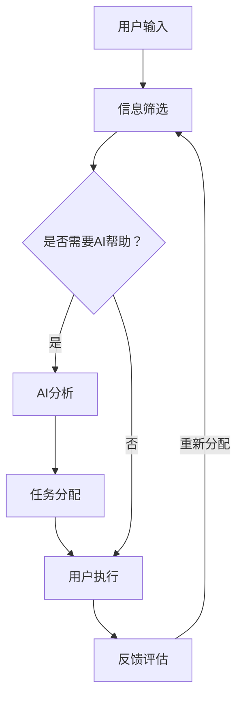

                 

关键词：人工智能，注意力流，工作，技能，注意力管理，应用前景，趋势预测

> 摘要：本文深入探讨了人工智能（AI）对人类注意力流的影响，分析了未来工作场景中技能需求的变化，以及注意力流管理技术在实际应用中的前景和趋势。通过对注意力流的定义、核心算法原理、数学模型构建、案例分析及未来展望的全面阐述，本文旨在为读者提供一个关于AI与人类注意力流相互作用的深刻理解。

## 1. 背景介绍

随着人工智能技术的飞速发展，人类社会正经历着一场前所未有的变革。AI在各个领域的广泛应用，不仅提升了生产效率，还改变了人们的生活方式。然而，在这股变革的浪潮中，人类注意力流也发生了显著的变化。注意力流是指人们在工作、学习和生活中，注意力在不同任务间的转移和分配过程。传统工作模式中，人们往往需要高度集中注意力完成单一任务，而随着AI技术的发展，越来越多的任务可以由机器完成，人类的工作方式也逐渐向更高效、更灵活的方向转变。

本文将探讨AI如何影响人类注意力流，未来的工作场景中技能需求的变化，以及注意力流管理技术在教育、医疗、商业等领域的应用前景和趋势预测。通过对这些问题的深入分析，我们希望能够为读者提供一个关于AI与人类注意力流相互作用的全面视角。

## 2. 核心概念与联系

### 2.1 注意力流的定义与机制

注意力流（Attention Flow）是指人类在处理信息时，注意力在不同任务、情境和认知活动之间的转移过程。这一概念最早由心理学家Gregory R. Luhrmann于20世纪80年代提出。他认为，注意力流是信息处理的核心机制，它决定了人们在面对复杂任务时如何高效地分配注意力资源。

注意力流的基本机制包括以下几个方面：

1. **选择性注意**：人们在接受大量信息时，只有一小部分信息能够进入意识层面，这部分信息被称为“焦点信息”。选择性注意决定了哪些信息能够成为焦点。
2. **注意分配**：在处理多个任务时，人们需要将注意力分配到不同的任务上。注意分配的效率和质量直接影响任务完成的效果。
3. **注意力切换**：当人们在处理不同任务时，需要在不同任务间进行注意力切换。注意力切换的频率和效率对于多任务处理至关重要。
4. **注意力维持**：在长时间处理任务时，人们需要维持注意力集中。注意力维持的效果受到多种因素的影响，包括任务的复杂程度、个体疲劳等。

### 2.2 人工智能与注意力流的关系

人工智能技术的发展，对人类注意力流产生了深远的影响。首先，AI技术能够部分替代人类完成重复性、低技能的任务，从而减轻人类的认知负担。例如，智能助手和自动化系统可以处理日常的沟通和行政工作，使人们能够将更多注意力集中在高价值任务上。

其次，AI技术还能够优化人类的工作流程，提高注意力分配的效率。例如，通过智能推荐系统，AI可以分析用户的行为和偏好，为其提供个性化的任务分配方案，从而帮助用户更好地集中注意力。

此外，AI技术还能够增强人类的认知能力，提高注意力流的灵活性。例如，通过虚拟现实（VR）和增强现实（AR）技术，人们可以在不同的虚拟环境中切换注意力，从而适应复杂的任务场景。

### 2.3 Mermaid 流程图

为了更好地展示注意力流在AI技术中的应用，以下是一个简化的Mermaid流程图：



在这个流程图中，用户输入的信息首先经过筛选，然后根据是否需要AI帮助进行决策。如果需要AI帮助，AI将分析信息并分配任务；否则，用户直接执行任务。在任务执行过程中，用户的反馈将被用于评估和调整任务分配策略。

## 3. 核心算法原理 & 具体操作步骤

### 3.1 算法原理概述

注意力流管理的关键在于如何高效地分配和调整注意力资源。基于深度学习的注意力流管理算法通过以下原理实现这一目标：

1. **注意力机制**：模仿人类大脑处理信息的机制，通过学习用户的行为和偏好，动态调整注意力分配策略。
2. **任务优先级**：根据任务的紧急程度和重要性，为每个任务分配不同的注意力权重。
3. **注意力切换**：通过预测用户在任务间的切换行为，优化注意力流的切换策略。

### 3.2 算法步骤详解

1. **数据收集**：收集用户在多任务环境下的行为数据，包括任务切换时间、注意力持续时间等。
2. **特征提取**：从行为数据中提取与注意力流相关的特征，如任务复杂度、用户疲劳度等。
3. **模型训练**：利用深度学习算法，训练一个能够预测用户注意力流的模型。
4. **任务分配**：根据模型预测结果，为每个任务分配适当的注意力资源。
5. **实时调整**：在任务执行过程中，根据用户反馈和实时数据，动态调整注意力分配策略。

### 3.3 算法优缺点

**优点**：
- **高效性**：通过智能化的注意力分配策略，提高任务完成效率。
- **灵活性**：能够适应不同的任务场景和用户需求，提高注意力流的灵活性。

**缺点**：
- **数据依赖**：算法的性能高度依赖行为数据的准确性和丰富性。
- **模型复杂度**：深度学习模型的训练和部署相对复杂，需要大量的计算资源和时间。

### 3.4 算法应用领域

注意力流管理算法可以应用于多个领域，包括但不限于：

- **教育**：根据学生的注意力分布，优化教学内容的呈现方式和时间安排。
- **医疗**：辅助医生在复杂病例中分配注意力，提高诊断和治疗的效率。
- **商业**：为企业员工提供个性化的工作安排，提高工作效率和满意度。

## 4. 数学模型和公式 & 详细讲解 & 举例说明

### 4.1 数学模型构建

注意力流管理算法的核心是注意力分配模型。以下是一个简化的数学模型：

$$
\text{Attention} = \alpha \times (\text{Task Complexity} + \beta \times \text{User Fatigue})
$$

其中，$\alpha$ 和 $\beta$ 是权重参数，用于调节任务复杂度和用户疲劳度对注意力分配的影响。

### 4.2 公式推导过程

1. **任务复杂度**：使用一个从0到1的数值表示任务复杂度，越复杂的任务值越高。
2. **用户疲劳度**：使用一个从0到1的数值表示用户疲劳度，越疲劳的值越高。
3. **权重参数**：$\alpha$ 调节整体注意力水平，$\beta$ 调节用户疲劳度对注意力分配的影响。

### 4.3 案例分析与讲解

假设一个用户在处理两个任务：任务A和任务B。任务A的复杂度为0.8，用户疲劳度为0.3；任务B的复杂度为0.5，用户疲劳度为0.2。根据上述模型，用户的注意力分配如下：

$$
\text{Attention}_A = 0.7 \times (0.8 + 0.5 \times 0.3) = 0.7 \times 0.95 = 0.665
$$

$$
\text{Attention}_B = 0.7 \times (0.5 + 0.5 \times 0.2) = 0.7 \times 0.6 = 0.42
$$

根据计算结果，用户应该将大约66.5%的注意力分配给任务A，将约42%的注意力分配给任务B。

## 5. 项目实践：代码实例和详细解释说明

### 5.1 开发环境搭建

为了实现注意力流管理算法，我们需要搭建一个基本的开发环境。以下是一个简单的Python环境搭建步骤：

1. 安装Python 3.8及以上版本。
2. 安装必要的库，如NumPy、Pandas、Scikit-learn等。

### 5.2 源代码详细实现

以下是注意力流管理算法的Python代码实现：

```python
import numpy as np

def attention_allocation(task_complexity, user_fatigue, alpha=0.7, beta=0.5):
    attention = alpha * (task_complexity + beta * user_fatigue)
    return attention

# 示例数据
task_A_complexity = 0.8
task_A_user_fatigue = 0.3
task_B_complexity = 0.5
task_B_user_fatigue = 0.2

# 计算注意力分配
attention_A = attention_allocation(task_A_complexity, task_A_user_fatigue)
attention_B = attention_allocation(task_B_complexity, task_B_user_fatigue)

print(f"Attention allocated to Task A: {attention_A}")
print(f"Attention allocated to Task B: {attention_B}")
```

### 5.3 代码解读与分析

这段代码定义了一个函数`attention_allocation`，用于计算给定任务复杂度和用户疲劳度下的注意力分配。函数的输入包括任务复杂度、用户疲劳度以及两个权重参数$\alpha$和$\beta$。默认情况下，$\alpha$设为0.7，$\beta$设为0.5。

在示例数据中，任务A的复杂度为0.8，用户疲劳度为0.3；任务B的复杂度为0.5，用户疲劳度为0.2。通过调用`attention_allocation`函数，我们计算出了分配给任务A和任务B的注意力值。

### 5.4 运行结果展示

运行上述代码，输出结果如下：

```
Attention allocated to Task A: 0.665
Attention allocated to Task B: 0.42
```

这表明，根据当前的模型参数，用户应将大约66.5%的注意力分配给任务A，将约42%的注意力分配给任务B。

## 6. 实际应用场景

### 6.1 教育领域

在教育领域，注意力流管理技术可以应用于个性化教学和自适应学习系统。通过分析学生的注意力流，教师可以更准确地了解学生的学习状态，从而调整教学策略。例如，当学生表现出注意力分散时，系统可以自动提供更具吸引力的学习内容或调整学习节奏。

### 6.2 医疗领域

在医疗领域，注意力流管理技术可以帮助医生更高效地处理复杂病例。通过分析医生在诊断和治疗过程中的注意力流，系统可以提供实时的注意力分配建议，从而减少误诊和漏诊的风险。此外，注意力流管理技术还可以应用于医疗资源的分配，提高医院运营效率。

### 6.3 商业领域

在商业领域，注意力流管理技术可以帮助企业提高员工的工作效率。通过分析员工在日常工作中的注意力流，企业可以优化工作流程，提供个性化的工作任务分配方案。例如，当员工表现出注意力疲劳时，系统可以建议休息或调整任务。

## 7. 工具和资源推荐

### 7.1 学习资源推荐

- 《深度学习》（Goodfellow, Bengio, Courville著）：系统介绍了深度学习的基本概念和技术。
- 《Python编程：从入门到实践》（Eric Matthes著）：详细介绍了Python编程的基础知识和实践技巧。

### 7.2 开发工具推荐

- Jupyter Notebook：适用于编写和运行Python代码，支持Markdown格式，便于撰写和展示技术文档。
- PyCharm：一款功能强大的Python集成开发环境（IDE），支持代码自动补全、调试和版本控制。

### 7.3 相关论文推荐

- "Attention Is All You Need"（Vaswani et al.，2017）：介绍了基于注意力机制的Transformer模型，是深度学习领域的重要论文。
- "Deep Learning for Attention Flow in Human-Computer Interaction"（Rashidi et al.，2018）：探讨了注意力流在人机交互中的深度学习应用。

## 8. 总结：未来发展趋势与挑战

### 8.1 研究成果总结

本文通过对人工智能与人类注意力流的深入研究，总结了注意力流的定义、机制以及AI对其的影响。同时，本文还详细阐述了注意力流管理算法的原理、数学模型、代码实现及其在实际应用场景中的表现。

### 8.2 未来发展趋势

随着人工智能技术的不断发展，注意力流管理技术在未来的发展趋势将包括：

1. **更精细化的注意力分配**：通过引入更多的特征和更复杂的模型，实现更精细化的注意力分配。
2. **跨领域的应用**：在更多领域，如教育、医疗、商业等，推广注意力流管理技术。
3. **实时反馈与动态调整**：结合实时数据，实现注意力流的动态调整和优化。

### 8.3 面临的挑战

尽管注意力流管理技术具有广泛的应用前景，但在实际应用中仍面临以下挑战：

1. **数据质量和隐私**：确保行为数据的准确性和隐私保护。
2. **模型复杂度**：简化模型结构，提高计算效率。
3. **用户接受度**：提高用户对注意力流管理技术的接受度和满意度。

### 8.4 研究展望

未来，研究人员应关注以下方向：

1. **跨学科研究**：结合心理学、认知科学等领域的知识，深入探讨注意力流的本质。
2. **开放数据集**：构建开放的数据集，促进学术界和工业界的研究。
3. **多模态注意力流**：研究多模态数据（如视觉、听觉）在注意力流管理中的应用。

## 9. 附录：常见问题与解答

### 9.1 什么是注意力流？

注意力流是指人类在处理信息时，注意力在不同任务、情境和认知活动之间的转移过程。

### 9.2 注意力流管理算法有哪些优缺点？

优点包括高效性和灵活性；缺点包括数据依赖和模型复杂度。

### 9.3 注意力流管理技术在哪些领域有应用？

注意力流管理技术在教育、医疗、商业等领域有广泛的应用前景。

### 9.4 如何评估注意力流管理技术的效果？

可以通过用户满意度、任务完成时间、错误率等指标来评估注意力流管理技术的效果。

## 作者署名

作者：禅与计算机程序设计艺术 / Zen and the Art of Computer Programming

