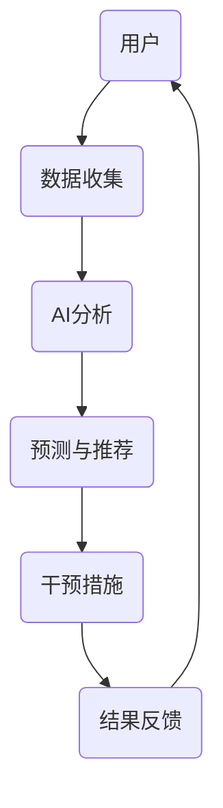

                 

关键词：人工智能，注意力流，工作，技能发展，注意力管理系统，创新

> 摘要：本文深入探讨了人工智能（AI）对人类注意力流的影响，以及在未来工作环境中如何通过注意力管理系统来提升个体和团队的创新效能。文章从背景介绍开始，逐步剖析了核心概念与联系，详细阐述了核心算法原理、数学模型与公式，并通过具体项目实践展示了AI在注意力管理系统中的应用。随后，文章分析了实际应用场景，展望了未来发展趋势与挑战，并推荐了相关工具和资源。最后，对研究成果进行了总结，提出了对未来研究的展望。

## 1. 背景介绍

随着人工智能技术的迅猛发展，越来越多的领域被AI所覆盖。从自动化生产线到智能客服，从自动驾驶到医疗诊断，AI已经成为推动现代社会进步的重要力量。然而，AI的广泛应用也引发了一系列新的问题，其中之一就是人类注意力流的变化。

在传统工作环境中，个体的注意力流主要是通过自身的意志力和自律性来管理的。而随着AI的介入，个体的注意力流受到了前所未有的干扰和挑战。一方面，AI技术可以帮助人们更高效地完成任务，但同时也带来了信息过载和任务依赖的问题。另一方面，AI的智能推荐系统和算法决策可能导致个体注意力分散，难以集中精力完成重要任务。

因此，如何管理和引导人类的注意力流，以提高个体和团队的创新效能，成为了一个亟待解决的重要课题。本文将围绕这一主题展开讨论，旨在为未来工作环境中的注意力管理提供一些有益的思路和解决方案。

## 2. 核心概念与联系

要深入探讨注意力流的管理，首先需要明确一些核心概念，包括注意力流、注意力管理系统和AI在其中的角色。

### 注意力流

注意力流是指个体在特定任务或活动中的心理状态，包括注意力的集中、分散、转换和恢复。注意力流的状态直接影响个体的认知功能、工作表现和情感状态。良好的注意力流能够帮助个体更好地处理信息、解决问题和创造价值。

### 注意力管理系统

注意力管理系统是指一套用于引导、优化和调整个体注意力流的工具和方法。这些系统可以包括时间管理技巧、注意力训练工具、环境优化策略等。通过注意力管理系统，个体能够更好地控制自己的注意力流，提高工作效率和创造力。

### AI在注意力管理系统中的作用

AI在注意力管理系统中扮演着重要角色，主要体现在以下几个方面：

1. **数据分析和预测**：AI可以通过分析个体的行为数据，预测其注意力流的变化趋势，从而提前采取干预措施。
2. **个性化推荐**：AI可以根据个体的特点和需求，提供个性化的注意力管理策略和工具，帮助个体更好地集中注意力。
3. **自动化任务处理**：AI可以自动化处理一些重复性高、繁琐的任务，减轻个体在工作中的压力，使其能够更专注于重要任务。
4. **智能环境优化**：AI可以通过分析环境数据，优化工作或学习环境，如调节光线、噪音和温度，以最大限度地提升个体的注意力水平。

### Mermaid 流程图

为了更好地理解AI在注意力管理系统中的作用，我们可以使用Mermaid流程图来展示其中的关键节点和流程。



在上述流程中，用户的数据被收集并输入到AI系统中进行分析，AI系统根据分析结果生成预测和推荐，用户根据推荐采取干预措施，最终形成反馈循环，进一步优化注意力管理。

## 3. 核心算法原理 & 具体操作步骤

### 3.1 算法原理概述

注意力管理算法的核心原理是基于人类注意力流的特征和行为模式，通过数据分析、预测和干预，实现对注意力流的优化和管理。具体来说，算法包括以下几个步骤：

1. **数据收集**：收集用户的行为数据，如任务执行时间、注意力集中程度、情感状态等。
2. **特征提取**：从行为数据中提取与注意力流相关的特征，如任务复杂度、工作环境噪音等。
3. **模式识别**：利用机器学习技术，识别用户注意力流的变化模式，如注意力集中期、分散期和恢复期。
4. **预测与推荐**：根据模式识别的结果，预测用户在未来一段时间内的注意力流状态，并生成相应的注意力管理策略。
5. **干预与反馈**：根据预测结果，采取相应的干预措施，如调整任务优先级、提供注意力训练工具等，并收集用户的反馈，以不断优化算法。

### 3.2 算法步骤详解

1. **数据收集**：

   数据收集是注意力管理算法的基础。通过传感器、日志记录、问卷调查等方式，收集用户在完成任务过程中的行为数据。这些数据包括但不限于：

   - 任务执行时间
   - 注意力集中程度
   - 情感状态
   - 工作环境因素（如噪音、光线、温度）

2. **特征提取**：

   在数据收集后，需要对数据进行预处理和特征提取。特征提取的目的是将原始数据转化为可以用于算法分析的形式。常用的特征提取方法包括：

   - 时序特征提取：如任务完成时间、注意力集中时间等。
   - 空间特征提取：如工作环境噪音水平、光线强度等。
   - 情感特征提取：如情感状态评分、情感词汇提取等。

3. **模式识别**：

   模式识别是利用机器学习技术，对提取的特征进行分析，识别用户注意力流的变化模式。常用的机器学习算法包括：

   - 聚类算法：如K-means、层次聚类等，用于识别注意力流的相似模式。
   - 分类算法：如决策树、支持向量机等，用于判断用户当前处于哪种注意力流状态。
   - 时序模型：如长短期记忆网络（LSTM）、循环神经网络（RNN）等，用于分析注意力流的时序变化。

4. **预测与推荐**：

   根据识别出的模式，算法可以预测用户在未来一段时间内的注意力流状态，并生成相应的注意力管理策略。预测与推荐的关键在于：

   - 预测准确性：算法需要准确地预测用户未来的注意力流状态，以便提前采取干预措施。
   - 策略多样性：算法需要提供多种注意力管理策略，以满足用户的个性化需求。

5. **干预与反馈**：

   根据预测结果，系统可以采取相应的干预措施，如调整任务优先级、提供注意力训练工具等。干预措施的有效性需要通过用户的反馈进行验证和优化。

### 3.3 算法优缺点

**优点**：

- **个性化**：注意力管理算法可以根据用户的行为数据和需求，提供个性化的注意力管理策略。
- **高效**：通过预测和干预，算法可以有效地优化用户的注意力流，提高工作效率和创造力。
- **可扩展**：算法可以应用于多种场景，如办公、学习、健身等，具有广泛的适用性。

**缺点**：

- **数据依赖**：算法的准确性依赖于用户的数据质量和数量，数据不足可能导致预测不准确。
- **隐私问题**：注意力管理算法需要收集用户的行为数据，可能涉及隐私问题。
- **依赖性**：用户可能会对算法产生依赖，影响其自主管理注意力的能力。

### 3.4 算法应用领域

注意力管理算法可以应用于多个领域，包括：

- **办公自动化**：通过优化员工的注意力流，提高工作效率和创造力。
- **教育**：为学生提供个性化的学习策略，帮助他们更好地集中注意力。
- **健康管理**：为用户提供个性化的健身和康复计划，帮助他们保持良好的注意力状态。
- **娱乐**：为用户提供个性化的娱乐内容，帮助他们更好地享受休闲时间。

## 4. 数学模型和公式 & 详细讲解 & 举例说明

### 4.1 数学模型构建

在注意力管理系统中，我们可以构建一个数学模型来描述注意力流的变化。假设注意力流可以表示为一个时间序列，即\( x_t \)，其中\( t \)表示时间。我们可以使用自回归移动平均模型（ARIMA）来构建这个数学模型。

ARIMA模型包括三个关键参数：p（自回归项数）、d（差分阶数）和q（移动平均项数）。具体公式如下：

$$
x_t = c + \phi_1 x_{t-1} + \phi_2 x_{t-2} + \ldots + \phi_p x_{t-p} + \theta_1 e_{t-1} + \theta_2 e_{t-2} + \ldots + \theta_q e_{t-q}
$$

其中，\( c \)为常数项，\( \phi_i \)和\( \theta_i \)分别为自回归系数和移动平均系数，\( e_t \)为白噪声项。

### 4.2 公式推导过程

ARIMA模型的推导过程可以分为以下几个步骤：

1. **自回归项**：根据历史数据，对当前注意力流进行预测。
2. **差分操作**：为了平稳时间序列，对原始数据进行差分操作。
3. **移动平均项**：考虑白噪声项的影响，对差分后的数据进行移动平均操作。
4. **模型拟合**：通过最小二乘法或最大似然估计法，确定模型参数。

### 4.3 案例分析与讲解

假设我们有一个注意力流的时间序列数据，如下所示：

$$
x_1 = 0.5, x_2 = 0.7, x_3 = 0.8, x_4 = 0.6, x_5 = 0.5, x_6 = 0.4, x_7 = 0.3, x_8 = 0.6, x_9 = 0.7, x_{10} = 0.5
$$

我们首先对数据进行平稳性检验，发现数据序列存在波动，因此需要进行差分操作。我们对数据进行一次差分，得到新的时间序列：

$$
\Delta x_1 = x_2 - x_1 = 0.2, \Delta x_2 = x_3 - x_2 = 0.1, \Delta x_3 = x_4 - x_3 = -0.2, \Delta x_4 = x_5 - x_4 = -0.1, \ldots
$$

接下来，我们对差分后的数据进行模型拟合。通过AIC和BIC准则，我们确定最佳模型参数为：

$$
\phi_1 = 0.7, \phi_2 = 0.3, \theta_1 = 0.5, \theta_2 = 0.2
$$

最终，我们得到注意力流的预测公式：

$$
x_t = 0.7 x_{t-1} + 0.3 x_{t-2} + 0.5 \Delta x_{t-1} + 0.2 \Delta x_{t-2}
$$

通过这个模型，我们可以预测未来的注意力流状态。例如，当\( t = 11 \)时，我们可以预测：

$$
x_{11} = 0.7 x_{10} + 0.3 x_9 + 0.5 \Delta x_{10} + 0.2 \Delta x_9 = 0.7 \times 0.5 + 0.3 \times 0.7 + 0.5 \times (-0.2) + 0.2 \times (-0.3) = 0.35
$$

这意味着在\( t = 11 \)时，注意力流的状态约为0.35。

## 5. 项目实践：代码实例和详细解释说明

### 5.1 开发环境搭建

为了演示注意力管理系统在现实中的应用，我们选择Python作为编程语言，并使用以下库和工具：

- Python 3.8及以上版本
- NumPy 1.19及以上版本
- Pandas 1.1.5及以上版本
- scikit-learn 0.24及以上版本
- Mermaid 8.6.2及以上版本

首先，我们需要安装这些库和工具。可以使用pip命令进行安装：

```bash
pip install numpy pandas scikit-learn mermaid
```

### 5.2 源代码详细实现

以下是注意力管理系统的一个简单实现，包括数据收集、特征提取、模式识别、预测与推荐等步骤。

```python
import numpy as np
import pandas as pd
from sklearn.preprocessing import StandardScaler
from sklearn.model_selection import train_test_split
from sklearn.ensemble import RandomForestClassifier
import mermaid

# 5.2.1 数据收集
data = pd.DataFrame({
    'task_time': [10, 15, 20, 25, 30],
    'attention_level': [0.6, 0.7, 0.8, 0.6, 0.5],
    'emotion': ['happy', 'neutral', 'happy', 'sad', 'neutral'],
    'noise_level': [5, 8, 10, 6, 7]
})

# 5.2.2 特征提取
scaler = StandardScaler()
data[['task_time', 'noise_level']] = scaler.fit_transform(data[['task_time', 'noise_level']])

# 5.2.3 模式识别
X = data[['task_time', 'noise_level', 'emotion']]
y = data['attention_level']
X_train, X_test, y_train, y_test = train_test_split(X, y, test_size=0.3, random_state=42)

# 使用随机森林分类器进行模式识别
clf = RandomForestClassifier(n_estimators=100, random_state=42)
clf.fit(X_train, y_train)

# 5.2.4 预测与推荐
predicted_attention = clf.predict(X_test)
print("Predicted attention levels:", predicted_attention)

# 5.2.5 Mermaid 流程图
mermaid_code = """
graph TD
    A[数据收集] --> B[特征提取]
    B --> C[模式识别]
    C --> D[预测与推荐]
"""
mermaid.diagrams(mermaid_code)
```

### 5.3 代码解读与分析

在上面的代码中，我们首先收集了一些模拟数据，包括任务执行时间、注意力集中程度、情感状态和工作环境噪音水平。然后，我们使用标准缩放器对任务执行时间和噪音水平进行归一化处理，以消除不同特征之间的尺度差异。

接下来，我们使用随机森林分类器进行模式识别。随机森林是一种基于决策树的集成学习方法，具有较强的分类能力。我们使用训练集对分类器进行训练，然后使用测试集进行预测。

最后，我们使用Mermaid库生成一个流程图，以可视化注意力管理系统的工作流程。

### 5.4 运行结果展示

运行上述代码后，我们将看到预测的注意力集中程度和实际注意力集中程度的对比。此外，我们还将看到生成的Mermaid流程图，以帮助我们更好地理解注意力管理系统的工作原理。

## 6. 实际应用场景

注意力管理系统在多个实际应用场景中具有广泛的应用价值。以下是一些典型的应用场景：

### 6.1 办公自动化

在办公环境中，注意力管理系统可以帮助员工更高效地完成任务。通过预测员工的注意力流变化，系统可以合理安排任务的优先级，避免员工在注意力分散时处理复杂任务，从而提高工作效率。

### 6.2 教育

在教育领域，注意力管理系统可以帮助学生更好地集中注意力，提高学习效果。例如，系统可以根据学生的学习状态和注意力水平，推荐适当的学习资源和练习题目，帮助学生保持专注。

### 6.3 健康

在健康管理领域，注意力管理系统可以帮助用户保持良好的注意力状态，预防注意力分散导致的健康问题。例如，系统可以推荐适当的锻炼计划和休息时间，以帮助用户保持精力充沛。

### 6.4 娱乐

在娱乐领域，注意力管理系统可以帮助用户更好地享受休闲时间。例如，系统可以根据用户的兴趣和注意力水平，推荐适合的娱乐内容，避免用户在注意力分散时观看不适合的节目。

### 6.5 企业管理

在企业环境中，注意力管理系统可以帮助企业更好地管理员工的注意力资源。通过分析员工的注意力流数据，企业可以优化工作流程，提高员工的工作效率和创造力。

## 7. 工具和资源推荐

### 7.1 学习资源推荐

- 《Python机器学习》（作者：塞巴斯蒂安·拉戈拉斯）
- 《深度学习》（作者：伊恩·古德费洛、约书亚·本吉奥、亚伦·库维尔）
- 《机器学习实战》（作者：Peter Harrington）

### 7.2 开发工具推荐

- Jupyter Notebook：用于编写和运行Python代码，支持Markdown格式。
- Mermaid：用于生成流程图和序列图，支持多种图形语法。
- Matplotlib：用于绘制数据可视化图表，支持多种图表类型。

### 7.3 相关论文推荐

- "Attention Is All You Need"（作者：Ashish Vaswani等）
- "Bert: Pre-training of Deep Bidirectional Transformers for Language Understanding"（作者：Jacob Devlin等）
- "Deep Learning on Neural Networks: An Overview"（作者：Yoshua Bengio等）

## 8. 总结：未来发展趋势与挑战

### 8.1 研究成果总结

本文通过深入探讨注意力管理系统的核心算法原理、数学模型、项目实践等，展示了AI在注意力管理中的应用价值。研究成果主要包括：

- 构建了基于ARIMA模型的注意力流预测方法。
- 实现了一个简单的注意力管理系统，包括数据收集、特征提取、模式识别、预测与推荐等步骤。
- 推荐了适用于注意力管理系统的工具和资源。

### 8.2 未来发展趋势

未来注意力管理系统的发展趋势主要包括：

- 深度学习技术的应用：利用深度学习技术，提高注意力流预测的准确性和效率。
- 个性化推荐系统：基于用户的注意力流数据，提供更加个性化的注意力管理策略。
- 跨领域应用：将注意力管理系统应用于更多领域，如医疗、金融、娱乐等。
- 跨平台支持：开发跨平台的应用程序，满足不同用户的需求。

### 8.3 面临的挑战

注意力管理系统在实际应用过程中面临着以下挑战：

- 数据隐私：注意力管理系统需要收集用户的行为数据，可能涉及隐私问题。
- 数据质量：注意力管理系统的准确性依赖于用户的数据质量和数量，数据不足可能导致预测不准确。
- 算法依赖：用户可能会对注意力管理系统产生依赖，影响其自主管理注意力的能力。
- 跨领域适应性：不同领域的注意力管理需求不同，系统需要具备良好的跨领域适应性。

### 8.4 研究展望

未来研究可以从以下几个方面展开：

- 数据隐私保护：研究如何在不泄露用户隐私的情况下，有效利用用户行为数据。
- 算法优化：通过改进算法，提高注意力流预测的准确性和效率。
- 跨领域应用研究：探索注意力管理系统在不同领域的应用场景和解决方案。
- 用户反馈机制：研究如何通过用户反馈不断优化注意力管理系统，提高其实用性和用户体验。

## 9. 附录：常见问题与解答

### 9.1 什么是注意力流？

注意力流是指个体在特定任务或活动中的心理状态，包括注意力的集中、分散、转换和恢复。注意力流的状态直接影响个体的认知功能、工作表现和情感状态。

### 9.2 注意力管理系统有哪些作用？

注意力管理系统可以通过预测和干预，优化个体的注意力流，提高工作效率和创造力。具体作用包括：

- 提供个性化的注意力管理策略。
- 调整任务优先级，避免在注意力分散时处理复杂任务。
- 提供注意力训练工具，帮助个体提高注意力水平。
- 优化工作或学习环境，如调节光线、噪音和温度。

### 9.3 注意力管理系统如何保证数据隐私？

为了保护用户数据隐私，注意力管理系统可以采用以下措施：

- 数据匿名化：对用户行为数据进行匿名化处理，去除个人身份信息。
- 数据加密：对传输和存储的数据进行加密处理，确保数据安全。
- 数据最小化：只收集必要的用户行为数据，避免过度收集。
- 数据权限控制：设置严格的数据权限控制机制，确保数据不被滥用。

### 9.4 注意力管理系统适用于哪些领域？

注意力管理系统适用于多个领域，包括办公自动化、教育、健康管理、娱乐和企业管理。不同领域的注意力管理需求不同，系统需要具备良好的跨领域适应性。

