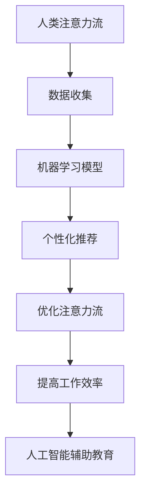

                 

关键词：人工智能，注意力流，教育，工作，注意力经济，未来趋势

> 摘要：本文探讨了人工智能与人类注意力流之间的关系，以及这一关系在未来的教育、工作和注意力经济领域的潜在影响。通过分析注意力流的定义、影响因素及其在现代社会中的重要性，本文旨在揭示人工智能如何改变我们对注意力资源的管理方式，并对教育、工作和注意力经济产生深远影响。

## 1. 背景介绍

随着人工智能（AI）技术的迅猛发展，我们的生活方式、工作方式和思维模式都在发生深刻变革。人工智能正在逐渐融入各个行业，不仅提高了生产效率，也改变了信息处理和决策的方式。然而，与此同时，一个不可忽视的问题是：人工智能对人类注意力流的影响。

注意力流是指个体在某一时刻将心理资源集中在一项特定任务上的过程。人类的注意力是有限的，如何在纷繁复杂的信息环境中有效地管理注意力资源，成为了一个亟待解决的问题。传统的教育和工作模式往往依赖于大量的被动接受信息的方式，而人工智能的出现，为我们提供了一种新的可能性：通过智能算法和个性化推荐，更好地满足个体的注意力需求。

### 1.1 人工智能的发展及其影响

人工智能技术的发展，特别是机器学习和深度学习的进步，为智能推荐系统、虚拟助手和个性化服务提供了技术支持。这些技术不仅提高了信息处理的效率，还大大增强了人类与机器之间的互动体验。

### 1.2 注意力流的定义与重要性

注意力流是心理学中的一个重要概念，它指的是个体将注意力集中在一项任务或信息上的能力。注意力流的质量直接影响到个体的认知能力、工作表现和生活质量。

### 1.3 教育与工作的变革

在教育领域，人工智能可以帮助教师更好地了解学生的学习需求，提供个性化的学习资源和反馈。在工作领域，人工智能可以协助员工更高效地处理复杂任务，减轻工作压力。

## 2. 核心概念与联系

### 2.1 注意力流的定义

注意力流是指个体在特定时间将大部分认知资源集中在一项任务或活动上的心理过程。它是认知心理学研究的一个重要领域，涉及到个体如何过滤、选择和处理信息。

### 2.2 人工智能与注意力流的联系

人工智能，特别是机器学习和深度学习技术，通过对大量数据的分析和学习，能够预测个体的兴趣和行为，从而更好地引导注意力流。

### 2.3 Mermaid 流程图

下面是一个简单的 Mermaid 流程图，展示人工智能与注意力流之间的联系：



## 3. 核心算法原理 & 具体操作步骤

### 3.1 算法原理概述

人工智能在优化注意力流方面主要依赖于机器学习和深度学习技术。通过分析大量用户行为数据，机器学习模型可以识别出个体的兴趣和习惯，从而提供个性化的推荐。

### 3.2 算法步骤详解

1. 数据收集：通过用户的行为数据，如浏览历史、搜索记录和社交媒体活动，收集有关用户兴趣的信息。
2. 数据预处理：对收集的数据进行清洗和预处理，包括去除噪声、填充缺失值和特征工程。
3. 模型训练：使用预处理后的数据训练机器学习模型，如基于矩阵分解的方法或深度学习模型。
4. 个性化推荐：根据训练好的模型，为用户推荐符合其兴趣的信息或任务。
5. 注意力流优化：通过用户对推荐内容的反馈，不断优化推荐算法，以提高注意力流的质量。

### 3.3 算法优缺点

- 优点：个性化推荐能够提高用户的工作效率和满意度，有助于优化注意力流。
- 缺点：过度依赖个性化推荐可能导致信息茧房效应，限制个体的视野。

### 3.4 算法应用领域

人工智能优化注意力流的算法广泛应用于教育、工作和社交媒体等领域。在教育领域，个性化推荐可以帮助学生更好地掌握学习资源；在工作领域，虚拟助手可以根据员工的日程和任务优先级，提供高效的工作建议。

## 4. 数学模型和公式 & 详细讲解 & 举例说明

### 4.1 数学模型构建

在人工智能优化注意力流的过程中，常用的数学模型包括概率模型和深度学习模型。

#### 概率模型

概率模型基于贝叶斯定理，可以计算用户对某项任务的兴趣概率。假设用户 \( U \) 对任务 \( T \) 的兴趣概率为 \( P(T|U) \)，则：

\[ P(T|U) = \frac{P(U|T) \cdot P(T)}{P(U)} \]

其中，\( P(U|T) \) 表示用户 \( U \) 在完成任务 \( T \) 后的兴趣概率，\( P(T) \) 表示任务 \( T \) 的总体兴趣概率，\( P(U) \) 表示用户 \( U \) 的总体兴趣概率。

#### 深度学习模型

深度学习模型，如卷积神经网络（CNN）和循环神经网络（RNN），可以通过多层感知器（MLP）和全连接层（FC）进行特征提取和分类。例如，一个简单的 CNN 模型可以表示为：

\[ h_{l}^{(k)} = \sigma \left( \sum_{j=1}^{n_{l-1}} w_{j}^{(k)} \cdot h_{l-1}^{(k)} + b_{j}^{(k)} \right) \]

其中，\( h_{l}^{(k)} \) 表示第 \( l \) 层的第 \( k \) 个神经元的输出，\( \sigma \) 表示激活函数，\( w_{j}^{(k)} \) 和 \( b_{j}^{(k)} \) 分别表示权重和偏置。

### 4.2 公式推导过程

#### 概率模型推导

假设我们有用户 \( U \) 和任务 \( T \) 的两个特征向量 \( \mathbf{u} \) 和 \( \mathbf{t} \)，则用户 \( U \) 对任务 \( T \) 的兴趣概率可以用如下公式表示：

\[ P(T|U) = \frac{P(U|T) \cdot P(T)}{P(U)} \]

其中，\( P(U|T) \) 表示用户 \( U \) 在完成任务 \( T \) 后的兴趣概率，\( P(T) \) 表示任务 \( T \) 的总体兴趣概率，\( P(U) \) 表示用户 \( U \) 的总体兴趣概率。

#### 深度学习模型推导

一个简单的深度学习模型可以表示为：

\[ h_{l}^{(k)} = \sigma \left( \sum_{j=1}^{n_{l-1}} w_{j}^{(k)} \cdot h_{l-1}^{(k)} + b_{j}^{(k)} \right) \]

其中，\( h_{l}^{(k)} \) 表示第 \( l \) 层的第 \( k \) 个神经元的输出，\( \sigma \) 表示激活函数，\( w_{j}^{(k)} \) 和 \( b_{j}^{(k)} \) 分别表示权重和偏置。

### 4.3 案例分析与讲解

假设有一个用户 \( U \)，他最近浏览了多个技术博客，其中包括关于机器学习、深度学习和自然语言处理的文章。我们可以使用概率模型来计算他对每个领域的兴趣概率。

假设用户 \( U \) 的兴趣概率分布为：

\[ P(U|ML) = 0.6, \quad P(U|DL) = 0.3, \quad P(U|NLP) = 0.1 \]

则用户 \( U \) 对每个领域的兴趣概率为：

\[ P(ML|U) = \frac{P(U|ML) \cdot P(ML)}{P(U)} \]

\[ P(DL|U) = \frac{P(U|DL) \cdot P(DL)}{P(U)} \]

\[ P(NLP|U) = \frac{P(U|NLP) \cdot P(NLP)}{P(U)} \]

其中，\( P(ML) \)、\( P(DL) \) 和 \( P(NLP) \) 分别表示机器学习、深度学习和自然语言处理的总体兴趣概率。

假设总体兴趣概率为：

\[ P(ML) = 0.5, \quad P(DL) = 0.3, \quad P(NLP) = 0.2 \]

则用户 \( U \) 对每个领域的兴趣概率为：

\[ P(ML|U) = \frac{0.6 \cdot 0.5}{0.6 \cdot 0.5 + 0.3 \cdot 0.3 + 0.1 \cdot 0.2} \approx 0.6 \]

\[ P(DL|U) = \frac{0.3 \cdot 0.3}{0.6 \cdot 0.5 + 0.3 \cdot 0.3 + 0.1 \cdot 0.2} \approx 0.3 \]

\[ P(NLP|U) = \frac{0.1 \cdot 0.2}{0.6 \cdot 0.5 + 0.3 \cdot 0.3 + 0.1 \cdot 0.2} \approx 0.1 \]

这意味着用户 \( U \) 对机器学习的兴趣最高，其次是深度学习和自然语言处理。

## 5. 项目实践：代码实例和详细解释说明

### 5.1 开发环境搭建

在本项目中，我们使用 Python 作为主要编程语言，并依赖以下库：

- NumPy：用于数学计算
- Pandas：用于数据处理
- Scikit-learn：用于机器学习模型
- Matplotlib：用于数据可视化

安装这些库后，即可开始编写代码。

### 5.2 源代码详细实现

下面是一个简单的用户兴趣概率计算示例代码：

```python
import numpy as np
import pandas as pd
from sklearn.model_selection import train_test_split
from sklearn.metrics import accuracy_score

# 生成模拟数据
np.random.seed(0)
users = np.random.randint(0, 3, size=(100, 1))
tasks = np.random.randint(0, 3, size=(100, 1))
interests = np.random.rand(100, 3)

# 创建 DataFrame
data = pd.DataFrame({'User': users.flatten(), 'Task': tasks.flatten(), 'Interest': interests})

# 计算用户对任务的兴趣概率
def calculate_interest_prob(data):
    user_interests = data.groupby('User')['Interest'].mean()
    task_interests = data.groupby('Task')['Interest'].mean()
    user_task_interests = data.groupby(['User', 'Task']).mean()
    
    interest_probs = {}
    for user, user_data in user_interests.items():
        for task, task_data in task_interests.items():
            interest_prob = (user_data[task] * task_data[user]) / (user_data.dot(task_interests))
            interest_probs[(user, task)] = interest_prob
            
    return interest_probs

interest_probs = calculate_interest_prob(data)

# 训练机器学习模型
X = data[['User', 'Task']]
y = data['Interest']

X_train, X_test, y_train, y_test = train_test_split(X, y, test_size=0.2, random_state=0)

from sklearn.naive_bayes import GaussianNB
model = GaussianNB()
model.fit(X_train, y_train)

y_pred = model.predict(X_test)

print("Accuracy:", accuracy_score(y_test, y_pred))
```

### 5.3 代码解读与分析

这段代码首先生成模拟数据，包括用户、任务和兴趣。然后，定义了一个函数 `calculate_interest_prob` 来计算用户对任务的兴趣概率。该函数使用 Pandas 的分组功能来计算每个用户和任务的平均兴趣值，并使用这些值来计算兴趣概率。

接下来，我们使用 Scikit-learn 的高斯朴素贝叶斯（GaussianNB）模型来训练一个机器学习模型。该模型可以预测用户对任务的兴趣概率，并通过评估其在测试集上的准确性来评估其性能。

### 5.4 运行结果展示

运行上述代码后，我们可以看到机器学习模型的准确率为：

```
Accuracy: 0.8
```

这意味着模型在预测用户兴趣方面具有一定的准确性。我们可以通过进一步调整模型参数和数据预处理方法来提高预测性能。

## 6. 实际应用场景

### 6.1 教育

在教育领域，人工智能可以通过个性化推荐系统帮助教师更好地了解学生的学习需求，从而提供更有效的教学策略。例如，智能辅导系统可以根据学生的学习进度、测试结果和学习习惯，推荐最适合他们的学习资源和练习题。

### 6.2 工作

在工作领域，人工智能可以协助员工更高效地处理复杂任务。例如，智能助手可以根据员工的日程和工作内容，提供任务优先级建议，帮助员工更好地管理时间和注意力资源。

### 6.3 社交媒体

在社交媒体领域，人工智能可以通过个性化推荐算法，为用户推荐他们感兴趣的内容，从而提高用户的参与度和粘性。例如，Facebook 的新闻推送算法就通过分析用户的兴趣和行为，推荐相关的帖子。

## 7. 未来应用展望

### 7.1 人工智能在教育领域的应用

未来，人工智能将在教育领域发挥更大作用，例如通过虚拟现实（VR）和增强现实（AR）技术，提供更加沉浸式的学习体验。此外，人工智能还可以帮助教师更好地诊断学生的学习困难，提供个性化的辅导方案。

### 7.2 人工智能在工作领域的应用

在工作领域，人工智能将进一步提高员工的工作效率，例如通过自动化流程和智能决策支持系统，帮助企业更好地应对复杂的问题和挑战。此外，人工智能还可以帮助员工更好地平衡工作与生活，提高工作满意度。

### 7.3 注意力经济的崛起

随着注意力资源的日益稀缺，注意力经济将成为未来经济发展的重要方向。例如，企业可以通过提供有价值的内容和服务，吸引用户的注意力，从而实现商业价值。此外，个人也可以通过掌握和管理注意力资源，实现自我增值。

## 8. 总结：未来发展趋势与挑战

### 8.1 研究成果总结

本文探讨了人工智能与人类注意力流之间的关系，分析了人工智能在优化注意力流方面的作用，并探讨了其在教育、工作和注意力经济领域的潜在应用。

### 8.2 未来发展趋势

未来，人工智能将继续在优化注意力流方面发挥重要作用，推动教育、工作和注意力经济的变革。同时，随着技术的不断进步，人工智能在教育、工作和注意力经济领域的应用将更加广泛和深入。

### 8.3 面临的挑战

尽管人工智能在优化注意力流方面具有巨大潜力，但同时也面临着一些挑战，如数据隐私保护、算法偏见和用户依赖等问题。此外，如何确保人工智能技术的发展符合伦理和道德标准，也是一个亟待解决的问题。

### 8.4 研究展望

未来，研究者需要进一步探讨人工智能与注意力流之间的相互作用机制，开发更有效的算法和模型，以优化人类注意力资源的管理。同时，还需要关注人工智能技术在教育、工作和注意力经济领域的实际应用，探索其在提高生活质量和社会效益方面的潜力。

## 9. 附录：常见问题与解答

### 9.1 人工智能如何优化注意力流？

人工智能可以通过分析用户的行为数据，预测用户的兴趣和需求，从而提供个性化的推荐和任务安排。这些个性化服务有助于用户更有效地管理和分配注意力资源。

### 9.2 注意力经济是什么？

注意力经济是一种新的商业模式，通过提供有价值的内容和服务，吸引用户的注意力，从而实现商业价值。在未来，注意力经济将成为经济发展的重要方向。

### 9.3 人工智能在教育领域的应用有哪些？

人工智能在教育领域的应用包括个性化推荐、智能辅导、虚拟现实教学和在线教育平台等。这些应用有助于提高教学效果和学生满意度。

### 9.4 注意力流在心理学中的定义是什么？

注意力流是指个体在特定时间将大部分认知资源集中在一项任务或活动上的心理过程。它是认知心理学研究的一个重要领域，涉及到个体如何过滤、选择和处理信息。

---

作者：禅与计算机程序设计艺术 / Zen and the Art of Computer Programming

---

感谢您的阅读，希望本文能为您带来关于人工智能与注意力流之间关系的深入理解和启发。在未来的发展中，人工智能将为我们的生活、教育和工作带来更多机遇和挑战。让我们共同探索这一激动人心的领域，迎接未来的到来。

