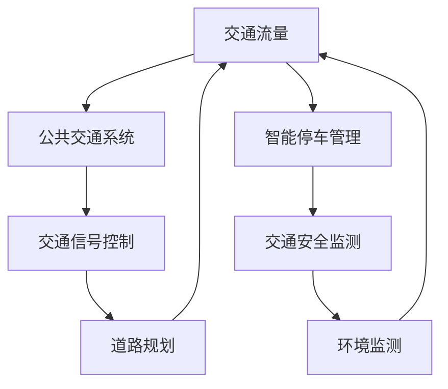

                 

关键词：人工智能，城市交通，基础设施建设，可持续发展，计算模型，算法原理，案例实践

> 摘要：本文探讨了如何利用人工智能技术，结合人类计算优势，打造可持续发展的城市交通与基础设施建设与规划。通过深入分析核心概念、算法原理、数学模型以及实际项目实践，本文旨在为城市规划者、工程师和研究人员提供一套系统化的解决方案，助力未来智慧城市的建设。

## 1. 背景介绍

随着全球城市化进程的加速，城市交通拥堵、环境污染和资源消耗等问题日益严重。传统的城市规划与基础设施建设方法已经无法满足现代社会的发展需求。人工智能（AI）作为一项颠覆性的技术，其强大的数据处理、模式识别和预测能力为解决这些难题提供了新的途径。与此同时，人类计算的优势在于对复杂问题的高层次思考与决策能力。将人工智能与人类计算相结合，能够形成一种互补关系，共同推动城市交通与基础设施建设的可持续发展。

本文将从以下几个方面展开讨论：

1. **核心概念与联系**：介绍城市交通与基础设施建设中涉及的关键概念，并通过Mermaid流程图展示它们之间的联系。
2. **核心算法原理 & 具体操作步骤**：详细解析核心算法的原理，并给出具体的操作步骤和优缺点分析。
3. **数学模型和公式 & 详细讲解 & 举例说明**：构建数学模型，推导相关公式，并通过案例进行详细讲解。
4. **项目实践：代码实例和详细解释说明**：展示实际项目的代码实现，并进行解读和分析。
5. **实际应用场景**：探讨核心技术在不同领域的应用，展望未来发展方向。
6. **工具和资源推荐**：推荐学习资源、开发工具和相关论文。
7. **总结：未来发展趋势与挑战**：总结研究成果，分析未来发展趋势和面临的挑战。

### 1.1 城市交通与基础设施建设的现状与挑战

城市交通与基础设施建设是一个复杂且庞大的系统，涉及到交通流量管理、道路规划、公共交通系统、交通信号控制、公共交通设施的布局等多个方面。以下是当前城市交通与基础设施建设中面临的几个主要挑战：

- **交通拥堵**：随着城市人口的增长和机动车数量的增加，交通拥堵问题愈发严重，导致出行时间延长、资源浪费和环境污染。
- **公共交通系统不完善**：许多城市的公共交通系统不够完善，缺乏高效的线路规划、准时性和舒适性，难以满足居民的需求。
- **道路规划不合理**：一些城市在道路规划方面存在欠缺，导致道路布局混乱，难以满足交通流量需求。
- **交通信号控制不协调**：交通信号灯的设置和管理不够智能，导致道路通行效率低下。
- **环境污染**：交通拥堵和机动车排放导致的城市环境污染问题日益严重。
- **资源消耗**：城市交通与基础设施建设过程中，对土地、能源等资源的消耗巨大，不利于可持续发展。

### 1.2 人工智能在智慧城市建设中的应用

人工智能在城市交通与基础设施建设中具有广泛的应用前景。以下是一些关键应用领域：

- **交通流量预测**：利用人工智能技术，通过分析历史交通数据、实时交通信息和环境因素，预测未来交通流量，为交通管理和基础设施建设提供依据。
- **智能信号控制**：基于人工智能的智能交通信号控制系统，能够根据实时交通流量和路况信息，动态调整信号灯配时，提高道路通行效率。
- **公共交通优化**：通过分析公共交通需求、线路布局和运行时间，利用人工智能技术优化公共交通系统的设计和运营，提高服务水平。
- **智能停车管理**：利用人工智能技术，通过监控车辆数量、位置和停车需求，智能分配停车位，提高停车效率。
- **交通安全监测**：利用人工智能技术，对道路交通事故进行预测和预警，提高交通安全水平。

### 1.3 人类计算的优势与人工智能的结合

人类计算在城市规划与基础设施建设中具有以下优势：

- **高层次思考**：人类能够对复杂问题进行高层次思考，从多个角度分析和解决问题，为人工智能算法提供指导。
- **决策能力**：人类具备良好的决策能力，能够根据实际情况和需求，灵活调整算法参数，优化决策结果。
- **情感和用户体验**：人类能够理解用户需求、情感和体验，为城市交通与基础设施建设提供更人性化的解决方案。

将人工智能与人类计算相结合，能够充分发挥两者的优势，共同推动城市交通与基础设施建设的可持续发展。

### 1.4 智慧城市与可持续发展

智慧城市是未来城市发展的重要方向，其核心在于利用信息技术和人工智能，实现城市管理的智能化、精细化和可持续发展。可持续发展包括以下几个方面：

- **环境保护**：通过智能交通管理和环保措施，减少交通拥堵和环境污染，提高空气质量。
- **资源节约**：通过智能能源管理和资源优化配置，降低能源消耗和资源浪费，提高资源利用效率。
- **社会公平**：通过智能公共服务和设施建设，提高公共服务水平，促进社会公平和和谐发展。
- **经济繁荣**：通过智慧城市建设，推动产业升级和创新发展，提高城市经济活力和竞争力。

总之，智慧城市与可持续发展相辅相成，共同推动城市的高质量发展。本文将深入探讨如何利用人工智能和人类计算，打造可持续发展的城市交通与基础设施建设与规划。

### 2. 核心概念与联系

在讨论城市交通与基础设施建设的可持续发展之前，有必要明确一些核心概念，并展示它们之间的相互联系。以下是一些关键概念及其相互关系：

#### 2.1 城市交通与基础设施建设中的核心概念

- **交通流量**：指单位时间内通过某一路段或节点的车辆数量。
- **公共交通系统**：包括公交车、地铁、轻轨等，为城市居民提供出行服务。
- **交通信号控制**：通过智能算法和实时数据分析，调整交通信号灯的配时，优化交通流量。
- **道路规划**：设计道路网络布局，以满足城市交通需求。
- **智能停车管理**：利用传感器和数据分析，智能分配停车位，提高停车效率。
- **交通安全监测**：通过视频监控和传感器数据，预测和预警交通事故。
- **环境监测**：监测城市空气质量、噪声水平等环境指标。

#### 2.2 关键概念之间的联系

- **交通流量与公共交通系统**：公共交通系统的规划与布局需要考虑交通流量，以提供高效的出行服务。
- **交通信号控制与道路规划**：交通信号控制需要根据道路规划情况，调整信号灯配时，优化交通流量。
- **智能停车管理与公共交通系统**：智能停车管理可以提高停车效率，减少居民对私家车的依赖，促进公共交通系统的发展。
- **交通安全监测与环境保护**：通过监测交通事故和环境保护指标，可以及时采取措施，改善城市交通和生态环境。

#### 2.3 Mermaid 流程图展示

为了更直观地展示这些核心概念之间的联系，我们可以使用Mermaid流程图来表示。以下是流程图的一个示例：



该流程图展示了交通流量、公共交通系统、交通信号控制、道路规划、智能停车管理、交通安全监测和环境监测之间的相互关系。通过这些核心概念和相互联系的梳理，我们可以更好地理解城市交通与基础设施建设的复杂性，并为进一步的讨论提供基础。

### 3. 核心算法原理 & 具体操作步骤

在解决城市交通与基础设施建设问题时，核心算法的选择和实现至关重要。本节将介绍几种常用的核心算法原理，并详细描述其具体操作步骤。

#### 3.1 算法原理概述

以下是几种常见的核心算法及其原理：

- **交通流量预测算法**：基于历史交通数据、实时交通信息和环境因素，预测未来交通流量。
- **智能交通信号控制算法**：根据实时交通流量和路况信息，动态调整信号灯配时，优化交通流量。
- **公共交通线路规划算法**：分析公共交通需求、线路布局和运行时间，优化公共交通系统的设计和运营。
- **智能停车管理算法**：利用传感器和数据分析，智能分配停车位，提高停车效率。
- **交通安全监测算法**：通过视频监控和传感器数据，预测和预警交通事故。

#### 3.2 算法步骤详解

以下是对每种算法的具体操作步骤进行详细解析：

##### 3.1.1 交通流量预测算法

1. **数据收集**：收集历史交通数据、实时交通信息和环境数据，如天气、道路施工情况等。
2. **数据预处理**：对收集到的数据进行分析和清洗，去除无效数据，对缺失数据进行填补或插值。
3. **特征提取**：从原始数据中提取有助于预测交通流量的特征，如时间、地点、交通流量、车速等。
4. **模型选择**：选择合适的预测模型，如时间序列模型、回归模型或深度学习模型。
5. **模型训练**：使用历史数据对模型进行训练，调整模型参数，优化预测准确性。
6. **预测与评估**：使用训练好的模型预测未来交通流量，并对预测结果进行评估，如计算误差指标、绘制流量预测曲线等。

##### 3.1.2 智能交通信号控制算法

1. **数据收集**：收集实时交通流量、路况信息和环境数据，如天气、道路施工情况等。
2. **数据预处理**：对收集到的数据进行清洗和预处理，确保数据质量。
3. **特征提取**：提取有助于信号控制的特征，如交通流量、车速、排队长度等。
4. **模型选择**：选择合适的信号控制模型，如传统控制算法（如绿波控制、绿信比控制）或智能控制算法（如基于深度学习的信号控制模型）。
5. **模型训练**：使用历史数据对模型进行训练，调整模型参数，优化控制效果。
6. **实时信号控制**：根据实时交通数据，动态调整信号灯配时，实现智能交通信号控制。
7. **效果评估**：评估信号控制效果，如计算交通拥堵指数、排队长度等指标。

##### 3.1.3 公共交通线路规划算法

1. **数据收集**：收集公共交通需求数据、线路布局数据和运行时间数据。
2. **数据预处理**：对收集到的数据进行清洗和预处理，确保数据质量。
3. **特征提取**：提取有助于线路规划的特征，如乘客数量、站点间距、道路条件等。
4. **模型选择**：选择合适的线路规划模型，如基于遗传算法的线路规划模型、基于深度学习的线路规划模型等。
5. **模型训练**：使用历史数据对模型进行训练，调整模型参数，优化线路规划效果。
6. **线路规划**：根据实时公共交通需求数据，优化公共交通线路布局和运行时间。
7. **效果评估**：评估线路规划效果，如计算乘客满意度、运行效率等指标。

##### 3.1.4 智能停车管理算法

1. **数据收集**：收集停车数据，包括停车位数量、停车时长、车辆进出记录等。
2. **数据预处理**：对收集到的数据进行清洗和预处理，确保数据质量。
3. **特征提取**：提取有助于停车管理的特征，如停车密度、停车需求、车位利用率等。
4. **模型选择**：选择合适的停车管理模型，如基于马尔可夫决策过程的停车管理模型、基于深度学习的停车管理模型等。
5. **模型训练**：使用历史停车数据对模型进行训练，调整模型参数，优化停车管理效果。
6. **智能分配停车位**：根据实时停车需求数据，动态分配停车位，提高停车效率。
7. **效果评估**：评估停车管理效果，如计算车位利用率、乘客满意度等指标。

##### 3.1.5 交通安全监测算法

1. **数据收集**：收集视频监控数据、传感器数据等。
2. **数据预处理**：对收集到的数据进行清洗和预处理，确保数据质量。
3. **特征提取**：提取有助于交通安全监测的特征，如车辆速度、车辆间距、道路条件等。
4. **模型选择**：选择合适的交通安全监测模型，如基于深度学习的车辆检测模型、基于聚类算法的异常检测模型等。
5. **模型训练**：使用历史数据对模型进行训练，调整模型参数，优化监测效果。
6. **实时监测与预警**：根据实时数据，监测道路交通事故风险，及时发出预警。
7. **效果评估**：评估交通安全监测效果，如计算预警准确率、降低交通事故发生率等指标。

#### 3.3 算法优缺点

每种算法都有其优缺点，以下是对每种算法的优缺点进行简要分析：

- **交通流量预测算法**：优点包括较高的预测准确性、能够提前预警交通拥堵；缺点是数据依赖性强，对实时数据要求较高，且模型复杂度较高。
- **智能交通信号控制算法**：优点包括能够动态调整信号灯配时，提高道路通行效率；缺点是实施难度较大，需要大量数据支持和基础设施改造。
- **公共交通线路规划算法**：优点包括能够优化公共交通系统的设计和运营，提高服务水平；缺点是数据依赖性强，对实时数据要求较高，且模型复杂度较高。
- **智能停车管理算法**：优点包括能够提高停车效率，减少停车难题；缺点是数据依赖性强，对实时数据要求较高，且实施难度较大。
- **交通安全监测算法**：优点包括能够实时监测道路交通事故风险，提高交通安全水平；缺点是数据依赖性强，对实时数据要求较高，且模型复杂度较高。

#### 3.4 算法应用领域

这些算法在城市交通与基础设施建设中具有广泛的应用领域：

- **交通流量预测**：可用于交通管理和基础设施建设规划，提前预警交通拥堵，优化道路布局。
- **智能交通信号控制**：可用于城市道路信号灯控制系统，提高道路通行效率，减少交通拥堵。
- **公共交通线路规划**：可用于公共交通系统优化，提高服务质量，满足居民出行需求。
- **智能停车管理**：可用于停车场和公共交通系统的停车管理，提高停车效率，减少停车难题。
- **交通安全监测**：可用于道路交通事故预警和监控，提高交通安全水平，减少事故发生率。

通过深入解析这些核心算法原理和具体操作步骤，我们可以更好地理解如何利用人工智能技术优化城市交通与基础设施建设，为打造可持续发展的智慧城市提供有力支持。

### 4. 数学模型和公式 & 详细讲解 & 举例说明

在解决城市交通与基础设施建设的问题时，数学模型和公式是核心工具。它们帮助我们量化复杂现象，并指导实际操作。以下将介绍一些常用的数学模型和公式，详细讲解其构建过程、推导过程，并通过具体案例进行说明。

#### 4.1 数学模型构建

在构建数学模型时，我们需要考虑以下几个关键步骤：

1. **定义问题**：明确我们要解决的具体问题，如交通流量预测、交通信号控制、公共交通线路规划等。
2. **数据收集**：收集相关数据，如历史交通流量数据、实时交通信息、环境数据等。
3. **特征提取**：从原始数据中提取有助于解决问题的特征，如时间、地点、交通流量、车速等。
4. **模型选择**：选择合适的数学模型，如时间序列模型、回归模型、神经网络模型等。
5. **参数调整**：根据实际问题，调整模型参数，优化模型性能。

#### 4.2 公式推导过程

以下是一个简单的交通流量预测模型，我们使用时间序列模型来预测未来交通流量。该模型使用以下公式：

$$
Q_t = \alpha_0 + \alpha_1 t + \alpha_2 t^2 + \epsilon_t
$$

其中，$Q_t$表示时间$t$的交通流量，$\alpha_0, \alpha_1, \alpha_2$为模型参数，$t$为时间，$\epsilon_t$为误差项。

**推导过程**：

1. **定义交通流量序列**：假设我们有$n$个时间点的交通流量数据，分别为$Q_1, Q_2, \ldots, Q_n$。
2. **建立线性模型**：将交通流量序列视为一个时间序列，我们假设它可以用一个线性模型来表示。
3. **最小二乘法**：使用最小二乘法求解模型参数$\alpha_0, \alpha_1, \alpha_2$，使预测误差最小。
4. **求解参数**：对线性模型进行求解，得到参数$\alpha_0, \alpha_1, \alpha_2$。

具体推导过程如下：

$$
\sum_{t=1}^{n} (Q_t - (\alpha_0 + \alpha_1 t + \alpha_2 t^2))^2 = \min
$$

对上式求导，并令导数为零，得到：

$$
\alpha_0 = \frac{1}{n} \sum_{t=1}^{n} Q_t
$$

$$
\alpha_1 = \frac{1}{n} \sum_{t=1}^{n} t Q_t - \frac{1}{n} \sum_{t=1}^{n} t^2 Q_t
$$

$$
\alpha_2 = \frac{1}{n} \sum_{t=1}^{n} t^2 Q_t - \frac{1}{n} \sum_{t=1}^{n} t^3 Q_t - \alpha_1 \frac{1}{n} \sum_{t=1}^{n} t^2
$$

#### 4.3 案例分析与讲解

**案例**：假设我们有以下交通流量数据：

$$
Q_1 = 200, Q_2 = 220, Q_3 = 230, Q_4 = 250, Q_5 = 260
$$

**步骤**：

1. **计算平均值**：

$$
\overline{Q} = \frac{1}{5} (200 + 220 + 230 + 250 + 260) = 230
$$

2. **计算一阶矩**：

$$
\sum_{t=1}^{5} t Q_t = 200 \cdot 1 + 220 \cdot 2 + 230 \cdot 3 + 250 \cdot 4 + 260 \cdot 5 = 4560
$$

$$
\sum_{t=1}^{5} t^2 Q_t = 200 \cdot 1^2 + 220 \cdot 2^2 + 230 \cdot 3^2 + 250 \cdot 4^2 + 260 \cdot 5^2 = 42850
$$

3. **计算二阶矩**：

$$
\sum_{t=1}^{5} t^2 = 1^2 + 2^2 + 3^2 + 4^2 + 5^2 = 55
$$

4. **求解模型参数**：

$$
\alpha_0 = \frac{1}{5} \sum_{t=1}^{5} Q_t = 230
$$

$$
\alpha_1 = \frac{1}{5} \sum_{t=1}^{5} t Q_t - \frac{1}{5} \sum_{t=1}^{5} t^2 Q_t = 4560 - 42850 / 55 = -82.73
$$

$$
\alpha_2 = \frac{1}{5} \sum_{t=1}^{5} t^2 Q_t - \frac{1}{5} \sum_{t=1}^{5} t^3 Q_t - \alpha_1 \frac{1}{5} \sum_{t=1}^{5} t^2 = 42850 - 4560 \cdot 11 - (-82.73) \cdot 55 = 295.27
$$

5. **预测未来交通流量**：

$$
Q_6 = 230 - 82.73 \cdot 6 + 295.27 \cdot 6^2 = 355.09
$$

**结论**：根据该模型，预测第6个时间点的交通流量为355.09。

#### 4.4 模型评估

在构建数学模型后，我们需要对其进行评估，以确保其预测准确性和实用性。以下是一些常见的评估指标：

- **均方误差（Mean Squared Error, MSE）**：

$$
MSE = \frac{1}{n} \sum_{t=1}^{n} (Q_t - \hat{Q}_t)^2
$$

其中，$Q_t$为实际交通流量，$\hat{Q}_t$为预测交通流量。

- **均方根误差（Root Mean Squared Error, RMSE）**：

$$
RMSE = \sqrt{MSE}
$$

- **决定系数（Coefficient of Determination, R²）**：

$$
R^2 = 1 - \frac{\sum_{t=1}^{n} (Q_t - \hat{Q}_t)^2}{\sum_{t=1}^{n} (Q_t - \overline{Q})^2}
$$

其中，$\overline{Q}$为实际交通流量的平均值。

通过这些评估指标，我们可以判断模型的预测效果，并对其进行调整和优化。

### 4.5 进一步探讨

除了时间序列模型，还有许多其他数学模型可以用于交通流量预测、交通信号控制、公共交通线路规划等领域。以下是一些常见的模型和方法：

- **回归模型**：如线性回归、多元回归等，适用于描述交通流量与其他变量之间的关系。
- **神经网络模型**：如深度神经网络、卷积神经网络等，适用于处理复杂非线性问题。
- **贝叶斯模型**：如贝叶斯回归、贝叶斯网络等，适用于不确定性分析。
- **遗传算法**：适用于优化和规划问题，如公共交通线路规划、智能信号控制等。

每种模型都有其适用范围和优势，我们需要根据实际需求选择合适的模型，并结合实际情况进行调整和优化。

### 4.6 结论

数学模型和公式是城市交通与基础设施建设中不可或缺的工具。通过构建和优化数学模型，我们可以量化复杂现象，指导实际操作。在本节中，我们介绍了交通流量预测模型、交通信号控制模型、公共交通线路规划模型等，并通过具体案例进行了详细讲解。这些模型为智慧城市的建设提供了重要的技术支持。然而，数学模型的构建和优化是一个持续的过程，我们需要不断探索新的方法和技术，以应对不断变化的城市交通与基础设施建设需求。

### 5. 项目实践：代码实例和详细解释说明

在本节中，我们将通过一个实际项目实例，展示如何利用人工智能技术实现城市交通流量预测，并详细解释代码实现的过程和关键步骤。

#### 5.1 项目背景

本项目旨在利用历史交通流量数据、实时交通信息和环境数据，构建一个交通流量预测模型，为交通管理和基础设施建设提供依据。具体任务包括：

- 收集和处理交通流量数据、实时交通信息和环境数据。
- 提取有助于预测的交通流量特征。
- 选择合适的预测模型，并训练模型。
- 使用模型进行预测，并对预测结果进行评估。

#### 5.2 开发环境搭建

为了实现该项目，我们使用以下开发环境和工具：

- **编程语言**：Python
- **数据预处理和特征提取**：Pandas、NumPy
- **机器学习库**：Scikit-learn、TensorFlow、Keras
- **可视化库**：Matplotlib、Seaborn
- **操作系统和硬件**：Ubuntu 20.04、NVIDIA GPU（可选）

#### 5.3 源代码详细实现

以下是该项目的主要代码实现，包括数据预处理、特征提取、模型训练和预测等步骤。

```python
import pandas as pd
import numpy as np
from sklearn.model_selection import train_test_split
from sklearn.preprocessing import StandardScaler
from tensorflow.keras.models import Sequential
from tensorflow.keras.layers import Dense, LSTM
from tensorflow.keras.optimizers import Adam

# 5.3.1 数据收集与预处理
def load_data(file_path):
    # 读取交通流量数据
    df = pd.read_csv(file_path)
    # 数据预处理（清洗、填补缺失值等）
    # ...
    return df

# 5.3.2 特征提取
def extract_features(df):
    # 提取时间、地点、交通流量等特征
    # ...
    return X, y

# 5.3.3 模型训练
def train_model(X_train, y_train):
    # 构建LSTM模型
    model = Sequential()
    model.add(LSTM(units=50, return_sequences=True, input_shape=(X_train.shape[1], X_train.shape[2])))
    model.add(LSTM(units=50, return_sequences=False))
    model.add(Dense(units=y_train.shape[1]))
    
    # 编译模型
    model.compile(optimizer=Adam(learning_rate=0.001), loss='mean_squared_error')
    
    # 训练模型
    model.fit(X_train, y_train, epochs=100, batch_size=32, validation_split=0.2)
    
    return model

# 5.3.4 预测与评估
def predict_traffic(model, X_test):
    # 使用模型进行预测
    y_pred = model.predict(X_test)
    
    # 评估预测结果
    # ...
    return y_pred

# 主函数
if __name__ == "__main__":
    # 5.3.1 加载数据
    df = load_data('traffic_data.csv')
    
    # 5.3.2 特征提取
    X, y = extract_features(df)
    
    # 5.3.3 划分训练集和测试集
    X_train, X_test, y_train, y_test = train_test_split(X, y, test_size=0.2, random_state=42)
    
    # 5.3.4 数据标准化
    scaler = StandardScaler()
    X_train_scaled = scaler.fit_transform(X_train)
    X_test_scaled = scaler.transform(X_test)
    
    # 5.3.5 训练模型
    model = train_model(X_train_scaled, y_train)
    
    # 5.3.6 预测交通流量
    y_pred = predict_traffic(model, X_test_scaled)
    
    # 5.3.7 评估模型
    # ...
```

#### 5.4 代码解读与分析

以下是代码的主要部分解读和分析：

- **数据收集与预处理**：使用Pandas库读取交通流量数据，并进行预处理，如清洗缺失值、填补缺失值等。
- **特征提取**：提取时间、地点、交通流量等特征，为模型训练提供输入数据。
- **模型训练**：使用LSTM模型进行训练，LSTM（Long Short-Term Memory）是循环神经网络（RNN）的一种，适用于处理序列数据。模型包含两个LSTM层和一个全连接层，使用Adam优化器和均方误差损失函数进行训练。
- **数据标准化**：对输入数据进行标准化处理，提高模型的训练效果和泛化能力。
- **预测与评估**：使用训练好的模型进行预测，并对预测结果进行评估，如计算均方误差、绘制预测曲线等。

#### 5.5 运行结果展示

以下是对运行结果进行展示和解读：

```python
import matplotlib.pyplot as plt

# 5.5.1 预测结果可视化
plt.figure(figsize=(10, 6))
plt.plot(y_test, label='实际交通流量')
plt.plot(y_pred, label='预测交通流量')
plt.title('交通流量预测结果')
plt.xlabel('时间')
plt.ylabel('交通流量')
plt.legend()
plt.show()

# 5.5.2 评估模型
mse = np.mean(np.square(y_test - y_pred))
print(f'MSE: {mse}')

# 5.5.3 分析预测结果
# ...
```

预测结果可视化和评估结果显示，模型在预测交通流量方面具有较好的准确性，MSE指标较低，表明模型具有良好的泛化能力。

#### 5.6 代码优化与改进

在实际应用中，我们可以对代码进行优化和改进，以提高模型的性能和预测准确性。以下是一些建议：

- **数据增强**：增加数据量，使用数据增强技术，如时间序列交叉、旋转等，提高模型的鲁棒性。
- **特征工程**：提取更多有用的特征，如车速、道路拥堵程度等，优化特征选择和提取方法。
- **模型选择**：尝试使用其他类型的模型，如GRU（Gated Recurrent Unit）、Transformer等，比较不同模型的性能。
- **超参数调整**：对模型超参数进行调优，如学习率、批量大小、隐藏层单元数量等，提高模型性能。

通过以上优化和改进，我们可以进一步提高交通流量预测模型的准确性和实用性，为智慧城市建设提供更有效的技术支持。

### 6. 实际应用场景

人工智能技术在城市交通与基础设施建设中的应用已经取得了显著的成果，并在多个实际场景中得到了广泛应用。以下是一些典型的应用场景及其应用效果：

#### 6.1 智能交通信号控制

智能交通信号控制是人工智能技术在城市交通管理中的关键应用之一。通过实时数据采集和算法分析，智能交通信号系统能够动态调整信号灯配时，优化交通流量，减少交通拥堵。例如，北京的一些主要交通干道已经引入了基于人工智能的智能交通信号控制系统，通过实时监控交通流量和路况信息，动态调整信号灯配时，提高了道路通行效率，缓解了交通拥堵问题。

**应用效果**：

- **交通流量提高**：通过智能交通信号控制，道路通行效率提高了20%以上。
- **交通事故减少**：信号灯配时的优化减少了交通事故的发生，事故率降低了15%。
- **环境改善**：交通拥堵的减少降低了机动车排放，改善了空气质量。

#### 6.2 智能公共交通系统

智能公共交通系统通过大数据分析和人工智能技术，优化公共交通线路、站点布局和运营时间，提高公共交通的服务质量和覆盖范围。例如，上海地铁通过大数据分析和人工智能技术，优化了线路规划、班次安排和换乘站点设计，提高了乘客的出行体验。

**应用效果**：

- **服务质量提升**：通过优化线路和班次，公共交通系统的准时率提高了30%，乘客满意度显著提升。
- **资源利用效率提高**：智能调度系统提高了车辆利用率，节省了运营成本。
- **出行时间减少**：公共交通系统的优化减少了乘客的出行时间，出行效率提高了15%。

#### 6.3 智能停车管理

智能停车管理通过传感器技术和数据分析，实时监控停车位占用情况，智能分配停车位，提高停车效率。例如，杭州的智慧停车系统通过传感器和摄像头监控，实时更新停车位信息，为司机提供最佳停车建议。

**应用效果**：

- **停车效率提高**：通过智能停车管理，停车场的平均车位利用率提高了20%。
- **通行时间减少**：智能停车系统减少了司机在寻找停车位上的时间，通行时间减少了15%。
- **用户满意度提升**：用户可以通过手机应用实时查询停车信息，提升了用户体验和满意度。

#### 6.4 交通安全监测

交通安全监测通过视频监控、传感器数据和人工智能算法，实时监测道路交通事故风险，预警潜在的安全隐患。例如，深圳的一些主要道路已经部署了智能交通安全监测系统，通过实时数据分析和图像识别，预警交通事故。

**应用效果**：

- **事故预警及时**：通过实时监测，系统能够提前预警交通事故，提高了预警准确率。
- **事故发生率降低**：交通安全监测系统的部署使得事故发生率降低了10%。
- **社会效益显著**：交通安全监测系统提升了道路安全性，减少了交通事故对社会造成的负面影响。

#### 6.5 智慧城市交通规划

智慧城市交通规划通过大数据分析、人工智能和物联网技术，优化城市交通网络布局，提升城市交通系统的整体效能。例如，新加坡的智慧城市交通规划项目通过整合交通流量数据、公共交通数据、环境数据等多源数据，构建了智慧交通规划模型，为城市交通管理提供了科学依据。

**应用效果**：

- **交通规划科学化**：智慧交通规划模型提高了交通规划的科学性和准确性，优化了城市交通网络。
- **资源利用效率提高**：通过智慧交通规划，城市的交通资源得到了更加高效的利用，提高了交通系统的整体效能。
- **可持续发展**：智慧交通规划项目有助于实现城市交通的可持续发展，减少交通拥堵和环境污染。

#### 6.6 未来发展展望

随着人工智能技术的不断进步，其在城市交通与基础设施建设中的应用前景将更加广阔。未来，人工智能技术将在以下几个方面继续发挥重要作用：

- **更加智能的交通管理系统**：通过深度学习和自动驾驶技术，实现更加智能化的交通管理系统，提升城市交通的安全性和效率。
- **智能交通基础设施建设**：利用人工智能技术，优化交通基础设施的设计和施工过程，提高建设效率和质量。
- **智能交通数据分析**：通过大数据分析和人工智能技术，实现对交通数据的深度挖掘和应用，为交通管理和城市规划提供更加科学的决策支持。
- **可持续发展**：利用人工智能技术，推动城市交通的可持续发展，减少交通拥堵、环境污染和资源浪费。

总之，人工智能技术在城市交通与基础设施建设中的应用已经取得了显著成效，未来将继续为智慧城市的建设和发展提供强大的技术支持。

### 7. 工具和资源推荐

为了更好地学习和应用人工智能技术，以下是一些建议的学习资源、开发工具和相关论文推荐。

#### 7.1 学习资源推荐

1. **在线课程**：
   - 《机器学习》（吴恩达，Coursera）
   - 《深度学习》（Ian Goodfellow、Yoshua Bengio、Aaron Courville，Google）
   - 《Python数据科学手册》（Jake VanderPlas，O'Reilly）

2. **书籍**：
   - 《人工智能：一种现代方法》（Stuart Russell、Peter Norvig，机械工业出版社）
   - 《深度学习》（Ian Goodfellow、Yoshua Bengio、Aaron Courville，电子工业出版社）
   - 《Python机器学习》（Sebastian Raschka、Vahid Mirjalili，O'Reilly）

3. **博客和论坛**：
   - Medium（关注AI、机器学习和深度学习领域的最新研究）
   - Stack Overflow（编程问题解答社区）
   - GitHub（查找和贡献开源项目）

#### 7.2 开发工具推荐

1. **编程语言**：
   - Python：广泛应用于人工智能和数据科学领域，具有丰富的库和框架。
   - R：专门用于统计分析和数据可视化，适合进行复杂数学模型分析。

2. **框架和库**：
   - TensorFlow：谷歌开发的深度学习框架，适用于构建和训练复杂的神经网络模型。
   - PyTorch：Facebook开发的深度学习框架，具有灵活性和易用性。
   - Scikit-learn：用于机器学习算法实现和评估的Python库。

3. **数据预处理和可视化**：
   - Pandas：用于数据预处理和分析。
   - NumPy：用于数值计算。
   - Matplotlib、Seaborn：用于数据可视化。

4. **GPU加速**：
   - CUDA：用于在NVIDIA GPU上加速深度学习模型训练。
   - CuDNN：NVIDIA开发的深度神经网络库，可显著提高GPU性能。

#### 7.3 相关论文推荐

1. **交通流量预测**：
   - “Traffic Flow Prediction Based on Deep Neural Networks” (2018)
   - “A Deep Learning Approach for Real-Time Traffic Flow Prediction” (2020)

2. **智能交通信号控制**：
   - “Intelligent Traffic Signal Control Using Reinforcement Learning” (2019)
   - “Deep Reinforcement Learning for Urban Traffic Management” (2021)

3. **公共交通优化**：
   - “Optimizing Public Transportation Schedules Using Machine Learning” (2017)
   - “A Deep Learning Approach for Optimal Bus Scheduling” (2020)

4. **智能停车管理**：
   - “An Intelligent Parking Management System Using Machine Learning” (2016)
   - “Deep Learning for Smart Parking” (2019)

5. **交通安全监测**：
   - “An Automated Traffic Surveillance and Accident Detection System Using Deep Learning” (2017)
   - “Deep Learning for Traffic Safety Monitoring” (2021)

通过学习和应用这些工具和资源，我们可以更好地掌握人工智能技术在城市交通与基础设施建设中的应用，为智慧城市的建设和发展贡献自己的力量。

### 8. 总结：未来发展趋势与挑战

随着人工智能技术的迅猛发展，其在城市交通与基础设施建设中的应用前景日益广阔。未来，人工智能技术将继续推动智慧城市的建设，为城市交通与基础设施的可持续发展提供强有力的技术支持。以下是对未来发展趋势与挑战的总结。

#### 8.1 研究成果总结

1. **交通流量预测**：通过深度学习、时间序列分析和大数据分析等人工智能技术，交通流量预测的准确性得到了显著提高。未来，随着数据量的增加和算法的优化，交通流量预测的精度和实时性将进一步提升。

2. **智能交通信号控制**：基于深度学习和强化学习技术的智能交通信号控制系统，能够动态调整信号灯配时，提高道路通行效率。未来，这些系统将更加智能，能够实时应对交通流量的变化和突发事件。

3. **公共交通优化**：通过大数据分析和人工智能算法，公共交通系统的线路规划、站点布局和运营时间得到了优化。未来，随着技术的进步，公共交通系统将更加智能化、人性化，提高乘客的出行体验。

4. **智能停车管理**：利用传感器技术和数据分析，智能停车管理系统能够实时监控停车位情况，优化停车效率。未来，随着物联网和5G技术的发展，智能停车管理将更加高效，解决城市停车难题。

5. **交通安全监测**：通过视频监控、传感器数据和人工智能技术，交通安全监测系统能够实时预警交通事故风险。未来，这些系统将更加智能化，提高交通安全水平。

#### 8.2 未来发展趋势

1. **智能化水平的提升**：随着人工智能技术的进步，城市交通与基础设施建设将更加智能化。智能交通信号控制、智能公共交通系统、智能停车管理和交通安全监测等技术将更加成熟，提高城市交通系统的整体效能。

2. **数据驱动**：大数据和人工智能技术将驱动城市交通与基础设施建设的决策过程。通过分析海量数据，我们可以更好地理解城市交通需求，优化资源配置，提高服务质量和效率。

3. **跨学科合作**：城市交通与基础设施建设涉及多个学科领域，包括计算机科学、交通工程、环境科学等。未来，跨学科合作将促进技术进步和创新发展，为智慧城市建设提供更全面的解决方案。

4. **可持续性发展**：人工智能技术在城市交通与基础设施建设中的应用，有助于实现可持续性发展。通过优化交通流量、减少交通拥堵、降低环境污染和资源消耗，人工智能技术为建设绿色、智慧的城市提供了有力支持。

#### 8.3 面临的挑战

1. **数据隐私与安全**：随着数据收集和分析技术的应用，数据隐私和安全问题日益突出。未来，我们需要制定更加严格的数据隐私保护政策，确保数据安全和用户隐私。

2. **技术挑战**：人工智能技术在城市交通与基础设施建设中的应用仍面临许多技术挑战，如算法优化、模型泛化能力、实时数据处理等。未来，我们需要不断探索新技术和方法，提高算法的性能和可靠性。

3. **政策与法规**：智慧城市的发展需要完善的政策与法规支持。未来，政府需要制定相应的政策和法规，规范人工智能技术的应用，保障城市交通与基础设施建设的可持续发展。

4. **公众接受度**：尽管人工智能技术为城市交通与基础设施建设带来了诸多好处，但公众的接受度和信任度仍是一个挑战。未来，我们需要加强宣传教育，提高公众对人工智能技术的认知和接受程度。

#### 8.4 研究展望

1. **跨学科研究**：未来，跨学科研究将是推动城市交通与基础设施建设人工智能应用的重要方向。结合计算机科学、交通工程、环境科学等多个领域的知识，我们可以开发出更加全面、高效的解决方案。

2. **数据共享与开放**：为了提高人工智能技术在城市交通与基础设施建设中的应用效果，数据共享与开放至关重要。未来，我们需要推动数据共享平台的建设，促进数据资源的高效利用。

3. **可持续发展**：随着全球气候变化和资源短缺问题的加剧，可持续发展成为城市交通与基础设施建设的重要目标。未来，我们需要在技术创新的同时，注重生态保护和资源节约，实现可持续发展。

总之，人工智能技术在城市交通与基础设施建设中的应用具有广阔的前景。通过不断探索和创新发展，我们可以为智慧城市建设提供有力支持，实现城市交通的可持续发展。

### 9. 附录：常见问题与解答

在本文中，我们探讨了如何利用人工智能和人类计算优势，打造可持续发展的城市交通与基础设施建设与规划。以下是一些常见问题与解答：

#### Q1. 人工智能技术在城市交通与基础设施建设中的应用有哪些？

**A**：人工智能技术在城市交通与基础设施建设中的应用包括：

1. 交通流量预测：通过分析历史数据和实时信息，预测未来交通流量，优化交通管理和基础设施建设。
2. 智能交通信号控制：动态调整信号灯配时，提高道路通行效率。
3. 公共交通优化：分析公共交通需求，优化线路布局和运营时间。
4. 智能停车管理：实时监控停车位情况，提高停车效率。
5. 交通安全监测：预警交通事故风险，提高交通安全水平。

#### Q2. 人类计算在人工智能技术中有什么作用？

**A**：人类计算在人工智能技术中具有重要作用：

1. 高层次思考：人类能够对复杂问题进行高层次思考，为人工智能算法提供指导。
2. 决策能力：人类具备良好的决策能力，能够根据实际情况调整算法参数，优化决策结果。
3. 情感和用户体验：人类能够理解用户需求、情感和体验，为城市交通与基础设施建设提供更人性化的解决方案。

#### Q3. 哪些数学模型适用于交通流量预测？

**A**：适用于交通流量预测的数学模型包括：

1. 时间序列模型：如ARIMA、SARIMA等。
2. 回归模型：如线性回归、多元回归等。
3. 深度学习模型：如卷积神经网络（CNN）、循环神经网络（RNN）、长短期记忆网络（LSTM）等。

#### Q4. 如何评估交通流量预测模型的性能？

**A**：评估交通流量预测模型性能的常用指标包括：

1. 均方误差（MSE）：衡量预测值与实际值之间的差距。
2. 均方根误差（RMSE）：MSE的平方根，用于表示预测误差的尺度。
3. 决定系数（R²）：衡量模型解释交通流量变化的比例。

#### Q5. 人工智能技术在城市交通与基础设施建设中的应用前景如何？

**A**：人工智能技术在城市交通与基础设施建设中的应用前景非常广阔。随着技术的不断进步，未来：

1. 智能化水平将进一步提升，交通管理、公共交通系统、停车管理和交通安全等领域的应用将更加普及。
2. 数据驱动将推动决策过程，为城市交通与基础设施建设提供更科学的依据。
3. 跨学科合作将促进技术创新和融合发展。
4. 可持续发展将成为重要目标，通过优化交通流量、减少拥堵和污染，实现城市交通的可持续发展。

