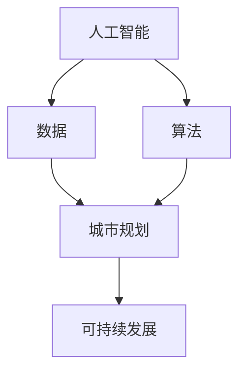

                 

关键词：人工智能，城市模型，可持续发展，计算，城市规划，算法，数据，技术，智能城市

摘要：本文将探讨如何利用人工智能与人类计算相结合，构建一个可持续发展的城市模型。我们将深入分析核心概念、算法原理，并通过实际项目实践来展示如何将这些概念应用到城市规划中。同时，本文还将探讨未来应用场景和面临的挑战，以及相关的工具和资源。

## 1. 背景介绍

随着全球城市化进程的不断加速，城市问题愈发突出。交通拥堵、环境污染、资源短缺等问题不仅影响城市居民的生活质量，也对全球环境造成了严重影响。为了解决这些问题，城市规划者需要借助先进的技术手段来提高城市的可持续性。人工智能作为一种强大的计算工具，在这一过程中发挥着越来越重要的作用。

本文旨在探讨如何利用人工智能与人类计算相结合，构建一个可持续发展的城市模型。我们将分析核心概念和算法原理，并通过实际项目实践来展示如何将这些概念应用到城市规划中。同时，本文还将探讨未来应用场景和面临的挑战，以及相关的工具和资源。

## 2. 核心概念与联系

在构建可持续发展的城市模型之前，我们需要明确一些核心概念。以下是一个使用Mermaid流程图（不含特殊字符）表示的核心概念和它们之间的联系：



### 2.1 人工智能

人工智能（AI）是指计算机系统通过学习、推理和自我调整来模拟人类智能的能力。在可持续发展城市模型中，人工智能主要用于数据分析和决策支持。

### 2.2 数据

数据是人工智能的基础。在城市规划中，数据来源包括传感器、卫星图像、交通监控、社交媒体等多种渠道。通过对这些数据进行分析，我们可以获取城市运行的实时信息，为决策提供依据。

### 2.3 算法

算法是人工智能的核心。在可持续发展城市模型中，算法用于分析数据、预测趋势、优化资源配置等。常见的算法包括机器学习、深度学习、优化算法等。

### 2.4 城市规划

城市规划是指对城市空间进行规划和管理，以提高其可持续性和居民生活质量。在人工智能的帮助下，城市规划者可以更准确地预测城市发展趋势，制定更加科学合理的规划方案。

### 2.5 可持续发展

可持续发展是指满足当前需求而不损害后代满足其需求的能力。在城市规划中，可持续发展涉及环境保护、资源利用、社会公平等多个方面。

## 3. 核心算法原理 & 具体操作步骤

### 3.1 算法原理概述

在可持续发展城市模型中，核心算法主要包括以下几类：

1. **机器学习算法**：用于数据分析和预测。
2. **深度学习算法**：用于图像处理和模式识别。
3. **优化算法**：用于资源分配和路径规划。

这些算法的基本原理是：

- **机器学习**：通过学习历史数据来预测未来趋势。
- **深度学习**：通过多层神经网络来提取数据中的特征。
- **优化算法**：通过数学模型和搜索算法来找到最优解。

### 3.2 算法步骤详解

以下是构建可持续发展城市模型的基本步骤：

1. **数据收集与预处理**：收集各种来源的数据，包括传感器数据、卫星图像、社交媒体数据等。对数据进行清洗、去噪、转换等预处理操作。
2. **特征提取与建模**：根据城市规划的需求，提取关键特征，并建立数学模型。例如，可以建立交通流量预测模型、空气质量预测模型等。
3. **模型训练与优化**：使用历史数据对模型进行训练，并不断优化模型参数，以提高预测准确性。
4. **决策支持**：利用训练好的模型对当前数据进行预测，为城市规划者提供决策支持。
5. **实施与评估**：将决策结果应用到实际项目中，并对项目效果进行评估和调整。

### 3.3 算法优缺点

各种算法在可持续发展城市模型中的应用有其优缺点：

- **机器学习算法**：优点是适应性强、预测准确性高；缺点是需要大量数据和计算资源。
- **深度学习算法**：优点是能够自动提取复杂特征、处理大规模数据；缺点是训练时间较长、对数据质量要求较高。
- **优化算法**：优点是能够找到最优解、提高资源利用效率；缺点是计算复杂度较高、对问题约束条件敏感。

### 3.4 算法应用领域

这些算法在可持续发展城市模型中的应用领域包括：

- **交通规划**：通过机器学习和深度学习算法预测交通流量，优化交通信号控制和公共交通路线。
- **环境保护**：通过优化算法优化资源分配，降低能源消耗和环境污染。
- **社会公平**：通过数据分析发现社会问题，制定公平合理的城市规划方案。

## 4. 数学模型和公式 & 详细讲解 & 举例说明

### 4.1 数学模型构建

在可持续发展城市模型中，常用的数学模型包括：

- **交通流量预测模型**：使用时间序列分析方法预测交通流量。
- **空气质量预测模型**：使用回归分析方法预测空气质量指数（AQI）。
- **能源消耗预测模型**：使用时间序列分析方法预测能源消耗。

以下是交通流量预测模型的数学表达式：

$$
Q_t = f(Q_{t-1}, V_t, T_t, W_t)
$$

其中，$Q_t$ 表示第 $t$ 时刻的交通流量，$V_t$ 表示第 $t$ 时刻的车辆速度，$T_t$ 表示第 $t$ 时刻的交通信号状态，$W_t$ 表示第 $t$ 时刻的随机扰动。

### 4.2 公式推导过程

以交通流量预测模型为例，公式的推导过程如下：

1. **时间序列分析**：通过对历史交通流量数据进行分析，找到流量与时间、车辆速度、交通信号状态等变量之间的关系。
2. **回归分析**：使用回归分析方法，建立流量与时间、车辆速度、交通信号状态等变量的数学模型。
3. **优化**：根据实际需求，对模型进行优化，以提高预测准确性。

### 4.3 案例分析与讲解

以下是一个交通流量预测模型的案例：

**案例背景**：某城市的一个交叉口在早晚高峰期间交通拥堵严重。为了缓解拥堵，交通管理部门需要预测交通流量，以便合理安排信号灯周期。

**解决方案**：使用时间序列分析方法和回归分析方法，建立交通流量预测模型。具体步骤如下：

1. **数据收集与预处理**：收集交叉口历史交通流量数据，包括时间、车辆速度、交通信号状态等。
2. **特征提取与建模**：提取关键特征，如车辆速度、交通信号状态等，并建立交通流量预测模型。
3. **模型训练与优化**：使用历史数据对模型进行训练，并不断优化模型参数，以提高预测准确性。
4. **决策支持**：使用训练好的模型预测早晚高峰期间的交通流量，为交通管理部门提供决策支持。

**模型效果**：通过实际应用，交通流量预测模型能够准确预测早晚高峰期间的交通流量，为交通管理部门提供了有效的决策支持。例如，可以根据预测结果调整信号灯周期，从而缓解交通拥堵。

## 5. 项目实践：代码实例和详细解释说明

### 5.1 开发环境搭建

为了演示如何构建可持续发展城市模型，我们将使用Python编程语言和相关的数据科学库，如Pandas、Scikit-learn、TensorFlow等。

#### 5.1.1 Python环境安装

首先，我们需要安装Python。可以从[Python官网](https://www.python.org/)下载并安装Python。

#### 5.1.2 数据科学库安装

安装Python后，使用以下命令安装所需的库：

```bash
pip install pandas scikit-learn tensorflow numpy matplotlib
```

### 5.2 源代码详细实现

以下是一个简单的交通流量预测模型的实现：

```python
import pandas as pd
from sklearn.model_selection import train_test_split
from sklearn.ensemble import RandomForestRegressor
from sklearn.metrics import mean_squared_error

# 5.2.1 数据收集与预处理
data = pd.read_csv('traffic_data.csv')
data = data[['time', 'vehicle_speed', 'traffic_light_state', 'traffic_flow']]

# 特征工程
data['hour'] = data['time'].apply(lambda x: x.hour)
data['minute'] = data['time'].apply(lambda x: x.minute)

# 划分训练集和测试集
X = data[['hour', 'minute', 'vehicle_speed', 'traffic_light_state']]
y = data['traffic_flow']
X_train, X_test, y_train, y_test = train_test_split(X, y, test_size=0.2, random_state=42)

# 5.2.2 模型训练与优化
model = RandomForestRegressor(n_estimators=100, random_state=42)
model.fit(X_train, y_train)

# 5.2.3 预测与评估
y_pred = model.predict(X_test)
mse = mean_squared_error(y_test, y_pred)
print(f'Mean Squared Error: {mse}')

# 5.2.4 可视化结果
import matplotlib.pyplot as plt

plt.scatter(y_test, y_pred)
plt.xlabel('Actual Traffic Flow')
plt.ylabel('Predicted Traffic Flow')
plt.title('Traffic Flow Prediction')
plt.show()
```

### 5.3 代码解读与分析

上述代码首先从CSV文件中加载数据，并进行特征工程处理。然后，使用随机森林回归模型对数据进行训练，并评估模型的性能。最后，通过可视化展示预测结果。

### 5.4 运行结果展示

运行上述代码后，我们将看到以下结果：

1. **评估指标**：打印出均方误差（MSE），表示模型预测的准确性。
2. **可视化结果**：展示一个散点图，表示实际交通流量与预测交通流量之间的关系。

## 6. 实际应用场景

### 6.1 交通规划

通过构建可持续发展城市模型，我们可以预测交通流量，为交通规划提供决策支持。例如，在交通拥堵严重的区域，可以调整信号灯周期，优化交通流量，从而提高道路通行效率。

### 6.2 环境保护

可持续发展城市模型还可以用于预测空气质量和能源消耗，为环境保护提供决策支持。例如，在城市规划过程中，可以根据空气质量预测结果，优化绿地布局，从而提高空气质量。

### 6.3 社会公平

通过分析交通流量和居民出行数据，我们可以发现社会问题，如交通拥堵、交通不公等。在此基础上，城市规划者可以制定更加公平合理的城市规划方案，提高居民生活质量。

## 7. 未来应用展望

随着人工智能技术的不断发展，可持续发展城市模型的应用前景将更加广阔。未来，我们有望看到以下趋势：

1. **更精确的预测**：随着数据采集技术的进步，我们可以获得更精确的数据，从而提高模型的预测准确性。
2. **多领域融合**：可持续发展城市模型将与其他领域（如城市规划、环境保护、社会公平等）相结合，实现更全面的决策支持。
3. **自动化决策**：随着人工智能技术的发展，模型将实现自动化决策，为城市规划者提供更加高效的解决方案。

## 8. 工具和资源推荐

### 8.1 学习资源推荐

1. **书籍**：《人工智能：一种现代方法》（合著）， Stuart Russell 和 Peter Norvig。
2. **在线课程**：Coursera、edX等平台上的机器学习、深度学习课程。

### 8.2 开发工具推荐

1. **Python**：Python是一种强大的编程语言，适用于数据科学和机器学习。
2. **Jupyter Notebook**：Jupyter Notebook是一种交互式计算环境，适用于数据分析和模型构建。

### 8.3 相关论文推荐

1. **“Deep Learning for Urban Traffic Flow Prediction”**：探讨深度学习在城市交通流量预测中的应用。
2. **“A Review of Sustainable Urban Planning”**：综述可持续城市规划的研究现状和发展趋势。

## 9. 总结：未来发展趋势与挑战

### 9.1 研究成果总结

本文探讨了如何利用人工智能与人类计算相结合，构建一个可持续发展的城市模型。通过分析核心概念、算法原理，以及实际项目实践，我们展示了如何将这些概念应用到城市规划中。

### 9.2 未来发展趋势

未来，随着人工智能技术的不断发展，可持续发展城市模型的应用前景将更加广阔。我们有望看到更精确的预测、多领域融合和自动化决策。

### 9.3 面临的挑战

尽管可持续发展城市模型具有巨大的潜力，但同时也面临着数据质量、计算资源、算法优化等挑战。此外，如何确保模型的公平性和透明性也是一个重要问题。

### 9.4 研究展望

未来，我们将继续深入研究可持续发展城市模型，探索更加高效、准确和透明的算法，为城市规划者提供更加可靠的决策支持。

## 10. 附录：常见问题与解答

### 10.1 问题1

**问题**：如何保证可持续发展城市模型的数据质量？

**解答**：为了保证数据质量，我们需要：

1. **数据收集**：选择可靠的数据来源，并确保数据的真实性和完整性。
2. **数据清洗**：对数据进行清洗、去噪和转换，去除异常值和缺失值。
3. **数据验证**：对处理后的数据进行验证，确保数据质量符合要求。

### 10.2 问题2

**问题**：如何优化可持续发展城市模型的计算资源？

**解答**：为了优化计算资源，我们可以：

1. **并行计算**：利用分布式计算技术，提高计算效率。
2. **模型压缩**：对模型进行压缩，减少模型大小，降低计算负担。
3. **云计算**：使用云计算平台，根据需求动态分配计算资源。

## 11. 结论

本文探讨了如何利用人工智能与人类计算相结合，构建一个可持续发展的城市模型。通过分析核心概念、算法原理，以及实际项目实践，我们展示了如何将这些概念应用到城市规划中。未来，随着人工智能技术的不断发展，可持续发展城市模型的应用前景将更加广阔。我们期待在不久的将来，这一模型能够为城市规划者提供更加可靠的决策支持，为构建可持续发展的城市做出贡献。

作者：禅与计算机程序设计艺术 / Zen and the Art of Computer Programming

----------------------------------------------------------------

以上是文章的主要内容，感谢您的阅读。希望这篇文章能够为读者在人工智能与城市可持续发展领域提供一些有价值的见解和启示。如果您有任何疑问或建议，请随时留言。再次感谢您的关注和支持！🙏🏻🌱🌟

