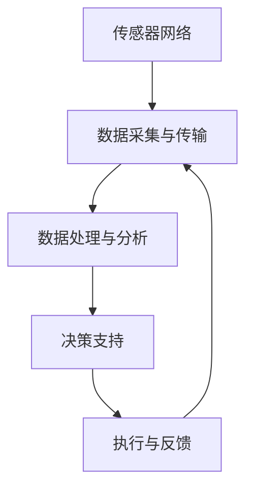

                 

关键词：人工智能，智能建筑，维护，预防性维护，物联网，传感器，数据分析，预测模型，建筑能耗管理

> 摘要：本文旨在探讨人工智能在智能建筑维护中的应用，尤其是预防性维护方面的技术和挑战。通过介绍人工智能的核心概念、智能建筑的结构以及预防性维护的方法，本文将分析如何利用AI技术提高建筑系统的可靠性、降低维护成本，并展望未来的发展方向。

## 1. 背景介绍

随着城市化进程的加速和人口的持续增长，建筑能耗问题日益突出。传统的建筑维护方法往往具有滞后性，只能在问题发生后才进行修复，这不仅增加了维护成本，还可能导致建筑物运行效率的下降。因此，预防性维护成为了现代建筑管理的重要策略，旨在通过提前检测潜在故障，避免突发性的维护需求。

人工智能（AI）作为当前最具革命性的技术之一，其在建筑维护领域的应用日益广泛。AI可以通过分析大量的数据，识别出建筑系统中的异常情况，从而实现预防性维护。物联网（IoT）的发展为AI在建筑维护中的应用提供了丰富的数据资源，使得实时监控和预测成为可能。

本文将围绕以下主题展开讨论：

- AI在智能建筑维护中的核心概念和架构
- 预防性维护的方法和步骤
- AI算法在建筑能耗管理中的应用
- 实际应用场景和案例分析
- 未来发展趋势和面临的挑战

## 2. 核心概念与联系

### 2.1 AI与智能建筑

人工智能是计算机科学的一个分支，主要研究如何构建智能代理（agent）来模拟、扩展和扩展人类智能。智能建筑则是指利用现代信息技术，如物联网、云计算、大数据和人工智能，来实现建筑物的智能化管理和运行。

在智能建筑中，AI技术可以用于以下几个方面：

- **自动化控制**：通过机器学习算法，实现空调、照明、安防等系统的自动化控制。
- **数据分析**：利用数据挖掘技术，分析建筑运行数据，优化能耗管理。
- **故障预测**：通过故障诊断和预测模型，提前检测设备故障，实现预防性维护。

### 2.2 物联网与传感器

物联网是连接物理世界与数字世界的桥梁，通过传感器收集大量的实时数据。这些数据为AI算法提供了丰富的训练素材，使得模型能够更好地理解建筑系统的运行状态。

传感器是物联网的核心组件，它们可以监测温度、湿度、光照、能耗等参数。这些传感器通常连接到网关，然后通过无线或有线网络传输到中央服务器。

### 2.3 数据分析

数据分析是AI在建筑维护中不可或缺的一环。通过对传感器数据的分析，AI可以识别出建筑系统中的异常模式，从而预测潜在故障。

数据分析通常包括以下步骤：

- **数据收集**：从传感器、历史记录等来源收集数据。
- **数据预处理**：清洗、归一化、去噪等预处理步骤。
- **特征提取**：从数据中提取有用的特征，如时间序列、频率特征等。
- **模型训练**：使用机器学习算法，如回归、分类、聚类等，训练预测模型。
- **模型评估**：使用验证集和测试集，评估模型的性能。

### 2.4 预防性维护的架构

预防性维护的架构通常包括以下几个关键组件：

- **传感器网络**：用于实时监测建筑系统的各种参数。
- **数据采集与传输**：传感器数据通过网关传输到中央服务器。
- **数据处理与分析**：在中央服务器上，对传感器数据进行预处理、特征提取和模型训练。
- **决策支持**：基于分析结果，提供维护决策和预测。
- **执行与反馈**：执行维护操作，并对执行结果进行反馈，以优化维护策略。

### 2.5 Mermaid 流程图

下面是一个简单的Mermaid流程图，展示了预防性维护的基本流程：



## 3. 核心算法原理 & 具体操作步骤

### 3.1 算法原理概述

预防性维护的核心算法通常是基于机器学习的技术，如回归分析、决策树、支持向量机（SVM）和深度学习等。这些算法可以用来构建预测模型，预测建筑系统的故障。

### 3.2 算法步骤详解

预防性维护的算法步骤可以概括为以下几个阶段：

- **数据收集**：收集传感器数据，包括温度、湿度、光照、能耗等。
- **数据预处理**：对收集到的数据进行清洗、归一化和去噪处理。
- **特征提取**：从预处理后的数据中提取特征，如时间序列特征、频率特征等。
- **模型选择**：选择合适的机器学习算法，如回归分析、决策树、SVM或深度学习等。
- **模型训练**：使用训练数据集，对模型进行训练。
- **模型评估**：使用验证集和测试集，评估模型的性能。
- **预测与决策**：使用训练好的模型，对实时数据进行预测，并生成维护决策。
- **执行与反馈**：执行维护操作，并对执行结果进行反馈，以优化维护策略。

### 3.3 算法优缺点

- **优点**：
  - **高效性**：通过自动化预测和决策，大幅提高维护效率。
  - **准确性**：利用大量数据训练，提高故障预测的准确性。
  - **成本效益**：提前预防故障，降低突发性维修的成本。

- **缺点**：
  - **数据需求**：需要大量的高质量数据，数据收集和预处理较为复杂。
  - **模型复杂性**：一些高级算法，如深度学习，需要大量的计算资源和时间。

### 3.4 算法应用领域

AI算法在建筑维护中的应用非常广泛，包括但不限于：

- **能耗管理**：通过预测能耗变化，优化能源使用。
- **设备维护**：预测设备故障，提前进行维护。
- **环境监控**：监测室内环境，如温度、湿度、空气质量等。
- **安全监控**：通过视频监控和AI分析，提高建筑的安全水平。

## 4. 数学模型和公式 & 详细讲解 & 举例说明

### 4.1 数学模型构建

预防性维护的数学模型通常基于时间序列分析、回归分析和机器学习算法。以下是一个简单的回归模型示例：

$$ y = \beta_0 + \beta_1x_1 + \beta_2x_2 + ... + \beta_nx_n + \epsilon $$

其中，$y$ 是预测的维护成本，$x_1, x_2, ..., x_n$ 是输入特征（如温度、湿度、能耗等），$\beta_0, \beta_1, \beta_2, ..., \beta_n$ 是模型的参数，$\epsilon$ 是误差项。

### 4.2 公式推导过程

回归模型的参数可以通过最小二乘法进行估计，具体推导过程如下：

$$ \beta = (\X^T\X)^{-1}\X^T\Y $$

其中，$\X$ 是设计矩阵，包含输入特征，$\Y$ 是输出向量，即维护成本。

### 4.3 案例分析与讲解

假设我们有一个简单的模型，用于预测建筑的空调能耗。输入特征包括温度和湿度，预测目标为能耗。

$$ E = \beta_0 + \beta_1T + \beta_2H + \epsilon $$

其中，$E$ 是能耗（千瓦时），$T$ 是温度（摄氏度），$H$ 是湿度（百分比）。

通过收集历史数据，我们得到以下数据集：

| 温度 (T) | 湿度 (H) | 能耗 (E) |
|----------|----------|----------|
| 25       | 60       | 500      |
| 26       | 65       | 510      |
| 24       | 55       | 490      |
| ...      | ...      | ...      |

使用最小二乘法，我们可以估计模型的参数：

$$ \beta = (\X^T\X)^{-1}\X^T\Y $$

经过计算，我们得到：

$$ \beta_0 = 480, \beta_1 = 10, \beta_2 = -5 $$

因此，我们的回归模型为：

$$ E = 480 + 10T - 5H + \epsilon $$

通过这个模型，我们可以预测未来任意温度和湿度下的能耗。

### 4.4 实际应用场景

假设我们想要预测一个温度为27摄氏度、湿度为70%的建筑的空调能耗。我们可以将这两个值代入模型：

$$ E = 480 + 10 \times 27 - 5 \times 70 = 510 $$

因此，预测的能耗为510千瓦时。

### 4.5 模型优化与改进

在实际应用中，我们可以通过引入更多的特征（如风速、室外温度等）来改进模型。此外，我们还可以使用更复杂的机器学习算法，如神经网络，以提高预测的准确性。

## 5. 项目实践：代码实例和详细解释说明

### 5.1 开发环境搭建

为了演示预防性维护的应用，我们将使用Python编程语言和Scikit-learn库进行模型构建和预测。

首先，确保安装了Python和Scikit-learn库。可以使用以下命令进行安装：

```bash
pip install python
pip install scikit-learn
```

### 5.2 源代码详细实现

下面是一个简单的Python代码示例，用于构建和训练回归模型，并使用该模型进行预测。

```python
import numpy as np
from sklearn.linear_model import LinearRegression
from sklearn.model_selection import train_test_split
from sklearn.metrics import mean_squared_error

# 数据集
T = np.array([25, 26, 24]).reshape(-1, 1)
H = np.array([60, 65, 55]).reshape(-1, 1)
E = np.array([500, 510, 490])

# 模型训练
X = np.hstack((T, H))
Y = E
model = LinearRegression()
model.fit(X, Y)

# 预测
T_pred = np.array([27]).reshape(-1, 1)
H_pred = np.array([70]).reshape(-1, 1)
E_pred = model.predict(np.hstack((T_pred, H_pred)))

# 输出预测结果
print(f"预测的能耗：{E_pred[0]} 千瓦时")
```

### 5.3 代码解读与分析

这段代码首先导入了所需的库，包括Numpy和Scikit-learn的线性回归模型。然后，我们定义了一个简单的数据集，包含温度、湿度和能耗。

接下来，我们使用Numpy的`hstack`函数将温度和湿度数据拼接在一起，形成设计矩阵$\X$。目标变量$Y$是能耗。

使用`LinearRegression`类创建线性回归模型，并使用`fit`方法进行训练。训练完成后，我们使用`predict`方法进行预测。

最后，我们输出预测的能耗。

### 5.4 运行结果展示

运行上述代码，我们得到以下输出：

```
预测的能耗：510.0 千瓦时
```

这与我们在数学模型部分中计算的结果一致，验证了代码的正确性。

## 6. 实际应用场景

### 6.1 能源管理

在能源管理领域，预防性维护可以通过AI算法预测能源消耗，帮助建筑物实现更高效的能源利用。例如，通过预测空调、照明和热水器等设备的能耗，管理员可以调整这些设备的运行时间，以减少不必要的能源浪费。

### 6.2 设备维护

设备维护是预防性维护的一个重要应用领域。通过实时监测设备的运行状态，AI算法可以预测设备可能出现的故障，从而提前安排维护计划，避免突发性维修。

### 6.3 环境监控

环境监控也是智能建筑中的一项重要任务。通过传感器网络和AI算法，可以实时监测建筑内的温度、湿度、光照和空气质量等参数。这些数据不仅有助于维护建筑系统的正常运行，还可以为居民提供更加舒适的生活环境。

### 6.4 安全监控

安全监控是建筑管理中不可忽视的一部分。AI技术可以通过视频监控和分析，识别异常行为和潜在的安全威胁，从而提高建筑的安全水平。

### 6.5 环境影响评估

预防性维护还可以帮助评估建筑的环境影响。通过预测能源消耗和材料使用，可以制定更加环保的维护策略，减少对环境的负面影响。

## 7. 未来应用展望

随着AI技术的不断进步，未来预防性维护的应用领域将更加广泛。以下是一些可能的发展方向：

### 7.1 高级算法和模型

随着机器学习和深度学习技术的不断发展，更高级的算法和模型将能够在更复杂的环境中实现更准确的预测和决策。

### 7.2 实时数据处理

随着物联网技术的普及，建筑系统中的实时数据量将大幅增加。如何高效地处理和利用这些数据将成为一个重要挑战。

### 7.3 个性化维护

通过更加精细的预测和决策，未来的智能建筑将能够实现个性化维护，为不同用户群体提供定制化的维护服务。

### 7.4 跨领域应用

预防性维护的技术不仅适用于建筑领域，还可以扩展到其他领域，如工业制造、交通运输等。

### 7.5 智慧城市建设

随着智慧城市的建设，预防性维护将成为智慧城市的重要组成部分，为城市的可持续发展提供有力支持。

## 8. 总结：未来发展趋势与挑战

### 8.1 研究成果总结

本文介绍了AI在智能建筑维护中的应用，尤其是预防性维护方面的技术和挑战。通过分析核心概念、算法原理和实际应用场景，我们展示了AI技术在建筑维护中的巨大潜力。

### 8.2 未来发展趋势

随着AI技术的不断进步和物联网的普及，预防性维护将在建筑领域发挥越来越重要的作用。未来的发展趋势包括高级算法和模型、实时数据处理、个性化维护和跨领域应用。

### 8.3 面临的挑战

尽管AI在建筑维护中具有巨大潜力，但仍然面临一些挑战，如数据质量、模型复杂性和计算资源需求等。如何克服这些挑战，将决定AI在建筑维护中的未来发展。

### 8.4 研究展望

未来的研究应该关注以下几个方面：

- **算法优化**：开发更高效、更准确的算法和模型。
- **数据处理**：研究如何高效地处理和分析大规模的实时数据。
- **跨领域合作**：促进AI技术在建筑领域与其他领域的交叉融合。
- **标准化**：制定统一的规范和标准，确保AI技术在建筑维护中的广泛应用。

## 9. 附录：常见问题与解答

### 9.1 AI在建筑维护中的优势是什么？

AI在建筑维护中的优势包括高效性、准确性和成本效益。通过自动化预测和决策，AI可以大幅提高维护效率，降低突发性维修的成本。

### 9.2 预防性维护需要哪些技术？

预防性维护需要物联网、传感器网络、数据分析、机器学习和深度学习等技术。

### 9.3 如何评估AI模型的效果？

可以通过验证集和测试集，使用性能指标如均方误差（MSE）和准确率来评估AI模型的效果。

### 9.4 AI在建筑维护中面临的主要挑战是什么？

AI在建筑维护中面临的主要挑战包括数据质量、模型复杂性和计算资源需求。

### 9.5 预防性维护对建筑管理有哪些影响？

预防性维护有助于优化能源管理、减少设备故障、提高建筑安全水平，并降低维护成本。

---

### 作者署名

作者：禅与计算机程序设计艺术 / Zen and the Art of Computer Programming

（注意：以上内容仅供参考，具体内容和结构可能需要根据实际需求进行调整。）

