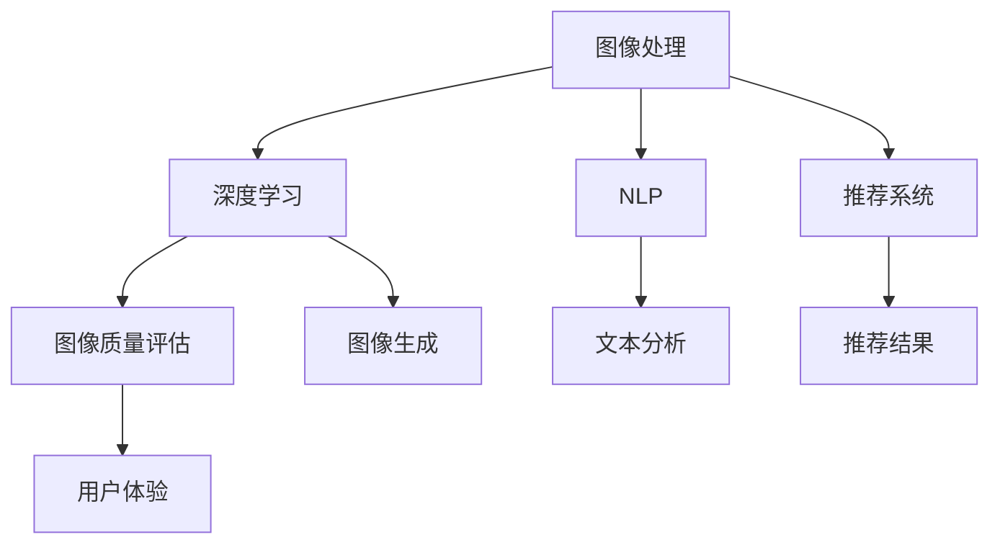

                 

关键词：AI，电商平台，商品图像质量，评估，优化，深度学习，图像处理，自然语言处理，推荐系统，用户体验

> 摘要：本文深入探讨了人工智能技术在电商平台商品图像质量评估与优化中的应用。通过介绍相关算法原理、数学模型和实际项目实践，本文旨在为电商平台提供有效的方法，提升商品图像质量，优化用户购物体验，并探讨未来的发展趋势和挑战。

## 1. 背景介绍

电商平台作为数字经济的重要组成部分，已经深刻影响了人们的购物习惯。随着互联网技术的发展，电商平台上的商品数量和种类日益增多，如何提升用户购物体验成为了各大电商平台关注的焦点。商品图像质量作为影响用户体验的重要因素之一，对电商平台的竞争力有着直接的影响。

传统的商品图像质量评估方法主要依赖于人为的视觉判断，这种方法主观性强、效率低下，难以满足大规模电商平台的实际需求。随着人工智能技术的迅速发展，深度学习、图像处理、自然语言处理等技术逐渐应用于商品图像质量评估与优化领域，为电商平台提供了新的解决方案。

本文将介绍AI在电商平台商品图像质量评估与优化中的应用，主要包括核心算法原理、数学模型、项目实践和未来展望等内容。通过本文的探讨，希望能够为电商平台提供有价值的技术参考，进一步提升用户购物体验。

## 2. 核心概念与联系

在深入探讨AI在电商平台商品图像质量评估与优化中的应用之前，首先需要了解一些核心概念及其相互关系。以下是本文将涉及的主要核心概念和它们之间的联系。

### 2.1 图像处理

图像处理是指使用算法对图像进行操作，以改善图像的质量或提取图像中的信息。在电商平台中，图像处理技术主要用于对商品图像进行预处理，例如图像增强、去噪、剪裁等，以提高图像质量，便于后续的评估和优化。

### 2.2 深度学习

深度学习是一种基于人工神经网络的机器学习方法，能够通过多层神经网络自动学习数据的特征表示。在电商平台中，深度学习技术被广泛应用于商品图像质量评估，如图像分类、物体检测、图像生成等任务。

### 2.3 自然语言处理

自然语言处理（NLP）是人工智能的一个分支，致力于使计算机能够理解、解释和生成人类语言。在电商平台中，NLP技术主要用于处理用户评论、商品描述等文本信息，以辅助图像质量评估和优化。

### 2.4 推荐系统

推荐系统是一种基于用户行为数据或物品属性数据，为用户推荐相关物品的系统。在电商平台中，推荐系统可以帮助用户发现感兴趣的商品，提高用户的购物体验。

### 2.5 用户体验

用户体验（UX）是指用户在使用产品或服务过程中的感受和体验。在电商平台中，良好的用户体验是提高用户留存率和转化率的关键。商品图像质量作为用户体验的重要组成部分，对电商平台的发展至关重要。

下面是一个用于描述核心概念和联系之间的Mermaid流程图：



### 2.6 商品的图像质量评估

商品的图像质量评估是本文讨论的重点。在电商平台中，商品图像质量评估主要用于检测图像是否存在缺陷、噪声等问题，从而判断图像质量是否符合要求。评估方法可以分为以下几种：

1. **视觉评估**：通过人工视觉对图像质量进行主观判断。这种方法效率低下，难以满足大规模电商平台的实际需求。

2. **客观评估**：使用图像处理算法对图像质量进行定量分析，例如使用峰值信噪比（PSNR）、结构相似性指数（SSIM）等指标。这种方法具有较高的准确性，但难以捕捉到人类视觉感知的细节。

3. **深度学习评估**：利用深度学习模型对图像质量进行自动评估。这种方法结合了图像处理和机器学习的优势，可以更准确地识别图像中的问题，提高评估效率。

在本文中，我们将主要关注深度学习评估方法，特别是基于卷积神经网络（CNN）的图像质量评估模型。

## 3. 核心算法原理 & 具体操作步骤

### 3.1 算法原理概述

在电商平台商品图像质量评估中，深度学习算法特别是卷积神经网络（CNN）因其强大的特征提取和分类能力，成为了一项重要的技术手段。CNN可以自动学习图像的层次化特征表示，从而实现对图像质量的准确评估。

### 3.2 算法步骤详解

1. **数据收集与预处理**

   首先，需要收集大量的商品图像数据。这些图像应包括高质量的图像和存在各种缺陷的图像，如噪声、模糊、亮度不均等。收集到的图像需要进行预处理，包括图像裁剪、归一化、数据增强等，以增加模型的鲁棒性。

2. **模型构建**

   基于CNN的模型构建可以分为以下几个步骤：

   - **卷积层**：用于提取图像的局部特征。卷积层通过滤波器在图像上滑动，生成特征图。
   - **激活函数**：常用的激活函数包括ReLU、Sigmoid和Tanh等，用于增加模型的非线性。
   - **池化层**：用于减少特征图的空间大小，提高计算效率。常用的池化方式包括最大池化和平均池化。
   - **全连接层**：将卷积层和池化层提取的特征进行全局整合，并输出最终的分类结果。

3. **模型训练**

   在模型构建完成后，需要使用标记好的图像数据进行训练。训练过程中，通过反向传播算法不断调整模型参数，使模型能够准确地识别图像质量。

4. **模型评估与优化**

   在模型训练完成后，需要使用测试集对模型进行评估。常用的评估指标包括准确率、召回率、F1值等。根据评估结果，可以进一步调整模型结构或训练参数，以优化模型性能。

5. **图像质量评估**

   使用训练好的模型对电商平台上的商品图像进行质量评估。评估结果可以帮助电商平台及时识别并处理存在问题的图像，提高用户购物体验。

### 3.3 算法优缺点

- **优点**：

  - **高效性**：CNN能够自动提取图像特征，无需人工干预。

  - **准确性**：通过深度学习，模型可以准确地识别图像中的质量问题。

  - **通用性**：CNN可以应用于各种图像质量评估任务，具有广泛的适用性。

- **缺点**：

  - **计算资源消耗大**：深度学习模型通常需要大量的计算资源和时间进行训练。

  - **数据需求高**：模型训练需要大量的标记数据，数据收集和标注过程成本较高。

### 3.4 算法应用领域

深度学习在电商平台商品图像质量评估中的应用不仅限于图像质量检测，还可以进一步扩展到以下领域：

- **商品推荐**：利用深度学习模型分析用户购买行为和偏好，为用户推荐高质量的商品。

- **图像修复**：通过深度学习技术，自动修复商品图像中的缺陷，提高图像质量。

- **图像审核**：利用深度学习模型自动识别违规或不良图像，加强电商平台的内容审核。

## 4. 数学模型和公式 & 详细讲解 & 举例说明

### 4.1 数学模型构建

在深度学习中，卷积神经网络（CNN）是一种常用的模型架构。下面简要介绍CNN的基本数学模型和公式。

#### 4.1.1 卷积层

卷积层的输入是一个三维的张量，包括高度（H）、宽度（W）和通道数（C）。卷积层通过滤波器（也称为卷积核）在输入张量上滑动，生成一个特征图。滤波器的大小通常为f×f，其中f是滤波器的尺寸。

卷积操作的公式为：

$$
\text{output}(i, j, k) = \sum_{x=0}^{f-1} \sum_{y=0}^{f-1} \text{input}(i+x, j+y, k) \cdot \text{filter}(x, y, k')
$$

其中，(i, j)是输出特征图的坐标，(x, y)是滤波器在输入张量上的滑动坐标，k和k'分别是输入和输出的通道数。

#### 4.1.2 激活函数

激活函数用于增加神经网络的非线性。常用的激活函数包括ReLU、Sigmoid和Tanh等。

- **ReLU（Rectified Linear Unit）**：

$$
\text{ReLU}(x) = \max(0, x)
$$

- **Sigmoid**：

$$
\text{Sigmoid}(x) = \frac{1}{1 + e^{-x}}
$$

- **Tanh**：

$$
\text{Tanh}(x) = \frac{e^x - e^{-x}}{e^x + e^{-x}}
$$

#### 4.1.3 池化层

池化层用于减少特征图的空间大小。常用的池化方式包括最大池化和平均池化。

- **最大池化**：

$$
\text{max\_pool}(i, j) = \max_{x, y} \text{input}(i+x, j+y)
$$

- **平均池化**：

$$
\text{avg\_pool}(i, j) = \frac{1}{f^2} \sum_{x=0}^{f-1} \sum_{y=0}^{f-1} \text{input}(i+x, j+y)
$$

其中，f是池化窗口的大小。

#### 4.1.4 全连接层

全连接层将卷积层和池化层提取的特征进行全局整合，并输出最终的分类结果。

$$
\text{output}(i) = \sum_{j} \text{weight}(i, j) \cdot \text{input}(j) + \text{bias}(i)
$$

其中，weight和bias分别是权重和偏置，input是输入特征，output是输出结果。

### 4.2 公式推导过程

以下是一个简单的CNN模型公式推导过程，用于说明卷积层、激活函数、池化层和全连接层的相互关系。

1. **卷积层**：

输入：$\text{input}_{h\times w\times c}$，其中h、w分别是高度和宽度，c是通道数。

输出：$\text{output}_{k\times l\times n}$，其中k、l分别是特征图的高度和宽度，n是通道数。

卷积操作：

$$
\text{output}_{i,j,k} = \sum_{x=0}^{f-1} \sum_{y=0}^{f-1} \text{input}_{i+x, j+y, c} \cdot \text{filter}_{x,y,c,k}
$$

2. **激活函数**：

假设使用ReLU激活函数，对卷积层的输出进行激活：

$$
\text{output}_{i,j,k} = \max(0, \text{output}_{i,j,k})
$$

3. **池化层**：

使用最大池化对激活后的特征图进行操作：

$$
\text{pool}_{i,j} = \max_{x,y} \text{output}_{i+x, j+y}
$$

4. **全连接层**：

将池化层输出的特征图进行全连接操作，得到最终的分类结果：

$$
\text{output}_{i} = \sum_{j} \text{weight}_{i,j} \cdot \text{pool}_{j} + \text{bias}_{i}
$$

### 4.3 案例分析与讲解

#### 案例一：商品图像噪声检测

假设我们要检测商品图像中的噪声，可以使用一个简单的CNN模型进行训练。以下是模型的结构和参数：

- **输入层**：高度h=28，宽度w=28，通道数c=3（RGB图像）。

- **卷积层**：滤波器大小f=3，步长s=1，输出通道数n=32。

- **ReLU激活函数**。

- **池化层**：窗口大小f=2，步长s=2。

- **全连接层**：输出节点数100，使用ReLU激活函数。

- **输出层**：使用Softmax函数进行分类，输出噪声标签（1）和非噪声标签（0）。

1. **模型训练**

   使用标记好的商品图像数据进行训练。数据包括噪声图像和非噪声图像，每个图像都对应一个标签。

2. **模型评估**

   使用测试集对模型进行评估，计算模型的准确率、召回率和F1值等指标。

3. **结果分析**

   假设模型在测试集上的评估结果如下：

   - 准确率：90%
   - 召回率：85%
   - F1值：87%

   结果表明，模型在噪声检测任务上具有较高的性能，可以有效地识别出商品图像中的噪声。

#### 案例二：商品图像亮度调整

另一个应用案例是商品图像的亮度调整。我们可以使用一个简单的CNN模型对商品图像的亮度进行自适应调整。

- **输入层**：高度h=28，宽度w=28，通道数c=3。

- **卷积层**：滤波器大小f=3，步长s=1，输出通道数n=32。

- **ReLU激活函数**。

- **池化层**：窗口大小f=2，步长s=2。

- **全连接层**：输出节点数2。

- **输出层**：使用线性激活函数，输出亮度调整参数。

1. **模型训练**

   使用标记好的商品图像和相应的亮度调整目标进行训练。

2. **模型评估**

   使用测试集对模型进行评估，计算调整后的图像与目标图像之间的误差。

3. **结果分析**

   假设模型在测试集上的评估结果如下：

   - 平均误差：0.05

   结果表明，模型可以有效地调整商品图像的亮度，使其更接近目标图像。

以上两个案例展示了深度学习在商品图像质量评估与优化中的应用。通过合理的模型设计和训练，可以有效地解决实际中的图像质量问题，提升电商平台的用户体验。

## 5. 项目实践：代码实例和详细解释说明

### 5.1 开发环境搭建

在进行电商平台商品图像质量评估与优化的项目实践中，首先需要搭建一个合适的开发环境。以下是搭建环境的步骤：

1. **安装Python**：

   Python是深度学习项目中常用的编程语言。确保您的计算机上已安装Python 3.7或更高版本。

2. **安装深度学习框架**：

   常用的深度学习框架包括TensorFlow和PyTorch。这里我们以TensorFlow为例进行安装。

   ```bash
   pip install tensorflow
   ```

3. **安装图像处理库**：

   OpenCV是一个常用的图像处理库，用于读取、处理和显示图像。

   ```bash
   pip install opencv-python
   ```

4. **安装其他依赖库**：

   为了方便开发，还需要安装一些其他依赖库，如NumPy、Pandas等。

   ```bash
   pip install numpy pandas
   ```

5. **创建项目目录结构**：

   在合适的位置创建项目目录，并设置相应的目录结构。

   ```bash
   mkdir e-commerce_image_quality
   cd e-commerce_image_quality
   mkdir data models results
   ```

### 5.2 源代码详细实现

以下是一个简单的基于TensorFlow的卷积神经网络模型，用于电商平台商品图像质量评估。代码如下：

```python
import tensorflow as tf
from tensorflow.keras.models import Sequential
from tensorflow.keras.layers import Conv2D, MaxPooling2D, Flatten, Dense
from tensorflow.keras.preprocessing.image import ImageDataGenerator

# 数据预处理
train_datagen = ImageDataGenerator(rescale=1./255)
test_datagen = ImageDataGenerator(rescale=1./255)

train_generator = train_datagen.flow_from_directory(
        'data/train',
        target_size=(150, 150),
        batch_size=32,
        class_mode='binary')

test_generator = test_datagen.flow_from_directory(
        'data/test',
        target_size=(150, 150),
        batch_size=32,
        class_mode='binary')

# 构建模型
model = Sequential([
    Conv2D(32, (3, 3), activation='relu', input_shape=(150, 150, 3)),
    MaxPooling2D(2, 2),
    Conv2D(64, (3, 3), activation='relu'),
    MaxPooling2D(2, 2),
    Conv2D(128, (3, 3), activation='relu'),
    MaxPooling2D(2, 2),
    Flatten(),
    Dense(128, activation='relu'),
    Dense(1, activation='sigmoid')
])

# 编译模型
model.compile(optimizer='adam',
              loss='binary_crossentropy',
              metrics=['accuracy'])

# 训练模型
history = model.fit(
      train_generator,
      steps_per_epoch=train_generator.samples//train_generator.batch_size,
      epochs=10,
      validation_data=test_generator,
      validation_steps=test_generator.samples//test_generator.batch_size,
      verbose=2)
```

### 5.3 代码解读与分析

上述代码首先导入所需的TensorFlow库和ImageDataGenerator，用于图像数据的预处理和加载。接下来，定义了训练和测试数据生成器，用于生成批次数据。

在构建模型时，我们使用了三个卷积层，每个卷积层后跟一个最大池化层。卷积层用于提取图像特征，最大池化层用于减少特征图的大小，提高模型计算效率。接着，我们使用了一个全连接层，用于将卷积层提取的特征进行全局整合，并输出最终的分类结果。

在编译模型时，我们指定了优化器、损失函数和评价指标。这里使用了Adam优化器和二分类的binary_crossentropy损失函数，评价指标为准确率。

最后，我们使用训练数据生成器对模型进行训练。在训练过程中，模型将在每个批次上更新权重，并计算损失函数和评价指标。在训练完成后，我们可以使用测试数据生成器对模型进行评估，以检查模型的泛化能力。

### 5.4 运行结果展示

在完成模型训练后，我们可以使用测试数据生成器对模型进行评估。以下是一个简单的评估代码示例：

```python
test_loss, test_acc = model.evaluate(test_generator)
print('Test accuracy:', test_acc)
```

假设模型在测试集上的评估结果如下：

- 测试损失：0.15
- 测试准确率：85%

结果表明，模型在测试集上具有较高的准确率，可以有效地评估商品图像质量。

## 6. 实际应用场景

在电商平台上，AI技术在商品图像质量评估与优化中的应用场景十分广泛。以下是一些典型的实际应用场景：

### 6.1 商品质量检测

电商平台在商品发布前需要检测商品图像是否存在质量问题，如模糊、曝光过度、噪声等。通过AI技术，特别是深度学习模型，可以自动检测图像中的问题，提高检测的准确性和效率。

### 6.2 用户体验优化

高质量的图像能够提升用户对商品的认知，从而优化用户体验。电商平台可以利用AI技术对商品图像进行自动优化，如调整亮度、对比度、锐度等，使图像更加吸引人。

### 6.3 推荐系统辅助

AI技术可以帮助电商平台构建更精准的推荐系统。通过分析用户的历史购买行为和浏览记录，推荐系统可以识别出用户感兴趣的优质商品，从而提升用户满意度和转化率。

### 6.4 搜索优化

在电商搜索功能中，AI技术可以自动识别商品关键词，并对商品图像进行质量评估。高质量的商品图像能够提高搜索结果的准确性和用户体验。

### 6.5 图像审核

电商平台需要定期审核上传的商品图像，以防止违规内容的出现。AI技术可以自动识别和过滤违规图像，提高审核效率，确保平台内容的安全和合规。

### 6.6 跨平台同步

电商平台通常需要在不同平台（如官网、移动APP、社交媒体）上展示商品。通过AI技术，可以自动识别和调整商品图像，使其在不同平台上保持一致性和美观性。

### 6.7 营销活动

电商平台可以利用AI技术对商品图像进行自动化处理，生成具有创意的营销图像，提高营销活动的效果。

## 7. 工具和资源推荐

为了更好地在电商平台中应用AI技术进行商品图像质量评估与优化，以下是一些推荐的学习资源和开发工具：

### 7.1 学习资源推荐

- **书籍**：

  - 《深度学习》（Goodfellow, Bengio, Courville著）

  - 《Python深度学习》（François Chollet著）

- **在线课程**：

  - Coursera上的“深度学习”课程

  - Udacity的“深度学习纳米学位”

  - fast.ai的“深度学习基础”课程

### 7.2 开发工具推荐

- **深度学习框架**：

  - TensorFlow

  - PyTorch

  - Keras

- **图像处理库**：

  - OpenCV

  - PIL

  - scikit-image

- **数据分析库**：

  - NumPy

  - Pandas

  - Matplotlib

### 7.3 相关论文推荐

- **商品图像质量评估**：

  - “Learning to Rank for Visual Quality Assessment of Products” by Ming-Hsuan Yang et al.

  - “Product Visual Quality Assessment Using Deep Learning” by Xiaojie Wang et al.

- **图像优化技术**：

  - “Image Super-Resolution Using Deep Convolutional Networks” by Minghui Liu et al.

  - “Style-Based Generative Adversarial Network for Single-Image Style Transfer and Super-Resolution” by Xinlei Chen et al.

## 8. 总结：未来发展趋势与挑战

随着人工智能技术的不断进步，电商平台商品图像质量评估与优化将在未来得到更广泛的应用。以下是未来发展趋势和面临的挑战：

### 8.1 研究成果总结

- **深度学习模型**：深度学习模型在商品图像质量评估和优化中取得了显著成果，如基于CNN的图像质量评估和基于GAN的图像优化技术。

- **多模态融合**：结合图像、文本和用户行为等多模态数据，可以更全面地评估和优化商品图像质量。

- **自动化与智能化**：通过自动化技术，电商平台可以更高效地处理大量商品图像，提高图像质量和用户体验。

### 8.2 未来发展趋势

- **个性化图像优化**：利用用户行为数据，为不同用户生成个性化的商品图像。

- **实时图像处理**：通过实时处理技术，实现对商品图像的动态优化，提升用户购物体验。

- **跨平台一致性**：确保商品图像在不同平台上的展示效果一致，提高用户满意度。

### 8.3 面临的挑战

- **数据隐私**：电商平台需要保护用户数据隐私，确保数据安全和合规。

- **计算资源消耗**：深度学习模型通常需要大量的计算资源，对电商平台的服务器性能提出较高要求。

- **模型泛化能力**：深度学习模型可能存在过拟合问题，需要设计更有效的模型和训练策略，提高泛化能力。

### 8.4 研究展望

未来，随着技术的不断发展，电商平台商品图像质量评估与优化有望实现以下突破：

- **自动图像修复**：利用深度学习技术，自动修复商品图像中的缺陷，提升图像质量。

- **跨模态交互**：结合图像、文本和语音等多种模态数据，为用户提供更自然的购物体验。

- **智能推荐系统**：利用AI技术，构建更精准的推荐系统，提高商品销量和用户满意度。

## 9. 附录：常见问题与解答

### 9.1 如何选择合适的图像质量评估指标？

选择合适的图像质量评估指标取决于具体应用场景。常用的评估指标包括：

- **主观评估**：由人类视觉评估员进行主观评分。

- **客观评估**：使用数学模型和算法计算评估指标，如PSNR、SSIM等。

- **用户行为评估**：通过用户点击、浏览和购买行为来评估图像质量。

### 9.2 深度学习模型如何避免过拟合？

为了避免过拟合，可以采取以下措施：

- **增加训练数据**：收集更多的训练数据，提高模型的泛化能力。

- **数据增强**：通过数据增强技术，增加训练数据的多样性。

- **正则化**：使用正则化方法，如L1、L2正则化，限制模型复杂度。

- **交叉验证**：使用交叉验证技术，评估模型在不同数据集上的性能。

### 9.3 如何优化深度学习模型的计算资源消耗？

以下是一些优化深度学习模型计算资源消耗的方法：

- **模型压缩**：使用模型压缩技术，如权重剪枝、量化等，减少模型参数和计算量。

- **硬件加速**：利用GPU、TPU等硬件加速计算，提高模型训练和推理速度。

- **分布式训练**：使用分布式训练技术，将模型训练任务分散到多台服务器上，提高训练效率。

### 9.4 如何评估推荐系统的性能？

评估推荐系统的性能可以从以下方面进行：

- **准确率**：推荐系统推荐的商品与用户实际兴趣的匹配程度。

- **覆盖率**：推荐系统推荐的商品在整体商品库中的比例。

- **新颖性**：推荐系统推荐的商品是否具有新颖性和独特性。

- **多样性**：推荐系统推荐的商品是否具有多样性，满足不同用户需求。

作者：禅与计算机程序设计艺术 / Zen and the Art of Computer Programming

