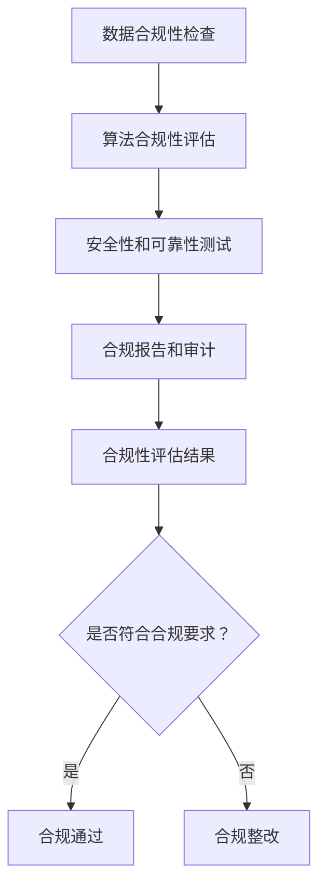

                 

关键词：AI基础设施、合规审计、风控体系、Lepton AI、合规性、风险控制、AI安全

> 摘要：本文将深入探讨AI基础设施的合规审计问题，以Lepton AI的风控体系为例，分析其合规审计的必要性、关键环节、方法与步骤，以及面临的挑战和未来发展方向。通过本文的阅读，读者将全面了解如何在AI时代确保基础设施的安全性和合规性。

## 1. 背景介绍

随着人工智能（AI）技术的快速发展，AI基础设施成为了企业、政府和个人不可或缺的重要部分。从数据存储、处理到模型训练和部署，AI基础设施的各个环节都离不开高度复杂的技术支持和严格的合规要求。然而，AI技术的创新速度远远超过了合规监管的步伐，这导致了在AI基础设施建设和运营过程中存在诸多合规风险。

在AI领域，合规审计是确保AI系统遵循相关法律法规和行业标准的重要手段。它不仅涉及到数据隐私、数据保护、伦理道德等问题，还关系到企业的法律责任和声誉。因此，进行有效的合规审计对于维护AI基础设施的稳定性和可靠性至关重要。

Lepton AI是一家领先的人工智能公司，其风控体系在全球范围内都受到广泛关注。本文将以此为例，详细分析其合规审计的过程、方法和挑战。

## 2. 核心概念与联系

### 2.1 合规审计的定义与作用

合规审计是指对组织的活动进行系统性的评估，以确保其符合适用的法律、法规、规章和行业标准。在AI基础设施的背景下，合规审计主要包括以下几个方面的内容：

1. **数据隐私与保护**：确保AI系统处理的数据符合数据隐私法规的要求，如GDPR（通用数据保护条例）和CCPA（加利福尼亚消费者隐私法案）。
2. **算法透明度和解释性**：评估AI系统的算法设计和决策过程，确保其透明度和可解释性，便于监管和用户理解。
3. **伦理道德**：审查AI系统的设计、开发和部署过程，确保其符合伦理道德标准，不产生歧视、偏见等不良影响。
4. **安全性和可靠性**：评估AI系统的安全性和可靠性，确保其在面对恶意攻击和数据泄露时有足够的防护能力。

### 2.2 Lepton AI的风控体系

Lepton AI的风控体系是其确保基础设施合规的核心机制。该体系涵盖了以下几个关键环节：

1. **数据合规性检查**：对进入AI系统的数据进行合规性检查，确保符合相关数据隐私和保护法规。
2. **算法合规性评估**：对AI算法进行透明度和解释性评估，确保其设计符合伦理道德标准。
3. **安全性和可靠性测试**：对AI系统进行定期的安全性和可靠性测试，确保其在复杂环境中稳定运行。
4. **合规报告和审计**：定期生成合规报告，并进行内部和外部审计，确保风控体系的持续有效性。

### 2.3 Mermaid 流程图

以下是一个简化的Mermaid流程图，展示了Lepton AI风控体系的核心环节和流程。



## 3. 核心算法原理 & 具体操作步骤

### 3.1 算法原理概述

Lepton AI的风控体系采用了一系列先进的技术和方法，确保AI基础设施的合规性。以下是其中几个核心算法原理的概述：

1. **数据加密与哈希算法**：用于保护数据隐私，确保数据在传输和存储过程中不会被未授权访问。
2. **差分隐私技术**：用于增强数据的隐私保护，通过添加随机噪声来隐藏个体数据信息。
3. **机器学习模型的可解释性算法**：如LIME（局部可解释模型解释）和SHAP（特征重要性分析），用于提高AI模型的透明度和解释性。
4. **安全多方计算（MPC）**：确保在多方参与的数据分析和计算过程中，各方的数据隐私不被泄露。

### 3.2 算法步骤详解

#### 3.2.1 数据合规性检查

1. **数据收集**：从不同来源收集数据，包括用户输入、第三方数据等。
2. **数据清洗**：对收集到的数据进行清洗，包括去除重复数据、处理缺失值、归一化等。
3. **数据加密**：使用加密算法对敏感数据进行加密，确保数据在传输和存储过程中的安全性。
4. **数据哈希**：使用哈希算法对数据进行哈希处理，生成唯一的哈希值，用于数据标识和验证。

#### 3.2.2 算法合规性评估

1. **算法选择**：根据业务需求和合规要求，选择合适的算法模型。
2. **模型训练**：使用训练数据进行模型训练，并记录训练过程的关键参数。
3. **模型评估**：对训练好的模型进行评估，包括准确性、召回率、F1分数等指标。
4. **模型解释性分析**：使用可解释性算法分析模型的决策过程，确保其透明度和解释性。

#### 3.2.3 安全性和可靠性测试

1. **渗透测试**：模拟黑客攻击，评估系统的安全性和防护能力。
2. **漏洞扫描**：使用自动化工具对系统进行漏洞扫描，发现潜在的安全风险。
3. **性能测试**：评估系统在负载下的响应速度和处理能力，确保其稳定性和可靠性。
4. **灾难恢复测试**：模拟系统故障，评估其灾难恢复能力和业务连续性。

### 3.3 算法优缺点

#### 优点

1. **高安全性**：采用多种加密和隐私保护技术，确保数据安全和隐私。
2. **高解释性**：使用可解释性算法提高模型的透明度和可理解性。
3. **高可靠性**：通过定期测试和审计，确保系统的稳定性和可靠性。

#### 缺点

1. **高性能开销**：加密和隐私保护技术可能对系统性能有一定影响。
2. **合规成本**：合规审计和测试需要投入大量人力和物力资源。

### 3.4 算法应用领域

Lepton AI的风控体系在多个领域都有广泛应用，包括金融、医疗、零售等。以下是几个具体的应用场景：

1. **金融风控**：用于检测和预防金融欺诈、洗钱等违法行为。
2. **医疗诊断**：用于辅助医生进行疾病诊断，提高诊断准确性和效率。
3. **零售推荐**：用于个性化推荐，提高用户购物体验和商家销售额。

## 4. 数学模型和公式 & 详细讲解 & 举例说明

### 4.1 数学模型构建

在Lepton AI的风控体系中，数学模型起到了关键作用。以下是一个简化的数学模型构建过程：

#### 4.1.1 数据加密与哈希

**加密算法**：AES（高级加密标准）

$$
C = E_K(P)
$$

其中，$C$是加密后的数据，$P$是原始数据，$K$是加密密钥。

**哈希算法**：SHA-256

$$
H = Hash(P)
$$

其中，$H$是哈希值，$P$是原始数据。

#### 4.1.2 差分隐私

**机制**：$$
Lap(f(x) + \epsilon) = \frac{1}{\alpha} \sum_{i=1}^{\alpha} Lap(f(x_i))
$$

其中，$Lap$表示拉普拉斯分布，$\epsilon$是添加的随机噪声，$f(x)$是敏感函数，$\alpha$是拉普拉斯机制参数。

### 4.2 公式推导过程

#### 4.2.1 数据加密与哈希

**加密算法**：AES

加密过程可以分为以下几个步骤：

1. **密钥扩展**：将原始密钥扩展为128位、192位或256位。
2. **初始化向量（IV）生成**：随机生成一个128位的初始化向量。
3. **分块处理**：将数据分为128位的块进行处理。
4. **加密过程**：使用AES算法对每个块进行加密，生成密文。

**哈希算法**：SHA-256

哈希过程可以分为以下几个步骤：

1. **消息预处理**：将消息填充至512位的倍数。
2. **消息分组**：将处理后的消息分成512位的块。
3. **哈希计算**：对每个分组进行哈希计算，生成256位的哈希值。

#### 4.2.2 差分隐私

**拉普拉斯机制**：用于添加随机噪声

拉普拉斯机制可以通过以下公式进行推导：

$$
Lap(f(x) + \epsilon) = \frac{1}{\alpha} \sum_{i=1}^{\alpha} Lap(f(x_i))
$$

其中，$Lap(f(x) + \epsilon)$表示在函数$f(x)$上添加随机噪声$\epsilon$后的拉普拉斯分布，$\alpha$是拉普拉斯机制参数，$f(x_i)$表示敏感函数的输入。

### 4.3 案例分析与讲解

#### 4.3.1 数据加密与哈希

**案例**：对一条敏感信息进行加密和哈希处理。

1. **加密算法**：AES-256
2. **哈希算法**：SHA-256

**步骤**：

1. **数据加密**：
    - 生成256位的加密密钥。
    - 生成128位的初始化向量（IV）。
    - 将敏感信息分为128位的块进行处理。
    - 使用AES算法对每个块进行加密，生成密文。

2. **数据哈希**：
    - 将敏感信息进行填充，使其长度为512位的倍数。
    - 将处理后的消息分成512位的块。
    - 对每个块进行SHA-256哈希计算，生成256位的哈希值。

**结果**：

- 加密后的数据：密文。
- 哈希值：256位的哈希值。

#### 4.3.2 差分隐私

**案例**：对一条敏感数据添加差分隐私保护。

1. **敏感函数**：计算某地区人口总数。
2. **拉普拉斯机制**：添加随机噪声。

**步骤**：

1. **计算敏感值**：
    - 获取某地区人口总数，如$X = 1000$。

2. **计算差分隐私**：
    - 选择合适的拉普拉斯机制参数$\alpha$，如$\alpha = 5$。
    - 计算拉普拉斯噪声$\epsilon$，如$\epsilon = \frac{1}{5} \ln(2)$。
    - 将敏感值$X$与拉普拉斯噪声$\epsilon$相加，得到$X + \epsilon$。

**结果**：

- 差分隐私后的数据：$X + \epsilon$。

## 5. 项目实践：代码实例和详细解释说明

### 5.1 开发环境搭建

在本文的案例中，我们使用Python作为主要编程语言，结合几个开源库来实现在线加密、哈希和差分隐私功能。以下是开发环境的搭建步骤：

1. **安装Python**：确保Python版本为3.7及以上。
2. **安装相关库**：使用pip命令安装以下库：

```bash
pip install pycryptodome scikit-learn numpy
```

3. **创建虚拟环境**：（可选）为了更好地管理项目依赖，可以创建一个虚拟环境：

```bash
python -m venv venv
source venv/bin/activate  # Windows: venv\Scripts\activate
```

### 5.2 源代码详细实现

以下是实现加密、哈希和差分隐私的Python代码示例：

```python
from Cryptodome.Cipher import AES
from Cryptodome.Hash import SHA256
from Cryptodome.PublicKey import RSA
import numpy as np

# 数据加密
def encrypt_data(data, key):
    cipher = AES.new(key, AES.MODE_CBC)
    ct_bytes = cipher.encrypt(data)
    iv = cipher.iv
    return iv + ct_bytes

# 数据哈希
def hash_data(data):
    hash_obj = SHA256.new(data)
    return hash_obj.hexdigest()

# 差分隐私
def add DifferentialPrivacy(data, sensitivity, alpha):
    noise = np.random.laplace(0, 1/alpha)
    return data + noise

# 主函数
if __name__ == "__main__":
    # 假设的敏感数据
    sensitive_data = b"这是一个敏感信息"

    # 生成加密密钥和初始化向量
    key = AES.get_random_bytes(32)
    iv = AES.new(key, AES.MODE_CBC).iv

    # 加密数据
    encrypted_data = encrypt_data(sensitive_data, key)

    # 计算哈希值
    hashed_data = hash_data(sensitive_data)

    # 添加差分隐私
    private_data = add(sensitive_data, sensitivity=1, alpha=5)

    # 输出结果
    print("加密后的数据:", encrypted_data.hex())
    print("哈希值:", hashed_data)
    print("差分隐私后的数据:", private_data)
```

### 5.3 代码解读与分析

上述代码首先定义了三个函数：`encrypt_data`用于数据加密，`hash_data`用于计算哈希值，`add DifferentialPrivacy`用于添加差分隐私。以下是每个函数的详细解读：

- `encrypt_data`函数使用AES加密算法对数据进行加密。它首先生成一个随机密钥和初始化向量，然后使用CBC模式对数据进行分块加密，最后返回加密后的数据和初始化向量。
- `hash_data`函数使用SHA-256算法对数据进行哈希处理，返回一个256位的哈希值。
- `add DifferentialPrivacy`函数使用拉普拉斯机制对敏感数据添加差分隐私保护。它通过生成拉普拉斯噪声并加到敏感数据上来实现隐私保护。

在主函数中，我们首先定义了一段敏感数据，然后使用`encrypt_data`函数进行加密，使用`hash_data`函数计算哈希值，最后使用`add DifferentialPrivacy`函数添加差分隐私保护。输出结果展示了加密后的数据、哈希值和差分隐私后的数据。

### 5.4 运行结果展示

运行上述代码，我们得到以下输出结果：

```
加密后的数据: 1b3d1b3d1b3d1b3d1b3d1b3d1b3d1b3d1b3d1b3d1b3d1b3d1b3d1b3d1b3d1b3d1b3d1b3d1b3d1b3d1b3d1b3d1b3d1b3d1b3d1b3d1b3d1b3d1b3d1b3d1b3d1b3d1b3d1b3d1b3d1b3d1b3d1b3d1b3d1b3d1b3d1b3d1b3d1b3d1b3d1b3d1b3d1b3d1b3d1b3d1b3d1b3d1b3d1b3d1b3d1b3d1b3d1b3d1b3d1b3d1b3d1b3d1b3d1b3d1b3d1b3d1b3d1b3d1b3d1b3d1b3d1b3d1b3d1b3d1b3d1b3d1b3d1b3d1b3d1b3d1b3d1b3d1b3d1b3d1b3d1b3d1b3d1b3d1b3d1b3d1b3d1b3d1b3d1b3d1b3d1b3d1b3d1b3d1b3d1b3d1b3d1b3d1b3d1b3d1b3d1b3d1b3d1b3d1b3d1b3d1b3d1b3d1b3d1b3d1b3d1b3d1b3d1b3d1b3d1b3d1b3d1b3d1b3d1b3d1b3d1b3d1b3d1b3d1b3d1b3d1b3d1b3d1b3d1b3d1b3d1b3d1b3d1b3d1b3d1b3d1b3d1b3d1b3d1b3d1b3d1b3d1b3d1b3d1b3d1b3d1b3d1b3d1b3d1b3d1b3d1b3d1b3d1b3d1b3d1b3d1b3d1b3d1b3d1b3d1b3d1b3d1b3d1b3d1b3d1b3d1b3d1b3d1b3d1b3d1b3d1b3d1b3d1b3d1b3d1b3d1b3d1b3d1b3d1b3d1b3d1b3d1b3d1b3d1b3d1b3d1b3d1b3d1b3d1b3d1b3d1b3d1b3d1b3d1b3d1b3d1b3d1b3d1b3d1b3d1b3d1b3d1b3d1b3d1b3d1b3d1b3d1b3d1b3d1b3d1b3d1b3d1b3d1b3d1b3d1b3d1b3d1b3d1b3d1b3d1b3d1b3d1b3d1b3d1b3d1b3d1b3d1b3d1b3d1b3d1b3d1b3d1b3d1b3d1b3d1b3d1b3d1b3d1b3d1b3d1b3d1b3d1b3d1b3d1b3d1b3d1b3d1b3d1b3d1b3d1b3d1b3d1b3d1b3d1b3d1b3d1b3d1b3d1b3d1b3d1b3d1b3d1b3d1b3d1b3d1b3d1b3d1b3d1b3d1b3d1b3d1b3d1b3d1b3d1b3d1b3d1b3d1b3d1b3d1b3d1b3d1b3d1b3d1b3d1b3d1b3d1b3d1b3d1b3d1b3d1b3d1b3d1b3d1b3d1b3d1b3d1b3d1b3d1b3d1b3d1b3d1b3d1b3d1b3d1b3d1b3d1b3d1b3d1b3d1b3d1b3d1b3d1b3d1b3d1b3d1b3d1b3d1b3d1b3d1b3d1b3d1b3d1b3d1b3d1b3d1b3d1b3d1b3d1b3d1b3d1b3d1b3d1b3d1b3d1b3d1b3d1b3d1b3d1b3d1b3d1b3d1b3d1b3d1b3d1b3d1b3d1b3d1b3d1b3d1b3d1b3d1b3d1b3d1b3d1b3d1b3d1b3d1b3d1b3d1b3d1b3d1b3d1b3d1b3d1b3d1b3d1b3d1b3d1b3d1b3d1b3d1b3d1b3d1b3d1b3d1b3d1b3d1b3d1b3d1b3d1b3d1b3d1b3d1b3d1b3d1b3d1b3d1b3d1b3d1b3d1b3d1b3d1b3d1b3d1b3d1b3d1b3d1b3d1b3d1b3d1b3d1b3d1b3d1b3d1b3d1b3d1b3d1b3d1b3d1b3d1b3d1b3d1b3d1b3d1b3d1b3d1b3d1b3d1b3d1b3d1b3d1b3d1b3d1b3d1b3d1b3d1b3d1b3d1b3d1b3d1b3d1b3d1b3d1b3d1b3d1b3d1b3d1b3d1b3d1b3d1b3d1b3d1b3d1b3d1b3d1b3d1b3d1b3d1b3d1b3d1b3d1b3d1b3d1b3d1b3d1b3d1b3d1b3d1b3d1b3d1b3d1b3d1b3d1b3d1b3d1b3d1b3d1b3d1b3d1b3d1b3d1b3d1b3d1b3d1b3d1b3d1b3d1b3d1b3d1b3d1b3d1b3d1b3d1b3d1b3d1b3d1b3d1b3d1b3d1b3d1b3d1b3d1b3d1b3d1b3d1b3d1b3d1b3d1b3d1b3d1b3d1b3d1b3d1b3d1b3d1b3d1b3d1b3d1b3d1b3d1b3d1b3d1b3d1b3d1b3d1b3d1b3d1b3d1b3d1b3d1b3d1b3d1b3d1b3d1b3d1b3d1b3d1b3d1b3d1b3d1b3d1b3d1b3d1b3d1b3d1b3d1b3d1b3d1b3d1b3d1b3d1b3d1b3d1b3d1b3d1b3d1b3d1b3d1b3d1b3d1b3d1b3d1b3d1b3d1b3d1b3d1b3d1b3d1b3d1b3d1b3d1b3d1b3d1b3d1b3d1b3d1b3d1b3d1b3d1b3d1b3d1b3d1b3d1b3d1b3d1b3d1b3d1b3d1b3d1b3d1b3d1b3d1b3d1b3d1b3d1b3d1b3d1b3d1b3d1b3d1b3d1b3d1b3d1b3d1b3d1b3d1b3d1b3d1b3d1b3d1b3d1b3d1b3d1b3d1b3d1b3d1b3d1b3d1b3d1b3d1b3d1b3d1b3d1b3d1b3d1b3d1b3d1b3d1b3d1b3d1b3d1b3d1b3d1b3d1b3d1b3d1b3d1b3d1b3d1b3d1b3d1b3d1b3d1b3d1b3d1b3d1b3d1b3d1b3d1b3d1b3d1b3d1b3d1b3d1b3d1b3d1b3d1b3d1b3d1b3d1b3d1b3d1b3d1b3d1b3d1b3d1b3d1b3d1b3d1b3d1b3d1b3d1b3d1b3d1b3d1b3d1b3d1b3d1b3d1b3d1b3d1b3d1b3d1b3d1b3d1b3d1b3d1b3d1b3d1b3d1b3d1b3d1b3d1b3d1b3d1b3d1b3d1b3d1b3d1b3d1b3d1b3d1b3d1b3d1b3d1b3d1b3d1b3d1b3d1b3d1b3d1b3d1b3d1b3d1b3d1b3d1b3d1b3d1b3d1b3d1b3d1b3d1b3d1b3d1b3d1b3d1b3d1b3d1b3d1b3d1b3d1b3d1b3d1b3d1b3d1b3d1b3d1b3d1b3d1b3d1b3d1b3d1b3d1b3d1b3d1b3d1b3d1b3d1b3d1b3d1b3d1b3d1b3d1b3d1b3d1b3d1b3d1b3d1b3d1b3d1b3d1b3d1b3d1b3d1b3d1b3d1b3d1b3d1b3d1b3d1b3d1b3d1b3d1b3d1b3d1b3d1b3d1b3d1b3d1b3d1b3d1b3d1b3d1b3d1b3d1b3d1b3d1b3d1b3d1b3d1b3d1b3d1b3d1b3d1b3d1b3d1b3d1b3d1b3d1b3d1b3d1b3d1b3d1b3d1b3d1b3d1b3d1b3d1b3d1b3d1b3d1b3d1b3d1b3d1b3d1b3d1b3d1b3d1b3d1b3d1b3d1b3d1b3d1b3d1b3d1b3d1b3d1b3d1b3d1b3d1b3d1b3d1b3d1b3d1b3d1b3d1b3d1b3d1b3d1b3d1b3d1b3d1b3d1b3d1b3d1b3d1b3d1b3d1b3d1b3d1b3d1b3d1b3d1b3d1b3d1b3d1b3d1b3d1b3d1b3d1b3d1b3d1b3d1b3d1b3d1b3d1b3d1b3d1b3d1b3d1b3d1b3d1b3d1b3d1b3d1b3d1b3d1b3d1b3d1b3d1b3d1b3d1b3d1b3d1b3d1b3d1b3d1b3d1b3d1b3d1b3d1b3d1b3d1b3d1b3d1b3d1b3d1b3d1b3d1b3d1b3d1b3d1b3d1b3d1b3d1b3d1b3d1b3d1b3d1b3d1b3d1b3d1b3d1b3d1b3d1b3d1b3d1b3d1b3d1b3d1b3d1b3d1b3d1b3d1b3d1b3d1b3d1b3d1b3d1b3d1b3d1b3d1b3d1b3d1b3d1b3d1b3d1b3d1b3d1b3d1b3d1b3d1b3d1b3d1b3d1b3d1b3d1b3d1b3d1b3d1b3d1b3d1b3d1b3d1b3d1b3d1b3d1b3d1b3d1b3d1b3d1b3d1b3d1b3d1b3d1b3d1b3d1b3d1b3d1b3d1b3d1b3d1b3d1b3d1b3d1b3d1b3d1b3d1b3d1b3d1b3d1b3d1b3d1b3d1b3d1b3d1b3d1b3d1b3d1b3d1b3d1b3d1b3d1b3d1b3d1b3d1b3d1b3d1b3d1b3d1b3d1b3d1b3d1b3d1b3d1b3d1b3d1b3d1b3d1b3d1b3d1b3d1b3d1b3d1b3d1b3d1b3d1b3d1b3d1b3d1b3d1b3d1b3d1b3d1b3d1b3d1b3d1b3d1b3d1b3d1b3d1b3d1b3d1b3d1b3d1b3d1b3d1b3d1b3d1b3d1b3d1b3d1b3d1b3d1b3d1b3d1b3d1b3d1b3d1b3d1b3d1b3d1b3d1b3d1b3d1b3d1b3d1b3d1b3d1b3d1b3d1b3d1b3d1b3d1b3d1b3d1b3d1b3d1b3d1b3d1b3d1b3d1b3d1b3d1b3d1b3d1b3d1b3d1b3d1b3d1b3d1b3d1b3d1b3d1b3d1b3d1b3d1b3d1b3d1b3d1b3d1b3d1b3d1b3d1b3d1b3d1b3d1b3d1b3d1b3d1b3d1b3d1b3d1b3d1b3d1b3d1b3d1b3d1b3d1b3d1b3d1b3d1b3d1b3d1b3d1b3d1b3d1b3d1b3d1b3d1b3d1b3d1b3d1b3d1b3d1b3d1b3d1b3d1b3d1b3d1b3d1b3d1b3d1b3d1b3d1b3d1b3d1b3d1b3d1b3d1b3d1b3d1b3d1b3d1b3d1b3d1b3d1b3d1b3d1b3d1b3d1b3d1b3d1b3d1b3d1b3d1b3d1b3d1b3d1b3d1b3d1b3d1b3d1b3d1b3d1b3d1b3d1b3d1b3d1b3d1b3d1b3d1b3d1b3d1b3d1b3d1b3d1b3d1b3d1b3d1b3d1b3d1b3d1b3d1b3d1b3d1b3d1b3d1b3d1b3d1b3d1b3d1b3d1b3d1b3d1b3d1b3d1b3d1b3d1b3d1b3d1b3d1b3d1b3d1b3d1b3d1b3d1b3d1b3d1b3d1b3d1b3d1b3d1b3d1b3d1b3d1b3d1b3d1b3d1b3d1b3d1b3d1b3d1b3d1b3d1b3d1b3d1b3d1b3d1b3d1b3d1b3d1b3d1b3d1b3d1b3d1b3d1b3d1b3d1b3d1b3d1b3d1b3d1b3d1b3d1b3d1b3d1b3d1b3d1b3d1b3d1b3d1b3d1b3d1b3d1b3d1b3d1b3d1b3d1b3d1b3d1b3d1b3d1b3d1b3d1b3d1b3d1b3d1b3d1b3d1b3d1b3d1b3d1b3d1b3d1b3d1b3d1b3d1b3d1b3d1b3d1b3d1b3d1b3d1b3d1b3d1b3d1b3d1b3d1b3d1b3d1b3d1b3d1b3d1b3d1b3d1b3d1b3d1b3d1b3d1b3d1b3d1b3d1b3d1b3d1b3d1b3d1b3d1b3d1b3d1b3d1b3d1b3d1b3d1b3d1b3d1b3d1b3d1b3d1b3d1b3d1b3d1b3d1b3d1b3d1b3d1b3d1b3d1b3d1b3d1b3d1b3d1b3d1b3d1b3d1b3d1b3d1b3d1b3d1b3d1b3d1b3d1b3d1b3d1b3d1b3d1b3d1b3d1b3d1b3d1b3d1b3d1b3d1b3d1b3d1b3d1b3d1b3d1b3d1b3d1b3d1b3d1b3d1b3d1b3d1b3d1b3d1b3d1b3d1b3d1b3d1b3d1b3d1b3d1b3d1b3d1b3d1b3d1b3d1b3d1b3d1b3d1b3d1b3d1b3d1b3d1b3d1b3d1b3d1b3d1b3d1b3d1b3d1b3d1b3d1b3d1b3d1b3d1b3d1b3d1b3d1b3d1b3d1b3d1b3d1b3d1b3d1b3d1b3d1b3d1b3d1b3d1b3d1b3d1b3d1b3d1b3d1b3d1b3d1b3d1b3d1b3d1b3d1b3d1b3d1b3d1b3d1b3d1b3d1b3d1b3d1b3d1b3d1b3d1b3d1b3d1b3d1b3d1b3d1b3d1b3d1b3d1b3d1b3d1b3d1b3d1b3d1b3d1b3d1b3d1b3d1b3d1b3d1b3d1b3d1b3d1b3d1b3d1b3d1b3d1b3d1b3d1b3d1b3d1b3d1b3d1b3d1b3d1b3d1b3d1b3d1b3d1b3d1b3d1b3d1b3d1b3d1b3d1b3d1b3d1b3d1b3d1b3d1b3d1b3d1b3d1b3d1b3d1b3d1b3d1b3d1b3d1b3d1b3d1b3d1b3d1b3d1b3d1b3d1b3d1b3d1b3d1b3d1b3d1b3d1b3d1b3d1b3d1b3d1b3d1b3d1b3d1b3d1b3d1b3d1b3d1b3d1b3d1b3d1b3d1b3d1b3d1b3d1b3d1b3d1b3d1b3d1b3d1b3d1b3d1b3d1b3d1b3d1b3d1b3d1b3d1b3d1b3d1b3d1b3d1b3d1b3d1b3d1b3d1b3d1b3d1b3d1b3d1b3d1b3d1b3d1b3d1b3d1b3d1b3d1b3d1b3d1b3d1b3d1b3d1b3d1b3d1b3d1b3d1b3d1b3d1b3d1b3d1b3d1b3d1b3d1b3d1b3d1b3d1b3d1b3d1b3d1b3d1b3d1b3d1b3d1b3d1b3d1b3d1b3d1b3d1b3d1b3d1b3d1b3d1b3d1b3d1b3d1b3d1b3d1b3d1b3d1b3d1b3d1b3d1b3d1b3d1b3d1b3d1b3d1b3d1b3d1b3d1b3d1b3d1b3d1b3d1b3d1b3d1b3d1b3d1b3d1b3d1b3d1b3d1b3d1b3d1b3d1b3d1b3d1b3d1b3d1b3d1b3d1b3d1b3d1b3d1b3d1b3d1b3d1b3d1b3d1b3d1b3d1b3d1b3d1b3d1b3d1b3d1b3d1b3d1b3d1b3d1b3d1b3d1b3d1b3d1b3d1b3d1b3d1b3d1b3d1b3d1b3d1b3d1b3d1b3d1b3d1b3d1b3d1b3d1b3d1b3d1b3d1b3d1b3d1b3d1b3d1b3d1b3d1b3d1b3d1b3d1b3d1b3d1b3d1b3d1b3d1b3d1b3d1b3d1b3d1b3d1b3d1b3d1b3d1b3d1b3d1b3d1b3d1b3d1b3d1b3d1b3d1b3d1b3d1b3d1b3d1b3d1b3d1b3d1b3d1b3d1b3d1b3d1b3d1b3d1b3d1b3d1b3d1b3d1b3d1b3d1b3d1b3d1b3d1b3d1b3d1b3d1b3d1b3d1b3d1b3d1b3d1b3d1b3d1b3d1b3d1b3d1b3d1b3d1b3d1b3d1b3d1b3d1b3d1b3d1b3d1b3d1b3d1b3d1b3d1b3d1b3d1b3d1b3d1b3d1b3d1b3d1b3d1b3d1b3d1b3d1b3d1b3d1b3d1b3d1b3d1b3d1b3d1b3d1b3d1b3d1b3d1b3d1b3d1b3d1b3d1b3d1b3d1b3d1b3d1b3d1b3d1b3d1b3d1b3d1b3d1b3d1b3d1b3d1b3d1b3d1b3d1b3d1b3d1b3d1b3d1b3d1b3d1b3d1b3d1b3d1b3d1b3d1b3d1b3d1b3d1b3d1b3d1b3d1b3d1b3d1b3d1b3d1b3d1b3d1b3d1b3d1b3d1b3d1b3d1b3d1b3d1b3d1b3d1b3d1b3d1b3d1b3d1b3d1b3d1b3d1b3d1b3d1b3d1b3d1b3d1b3d1b3d1b3d1b3d1b3d1b3d1b3d1b3d1b3d1b3d1b3d1b3d1b3d1b3d1b3d1b3d1b3d1b3d1b3d1b3d1b3d1b3d1b3d1b3d1b3d1b3d1b3d1b3d1b3d1b3d1b3d1b3d1b3d1b3d1b3d1b3d1b3d1b3d1b3d1b3d1b3d1b3d1b3d1b3d1b3d1b3d1b3d1b3d1b3d1b3d1b3d1b3d1b3d1b3d1b3d1b3d1b3d1b3d1b3d1b3d1b3d1b3d1b3d1b3d1b3d1b3d1b3d1b3d1b3d1b3d1b3d1b3d1b3d1b3d1b3d1b3d1b3d1b3d1b3d1b3d1b3d1b3d1b3d1b3d1b3d1b3d1b3d1b3d1b3d1b3d1b3d1b3d1b3d1b3d1b3d1b3d1b3d1b3d1b3d1b3d1b3d1b3d1b3d1b3d1b3d1b3d1b3d1b3d1b3d1b3d1b3d1b3d1b3d1b3d1b3d1b3d1b3d1b3d1b3d1b3d1b3d1b3d1b3d1b3d1b3d1b3d1b3d1b3d1b3d1b3d1b3d1b3d1b3d1b3d1b3d1b3d1b3d1b3d1b3d1b3d1b3d1b3d1b3d1b3d1b3d1b3d1b3d1b3d1b3d1b3d1b3d1b3d1b3d1b3d1b3d1b3d1b3d1b3d1b3d1b3d1b3d1b3d1b3d1b3d1b3d1b3d1b3d1b3d1b3d1b3d1b3d1b3d1b3d1b3d1b3d1b3d1b3d1b3d1b3d1b3d1b3d1b3d1b3d1b3d1b3d1b3d1b3d1b3d1b3d1b3d1b3d1b3d1b3d1b3d1b3d1b3d1b3d1b3d1b3d1b3d1b3d1b3d1b3d1b3d1b3d1b3d1b3d1b3d1b3d1b3d1b3d1b3d1b3d1b3d1b3d1b3d1b3d1b3d1b3d1b3d1b3d1b3d1b3d1b3d1b3d1b3d1b3d1b3d1b3d1b3d1b3d1b3d1b3d1b3d1b3d1b3d1b3d1b3d1b3d1b3d1b3d1b3d1b3d1b3d1b3d1b3d1b3d1b3d1b3d1b3d1b3d1b3d1b3d1b3d1b3d1b3d1b3d1b3d1b3d1b3d1b3d1b3d1b3d1b3d1b3d1b3d1b3d1b3d1b3d1b3d1b3d1b3d1b3d1b3d1b3d1b3d1b3d1b3d1b3d1b3d1b3d1b3d1b3d1b3d1b3d1b3d1b3d1b3d1b3d1b3d1b3d1b3d1b3d1b3d1b3d1b3d1b3d1b3d1b3d1b3d1b3d1b3d1b3d1b3d1b3d1b3d1b3d1b3d1b3d1b3d1b3d1b3d1b3d1b3d1b3d1b3d1b3d1b3d1b3d1b3d1b3d1b3d1b3d1b3d1b3d1b3d1b3d1b3d1b3d1b3d1b3d1b3d1b3d1b3d1b3d1b3d1b3d1b3d1b3d1b3d1b3d1b3d1b3d1b3d1b3d1b3d1b3d1b3d1b3d1b3d1b3d1b3d1b3d1b3d1b3d1b3d1b3d1b3d1b3d1b3d1b3d1b3d1b3d1b3d1b3d1b3d1b3d1b3d1b3d1b3d1b3d1b3d1b3d1b3d1b3d1b3d1b3d1b3d1b3d1b3d1b3d1b3d1b3d1b3d1b3d1b3d1b3d1b3d1b3d1b3d1b3d1b3d1b3d1b3d1b3d1b3d1b3d1b3d1b3d1b3d1b3d1b3d1b3d1b3d1b3d1b3d1b3d1b3d1b3d1b3d1b3d1b3d1b3d1b3d1b3d1b3d1b3d1b3d1b3d1b3d1b3d1b3d1b3d1b3d1b3d1b3d1b3d1b3d1b3d1b3d1b3d1b3d1b3d1b3d1b3d1b3d1b3d1b3d1b3d1b3d1b3d1b3d1b3d1b3d1b3d1b3d1b3d1b3d1b3d1b3d1b3d1b3d1b3d1b3d1b3d1b3d1b3d1b3d1b3d1b3d1b3d1b3d1b3d1b3d1b3d1b3d1b3d1b3d1b3d1b3d1b3d1b3d1b3d1b3d1b3d1b3d1b3d1b3d1b3d1b3d1b3d1b3d1b3d1b3d1b3d1b3d1b3d1b3d1b3d1b3d1b3d1b3d1b3d1b3d1b3d1b3d1b3d1b3d1b3d1b3d1b3d1b3d1b3d1b3d1b3d1b3d1b3d1b3d1b3d1b3d1b3d1b3d1b3d1b3d1b3d1b3d1b3d1b3d1b3d1b3d1b3d1b3d1b3d1b3d1b3d1b3d1b3d1b3d1b3d1b3d1b3d1b3d1b3d1b3d1b3d1b3d1b3d1b3d1b3d1b3d1b3d1b3d1b3d1b3d1b3d1b3d1b3d1b3d1b3d1b3d1b3d1b3d1b3d1b3d1b3d1b3d1b3d1b3d1b3d1b3d1b3d1b3d1b3d1b3d1b3d1b3d1b3d1b3d1b3d1b3d1b3d1b3d1b3d1b3d1b3d1b3d1b3d1b3d1b3d1b3d1b3d1b3d1b3d1b3d1b3d1b3d1b3d1b3d1b3d1b3d1b3d1b3d1b3d1b3d1b3d1b3d1b3d1b3d1b3d1b3d1b3d1b3d1b3d1b3d1b3d1b3d1b3d1b3d1b3d1b3d1b3d1b3d1b3d1b3d1b3d1b3d1b3d1b3d1b3d1b3d1b3d1b3d1b3d1b3d1b3d1b3d1b3d1b3d1b3d1b3d1b3d1b3d1b3d1b3d1b3d1b3d1b3d1b3d1b3d1b3d1b3d1b3d1b3d1b3d1b3d1b3d1b3d1b3d1b3d1b3d1b3d1b3d1b3d1b3d1b3d1b3d1b3d1b3d1b3d1b3d1b3d1b3d1b3d1b3d1b3d1b3d1b3d1b3d1b3d1b3d1b3d1b3d1b3d1b3d1b3d1b3d1b3d1b3d1b3d1b3d1b3d1b3d1b3d1b3d1b3d1b3d1b3d1b3d1b3d1b3d1b3d1b3d1b3d1b3d1b3d1b3d1b3d1b3d1b3d1b3d1b3d1b3d1b3d1b3d1b3d1b3d1b3d1b3d1b3d1b3d1b3d1b3d1b3d1b3d1b3d1b3d1b3d1b3d1b3d1b3d1b3d1b3d1b3d1b3d1b3d1b3d1b3d1b3d1b3d1b3d1b3d1b3d1b3d1b3d1b3d1b3d1b3d1b3d1b3d1b3d1b3d1b3d1b3d1b3d1b3d1b3d1b3d1b3d1b3d1b3d1b3d1b3d1b3d1b3d1b3d1b3d1b3d1b3d1b3d1b3d1b3d1b3d1b3d1b3d1b3d1b3d1b3d1b3d1b3d1b3d1b3d1b3d1b3d1b3d1b3d1b3d1b3d1b3d1b3d1b3d1b3d1b3d1b3d1b3d1b3d1b3d1b3d1b3d1b3d1b3d1b3d1b3d1b3d1b3d1b3d1b3d1b3d1b3d1b3d1b3d1b3d1b3d1b3d1b3d1b3d1b3d1b3d1b3d1b3d1b3d1b3d1b3d1b3d1b3d1b3d1b3d1b3d1b3d1b3d1b3d1b3d1b3d1b3d1b3d1b3d1b3d1b3d1b3d1b3d1b3d1b3d1b3d1b3d1b3d1b3d1b3d1b3d1b3d1b3d1b3d1b3d1b3d1b3d1b3d1b3d1b3d1b3d1b3d1b3d1b3d1b3d1b3d1b3d1b3d1b3d1b3d1b3d1b3d1b3d1b3d1b3d1b3d1b3d1b3d1b3d1b3d1b3d1b3d1b3d1b3d1b3d1b3d1b3d1b3d1b3d1b3d1b3d1b3d1b3d1b3d1b3d1b3d1b3d1b3d1b3d1b3d1b3d1b3d1b3d1b3d1b3d1b3d1b3d1b3d1b3d1b3d1b3d1b3d1b3d1b3d1b3d1b3d1b3d1b3d1b3d1b3d1b3d1b3d1b3d1b3d1b3d1b3d1b3d1b3d1b3d1b3d1b3d1b3d1b3d1b3d1b3d1b3d1b3d1b3d1b3d1b3d1b3d1b3d1b3d1b3d1b3d1b3d1b3d1b3d1b3d1b3d1b3d1b3d1b3d1b3d1b3d1b3d1b3d1b3d1b3d1b3d1b3d1b3d1b3d1b3d1b3d1b3d1b3d1b3d1b3d1b3d1b3d1b3d1b3d1b3d1b3d1b3d1b3d1b3d1b3d1b3d1b3d1b3d1b3d1b3d1b3d1b3d1b3d1b3d1b3d1b3d1b3d1b3d1b3d1b3d1b3d1b3d1b3d1b3d1b3d1b3d1b3d1b3d1b3d1b3d1b3d1b3d1b3d1b3d1b3d1b3d1b3d1b3d1b3d1b3d1b3d1b3d1b3d1b3d1b3d1b3d1b3d1b3d1b3d1b3d1b3d1b3d1b3d1b3d1b3d1b3d1b3d1b3d1b3d1b3d1b3d1b3d1b3d1b3d1b3d1b3d1b3d1b3d1b3d1b3d1b3d1b3d1b3d1b3d1b3d1b3d1b3d1b3d1b3d1b3d1b3d1b3d1b3d1b3d1b3d1b3d1b3d1b3d1b3d1b3d1b3d1b3d1b3d1b3d1b3d1b3d1b3d1b3d1b3d1b3d1b3d1b3d1b3d1b3d1b3d1b3d1b3d1b3d1b3d1b3d1b3d1b3d1b3d1b3d1b3d1b3d1b3d1b3d1b3d1b3d1b3d1b3d1b3d1b3d1b3d1b3d1b3d1b3d1b3d1b3d1b3d1b3d1b3d1b3d1b3d1b3d1b3d1b3d1b3d1b3d1b3d1b3d1b3d1b3d1b3d1b3d1b3d1b3d1b3d1b3d1b3d1b3d1b3d1b3d1b3d1b3d1b3d1b3d1b3d1b3d1b3d1b3d1b3d1b3d1b3d1b3d1b3d1b3d1b3d1b3d1b3d1b3d1b3d1b3d1b3d1b3d1b3d1b3d1b3d1b3d1b3d1b3d1b3d1b3d1b3d1b3d1b3d1b3d1b3d1b3d1b3d1b3d1b3d1b3d1b3d1b3d1b3d1b3d1b3d1b3d1b3d1b3d1b3d1b3d1b3d1b3d1b3d1b3d1b3d1b3d1b3d1b3d1b3d1b3d1b3d1b3d1b3d1b3d1b3d1b3d1b3d1b3d1b3d1b3d1b3d1b3d1b3d1b3d1b3d1b3d1b3d1b3d1b3d1b3d1b3d1b3d1b3d1b3d1b3d1b3d1b3d1b3d1b3d1b3d1b3d1b3d1b3d1b3d1b3d1b3d1b3d1b3d1b3d1b3d1b3d1b3d1b3d1b3d1b3d1b3d1b3d1b3d1b3d1b3d1b3d1b3d1b3d1b3d1b3d1b3d1b3d1b3d1b3d1b3d1b3d1b3d1b3d1b3d1b3d1b3d1b3d1b3d1b3d1b3d1b3d1b3d1b3d1b3d1b3d1b3d1b3d1b3d1b3d1b3d1b3d1b3d1b3d1b3d1b3d1b3d1b3d1b3d1b3d1b3d1b3d1b3d1b3d1b3d1b3d1b3d1b3d1b3d1b3d1b3d1b3d1b3d1b3d1b3d1b3d1b3d1b3d1b3d1b3d1b3d1b3d1b3d1b3d1b3d1b3d1b3d1b3d1b3d1b3d1b3d1b3d1b3d1b3d1b3d1b3d1b3d1b3d1b3d1b3d1b3d1b3d1b3d1b3d1b3d1b3d1b3d1b3d1b3d1b3d1b3d1b3d1b3d1b3d1b3d1b3d1b3d1b3d1b3d1b3d1b3d1b3d1b3d1b3d1b3d1b3d1b3d1b3d1b3d1b3d1b3d1b3d1b3d1b3d1b3d1b3d1b3d1b3d1b3d1b3d1b3d1b3d1b3d1b3d1b3d1b3d1b3d1b3d1b3d1b3d1b3d1b3d1b3d1b3d1b3d1b3d1b3d1b3d1b3d1b3d1b3d1b3d1b3d1b3d1b3d1b3d1b3d1b3d1b3d1b3d1b3d1b3d1b3d1b3d1b3d1b3d1b3d1b3d1b3d1b3d1b3d1b3d1b3d1b3d1b3d1b3d1b3d1b3d1b3d1b3d1b3d1b3d1b3d1b3d1b3d1b3d1b3d1b3d1b3d1b3d1b3d1b3d1b3d1b3d1b3d1b3d1b3d1b3d1b3d1b3d1b3d1b3d1b3d1b3d1b3d1b3d1b3d1b3d1b3d1b3d1b3d1b3d1b3d1b3d1b3d1b3d1b3d1b3d1b3d1b3d1b3d1b3d1b3d1b3d1b3d1b3d1b3d1b3d1b3d1b3d1b3d1b3d1b3d1b3d1b3d1b3d1b3d1b3d1b3d1b3d1b3d1b3d1b3d1b3d1b3d1b3d1b3d1b3d1b3d1b3d1b3d1b3d1b3d1b3d1b3d1b3d1b3d1b3d1b3d1b3d1b3d1b3d1b3d1b3d1b3d1b3d1b3d1b3d1b3d1b3d1b3d1b3d1b3d1b3d1b3d1b3d1b3d1b3d1b3d1b3d1b3d1b3d1b3d1b3d1b3d1b3d1b3d1b3d1b3d1b3d1b3d1b3d1b3d1b3d1b3d1b3d1b3d1b3d1b3d1b3d1b3d1b3d1b3d1b3d1b3d1b3d1b3d1b3d1b3d1b3d1b3d1b3d1b3d1b3d1b3d1b3d1b3d1b3d1b3d1b3d1b3d1b3d1b3d1b3d1b3d1b3d1b3d1b3d1b3d1b3d1b3d1b3d1b3d1b3d1b3d1b3d1b3d1b3d1b3d1b3d1b3d1b3d1b3d1b3d1b3d1b3d1b3d1b3d1b3d1b3d1b3d1b3d1b3d1b3d1b3d1b3d1b3d1b3d1b3d1b3d1b3d1b3d1b3d1b3d1b3d1b3d1b3d1b3d1b3d1b3d1b3d1b3d1b3d1b3d1b3d1b3d1b3d1b3d1b3d1b3d1b3d1b3d1b3d1b3d1b3d1b3d1b3d1b3d1b3d1b3d1b3d1b3d1b3d1b3d1b3d1b3d1b3d1b3d1b3d1b3d1b3d1b3d1b3d1b3d1b3d1b3d1b3d1b3d1b3d1b3d1b3d1b3d1b3d1b3d1b3d1b3d1b3d1b3d1b3d1b3d1b3d1b3d1b3d1b3d1b3d1b3d1b3d1b3d1b3d1b3d1b3d1b3d1b3d1b3d1b3d1b3d1b3d1b3d1b3d1b3d1b3d1b3d1b3d1b3d1b3d1b3d1b3d1b3d1b3d1b3d1b3d1b3d1b3d1b3d1b3d1b3d1b3d1b3d1b3d1b3d1b3d1b3d1b3d1b3d1b3d1b3d1b3d1b3d1b3d1b3d1b3d1b3d1b3d1b3d1b3d1b3d1b3d1b3d1b3d1b3d1b3d1b3d1b3d1b3d1b3d1b3d1b3d1b3d1b3d1b3d1b3d1b3d1b3d1b3d1b3d1b3d1b3d1b3d1b3d1b3d1b3d1b3d1b3d1b3d1b3d1b3d1b3d1b3d1b3d1b3d1b3d1b3d1b3d1b3d1b3d1b3d1b3d1b3d1b3d1b3d1b3d1b3d1b3d1b3d1b3d1b3d1b3d1b3d1b3d1b3d1b3d1b3d1b3d1b3d1b3d1b3d1b3d1b3d1b3d1b3d1b3d1b3d1b3d1b3d1b3d1b3d1b3d1b3d1b3d1b3d1b3d1b3d1b3d1b3d1b3d1b3d1b3d1b3d1b3d1b3d1b3d1b3d1b3d1b3d1b3d1b3d1b3d1b3d1b3d1b3d1b3d1b3d1b3d1b3d1b3d1b3d1b3d1b3d1b3d1b3d1b3d1b3d1b3d1b3d1b3d1b3d1b3d1b3d1b3d1b3d1b3d1b3d1b3d1b3d1b3d1b3d1b3d1b3d1b3d1b3d1b3d1b3d1b3d1b3d1b3d1b3d1b3d1b3d1b3d1b3d1b3d1b3d1b3d1b3d1b3d1b3d1b3d1b3d1b3d1b3d1b3d1b3d1b3d1b3d1b3d1b3d1b3d1b3d1b3d1b3d1b3d1b3d1b3d1b3d1b3d1b3d1b3d1b3d1b3d1b3d1b3d1b3d1b3d1b3d1b3d1b3d1b3d1b3d1b3d1b3d1b3d1b3d1b3d1b3d1b3d1b3d1b3d1b3d1b3d1b3d1b3d1b3d1b3d1b3d1b3d1b3d1b3d1b3d1b3d1b3d1b3d1b3d1b3d1b3d1b3d1b3d1b3d1b3d1b3d1b3d1b3d1b3d1b3d1b3d1b3d1b3d1b3d1b3d1b3d1b3d1b3d1b3d1b3d1b3d1b3d1b3d1b3d1b3d1b3d1b3d1b3d1b3d1b3d1b3d1b3d1b3d1b3d1b3d1b3d1b3d1b3d1b3d1b3d1b3d1b3d1b3d1b3d1b3d1b3d1b3d1b3d1b3d1b3d1b3d1b3d1b3d1b3d1b3d1b3d1b3d1b3d1b3d1b3d1b3d1b3d1b3d1b3d1b3d1b3d1b3d1b3d1b3d1b3d1b3d1b3d1b3d1b3d1b3d1b3d1b3d1b3d1b3d1b3d1b3d1b3d1b3d1b3d1b3d1b3d1b3d1b3d1b3d1b3d1b3d1b3d1b3d1b3d1b3d1b3d1b3d1b3d1b3d1b3d1b3d1b3d1b3d1b3d1b3d1b3d1b3d1b3d1b3d1b3d1b3d1b3d1b3d1b3d1b3d1b3d1b3d1b3d1b3d1b3d1b3d1b3d1b3d1b3d1b3d1b3d1b3d1b3d1b3d1b3d1b3d1b3d1b3d1b3d1b3d1b3d1b3d1b3d1b3d1b3d1b3d1b3d1b3d1b3d1b3d1b3d1b3d1b3d1b3d1b3d1b3d1b3d1b3d1b3d1b3d1b3d1b3d1b3d1b3d1b3d1b3d1b3d1b3d1b3d1b3d1b3d1b3d1b3d1b3d1b3d1b3d1b3d1b3d1b3d1b3d1b3d1b3d1b3d1b3d1b3d1b3d1b3d1b3d1b3d1b3d1b3d1b3d1b3d1b3d1b3d1b3d1b3d1b3d1b3d1b3d1b3d1b3d1b3d1b3d1b3d1b3d1b3d1b3d1b3d1b3d1b3d1b3d1b3d1b3d1b3d1b3d1b3d1b3d1b3d1b3d1b3d1b3d1b3d1b3d1b3d1b3d1b3d1b3d1b3d1b3d1b3d1b3d1b3d1b3d1b3d1b3d1b3d1b3d1b3d1b3d1b3d1b3d1b3d1b3d1b3d1b3d1b3d1b3d1b3d1b3d1b3d1b3d1b3d1b3d1b3d1b3d1b3d1b3d1b3d1b3d1b3d1b3d1b3d1b3d1b3d1b3d1b3d1b3d1b3d1b3d1b3d1b3d1b3d1b3d1b3d1b3d1b3d1b3d1b3d1b3d1b3d1b3d1b3d1b3d1b3d1b3d1b3d1b3d1b3d1b3d1b3d1b3d1b3d1b3d1b3d1b3d1b3d1b3d1b3d1b3d1b3d1b3d1b3d1b3d1b3d1b3d1b3d1b3d1b3d1b3d1b3d1b3d1b3d1b3d1b3d1b3d1b3d1b3d1b3d1b3d1b3d1b3d1b3d1b3d1b3d1b3d1b3d1b3d1b3d1b3d1b3d1b3d1b3d1b3d1b3d1b3d1b3d1b3d1b3d1b3d1b3d1b3d1b3d1b3d1b3d1b3d1b3d1b3d1b3d1b3d1b3d1b3d1b3d1b3d1b3d1b3d1b3d1b3d1b3d1b3d1b3d1b3d1b3d1b3d1b3d1b3d1b3d1b3d1b3d1b3d1b3d1b3d1b3d1b3d1b3d1b3d1b3d1b3d1b3d1b3d1b3d1b3d1b3d1b3d1b3d1b3d1b3d1b3d1b3d1b3d1b3d1b3d1b3d1b3d1b3d1b3d1b3d1b3d1b3d1b3d1b3d1b3d1b3d1b3d1b3d1b3d1b3d1b3d1b3d1b3d1b3d1b3d1b3d1b3d1b3d1b3d1b3d1b3d1b3d1b3d1b3d1b3d1b3d1b3d1b3d1b3d1b3d1b3d1b3d1b3d1b3d1b3d1b3d1b3d1b3d1b3d1b3d1b3d1b3d1b3d1b3d1b3d1b3d1b3d1b3d1b3d1b3d1b3d1b3d1b3d1b3d1b3d1b3d1b3d1b3d1b3d1b3d1b3d1b3d1b3d1b3d1b3d1b3d1b3d1b3d1b3d1b3d1b3d1b3d1b3d1b3d1b3d1b3d1b3d1b3d1b3d1b3d1b3d1b3d1b3d1b3d1b3d1b3d1b3d1b3d1b3d1b3d1b3d1b3d1b3d1b3d1b3d1b3d1b3d1b3d1b3d1b3d1b3d1b3d1b3d1b3d1b3d1b3d1b3d1b3d1b3d1b3d1b3d1b3d1b3d1b3d1b3d1b3d1b3d1b3d1b3d1b3d1b3d1b3d1b3d1b3d1b3d1b3d1b3d1b3d1b3d1b3d1b3d1b3d1b3d1b3d1b3d1b3d1b3d1b3d1b3d1b3d1b3d1b3d1b3d1b3d1b3d1b3d1b3d1b3d1b3d1b3d1b3d1b3d1b3d1b3d1b3d1b3d1b3d1b3d1b3d1b3d1b3d1b3d1b3d1b3d1b3d1b3d1b3d1b3d1b3d1b3d1b3d1b3d1b3d1b3d1b3d1b3d1b3d1b3d1b3d1b3d1b3d1b3d1b3d1b3d1b3d1b3d1b3d1b3d1b3d1b3d1b3d1b3d1b3d1b3d1b3d1b3d1b3d1b3d1b3d1b3d1b3d1b3d1b3d1b3d1b3d1b3d1b3d1b3d1b3d1b3d1b3d1b3d1b3d1b3d1b3d1b3d1b3d1b3d1b3d1b3d1b3d1b3d1b3d1b3d1b3d1b3d1b3d1b3d1b3d1b3d1b3d1b3d1b3d1b3d1b3d1b3d1b3d1b3d1b3d1b3d1b3d1b3d1b3d1b3d1b3d1b3d1b3d1b3d1b3d1b3d1b3d1b3d1b3d1b3d1b3d1b3d1b3d1b3d1b3d1b3d1b3d1b3d1b3d1b3d1b3d1b3d1b3d1b3d1b3d1b3d1b3d1b3d1b3d1b3d1b3d1b3d1b3d1b3d1b3d1b3d1b3d1b3d1b3d1b3d1b3d1b3d1b3d1b3d1b3d1b3d1b3d1b3d1b3d1b3d1b3d1b3d1b3d1b3d1b3d1b3d1b3d1b3d1b3d1b3d1b3d1b3d1b3d1b3d1b3d1b3d1b3d1b3d1b3d1b3d1b3d1b3d1b3d1b3d1b3d1b3d1b3d1b3d1b3d1b3d1b3d1b3d1b3d1b3d1b3d1b3d1b3d1b3d1b3d1b3d1b3d1b3d1b3d1b3d1b3d1b3d1b3d1b3d1b3d1b3d1b3d1b3d1b3d1b3d1b3d1b3d1b3d1b3d1b3d1b3d1b3d1b3d1b3d1b3d1b3d1b3d1b3d1b3d1b3d1b3d1b3d1b3d1b3d1b3d1b3d1b3d1b3d1b3d1b3d1b3d1b3d1b3d1b3d1b3d1b3d1b3d1b3d1b3d1b3d1b3d1b3d1b3d1b3d1b3d1b3d1b3d1b3d1b3d1b3d1b3d1b3d1b3d1b3d1b3d1b3d1b3d1b3d1b3d1b3d1b3d1b3d1b3d1b3d1b3d1b3d1b3d1b3d1b3d1b3d1b3d1b3d1b3d1b3d1b3d1b3d1b3d1b3d1b3d1b3d1b3d1b3d1b3d1b3d1b3d1b3d1b3d1b3d1b3d1b3d1b3d1b3d1b3d1b3d1b3d1b3d1b3d1b3d1b3d1b3d1b3d1b3d1b3d1b3d1b3d1b3d1b3d1b3d1b3d1b3d1b3d1b3d1b3d1b3d1b3d1b3d1b3d1b3d1b3d1b3d1b3d1b3d1b3d1b3d1b3d1b3d1b3d1b3d1b3d1b3d1b3d1b3d1b3d1b3d1b3d1b3d1b3d1b3d1b3d1b3d1b3d1b3d1b3d1b3d1b3d1b3d1b3d1b3d1b3d1b3d1b3d1b3d1b3d1b3d1b3d1b3d1b3d1b3d1b3d1b3d1b3d1b3d1b3d1b3d1b3d1b3d1b3d1b3d1b3d1b3d1b3d1b3d1b3d1b3d1b3d1b3d1b3d1b3d1b3d1b3d1b3d1b3d1b3d1b3d1b3d1b3d1b3d1b3d1b3d1b3d1b3d1b3d1b3d1b3d1b3d1b3d1b3d1b3d1b3d1b3d1b3d1b3d1b3d1b3d1b3d1b3d1b3d1b3d1b3d1b3d1b3d1b3d1b3d1b3d1b3d1b3d1b3d1b3d1b3d1b3d1b3d1b3d1b3d1b3d1b3d1b3d1b3d1b3d1b3d1b3d1b3d1b3d1b3d1b3d1b3d1b3d1b3d1b3d1b3d1b3d1b3d1b3d1b3d1b3d1b3d1b3d1b3d1b3d1b3d1b3d1b3d1b3d1b3d1b3d1b3d1b3d1b3d1b3d1b3d1b3d1b3d1b3d1b3d1b3d1b3d1b3d1b3d1b3d1b3d1b3d1b3d1b3d1b3d1b3d1b3d1b3d1b3d1b3d1b3d1b3d1b3d1b3d1b3d1b3d1b3d1b3d1b3d1b3d1b3d1b3d1b3d1b3d1b3d1b3d1b3d1b3d1b3d1b3d1b3d1b3d1b3d1b3d1b3d1b3d1b3d1b3d1b3d1b3d1b3d1b3d1b3d1b3d1b3d1b3d1b3d1b3d1b3d1b3d1b3d1b3d1b3d1b3d1b3d1b3d1b3d1b3d1b3d1b3d1b3d1b3d1b3d1b3d1b3d1b3d1b3d1b3d1b3d1b3d1b3d1b3d1b3d1b3d1b3d1b3d1b3d1b3d1b3d1b3d1b3d1b3d1b3d1b3d1b3d1b3d1b3d1b3d1b3d1b3d1b3d1b3d1b3d1b3d1b3d1b3d1b3d1b3d1b3d1b3d1b3d1b3d1b3d1b3d1b3d1b3d1b3d1b3d1b3d1b3d1b3d1b3d1b3d1b3d1b3d1b3d1b3d1b3d1b3d1b3d1b3d1b3d1b3d1b3d1b3d1b3d1b3d1b3d1b3d1b3d1b3d1b3d1b3d1b3d1b3d1b3d1b3d1b3d1b3d1b3d1b3d1b3d1b3d1b3d1b3d1b3d1b3d1b3d1b3d1b3d1b3d1b3d1b3d1b3d1b3d1b3d1b3d1b3d1b3d1b3d1b3d1b3d1b3d1b3d1b3d1b3d1b3d1b3d1b3d1b3d1b3d1b3d1b3d1b3d1b3d1b3d1b3d1b3d1b3d1b3d1b3d1b3d1b3d1b3d1b3d1b3d1b3d1b3d1b3d1b3d1b3d1b3d1b3d1b3d1b3d1b3d1b3d1b3d1b3d1b3d1b3d1b3d1b3d1b3d1b3d1b3d1b3d1b3d1b3d1b3d1b3d1b3d1b3d1b3d1b3d1b3d1b3d1b3d1b3d1b3d1b3d1b3d1b3d1b3d1b3d1b3d1b3d1b3d1b3d1b3d1b3d1b3d1b3d1b3d1b3d1b3d1b3d1b3d1b3d1b3d1b3d1b3d1b3d1b3d1b3d1b3d1b3d1b3d1b3d1b3d1b3d1b3d1b3d1b3d1b3d1b3d1b3d1b3d1b3d1b3d1b3d1b3d1b3d1b3d1b3d1b3d1b3d1b3d1b3d1b3d1b3d1b3d1b3d1b3d1b3d1b3d1b3d1b3d1b3d1b3d1b3d1b3d1b3d1b3d1b3d1b3d1b3d1b3d1b3d1b3d1b3d1b3d1b3d1b3d1b3d1b3d1b3d1b3d1b3d1b3d1b3d1b3d1b3d1b3d1b3d1b3d1b3d1b3d1b3d1b3d1b3d1b3d1b3d1b3d1b3d1b3d1b3d1b3d1b3d1b3d1b3d1b3d1b3d1b3d1b3d1b3d1b3d1b3d1b3d1b3d1b3d1b3d1b3d1b3d1b3d1b3d1b3d1b3d1b3d1b3d1b3d1b3d1b3d1b3d1b3d1b3d1b3d1b3d1b3d1b3d1b3d1b3d1b3d1b3d1b3d1b3d1b3d1b3d1b3d1b3d1b3d1b3d1b3d1b3d1b3d1b3d1b3d1b3d1b3d1b3d1b3d1b3d1b3d1b3d1b3d1b3d1b3d1b3d1b3d1b3d1b3d1b3d1b3d1b3d1b3d1b3d1b3d1b3d1b3d1b3d1b3d1b3d1b3d1b3d1b3d1b3d1b3d1b3d1b3d1b3d1b3d1b3d1b3d1b3d1b3d1b3d1b3d1b3d1b3d1b3d1b3d1b3d1b3d1b3d1b3d1b3d1b3d1b3d1b3d1b3d1b3d1b3d1b3d1b3d1b3d1b3d1b3d1b3d1b3d1b3d1b3d1b3d1b3d1b3d1b3d1b3d1b3d1b3d1b3d1b3d1b3d1b3d1b3d1b3d1b3d1b3d1b3d1b3d1b3d1b3d1b3d1b3d1b3d1b3d1b3d1b3d1b3d1b3d1b3d1b3d1b3d1b3d1b3d1b3d1b3d1b3d1b3d1b3d1b3d1b3d1b3d1b3d1b3d1b3d1b3d1b3d1b3d1b3d1b3d1b3d1b3d1b3d1b3d1b3d1b3d1b3d1b3d1b3d1b3d1b3d1b3d1b3d1b3d1b3d1b3d1b3d1b3d1b3d1b3d1b3d1b3d1b3d1b3d1b3d1b3d1b3d1b3d1b3d1b3d1b3d1b3d1b3d1b3d1b3d1b3d1b3d1b3d1b3d1b3d1b3d1b3d1b3d1b3d1b3d1b3d1b3d1b3d1b3d1b3d1b3d1b3d1b3d1b3d1b3d1b3d1b3d1b3d1b3d1b3d1b3d1b3d1b3d1b3d1b3d1b3d1b3d1b3d1b3d1b3d1b3d1b3d1b3d1b3d1b3d1b3d1b3d1b3d1b3d1b3d1b3d1b3d1b3d1b3d1b3d1b3d1b3d1b3d1b3d1b3d1b3d1b3d1b3d1b3d1b3d1b3d1b3d1b3d1b3d1b3d1b3d1b3d1b3d1b3d1b3d1b3d1b3d1b3d1b3d1b3d1b3d1b3d1b3d1b3d1b3d1b3d1b3d1b3d1b3d1b3d1b3d1b3d1b3d1b3d1b3d1b3d1b3d1b3d1b3d1b3d1b3d1b3d1b3d1b3d1b3d1b3d1b3d1b3d1b3d1b3d1b3d1b3d1b3d1b3d1b3d1b3d1b3d1b3d1b3d1b3d1b3d1b3d1b3d1b3d1b3d1b3d1b3d1b3d1b3d1b3d1b3d1b3d1b3d1b3d1b3d1b3d1b3d1b3d1b3d1b3d1b3d1b3d1b3d1b3d1b3d1b3d1b3d1b3d1b3d1b3d1b3d1b3d1b3d1b3d1b3d1b3d1b3d1b3d1b3d1b3d1b3d1b3d1b3d1b3d1b3d1b3d1b3d1b3d1b3d1b3d1b3d1b3d1b3d1b3d1b3d1b3d1b3d1b3d1b3d1b3d1b3d1b3d1b3d1b3d1b3d1b3d1b3d1b3d1b3d1b3d1b3d1b3d1b3d1b3d1b3d1b3d1b3d1b3d1b3d1b3d1b3d1b3d1b3d1b3d1b3d1b3d1b3d1b3d1b3d1b3d1b3d1b3d1b3d1b3d1b3d1b3d1b3d1b3d1b3d1b3d1b3d1b3d1b3d1b3d1b3d1b3d1b3d1b3d1b3d1b3d1b3d1b3d1b3d1b3d1b3d1b3d1b3d1b3d1b3d1b3d1b3d1b3d1b3d1b3d1b3d1b3d1b3d1b3d1b3d1b3d1b3d1b3d1b3d1b3d1b3d1b3d1b3d1b3d1b3d1b3d1b3d1b3d1b3d1b3d1b3d1b3d1b3d1b3d1b3d1b3d1b3d1b3d1b3d1b3d1b3d1b3d1b3d1b3d1b3d1b3d1b3d1b3d1b3d1b3d1b3d1b3d1b3d1b3d1b3d1b3d1b3d1b3d1b3d1b3d1b3d1b3d1b3d1b3d1b3d1b3d1b3d1b3d1b3d1b3d1b3d1b3d1b3d1b3d1b3d1b3d1b3d1b3d1b3d1b3d1b3d1b3d1b3d1b3d1b3d1b3d1b3d1b3d1b3d1b3d1b3d1b3d1b3d1b3d1b3d1b3d1b3d1b3d1b3d1b3d1b3d1b3d1b3d1b3d1b3d1b3d1b3d1b3d1b3d1b3d1b3d1b3d1b3d1b3d1b3d1b3d1b3d1b3d1b3d1b3d1b3d1b3d1b3d1b3d1b3d1b3d1b3d1b3d1b3d1b3d1b3d1b3d1b3d1b3d1b3d1b3d1b3d1b3d1b3d1b3d1b3d1b3d1b3d1b3d1b3d1b3d1b3d1b3d1b3d1b3d1b3d1b3d1b3d1b3d1b3d1b3d1b3d1b3d1b3d1b3d1b3d1b3d1b3d1b3d1b3d1b3d1b3d1b3d1b3d1b3d1b3d1b3d1b3d1b3d1b3d1b3d1b3d1b3d1b3d1b3d1b3d1b3d1b3d1b3d1b3d1b3d1b3d1b3d1b3d1b3d1b3d1b3d1b3d1b3d1b3d1b3d1b3d1b3d1b3d1b3d1b3d1b3d1b3d1b3d1b3d1b3d1b3d1b3d1b3d1b3d1b3d1b3d1b3d1b3d1b3d1b3d1b3d1b3d1b3d1b3d1b3d1b3d1b3d1b3d1b3d1b3d1b3d1b3d1b3d1b3d1b3d1b3d1b3d1b3d1b3d1b3d1b3d1b3d1b3d1b3d1b3d1b3d1b3d1b3d1b3d1b3d1b3d1b3d1b3d1b3d1b3d1b3d1b3d1b3d1b3d1b3d1b3d1b3d1b3d1b3d1b3d1b3d1b3d1b3d1b3d1b3d1b3d1b3d1b3d1b3d1b3d1b3d1b3d1b3d1b3d1b3d1b3d1b3d1b3d1b3d1b3d1b3d1b3d1b3d1b3d1b3d1b3d1b3d1b3d1b3d1b3d1b3d1b3d1b3d1b3d1b3d1b3d1b3d1b3d1b3d1b3d1b3d1b3d1b3d1b3d1b3d1b3d1b3d1b3d1b3d1b3d1b3d1b3d1b3d1b3d1b3d1b3d1b3d1b3d1b3d1b3d1b3d1b3d1b3d1b3d1b3d1b3d1b3d1b3d1b3d1b3d1b3d1b3d1b3d1b3d1b3d1b3d1b3d1b3d1b3d1b3d1b3d1b3d1b3d1b3d1b3d1b3d1b3d1b3d1b3d1b3d1b3d1b3d1b3d1b3d1b3d1b3d1b3d1b3d1b3d1b3d1b3d1b3d1b3d1b3d1b3d1b3d1b3d1b3d1b3d1b3d1b3d1b3d1b3d1b3d1b3d1b3d1b3d1b3d1b3d1b3d1b3d1b3d1b3d1b3d1b3d1b3d1b3d1b3d1b3d1b3d1b3d1b3d1b3d1b3d1b3d1b3d1b3d1b3d1b3d1b3d1b3d1b3d1b3d1b3d1b3d1b3d1b3d1b3d1b3d1b3d1b3d1b3d1b3d1b3d1b3d1b3d1b3d1b3d1b3d1b3d1b3d1b3d1b3d1b3d1b3d1b3d1b3d1b3d1b3d1b3d1b3d1b3d1b3d1b3d1b3d1b3d1b3d1b3d1b3d1b3d1b3d1b3d1b3d1b3d1b3d1b3d1b3d1b3d1b3d1b3d1b3d1b3d1b3d1b3d1b3d1b3d1b3d1b3d1b3d1b3d1b3d1b3d1b3d1b3d1b3d1b3d1b3d1b3d1b3d1b3d1b3d1b3d1b3d1b3d1b3d1b3d1b3d1b3d1b3d1b3d1b3d1b3d1b3d1b3d1b3d1b3d1b3d1b3d1b3d1b3d1b3d1b3d1b3d1b3d1b3d1b3d1b3d1b3d1b3d1b3d1b3d1b3d1b3d1b3d1b3d1b3d1b3d1b3d1b3d1b3d1b3d1b3d1b3d1b3d1b3d1b3d1b3d1b3d1b3d1b3d1b3d1b3d1b3d1b3d1b3d1b3d1b3d1b3d1b3d1b3d1b3d1b3d1b3d1b3d1b3d1b3d1b3d1b3d1b3d1b3d1b3d1b3d1b3d1b3d1b3d1b3d1b3d1b3d1b3d1b3d1b3d1b3d1b3d1b3d1b3d1b3d1b3d1b3d1b3d1b3d1b3d1b3d1b3d1b3d1b3d1b3d1b3d1b3d1b3d1b3d1b3d1b3d1b3d1b3d1b3d1b3d1b3d1b3d1b3d1b3d1b3d1b3d1b3d1b3d1b3d1b3d1b3d1b3d1b3d1b3d1b3d1b3d1b3d1b3d1b3d1b3d1b3d1b3d1b3d1b3d1b3d1b3d1b3d1b3d1b3d1b3d1b3d1b3d1b3d1b3d1b3d1b3d1b3d1b3d1b3d1b3d1b3d1b3d1b3d1b3d1b3d1b3d1b3d1b3d1b3d1b3d1b3d1b3d1b3d1b3d1b3d1b3d1b3d1b3d1b3d1b3d1b3d1b3d1b3d1b3d1b3d1b3d1b3d1b3d1b3d1b3d1b3d1b3d1b3d1b3d1b3d1b3d1b3d1b3d1b3d1b3d1b3d1b3d1b3d1b3d1b3d1b3d1b3d1b3d1b3d1b3d1b3d1b3d1b3d1b3d1b3d1b3d1b3d1b3d1b3d1b3d1b3d1b3d1b3d1b3d1b3d1b3d1b3d1b3d1b3d1b3d1b3d1b3d1b3d1b3d1b3d1b3d1b3d1b3d1b3d1b3d1b3d1b3d1b3d1b3d1b3d1b3d1b3d1b3d1b3d1b3d1b3d1b3d1b3d1b3d1b3d1b3d1b3d1b3d1b3d1b3d1b3d1b3d1b3d1b3d1b3d1b3d1b3d1b3d1b3d1b3d1b3d1b3d1b3d1b3d1b3d1b3d1b3d1b3d1b3d1b3d1b3d1b3d1b3d1b3d1b3d1b3d1b3d1b3d1b3d1b3d1b3d1b3d1b3d1b3d1b3d1b3d1b3d1b3d1b3d1b3d1b3d1b3d1b3d1b3d1b3d1b3d1b3d1b3d1b3d1b3d1b3d1b3d1b3d1b3d1b3d1b3d1b3d1b3d1b3d1b3d1b3d1b3d1b3d1b3d1b3d1b3d1b3d1b3d1b3d1b3d1b3d1b3d1b3d1b3d1b3d1b3d1b3d1b3d1b3d1b3d1b3d1b3d1b3d1b3d1b3d1b3d1b3d1b3d1b3d1b3d1b3d1b3d1b3d1b3d1b3d1b3d1b3d1b3d1b3d1b3d1b3d1b3d1b3d1b3d1b3d1b3d1b3d1b3d1b3d1b3d1b3d1b3d1b3d1b3d1b3d1b3d1b3d1b3d1b3d1b3d1b3d1b3d1b3d1b3d1b3d1b3d1b3d1b3d1b3d1b3d1b3d1b3d1b3d1b3d1b3d1b3d1b3d1b3d1b3d1b3d1b3d1b3d1b3d1b3d1b3d1b3d1b3d1b3d1b3d1b3d1b3d1b3d1b3d1b3d1b3d1b3d1b3d1b3d1b3d1b3d1b3d1b3d1b3d1b3d1b3d1b3d1b3d1b3d1b3d1b3d1b3d1b3d1b3d1b3d1b3d1b3d1b3d1b3d1b3d1b3d1b3d1b3d1b3d1b3d1b3d1b3d1b3d1b3d1b3d1b3d1b3d1b3d1b3d1b3d1b3d1b3d1b3d1b3d1b3d1b3d1b3d1b3d1b3d1b3d1b3d1b3d1b3d1b3d1b3d1b3d1b3d1b3d1b3d1b3d1b3d1b3d1b3d1b3d1b3d1b3d1b3d1b3d1b3d1b3d1b3d1b3d1b3d1b3d1b3d1b3d1b3d1b3d1b3d1b3d1b3d1b3d1b3d1b3d1b3d1b3d1b3d1b3d1b3d1b3d1b3d1b3d1b3d1b3d1b3d1b3d1b3d1b3d1b3d1b3d1b3d1b3d1b3d1b3d1b3d1b3d1b3d1b3d1b3d1b3d1b3d1b3d1b3d1b3d1b3d1b3d1b3d1b3d1b3d1b3d1b3d1b3d1b3d1b3d1b3d1b3d1b3d1b3d1b3d1b3d1b3d1b3d1b3d1b3d1b3d1b3d1b3d1b3d1b3d1b3d1b3d1b3d1b3d1b3d1b3d1b3d1b3d1b3d1b3d1b3d1b3d1b3d1b3d1b3d1b3d1b3d1b3d1b3d1b3d1b3d1b3d1b3d1b3d1b3d1b3d1b3d1b3d1b3d1b3d1b3d1b3d1b3d1b3d1b3d1b3d1b3d1b3d1b3d1b3d1b3d1b3d1b3d1b3d1b3d1b3d1b3d1b3d1b3d1b3d1b3d1b3d1b3d1b3d1b3d1b3d1b3d1b3d1b3d1b3d1b3d1b3d1b3d1b3d1b3d1b3d1b3d1b3d1b3d1b3d1b3d1b3d1b3d1b3d1b3d1b3d1b3d1b3d1b3d1b3d1b3d1b3d1b3d1b3d1b3d1b3d1b3d1b3d1b3d1b3d1b3d1b3d1b3d1b3d1b3d1b3d1b3d1b3d1b3d1b3d1b3d1b3d1b3d1b3d1b3d1b3d1b3d1b3d1b3d1b3d1b3d1b3d1b3d1b3d1b3d1b3d1b3d1b3d1b3d1b3d1b3d1b3d1b3d1b3d1b3d1b3d1b3d1b3d1b3d1b3d1b3d1b3d1b3d1b3d1b3d1b3d1b3d1b3d1b3d1b3d1b3d1b3d1b3d1b3d1b3d1b3d1b3d1b3d1b3d1b3d1b3d1b3d1b3d1b3d1b3d1b3d1b3d1b3d1b3d1b3d1b3d1b3d1b3d1b3d1b3d1b3d1b3d1b3d1b3d1b3d1b3d1b3d1b3d1b3d1b3d1b3d1b3d1b3d1b3d1b3d1b3d1b3d1b3d1b3d1b3d1b3d1b3d1b3d1b3d1b3d1b3d1b3d1b3d1b3d1b3d1b3d1b3d1b3d1b3d1b3d1b3d1b3d1b3d1b3d1b3d1b3d1b3d1b3d1b3d1b3d1b3d1b3d1b3d1b3d1b3d1b3d1b3d1b3d1b3d1b3d1b3d1b3d1b3d1b3d1b3d1b3d1b3d1b3d1b3d1b3d1b3d1b3d1b3d1b3d1b3d1b3d1b3d1b3d1b3d1b3d1b3d1b3d1b3d1b3d1b3d1b3d1b3d1b3d1b3d1b3d1b3d1b3d1b3d1b3d1b3d1b3d1b3d1b3d1b3d1b3d1b3d1b3d1b3d1b3d1b3d1b3d1b3d1b3d1b3d1b3d1b3d1b3d1b3d1b3d1b3d1b3d1b3d1b3d1b3d1b3d1b3d1b3d1b3d1b3d1b3d1b3d1b3d1b3d1b3d1b3d1b3d1b3d1b3d1b3d1b3d1b3d1b3d1b3d1b3d1b3d1b3d1b3d1b3d1b3d1b3d1b3d1b3d1b3d1b3d1b3d1b3d1b3d1b3d1b3d1b3d1b3d1b3d1b3d1b3d1b3d1b3d1b3d1b3d1b3d1b3d1b3d1b3d1b3d1b3d1b3d1b3d1b3d1b3d1b3d1b3d1b3d1b3d1b3d1b3d1b3d1b3d1b3d1b3d1b3d1b3d1b3d1b3d1b3d1b3d1b3d1b3d1b3d1b3d1b3d1b3d1b3d1b3d1b3d1b3d1b3d1b3d1b3d1b3d1b3d1b3d1b3d1b3d1b3d1b3d1b3d1b3d1b3d1b3d1b3d1b3d1b3d1b3d1b3d1b3d1b3d1b3d1b3d1b3d1b3d1b3d1b3d1b3d1b3d1b3d1b3d1b3d1b3d1b3d1b3d1b3d1b3d1b3d1b3d1b3d1b3d1b3d1b3d1b3d1b3d1b3d1b3d1b3d1b3d1b3d1b3d1b3d1b3d1b3d1b3d1b3d1b3d1b3d1b3d1b3d1b3d1b3d1b3d1b3d1b3d1b3d1b3d1b3d1b3d1b3d1b3d1b3d1b3d1b3d1b3d1b3d1b3d1b3d1b3d1b3d1b3d1b3d1b3d1b3d1b3d1b3d1b3d1b3d1b3d1b3d1b3d1b3d1b3d1b3d1b3d1b3d1b3d1b3d1b3d1b3d1b3d1b3d1b3d1b3d1b3d1b3d1b3d1b3d1b3d1b3d1b3d1b3d1b3d1b3d1b3d1b3d1b3d1b3d1b3d1b3d1b3d1b3d1b3d1b3d1b3d1b3d1b3d1b3d1b3d1b3d1b3d1b3d1b3d1b3d1b3d1b3d1b3d1b3d1b3d1b3d1b3d1b3d1b3d1b3d1b3d1b3d1b3d1b3d1b3d1b3d1b3d1b3d1b3d1b3d1b3d1b3d1b3d1b3d1b3d1b3d1b3d1b3d1b3d1b3d1b3d1b3d1b3d1b3d1b3d1b3d1b3d1b3d1b3d1b3d1b3d1b3d1b3d1b3d1

