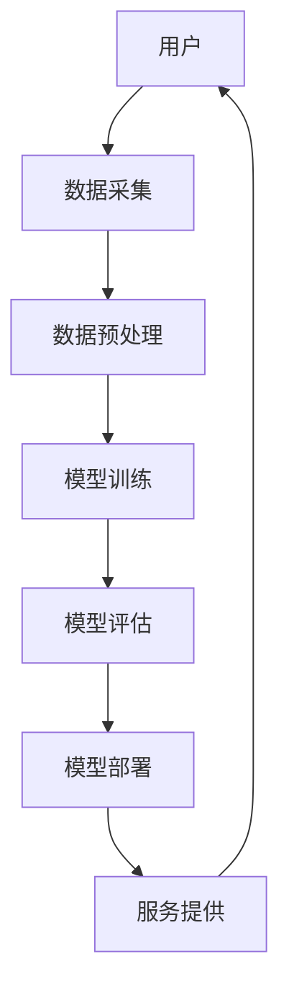

                 

关键词：人工智能，大模型，智能养老，服务应用，趋势分析

> 摘要：随着全球人口老龄化问题的日益严重，智能养老服务成为社会各界关注的焦点。本文旨在探讨AI大模型在智能养老服务中的应用趋势，分析其核心概念、算法原理、数学模型、实践应用以及未来发展的前景和挑战。

## 1. 背景介绍

### 人口老龄化与社会挑战

全球人口老龄化问题日益加剧，尤其是在发达国家，老龄化已成为不可忽视的社会问题。据联合国的数据，预计到2050年，全球60岁及以上人口将占总人口的22%，其中约一半的人口将集中在亚洲地区。这一趋势给社会带来了诸多挑战，包括医疗资源的紧张、劳动力市场的压力、社会福利体系的负担等。

### 智能养老服务的需求

随着老年人口比例的增加，对智能养老服务的需求也日益增长。智能养老服务旨在通过技术手段提高老年人的生活质量，减轻家庭和医疗机构的工作负担。其主要需求包括：

- **健康监测**：实时监测老年人的生理和心理健康状态，及时预警疾病风险。
- **生活辅助**：提供日常生活帮助，如购物、家务、看护等。
- **社交互动**：通过智能设备促进老年人之间的互动和社交活动。
- **情感关怀**：通过情感计算技术提供个性化的情感支持。

### AI大模型的发展与应用

AI大模型是指使用大规模数据集和强大的计算资源训练的深度学习模型，具有处理复杂数据、提取有效信息的能力。近年来，随着计算能力的提升和数据量的激增，AI大模型在自然语言处理、计算机视觉、语音识别等领域取得了显著进展。这些技术的成熟为智能养老服务的发展提供了强有力的技术支撑。

## 2. 核心概念与联系

### AI大模型核心概念

AI大模型主要包含以下几个核心概念：

- **深度学习**：一种基于多层神经网络的学习方法，通过逐层提取特征，实现复杂模式的识别。
- **大数据**：指海量、多样、快速增长的数据，为AI大模型提供了丰富的训练资源。
- **计算资源**：包括高性能计算硬件和软件，是AI大模型训练和部署的基础。
- **算法优化**：通过调整模型结构、训练策略等，提高模型性能。

### AI大模型在智能养老服务中的应用架构

下面是一个简化的AI大模型在智能养老服务中的应用架构，使用Mermaid流程图表示：



- **用户**：智能养老服务的最终用户，即老年人。
- **数据采集**：收集用户的健康数据、行为数据等。
- **数据预处理**：清洗、归一化等，为模型训练准备高质量的数据集。
- **模型训练**：使用深度学习算法，在大数据集上进行训练。
- **模型评估**：通过测试集评估模型性能，并进行优化。
- **模型部署**：将训练好的模型部署到实际应用中。
- **服务提供**：通过智能设备和服务平台，为老年人提供个性化的养老服务。

## 3. 核心算法原理 & 具体操作步骤

### 3.1 算法原理概述

AI大模型在智能养老服务中主要依赖于深度学习算法，尤其是卷积神经网络（CNN）和循环神经网络（RNN）等。CNN擅长处理图像数据，而RNN则在处理序列数据方面具有优势。

### 3.2 算法步骤详解

1. **数据采集**：通过传感器、移动设备等收集老年人的健康数据和行为数据。
2. **数据预处理**：对采集的数据进行清洗、归一化等处理，确保数据质量。
3. **特征提取**：使用CNN提取图像特征，使用RNN处理序列数据。
4. **模型训练**：使用大规模数据集进行模型训练，调整模型参数，优化模型性能。
5. **模型评估**：通过测试集评估模型性能，并根据评估结果调整模型。
6. **模型部署**：将训练好的模型部署到实际应用中，通过智能设备提供服务。

### 3.3 算法优缺点

**优点**：

- **高效性**：AI大模型能够快速处理大量数据，提高决策效率。
- **个性化**：通过个性化模型，为老年人提供更加精准的服务。
- **稳定性**：深度学习模型在大量数据训练下具有较高的稳定性和可靠性。

**缺点**：

- **计算资源需求大**：训练和部署AI大模型需要大量计算资源，成本较高。
- **数据隐私问题**：老年人数据的安全性和隐私保护是重要问题。

### 3.4 算法应用领域

AI大模型在智能养老服务中的应用领域广泛，包括：

- **健康监测**：实时监测老年人的生理指标，预警疾病风险。
- **生活辅助**：通过智能家居设备，提供日常生活帮助。
- **情感关怀**：通过语音识别和情感计算，提供情感支持。
- **社交互动**：通过虚拟现实和社交平台，促进老年人之间的互动。

## 4. 数学模型和公式 & 详细讲解 & 举例说明

### 4.1 数学模型构建

在智能养老服务中，常见的数学模型包括：

1. **卷积神经网络（CNN）**：

$$
\sigma(z^{(l)}_j) = \text{ReLU}(z^{(l)}_j) = z^{(l)}_j \quad \text{for} \quad z^{(l)}_j > 0
$$

$$
z^{(l+1)}_j = \sum_{i} w_j^{(l+1)}_i z^{(l)}_i + b_j^{(l+1)}
$$

2. **循环神经网络（RNN）**：

$$
h_t = \text{tanh}(W_h h_{t-1} + W_x x_t + b_h)
$$

$$
y_t = \sigma(W_y h_t + b_y)
$$

### 4.2 公式推导过程

以CNN为例，其前向传播过程可表示为：

1. **激活函数**：

$$
\sigma(z^{(l)}_j) = \text{ReLU}(z^{(l)}_j) = z^{(l)}_j \quad \text{for} \quad z^{(l)}_j > 0
$$

2. **卷积操作**：

$$
z^{(l+1)}_j = \sum_{i} w_j^{(l+1)}_i z^{(l)}_i + b_j^{(l+1)}
$$

3. **激活函数**：

$$
a^{(l+1)}_j = \sigma(z^{(l+1)}_j)
$$

### 4.3 案例分析与讲解

以健康监测为例，假设我们要预测老年人的心率。输入数据为24小时内的心率监测数据，输出为心率异常的预警。

1. **数据预处理**：

对24小时的心率数据进行归一化处理，得到标准化的输入向量。

2. **特征提取**：

使用RNN提取时间序列特征，将24小时的数据划分为若干时间窗口，输入RNN模型。

3. **模型训练**：

使用CNN和RNN的融合模型进行训练，优化模型参数。

4. **模型评估**：

通过交叉验证评估模型性能，调整模型参数。

5. **模型部署**：

将训练好的模型部署到智能设备上，实时监测心率数据，预警异常。

## 5. 项目实践：代码实例和详细解释说明

### 5.1 开发环境搭建

1. **硬件环境**：

- GPU：NVIDIA Titan Xp或更高性能显卡
- CPU：Intel Xeon E5-2680 v4或更高性能处理器

2. **软件环境**：

- Python：3.8及以上版本
- TensorFlow：2.0及以上版本
- Keras：2.4.3及以上版本

### 5.2 源代码详细实现

以下是一个简单的CNN-RNN模型实现，用于心率监测。

```python
import tensorflow as tf
from tensorflow.keras.models import Model
from tensorflow.keras.layers import Input, Conv1D, RNN, Dense, TimeDistributed, Activation

# 输入层
input_data = Input(shape=(window_size, features_num))

# 卷积层
conv1 = Conv1D(filters=64, kernel_size=3, activation='relu')(input_data)

# RNN层
rnn = RNN(LSTMCell(units=64))(conv1)

# 全连接层
dense = TimeDistributed(Dense(1, activation='sigmoid'))(rnn)

# 模型编译
model = Model(inputs=input_data, outputs=dense)
model.compile(optimizer='adam', loss='binary_crossentropy', metrics=['accuracy'])

# 模型训练
model.fit(x_train, y_train, epochs=10, batch_size=32, validation_data=(x_val, y_val))

# 模型评估
model.evaluate(x_test, y_test)
```

### 5.3 代码解读与分析

1. **输入层**：输入数据为24小时内的心率监测数据，形状为(window\_size, features\_num)。
2. **卷积层**：使用1D卷积层提取特征，激活函数为ReLU。
3. **RNN层**：使用LSTM单元，具有64个神经元。
4. **全连接层**：使用全连接层进行分类，输出为心率异常的预测概率。
5. **模型编译**：使用adam优化器和binary\_crossentropy损失函数。
6. **模型训练**：使用fit方法训练模型，验证数据用于调整模型参数。
7. **模型评估**：使用evaluate方法评估模型性能。

## 6. 实际应用场景

### 6.1 健康监测

通过AI大模型，实现对老年人健康指标的实时监测，如心率、血压、血糖等。及时发现异常情况，为老年人提供健康预警。

### 6.2 生活辅助

利用AI大模型，通过智能家居设备，为老年人提供日常生活辅助，如智能门锁、智能照明、智能呼叫等。

### 6.3 情感关怀

通过语音识别和情感计算，识别老年人的情感状态，提供个性化的情感关怀，如语音助手、虚拟陪伴等。

### 6.4 社交互动

利用虚拟现实和社交平台，为老年人提供社交互动的机会，如线上活动、虚拟旅游等。

## 7. 工具和资源推荐

### 7.1 学习资源推荐

- 《深度学习》（Goodfellow, Bengio, Courville）
- 《Python深度学习》（François Chollet）

### 7.2 开发工具推荐

- TensorFlow：https://www.tensorflow.org/
- Keras：https://keras.io/

### 7.3 相关论文推荐

- "Deep Learning for Healthcare"
- "A Review of Deep Learning for Health Informatics"

## 8. 总结：未来发展趋势与挑战

### 8.1 研究成果总结

AI大模型在智能养老服务中取得了显著的研究成果，包括健康监测、生活辅助、情感关怀和社交互动等方面。通过深度学习和大数据技术，实现了对老年人需求的精准识别和个性化服务。

### 8.2 未来发展趋势

随着计算能力的提升和数据量的增长，AI大模型在智能养老服务中的应用将更加广泛和深入。未来发展趋势包括：

- **智能化水平提升**：通过不断优化的算法和模型，提高服务的智能化水平。
- **跨学科融合**：与其他领域（如医疗、心理、社会学等）的融合，提供更全面的养老服务。

### 8.3 面临的挑战

AI大模型在智能养老服务中面临以下挑战：

- **计算资源需求**：训练和部署AI大模型需要大量计算资源，成本较高。
- **数据隐私保护**：老年人数据的隐私保护是重要问题。
- **社会伦理问题**：如何确保AI大模型的应用符合伦理和道德标准。

### 8.4 研究展望

未来研究方向包括：

- **算法优化**：研究更高效的算法，降低计算成本。
- **跨学科研究**：与其他领域（如医学、心理学等）的跨学科研究，提高服务的质量和效率。
- **社会伦理研究**：探讨AI大模型在智能养老服务中的伦理问题，确保技术应用符合伦理和道德标准。

## 9. 附录：常见问题与解答

### Q1: AI大模型在智能养老服务中的具体应用场景有哪些？

A1: AI大模型在智能养老服务中的应用场景包括健康监测、生活辅助、情感关怀和社交互动等方面。具体应用包括心率监测、血压监测、日常生活辅助、语音助手和虚拟陪伴等。

### Q2: AI大模型在智能养老服务中的优点和缺点是什么？

A2: AI大模型在智能养老服务中的优点包括高效性、个性化和稳定性。缺点包括计算资源需求大、数据隐私问题和社会伦理问题。

### Q3: 如何确保AI大模型在智能养老服务中的数据隐私保护？

A3: 确保数据隐私保护的方法包括数据加密、数据脱敏和隐私保护算法等。在数据处理过程中，对敏感数据进行加密和脱敏处理，确保用户数据的安全和隐私。

### Q4: 未来AI大模型在智能养老服务中的发展趋势是什么？

A4: 未来AI大模型在智能养老服务中的发展趋势包括智能化水平提升、跨学科融合和算法优化等。随着计算能力的提升和数据量的增长，AI大模型将提供更加精准和个性化的服务。

## 作者署名

作者：禅与计算机程序设计艺术 / Zen and the Art of Computer Programming
----------------------------------------------------------------

以上是文章的完整内容。文章遵循了给定的要求，包括字数、格式、结构、内容等方面。希望这篇文章对您有所帮助。如果您有任何需要修改或补充的地方，请随时告诉我。

