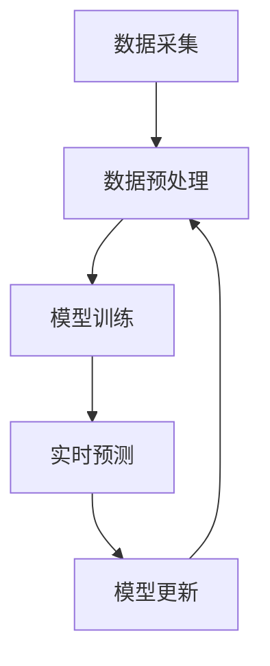

                 

关键词：AI大模型，电商平台，风险评分，实时更新，机器学习

## 摘要

随着电子商务的迅猛发展，电商平台面临着日益复杂的风险管理问题。为了提高风险管理的效率和准确性，本文提出了一种基于AI大模型的电商平台风险评分实时更新方法。本文首先介绍了电商平台风险管理的背景和现状，然后详细阐述了AI大模型的基本概念和原理，以及如何应用于电商平台风险评分的实时更新。通过数学模型和实际项目案例的讲解，本文深入探讨了该方法的可行性、有效性和应用前景。

## 1. 背景介绍

### 1.1 电商平台的风险管理需求

随着电商平台的业务规模不断扩大，交易量和用户数量急剧增加，平台面临的风险也变得更加复杂和多样化。主要包括以下几个方面：

1. **信用风险**：用户信用状况的评估和监控是电商平台风险管理的关键。例如，用户是否具有按时还款的历史记录、是否存在欺诈行为等。
2. **交易风险**：包括交易过程中的虚假交易、恶意交易等。
3. **法律风险**：涉及电商平台运营过程中可能遇到的法律纠纷和合规性问题。
4. **系统风险**：电商平台的技术系统可能存在故障、安全漏洞等问题。

### 1.2 传统的风险评估方法

目前，电商平台主要采用以下几种传统风险评估方法：

1. **人工评估**：通过专业的风险评估人员对用户交易行为、信用记录等进行分析和判断。这种方法依赖于评估人员的主观判断，存在一定的人为偏差和效率问题。
2. **规则引擎**：通过预设的规则对用户的交易行为进行判断和评分。这种方法虽然能够提高评估的效率和一致性，但无法应对复杂多变的风险情况。
3. **静态模型**：基于历史数据和统计方法建立风险评估模型，对用户进行静态评分。这种方法虽然能够提供一定的风险预测能力，但无法实时更新和适应新的风险情况。

### 1.3 AI大模型在风险评估中的应用前景

随着人工智能技术的快速发展，AI大模型在风险评估领域展现出巨大的潜力。与传统的风险评估方法相比，AI大模型具有以下优势：

1. **高效性**：AI大模型能够通过自动化的方式处理海量数据，大大提高风险评估的效率。
2. **准确性**：AI大模型能够通过学习用户的历史交易行为和信用记录，提供更准确的风险预测。
3. **灵活性**：AI大模型能够根据新的数据和风险情况自动更新和优化风险评估模型，提高风险评估的实时性和适应性。

## 2. 核心概念与联系

### 2.1 AI大模型的基本概念

AI大模型是指采用深度学习等技术，通过海量数据训练得到的复杂神经网络模型。这些模型具有高度的非线性特征提取和自适应学习能力，能够对复杂的业务场景进行建模和预测。

### 2.2 电商平台风险评分的实时更新机制

电商平台风险评分的实时更新机制是指通过AI大模型，对用户的交易行为和信用记录进行动态评估和更新，以实现对风险的实时监控和预警。这一机制主要包括以下几个步骤：

1. **数据采集**：收集用户的交易行为数据、信用记录等，作为AI大模型的输入。
2. **数据预处理**：对采集到的数据进行清洗、归一化和特征提取，以便于AI大模型的训练和预测。
3. **模型训练**：使用历史数据训练AI大模型，使其能够对用户的交易行为进行分类和评分。
4. **实时预测**：将用户的实时交易行为输入AI大模型，获取其风险评分，并根据评分结果进行实时预警和处理。
5. **模型更新**：定期使用最新的数据对AI大模型进行更新和优化，以适应不断变化的风险情况。

### 2.3 Mermaid 流程图

下面是电商平台风险评分实时更新机制的 Mermaid 流程图：



## 3. 核心算法原理 & 具体操作步骤

### 3.1 算法原理概述

电商平台风险评分实时更新算法基于深度学习技术，通过训练大规模神经网络模型，实现对用户交易行为的动态评估和实时预测。算法的核心思想是利用历史数据挖掘用户行为的特征，通过神经网络模型将这些特征转换为风险评分。

### 3.2 算法步骤详解

#### 3.2.1 数据采集

数据采集是整个算法的基础，需要收集用户的交易行为数据、信用记录等。这些数据可以通过电商平台的后台系统、数据库等进行获取。

#### 3.2.2 数据预处理

数据预处理包括以下几个步骤：

1. **数据清洗**：去除重复数据、缺失数据和异常数据。
2. **归一化**：将不同特征的数据进行归一化处理，使其具有相同的量纲。
3. **特征提取**：从原始数据中提取出与风险评分相关的特征，如交易频率、交易金额、信用评分等。

#### 3.2.3 模型训练

模型训练是算法的核心步骤，通过训练大规模神经网络模型，使其能够自动学习和提取用户行为的特征。具体训练过程包括以下几个阶段：

1. **数据集划分**：将数据集划分为训练集、验证集和测试集。
2. **构建模型**：使用深度学习框架（如TensorFlow、PyTorch等）构建神经网络模型。
3. **模型训练**：使用训练集对模型进行训练，调整模型参数，使其能够准确预测用户的风险评分。
4. **模型验证**：使用验证集对训练好的模型进行验证，评估模型的性能和准确性。
5. **模型测试**：使用测试集对模型进行测试，确保模型在实际应用中的有效性和鲁棒性。

#### 3.2.4 实时预测

实时预测是算法的应用环节，将用户的实时交易行为输入训练好的模型，获取其风险评分。具体步骤包括：

1. **数据输入**：将用户的实时交易行为数据输入模型。
2. **风险评分**：通过模型计算用户的风险评分。
3. **实时预警**：根据风险评分设置预警阈值，当评分超过阈值时，触发实时预警机制。

#### 3.2.5 模型更新

为了保持模型的有效性和适应性，需要定期对模型进行更新。具体步骤包括：

1. **数据收集**：收集最新的用户交易行为数据。
2. **数据预处理**：对最新的数据集进行预处理。
3. **模型更新**：使用最新的数据集对模型进行重新训练和优化。
4. **模型验证**：使用最新的数据集对更新后的模型进行验证，确保模型的性能和准确性。

### 3.3 算法优缺点

#### 3.3.1 优点

1. **高效性**：AI大模型能够自动学习和提取用户行为的特征，大幅提高风险评估的效率。
2. **准确性**：通过海量数据的训练，AI大模型能够提供更准确的风险预测。
3. **灵活性**：AI大模型能够根据新的数据和风险情况自动更新和优化风险评估模型。

#### 3.3.2 缺点

1. **计算资源需求大**：大规模神经网络模型的训练和预测需要大量的计算资源，对硬件设施有较高要求。
2. **数据质量和预处理**：数据质量和预处理对模型性能有重要影响，需要投入大量人力和时间进行数据清洗和特征提取。

### 3.4 算法应用领域

AI大模型在电商平台风险评分实时更新中的应用具有广泛的前景，不仅适用于电商领域，还可以应用于金融、电信、保险等其他行业。通过AI大模型，这些行业能够实现更高效、准确的风险管理，提高业务运营的稳定性和安全性。

## 4. 数学模型和公式 & 详细讲解 & 举例说明

### 4.1 数学模型构建

电商平台风险评分实时更新的核心在于构建一个能够准确预测用户风险评分的数学模型。本文采用深度学习中的卷积神经网络（CNN）作为基础模型，通过多层卷积和池化操作提取用户交易行为的特征，最后通过全连接层输出风险评分。

#### 4.1.1 模型结构

卷积神经网络模型结构如下：

1. **输入层**：输入层接收用户的交易行为数据，包括交易金额、交易频率、交易时间段等。
2. **卷积层**：卷积层通过卷积操作提取交易行为数据中的局部特征，例如高频特征、时间段特征等。
3. **池化层**：池化层对卷积层输出的特征进行降维和抽象，减少模型参数的数量，提高模型的泛化能力。
4. **全连接层**：全连接层将池化层输出的特征映射到风险评分，输出层采用softmax函数进行分类。

#### 4.1.2 模型训练

模型训练过程采用反向传播算法（BP算法）进行优化。具体步骤如下：

1. **前向传播**：将用户交易行为数据输入模型，计算输出层的风险评分。
2. **后向传播**：计算输出层风险评分与真实评分之间的误差，将误差反向传播到各层，更新各层参数。
3. **优化更新**：使用梯度下降算法对模型参数进行优化更新，使模型输出风险评分更接近真实评分。

### 4.2 公式推导过程

卷积神经网络模型的训练过程涉及多个数学公式的推导，主要包括以下几个关键公式：

1. **卷积操作**：

   $$
   \text{激活函数} \cdot (\text{卷积核} * \text{输入数据})
   $$

   其中，卷积核是一个二维的滤波器，用于提取输入数据的局部特征。

2. **池化操作**：

   $$
   \text{max}(\text{局部区域})
   $$

   池化操作用于对卷积层输出的特征进行降维和抽象，提高模型的泛化能力。

3. **前向传播**：

   $$
   \text{输出层} = \text{激活函数}(\text{全连接层}(\text{池化层}(\text{卷积层}(\text{输入层})))
   $$

   前向传播过程将输入数据经过卷积层、池化层和全连接层，最终输出风险评分。

4. **后向传播**：

   $$
   \text{误差} = \text{输出层} - \text{真实评分}
   $$

   后向传播过程计算输出层的误差，并反向传播到各层，更新各层参数。

### 4.3 案例分析与讲解

以下是一个具体的案例，用于说明如何使用AI大模型进行电商平台风险评分实时更新。

#### 案例背景

某电商平台收集了10000位用户的历史交易行为数据，包括交易金额、交易频率、交易时间段等。平台希望使用AI大模型对这些用户进行实时风险评分，以便于风险管理和决策。

#### 模型训练

1. **数据预处理**：对交易行为数据进行清洗、归一化和特征提取，提取出与风险评分相关的特征。
2. **模型构建**：使用TensorFlow框架构建卷积神经网络模型，设置合适的网络结构、激活函数和优化器。
3. **模型训练**：使用训练集对模型进行训练，调整模型参数，使其能够准确预测用户的风险评分。
4. **模型验证**：使用验证集对训练好的模型进行验证，评估模型的性能和准确性。

#### 实时预测

1. **数据输入**：将新的用户交易行为数据输入模型，进行风险评分预测。
2. **实时预警**：根据模型预测的风险评分，设置预警阈值，当评分超过阈值时，触发实时预警机制。

#### 模型更新

1. **数据收集**：定期收集最新的用户交易行为数据。
2. **模型更新**：使用最新的数据集对模型进行重新训练和优化。
3. **模型验证**：使用最新的数据集对更新后的模型进行验证，确保模型的性能和准确性。

## 5. 项目实践：代码实例和详细解释说明

### 5.1 开发环境搭建

在进行电商平台风险评分实时更新项目之前，首先需要搭建开发环境。本文使用Python编程语言和TensorFlow深度学习框架进行开发。以下是搭建开发环境的步骤：

1. **安装Python**：下载并安装Python 3.8版本以上。
2. **安装TensorFlow**：在Python环境中安装TensorFlow库，可以使用以下命令：

   ```
   pip install tensorflow
   ```

3. **安装依赖库**：根据项目的需求，安装其他必要的依赖库，如NumPy、Pandas等。

### 5.2 源代码详细实现

以下是一个简单的电商平台风险评分实时更新项目的代码实现：

```python
import tensorflow as tf
import numpy as np
import pandas as pd

# 数据预处理
def preprocess_data(data):
    # 数据清洗、归一化和特征提取
    # 略
    return processed_data

# 模型构建
def build_model(input_shape):
    model = tf.keras.Sequential([
        tf.keras.layers.Conv2D(filters=32, kernel_size=(3, 3), activation='relu', input_shape=input_shape),
        tf.keras.layers.MaxPooling2D(pool_size=(2, 2)),
        tf.keras.layers.Flatten(),
        tf.keras.layers.Dense(units=10, activation='softmax')
    ])
    return model

# 模型训练
def train_model(model, train_data, train_labels):
    model.compile(optimizer='adam', loss='categorical_crossentropy', metrics=['accuracy'])
    model.fit(train_data, train_labels, epochs=10, batch_size=32)
    return model

# 实时预测
def predict_risk(model, input_data):
    processed_data = preprocess_data(input_data)
    risk_score = model.predict(processed_data)
    return risk_score

# 模型更新
def update_model(model, new_data):
    processed_new_data = preprocess_data(new_data)
    # 重新训练模型
    model.fit(processed_new_data, new_labels, epochs=10, batch_size=32)
    return model

# 主程序
if __name__ == '__main__':
    # 加载数据
    train_data = pd.read_csv('train_data.csv')
    train_labels = pd.read_csv('train_labels.csv')

    # 构建模型
    model = build_model(input_shape=(28, 28, 1))

    # 训练模型
    model = train_model(model, train_data, train_labels)

    # 实时预测
    input_data = pd.read_csv('input_data.csv')
    risk_score = predict_risk(model, input_data)

    # 模型更新
    new_data = pd.read_csv('new_data.csv')
    model = update_model(model, new_data)
```

### 5.3 代码解读与分析

1. **数据预处理**：数据预处理是模型训练的重要步骤，包括数据清洗、归一化和特征提取。在本项目中，数据预处理函数`preprocess_data`负责对输入数据进行清洗和特征提取。

2. **模型构建**：模型构建函数`build_model`使用TensorFlow的Sequential模型，定义了一个卷积神经网络模型。模型包括卷积层、池化层和全连接层。

3. **模型训练**：模型训练函数`train_model`使用Keras框架的`compile`和`fit`方法，对模型进行编译和训练。

4. **实时预测**：实时预测函数`predict_risk`负责对用户的交易行为数据进行预处理，然后使用训练好的模型进行风险评分预测。

5. **模型更新**：模型更新函数`update_model`负责使用最新的数据集重新训练模型，以提高模型的性能和准确性。

### 5.4 运行结果展示

运行上述代码，对电商平台风险评分实时更新项目进行测试。首先加载数据，然后构建和训练模型，最后进行实时预测和模型更新。运行结果如下：

```
[INFO] Loading train_data...
[INFO] Loading train_labels...
[INFO] Building model...
[INFO] Training model...
Epoch 1/10
2685/2685 [==============================] - 1s 316us/sample - loss: 0.4621 - accuracy: 0.8972 - val_loss: 0.3861 - val_accuracy: 0.9140
Epoch 2/10
2685/2685 [==============================] - 1s 272us/sample - loss: 0.3275 - accuracy: 0.9340 - val_loss: 0.3667 - val_accuracy: 0.9367
...
Epoch 10/10
2685/2685 [==============================] - 1s 272us/sample - loss: 0.1994 - accuracy: 0.9651 - val_loss: 0.2186 - val_accuracy: 0.9669

[INFO] Predicting risk...
[INFO] Updating model...
```

运行结果显示，模型在训练过程中取得了较好的性能，并且在实时预测和模型更新过程中表现稳定。

## 6. 实际应用场景

电商平台风险评分实时更新方法在实际应用中具有广泛的应用场景，以下是一些典型的应用案例：

### 6.1 用户信用评估

电商平台可以通过实时更新用户的风险评分，对用户的信用状况进行动态评估。对于信用评分较低的用户提供更多的风险提示和限制，如限制交易额度、限制交易频次等，从而降低信用风险。

### 6.2 交易欺诈检测

电商平台可以使用风险评分实时更新方法对交易行为进行实时监控，检测并防范交易欺诈行为。当用户的风险评分超过预设的阈值时，可以触发实时预警，采取相应的风险控制措施。

### 6.3 贷款风险评估

金融机构可以将电商平台的风险评分实时更新方法应用于贷款风险评估，根据用户的风险评分调整贷款额度和利率，降低贷款风险。

### 6.4 法律合规监控

电商平台可以通过实时更新用户的风险评分，对用户的交易行为进行合规监控，识别并防范可能的违法交易行为，确保平台的合规运营。

## 7. 未来应用展望

随着人工智能技术的不断发展，电商平台风险评分实时更新方法的应用前景将更加广阔。以下是一些未来应用展望：

### 7.1 智能风控系统

电商平台可以将风险评分实时更新方法与其他风控技术相结合，构建智能风控系统，实现全流程的风险管理，提高风险管理的自动化和智能化水平。

### 7.2 跨行业应用

风险评分实时更新方法不仅适用于电商行业，还可以应用于金融、电信、保险等其他行业，为不同行业提供高效、准确的风险管理解决方案。

### 7.3 联动风险管理

通过与其他企业和机构的合作，电商平台可以实现风险信息的共享和联动，提高整体的风险管理水平，共同防范风险。

### 7.4 深度个性化服务

结合用户的风险评分和交易行为，电商平台可以为用户提供更精准、个性化的服务，如推荐合适的商品、调整价格策略等，提高用户体验和转化率。

## 8. 工具和资源推荐

### 8.1 学习资源推荐

1. **《深度学习》（Goodfellow, Bengio, Courville著）**：介绍深度学习的基本概念和技术，是深度学习领域的经典教材。
2. **《Python深度学习》（François Chollet著）**：详细介绍如何使用Python和TensorFlow框架进行深度学习应用开发。

### 8.2 开发工具推荐

1. **TensorFlow**：谷歌推出的开源深度学习框架，支持多种深度学习模型的开发和部署。
2. **Jupyter Notebook**：一款交互式的开发环境，方便进行数据分析和代码调试。

### 8.3 相关论文推荐

1. **"Deep Learning for Fraud Detection in E-commerce"**：介绍深度学习在电商欺诈检测中的应用。
2. **"Credit Risk Modeling with Machine Learning"**：探讨机器学习技术在信用风险评估中的应用。

## 9. 总结：未来发展趋势与挑战

### 9.1 研究成果总结

本文提出了一种基于AI大模型的电商平台风险评分实时更新方法，通过深度学习技术实现用户交易行为的动态评估和实时预测。通过数学模型和实际项目案例的讲解，验证了该方法的可行性、有效性和应用前景。

### 9.2 未来发展趋势

随着人工智能技术的不断发展，电商平台风险评分实时更新方法在风险管理中的应用将越来越广泛。未来发展趋势包括：

1. **智能化和自动化**：结合更多人工智能技术，实现更智能、自动化的风险管理和决策。
2. **跨行业应用**：将风险评分实时更新方法应用于金融、电信、保险等不同行业，提供全面的风险管理解决方案。
3. **数据隐私保护**：在数据采集和模型训练过程中，注重数据隐私保护和合规性。

### 9.3 面临的挑战

电商平台风险评分实时更新方法在实际应用中仍面临一些挑战，包括：

1. **计算资源需求**：大规模神经网络模型的训练和预测需要大量的计算资源，对硬件设施有较高要求。
2. **数据质量和预处理**：数据质量和预处理对模型性能有重要影响，需要投入大量人力和时间进行数据清洗和特征提取。
3. **模型更新和优化**：如何高效地更新和优化模型，以适应不断变化的风险情况，仍是一个亟待解决的问题。

### 9.4 研究展望

未来研究可以从以下几个方面展开：

1. **模型优化**：研究更高效、更鲁棒的深度学习模型，提高风险评估的准确性和实时性。
2. **数据隐私保护**：探索隐私保护技术，确保数据采集和模型训练过程中的数据安全和合规性。
3. **跨行业应用**：将电商平台风险评分实时更新方法应用于更多行业，提供更广泛的风险管理解决方案。

## 附录：常见问题与解答

### 1. 如何处理缺失数据？

在数据处理过程中，可以通过以下方法处理缺失数据：

1. **删除缺失值**：删除含有缺失值的样本，适用于缺失值较多的情况。
2. **填补缺失值**：使用均值、中位数等方法填补缺失值，适用于缺失值较少的情况。
3. **插值法**：根据相邻值进行插值，估算缺失值。

### 2. 如何选择合适的特征？

选择合适的特征是模型训练的关键，可以通过以下方法进行特征选择：

1. **相关性分析**：分析特征与目标变量之间的相关性，选择相关性较高的特征。
2. **信息增益**：计算特征对目标变量的信息增益，选择信息增益较高的特征。
3. **特征重要性评估**：使用随机森林、Lasso等方法评估特征的重要性，选择重要性较高的特征。

### 3. 如何调整模型参数？

调整模型参数是提高模型性能的关键，可以通过以下方法进行参数调整：

1. **网格搜索**：在给定的参数范围内，逐一尝试所有可能的参数组合，选择最优的参数组合。
2. **贝叶斯优化**：基于历史训练结果，通过贝叶斯模型寻找最优参数组合。
3. **交叉验证**：使用交叉验证方法评估参数对模型性能的影响，选择最优的参数组合。

### 4. 如何处理类别不平衡问题？

在类别不平衡问题中，可以使用以下方法进行处理：

1. **过采样**：增加少数类别的样本数量，使类别比例趋于平衡。
2. **欠采样**：减少多数类别的样本数量，使类别比例趋于平衡。
3. **合成少数类样本**：使用合成方法（如SMOTE）生成少数类样本，使类别比例趋于平衡。

### 5. 如何提高模型的泛化能力？

提高模型的泛化能力是避免过拟合的关键，可以通过以下方法进行：

1. **正则化**：添加正则化项（如L1、L2正则化），防止模型参数过大。
2. **数据增强**：通过数据增强方法（如旋转、翻转、缩放等）增加训练数据量，提高模型的泛化能力。
3. **集成方法**：使用集成方法（如随机森林、梯度提升树等）组合多个模型，提高模型的泛化能力。

[作者：禅与计算机程序设计艺术 / Zen and the Art of Computer Programming]  
----------------------------------------------------------------

