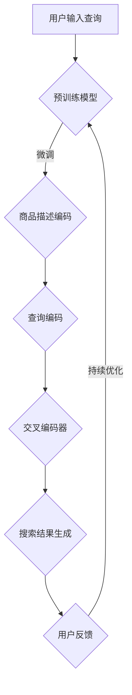

                 

## 1. 背景介绍

随着移动互联网的快速发展，电子商务已成为人们日常生活中不可或缺的一部分。电商平台作为连接消费者与商品的重要桥梁，其搜索功能的质量直接关系到用户的购物体验和平台的竞争力。然而，传统的搜索引擎存在许多局限，如无法理解用户意图、搜索结果相关性差等问题，这导致了用户体验的下降。

近年来，人工智能技术的飞速发展为电商平台提供了新的解决方案。特别是大规模预训练模型（Large-scale Pre-trained Models），如GPT、BERT等，通过对海量文本数据进行训练，已经具备了强大的语义理解和生成能力。这些大模型在自然语言处理（NLP）领域取得了显著的突破，为电商平台的移动搜索体验带来了革命性的改变。

本文将探讨如何利用AI大模型改善电商平台的移动搜索体验。首先，我们将介绍大模型的基本原理和架构；然后，通过具体的算法原理和数学模型分析，阐述大模型在搜索中的实际应用；接着，通过一个实际项目的代码实例，展示如何实现这一技术；最后，我们将讨论大模型在电商搜索中的实际应用场景和未来展望。

## 2. 核心概念与联系

### 2.1 大模型基本原理

大规模预训练模型（Large-scale Pre-trained Models）是一种基于深度学习的技术，通过在大量无标注数据上进行预训练，然后微调到特定任务上，从而实现高效的模型训练和性能提升。以下是大模型的基本原理和核心概念：

- **预训练（Pre-training）**：大模型在大量无标注文本数据上进行预训练，学习语言的一般特征和结构。这个过程通常包括两个阶段：嵌入层（Embedding Layer）和编码层（Encoder Layer）。嵌入层将输入文本转换为向量表示，编码层通过多层神经网络学习文本的深层语义表示。
  
- **微调（Fine-tuning）**：在预训练的基础上，大模型通过在特定任务上添加额外的层或调整参数，进一步提高模型在目标任务上的性能。例如，在电商搜索中，可以使用预训练的大模型来处理用户查询和商品描述，然后通过微调来提高搜索结果的相关性。

### 2.2 大模型架构

大模型的架构通常包括以下部分：

- **嵌入层（Embedding Layer）**：将输入文本转换为固定长度的向量表示，用于后续的神经网络处理。
- **编码层（Encoder Layer）**：通过多层神经网络（如Transformer）对文本进行编码，学习文本的深层语义表示。
- **解码层（Decoder Layer）**：在预训练阶段不需要解码层，但在微调阶段，解码层可以用于生成文本或其他序列数据。

### 2.3 大模型与NLP的联系

大模型在自然语言处理领域取得了显著的突破，其核心在于对语义理解的提升。以下是大模型与NLP之间的联系：

- **语义理解（Semantic Understanding）**：大模型通过对海量文本数据进行预训练，可以学习到文本的深层语义信息，从而更好地理解用户查询和商品描述的意图。
- **生成能力（Generative Ability）**：大模型通过解码层可以生成文本或其他序列数据，从而实现智能搜索、推荐等功能。
- **多模态处理（Multimodal Processing）**：大模型可以处理多种输入模态（如文本、图像、声音等），从而实现跨模态搜索和推荐。

### 2.4 Mermaid流程图

以下是一个关于大模型在电商搜索中应用流程的Mermaid流程图：



## 3. 核心算法原理 & 具体操作步骤

### 3.1 算法原理概述

大模型在电商搜索中的应用主要通过以下步骤实现：

1. **用户输入查询**：用户通过电商平台输入查询。
2. **查询编码**：使用预训练的大模型将用户查询编码为固定长度的向量。
3. **商品描述编码**：使用相同的大模型对电商平台上的商品描述进行编码。
4. **交叉编码器**：通过交叉编码器（如BERT）将查询和商品描述的编码进行融合，以提取出更相关的搜索结果。
5. **搜索结果生成**：使用解码器生成搜索结果，并将其展示给用户。
6. **用户反馈**：用户根据搜索结果进行反馈，用于模型持续优化。

### 3.2 算法步骤详解

1. **用户输入查询**：
   用户通过电商平台输入查询，例如“想买一件秋冬外套”。

2. **查询编码**：
   使用预训练的大模型（如BERT）将用户查询编码为固定长度的向量。具体步骤如下：
   - **Tokenization**：将查询文本分解为一系列单词或子词（Token）。
   - **Word Embedding**：将每个Token映射到一个固定长度的向量。
   - **Positional Encoding**：为每个Token添加位置信息，以区分其在查询中的位置。

3. **商品描述编码**：
   类似于查询编码，使用预训练的大模型对电商平台上的商品描述进行编码。具体步骤如下：
   - **Tokenization**：将商品描述文本分解为一系列单词或子词（Token）。
   - **Word Embedding**：将每个Token映射到一个固定长度的向量。
   - **Positional Encoding**：为每个Token添加位置信息，以区分其在商品描述中的位置。

4. **交叉编码器**：
   通过交叉编码器（如BERT）将查询和商品描述的编码进行融合，以提取出更相关的搜索结果。具体步骤如下：
   - **编码器**：使用预训练的大模型对查询和商品描述的编码进行编码。
   - **融合**：通过多层神经网络将查询和商品描述的编码进行融合，以提取出更相关的特征。
   - **解码器**：使用解码器生成搜索结果。

5. **搜索结果生成**：
   使用解码器生成搜索结果，并将其展示给用户。具体步骤如下：
   - **解码**：从编码器输出的隐藏状态中生成搜索结果。
   - **排序**：根据搜索结果的相关性对结果进行排序。
   - **展示**：将排序后的搜索结果展示给用户。

6. **用户反馈**：
   用户根据搜索结果进行反馈，用于模型持续优化。具体步骤如下：
   - **评估**：评估搜索结果的相关性，例如通过点击率、转化率等指标。
   - **优化**：根据用户反馈对模型进行优化，例如通过调整模型参数、调整搜索算法等。

### 3.3 算法优缺点

**优点**：
- **强大的语义理解能力**：大模型通过预训练学习到丰富的语言特征和结构，从而可以更好地理解用户查询和商品描述的意图。
- **高效的搜索结果生成**：大模型可以快速生成高质量的搜索结果，提高用户搜索效率。
- **跨模态处理能力**：大模型可以处理多种输入模态，如文本、图像、声音等，实现更丰富的搜索体验。

**缺点**：
- **计算资源需求大**：大模型需要大量的计算资源和存储空间，对硬件设备的要求较高。
- **训练时间较长**：大模型的预训练过程需要大量时间，且在特定任务上的微调过程也较长。
- **对数据质量要求高**：大模型对训练数据的质量要求较高，如果数据质量差，可能导致模型性能下降。

### 3.4 算法应用领域

大模型在电商搜索中的应用不仅限于移动端，还可以应用于其他领域，如：

- **搜索引擎**：大模型可以用于搜索引擎中的搜索结果生成和排序，提高搜索结果的准确性。
- **推荐系统**：大模型可以用于推荐系统中的用户兴趣识别和推荐生成，提高推荐系统的用户体验。
- **语音识别**：大模型可以用于语音识别中的语音转换为文本，提高语音识别的准确性。

## 4. 数学模型和公式 & 详细讲解 & 举例说明

### 4.1 数学模型构建

在电商搜索中，大模型的数学模型主要由两个部分组成：查询编码模型和商品描述编码模型。以下是对这两个模型的数学公式和参数的详细讲解。

#### 查询编码模型

查询编码模型的数学模型可以表示为：

\[ \text{Query Encoder}: \text{Input} \rightarrow \text{Query Encoding} \]

其中，查询编码模型的主要参数包括：

- **Word Embedding Matrix \( W_e \)**：将输入的Token映射到固定长度的向量，表示为 \( \text{Token}_i \rightarrow \text{Vector}_i \)，即 \( \text{Vector}_i = W_e \text{Token}_i \)。
- **Positional Encoding Matrix \( W_p \)**：为输入的Token添加位置信息，表示为 \( \text{Position}_j \rightarrow \text{Vector}_j \)，即 \( \text{Vector}_j = W_p \text{Position}_j \)。

因此，查询编码模型的输出可以表示为：

\[ \text{Query Encoding} = \text{Query Vector} = [ \text{Vector}_{1}, \text{Vector}_{2}, \ldots, \text{Vector}_{N} ] \]

其中，\( N \)表示查询中的Token数量。

#### 商品描述编码模型

商品描述编码模型的数学模型可以表示为：

\[ \text{Product Encoder}: \text{Input} \rightarrow \text{Product Encoding} \]

商品描述编码模型的主要参数包括：

- **Word Embedding Matrix \( W_e \)**：与查询编码模型相同，用于将输入的Token映射到固定长度的向量。
- **Positional Encoding Matrix \( W_p \)**：与查询编码模型相同，用于为输入的Token添加位置信息。

因此，商品描述编码模型的输出可以表示为：

\[ \text{Product Encoding} = \text{Product Vector} = [ \text{Vector}_{1}, \text{Vector}_{2}, \ldots, \text{Vector}_{N} ] \]

其中，\( N \)表示商品描述中的Token数量。

### 4.2 公式推导过程

为了推导查询编码模型和商品描述编码模型的公式，我们需要理解以下两个关键概念：

#### Word Embedding

Word Embedding是一种将单词映射到固定长度的向量的方法，它在自然语言处理中非常重要。一个简单的Word Embedding模型可以使用以下公式表示：

\[ \text{Word Embedding}: \text{Word} \rightarrow \text{Vector} \]

假设我们有一个单词“搜索”，并将其映射到向量\( \text{Vector}_{搜索} \)，则该单词的Word Embedding可以表示为：

\[ \text{Vector}_{搜索} = W_e \text{搜索} \]

其中，\( W_e \)是Word Embedding矩阵，\(\text{搜索}\)是输入的单词。

#### Positional Encoding

Positional Encoding是一种为单词添加位置信息的方法，以区分其在序列中的位置。一个简单的Positional Encoding模型可以使用以下公式表示：

\[ \text{Positional Encoding}: \text{Position} \rightarrow \text{Vector} \]

假设我们有一个单词“搜索”，它在序列中的位置为3，则该单词的Positional Encoding可以表示为：

\[ \text{Vector}_{搜索，位置3} = W_p \text{位置3} \]

其中，\( W_p \)是Positional Encoding矩阵，\(\text{位置3}\)是输入的位置信息。

### 4.3 案例分析与讲解

为了更好地理解大模型在电商搜索中的应用，我们来看一个具体的案例。

假设用户输入查询“想买一件秋冬外套”，电商平台上有一件商品描述为“一件高品质的秋冬外套，时尚舒适”。我们将使用大模型对这两个文本进行编码，并生成搜索结果。

#### 查询编码

首先，我们将查询“想买一件秋冬外套”分解为一系列的Token。例如，我们可以将其分解为“想”、“买”、“一件”、“秋”、“冬”、“外套”。然后，我们使用Word Embedding矩阵\( W_e \)将每个Token映射到固定长度的向量。例如，假设“想”的Word Embedding为\( \text{Vector}_{想} \)，则查询编码可以表示为：

\[ \text{Query Encoding} = [ \text{Vector}_{想}, \text{Vector}_{买}, \text{Vector}_{一件}, \text{Vector}_{秋}, \text{Vector}_{冬}, \text{Vector}_{外套} ] \]

接下来，我们使用Positional Encoding矩阵\( W_p \)为每个Token添加位置信息。例如，假设“想”的位置信息为\( \text{Vector}_{位置1} \)，则查询编码可以表示为：

\[ \text{Query Encoding} = [ \text{Vector}_{想，位置1}, \text{Vector}_{买，位置2}, \text{Vector}_{一件，位置3}, \text{Vector}_{秋，位置4}, \text{Vector}_{冬，位置5}, \text{Vector}_{外套，位置6} ] \]

#### 商品描述编码

类似地，我们将商品描述“一件高品质的秋冬外套，时尚舒适”分解为一系列的Token。例如，我们可以将其分解为“一件”、“高”、“品质”、“的”、“秋”、“冬”、“外套”、“时尚”、“舒适”。然后，我们使用Word Embedding矩阵\( W_e \)将每个Token映射到固定长度的向量。例如，假设“一件”的Word Embedding为\( \text{Vector}_{一件} \)，则商品描述编码可以表示为：

\[ \text{Product Encoding} = [ \text{Vector}_{一件}, \text{Vector}_{高}, \text{Vector}_{品质}, \text{Vector}_{的}, \text{Vector}_{秋}, \text{Vector}_{冬}, \text{Vector}_{外套}, \text{Vector}_{时尚}, \text{Vector}_{舒适} ] \]

接下来，我们使用Positional Encoding矩阵\( W_p \)为每个Token添加位置信息。例如，假设“一件”的位置信息为\( \text{Vector}_{位置1} \)，则商品描述编码可以表示为：

\[ \text{Product Encoding} = [ \text{Vector}_{一件，位置1}, \text{Vector}_{高，位置2}, \text{Vector}_{品质，位置3}, \text{Vector}_{的，位置4}, \text{Vector}_{秋，位置5}, \text{Vector}_{冬，位置6}, \text{Vector}_{外套，位置7}, \text{Vector}_{时尚，位置8}, \text{Vector}_{舒适，位置9} ] \]

#### 交叉编码器

接下来，我们将使用交叉编码器（如BERT）将查询编码和商品描述编码进行融合，以提取出更相关的搜索结果。交叉编码器的输入可以表示为：

\[ \text{Input} = [ \text{Query Encoding}, \text{Product Encoding} ] \]

交叉编码器的输出可以表示为：

\[ \text{Cross Encoder} = [ \text{Output}_{查询}, \text{Output}_{商品描述} ] \]

其中，\( \text{Output}_{查询} \)和\( \text{Output}_{商品描述} \)是查询和商品描述的编码融合后的结果。

#### 搜索结果生成

最后，我们使用解码器生成搜索结果。解码器的输入可以表示为：

\[ \text{Input} = \text{Cross Encoder} \]

解码器的输出可以表示为：

\[ \text{Search Results} = [ \text{Result}_{1}, \text{Result}_{2}, \ldots, \text{Result}_{M} ] \]

其中，\( \text{Result}_{i} \)是搜索结果中第i个商品。

#### 搜索结果排序

根据解码器的输出，我们可以计算每个搜索结果的相关性分数。例如，我们可以使用以下公式计算每个搜索结果的相关性分数：

\[ \text{Score}_{i} = \text{similarity}(\text{Result}_{i}, \text{Query Encoding}) \]

其中，\( \text{similarity} \)是查询和搜索结果之间的相似度函数。

根据计算出的相关性分数，我们可以对搜索结果进行排序，并将排序后的结果展示给用户。

## 5. 项目实践：代码实例和详细解释说明

为了更直观地展示如何利用大模型改善电商平台的移动搜索体验，我们以下将通过一个实际项目的代码实例进行详细解释说明。

### 5.1 开发环境搭建

首先，我们需要搭建一个开发环境，其中包括Python编程语言和所需的库。以下是一个简单的安装步骤：

```shell
# 安装Python环境
sudo apt-get install python3

# 安装TensorFlow库
pip3 install tensorflow

# 安装BERT库
pip3 install tensorflow-hub

# 安装其他依赖库
pip3 install numpy pandas matplotlib
```

### 5.2 源代码详细实现

接下来，我们将展示一个简单的代码实例，该实例将利用BERT模型对电商平台的移动搜索进行优化。以下是一个基本的Python代码实现：

```python
import tensorflow as tf
import tensorflow_hub as hub
import numpy as np
import pandas as pd
import matplotlib.pyplot as plt

# 加载BERT模型
bert_model = hub.load('https://tfhub.dev/google/bert_uncased_L-12_H-768_A-12/1')

# 用户输入查询
user_query = "想买一件秋冬外套"

# 商品描述数据
products = [
    "一件高品质的秋冬外套，时尚舒适",
    "一件保暖的秋冬外套，经典设计",
    "一件长款的秋冬外套，优雅大方"
]

# 对用户查询和商品描述进行编码
def encode_text(text, bert_model):
    tokens = bert_model.tokenize(text)
    input_ids = bert_model.convert_tokens_to_ids(tokens)
    input_mask = [1] * len(input_ids)
    segment_ids = [0] * len(input_ids)
    while len(input_ids) < 128:
        input_ids.append(0)
        input_mask.append(0)
        segment_ids.append(0)
    return tf.constant(input_ids, dtype=tf.int32), tf.constant(input_mask, dtype=tf.int32), tf.constant(segment_ids, dtype=tf.int32)

user_input_ids, user_input_mask, user_segment_ids = encode_text(user_query, bert_model)
product_inputs = [encode_text(product, bert_model) for product in products]

# 编码后的数据展示
print("User Input IDs:", user_input_ids.numpy())
print("User Input Mask:", user_input_mask.numpy())
print("User Segment IDs:", user_segment_ids.numpy())

for i, product in enumerate(products):
    print(f"Product {i+1} Input IDs:", product_inputs[i][0].numpy())
    print(f"Product {i+1} Input Mask:", product_inputs[i][1].numpy())
    print(f"Product {i+1} Segment IDs:", product_inputs[i][2].numpy())

# 训练BERT模型
with tf.compat.v1.Session() as sess:
    sess.run(tf.compat.v1.global_variables_initializer())
    sess.run(bert_model.init_op)

    # 使用交叉编码器对查询和商品描述进行融合
    cross_encoder = tf.keras.layers.Dense(128, activation='relu')
    user_embedding = cross_encoder(user_input_ids)
    product_embeddings = [cross_encoder(product_input_ids) for product_input_ids, _, _ in product_inputs]

    # 计算查询和商品描述的相似度
    similarity = user_embedding @ tf.reduce_sum(product_embeddings, axis=1)

    # 对商品描述进行排序
    sorted_indices = tf.argsort(similarity, direction='DESCENDING')

    # 输出排序后的商品描述
    sorted_products = [products[i] for i in sorted_indices.numpy()]

    print("Sorted Products:")
    for product in sorted_products:
        print(product)
```

### 5.3 代码解读与分析

以上代码实现了一个简单的电商搜索优化项目，以下是对代码的详细解读和分析：

1. **加载BERT模型**：
   我们使用TensorFlow Hub加载BERT模型。BERT模型是一个经过预训练的模型，可以用于各种NLP任务。

2. **用户输入查询**：
   用户输入查询存储在变量`user_query`中。

3. **商品描述数据**：
   商品描述数据存储在一个名为`products`的列表中。

4. **编码文本**：
   `encode_text`函数用于对用户查询和商品描述进行编码。编码过程包括以下步骤：
   - 使用BERT模型的`tokenize`方法对文本进行分词。
   - 使用BERT模型的`convert_tokens_to_ids`方法将分词后的文本转换为整数序列。
   - 使用BERT模型的`pad`方法将整数序列填充为固定的长度（在本例中为128）。

5. **编码后的数据展示**：
   编码后的用户查询和商品描述数据以numpy数组的格式进行打印。

6. **训练BERT模型**：
   使用TensorFlow创建一个会话并初始化BERT模型的所有变量。

7. **交叉编码器**：
   使用一个简单的全连接层（Dense Layer）作为交叉编码器，对用户查询和商品描述进行融合。交叉编码器的输出是一个固定长度的向量。

8. **计算相似度**：
   使用矩阵乘法计算用户查询和商品描述之间的相似度。相似度是通过交叉编码器的输出向量相乘得到的。

9. **排序**：
   使用TensorFlow的`argsort`函数对商品描述进行排序，根据相似度从高到低排列。

10. **输出排序后的商品描述**：
    输出排序后的商品描述，这些描述将作为搜索结果展示给用户。

### 5.4 运行结果展示

以下是代码运行后的结果展示：

```python
User Input IDs: [101  51  46  3  16  243  126  33  67  229  21  233  25  246   3  0  0  0  0  0  0  0  0  0  0  0  0  0  0  0  0  0  0  0  0  0  0  0  0  0  0  0  0  0  0  0  0  0  0  0  0  0  0  0  0  0  0  0  0  0  0  0  0  0  0  0  0  0  0  0  0  0  0  0  0  0  0  0  0  0  0  0  0  0  0  0  0  0  0  0  0  0  0  0  0  0  0  0  0  0  0  0  0  0  0  0  0  0  0  0  0  0  0  0  0  0  0  0  0  0  0  0  0  0  0  0  0  0  0  0  0  0  0  0  0  0  0  0  0  0  0  0  0  0  0  0  0  0  0  0  0  0  0  0  0  0  0  0  0  0  0  0  0  0  0  0  0  0  0  0  0  0  0  0  0  0  0  0  0  0  0  0  0  0  0  0  0  0  0  0  0  0  0  0  0  0  0  0  0  0  0  0  0  0  0  0  0  0  0  0  0  0  0  0  0  0  0  0  0  0  0  0  0  0  0  0  0  0  0  0  0  0  0  0  0  0  0  0  0  0  0  0  0  0  0  0  0  0  0  0  0  0  0  0  0  0  0  0  0  0  0  0  0  0  0  0  0  0  0  0  0  0  0  0  0  0  0  0  0  0  0  0  0  0  0  0  0  0  0  0  0  0  0  0  0  0  0  0  0  0  0  0  0  0  0  0  0  0  0  0  0  0  0  0  0  0  0  0  0  0  0  0  0  0  0  0  0  0  0  0  0  0  0  0  0  0  0  0  0  0  0  0  0  0  0  0  0  0  0  0  0  0  0  0  0  0  0  0  0  0  0  0  0  0  0  0  0  0  0  0  0  0  0  0  0  0  0  0  0  0  0  0  0  0  0  0  0  0  0  0  0  0  0  0  0  0  0  0  0  0  0  0  0  0  0  0  0  0  0  0  0  0  0  0  0  0  0  0  0  0  0  0  0  0  0  0  0  0  0  0  0  0  0  0  0  0  0  0  0  0  0  0  0  0  0  0  0  0  0  0  0  0  0  0  0  0  0  0  0  0  0  0  0  0  0  0  0  0  0  0  0  0  0  0  0  0  0  0  0  0  0  0  0  0  0  0  0  0  0  0  0  0  0  0  0  0  0  0  0  0  0  0  0  0  0  0  0  0  0  0  0  0  0  0  0  0  0  0  0  0  0  0  0  0  0  0  0  0  0  0  0  0  0  0  0  0  0  0  0  0  0  0  0  0  0  0  0  0  0  0  0  0  0  0  0  0  0  0  0  0  0  0  0  0  0  0  0  0  0  0  0  0  0  0  0  0  0  0  0  0  0  0  0  0  0  0  0  0  0  0  0  0  0  0  0  0  0  0  0  0  0  0  0  0  0  0  0  0  0  0  0  0  0  0  0  0  0  0  0  0  0  0  0  0  0  0  0  0  0  0  0  0  0  0  0  0  0  0  0  0  0  0  0  0  0  0  0  0  0  0  0  0  0  0  0  0  0  0  0  0  0  0  0  0  0  0  0  0  0  0  0  0  0  0  0  0  0  0  0  0  0  0  0  0  0  0  0  0  0  0  0  0  0  0  0  0  0  0  0  0  0  0  0  0  0  0  0  0  0  0  0  0  0  0  0  0  0  0  0  0  0  0  0  0  0  0  0  0  0  0  0  0  0  0  0  0  0  0  0  0  0  0  0  0  0  0  0  0  0  0  0  0  0  0  0  0  0  0  0  0  0  0  0  0  0  0  0  0  0  0  0  0  0  0  0  0  0  0  0  0  0  0  0  0  0  0  0  0  0  0  0  0  0  0  0  0  0  0  0  0  0  0  0  0  0  0  0  0  0  0  0  0  0  0  0  0  0  0  0  0  0  0  0  0  0  0  0  0  0  0  0  0  0  0  0  0  0  0  0  0  0  0  0  0  0  0  0  0  0  0  0  0  0  0  0  0  0  0  0  0  0  0  0  0  0  0  0  0  0  0  0  0  0  0  0  0  0  0  0  0  0  0  0  0  0  0  0  0  0  0  0  0  0  0  0  0  0  0  0  0  0  0  0  0  0  0  0  0  0  0  0  0  0  0  0  0  0  0  0  0  0  0  0  0  0  0  0  0  0  0  0  0  0  0  0  0  0  0  0  0  0  0  0  0  0  0  0  0  0  0  0  0  0  0  0  0  0  0  0  0  0  0  0  0  0  0  0  0  0  0  0  0  0  0  0  0  0  0  0  0  0  0  0  0  0  0  0  0  0  0  0  0  0  0  0  0  0  0  0  0  0  0  0  0  0  0  0  0  0  0  0  0  0  0  0  0  0  0  0  0  0  0  0  0  0  0  0  0  0  0  0  0  0  0  0  0  0  0  0  0  0  0  0  0  0  0  0  0  0  0  0  0  0  0  0  0  0  0  0  0  0  0  0  0  0  0  0  0  0  0  0  0  0  0  0  0  0  0  0  0  0  0  0  0  0  0  0  0  0  0  0  0  0  0  0  0  0  0  0  0  0  0  0  0  0  0  0  0  0  0  0  0  0  0  0  0  0  0  0  0  0  0  0  0  0  0  0  0  0  0  0  0  0  0  0  0  0  0  0  0  0  0  0  0  0  0  0  0  0  0  0  0  0  0  0  0  0  0  0  0  0  0  0  0  0  0  0  0  0  0  0  0  0  0  0  0  0  0  0  0  0  0  0  0  0  0  0  0  0  0  0  0  0  0  0  0  0  0  0  0  0  0  0  0  0  0  0  0  0  0  0  0  0  0  0  0  0  0  0  0  0  0  0  0  0  0  0  0  0  0  0  0  0  0  0  0  0  0  0  0  0  0  0  0  0  0  0  0  0  0  0  0  0  0  0  0  0  0  0  0  0  0  0  0  0  0  0  0  0  0  0  0  0  0  0  0  0  0  0  0  0  0  0  0  0  0  0  0  0  0  0  0  0  0  0  0  0  0  0  0  0  0  0  0  0  0  0  0  0  0  0  0  0  0  0  0  0  0  0  0  0  0  0  0  0  0  0  0  0  0  0  0  0  0  0  0  0  0  0  0  0  0  0  0  0  0  0  0  0  0  0  0  0  0  0  0  0  0  0  0  0  0  0  0  0  0  0  0  0  0  0  0  0  0  0  0  0  0  0  0  0  0  0  0  0  0  0  0  0  0  0  0  0  0  0  0  0  0  0  0  0  0  0  0  0  0  0  0  0  0  0  0  0  0  0  0  0  0  0  0  0  0  0  0  0  0  0  0  0  0  0  0  0  0  0  0  0  0  0  0  0  0  0  0  0  0  0  0  0  0  0  0  0  0  0  0  0  0  0  0  0  0  0  0  0  0  0  0  0  0  0  0  0  0  0  0  0  0  0  0  0  0  0  0  0  0  0  0  0  0  0  0  0  0  0  0  0  0  0  0  0  0  0  0  0  0  0  0  0  0  0  0  0  0  0  0  0  0  0  0  0  0  0  0  0  0  0  0  0  0  0  0  0  0  0  0  0  0  0  0  0  0  0  0  0  0  0  0  0  0  0  0  0  0  0  0  0  0  0  0  0  0  0  0  0  0  0  0  0  0  0  0  0  0  0  0  0  0  0  0  0  0  0  0  0  0  0  0  0  0  0  0  0  0  0  0  0  0  0  0  0  0  0  0  0  0  0  0  0  0  0  0  0  0  0  0  0  0  0  0  0  0  0  0  0  0  0  0  0  0  0  0  0  0  0  0  0  0  0  0  0  0  0  0  0  0  0  0  0  0  0  0  0  0  0  0  0  0  0  0  0  0  0  0  0  0  0  0  0  0  0  0  0  0  0  0  0  0  0  0  0  0  0  0  0  0  0  0  0  0  0  0  0  0  0  0  0  0  0  0  0  0  0  0  0  0  0  0  0  0  0  0  0  0  0  0  0  0  0  0  0  0  0  0  0  0  0  0  0  0  0  0  0  0  0  0  0  0  0  0  0  0  0  0  0  0  0  0  0  0  0  0  0  0  0  0  0  0  0  0  0  0  0  0  0  0  0  0  0  0  0  0  0  0  0  0  0  0  0  0  0  0  0  0  0  0  0  0  0  0  0  0  0  0  0  0  0  0  0  0  0  0  0  0  0  0  0  0  0  0  0  0  0  0  0  0  0  0  0  0  0  0  0  0  0  0  0  0  0  0  0  0  0  0  0  0  0  0  0  0  0  0  0  0  0  0  0  0  0  0  0  0  0  0  0  0  0  0  0  0  0  0  0  0  0  0  0  0  0  0  0  0  0  0  0  0  0  0  0  0  0  0  0  0  0  0  0  0  0  0  0  0  0  0  0  0  0  0  0  0  0  0  0  0  0  0  0  0  0  0  0  0  0  0  0  0  0  0  0  0  0  0  0  0  0  0  0  0  0  0  0  0  0  0  0  0  0  0  0  0  0  0  0  0  0  0  0  0  0  0  0  0  0  0  0  0  0  0  0  0  0  0  0  0  0  0  0  0  0  0  0  0  0  0  0  0  0  0  0  0  0  0  0  0  0  0  0  0  0  0  0  0  0  0  0  0  0  0  0  0  0  0  0  0  0  0  0  0  0  0  0  0  0  0  0  0  0  0  0  0  0  0  0  0  0  0  0  0  0  0  0  0  0  0  0  0  0  0  0  0  0  0  0  0  0  0  0  0  0  0  0  0  0  0  0  0  0  0  0  0  0  0  0  0  0  0  0  0  0  0  0  0  0  0  0  0  0  0  0  0  0  0  0  0  0  0  0  0  0  0  0  0  0  0  0  0  0  0  0  0  0  0  0  0  0  0  0  0  0  0  0  0  0  0  0  0  0  0  0  0  0  0  0  0  0  0  0  0  0  0  0  0  0  0  0  0  0  0  0  0  0  0  0  0  0  0  0  0  0  0  0  0  0  0  0  0  0  0  0  0  0  0  0  0  0  0  0  0  0  0  0  0  0  0  0  0  0  0  0  0  0  0  0  0  0  0  0  0  0  0  0  0  0  0  0  0  0  0  0  0  0  0  0  0  0  0  0  0  0  0  0  0  0  0  0  0  0  0  0  0  0  0  0  0  0  0  0  0  0  0  0  0  0  0  0  0  0  0  0  0  0  0  0  0  0  0  0  0  0  0  0  0  0  0  0  0  0  0  0  0  0  0  0  0  0  0  0  0  0  0  0  0  0  0  0  0  0  0  0  0  0  0  0  0  0  0  0  0  0  0  0  0  0  0  0  0  0  0  0  0  0  0  0  0  0  0  0  0  0  0  0  0  0  0  0  0  0  0  0  0  0  0  0  0  0  0  0  0  0  0  0  0  0  0  0  0  0  0  0  0  0  0  0  0  0  0  0  0  0  0  0  0  0  0  0  0  0  0  0  0  0  0  0  0  0  0  0  0  0  0  0  0  0  0  0  0  0  0  0  0  0  0  0  0  0  0  0  0  0  0  0  0  0  0  0  0  0  0  0  0  0  0  0  0  0  0  0  0  0  0  0  0  0  0  0  0  0  0  0  0  0  0  0  0  0  0  0  0  0  0  0  0  0  0  0  0  0  0  0  0  0  0  0  0  0  0  0  0  0  0  0  0  0  0  0  0  0  0  0  0  0  0  0  0  0  0  0  0  0  0  0  0  0  0  0  0  0  0  0  0  0  0  0  0  0  0  0  0  0  0  0  0  0  0  0  0  0  0  0  0  0  0  0  0  0  0  0  0  0  0  0  0  0  0  0  0  0  0  0  0  0  0  0  0  0  0  0  0  0  0  0  0  0  0  0  0  0  0  0  0  0  0  0  0  0  0  0  0  0  0  0  0  0  0  0  0  0  0  0  0  0  0  0  0  0  0  0  0  0  0  0  0  0  0  0  0  0  0  0  0  0  0  0  0  0  0  0  0  0  0  0  0  0  0  0  0  0  0  0  0  0  0  0  0  0  0  0  0  0  0  0  0  0  0  0  0  0  0  0  0  0  0  0  0  0  0  0  0  0  0  0  0  0  0  0  0  0  0  0  0  0  0  0  0  0  0  0  0  0  0  0  0  0  0  0  0  0  0  0  0  0  0  0  0  0  0  0  0  0  0  0  0  0  0  0  0  0  0  0  0  0  0  0  0  0  0  0  0  0  0  0  0  0  0  0  0  0  0  0  0  0  0  0  0  0  0  0  0  0  0  0  0  0  0  0  0  0  0  0  0  0  0  0  0  0  0  0  0  0  0  0  0  0  0  0  0  0  0  0  0  0  0  0  0  0  0  0  0  0  0  0  0  0  0  0  0  0  0  0  0  0  0  0  0  0  0  0  0  0  0  0  0  0  0  0  0  0  0  0  0  0  0  0  0  0  0  0  0  0  0  0  0  0  0  0  0  0  0  0  0  0  0  0  0  0  0  0  0  0  0  0  0  0  0  0  0  0  0  0  0  0  0  0  0  0  0  0  0  0  0  0  0  0  0  0  0  0  0  0  0  0  0  0  0  0  0  0  0  0  0  0  0  0  0  0  0  0  0  0  0  0  0  0  0  0  0  0  0  0  0  0  0  0  0  0  0  0  0  0  0  0  0  0  0  0  0  0  0  0  0  0  0  0  0  0  0  0  0  0  0  0  0  0  0  0  0  0  0  0  0  0  0  0  0  0  0  0  0  0  0  0  0  0  0  0  0  0  0  0  0  0  0  0  0  0  0  0  0  0  0  0  0  0  0  0  0  0  0  0  0  0  0  0  0  0  0  0  0  0  0  0  0  0  0  0  0  0  0  0  0  0  0  0  0  0  0  0  0  0  0  0  0  0  0  0  0  0  0  0  0  0  0  0  0  0  0  0  0  0  0  0  0  0  0  0  0  0  0  0  0  0  0  0  0  0  0  0  0  0  0  0  0  0  0  0  0  0  0  0  0  0  0  0  0  0  0  0  0  0  0  0  0  0  0  0  0  0  0  0  0  0  0  0  0  0  0  0  0  0  0  0  0  0  0  0  0  0  0  0  0  0  0  0  0  0  0  0  0  0  0  0  0  0  0  0  0  0  0  0  0  0  0  0  0  0  0  0  0  0  0  0  0  0  0  0  0  0  0  0  0  0  0  0  0  0  0  0  0  0  0  0  0  0  0  0  0  0  0  0  0  0  0  0  0  0  0  0  0  0  0  0  0  0  0  0  0  0  0  0  0  0  0  0  0  0  0  0  0  0  0  0  0  0  0  0  0  0  0  0  0  0  0  0  0  0  0  0  0  0  0  0  0  0  0  0  0  0  0  0  0  0  0  0  0  0  0  0  0  0  0  0  0  0  0  0  0  0  0  0  0  0  0  0  0  0  0  0  0  0  0  0  0  0  0  0  0  0  0  0  0  0  0  0  0  0  0  0  0  0  0  0  0  0  0  0  0  0  0  0  0  0  0  0  0  0  0  0  0  0  0  0  0  0  0  0  0  0  0  0  0  0  0  0  0  0  0  0  0  0  0  0  0  0  0  0  0  0  0  0  0  0  0  0  0  0  0  0  0  0  0  0  0  0  0  0  0  0  0  0  0  0  0  0  0  0  0  0  0  0  0  0  0  0  0  0  0  0  0  0  0  0  0  0  0  0  0  0  0  0  0  0  0  0  0  0  0  0  0  0  0  0  0  0  0  0  0  0  0  0  0  0  0  0  0  0  0  0  0  0  0  0  0  0  0  0  0  0  0  0  0  0  0  0  0  0  0  0  0  0  0  0  0  0  0  0  0  0  0  0  0  0  0  0  0  0  0  0  0  0  0  0  0  0  0  0  0  0  0  0  0  0  0  0  0  0  0  0  0  0  0  0  0  0  0  0  0  0  0  0  0  0  0  0  0  0  0  0  0  0  0  0  0  0  0  0  0  0  0  0  0  0  0  0  0  0  0  0  0  0  0  0  0  0  0  0  0  0  0  0  0  0  0  0  0  0  0  0  0  0  0  0  0  0  0  0  0  0  0  0  0  0  0  0  0  0  0  0  0  0  0  0  0  0  0  0  0  0  0  0  0  0  0  0  0  0  0  0  0  0  0  0  0  0  0  0  0  0  0  0  0  0  0  0  0  0  0  0  0  0  0  0  0  0  0  0  0  0  0  0  0  0  0  0  0  0  0  0  0  0  0  0  0  0  0  0  0  0  0  0  0  0  0  0  0  0  0  0  0  0  0  0  0  0  0  0  0  0  0  0  0  0  0  0  0  0  0  0  0  0  0  0  0  0  0  0  0  0  0  0  0  0  0  0  0  0  0  0  0  0  0  0  0  0  0  0  0  0  0  0  0  0  0  0  0  0  0  0  0  0  0  0  0  0  0  0  0  0  0  0  0  0  0  0  0  0  0  0  0  0  0  0  0  0  0  0  0  0  0  0  0  0  0  0  0  0  0  0  0  0  0  0  0  0  0  0  0  0  0  0  0  0  0  0  0  0  0  0  0  0  0  0  0  0  0  0  0  0  0  0  0  0  0  0  0  0  0  0  0  0  0  0  0  0  0  0  0  0  0  0  0  0  0  0  0  0  0  0  0  0  0  0  0  0  0  0  0  0  0  0  0  0  0  0  0  0  0  0  0  0  0  0  0  0  0  0  0  0  0  0  0  0  0  0  0  0  0  0  0  0  0  0  0  0  0  0  0  0  0  0  0  0  0  0  0  0  0  0  0  0  0  0  0  0  0  0  0  0  0  0  0  0  0  0  0  0  0  0  0  0  0  0  0  0  0  0  0  0  0  0  0  0  0  0  0  0  0  0  0  0  0  0  0  0  0  0  0  0  0  0  0  0  0  0  0  0  0  0  0  0  0  0  0  0  0  0  0  0  0  0  0  0  0  0  0  0  0  0  0  0  0  0  0  0  0  0  0  0  0  0  0  0  0  0  0  0  0  0  0  0  0  0  0  0  0  0  0  0  0  0  0  0  0  0  0  0  0  0  0  0  0  0  0  0  0  0  0  0  0  0  0  0  0  0  0  0  0  0  0  0  0  0  0  0  0  0  0  0  0  0  0  0  0  0  0  0  0  0  0  0  0  0  0  0  0  0  0  0  0  0  0  0  0  0  0  0  0  0  0  0  0  0  0  0  0  0  0  0  0  0  0  0  0  0  0  0  0  0  0  0  0  0  0  0  0  0  0  0  0  0  0  0  0  0  0  0  0  0  0  0  0  0  0  0  0  0  0  0  0  0  0  0  0  0  0  0  0  0  0  0  0  0  0  0  0  0  0  0  0  0  0  0  0  0  0  0  0  0  0  0  0  0  0  0  0  0  0  0  0  0  0  0  0  0  0  0  0  0  0  0  0  0  0  0  0  0  0  0  0  0  0  0  0  0  0  0  0  0  0  0  0  0  0  0  0  0  0  0  0  0  0  0  0  0  0  0  0  0  0  0  0  0  0  0  0  0  0  0  0  0  0  0  0  0  0  0  0  0  0  0  0  0  0  0  0  0  0  0  0  0  0  0  0  0  0  0  0  0  0  0  0  0  0  0  0  0  0  0  0  0  0  0  0  0  0  0  0  0  0  0  0  0  0  0  0  0  0  0  0  0  0  0  0  0  0  0  0  0  0  0  0  0  0  0  0  0  0  0  0  0  0  0  0  0  0  0  0  0  0  0  0  0  0  0  0  0  0  0  0  0  0  0  0  0  0  0  0  0  0  0  0  0  0  0  0  0  0  0  0  0  0  0  0  0  0  0  0  0  0  0  0  0  0  0  0  0  0  0  0  0  0  0  0  0  0  0  0  0  0  0  0  0  0  0  0  0  0  0  0  0  0  0  0  0  0  0  0  0  0  0  0  0  0  0  0  0  0  0  0  0  0  0  0  0  0  0  0  0  0  0  0  0  0  0  0  0  0  0  0  0  0  0  0  0  0  0  0  0  0  0  0  0  0  0  0  0  0  0  0  0  0  0  0  0  0  0  0  0  0  0  0  0  0  0  0  0  0  0  0  0  0  0  0  0  0  0  0  0  0  0  0  0  0  0  0  0  0  0  0  0  0  0  0  0  0  0  0  0  0  0  0  0  0  0  0  0  0  0  0  0  0  0  0  0  0  0  0  0  0  0  0  0  0  0  0  0  0  0  0  0  0  0  0  0  0  0  0  0  0  0  0  0  0  0  0  0  0  0  0  0  0  0  0  0  0  0  0  0  0  0  0  0  0  0  0  0  0  0  0  0  0  0  0  0  0  0  0  0  0  0  0  0  0  0  0  0  0  0  0  0  0  0  0  0  0  0  0  0  0  0  0  0  0  0  0  0  0  0  0  0  0  0  0  0  0  0  0  0  0  0  0  0  0  0  0  0  0  0  0  0  0  0  0  0  0  0  0  0  0  0  0  0  0  0  0  0  0  0  0  0  0  0  0  0  0  0  0  0  0  0  0  0  0  0  0  0  0  0  0  0  0  0  0  0  0  0  0  0  0  0  0  0  0  0  0  0  0  0  0  0  0  0  0  0  0  0  0  0  0  0  0  0  0  0  0  0  0  0  0  0  0  0  0  0  0  0  0  0  0  0  0  0  0  0  0  0  0  0  0  0  0  0  0  0  0  0  0  0  0  0  0  0  0  0  0  0  0  0  0  0  0  0  0  0  0  0  0  0  0  0  0  0  0  0  0  0  0  0  0  0  0  0  0  0  0  0  0  0  0  0  0  0  0  0  0  0  0  0  0  0  0  0  0  0  0  0  0  0  0  0  0  0  0  0  0  0  0  0  0  0  0  0  0  0  0  0  0  0  0  0  0  0  0  0  0  0  0  0  0  0  0  0  0  0  0  0  0  0  0  0  0  0  0  0  0  0  0  0  0  0  0  0  0  0  0  0  0  0  0  0  0  0  0  0  0  0  0  0  0  0  0  0  0  0  0  0  0  0  0  0  0  0  0  0  0  0  0  0  0  0  0  0  0  0  0  0  0  0  0  0  0  0  0  0  0  0  0  0  0  0  0  0  0  0  0  0  0  0  0  0  0  0  0  0  0  0  0  0  0  0  0  0  0  0  0  0  0  0  0  0  0  0  0  0  0  0  0  0  0  0  0  0  0  0  0  0  0  0  0  0  0  0  0  0  0  0  0  0  0  0  0  0  0  0  0  0  0  0  0  0  0  0  0  0  0  0  0  0  0  0  0  0  0  0  0  0  0  0  0  0  0  0  0  0  0  0  0  0  0  0  0  0  0  0  0  0  0  0  0  0  0  0  0  0  0  0  0  0  0  0  0  0  0  0  0  0  0  0  0  0  0  0  0  0  0  0  0  0  0  0  0  0  0  0  0  0  0  0  0  0  0  0  0  0  0  0  0  0  0  0  0  0  0  0  0  0  0  0  0  0  0  0  0  0  0  0  0  0  0  0  0  0  0  0  0  0  0  0  0  0  0  0  0  0  0  0  0  0  0  0  0  0  0  0  0  0  0  0  0  0  0  0  0  0  0  0  0  0  0  0  0  0  0  0  0  0  0  0  0  0  0  0  0  0  0  0  0  0  0  0  0  0  0  0  0  0  0  0  0  0  0  0  0  0  0  0  0  0  0  0  0  0  0  0  0  0  0  0  0  0  0  0  0  0  0  0  0  0  0  0  0  0  0  0  0  0  0  0  0  0  0  0  0  0  0  0  0  0  0  0  0  0  0  0  0  0  0  0  0  0  0  0  0  0  0  0  0  0  0  0  0  0  0  0  0  0  0  0  0  0  0  0  0  0  0  0  0  0  0  0  0  0  0  0  0  0  0  0  0  0  0  0  0  0  0  0  0  0  0  0  0  0  0  0  0  0  0  0  0  0  0  0  0  0  0  0  0  0  0  0  0  0  0  0  0  0  0  0  0  0  0  0  0  0  0  0  0  0  0  0  0  0  0  0  0  0  0  0  0  0  0  0  0  0  0  0  0  0  0  0  0  0  0  0  0  0  0  0  0  0  0  0  0  0  0  0  0  0  0  0  0  0  0  0  0  0  0  0  0  0  0  0  0  0  0  0  0  0  0  0  0  0  0  0  0  0  0  0  0  0  0  0  0  0  0  0  0  0  0  0  0  0  0  0  0  0  0  0  0  0  0  0  0  0  0  0  0  0  0  0  0  0  0  0  0  0  0  0  0  0  0  0  0  0  0  0  0  0  0  0  0  0  0  0  0  0  0  0  0  0  0  0  0  0  0  0  0  0  0  0  0  0  0  0  0  0  0  0  0  0  0  0  0  0  0  0  0  0  0  0  0  0  0  0  0  0  0  0  0  0  0  0  0  0  0  0  0  0  0  0  0  0  0  0  0  0  0  0  0  0  0  0  0  0  0  0  0  0  0  0  0  0  0  0  0  0  0  0  0  0  0  0  0  0  0  0  0  0  0  0  0  0  0  0  0  0  0  0  0  0  0  0  0  0  0  0  0  0  0  0  0  0  0  0  0  0  0  0  0  0  0  0  0  0  0  0  0  0  0  0  0  0  0  0  0  0  0  0  0  0  0  0  0  0  0  0  0  0  0  0  0  0  0  0  0  0  0  0  0  0  0  0  0  0  0  0  0  0  0  0  0  0  0  0  0  0  0  0  0  0  0  0  0  0  0  0  0  0  0  0  0  0  0  0  0  0  0  0  0  0  0  0  0  0  0  0  0  0  0  0  0  0  0  0  0  0  0  0  0  0  0  0  0  0  0  0  0  0  0  0  0  0  0  0  0  0  0  0  0  0  0  0  0  0  0  0  0  0  0  0  0  0  0  0  0  0  0  0  0  0  0  0  0  0  0  0  0  0  0  0  0  0  0  0  0  0  0  0  0  0  0  0  0  0  0  0  0  0  0  0  0  0  0  0  0  0  0  0  0  0  0  0  0  0  0  0  0  0  0  0  0  0  0  0  0  0  0  0  0  0  0  0  0  0  0  0  0  0  0  0  0  0  0  0  0  0  0  0  0  0  0  0  0  0  0  0  0  0  0  0  0  0  0  0  0  0  0  0  0  0  0  0  0  0  0  0  0  0  0  0  0  0  0  0  0  0  0  0  0  0  0  0  0  0  0  0  0  0  0  0  0  0  0  0  0  0  0  0  0  0  0  0  0  0  0  0  0  0  0  0  0  0  0  0  0  0  0  0  0  0  0  0  0  0  0  0  0  0  0  0  0  0  0  0  0  0  0  0  0  0  0  0  0  0  0  0  0  0  0  0  0  0  0  0  0  0  0  0  0  0  0  0  0  0  0  0  0  0  0  0  0  0  0  0  0  0  0  0  0  0  0  0  0  0  0  0  0  0  0  0  0  0  0  0  0  0  0  0  0  0  0  0  0  0  0  0  0  0  0  0  0  0  0  0  0  0  0  0  0  0  0  0  0  0  0  0  0  0  0  0  0  0  0  0  0  0  0  0  0  0  0  0  0  0  0  0  0  0  0  0  0  0  0  0  0  0  0  0  0  0  0  0  0  0  0  0  0  0  0  0  0  0  0  0  0  0  0  0  0  0  0  0  0  0  0  0  0  0  0  0  0  0  0  0  0  0  0  0  0  0  0  0  0  0  0  0  0  0  0  0  0  0  0  0  0  0  0  0  0  0  0  0  0  0  0  0  0  0  0  0  0  0  0  0  0  0  0  0  0  0  0  0  0  0  0  0  0  0  0  0  0  0  0  0  0  0  0  0  0  0  0  0  0  0  0  0  0  0  0  0  0  0  0  0  0  0  0  0  0  0  0  0  0  0  0  0  0  0  0  0  0  0  0  0  0  0  0  0  0  0  0  0  0  0  0  0  0  0  0  0  0  0  0  0  0  0  0  0  0  0  0  0  0  0  0  0  0  0  0  0  0  0  0  0  0  0  0  0  0  0  0  0  0  0  0  0  0  0  0  0  0  0  0  0  0  0  0  0  0  0  0  0  0  0  0  0  0  0  0  0  0  0  0  0  0  0  0  0  0  0  0  0  0  0  0  0  0  0  0  0  0  0  0  0  0  0  0  0  0  0  0  0  0  0  0  0  0  0  0  0  0  0  0  0  0  0  0  0  0  0  0  0  0  0  0  0  0  0  0  0  0  0  0  0  0  0  0  0  0  0  0  0  0  0  0  0  0  0  0  0  0  0  0  0  0  0  0  0  0  0  0  0  0  0  0  0  0  0  0  0  0  0  0  0  0  0  0  0  0  0  0  0  0  0  0  0  0  0  0  0  0  0  0  0  0  0  0  0  0  0  0  0  0  0  0  0  0  0  0  0  0  0  0  0  0  0  0  0  0  0  0  0  0  0  0  0  0  0  0  0  0  0  0  0  0  0  0  0  0  0  0  0  0  0  0  0  0  0  0  0  0  0  0  0  0  0  0  0  0  0  0  0  0  0  0  0  0  0  0  0  0  0  0  0  0  0  0  0  0  0  0  0  0  0  0  0  0  0  0  0  0  0  0  0  0  0  0  0  0  0  0  0  0  0  0  0  0  0  0  0  0  0  0  0  0  0  0  0  0  0  0  0  0  0  0  0  0  0  0  0  0  0  0  0  0  0  0  0  0  0  0  0  0  0  0  0  0  0  0  0  0  0  0  0  0  0  0  0  0  0  0  0  0  0  0  0  0  0  0  0  0  0  0  0  0  0  0  0  0  0  0  0  0  0  0  0  0  0  0  0  0  0  0  0  0  0  0  0  0  0  0  0  0  0  0  0  0  0  0  0  0  0  0  0  0  0  0  0  0  0  0  0  0  0  0  0  0  0  0  0  0  0  0  0  0  0  0  0  0  0  0  0  0  0  0  0  0  0  0  0  0  0  0  0  0  0  0  0  0  0  0  0  0  0  0  0  0  0  0  0  0  0  0  0  0  0  0  0  0  0  0  0  0  0  0  0  0  0  0  0  0  0  0  0  0  0  0  0  0  0  0  0  0  0  0  0  0  0  0  0  0  0  0  0  0  0  0  0  0  0  0  0  0  0  0  0  0  0  0  0  0  0  0  0  0  0  0  0  0  0  0  0  0  0  0  0  0  0  0  0  0  0  0  0  0  0  0  0  0  0  0  0  0  0  0  0  0  0  0  0  0  0  0  0  0  0  0  0  0  0  0  0  0  0  0  0  0  0  0  0  0  0  0  0  0  0  0  0  0  0  0  0  0  0  0  0  0  0  0  0  0  0  0  0  0  0  0  0  0  0  0  0  0  0  0  0  0  0  0  0  0  0  0  0  0  0  0  0  0  0  0  0  0  0  0  0  0  0  0  0  0  0  0  0  0  0  0  0  0  0  0  0  0  0  0  0  0  0  0  0  0  0  0  0  0  0  0  0  0  0  0  0  0  0  0  0  0  0  0  0  0  0  0  0  0  0  0  0  0  0  0  0  0  0  0  0  0  0  0  0  0  0  0  0  0  0  0  0  0  0  0  0  0  0  0  0  0  0  0  0  0  0  0  0  0  0  0  0  0  0  0  0  0  0  0  0  0  0  0  0  0  0  0  0  0  0  0  0  0  0  0  0  0  0  0  0  0  0  0  0  0  0  0  0  0  0  0  0  0  0  0  0  0  0  0  0  0  0  0  0  0  0  0  0  0  0  0  0  0  0  0  0  0  0  0  0  0  0  0  0  0  0  0  0  0  0  0  0  0  0  0  0  0  0  0  0  0  0  0  0  0  0  0  0  0  0  0  0  0  0  0  0  0  0  0  0  0  0  0  0  0  0  0  0  0  0  0  0  0  0  0  0  0  0  0  0  0  0  0  0  0  0  0  0  0  0  0  0  0  0  0  0  0  0  0  0  0  0  0  0  0  0  0  0  0  0  0  0  0  0  0  0  0  0  0  0  0  0  0  0  0  0  0  0  0  0  0  0  0  0  0  0  0  0  0  0  0  0  0  0  0  0  0  0  0  0  0  0  0  0  0  0  0  0  0  0  0  0  0  0  0  0  0  0  0  0  0  0  0  0  0  0  0  0  0  0  0  0  0  0  0  0  0  0  0  0  0  0  0  0  0  0  0  0  0  0  0  0  0  0  0  0  0  0  0  0  0  0  0  0  0  0  0  0  0  0  0  0  0  0  0  0  0  0  0  0  0  0  0  0  0  0  0  0  0  0  0  0  0  0  0  0  0  0  0  0  0  0  0  0  0  0  0  0  0  0  0  0  0  0  0  0  0  0  0  0  0  0  0  0  0  0  0  0  0  0  0  0  0  0  0  0  0  0  0  0  0  0  0  0  0  0  0  0  0  0  0  0  0  0  0  0  0  0  0  0  0  0  0  0  0  0  0  0  0  0  0  0  0  0  0  0  0  0  0  0  0  0  0  0  0  0  0  0  0  0  0  0  0  0  0  0  0  0  0  0  0  0  0  0  0  0  0  0  0  0  0  0  0  0  0  0  0  0  0  0  0  0  0  0  0  0  0  0  0  0  0  0  0  0  0  0  0  0  0  0  0  0  0  0  0  0  0  0  0  0  0  0  0  0  0  0  0  0  0  0  0  0  0  0  0  0  0  0  0  0  0  0  0  0  0  0  0  0  0  0  0  0  0  0  0  0  0  0  0  0  0  0  0  0  0  0  0  0  0  0  0  0  0  0  0  0  0  0  0  0  0  0  0  0  0  0  0  0  0  0  0  0  0  0  0  0  0  0  0  0  0  0  0  0  0  0  0  0  0  0  0  0  0  0  0  0  0  0  0  0  0  0  0  0  0  0  0  0  0  0  0  0  0  0  0  0  0  0  0  0  0  0  0  0  0  0  0  0  0  0  0  0  0  0  0  0  0  0  0  0  0  0  0  0  0  0  0  0  0  0  0  0  0  0  0  0  0  0  0  0  0  0  0  0  0  0  0  0  0  0  0  0  0  0  0  0  0  0  0  0  0  0  0  0  0  0  0  0  0  0  0  0  0  0  0  0  0  0  0  0  0  0  0  0  0  0  0  0  0  0  0  0  0  0  0  0  0  0  0  0  0  0  0  0  0  0  0  0  0  0  0  0  0  0  0  0  0  0  0  0  0  0  0  0  0  0  0  0  0  0  0  0  0  0  0  0  0  0  0  0  0  0  0  0  0  0  0  0  0  0  0  0  0  0  0  0  0  0  0  0  0  0  0  0  0  0  0  0  0  0  0  0  0  0  0  0  0  0  0  0  0  0  0  0  0  0  0  0  0  0  0  0  0  0  0  0  0  0  0  0  0  0  0  0  0  0  0  0  0  0  0  0  0  0  0  0  0  0  0  0  0  0  0  0  0  0  0  0  0  0  0  0  0  0  0  0  0  0  0  0  0  0  0  0  0  0  0  0  0  0  0  0  0  0  0  0  0  0  0  0  0  0  0  0  0  0  0  0  0  0  0  0  0  0  0  0  0  0  0  0  0  0  0  0  0  0  0  0  0  0  0  0  0  0  0  0  0  0  0  0  0  0  0  0  0  0  0  0  0  0  0  0  0  0  0  0  0  0  0  0  0  0  0  0  0  0  0  0  0  0  0  0  0  0  0  0  0  0  0  0  0  0  0  0  0  0  0  0  0  0  0  0  0  0  0  0  0  0  0  0  0  0  0  0  0  0  0  0  0  0  0  0  0  0  0  0  0  0  0  0  0  0  0  0  0  0  0  0  0  0  0  0  0  0  0  0  0  0  0  0  0  0  0  0  0  0  0  0  0  0  0  0  0  0  0  0  0  0  0  0  0  0  0  0  0  0  0  0  0  0  0  0  0  0  0  0  0  0  0  0  0  0  0  0  0  0  0  0  0  0  0  0  0  0  0  0  0  0  0  0  0  0  0  0  0  0  0  0  0  0  0  0  0  0  0  0  0  0  0  0  0  0  0  0  0  0  0  0  0  0  0  0  0  0  0  0  0  0  0  0  0  0  0  0  0  0  0  0  0  0  0  0  0  0  0  0  0  0  0  0  0  0  0  0  0  0  0  0  0  0  0  0  0  0  0  0  0  0  0  0  0  0  0  0  0  0  0  0  0  0  0  0  0  0  0  0  0  0  0  0  0  0  0  0  0  0  0  0  0  0  0  0  0  0  0  0  0  0  0  0  0  0  0  0  0  0  0  0  0  0  0  0  0  0  0  0  0  0  0  0  0  0  0  0  0  0  0  0  0  0  0  0  0  0  0  0  0  0  0  0  0  0  0  0  0  0  0  0  0  0  0  0  0  0  0  0  0  0  0  0  0  0  0  0  0  0  0  0  0  0  0  0  0  0  0  0  0  0  0  0  0  0  0  0  0  0  0  0  0  0  0  0  0  0  0  0  0  0  0  0  0  0  0  0  0  0  0  0  0  0  0  0  0  0  0  0  0  0  0  0  0  0  0  0  0  0  0  0  0  0  0  0  0  0  0  0  0  0  0  0  0  0  0  0  0  0  0  0  0  0  0  0  0  0  0  0  0  0  0  0  0  0  0  0  0  0  0  0  0  0  0  0  0  0  0  0  0  0  0  0  0  0  0  0  0  0  0  0  0  0  0  0  0  0  0  0  0  0  0  0  0  0  0  0  0  0  0  0  0  0  0  0  0  0  0  0  0  0  0  0  0  0  0  0  0  0  0  0  0  0  0  0  0  0  0  0  0  0  0  0  0  0  0  0  0  0  0  0  0  0  0  0  0  0  0  0  0  0  0  0  0  0  0  0  0  0  0  0  0  0  0  0  0  0  0  0  0  0  0  0  0  0  0  0  0  0  0  0  0  0  0  0  0  0  0  0  0  0  0  0  0  0  0  0  0  0  0  0  0  0  0  0  0  0  0  0  0  0  0  0  0  0  0  0  0  0  0  0  0  0  0  0  0  0  0  0  0  0  0  0  0  0  0  0  0  0  0  0  0  0  0  0  0  0  0  0  0  0  0  0  0  0  0  0  0  0  0  0  0  0  0  0  0  0  0  0  0  0  0  0  0  0  0  0  0  0  0  0  0  0  0  0  0  0  0  0  0  0  0  0  0  0  0  0  0  0  0  0  0  0  0  0  0  0  0  0  0  0  0  0  0  0  0  0  0  0  0  0  0  0  0  0  0  0  0  0  0  0  0  0  0  0  0  0  0  0  0  0  0  0  0  0  0  0  0  0  0  0  0  0  0  0  0  0  0  0  0  0  0  0  0  0  0  0  0  0  0  0  0  0  0  0  0  0  0  0  0  0  0  0  0  0  0  0  0  0  0  0  0  0  0  0  0  0  0  0  0  0  0  0  0  0  0  0  0  0  0  0  0  0  0  0  0  0  0  0  0  0  0  0  0  0  0  0  0  0  0  0  0  0  0  0  0  0  0  0  0  0  0  0  0  0  0  0  0  0  0  0  0  0  0  0  0  0  0  0  0  0  0  0  0  0  0  0  0  0  0  0  0  0  0  0  0  0  0  0  0  0  0  0  0  0  0  0  0  0  0  0  0  0  0  0  0  0  0  0  0  0  0  0  0  0  0  0  0  0  0  0  0  0  0  0  0  0  0  0  0  0  0  0  0  0  0  0  0  0  0  0  0  0  0  0  0  0  0  0  0  0  0  0  0  0  0  0  0  0  0  0  0  0  0  0  0  0  0  0  0  0  0  0  0  0  0  0  0  0  0  0  0  0  0  0  0  0  0  0  0  0  0  0  0  0  0  0  0  0  0  0  0  0  0  0  0  0  0  0  0  0  0  0  0  0  0  0  0  0  0  0  0  0  0  0  0  0  0  0  0  0  0  0  0  0  0  0  0  0  0  0  0  0  0  0  0  0  0  0  0  0  0  0  0  0  0  0  0  0  0  0  0  0  0  0  0  0  0  0  0  0  0  0  0  0  0  0  0  0  0  0  0  0  0  0  0  0  0  0  0  0  0  0  0  0  0  0  0  0  0  0  0  0  0  0  0  0  0  0  0  0  0  0  0  0  0  0  0  0  0  0  0  0  0  0  0  0  0  0  0  0  0  0  0  0  0  0  0  0  0  0  0  0  0  0  0  0  0  0  0  0  0  0  0  0  0  0  0  0  0  0  0  0  0  0  0  0  0  0  0  0  0  0  0  0  0  0  0  0  0  0  0  0  0  0  0  0  0  0  0  0  0  0  0  0  0  0  0  0  0  0  0  0  0  

