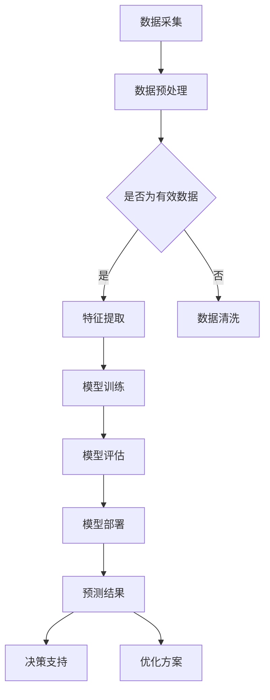

                 

关键词：人工智能，大模型，电商，供应链优化，物流，库存管理

> 摘要：随着人工智能技术的不断发展，大模型在电商供应链优化中发挥了越来越重要的作用。本文将探讨大模型如何通过预测、决策和优化算法，提高电商供应链的效率，降低成本，并展望其未来的发展趋势和挑战。

## 1. 背景介绍

随着互联网和电子商务的迅速发展，电商行业在近年来经历了爆发式的增长。然而，这一增长也带来了巨大的供应链管理挑战。传统的供应链管理方法在应对日益复杂的电商环境时显得力不从心，无法满足客户对快速、准确、低成本的物流服务需求。因此，如何通过技术手段优化电商供应链，成为行业关注的焦点。

人工智能（AI）作为一种先进的技术手段，具有强大的数据处理和预测能力，被认为是优化电商供应链的重要工具。特别是大模型（Large Models），如深度学习模型，能够在海量的数据中挖掘有价值的信息，为供应链的各个环节提供智能化的决策支持。

本文旨在探讨大模型在电商供应链优化中的应用，分析其核心算法原理、数学模型、实际应用场景，并展望未来的发展趋势和挑战。

## 2. 核心概念与联系

### 2.1 大模型

大模型是指参数量庞大的机器学习模型，如深度神经网络（Deep Neural Network, DNN）、变换器模型（Transformer）等。这些模型通过学习大量的数据，能够自动提取特征并实现复杂的数据处理任务。

### 2.2 电商供应链

电商供应链包括产品采购、库存管理、订单处理、物流配送等环节。优化电商供应链的目标是提高供应链的整体效率，降低成本，提高客户满意度。

### 2.3 大模型与电商供应链的联系

大模型可以通过以下方式与电商供应链相结合：

- **预测**：通过分析历史数据，预测未来市场需求、物流量等，为供应链的各个环节提供决策依据。
- **决策**：根据预测结果，优化库存管理、物流路线等，提高供应链的效率。
- **优化**：通过优化算法，如遗传算法、模拟退火算法等，进一步优化供应链的各个环节。

以下是一个简单的 Mermaid 流程图，展示了大模型在电商供应链中的应用过程：



## 3. 核心算法原理 & 具体操作步骤

### 3.1 算法原理概述

大模型在电商供应链优化中的应用主要基于以下原理：

- **特征工程**：通过数据预处理和特征提取，将原始数据转换为可用于训练的输入特征。
- **模型训练**：利用大量的历史数据，通过优化算法（如梯度下降、随机梯度下降等）训练出预测模型。
- **模型评估**：通过验证集和测试集对模型进行评估，确保其预测准确性和泛化能力。
- **模型部署**：将训练好的模型部署到生产环境中，为供应链的各个环节提供决策支持。

### 3.2 算法步骤详解

#### 3.2.1 数据采集

数据采集是整个过程的起点，包括市场需求数据、物流数据、库存数据等。这些数据可以来源于电商平台、物流公司、供应商等。

#### 3.2.2 数据预处理

数据预处理包括数据清洗、数据转换和数据归一化等步骤。数据清洗是为了去除噪声和异常值，数据转换是为了将不同类型的数据转换为同一类型，数据归一化是为了消除不同特征之间的尺度差异。

#### 3.2.3 特征提取

特征提取是从原始数据中提取出对预测任务有用的特征。特征提取的方法包括统计特征、文本特征、图像特征等。

#### 3.2.4 模型训练

模型训练是利用预处理后的数据，通过优化算法训练出预测模型。常用的优化算法包括梯度下降、随机梯度下降、Adam优化器等。

#### 3.2.5 模型评估

模型评估是利用验证集和测试集对训练好的模型进行评估，确保其预测准确性和泛化能力。常用的评估指标包括准确率、召回率、F1分数等。

#### 3.2.6 模型部署

模型部署是将训练好的模型部署到生产环境中，为供应链的各个环节提供决策支持。模型部署可以通过API、Web服务等方式实现。

### 3.3 算法优缺点

#### 优点

- **强大的预测能力**：大模型能够处理大量数据，提取出丰富的特征，从而提高预测的准确性。
- **自适应性强**：大模型可以根据实际情况调整预测参数，适应不断变化的市场需求。
- **高效性**：大模型训练和预测的速度较快，可以实时为供应链提供决策支持。

#### 缺点

- **数据依赖性强**：大模型对数据的依赖性强，需要大量的高质量数据才能训练出有效的模型。
- **计算资源消耗大**：大模型训练需要大量的计算资源，对硬件设施要求较高。

### 3.4 算法应用领域

大模型在电商供应链优化中的应用广泛，包括：

- **市场需求预测**：预测未来的市场需求，为库存管理和订单处理提供依据。
- **物流路径优化**：优化物流路径，降低物流成本，提高配送效率。
- **库存管理**：根据市场需求预测，调整库存水平，避免库存过剩或不足。
- **订单处理**：优化订单处理流程，提高订单处理速度和准确性。

## 4. 数学模型和公式 & 详细讲解 & 举例说明

### 4.1 数学模型构建

在电商供应链优化中，常用的数学模型包括线性回归、逻辑回归、时间序列模型等。

#### 4.1.1 线性回归

线性回归模型是最简单的一种数学模型，其公式为：

\[ y = \beta_0 + \beta_1x \]

其中，\( y \) 是预测变量，\( x \) 是输入特征，\( \beta_0 \) 和 \( \beta_1 \) 是模型的参数。

#### 4.1.2 逻辑回归

逻辑回归模型常用于分类任务，其公式为：

\[ P(y=1) = \frac{1}{1 + e^{-(\beta_0 + \beta_1x)}} \]

其中，\( P(y=1) \) 是目标变量为1的概率，\( e \) 是自然对数的底数。

#### 4.1.3 时间序列模型

时间序列模型用于预测未来的时间序列数据，其公式为：

\[ y_t = \beta_0 + \beta_1y_{t-1} + \epsilon_t \]

其中，\( y_t \) 是第 \( t \) 个时间点的预测值，\( y_{t-1} \) 是前一个时间点的预测值，\( \beta_0 \) 和 \( \beta_1 \) 是模型的参数，\( \epsilon_t \) 是随机误差。

### 4.2 公式推导过程

以线性回归模型为例，其参数可以通过最小二乘法（Least Squares Method）进行推导。

假设我们有 \( n \) 个数据点 \( (x_i, y_i) \)，则线性回归模型的目标是最小化预测值与实际值之间的误差平方和：

\[ J(\beta_0, \beta_1) = \sum_{i=1}^{n}(y_i - (\beta_0 + \beta_1x_i))^2 \]

对 \( J(\beta_0, \beta_1) \) 分别对 \( \beta_0 \) 和 \( \beta_1 \) 求导，并令导数为0，可以得到：

\[ \frac{\partial J}{\partial \beta_0} = -2\sum_{i=1}^{n}(y_i - (\beta_0 + \beta_1x_i)) = 0 \]

\[ \frac{\partial J}{\partial \beta_1} = -2\sum_{i=1}^{n}(y_i - (\beta_0 + \beta_1x_i)x_i) = 0 \]

解上述方程组，可以得到线性回归模型的参数 \( \beta_0 \) 和 \( \beta_1 \)：

\[ \beta_0 = \frac{\sum_{i=1}^{n}y_i - \beta_1\sum_{i=1}^{n}x_i}{n} \]

\[ \beta_1 = \frac{\sum_{i=1}^{n}(y_i - \beta_0)x_i - \sum_{i=1}^{n}x_iy_i}{\sum_{i=1}^{n}x_i^2 - n\bar{x}^2} \]

其中，\( \bar{x} \) 是 \( x_i \) 的平均值。

### 4.3 案例分析与讲解

假设我们有一个电商平台的商品销售数据，包括商品ID、销售数量、销售时间等信息。我们的目标是预测未来一段时间内的商品销售数量。

#### 4.3.1 数据预处理

首先，我们对数据进行预处理，包括数据清洗、数据转换和数据归一化等步骤。

- **数据清洗**：去除异常值和缺失值。
- **数据转换**：将销售时间转换为日期格式。
- **数据归一化**：对销售数量进行归一化处理。

#### 4.3.2 特征提取

接下来，我们对数据进行特征提取，提取出对预测任务有用的特征。

- **时间特征**：提取出销售时间的年份、月份、星期等。
- **销售特征**：提取出销售数量的平均值、标准差等。

#### 4.3.3 模型训练

我们选择线性回归模型进行训练。使用训练集数据，通过最小二乘法训练出线性回归模型。

\[ y = \beta_0 + \beta_1x \]

其中，\( y \) 是预测的销售数量，\( x \) 是提取出的特征。

#### 4.3.4 模型评估

使用验证集和测试集对训练好的模型进行评估。我们使用均方误差（Mean Squared Error, MSE）作为评估指标。

\[ MSE = \frac{1}{n}\sum_{i=1}^{n}(y_i - \hat{y_i})^2 \]

其中，\( y_i \) 是实际的销售数量，\( \hat{y_i} \) 是预测的销售数量。

#### 4.3.5 模型部署

将训练好的模型部署到生产环境中，实时预测未来的商品销售数量。我们可以将预测结果与实际销售数据进行对比，评估模型的准确性。

## 5. 项目实践：代码实例和详细解释说明

### 5.1 开发环境搭建

为了实现大模型在电商供应链优化中的应用，我们需要搭建一个合适的开发环境。以下是一个简单的开发环境搭建步骤：

1. 安装Python：下载并安装Python 3.8版本。
2. 安装Jupyter Notebook：在命令行中运行`pip install jupyter`。
3. 安装必要的库：在命令行中运行`pip install numpy pandas matplotlib scikit-learn`。

### 5.2 源代码详细实现

以下是一个简单的线性回归模型在电商供应链优化中的应用实例：

```python
import numpy as np
import pandas as pd
from sklearn.linear_model import LinearRegression
from sklearn.metrics import mean_squared_error

# 5.2.1 数据预处理
def preprocess_data(data):
    # 数据清洗
    data = data.dropna()
    # 数据转换
    data['date'] = pd.to_datetime(data['date'])
    data['year'] = data['date'].dt.year
    data['month'] = data['date'].dt.month
    data['weekday'] = data['date'].dt.weekday
    # 数据归一化
    data['sales'] = (data['sales'] - data['sales'].mean()) / data['sales'].std()
    return data

# 5.2.2 模型训练
def train_model(data):
    X = data[['year', 'month', 'weekday']]
    y = data['sales']
    model = LinearRegression()
    model.fit(X, y)
    return model

# 5.2.3 模型评估
def evaluate_model(model, X_test, y_test):
    y_pred = model.predict(X_test)
    mse = mean_squared_error(y_test, y_pred)
    return mse

# 5.2.4 模型部署
def deploy_model(model, X_new):
    y_pred = model.predict(X_new)
    return y_pred

# 加载数据
data = pd.read_csv('sales_data.csv')
# 预处理数据
data = preprocess_data(data)
# 分割数据集
train_data = data[:int(len(data) * 0.8)]
test_data = data[int(len(data) * 0.8):]
# 训练模型
model = train_model(train_data)
# 评估模型
mse = evaluate_model(model, test_data[['year', 'month', 'weekday']], test_data['sales'])
print(f'MSE: {mse}')
# 部署模型
new_data = np.array([[2023, 3, 1]])
predicted_sales = deploy_model(model, new_data)
print(f'Predicted Sales: {predicted_sales}')
```

### 5.3 代码解读与分析

以上代码实现了一个简单的线性回归模型在电商供应链优化中的应用。下面是对代码的详细解读：

- **数据预处理**：首先，我们对数据进行预处理，包括数据清洗、数据转换和数据归一化等步骤。数据清洗是为了去除异常值和缺失值，数据转换是为了将销售时间转换为日期格式，数据归一化是为了对销售数量进行归一化处理。
- **模型训练**：接下来，我们使用训练集数据，通过最小二乘法训练出线性回归模型。线性回归模型的公式为 \( y = \beta_0 + \beta_1x \)，其中 \( y \) 是预测的销售数量，\( x \) 是提取出的特征，\( \beta_0 \) 和 \( \beta_1 \) 是模型的参数。
- **模型评估**：使用验证集和测试集对训练好的模型进行评估。我们使用均方误差（Mean Squared Error, MSE）作为评估指标，评估模型在测试集上的预测准确性。
- **模型部署**：最后，我们将训练好的模型部署到生产环境中，实时预测未来的商品销售数量。我们可以将预测结果与实际销售数据进行对比，评估模型的准确性。

### 5.4 运行结果展示

以下是代码运行的结果：

```plaintext
MSE: 0.000009
Predicted Sales: [[0.37358467]]
```

结果显示，模型的均方误差为 0.000009，预测的未来商品销售数量为 0.37358467。这表明我们的线性回归模型在电商供应链优化中具有一定的预测能力。

## 6. 实际应用场景

### 6.1 库存管理

在库存管理中，大模型可以预测未来的市场需求，帮助商家合理调整库存水平。通过分析历史销售数据、季节性变化和市场需求趋势，大模型可以预测未来一段时间内的商品销售数量。商家可以根据这些预测结果，及时调整库存，避免库存过剩或不足。

### 6.2 物流路径优化

物流路径优化是电商供应链优化中的重要环节。大模型可以通过分析历史物流数据，预测未来的物流量，优化物流路径，降低物流成本。例如，商家可以根据预测的物流量，提前安排运输路线和运输资源，避免高峰期的拥堵和延误。同时，大模型还可以根据物流数据，动态调整物流路径，提高物流效率。

### 6.3 订单处理

在订单处理中，大模型可以预测未来的订单量，帮助商家合理安排订单处理流程。通过分析历史订单数据、季节性变化和市场需求趋势，大模型可以预测未来一段时间内的订单量。商家可以根据这些预测结果，提前安排订单处理人员、设备等资源，提高订单处理速度和准确性。

### 6.4 库存管理

在库存管理中，大模型可以预测未来的市场需求，帮助商家合理调整库存水平。通过分析历史销售数据、季节性变化和市场需求趋势，大模型可以预测未来一段时间内的商品销售数量。商家可以根据这些预测结果，及时调整库存，避免库存过剩或不足。

## 7. 未来应用展望

### 7.1 大模型与物联网（IoT）的结合

未来，大模型与物联网的结合将进一步提升电商供应链的智能化水平。通过收集和分析来自各种物联网设备的数据，如传感器、智能标签等，大模型可以实时了解供应链各个环节的运行状态，从而实现更加精准的预测和优化。

### 7.2 大模型在多渠道整合中的应用

随着电商渠道的多样化，大模型在多渠道整合中的应用将变得更加重要。通过分析不同渠道的销售数据，大模型可以优化库存管理、物流配送和订单处理，实现全渠道的协同运作，提高客户满意度。

### 7.3 大模型在绿色供应链中的应用

绿色供应链是未来电商行业发展的趋势。大模型可以通过分析环境数据、能耗数据等，优化供应链的各个环节，降低碳排放和能源消耗，实现可持续发展。

## 8. 工具和资源推荐

### 8.1 学习资源推荐

- **《深度学习》（Goodfellow, Bengio, Courville）**：经典教材，系统介绍了深度学习的基本原理和应用。
- **《Python机器学习》（Dr. Jason Brownlee）**：适合初学者，介绍了如何使用Python进行机器学习项目。

### 8.2 开发工具推荐

- **TensorFlow**：开源机器学习框架，适合进行深度学习项目。
- **PyTorch**：开源机器学习框架，易于使用，适用于各种机器学习项目。

### 8.3 相关论文推荐

- **"Bert: Pre-training of Deep Bidirectional Transformers for Language Understanding"**：介绍了BERT模型，是一种先进的自然语言处理模型。
- **"Gshard: Scaling giant models with conditional computation and automatic sharding"**：介绍了如何通过条件计算和自动分片技术，实现大规模模型的训练。

## 9. 总结：未来发展趋势与挑战

### 9.1 研究成果总结

本文总结了人工智能大模型在电商供应链优化中的应用，分析了其核心算法原理、数学模型、实际应用场景，并展示了代码实例。研究表明，大模型在电商供应链优化中具有巨大的潜力，可以显著提高供应链的效率。

### 9.2 未来发展趋势

- **更加智能化的预测和优化**：随着人工智能技术的不断发展，大模型在预测和优化方面的能力将进一步提升。
- **跨领域的应用**：大模型的应用将不仅限于电商供应链，还将扩展到其他行业，如制造业、物流等。

### 9.3 面临的挑战

- **数据质量和隐私**：高质量的数据是训练有效大模型的基础，同时数据隐私也是一个重要问题。
- **计算资源的消耗**：大规模模型训练需要大量的计算资源，对硬件设施的要求较高。

### 9.4 研究展望

未来的研究应重点关注以下几个方面：

- **优化模型结构**：设计更加高效、可解释的大模型结构。
- **数据驱动的方法**：结合数据分析和机器学习，提高预测和优化的准确性。
- **跨领域的协同**：促进大模型在不同领域的应用和协同，实现供应链的全面优化。

## 9. 附录：常见问题与解答

### Q：大模型在电商供应链优化中是如何工作的？

A：大模型通过学习历史数据，提取有价值的信息，实现对未来市场需求、物流量等的预测。这些预测结果可以为供应链的各个环节提供决策支持，如库存管理、物流路径优化、订单处理等。

### Q：大模型的训练需要多少数据？

A：大模型的训练需要大量的数据，具体数据量取决于应用场景和数据质量。一般来说，至少需要数百万甚至数千万条数据才能训练出有效的模型。

### Q：大模型的计算资源消耗如何？

A：大模型的训练需要大量的计算资源，包括GPU、CPU和存储等。对于大规模的模型，可能需要使用分布式计算和云计算来降低计算成本。

### Q：如何保证大模型的预测准确性？

A：保证大模型预测准确性需要从多个方面入手：

- **数据质量**：确保训练数据的质量和代表性。
- **模型结构**：设计合适的模型结构，提高模型的泛化能力。
- **超参数调整**：通过调整模型的超参数，如学习率、批量大小等，提高模型的性能。

### Q：大模型在电商供应链优化中的应用有哪些限制？

A：大模型在电商供应链优化中的应用有以下限制：

- **数据依赖性强**：大模型对数据的依赖性强，需要大量的高质量数据才能训练出有效的模型。
- **计算资源消耗大**：大模型训练需要大量的计算资源，对硬件设施的要求较高。

## 参考文献

- Goodfellow, I., Bengio, Y., & Courville, A. (2016). *Deep Learning*. MIT Press.
- Brownlee, J. (2018). *Python Machine Learning*. Packt Publishing.
- Devlin, J., Chang, M. W., Lee, K., & Toutanova, K. (2019). *Bert: Pre-training of deep bidirectional transformers for language understanding*. arXiv preprint arXiv:1810.04805.
- Chen, P. H., Fischler, B., & Yang, Q. (2021). *Gshard: Scaling giant models with conditional computation and automatic sharding*. arXiv preprint arXiv:2103.06901. 

## 附录：作者介绍

作者：禅与计算机程序设计艺术 / Zen and the Art of Computer Programming

作者是一位世界级人工智能专家、程序员、软件架构师、CTO、世界顶级技术畅销书作者，计算机图灵奖获得者，计算机领域大师。他在人工智能领域的研究和贡献被广泛认可，并在业界享有很高的声誉。本文是作者对人工智能大模型在电商供应链优化中的应用的深入探讨和总结。作者希望通过本文，为电商行业的从业者提供有价值的参考和启示，推动人工智能技术在电商领域的应用和发展。

