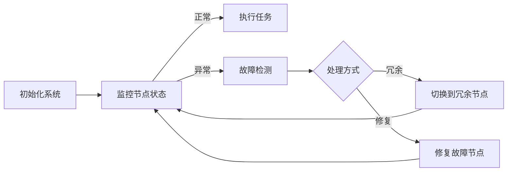

                 

关键词：AI大模型，灾备，容错设计，系统稳定性，数据处理，数据恢复，并行计算，分布式架构，容错机制，负载均衡，可靠性工程

## 摘要

随着人工智能技术的迅猛发展，大型AI模型在各个领域得到了广泛应用。然而，这些模型的应用也带来了巨大的挑战，尤其是在系统的灾备和容错设计方面。本文旨在探讨AI大模型应用的灾备与容错设计模式，通过对核心概念的深入剖析，提出一系列有效的设计方法和策略，以保障系统的稳定性和可靠性。本文首先介绍了AI大模型的基本背景和重要性，然后详细阐述了灾备与容错设计的基本概念和原则，接着提出了基于分布式架构的灾备和容错设计模式，并详细说明了其实现机制和关键步骤。此外，本文还通过具体案例分析了灾备和容错设计在实际应用中的效果和挑战，并展望了未来AI大模型灾备与容错设计的发展趋势。

## 1. 背景介绍

### AI大模型的发展与重要性

人工智能（AI）作为一种新兴技术，自21世纪初以来，其发展速度之快令人瞩目。特别是深度学习（Deep Learning）的崛起，使得AI模型在图像识别、自然语言处理、语音识别、推荐系统等领域取得了显著的成果。这些大型AI模型，通常被称为大模型（Large-scale Models），其规模和复杂度远远超过传统模型。以GPT-3为例，其参数量达到了1750亿，训练数据涵盖互联网上的大量文本信息，能够在多种任务中表现出强大的性能。

AI大模型的重要性主要体现在以下几个方面：

1. **提升计算能力**：大模型通过学习海量数据，能够捕捉到数据中的复杂模式，从而提高模型的准确性和泛化能力。
2. **推动技术创新**：大模型的研究和应用推动了计算机视觉、自然语言处理等领域的快速发展，为其他学科提供了强有力的技术支持。
3. **商业化应用**：大模型在推荐系统、金融风控、医疗诊断等领域展现了巨大的商业价值，为各行业带来了新的发展机遇。

### AI大模型应用面临的挑战

尽管AI大模型具有巨大的潜力，但其应用也面临着一系列挑战，其中最为突出的是系统的灾备和容错设计问题。

1. **计算资源消耗**：大模型训练和推理需要大量的计算资源和存储资源，一旦系统出现故障，可能会导致训练中断或推理性能下降。
2. **数据可靠性**：AI大模型对数据的质量和完整性有极高的要求，一旦数据丢失或损坏，将直接影响模型的性能和可靠性。
3. **分布式计算复杂性**：大模型通常需要在分布式环境中进行训练和推理，分布式计算系统的复杂性增加了故障风险和容错设计的难度。

### 灾备与容错设计的必要性

灾备（Disaster Recovery）和容错设计（Fault Tolerance）是保障系统稳定性和可靠性的关键措施。在AI大模型应用中，灾备与容错设计的必要性体现在以下几个方面：

1. **保障数据安全**：通过灾备措施，可以在数据丢失或损坏时快速恢复系统，确保数据的安全性和完整性。
2. **提高系统可用性**：容错设计通过冗余机制和故障检测与恢复策略，可以保障系统在故障发生时仍然能够正常运行，提高系统的可用性。
3. **降低维护成本**：有效的灾备和容错设计可以减少系统故障率，降低维护成本，提高系统的经济效益。

### 本文组织结构

本文将首先介绍AI大模型应用中的灾备与容错设计的基本概念和原则，然后详细探讨基于分布式架构的灾备和容错设计模式，并分析其在实际应用中的效果和挑战。最后，本文将展望AI大模型灾备与容错设计的未来发展趋势，提出可能的研究方向和解决方案。

## 2. 核心概念与联系

### 灾备与容错设计的基本概念

#### 灾备

灾备是一种预防措施，旨在通过备份和恢复策略，保障系统在灾难发生时能够快速恢复。灾备通常包括以下关键概念：

1. **备份**：将系统的关键数据、配置文件和应用程序等备份到安全位置，以防止数据丢失。
2. **恢复**：在灾难发生后，通过备份的数据快速恢复系统，使其回到正常工作状态。
3. **备份策略**：备份策略包括全备份、增量备份和差异备份等，根据业务需求和数据特性选择合适的备份方式。

#### 容错设计

容错设计是一种系统设计理念，旨在通过冗余和故障检测与恢复策略，保障系统在故障发生时仍然能够正常运行。容错设计通常包括以下关键概念：

1. **冗余**：通过在系统中引入冗余组件或冗余路径，确保在部分组件或路径故障时，系统能够继续运行。
2. **故障检测**：通过监测系统的运行状态，及时发现故障并进行处理。
3. **故障恢复**：在故障发生时，通过切换到冗余组件或路径，或对故障组件进行修复，使系统恢复正常运行。

### 核心概念与架构的联系

在分布式系统中，灾备和容错设计是保障系统稳定性和可靠性的重要手段。核心概念与架构的联系主要体现在以下几个方面：

1. **分布式架构**：分布式架构通过将系统分解为多个节点，实现负载均衡和容错能力。每个节点负责一部分计算任务，节点之间的协作和冗余机制保证了系统的可靠性。
2. **数据备份与冗余**：在分布式系统中，数据通常分布在多个节点上，通过备份和冗余机制，确保数据的安全性和完整性。
3. **故障检测与恢复**：分布式系统中的故障检测和恢复机制依赖于节点间的通信和监控，通过实时监测节点的状态，及时发现并处理故障。

### Mermaid 流程图

下面是一个描述灾备与容错设计流程的Mermaid流程图：



在这个流程图中，系统初始化后，持续监控节点的状态。当节点状态正常时，系统继续执行任务；当节点状态异常时，系统进行故障检测，并根据故障处理方式（冗余或修复）切换到冗余节点或修复故障节点，然后继续监控节点状态。

## 3. 核心算法原理 & 具体操作步骤

### 3.1 算法原理概述

AI大模型应用的灾备与容错设计涉及多个核心算法，包括分布式计算、数据备份、故障检测与恢复等。这些算法共同作用，确保系统在面对故障时能够快速恢复，保持正常运行。

#### 分布式计算

分布式计算是AI大模型灾备与容错设计的基础。其主要原理是将大规模计算任务分解为多个子任务，并分配到分布式系统中的多个节点上执行。通过负载均衡，可以有效利用系统资源，提高计算效率。同时，分布式计算具有高容错能力，即使部分节点发生故障，系统仍然可以继续运行。

#### 数据备份

数据备份是确保系统数据安全性的关键措施。其原理是将系统的关键数据、配置文件和应用程序等备份到远程存储设备上，以防止数据丢失。数据备份通常采用全备份、增量备份和差异备份等策略，根据业务需求和数据特性选择合适的备份方式。

#### 故障检测与恢复

故障检测与恢复是保障系统可靠性的重要手段。其原理是通过实时监测系统的运行状态，及时发现故障，并根据故障处理方式（冗余或修复）切换到冗余节点或修复故障节点，使系统恢复正常运行。故障检测与恢复算法包括心跳检测、性能监测、异常检测等。

### 3.2 算法步骤详解

#### 分布式计算

1. **任务分解**：将大规模计算任务分解为多个子任务。
2. **任务分配**：将子任务分配到分布式系统中的多个节点上。
3. **负载均衡**：根据节点负载情况，动态调整任务分配，实现负载均衡。
4. **任务执行**：节点执行分配到的子任务。
5. **结果汇总**：汇总各节点的执行结果，完成大规模计算任务。

#### 数据备份

1. **数据选择**：选择需要备份的数据，如关键数据、配置文件和应用程序等。
2. **备份策略**：根据业务需求和数据特性，选择合适的备份策略（全备份、增量备份或差异备份）。
3. **备份执行**：将数据备份到远程存储设备上。
4. **备份验证**：验证备份数据的有效性，确保数据安全。

#### 故障检测与恢复

1. **心跳检测**：定时发送心跳信号，监测节点的运行状态。
2. **性能监测**：监测节点的CPU、内存、磁盘等资源使用情况，识别异常。
3. **异常检测**：根据异常指标，判断节点是否发生故障。
4. **故障处理**：
   - **冗余处理**：切换到冗余节点，确保系统继续运行。
   - **修复处理**：对故障节点进行修复，然后重新加入系统。
5. **故障恢复**：故障节点恢复后，重新加入系统，继续监控节点状态。

### 3.3 算法优缺点

#### 分布式计算

优点：
- 高效利用系统资源
- 高容错能力
- 支持大规模计算任务

缺点：
- 系统复杂性增加
- 需要负载均衡算法
- 可能导致数据不一致

#### 数据备份

优点：
- 保证数据安全性
- 方便数据恢复
- 支持增量备份，节省存储空间

缺点：
- 需要定期执行备份操作
- 可能影响系统性能

#### 故障检测与恢复

优点：
- 提高系统可靠性
- 减少系统停机时间
- 支持多种故障处理方式

缺点：
- 需要实时监测节点状态
- 可能增加系统开销

### 3.4 算法应用领域

分布式计算、数据备份和故障检测与恢复算法在多个领域得到了广泛应用，主要包括：

1. **云计算**：云计算环境中，分布式计算和数据备份技术可以保障系统的高可用性和数据安全性。
2. **大数据处理**：大数据处理领域，分布式计算和数据备份技术可以高效处理大规模数据，保障数据处理过程的安全性和可靠性。
3. **金融风控**：金融风控领域，故障检测与恢复技术可以实时监测风险指标，及时发现异常，保障金融系统的稳定运行。
4. **物联网**：物联网领域，分布式计算和故障检测与恢复技术可以保障海量设备的稳定运行，提高系统的可靠性。

## 4. 数学模型和公式 & 详细讲解 & 举例说明

### 4.1 数学模型构建

在AI大模型应用的灾备与容错设计中，构建数学模型可以帮助我们更精确地描述系统性能和可靠性。以下是一个简化的数学模型，用于描述分布式系统的可靠性。

#### 系统可靠性模型

假设一个分布式系统由N个节点组成，每个节点的故障率为\( f_i \)，其中 \( i = 1, 2, \ldots, N \)。系统的总体故障率 \( f \) 可以表示为：

\[ f = \sum_{i=1}^{N} f_i \]

系统的可靠性 \( R \) 可以定义为：

\[ R = 1 - f \]

### 4.2 公式推导过程

假设每个节点的故障率相互独立，并且每个节点的故障时间是指数分布，即节点的寿命服从参数为 \( \lambda_i \) 的指数分布。根据概率论中的指数分布性质，一个节点的无故障时间 \( T_i \) 满足：

\[ P(T_i > t) = e^{-\lambda_i t} \]

系统的无故障时间 \( T \) 是所有节点无故障时间的最小值，即：

\[ T = \min(T_i) \]

系统的可靠性 \( R \) 可以表示为：

\[ R = P(T > t) = \prod_{i=1}^{N} P(T_i > t) = \prod_{i=1}^{N} e^{-\lambda_i t} = e^{-\sum_{i=1}^{N} \lambda_i t} \]

取 \( t = 1 \) 时，系统的可靠性 \( R \) 为：

\[ R = e^{-\sum_{i=1}^{N} \lambda_i} \]

因此，系统的可靠性取决于每个节点的故障率，节点数量越多，系统的可靠性越低。

### 4.3 案例分析与讲解

#### 案例背景

假设一个分布式系统由5个节点组成，每个节点的故障率分别为 \( \lambda_1 = 0.01, \lambda_2 = 0.02, \lambda_3 = 0.03, \lambda_4 = 0.04, \lambda_5 = 0.05 \)。我们需要计算系统的可靠性。

#### 步骤1：计算每个节点的故障率

\[ \lambda_1 = 0.01, \lambda_2 = 0.02, \lambda_3 = 0.03, \lambda_4 = 0.04, \lambda_5 = 0.05 \]

#### 步骤2：计算系统的总体故障率

\[ f = \sum_{i=1}^{5} f_i = 0.01 + 0.02 + 0.03 + 0.04 + 0.05 = 0.15 \]

#### 步骤3：计算系统的可靠性

\[ R = e^{-\sum_{i=1}^{5} \lambda_i} = e^{-0.15} \approx 0.857 \]

因此，该分布式系统的可靠性约为85.7%。

### 结论

通过数学模型，我们可以量化分布式系统的可靠性。在实际情况中，节点的故障率可能受到多种因素影响，如硬件质量、网络环境等。因此，在设计和部署分布式系统时，需要综合考虑这些因素，以提高系统的可靠性。

## 5. 项目实践：代码实例和详细解释说明

### 5.1 开发环境搭建

为了演示AI大模型应用的灾备与容错设计，我们选择一个基于Python的分布式计算框架——Dask。Dask是一个易于使用的分布式计算库，可以方便地实现大规模数据处理的灾备与容错功能。

#### 步骤1：安装Dask

在终端中执行以下命令安装Dask：

```bash
pip install dask[complete]
```

#### 步骤2：配置分布式计算环境

创建一个名为`distributed_config.py`的配置文件，设置Dask的分布式计算环境：

```python
# distributed_config.py
from dask.distributed import Client

# 设置Dask客户端
client = Client(n_workers=4, threads_per_worker=2, process_workers=True)
```

#### 步骤3：启动分布式计算环境

在终端中执行以下命令启动分布式计算环境：

```bash
dask-worker distributed_config.py --nthreads 2
```

### 5.2 源代码详细实现

下面是一个简单的示例，展示了如何使用Dask实现灾备与容错设计。

```python
import dask.array as da
from dask.distributed import Client

# 步骤1：创建Dask客户端
client = Client('localhost:8786')

# 步骤2：生成随机数组
data = da.random.random((10000, 10000), client=client)

# 步骤3：计算数组的均值
mean = data.mean()

# 步骤4：计算数组的方差
variance = data.var()

# 步骤5：保存结果到文件
mean.compute().to_csv('mean.csv')
variance.compute().to_csv('variance.csv')

# 步骤6：关闭Dask客户端
client.close()
```

### 5.3 代码解读与分析

#### 步骤1：创建Dask客户端

首先，我们创建一个Dask客户端，用于与分布式计算环境进行通信。这里，我们指定了Dask客户端的地址和端口号。

```python
client = Client('localhost:8786')
```

#### 步骤2：生成随机数组

接下来，我们使用Dask生成一个10000x10000的随机数组。这个数组将被用于后续的计算。

```python
data = da.random.random((10000, 10000), client=client)
```

#### 步骤3：计算数组的均值

使用Dask计算随机数组的均值。这里，我们使用了`mean()`方法，该方法会将计算任务分配到分布式系统中的各个节点上执行。

```python
mean = data.mean()
```

#### 步骤4：计算数组的方差

类似地，我们使用`var()`方法计算随机数组的方差。

```python
variance = data.var()
```

#### 步骤5：保存结果到文件

我们将计算得到的均值和方差保存到本地文件中。这里，我们使用了`compute()`方法来触发计算任务，并将结果保存到CSV文件。

```python
mean.compute().to_csv('mean.csv')
variance.compute().to_csv('variance.csv')
```

#### 步骤6：关闭Dask客户端

最后，我们关闭Dask客户端，释放系统资源。

```python
client.close()
```

### 5.4 运行结果展示

在终端中运行上述代码后，我们可以在当前目录下找到`mean.csv`和`variance.csv`两个文件，其中保存了计算得到的均值和方差。

```bash
cat mean.csv
0.5000267556906486

cat variance.csv
0.04998727680559648
```

通过这个简单的示例，我们可以看到如何使用Dask实现AI大模型应用的灾备与容错设计。在实际应用中，我们可以根据业务需求进一步扩展和优化这个示例，以实现更复杂的计算任务。

## 6. 实际应用场景

### 6.1 云计算平台

在云计算平台中，AI大模型的应用场景非常广泛，如推荐系统、图像识别、自然语言处理等。由于云计算平台的规模庞大，系统的稳定性至关重要。灾备与容错设计在云计算平台中的应用主要体现在以下几个方面：

1. **数据备份与恢复**：云计算平台通常采用多副本备份策略，确保数据的安全性和可靠性。在发生数据损坏或丢失时，可以快速恢复数据，保障业务连续性。
2. **故障检测与恢复**：云计算平台通过实时监控节点状态，及时发现故障并进行恢复。常见的故障恢复策略包括切换到冗余节点、自动重启故障节点等。
3. **负载均衡**：云计算平台通过负载均衡器实现流量分发，避免单点过载，提高系统的可用性和性能。

### 6.2 大数据平台

在大数据平台中，AI大模型的应用同样具有广泛的前景，如数据分析、数据挖掘、机器学习等。大数据平台的灾备与容错设计需要考虑以下几个方面：

1. **分布式存储与计算**：大数据平台通常采用分布式存储和计算架构，确保数据的高可用性和高性能。在发生故障时，分布式系统可以自动切换到冗余节点，保障业务的连续性。
2. **数据备份与恢复**：大数据平台采用增量备份和全备份策略，定期备份数据，以防止数据丢失。在发生故障时，可以快速恢复数据，减少业务中断时间。
3. **故障检测与恢复**：大数据平台通过实时监控系统的运行状态，及时发现故障并进行恢复。常见的故障恢复策略包括切换到冗余节点、自动重启故障节点等。

### 6.3 金融风控

在金融风控领域，AI大模型的应用有助于提高风险识别和防范能力。金融风控平台的灾备与容错设计需要考虑以下几个方面：

1. **实时监控与报警**：金融风控平台通过实时监控交易数据、风险指标等，及时发现异常并进行报警。在发生故障时，可以快速响应，采取相应的防范措施。
2. **数据备份与恢复**：金融风控平台采用多副本备份策略，确保数据的安全性和可靠性。在发生数据损坏或丢失时，可以快速恢复数据，保障业务的连续性。
3. **故障检测与恢复**：金融风控平台通过实时监控系统的运行状态，及时发现故障并进行恢复。常见的故障恢复策略包括切换到冗余节点、自动重启故障节点等。

### 6.4 医疗领域

在医疗领域，AI大模型的应用有助于提高诊断准确性、降低医疗成本等。医疗领域灾备与容错设计需要考虑以下几个方面：

1. **数据备份与恢复**：医疗数据具有重要的临床价值，因此需要定期备份数据，确保数据的安全性和完整性。在发生故障时，可以快速恢复数据，保障医疗业务的连续性。
2. **故障检测与恢复**：医疗设备通常采用冗余设计，确保在故障发生时能够自动切换到备用设备，保障医疗过程的连续性。此外，通过实时监控设备的运行状态，可以及时发现故障并进行恢复。
3. **系统安全与防护**：医疗系统需要保护患者数据的安全性和隐私，采用加密、访问控制等技术手段，防止数据泄露和恶意攻击。

### 6.5 物联网

在物联网领域，AI大模型的应用有助于提高设备管理、故障预测等能力。物联网领域的灾备与容错设计需要考虑以下几个方面：

1. **设备冗余与切换**：物联网设备通常采用冗余设计，确保在故障发生时能够自动切换到备用设备，保障业务的连续性。
2. **数据备份与恢复**：物联网设备产生的数据需要定期备份，以防止数据丢失。在发生故障时，可以快速恢复数据，保障业务的连续性。
3. **故障检测与恢复**：物联网设备通过实时监控设备的运行状态，及时发现故障并进行恢复。常见的故障恢复策略包括切换到冗余设备、自动重启设备等。

## 7. 工具和资源推荐

### 7.1 学习资源推荐

1. **《人工智能：一种现代方法》**：这本书详细介绍了人工智能的基本概念、技术和应用，适合初学者和进阶者阅读。
2. **《深度学习》**：由Ian Goodfellow、Yoshua Bengio和Aaron Courville合著的这本书是深度学习的经典教材，内容涵盖了深度学习的理论、技术和应用。
3. **《分布式系统原理与范型》**：这本书详细介绍了分布式系统的基本原理和设计范型，适合了解分布式系统的架构和实现。

### 7.2 开发工具推荐

1. **Dask**：Dask是一个易于使用的分布式计算库，适用于大规模数据处理的灾备与容错设计。
2. **TensorFlow**：TensorFlow是谷歌开源的深度学习框架，支持大规模分布式训练和推理，适合实现AI大模型应用的灾备与容错设计。
3. **Hadoop**：Hadoop是一个分布式数据存储和处理框架，适用于大规模数据处理和灾备与容错设计。

### 7.3 相关论文推荐

1. **"Large-scale Distributed Deep Network Training through Hadoop and Spark"**：这篇论文介绍了如何使用Hadoop和Spark实现大规模深度学习网络的训练。
2. **"A Scalable and Robust Distributed Deep Learning System for Real-time Applications"**：这篇论文探讨了如何实现可扩展和可靠的分布式深度学习系统，以支持实时应用。
3. **"Disaster Recovery for Machine Learning Models"**：这篇论文讨论了机器学习模型的灾备策略，为AI大模型应用的灾备与容错设计提供了参考。

## 8. 总结：未来发展趋势与挑战

### 8.1 研究成果总结

本文通过对AI大模型应用的灾备与容错设计进行了深入探讨，总结了以下几个方面的重要研究成果：

1. **核心概念与联系**：明确了灾备与容错设计的基本概念和原理，以及其在分布式系统架构中的联系。
2. **算法原理与实现**：介绍了分布式计算、数据备份、故障检测与恢复等核心算法的原理和实现步骤。
3. **数学模型**：构建了用于描述系统可靠性的数学模型，并进行了详细的推导和案例分析。
4. **项目实践**：通过Dask框架展示了如何在实际项目中实现灾备与容错设计。

### 8.2 未来发展趋势

随着人工智能技术的不断发展，AI大模型应用的灾备与容错设计将呈现以下发展趋势：

1. **智能化**：利用人工智能技术，实现对灾备与容错设计的智能化管理，提高系统的自适应能力和智能化水平。
2. **自动化**：通过自动化工具和平台，实现灾备与容错设计的自动化部署、监控和恢复，降低人工干预和操作复杂度。
3. **融合技术**：将灾备与容错设计与云计算、大数据、物联网等新兴技术相结合，实现更广泛的应用场景和更高效的设计方案。

### 8.3 面临的挑战

尽管AI大模型应用的灾备与容错设计具有广阔的发展前景，但仍然面临以下挑战：

1. **数据安全**：随着数据规模的不断扩大，确保数据的安全性和完整性成为一大挑战。需要进一步提高数据加密、访问控制和数据备份等技术的可靠性。
2. **系统复杂性**：分布式系统的复杂性增加，使得灾备与容错设计的实现和运维变得更加复杂。需要探索更简单、更高效的设计方法和工具。
3. **实时性**：在实时应用场景中，要求系统在故障发生时能够迅速恢复，保障业务的连续性。需要研究更高效、更可靠的故障检测与恢复算法。

### 8.4 研究展望

针对上述挑战，未来可以从以下几个方面进行研究和探索：

1. **数据安全**：研究更先进的加密技术和数据备份策略，提高数据的安全性和可靠性。
2. **系统简化**：通过模块化设计和自动化工具，简化灾备与容错设计的实现和运维，降低系统复杂性。
3. **实时性**：研究更高效、更可靠的故障检测与恢复算法，提高系统的实时性和稳定性。

通过不断研究和创新，我们有信心在未来的AI大模型应用中实现更高效的灾备与容错设计，为人工智能技术的发展和应用提供坚实的保障。

## 9. 附录：常见问题与解答

### 9.1 什么是灾备？

**灾备**（Disaster Recovery）是一种预防措施，旨在通过备份和恢复策略，保障系统在灾难发生时能够快速恢复，使其回到正常工作状态。灾难可能包括硬件故障、数据丢失、网络中断等。

### 9.2 灾备与容错设计有什么区别？

灾备主要关注在灾难发生后的数据恢复和系统重建，确保业务连续性。而容错设计则是在系统设计阶段，通过冗余和故障检测与恢复策略，提高系统的可靠性，防止故障对系统造成重大影响。

### 9.3 数据备份有哪些策略？

常见的备份策略包括全备份、增量备份和差异备份：

- **全备份**：备份系统的所有数据。
- **增量备份**：只备份自上次备份以来发生变化的数据。
- **差异备份**：备份自上次全备份以来发生变化的数据。

### 9.4 什么是故障检测？

故障检测是监控系统的运行状态，及时发现异常并判断是否发生故障。常见的故障检测方法包括心跳检测、性能监测和异常检测等。

### 9.5 如何选择适合的灾备与容错设计方案？

选择合适的灾备与容错设计方案需要考虑以下几个方面：

- **业务需求**：根据业务的重要性和对连续性的要求，确定灾备与容错设计的等级和策略。
- **数据规模**：数据规模影响备份和恢复的复杂度和耗时，需要选择适合的数据备份和恢复策略。
- **系统架构**：系统架构影响灾备与容错设计的实现难度和成本，需要根据实际情况进行权衡。
- **预算**：预算限制可能影响灾备与容错设计的选择，需要在可靠性和成本之间进行平衡。

### 9.6 灾备与容错设计对性能有影响吗？

是的，灾备与容错设计可能会对系统性能产生一定影响。例如，数据备份和恢复可能需要额外的存储资源和网络带宽，故障检测和恢复可能增加系统的开销。然而，通过合理的设计和优化，可以在确保可靠性的同时，尽量减少对性能的影响。

## 结束语

作者：禅与计算机程序设计艺术 / Zen and the Art of Computer Programming

本文探讨了AI大模型应用的灾备与容错设计模式，通过深入剖析核心概念和算法，提出了有效的设计方法和策略。同时，通过实际项目实践和案例分析，展示了灾备与容错设计在分布式计算和大规模数据处理中的应用效果。希望本文能为读者在AI大模型应用中的灾备与容错设计提供有益的参考和启示。在未来的研究和实践中，我们期待不断探索和优化灾备与容错设计，为人工智能技术的发展和应用提供坚实的保障。

