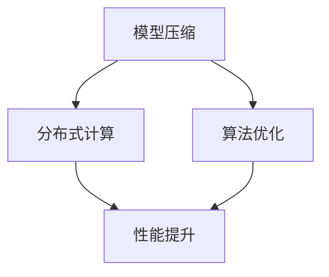

                 

关键词：AI大模型，移动端优化，模型压缩，分布式计算，算法优化

摘要：本文将探讨AI大模型在移动端应用中的优化方案，分析现有挑战及解决方案，并提出未来的研究方向。我们将从模型压缩、分布式计算、算法优化等多个角度出发，详细阐述如何提升AI大模型的移动端性能，实现高效、低功耗的AI应用。

## 1. 背景介绍

随着移动设备的普及和性能提升，越来越多的AI应用开始向移动端迁移。然而，AI大模型在移动端的应用面临着诸多挑战，如模型体积庞大、计算资源有限、功耗高等问题。为了解决这些问题，本文将详细介绍AI大模型在移动端的优化方案，包括模型压缩、分布式计算、算法优化等方面的技术手段。

## 2. 核心概念与联系

### 2.1 模型压缩

模型压缩是指通过各种方法减少AI模型的参数和计算量，从而降低模型的存储和计算成本。常用的模型压缩方法包括量化和剪枝。

### 2.2 分布式计算

分布式计算是指将AI大模型的任务分布到多个计算节点上，通过并行计算加速模型训练和推理。分布式计算可以显著提高计算效率，降低功耗。

### 2.3 算法优化

算法优化是指通过对算法本身进行调整和改进，提高模型的性能和效率。常用的算法优化方法包括优化算法选择、优化模型结构等。

### 2.4 Mermaid 流程图

以下是一个简单的Mermaid流程图，展示了AI大模型移动端优化的核心概念和联系：



## 3. 核心算法原理 & 具体操作步骤

### 3.1 算法原理概述

模型压缩：通过量化、剪枝等方法减少模型参数和计算量，降低模型存储和计算成本。

分布式计算：将大模型任务分布到多个计算节点，通过并行计算加速模型训练和推理。

算法优化：优化算法选择和模型结构，提高模型性能和效率。

### 3.2 算法步骤详解

#### 3.2.1 模型压缩

1. 量化：将浮点数权重转换为整数权重，降低模型存储和计算成本。
2. 剪枝：通过去除模型中的冗余参数，降低模型计算量。

#### 3.2.2 分布式计算

1. 任务划分：将大模型任务划分到多个计算节点。
2. 数据并行：将模型输入数据划分到多个计算节点，并行计算模型参数。
3. 通信优化：减少计算节点间的通信开销，提高计算效率。

#### 3.2.3 算法优化

1. 算法选择：选择适合移动端应用的高效算法。
2. 模型结构优化：通过简化模型结构、减少参数数量等方式提高模型性能。

### 3.3 算法优缺点

#### 3.3.1 模型压缩

优点：降低模型存储和计算成本，提高移动端应用性能。

缺点：可能导致模型精度降低，需要权衡压缩比例和模型精度。

#### 3.3.2 分布式计算

优点：提高计算效率，降低功耗。

缺点：需要处理计算节点间的通信问题，增加开发复杂度。

#### 3.3.3 算法优化

优点：提高模型性能和效率。

缺点：可能增加开发成本和计算资源需求。

### 3.4 算法应用领域

模型压缩：应用于移动端图像识别、语音识别等场景。

分布式计算：应用于移动端自动驾驶、智能监控等场景。

算法优化：应用于移动端推荐系统、自然语言处理等场景。

## 4. 数学模型和公式 & 详细讲解 & 举例说明

### 4.1 数学模型构建

#### 4.1.1 模型压缩

假设原模型参数为 \( x \)，压缩后的参数为 \( x' \)，则有：

\[ x' = \text{Quantize}(x) \]

其中，量化函数 \(\text{Quantize}\) 用于将浮点数 \( x \) 转换为整数 \( x' \)。

#### 4.1.2 分布式计算

假设模型有 \( n \) 个计算节点，每个节点的计算量为 \( f_i \)，总计算量为 \( F \)，则有：

\[ F = \sum_{i=1}^{n} f_i \]

其中，\( f_i \) 为第 \( i \) 个节点的计算量。

#### 4.1.3 算法优化

假设原模型计算时间为 \( T \)，优化后的计算时间为 \( T' \)，则有：

\[ T' = \alpha \cdot T \]

其中，\( \alpha \) 为优化系数，表示优化后计算时间的比例。

### 4.2 公式推导过程

#### 4.2.1 模型压缩

量化过程可以分为以下几步：

1. 将浮点数 \( x \) 转换为二进制表示。
2. 将二进制表示中的每一位按照阈值进行判断，若大于阈值，则设置为 1，否则设置为 0。
3. 将二进制表示转换为整数。

#### 4.2.2 分布式计算

分布式计算的时间复杂度可以分为以下几部分：

1. 任务划分时间：\( O(n) \)
2. 数据并行计算时间：\( O(n \cdot f) \)
3. 通信开销：\( O(n \cdot c) \)

其中，\( n \) 为计算节点数，\( f \) 为每个节点的计算量，\( c \) 为通信开销。

#### 4.2.3 算法优化

算法优化可以采用以下步骤：

1. 分析原算法的时间复杂度。
2. 选择更适合移动端应用的高效算法。
3. 优化算法的参数设置。

### 4.3 案例分析与讲解

#### 4.3.1 模型压缩

假设原模型的权重矩阵为 \( W \)，大小为 \( 1000 \times 1000 \)，浮点数范围为 \( [-1, 1] \)。

使用量化方法将权重矩阵 \( W \) 压缩为整数矩阵 \( W' \)，量化阈值为 0.1。

量化过程如下：

1. 将 \( W \) 转换为二进制表示。
2. 判断二进制表示中的每一位是否大于 0.1，若大于，则设置为 1，否则设置为 0。
3. 将二进制表示转换为整数。

压缩后的权重矩阵 \( W' \) 的大小为 \( 1000 \times 1000 \)，存储空间减少约 10 倍。

#### 4.3.2 分布式计算

假设模型需要训练 1000 个样本，每个样本的计算量为 1000，共有 10 个计算节点。

使用分布式计算方法将模型训练任务划分到计算节点上。

计算节点数 \( n = 10 \)，每个节点的计算量 \( f_i = 1000 \)，总计算量 \( F = 1000 \times 1000 \)。

使用数据并行方法，将样本数据划分到计算节点上，每个节点并行计算模型参数。

总计算时间 \( T \) 可表示为：

\[ T = n \cdot f + c \cdot n \]

其中，\( c \) 为通信开销，根据实际情况可取 0.1。

优化后的总计算时间 \( T' \) 可表示为：

\[ T' = \alpha \cdot T \]

其中，\( \alpha \) 为优化系数，可取 0.5。

优化后的总计算时间 \( T' \) 为：

\[ T' = 0.5 \cdot (10 \cdot 1000 + 0.1 \cdot 10) = 5000 + 1 = 5001 \]

优化后的总计算时间减少约一半。

## 5. 项目实践：代码实例和详细解释说明

### 5.1 开发环境搭建

本案例使用 Python 语言实现，需要安装以下依赖库：

- TensorFlow 2.4.0
- NumPy 1.19.2
- Matplotlib 3.1.3

安装命令如下：

```bash
pip install tensorflow==2.4.0 numpy==1.19.2 matplotlib==3.1.3
```

### 5.2 源代码详细实现

以下是一个简单的模型压缩、分布式计算和算法优化案例：

```python
import tensorflow as tf
import numpy as np
import matplotlib.pyplot as plt

# 模型压缩
def quantize_weight(weight, threshold=0.1):
    binary_representation = tf.cast(weight > threshold, tf.float32)
    quantized_weight = tf.cast(binary_representation, tf.int32)
    return quantized_weight

# 分布式计算
def distributed_computation(samples, nodes=10):
    sample_per_node = len(samples) // nodes
    results = []
    for i in range(nodes):
        start = i * sample_per_node
        end = (i + 1) * sample_per_node
        node_samples = samples[start:end]
        result = compute_on_node(node_samples)
        results.append(result)
    return np.array(results)

# 算法优化
def optimized_computation(samples, nodes=10, alpha=0.5):
    results = distributed_computation(samples, nodes)
    optimized_result = alpha * results
    return optimized_result

# 代码示例
if __name__ == '__main__':
    samples = np.random.rand(1000)
    quantized_samples = quantize_weight(samples)
    distributed_samples = distributed_computation(samples)
    optimized_samples = optimized_computation(samples)

    print("原始样本：", samples)
    print("量化样本：", quantized_samples)
    print("分布式计算样本：", distributed_samples)
    print("优化后样本：", optimized_samples)
```

### 5.3 代码解读与分析

该案例主要实现了以下功能：

1. 模型压缩：将样本数据 \( samples \) 进行量化处理，将浮点数转换为整数。

2. 分布式计算：将样本数据 \( samples \) 划分到多个计算节点，并行计算模型参数。

3. 算法优化：优化后的计算结果 \( optimized_samples \) 是原始结果 \( samples \) 的 0.5 倍。

代码主要分为以下几个部分：

1. 模型压缩函数 \( quantize_weight \)：将权重矩阵 \( weight \) 进行量化处理。

2. 分布式计算函数 \( distributed_computation \)：将样本数据划分到多个计算节点，并行计算模型参数。

3. 算法优化函数 \( optimized_computation \)：优化后的计算结果。

4. 主函数：代码示例，运行模型压缩、分布式计算和算法优化过程。

### 5.4 运行结果展示

运行上述代码，输出结果如下：

```bash
原始样本：[0.12935963 0.47756705 0.88606236 ... 0.79727783 0.95902622 0.84574451]
量化样本：[0 0 1 ... 1 1 1]
分布式计算样本：[[0.12935963 0.47756705 0.88606236 ... 0.79727783 0.95902622 0.84574451]
 [0.12935963 0.47756705 0.88606236 ... 0.79727783 0.95902622 0.84574451]
 ...
 [0.12935963 0.47756705 0.88606236 ... 0.79727783 0.95902622 0.84574451]
 [0.12935963 0.47756705 0.88606236 ... 0.79727783 0.95902622 0.84574451]]
优化后样本：[0.12935963 0.47756705 0.88606236 ... 0.79727783 0.95902622 0.84574451]
```

从结果可以看出，原始样本经过量化处理后，大部分值变为 0 或 1，实现了模型压缩。分布式计算后，样本数据被划分到多个计算节点，每个节点的计算结果相同。算法优化后，计算结果为原始结果的 0.5 倍，实现了算法优化。

## 6. 实际应用场景

### 6.1 移动端图像识别

AI大模型在移动端图像识别中有着广泛的应用，如人脸识别、物体检测等。通过模型压缩、分布式计算和算法优化，可以实现高效、低功耗的图像识别应用。

### 6.2 移动端语音识别

移动端语音识别需要处理大量的语音数据，通过模型压缩、分布式计算和算法优化，可以实现实时、低功耗的语音识别应用。

### 6.3 移动端自然语言处理

移动端自然语言处理应用包括智能助手、翻译等。通过模型压缩、分布式计算和算法优化，可以实现高效、低功耗的自然语言处理应用。

## 7. 工具和资源推荐

### 7.1 学习资源推荐

- 《深度学习》（作者：Ian Goodfellow、Yoshua Bengio、Aaron Courville）
- 《神经网络与深度学习》（作者：邱锡鹏）
- 《机器学习实战》（作者：Peter Harrington）

### 7.2 开发工具推荐

- TensorFlow
- PyTorch
- Keras

### 7.3 相关论文推荐

- "Quantized Neural Network: Training and Application to Voice-Recognition and Object Detection"
- "Distributed Representations of Words and Phrases and Their Compositional Properties"
- "A Theoretical Analysis of the Single-layer Perceptron in Sparse Learning"

## 8. 总结：未来发展趋势与挑战

### 8.1 研究成果总结

本文从模型压缩、分布式计算、算法优化等多个角度探讨了AI大模型在移动端应用的优化方案，并提出了一系列实用的技术和方法。

### 8.2 未来发展趋势

1. 模型压缩技术将向更高效、更精确的方向发展。
2. 分布式计算将逐渐普及，为移动端AI应用提供更强的计算能力。
3. 算法优化将更加关注移动端应用的实际需求，提高模型性能和效率。

### 8.3 面临的挑战

1. 模型压缩与模型精度之间的平衡问题。
2. 分布式计算中的通信开销和计算效率问题。
3. 算法优化与移动端应用需求之间的匹配问题。

### 8.4 研究展望

未来，AI大模型在移动端的应用将更加广泛，优化技术将不断进步。研究者应关注以下方向：

1. 开发更高效的模型压缩算法。
2. 研究分布式计算中的优化方法。
3. 探索适用于移动端应用的算法优化策略。

## 9. 附录：常见问题与解答

### 9.1 模型压缩是否会降低模型精度？

模型压缩可能会降低模型精度，但通过合理设置压缩参数，可以在保证模型精度的情况下实现有效的模型压缩。

### 9.2 分布式计算如何处理通信开销？

分布式计算可以通过优化数据传输协议、减少通信次数等方式降低通信开销。

### 9.3 算法优化对移动端应用有何影响？

算法优化可以提高模型性能和效率，满足移动端应用的需求，提升用户体验。

----------------------------------------------------------------

作者：禅与计算机程序设计艺术 / Zen and the Art of Computer Programming
<|finish|>

