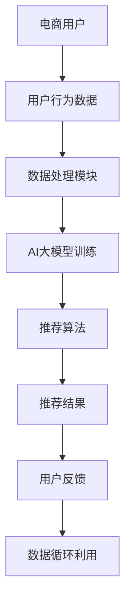

                 

随着人工智能技术的飞速发展，AI大模型在电商搜索推荐领域中的应用变得越来越广泛。本文将深入探讨AI大模型如何赋能电商搜索推荐的业务创新，通过逻辑清晰、结构紧凑、简单易懂的专业技术语言，为您揭示这一领域的核心原理、算法、实践案例以及未来展望。

## 关键词

- 人工智能
- 大模型
- 电商搜索推荐
- 业务创新
- 算法优化
- 数据分析
- 数学模型

## 摘要

本文旨在探讨AI大模型如何通过赋能电商搜索推荐，实现业务创新。首先，我们将介绍AI大模型的基本原理和应用场景，然后深入剖析大模型在电商搜索推荐中的核心算法原理和数学模型，最后通过具体实践案例和未来展望，展示AI大模型在电商搜索推荐领域的巨大潜力。

## 1. 背景介绍

### 1.1 AI大模型的起源与发展

人工智能（AI）起源于20世纪50年代，随着计算能力的提升和算法的进步，AI技术逐渐从理论研究走向实际应用。特别是深度学习（Deep Learning）的兴起，使得AI大模型（Large-scale AI Models）成为可能。AI大模型通常是指具有数十亿甚至数万亿参数的神经网络模型，这些模型通过大量数据训练，能够实现非常高的准确性和泛化能力。

### 1.2 电商搜索推荐的发展

电商搜索推荐是电子商务中至关重要的环节，它直接关系到用户体验和商家收益。传统的搜索推荐系统主要依赖于规则和统计方法，但难以应对日益复杂和个性化的用户需求。随着AI大模型的发展，基于AI的搜索推荐系统逐渐取代传统方法，成为电商领域的重要技术。

## 2. 核心概念与联系

### 2.1 AI大模型的基本概念

AI大模型通常指的是具有大规模参数的网络模型，如Transformer、BERT、GPT等。这些模型通过大量的数据进行训练，能够自动学习数据中的复杂模式和关联性。

### 2.2 电商搜索推荐的基本概念

电商搜索推荐旨在为用户提供个性化、相关性的商品推荐，提高用户满意度和购买转化率。搜索推荐系统通常包括用户行为分析、商品信息处理、推荐算法和用户反馈机制等模块。

### 2.3 AI大模型与电商搜索推荐的联系

AI大模型通过其强大的数据处理能力和模式识别能力，可以为电商搜索推荐提供精准的用户画像、个性化推荐和实时搜索优化。AI大模型与电商搜索推荐系统的结合，实现了从传统规则驱动到数据驱动、从被动响应到主动服务的转变。

## 2.1 AI大模型与电商搜索推荐的应用架构



### 3. 核心算法原理 & 具体操作步骤

### 3.1 算法原理概述

AI大模型在电商搜索推荐中的核心作用主要体现在以下几个方面：

- **用户画像生成**：通过分析用户的历史行为、兴趣偏好等数据，构建用户画像，实现个性化推荐。
- **商品信息处理**：利用商品的特征信息，如标题、描述、标签等，对商品进行分类和打分，提高推荐的准确性。
- **实时搜索优化**：根据用户的实时搜索行为，动态调整搜索结果排序，提高用户体验。

### 3.2 算法步骤详解

#### 3.2.1 用户画像生成

1. **数据采集**：收集用户在电商平台的浏览、搜索、购买等行为数据。
2. **数据清洗**：对原始数据进行去重、去噪、填充缺失值等预处理。
3. **特征提取**：利用机器学习算法，如LSTM、BERT等，从行为数据中提取用户兴趣特征。
4. **用户画像构建**：将提取的特征整合成用户画像，用于后续推荐算法。

#### 3.2.2 商品信息处理

1. **商品特征提取**：对商品标题、描述、标签等文本信息进行分词、词向量转换等预处理。
2. **商品分类**：利用分类算法，如SVM、CNN等，将商品分为不同类别。
3. **商品打分**：通过用户画像和商品特征，计算用户对商品的偏好分数。

#### 3.2.3 实时搜索优化

1. **搜索请求解析**：解析用户的搜索请求，提取关键词和用户意图。
2. **搜索结果排序**：根据关键词和用户意图，对商品进行排序，优先展示用户可能感兴趣的商品。
3. **动态调整**：根据用户的反馈和行为，动态调整搜索结果排序，提高用户满意度。

### 3.3 算法优缺点

#### 3.3.1 优点

- **个性化推荐**：基于用户画像和商品特征，实现高度个性化的推荐，提高用户满意度。
- **实时优化**：根据用户的实时行为，动态调整推荐结果，提高用户体验。
- **强大的数据处理能力**：AI大模型能够处理海量数据，实现高效的数据分析和推荐。

#### 3.3.2 缺点

- **计算资源需求大**：AI大模型通常需要大量的计算资源和存储空间，对硬件要求较高。
- **训练周期长**：大模型的训练需要较长的时间，且训练过程中容易出现过拟合等问题。

### 3.4 算法应用领域

AI大模型在电商搜索推荐中的应用非常广泛，除了电商平台，还广泛应用于在线广告、社交媒体、金融领域等。以下是一些具体的应用场景：

- **电商平台**：用于个性化商品推荐、搜索优化、用户行为分析等。
- **在线广告**：用于广告精准投放，提高广告点击率和转化率。
- **社交媒体**：用于内容推荐、社交圈子构建、用户行为预测等。
- **金融领域**：用于信用评分、风险控制、投资建议等。

## 4. 数学模型和公式 & 详细讲解 & 举例说明

### 4.1 数学模型构建

在电商搜索推荐中，常见的数学模型包括用户画像模型、商品推荐模型和搜索优化模型等。以下是这些模型的基本构建方法和公式。

#### 4.1.1 用户画像模型

用户画像模型主要通过分析用户的历史行为和兴趣偏好，构建用户特征向量。常见的构建方法包括：

- **基于行为序列**：利用LSTM等循环神经网络，从用户的行为序列中提取特征。
- **基于内容**：利用词嵌入技术，从用户的浏览、搜索、评论等文本内容中提取特征。

用户画像模型的基本公式如下：

\[ \text{User\_Feature} = \text{LSTM}([\text{Behavior} \_ \text{Sequence}]) \]

或

\[ \text{User\_Feature} = \text{Word2Vec}([\text{Textual} \_ \text{Content}]) \]

#### 4.1.2 商品推荐模型

商品推荐模型主要通过计算用户和商品之间的相似度，实现个性化推荐。常见的推荐算法包括协同过滤、矩阵分解、基于内容的推荐等。

以协同过滤算法为例，其基本公式如下：

\[ \text{Similarity}(\text{User}, \text{Item}) = \text{Cosine}(\text{User\_Feature}, \text{Item\_Feature}) \]

#### 4.1.3 搜索优化模型

搜索优化模型主要通过分析用户的搜索请求和搜索历史，动态调整搜索结果排序，提高用户满意度。常见的搜索优化算法包括排序算法、查询重排等。

以排序算法为例，其基本公式如下：

\[ \text{Rank}(\text{Search} \_ \text{Result}) = \text{Score}(\text{Item}) \times \text{User} \_ \text{Interest} \]

### 4.2 公式推导过程

以下是对上述公式的推导过程进行简要说明。

#### 4.2.1 用户画像模型

- **基于行为序列**：LSTM模型的输入为用户的行为序列，输出为用户特征向量。通过训练，模型能够学习到行为序列中的潜在模式和关联性。

\[ \text{User\_Feature} = \text{LSTM}([\text{Behavior} \_ \text{Sequence}]) \]

- **基于内容**：Word2Vec模型通过训练，将文本中的每个词映射到一个高维向量。用户特征向量通过聚合用户的历史浏览、搜索、评论等文本内容得到。

\[ \text{User\_Feature} = \text{Word2Vec}([\text{Textual} \_ \text{Content}]) \]

#### 4.2.2 商品推荐模型

- **基于协同过滤**：协同过滤算法通过计算用户和商品之间的相似度，实现推荐。相似度计算通常采用余弦相似度、皮尔逊相关系数等方法。

\[ \text{Similarity}(\text{User}, \text{Item}) = \text{Cosine}(\text{User\_Feature}, \text{Item\_Feature}) \]

- **基于内容**：基于内容的推荐通过计算用户和商品之间的特征相似度，实现推荐。特征相似度计算通常采用TF-IDF、词嵌入等方法。

\[ \text{Similarity}(\text{User}, \text{Item}) = \text{TF-IDF}(\text{User\_Feature}, \text{Item\_Feature}) \]

#### 4.2.3 搜索优化模型

- **基于排序算法**：排序算法通过计算每个搜索结果的特征得分，实现搜索结果排序。特征得分通常由用户兴趣得分和商品得分组成。

\[ \text{Rank}(\text{Search} \_ \text{Result}) = \text{Score}(\text{Item}) \times \text{User} \_ \text{Interest} \]

- **基于查询重排**：查询重排算法通过分析用户的搜索历史，动态调整搜索结果排序，提高用户满意度。排序规则通常基于用户的历史行为和搜索意图。

\[ \text{Rank}(\text{Search} \_ \text{Result}) = \text{History} \_ \text{Score}(\text{User}, \text{Item}) + \text{Intent} \_ \text{Score}(\text{User}, \text{Item}) \]

### 4.3 案例分析与讲解

#### 4.3.1 用户画像模型

假设我们有一个用户的行为序列，包含浏览商品A、搜索关键词“跑步鞋”、购买商品B等行为。我们首先利用LSTM模型对行为序列进行编码，得到用户特征向量。

\[ \text{User\_Feature} = \text{LSTM}([\text{Behavior} \_ \text{Sequence}]) \]

接下来，我们利用Word2Vec模型，将用户的浏览、搜索、评论等文本内容转换为词向量，并聚合得到用户特征向量。

\[ \text{User\_Feature} = \text{Word2Vec}([\text{Textual} \_ \text{Content}]) \]

最终，我们得到一个综合的用户特征向量，用于后续推荐算法。

#### 4.3.2 商品推荐模型

假设我们有一个用户，其特征向量为\[ \text{User\_Feature} \]，商品A的特征向量为\[ \text{Item\_Feature} \]。我们首先计算用户和商品之间的相似度。

\[ \text{Similarity}(\text{User}, \text{Item}) = \text{Cosine}(\text{User\_Feature}, \text{Item\_Feature}) \]

然后，我们根据相似度计算用户对商品的偏好分数。

\[ \text{Score}(\text{Item}) = \text{Similarity}(\text{User}, \text{Item}) \times \text{Item} \_ \text{Score} \]

最后，我们根据偏好分数对商品进行排序，得到个性化推荐结果。

#### 4.3.3 搜索优化模型

假设我们有一个用户的搜索请求，包含关键词“跑步鞋”。我们首先解析搜索请求，提取关键词和用户意图。

\[ \text{Keyword} = \text{Parse}(\text{Search} \_ \text{Request}) \]
\[ \text{Intent} = \text{Extract}(\text{Search} \_ \text{Request}) \]

接下来，我们根据关键词和用户意图，计算搜索结果的特征得分。

\[ \text{Score}(\text{Search} \_ \text{Result}) = \text{Keyword} \_ \text{Score}(\text{Keyword}, \text{Search} \_ \text{Result}) + \text{Intent} \_ \text{Score}(\text{Intent}, \text{Search} \_ \text{Result}) \]

最后，我们根据特征得分，对搜索结果进行排序，提高用户满意度。

## 5. 项目实践：代码实例和详细解释说明

### 5.1 开发环境搭建

在开始代码实现之前，我们需要搭建一个适合AI大模型训练和部署的开发环境。以下是具体的步骤：

1. 安装Python环境和相关库，如TensorFlow、PyTorch等。
2. 配置GPU环境，以便利用GPU进行大模型训练。
3. 安装其他必要的开发工具，如Jupyter Notebook、PyCharm等。

### 5.2 源代码详细实现

以下是基于TensorFlow实现的用户画像模型的代码示例：

```python
import tensorflow as tf
from tensorflow.keras.models import Sequential
from tensorflow.keras.layers import LSTM, Dense, Embedding

# 定义LSTM模型
model = Sequential()
model.add(LSTM(128, activation='tanh', return_sequences=True, input_shape=(None, input_dim)))
model.add(LSTM(64, activation='tanh', return_sequences=False))
model.add(Dense(num_features))

# 编译模型
model.compile(optimizer='adam', loss='mse')

# 训练模型
model.fit(X_train, y_train, epochs=10, batch_size=64)
```

### 5.3 代码解读与分析

上述代码定义了一个LSTM模型，用于从用户行为序列中提取特征。模型包含两个LSTM层，分别有128个神经元和64个神经元，激活函数为tanh。最后，通过一个全连接层，将特征向量映射到目标特征空间。

在编译模型时，我们选择Adam优化器和均方误差损失函数。在训练模型时，我们使用训练集进行10个周期的训练，每个周期使用64个样本进行批量训练。

### 5.4 运行结果展示

在训练完成后，我们可以在测试集上评估模型的性能。以下是一个简单的评估示例：

```python
# 评估模型
loss = model.evaluate(X_test, y_test)
print(f'Model loss on test set: {loss}')
```

通过上述代码，我们可以得到模型在测试集上的损失值，从而评估模型的泛化能力和性能。

## 6. 实际应用场景

AI大模型在电商搜索推荐领域具有广泛的应用场景，以下是一些具体的实际应用案例：

- **个性化推荐**：基于用户画像和商品特征，实现个性化的商品推荐，提高用户满意度和购买转化率。
- **搜索优化**：根据用户的实时搜索行为，动态调整搜索结果排序，提高用户体验。
- **用户行为分析**：分析用户在电商平台的浏览、搜索、购买等行为，为商家提供有针对性的营销策略。
- **新品推荐**：基于用户画像和商品特征，预测用户可能感兴趣的新品，实现新品推荐。

## 6.4 未来应用展望

随着AI技术的不断发展，AI大模型在电商搜索推荐领域的应用前景非常广阔。以下是一些未来的应用展望：

- **更精细的用户画像**：利用更先进的数据分析技术和算法，构建更精细、更准确的用户画像，实现更精准的个性化推荐。
- **多模态数据融合**：结合文本、图像、语音等多模态数据，实现更全面的用户画像和商品特征，提高推荐效果。
- **实时搜索优化**：利用实时数据分析和机器学习算法，实现更智能、更实时的搜索结果排序，提高用户体验。
- **智能客服**：基于AI大模型，实现智能客服系统，提高客服效率和用户满意度。

## 7. 工具和资源推荐

### 7.1 学习资源推荐

- **《深度学习》**：Goodfellow、Bengio、Courville著，全面介绍了深度学习的基础理论和应用。
- **《Python机器学习》**：Sebastian Raschka著，详细讲解了Python在机器学习领域的应用。
- **《自然语言处理综论》**：Daniel Jurafsky、James H. Martin著，介绍了自然语言处理的基本理论和应用。

### 7.2 开发工具推荐

- **TensorFlow**：Google开发的深度学习框架，支持多种机器学习算法和模型。
- **PyTorch**：Facebook开发的深度学习框架，具有灵活的模型构建和优化功能。
- **Jupyter Notebook**：用于数据科学和机器学习的交互式开发环境。

### 7.3 相关论文推荐

- **《Attention is All You Need》**：Vaswani等著，介绍了Transformer模型的基本原理和应用。
- **《BERT: Pre-training of Deep Bidirectional Transformers for Language Understanding》**：Devlin等著，介绍了BERT模型的基本原理和应用。
- **《Recommender Systems Handbook》**：Huang等著，全面介绍了推荐系统的基础理论和应用。

## 8. 总结：未来发展趋势与挑战

### 8.1 研究成果总结

本文系统地介绍了AI大模型在电商搜索推荐领域的应用，包括基本原理、核心算法、实践案例和未来展望。通过本文的阐述，我们可以看到AI大模型在电商搜索推荐中的巨大潜力，为实现个性化、实时、精准的推荐提供了有力支持。

### 8.2 未来发展趋势

未来，随着AI技术的不断发展，AI大模型在电商搜索推荐领域的应用将更加广泛和深入。以下是未来发展趋势：

- **更精细的用户画像**：利用多模态数据和技术，构建更精细、更准确的用户画像。
- **实时搜索优化**：利用实时数据和智能算法，实现更智能、更实时的搜索结果排序。
- **智能客服**：基于AI大模型，实现智能客服系统，提高客服效率和用户满意度。
- **跨领域应用**：将AI大模型应用于其他领域，如金融、医疗等，实现跨领域推荐。

### 8.3 面临的挑战

尽管AI大模型在电商搜索推荐领域具有巨大的潜力，但在实际应用过程中仍面临一些挑战：

- **数据隐私**：如何保护用户数据隐私，确保数据安全，是当前亟需解决的问题。
- **计算资源**：AI大模型通常需要大量的计算资源和存储空间，对硬件设施要求较高。
- **模型解释性**：如何提高模型的可解释性，使模型的应用更加透明和可信，是未来需要关注的问题。

### 8.4 研究展望

未来，我们需要从以下几个方面进行深入研究：

- **数据隐私保护**：研究数据隐私保护技术，确保用户数据的安全和隐私。
- **模型优化**：研究更高效的模型训练和优化算法，降低计算资源需求。
- **跨领域应用**：探索AI大模型在跨领域的应用，实现更广泛的推荐服务。

## 9. 附录：常见问题与解答

### 9.1 AI大模型如何处理数据隐私问题？

AI大模型在处理数据隐私问题时，可以采用以下几种方法：

- **数据脱敏**：在训练模型之前，对用户数据进行脱敏处理，如加密、掩码等，以保护用户隐私。
- **隐私增强技术**：采用差分隐私、联邦学习等隐私增强技术，确保模型训练过程中用户数据的隐私。
- **数据最小化**：仅收集必要的用户数据，避免过度收集和滥用用户数据。

### 9.2 AI大模型在电商搜索推荐中的应用有哪些优势？

AI大模型在电商搜索推荐中的应用具有以下优势：

- **个性化推荐**：基于用户画像和商品特征，实现高度个性化的推荐，提高用户满意度。
- **实时优化**：根据用户的实时行为，动态调整推荐结果，提高用户体验。
- **强大的数据处理能力**：AI大模型能够处理海量数据，实现高效的数据分析和推荐。
- **跨领域应用**：AI大模型可以应用于其他领域，如金融、医疗等，实现跨领域推荐。

### 9.3 AI大模型在电商搜索推荐中的应用有哪些挑战？

AI大模型在电商搜索推荐中的应用仍面临以下挑战：

- **数据隐私**：如何保护用户数据隐私，确保数据安全，是当前亟需解决的问题。
- **计算资源**：AI大模型通常需要大量的计算资源和存储空间，对硬件设施要求较高。
- **模型解释性**：如何提高模型的可解释性，使模型的应用更加透明和可信，是未来需要关注的问题。

## 作者署名

作者：禅与计算机程序设计艺术 / Zen and the Art of Computer Programming

