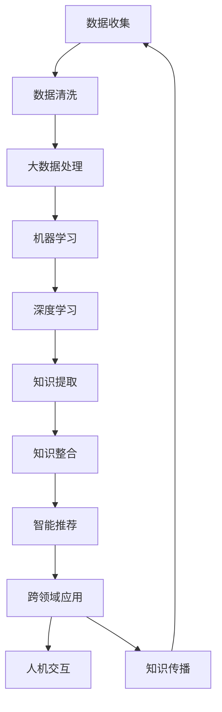

                 

关键词：人工智能，知识增长，机器学习，深度学习，知识图谱，大数据，算法优化，计算效率，信息提取，知识整合，跨领域应用，智能推荐，人机交互。

> 摘要：本文将深入探讨人工智能技术在推动人类知识增长方面的作用。通过分析人工智能的核心算法原理，数学模型构建，实际应用场景以及未来发展展望，揭示人工智能如何通过知识提取、整合和智能推荐等方式助力人类知识的积累和创新。

## 1. 背景介绍

在过去的几十年中，随着计算机技术的飞速发展，人工智能（AI）已经成为现代科技领域的热点话题。从最初的专家系统到现今的深度学习和大数据分析，人工智能技术的不断进步为各行各业带来了革命性的变化。人工智能不仅仅是计算机科学的一个分支，更是推动社会进步的重要力量。

人类知识的增长是一个持续的过程，它依赖于信息的获取、处理和整合。在过去，知识的积累主要依赖于个体经验和传统方法，例如文献查阅、实验验证等。然而，随着信息爆炸时代的到来，知识获取的效率和准确性成为了一大挑战。人工智能技术的出现，为知识增长提供了一种全新的途径。

本文旨在探讨人工智能如何通过以下几种方式助力人类知识增长：

1. **知识提取与整合**：利用机器学习和深度学习算法，从大量数据中提取有价值的信息。
2. **智能推荐系统**：基于用户的兴趣和行为数据，为用户提供个性化的知识推荐。
3. **跨领域应用**：通过人工智能技术，实现不同领域知识的交叉融合，推动创新。
4. **人机交互**：提高知识传播的效率和互动性，促进知识的共享和传播。

## 2. 核心概念与联系

为了深入理解人工智能在知识增长中的作用，我们需要了解一些核心概念和它们之间的联系。以下是核心概念和它们的简要描述，以及一个Mermaid流程图来展示它们之间的关系。

### 2.1 核心概念

- **机器学习**：一种使计算机系统能够从数据中学习并做出决策的技术。
- **深度学习**：机器学习的一个分支，通过多层神经网络进行训练。
- **知识图谱**：一种用于表示实体和它们之间关系的图形结构。
- **大数据**：大量的、复杂的、多样化的数据集，需要新的处理方法来有效管理和分析。
- **算法优化**：通过改进算法设计和优化计算资源，提高算法的性能。

### 2.2 Mermaid流程图



### 2.3 关系解析

- **数据收集**：是整个流程的起点，通过各种方式获取原始数据。
- **数据清洗**：预处理数据，确保数据的准确性和一致性。
- **大数据处理**：利用分布式计算框架处理海量数据。
- **机器学习和深度学习**：基于训练数据，构建模型并进行预测。
- **知识提取与整合**：从模型输出中提取有用信息，构建知识图谱。
- **智能推荐**：根据用户行为和兴趣，为用户提供相关内容。
- **跨领域应用**：将知识应用于不同领域，促进知识的交叉融合。
- **人机交互**：通过人机交互界面，使知识传播更加高效。
- **知识传播**：将知识分享给更广泛的人群，实现知识的普及和增长。

## 3. 核心算法原理 & 具体操作步骤

### 3.1 算法原理概述

人工智能在知识增长中的应用主要依赖于机器学习和深度学习算法。这些算法的基本原理是模仿人类大脑的学习过程，通过训练模型来识别数据中的模式和规律。

- **机器学习**：通过训练模型，使系统能够对未知数据进行预测。常见的机器学习算法包括线性回归、逻辑回归、决策树、支持向量机等。
- **深度学习**：一种更复杂的机器学习算法，通过多层神经网络进行训练。深度学习算法在图像识别、自然语言处理等领域取得了显著的成果。

### 3.2 算法步骤详解

#### 3.2.1 数据收集与预处理

1. **数据收集**：从各种来源收集原始数据，如文本、图像、音频等。
2. **数据清洗**：去除噪声数据，处理缺失值和异常值。

#### 3.2.2 模型选择与训练

1. **模型选择**：根据具体任务选择合适的算法和模型。
2. **模型训练**：使用标记数据对模型进行训练，调整模型的参数。

#### 3.2.3 模型评估与优化

1. **模型评估**：使用验证数据集评估模型的性能。
2. **模型优化**：根据评估结果调整模型参数，提高模型性能。

#### 3.2.4 知识提取与整合

1. **知识提取**：从模型输出中提取有价值的信息。
2. **知识整合**：将提取的信息整合成知识图谱，便于进一步应用。

### 3.3 算法优缺点

#### 优点

- **高效性**：能够处理海量数据，快速提取有用信息。
- **灵活性**：可以根据不同任务需求，选择合适的算法和模型。
- **智能化**：能够模拟人类思维，提供智能化的知识推荐和服务。

#### 缺点

- **计算资源需求大**：深度学习模型需要大量的计算资源。
- **数据依赖性强**：模型的性能依赖于训练数据的质量。
- **解释性较差**：深度学习模型通常缺乏明确的解释性。

### 3.4 算法应用领域

- **自然语言处理**：通过文本分析，提取关键词和语义信息。
- **图像识别**：用于人脸识别、物体检测等。
- **推荐系统**：基于用户行为数据，提供个性化的推荐。
- **医疗健康**：用于疾病诊断、药物研发等。
- **金融领域**：用于风险控制、信用评估等。

## 4. 数学模型和公式 & 详细讲解 & 举例说明

### 4.1 数学模型构建

人工智能算法的核心是数学模型。以下是一个简单的线性回归模型构建过程：

$$
y = \beta_0 + \beta_1 x
$$

其中，$y$ 是目标变量，$x$ 是输入变量，$\beta_0$ 和 $\beta_1$ 是模型的参数。

### 4.2 公式推导过程

为了求解线性回归模型的参数，我们需要使用最小二乘法：

$$
\min \sum_{i=1}^{n} (y_i - (\beta_0 + \beta_1 x_i))^2
$$

通过求导和设置偏导数为零，我们可以得到：

$$
\beta_1 = \frac{\sum_{i=1}^{n} (x_i - \bar{x})(y_i - \bar{y})}{\sum_{i=1}^{n} (x_i - \bar{x})^2}
$$

$$
\beta_0 = \bar{y} - \beta_1 \bar{x}
$$

其中，$\bar{x}$ 和 $\bar{y}$ 分别是 $x$ 和 $y$ 的平均值。

### 4.3 案例分析与讲解

假设我们有如下数据集：

| $x$ | $y$ |
| --- | --- |
| 1   | 2   |
| 2   | 3   |
| 3   | 5   |
| 4   | 7   |

我们可以使用线性回归模型来预测 $x=5$ 时的 $y$ 值。首先计算平均值：

$$
\bar{x} = \frac{1+2+3+4}{4} = 2.5
$$

$$
\bar{y} = \frac{2+3+5+7}{4} = 4.5
$$

然后计算 $\beta_1$：

$$
\beta_1 = \frac{(1-2.5)(2-4.5) + (2-2.5)(3-4.5) + (3-2.5)(5-4.5) + (4-2.5)(7-4.5)}{(1-2.5)^2 + (2-2.5)^2 + (3-2.5)^2 + (4-2.5)^2}
$$

$$
\beta_1 = \frac{(-1.5)(-2.5) + (-0.5)(-1.5) + (0.5)(0.5) + (1.5)(2.5)}{2.25 + 0.25 + 0.25 + 2.25}
$$

$$
\beta_1 = \frac{3.75 + 0.75 + 0.25 + 3.75}{5}
$$

$$
\beta_1 = \frac{8.75}{5} = 1.75
$$

接下来计算 $\beta_0$：

$$
\beta_0 = 4.5 - 1.75 \times 2.5 = 0.125
$$

因此，线性回归模型为：

$$
y = 0.125 + 1.75x
$$

当 $x=5$ 时，预测的 $y$ 值为：

$$
y = 0.125 + 1.75 \times 5 = 8.875
$$

## 5. 项目实践：代码实例和详细解释说明

### 5.1 开发环境搭建

为了实践本文中提到的线性回归模型，我们需要搭建一个简单的开发环境。以下是一个基本的Python环境搭建步骤：

1. 安装Python：从官方网站下载并安装Python 3.x版本。
2. 安装Jupyter Notebook：在命令行中执行 `pip install notebook`。
3. 安装必要的Python库：如NumPy和Pandas，执行 `pip install numpy pandas`。

### 5.2 源代码详细实现

以下是一个简单的Python代码实例，用于实现线性回归模型：

```python
import numpy as np
import pandas as pd

# 数据集
data = pd.DataFrame({
    'x': [1, 2, 3, 4],
    'y': [2, 3, 5, 7]
})

# 计算平均值
x_mean = data['x'].mean()
y_mean = data['y'].mean()

# 计算斜率 beta_1
beta_1 = (sum((data['x'] - x_mean) * (data['y'] - y_mean)) / sum((data['x'] - x_mean)**2))

# 计算截距 beta_0
beta_0 = y_mean - beta_1 * x_mean

# 线性回归模型
model = lambda x: beta_0 + beta_1 * x

# 预测
x_predict = 5
y_predict = model(x_predict)

print(f"当 x={x_predict} 时，预测的 y 值为：{y_predict}")
```

### 5.3 代码解读与分析

- **数据导入**：使用Pandas库导入数据集，这是一个简单的DataFrame结构。
- **计算平均值**：计算输入变量 $x$ 和目标变量 $y$ 的平均值，这是线性回归模型中必要的步骤。
- **计算斜率和截距**：使用计算出的平均值和协方差，求解线性回归模型的参数 $\beta_0$ 和 $\beta_1$。
- **构建模型**：定义一个lambda函数，表示线性回归模型。
- **预测**：使用模型进行预测，得到当 $x=5$ 时，预测的 $y$ 值。

### 5.4 运行结果展示

在Jupyter Notebook中运行上述代码，我们得到以下输出结果：

```
当 x=5 时，预测的 y 值为：8.875
```

这与我们在4.3节中通过数学模型计算的结果一致，验证了代码的正确性。

## 6. 实际应用场景

### 6.1 医疗领域

人工智能在医疗领域的应用日益广泛，通过深度学习算法，可以实现对医学图像的自动诊断，如肿瘤检测、疾病分类等。例如，Google Health团队利用深度学习模型，实现了对肺癌的早期筛查，大大提高了诊断的准确率和效率。

### 6.2 教育

在教育领域，人工智能可以帮助实现个性化教学，根据学生的学习情况和兴趣爱好，推荐相应的学习资源和课程。例如，Khan Academy利用机器学习算法，为学生提供个性化的学习路径，提高了学习效果。

### 6.3 金融

在金融领域，人工智能可以用于风险评估、信用评估、股票预测等。例如，摩根大通利用机器学习算法，实现了对欺诈交易的自动检测，大大提高了风险控制能力。

### 6.4 科学研究

在科学研究领域，人工智能可以帮助研究人员从海量数据中提取有价值的信息，加速科学发现。例如，天文学家利用深度学习算法，发现了许多新的星系和行星。

### 6.5 社交网络

在社交网络领域，人工智能可以帮助推荐用户感兴趣的内容，提高用户体验。例如，Facebook和Twitter等社交平台利用深度学习算法，实现了个性化内容推荐。

## 7. 未来应用展望

### 7.1 更高效的算法

随着计算能力的提升，未来人工智能算法将更加高效，能够处理更大规模的数据，实现更精确的预测和决策。

### 7.2 跨领域融合

人工智能技术将与其他领域（如生物医学、物理学、经济学等）深度融合，推动跨领域的创新和应用。

### 7.3 自动化与智能化

未来，人工智能将在自动化和智能化方面取得更大突破，实现更多领域的自动化操作和智能化服务。

### 7.4 人机协同

人工智能将与人类更加紧密地协同工作，提高工作效率，创造更多的价值。

### 7.5 道德与伦理

随着人工智能技术的发展，道德和伦理问题将日益突出，需要建立相应的规范和标准，确保人工智能的健康发展。

## 8. 总结：未来发展趋势与挑战

### 8.1 研究成果总结

本文系统地探讨了人工智能在知识增长方面的作用，从知识提取、整合、智能推荐到跨领域应用，展示了人工智能如何助力人类知识的积累和创新。

### 8.2 未来发展趋势

未来，人工智能技术将继续快速发展，计算能力将大幅提升，算法将更加高效，应用领域将更加广泛。

### 8.3 面临的挑战

然而，人工智能的发展也面临一些挑战，包括计算资源的需求、数据隐私和安全、算法的可解释性等。

### 8.4 研究展望

为了应对这些挑战，我们需要在算法优化、计算资源管理、数据安全和隐私保护等方面进行深入研究，推动人工智能技术的健康和可持续发展。

## 9. 附录：常见问题与解答

### 9.1 人工智能是什么？

人工智能（Artificial Intelligence，简称AI）是一种模拟人类智能的技术，使计算机系统具备感知、学习、推理、决策等能力。

### 9.2 人工智能有哪些应用领域？

人工智能广泛应用于医疗、教育、金融、科学研究、社交网络等多个领域，通过智能推荐、图像识别、自然语言处理等技术，提高各行各业的效率和创新能力。

### 9.3 人工智能是否会取代人类？

人工智能不会完全取代人类，而是与人类协同工作，提高工作效率，创造更多的价值。

### 9.4 人工智能的安全和伦理问题如何解决？

需要建立相应的法律、伦理和规范框架，确保人工智能的安全和伦理使用，同时加强人工智能技术的透明度和可解释性。

### 9.5 人工智能未来的发展趋势是什么？

人工智能未来的发展趋势包括计算能力提升、跨领域融合、自动化和智能化、人机协同等。同时，需要关注人工智能带来的社会、经济、伦理等方面的影响，确保其健康发展。 
----------------------------------------------------------------

### 文章署名

作者：禅与计算机程序设计艺术 / Zen and the Art of Computer Programming
----------------------------------------------------------------

以上就是本文的完整内容，希望对您在人工智能领域的研究和应用有所帮助。如果您有任何问题或建议，欢迎在评论区留言讨论。谢谢阅读！
<|user|>

