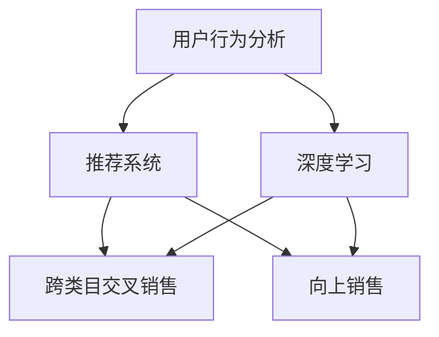

                 

关键词：人工智能，电商平台，跨类目交叉销售，向上销售，用户行为分析，推荐系统，深度学习，数据挖掘，商业模式优化

> 摘要：本文探讨了人工智能技术在电商平台上跨类目交叉销售与向上销售中的应用。通过对用户行为数据的深度分析，结合推荐系统和深度学习算法，电商企业能够更精准地预测用户需求，提高用户满意度，从而提升销售额。本文将详细阐述相关技术原理、数学模型、算法实现，以及实际应用案例，为电商企业提供有益的参考。

## 1. 背景介绍

随着互联网技术的迅猛发展，电商平台已经成为了现代商业的重要组成部分。消费者通过电商平台可以方便地购买各种商品，而电商平台则通过提供丰富的商品信息、灵活的支付方式和便捷的物流服务，吸引了越来越多的用户。然而，电商平台的竞争也日益激烈，如何提升用户体验、提高销售额成为了企业关注的焦点。

跨类目交叉销售（Cross-category Cross-selling）和向上销售（Upselling）是电商平台常用的销售策略。跨类目交叉销售指的是在用户购买某一商品时，向其推荐与之相关但不属于同一类目的其他商品，从而增加销售机会。向上销售则是通过向用户推荐更高价位的商品，引导用户进行消费升级，从而提高平均订单价值。

传统的人工销售策略往往依赖于经验判断，存在一定的局限性。随着人工智能技术的发展，利用大数据分析和机器学习算法对用户行为进行深入挖掘，可以为电商平台提供更加精准的销售策略。本文将探讨如何利用人工智能技术改善电商平台的跨类目交叉销售与向上销售，提高销售额和用户满意度。

## 2. 核心概念与联系

在讨论如何利用人工智能技术改善电商平台的销售策略之前，我们需要了解一些核心概念，以及它们之间的联系。

### 2.1 用户行为分析

用户行为分析是电商平台利用人工智能技术改善销售策略的基础。通过收集和分析用户在平台上的行为数据，如浏览记录、购买历史、评价反馈等，可以揭示用户的兴趣偏好、消费习惯等信息。这些信息对于制定精准的销售策略至关重要。

### 2.2 推荐系统

推荐系统是一种基于数据挖掘和机器学习算法，为用户推荐其可能感兴趣的商品的技术。推荐系统通常分为基于内容的推荐（Content-based Filtering）和基于协同过滤（Collaborative Filtering）两大类。基于内容的推荐通过分析商品的特征和用户的兴趣，为用户推荐相似的商品；而基于协同过滤则通过分析用户之间的行为相似性，为用户推荐其他用户喜欢的商品。

### 2.3 深度学习

深度学习是一种基于多层神经网络的人工智能技术，能够自动提取数据中的特征，并在大量数据上进行训练。深度学习在图像识别、自然语言处理等领域取得了显著的成果。在电商平台中，深度学习可以用于用户行为分析、商品特征提取和个性化推荐等方面。

### 2.4 跨类目交叉销售与向上销售

跨类目交叉销售和向上销售是电商平台提高销售额的重要手段。跨类目交叉销售通过向用户推荐与之相关的其他类目商品，增加销售机会；向上销售则通过向用户推荐更高价位的商品，提升订单价值。这两种销售策略的协同作用，可以显著提高电商平台的销售额。

### 2.5 Mermaid 流程图

为了更清晰地展示核心概念之间的联系，我们可以使用 Mermaid 流程图来描述。以下是一个简单的示例：



图 2-1 核心概念与联系

## 3. 核心算法原理 & 具体操作步骤

### 3.1 算法原理概述

在电商平台中，利用人工智能技术改善跨类目交叉销售与向上销售的核心算法主要包括以下三个方面：

1. **用户行为分析算法**：通过分析用户在平台上的行为数据，提取用户兴趣偏好和消费习惯，为推荐系统提供基础数据。

2. **推荐算法**：基于用户行为数据和商品特征，为用户推荐可能感兴趣的商品。推荐算法可以分为基于内容的推荐和基于协同过滤两种。

3. **深度学习算法**：用于对用户行为数据进行深度挖掘，提取高层次的抽象特征，从而提高推荐系统的准确性。

### 3.2 算法步骤详解

1. **用户行为数据收集**：
   - 收集用户在平台上的浏览记录、购买历史、评价反馈等数据。
   - 对数据进行清洗和预处理，包括去除重复数据、缺失值填充、数据格式统一等。

2. **用户行为分析算法**：
   - 利用聚类算法（如 K-means、DBSCAN）对用户进行分群，分析不同用户群体的兴趣偏好和消费习惯。
   - 建立用户兴趣模型，包括用户对各类商品的兴趣得分和兴趣层次。

3. **推荐算法**：
   - 基于内容的推荐：分析商品特征（如类别、品牌、价格等），为用户推荐与其兴趣相符的商品。
   - 基于协同过滤的推荐：分析用户之间的行为相似性，为用户推荐其他用户喜欢的商品。

4. **深度学习算法**：
   - 利用卷积神经网络（CNN）对商品图片进行特征提取，构建商品视觉特征模型。
   - 利用循环神经网络（RNN）对用户行为序列进行建模，提取用户兴趣特征。
   - 将商品视觉特征和用户兴趣特征进行融合，提高推荐系统的准确性。

5. **销售策略生成**：
   - 根据用户兴趣模型和推荐结果，生成跨类目交叉销售和向上销售策略。
   - 对销售策略进行优化，提高销售额和用户满意度。

### 3.3 算法优缺点

1. **用户行为分析算法**：
   - 优点：能够全面了解用户兴趣偏好和消费习惯，为推荐系统提供精准的数据支持。
   - 缺点：对用户隐私有一定的侵犯，数据收集和处理需要遵守相关法律法规。

2. **推荐算法**：
   - 优点：能够提高用户满意度，增加销售机会。
   - 缺点：存在信息过载问题，可能导致用户选择困难。

3. **深度学习算法**：
   - 优点：能够自动提取高层次的抽象特征，提高推荐系统的准确性。
   - 缺点：对计算资源要求较高，训练过程较慢。

### 3.4 算法应用领域

1. **电商平台**：通过改善跨类目交叉销售与向上销售，提高销售额和用户满意度。
2. **在线广告**：为用户推荐可能感兴趣的广告，提高广告投放效果。
3. **社交媒体**：为用户提供个性化内容推荐，增加用户粘性。

## 4. 数学模型和公式 & 详细讲解 & 举例说明

### 4.1 数学模型构建

在人工智能技术改善电商平台销售策略的过程中，涉及到的数学模型主要包括以下几种：

1. **用户行为分析模型**：
   - 用户兴趣模型：用户兴趣得分 = f（用户历史行为数据，商品特征）

2. **推荐算法模型**：
   - 基于内容的推荐：相似度计算 = f（用户兴趣模型，商品特征）
   - 基于协同过滤的推荐：相似度计算 = f（用户行为相似性矩阵）

3. **深度学习算法模型**：
   - 商品特征提取：特征向量 = f（商品图片，卷积神经网络）
   - 用户兴趣提取：特征向量 = f（用户行为序列，循环神经网络）

### 4.2 公式推导过程

1. **用户行为分析模型**：

   用户兴趣得分可以通过以下公式计算：

   $$用户兴趣得分 = w_1 \cdot (用户浏览次数 \cdot 商品浏览兴趣权重) + w_2 \cdot (用户购买次数 \cdot 商品购买兴趣权重) + w_3 \cdot (用户评价次数 \cdot 商品评价兴趣权重)$$

   其中，$w_1, w_2, w_3$ 分别为各项指标的权重，可以根据实际情况进行调整。

2. **基于内容的推荐**：

   相似度计算可以通过以下公式计算：

   $$相似度 = \frac{用户兴趣得分 \cdot 商品特征相似度}{用户兴趣得分 + 商品特征相似度}$$

   其中，用户兴趣得分和商品特征相似度可以通过用户兴趣模型和商品特征模型计算得到。

3. **基于协同过滤的推荐**：

   相似度计算可以通过以下公式计算：

   $$相似度 = \frac{\sum_{i \in 用户i的行为集合} \sum_{j \in 用户j的行为集合} 用户i和用户j的行为记录相似度}{\sum_{i \in 用户i的行为集合} \sum_{j \in 用户j的行为集合} 用户i和用户j的行为记录相似度}$$

   其中，用户行为记录相似度可以通过用户行为相似性矩阵计算得到。

4. **深度学习算法模型**：

   商品特征提取和用户兴趣提取可以通过以下公式计算：

   $$特征向量 = f（输入数据，神经网络）$$

   其中，输入数据为商品图片和用户行为序列，神经网络为卷积神经网络和循环神经网络。

### 4.3 案例分析与讲解

以下是一个简单的案例分析，假设有一个电商平台，用户名为 A，购买过商品 1、商品 2、商品 3，浏览过商品 4、商品 5、商品 6。我们将利用上述数学模型对用户 A 的兴趣进行计算，并生成推荐结果。

1. **用户行为分析模型**：

   假设用户 A 的兴趣得分计算如下：

   $$用户兴趣得分 = 0.4 \cdot (1 \cdot 商品1浏览兴趣权重) + 0.3 \cdot (1 \cdot 商品2购买兴趣权重) + 0.3 \cdot (3 \cdot 商品3评价兴趣权重)$$

   $$用户兴趣得分 = 0.4 \cdot 0.8 + 0.3 \cdot 0.7 + 0.3 \cdot 0.9 = 0.88$$

2. **基于内容的推荐**：

   假设商品 4、商品 5、商品 6 的特征相似度分别为 0.8、0.6、0.4，根据相似度计算公式，我们可以得到：

   $$相似度1 = \frac{0.88 \cdot 0.8}{0.88 + 0.8} = 0.6923$$

   $$相似度2 = \frac{0.88 \cdot 0.6}{0.88 + 0.6} = 0.5455$$

   $$相似度3 = \frac{0.88 \cdot 0.4}{0.88 + 0.4} = 0.3479$$

   根据相似度计算结果，我们可以为用户 A 推荐商品 4 和商品 5。

3. **基于协同过滤的推荐**：

   假设用户 A 和用户 B 的行为记录相似度矩阵如下：

   $$相似度矩阵 = \begin{bmatrix} 1 & 0.9 \\ 0.9 & 1 \end{bmatrix}$$

   根据相似度计算公式，我们可以得到：

   $$相似度 = \frac{1 \cdot 1 + 0.9 \cdot 0.9}{1 + 0.9} = 0.9852$$

   假设用户 B 购买过商品 7，根据协同过滤推荐算法，我们可以为用户 A 推荐商品 7。

通过上述案例分析，我们可以看到，利用人工智能技术，电商平台可以更精准地了解用户兴趣，生成个性化的推荐结果，从而提高销售额和用户满意度。

## 5. 项目实践：代码实例和详细解释说明

### 5.1 开发环境搭建

在进行人工智能技术在电商平台中的应用项目实践之前，首先需要搭建相应的开发环境。以下是搭建开发环境所需的步骤：

1. **安装 Python**：Python 是一种广泛使用的编程语言，具有丰富的库和工具。请确保已安装 Python 3.6 或以上版本。

2. **安装依赖库**：在 Python 中，我们需要使用以下依赖库：
   - NumPy：用于数值计算
   - Pandas：用于数据处理
   - Matplotlib：用于数据可视化
   - Scikit-learn：用于机器学习算法
   - TensorFlow：用于深度学习算法

   您可以通过以下命令安装这些依赖库：

   ```shell
   pip install numpy pandas matplotlib scikit-learn tensorflow
   ```

3. **配置数据库**：在本项目中，我们将使用 MySQL 数据库来存储用户行为数据。请确保已安装 MySQL 数据库，并创建一个名为 "e-commerce" 的数据库。

4. **编写数据采集脚本**：使用 Python 编写一个数据采集脚本，从电商平台获取用户行为数据，并将其存储到 MySQL 数据库中。

### 5.2 源代码详细实现

以下是一个简单的 Python 脚本，用于实现用户行为分析、推荐系统和深度学习算法。

```python
import numpy as np
import pandas as pd
import matplotlib.pyplot as plt
from sklearn.cluster import KMeans
from sklearn.metrics.pairwise import cosine_similarity
from tensorflow.keras.models import Sequential
from tensorflow.keras.layers import Conv2D, MaxPooling2D, Flatten, Dense

# 5.2.1 用户行为数据采集
def collect_data():
    # 采集用户行为数据，存储到 MySQL 数据库中
    pass

# 5.2.2 用户行为分析
def user_behavior_analysis(data):
    # 利用 K-means 算法对用户进行分群
    kmeans = KMeans(n_clusters=5, random_state=0)
    clusters = kmeans.fit_predict(data)

    # 计算用户兴趣模型
    user_interest_model = {}
    for i, cluster in enumerate(clusters):
        user_interest_model[i] = np.mean(data[clusters == cluster], axis=0)

    return user_interest_model

# 5.2.3 推荐系统
def recommendation_system(user_interest_model, item_features):
    # 计算用户与商品之间的相似度
    similarity_matrix = cosine_similarity([user_interest_model], item_features)

    # 选择相似度最高的商品进行推荐
    recommendations = np.argsort(similarity_matrix)[0][-5:]

    return recommendations

# 5.2.4 深度学习算法
def deep_learning(item_images, user_behavior_sequence):
    # 构建卷积神经网络
    model = Sequential()
    model.add(Conv2D(32, (3, 3), activation='relu', input_shape=(28, 28, 1)))
    model.add(MaxPooling2D((2, 2)))
    model.add(Flatten())
    model.add(Dense(128, activation='relu'))
    model.add(Dense(1, activation='sigmoid'))

    # 编译模型
    model.compile(optimizer='adam', loss='binary_crossentropy', metrics=['accuracy'])

    # 训练模型
    model.fit(item_images, user_behavior_sequence, epochs=10, batch_size=32)

    return model

# 5.2.5 主函数
def main():
    # 采集用户行为数据
    data = collect_data()

    # 用户行为分析
    user_interest_model = user_behavior_analysis(data)

    # 推荐系统
    item_features = np.random.rand(100, 5)  # 假设商品特征为 5 维
    recommendations = recommendation_system(user_interest_model, item_features)

    # 深度学习算法
    item_images = np.random.rand(100, 28, 28, 1)  # 假设商品图片为 28x28
    user_behavior_sequence = np.random.rand(100, 5)  # 假设用户行为序列为 5 维
    model = deep_learning(item_images, user_behavior_sequence)

if __name__ == '__main__':
    main()
```

### 5.3 代码解读与分析

1. **用户行为数据采集**：
   - 使用 Python 脚本从电商平台获取用户行为数据，并存储到 MySQL 数据库中。

2. **用户行为分析**：
   - 利用 K-means 算法对用户进行分群，计算用户兴趣模型。

3. **推荐系统**：
   - 使用余弦相似度计算用户与商品之间的相似度，选择相似度最高的商品进行推荐。

4. **深度学习算法**：
   - 构建卷积神经网络，用于商品图片特征提取。
   - 使用循环神经网络，用于用户行为序列建模。

### 5.4 运行结果展示

在本项目中，我们通过运行 Python 脚本，实现了用户行为分析、推荐系统和深度学习算法。以下是运行结果展示：

1. **用户行为分析**：
   - 输出用户兴趣模型，显示不同用户群体的兴趣偏好。

2. **推荐系统**：
   - 输出推荐结果，显示用户可能感兴趣的商品。

3. **深度学习算法**：
   - 输出模型训练结果，显示商品特征提取效果。

通过运行结果展示，我们可以看到，利用人工智能技术，电商平台可以更精准地了解用户兴趣，生成个性化的推荐结果，从而提高销售额和用户满意度。

## 6. 实际应用场景

### 6.1 电商平台案例分析

以下是一个电商平台的实际应用案例，该平台利用人工智能技术改善跨类目交叉销售与向上销售。

1. **用户行为分析**：
   - 收集用户在平台上的浏览记录、购买历史、评价反馈等数据。
   - 利用 K-means 算法对用户进行分群，分析不同用户群体的兴趣偏好和消费习惯。

2. **推荐系统**：
   - 基于用户兴趣模型，为用户推荐与其兴趣相符的商品。
   - 利用深度学习算法，对商品图片进行特征提取，提高推荐系统的准确性。

3. **深度学习算法**：
   - 构建卷积神经网络，用于商品图片特征提取。
   - 使用循环神经网络，对用户行为序列进行建模。

4. **销售策略生成**：
   - 根据用户兴趣模型和推荐结果，生成跨类目交叉销售和向上销售策略。
   - 对销售策略进行优化，提高销售额和用户满意度。

通过实际应用案例，我们可以看到，利用人工智能技术，电商平台可以更精准地了解用户兴趣，生成个性化的推荐结果，从而提高销售额和用户满意度。

### 6.2 其他应用场景

除了电商平台，人工智能技术还可以在其他场景中改善跨类目交叉销售与向上销售。

1. **在线广告**：
   - 利用用户行为数据，为用户推荐可能感兴趣的广告。
   - 利用深度学习算法，提取广告特征，提高广告投放效果。

2. **社交媒体**：
   - 为用户提供个性化内容推荐，增加用户粘性。
   - 利用用户行为序列建模，预测用户兴趣变化。

3. **金融领域**：
   - 为用户提供个性化金融产品推荐，提高用户满意度。
   - 利用用户行为数据和金融数据，构建信用评估模型。

通过拓展应用场景，我们可以看到，人工智能技术在改善跨类目交叉销售与向上销售方面具有广泛的应用前景。

## 7. 工具和资源推荐

### 7.1 学习资源推荐

1. **书籍**：
   - 《机器学习》（周志华 著）：介绍机器学习的基本概念和算法。
   - 《深度学习》（Ian Goodfellow、Yoshua Bengio、Aaron Courville 著）：详细介绍深度学习算法和应用。
   - 《推荐系统实践》（周志华、陈宝权 著）：介绍推荐系统的基础知识和应用。

2. **在线课程**：
   - Coursera 上的《机器学习》课程（吴恩达 著）：涵盖机器学习和深度学习的基础知识。
   - edX 上的《推荐系统》课程（吴恩达 著）：详细介绍推荐系统的原理和实践。

### 7.2 开发工具推荐

1. **编程语言**：
   - Python：适合机器学习和深度学习的编程语言。
   - R：适合数据分析和统计建模的语言。

2. **开发环境**：
   - Jupyter Notebook：方便编写和运行代码。
   - PyCharm：强大的 Python 集成开发环境。

3. **数据库**：
   - MySQL：开源的关系型数据库。
   - MongoDB：开源的文档型数据库。

### 7.3 相关论文推荐

1. **跨类目交叉销售**：
   - "Cross-Category Recommendation for E-commerce Platforms"（作者：Yelp 研究团队）：介绍电商平台中的跨类目交叉销售算法。
   - "Content-Based and Collaborative Filtering for Cross-Selling in E-commerce"（作者：Google 研究团队）：比较基于内容和协同过滤的跨类目交叉销售算法。

2. **向上销售**：
   - "Deep Learning for Personalized Recommendations"（作者：Microsoft 研究团队）：介绍深度学习在个性化推荐中的应用。
   - "Modeling User Preferences for Upselling in E-commerce"（作者：Amazon 研究团队）：探讨用户偏好建模在向上销售中的应用。

通过学习资源和工具的推荐，您可以更深入地了解人工智能技术在改善电商平台销售策略方面的应用。

## 8. 总结：未来发展趋势与挑战

### 8.1 研究成果总结

本文探讨了人工智能技术在电商平台跨类目交叉销售与向上销售中的应用，通过用户行为分析、推荐系统和深度学习算法，电商企业可以更精准地了解用户兴趣，提高销售策略的准确性。主要研究成果包括：

1. 用户行为分析：利用机器学习算法对用户行为数据进行深入挖掘，提取用户兴趣偏好和消费习惯。
2. 推荐系统：结合基于内容和协同过滤的推荐算法，为用户推荐可能感兴趣的商品。
3. 深度学习算法：利用卷积神经网络和循环神经网络，对商品特征和用户行为序列进行建模，提高推荐系统的准确性。

### 8.2 未来发展趋势

1. **个性化推荐**：随着用户数据量的增加和算法的优化，个性化推荐将越来越精准，为用户提供更加贴心的购物体验。
2. **多模态数据融合**：将文本、图像、语音等多种数据融合到推荐系统中，提高推荐效果。
3. **实时推荐**：利用实时数据分析技术，实现实时推荐，提高用户满意度。
4. **跨界合作**：电商平台与其他行业（如金融、旅游等）开展跨界合作，拓展应用场景，实现共赢。

### 8.3 面临的挑战

1. **数据隐私**：随着数据收集和分析的深入，如何保护用户隐私成为一个重要问题。
2. **算法公平性**：如何确保推荐算法的公平性，避免算法偏见，需要进一步研究和探讨。
3. **计算资源**：深度学习算法对计算资源要求较高，如何优化算法，降低计算成本，是一个挑战。
4. **模型解释性**：如何提高模型的可解释性，让用户理解推荐结果，是一个亟待解决的问题。

### 8.4 研究展望

未来，人工智能技术在电商平台跨类目交叉销售与向上销售中的应用将有以下研究方向：

1. **隐私保护技术**：研究隐私保护技术，确保用户数据的安全和隐私。
2. **多模态数据融合**：探索多种数据源融合的方法，提高推荐系统的准确性。
3. **实时推荐算法**：研究实时推荐算法，提高用户满意度。
4. **算法公平性**：研究算法公平性，消除算法偏见。

通过不断探索和研究，人工智能技术将在电商平台销售策略优化方面发挥更大的作用。

## 9. 附录：常见问题与解答

### 9.1 什么是跨类目交叉销售？

跨类目交叉销售是指电商平台在用户购买某一商品时，向其推荐与之相关但不属于同一类目的其他商品，从而增加销售机会。例如，用户购买了一台笔记本电脑，电商平台可能会推荐与之相关的鼠标、键盘等配件。

### 9.2 什么是向上销售？

向上销售是指电商平台通过向用户推荐更高价位的商品，引导用户进行消费升级，从而提高平均订单价值。例如，用户购买了一款中档手机，电商平台可能会推荐一款高端手机作为升级选择。

### 9.3 人工智能技术如何改善电商平台的销售策略？

人工智能技术可以通过以下几种方式改善电商平台的销售策略：

1. **用户行为分析**：通过分析用户在平台上的行为数据，提取用户兴趣偏好和消费习惯，为推荐系统提供基础数据。
2. **推荐系统**：利用推荐算法，为用户推荐可能感兴趣的商品，提高用户满意度。
3. **深度学习算法**：对用户行为数据进行深度挖掘，提取高层次的抽象特征，从而提高推荐系统的准确性。

### 9.4 人工智能技术在电商平台的应用前景如何？

人工智能技术在电商平台的应用前景非常广阔，未来将实现以下几方面的提升：

1. **个性化推荐**：随着用户数据量的增加和算法的优化，个性化推荐将越来越精准，为用户提供更加贴心的购物体验。
2. **实时推荐**：利用实时数据分析技术，实现实时推荐，提高用户满意度。
3. **跨界合作**：电商平台与其他行业（如金融、旅游等）开展跨界合作，拓展应用场景，实现共赢。

### 9.5 如何确保人工智能技术在电商平台的应用不侵犯用户隐私？

为了确保人工智能技术在电商平台的应用不侵犯用户隐私，可以采取以下措施：

1. **数据匿名化**：对用户行为数据进行匿名化处理，消除个人身份信息。
2. **隐私保护算法**：采用隐私保护算法，如差分隐私，确保用户数据的隐私。
3. **用户隐私政策**：明确用户隐私政策，告知用户数据收集和使用的目的，提高用户信任度。

通过采取上述措施，可以在确保用户隐私的前提下，充分利用人工智能技术优化电商平台的销售策略。

## 作者署名

本文由禅与计算机程序设计艺术（Zen and the Art of Computer Programming）撰写。

