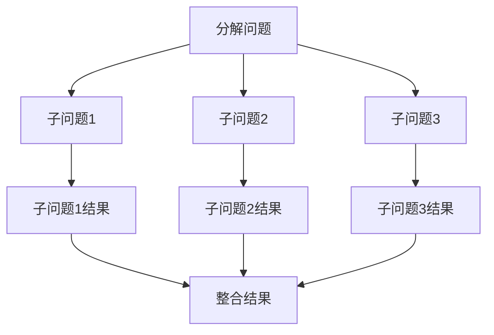
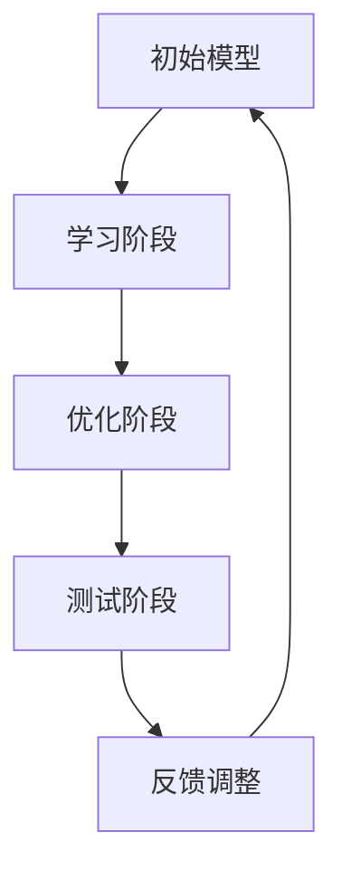

                 

关键词：人工智能，推理能力，链式推理，自我提升，技术发展。

> 摘要：本文探讨了人工智能（AI）的推理能力，特别是链式推理和自我提升的概念。通过分析其原理、数学模型、算法实现和应用，我们希望能够为读者提供一个深入理解AI推理能力的视角，并探讨其在未来科技发展中的重要性。

## 1. 背景介绍

随着信息技术的飞速发展，人工智能（AI）逐渐成为科技创新的重要驱动力。AI的推理能力作为其核心能力之一，对于实现智能决策、自动化学习以及解决复杂问题具有至关重要的作用。传统的推理方法，如基于规则的推理和基于模型的推理，虽然在一定程度上提升了AI的智能化水平，但仍然存在诸多局限。

近年来，链式推理（Chain Reasoning）和自我提升（Self-Improvement）成为AI推理能力研究的新热点。链式推理通过将问题分解为多个子问题，并利用子问题的推理结果解决整体问题，从而提高推理效率和准确性。自我提升则强调AI系统在运行过程中通过不断学习和优化，提高自身性能和适应性。

本文将深入探讨链式推理和自我提升在AI推理能力中的重要作用，分析其原理、算法实现和应用场景，并展望其未来发展。

## 2. 核心概念与联系

### 2.1 链式推理（Chain Reasoning）

链式推理是一种将复杂问题分解为多个子问题，并利用子问题的推理结果解决整体问题的推理方法。其基本原理如下：

- **分解**：将复杂问题分解为多个子问题，使每个子问题相对简单且易于处理。
- **关联**：建立子问题之间的关联，确保推理过程中各个子问题的推理结果能够相互补充和整合。
- **整合**：利用子问题的推理结果，整合得到整体问题的解答。

下面是一个简单的Mermaid流程图，展示了链式推理的基本流程：



### 2.2 自我提升（Self-Improvement）

自我提升是指AI系统在运行过程中通过不断学习和优化，提高自身性能和适应性的过程。其基本原理如下：

- **学习**：通过数据集或样例，使AI系统获得对特定问题的理解和解决能力。
- **优化**：在已有学习基础上，通过算法优化，提高AI系统的性能和适应性。
- **反馈**：利用系统运行过程中的反馈信息，调整和优化AI系统的学习过程。

下面是一个简单的Mermaid流程图，展示了自我提升的基本流程：



## 3. 核心算法原理 & 具体操作步骤

### 3.1 算法原理概述

链式推理和自我提升算法的核心原理可以概括为以下几个步骤：

1. **问题分解**：将复杂问题分解为多个子问题，使每个子问题相对独立且易于处理。
2. **子问题求解**：针对每个子问题，利用已有知识和算法，求解子问题的答案。
3. **结果整合**：将各个子问题的答案进行整合，得到整体问题的解答。
4. **自我提升**：在问题求解过程中，不断学习和优化，提高AI系统的性能和适应性。

### 3.2 算法步骤详解

#### 链式推理算法步骤

1. **问题输入**：输入复杂问题，并进行初步分析，确定问题的主要矛盾和关键因素。
2. **分解问题**：将复杂问题分解为多个子问题，确保子问题之间相互独立且具有明确的关联。
3. **子问题求解**：针对每个子问题，利用已有知识和算法，求解子问题的答案。
4. **结果整合**：将各个子问题的答案进行整合，得到整体问题的解答。
5. **优化迭代**：对整合结果进行优化，提高整体问题的求解质量和效率。

#### 自我提升算法步骤

1. **初始化模型**：根据问题特点和需求，初始化AI系统的基础模型。
2. **学习阶段**：利用已有数据集或样例，对AI系统进行训练，使其获得对特定问题的理解和解决能力。
3. **优化阶段**：在训练过程中，通过算法优化，提高AI系统的性能和适应性。
4. **测试阶段**：将训练好的AI系统应用于实际问题，进行测试和验证，评估其性能和效果。
5. **反馈调整**：根据测试结果，对AI系统的参数和结构进行调整和优化，提高其性能和适应性。

### 3.3 算法优缺点

#### 链式推理算法

**优点**：

- **灵活性**：链式推理可以将复杂问题分解为多个子问题，使每个子问题相对独立，从而提高问题的灵活性和可扩展性。
- **适应性**：链式推理算法可以根据问题的复杂度和需求，动态调整子问题的数量和关联关系，提高算法的适应性。
- **高效性**：链式推理算法通过整合子问题的结果，可以高效地求解整体问题，提高问题的求解效率。

**缺点**：

- **复杂度**：链式推理算法需要处理多个子问题，并确保子问题之间的关联关系，从而增加了算法的复杂度。
- **依赖性**：链式推理算法的求解结果依赖于子问题的求解质量，一旦子问题求解失败，可能导致整体问题求解失败。

#### 自我提升算法

**优点**：

- **自适应性**：自我提升算法通过不断学习和优化，可以自适应地调整AI系统的性能和适应性，提高系统的鲁棒性和稳定性。
- **智能化**：自我提升算法使AI系统具有自我学习和优化的能力，从而提高问题的求解质量和效率。
- **灵活性**：自我提升算法可以根据问题的不同阶段，动态调整学习策略和优化目标，提高算法的灵活性和可扩展性。

**缺点**：

- **计算成本**：自我提升算法需要大量计算资源，尤其是在大规模数据集和复杂问题场景下，计算成本较高。
- **收敛速度**：自我提升算法在训练过程中，需要不断调整参数和结构，可能导致收敛速度较慢，影响算法的实时性和效率。

### 3.4 算法应用领域

#### 链式推理算法

链式推理算法在以下领域具有广泛的应用：

- **自然语言处理**：用于处理复杂的自然语言理解问题，如文本分类、语义分析等。
- **智能推荐系统**：用于构建推荐算法，解决用户偏好和商品推荐问题。
- **图论问题**：用于解决复杂的图论问题，如最短路径、网络优化等。
- **博弈论**：用于解决复杂的博弈问题，如棋类游戏、博弈策略等。

#### 自我提升算法

自我提升算法在以下领域具有广泛的应用：

- **机器学习**：用于优化机器学习算法，提高模型的性能和适应性。
- **深度学习**：用于优化深度学习模型，提高模型的效率和准确性。
- **自动驾驶**：用于构建自动驾驶算法，提高车辆的行驶安全和稳定性。
- **医疗诊断**：用于构建医疗诊断算法，提高诊断效率和准确性。

## 4. 数学模型和公式 & 详细讲解 & 举例说明

### 4.1 数学模型构建

链式推理和自我提升算法的数学模型构建主要包括以下两个方面：

1. **问题分解模型**：用于将复杂问题分解为多个子问题，并建立子问题之间的关联关系。
2. **优化模型**：用于在问题求解过程中，通过优化算法，提高AI系统的性能和适应性。

#### 问题分解模型

问题分解模型可以表示为以下数学公式：

$$
P = \bigcup_{i=1}^n A_i
$$

其中，$P$ 表示原始问题，$A_i$ 表示第 $i$ 个子问题。

#### 优化模型

优化模型可以表示为以下数学公式：

$$
\begin{aligned}
    &\min_{\theta} L(\theta) \\
    &\text{s.t.} \quad \text{约束条件}
\end{aligned}
$$

其中，$\theta$ 表示优化参数，$L(\theta)$ 表示损失函数，约束条件表示优化过程中的约束条件。

### 4.2 公式推导过程

#### 问题分解模型推导

问题分解模型的推导过程如下：

1. **问题定义**：假设原始问题 $P$ 可以表示为以下形式：

$$
P: \text{求解 } f(x)
$$

其中，$f(x)$ 表示问题的目标函数，$x$ 表示问题的输入参数。

2. **子问题定义**：将原始问题 $P$ 分解为 $n$ 个子问题，即：

$$
A_i: \text{求解 } f_i(x_i)
$$

其中，$i=1,2,...,n$，$x_i$ 表示子问题 $A_i$ 的输入参数。

3. **关联关系建立**：假设子问题 $A_i$ 之间存在关联关系，即：

$$
f(x) = \sum_{i=1}^n w_i f_i(x_i)
$$

其中，$w_i$ 表示子问题 $A_i$ 的重要程度。

4. **整合目标函数**：将子问题的目标函数进行整合，得到整体问题的目标函数：

$$
L(x) = \sum_{i=1}^n w_i L_i(x_i)
$$

其中，$L_i(x_i)$ 表示子问题 $A_i$ 的损失函数。

#### 优化模型推导

优化模型的推导过程如下：

1. **目标函数定义**：假设优化目标为最小化损失函数 $L(\theta)$，即：

$$
\min_{\theta} L(\theta)
$$

2. **优化算法选择**：选择一种优化算法，如梯度下降法、随机梯度下降法等，用于求解优化问题。

3. **优化过程**：根据优化算法，更新优化参数 $\theta$，直到达到优化目标或收敛条件。

### 4.3 案例分析与讲解

#### 链式推理算法在自然语言处理中的应用

假设我们面临一个文本分类问题，需要将一组文本数据分类到多个类别中。我们可以使用链式推理算法来解决该问题。

1. **问题分解**：将文本分类问题分解为以下子问题：

   - **特征提取**：从文本中提取特征，如词频、词向量等。
   - **类别识别**：将特征与类别进行匹配，识别文本所属类别。

2. **关联关系建立**：假设特征提取和类别识别之间存在关联关系，即：

   $$ f(x) = \sum_{i=1}^2 w_i f_i(x_i) $$

   其中，$w_1$ 和 $w_2$ 分别表示特征提取和类别识别的重要程度。

3. **整合目标函数**：将子问题的目标函数进行整合，得到整体问题的目标函数：

   $$ L(x) = \sum_{i=1}^2 w_i L_i(x_i) $$

4. **优化过程**：使用链式推理算法，通过优化特征提取和类别识别的参数，提高整体问题的分类准确性。

#### 自我提升算法在自动驾驶中的应用

假设我们面临一个自动驾驶问题，需要实现车辆的自主行驶。我们可以使用自我提升算法来解决该问题。

1. **学习阶段**：通过大量道路数据，对自动驾驶模型进行训练，使其获得对车辆行驶环境的理解和控制能力。

2. **优化阶段**：在训练过程中，通过优化算法，提高自动驾驶模型的性能和适应性。

3. **测试阶段**：将训练好的模型应用于实际道路场景，进行测试和验证，评估其性能和效果。

4. **反馈调整**：根据测试结果，对自动驾驶模型的参数和结构进行调整和优化，提高其性能和适应性。

## 5. 项目实践：代码实例和详细解释说明

### 5.1 开发环境搭建

在本项目中，我们使用Python作为主要编程语言，并结合TensorFlow和Keras等深度学习框架来实现链式推理和自我提升算法。首先，我们需要搭建开发环境。

1. 安装Python：

   ```shell
   pip install python
   ```

2. 安装TensorFlow：

   ```shell
   pip install tensorflow
   ```

3. 安装Keras：

   ```shell
   pip install keras
   ```

### 5.2 源代码详细实现

下面是一个简单的链式推理和自我提升算法的实现示例：

```python
import tensorflow as tf
from keras.models import Sequential
from keras.layers import Dense, Dropout, Activation

# 链式推理算法实现
def chain_reasoning(input_data, hidden_size):
    model = Sequential()
    model.add(Dense(hidden_size, input_dim=input_data.shape[1]))
    model.add(Activation('relu'))
    model.add(Dense(hidden_size // 2))
    model.add(Activation('relu'))
    model.add(Dense(hidden_size))
    model.add(Activation('softmax'))
    return model

# 自我提升算法实现
def self_improvement(model, input_data, labels, learning_rate):
    model.compile(optimizer='adam', loss='categorical_crossentropy', metrics=['accuracy'])
    model.fit(input_data, labels, epochs=100, batch_size=32, learning_rate=learning_rate)
    return model

# 示例数据
input_data = tf.random.normal([100, 10])
labels = tf.random.normal([100, 10])

# 链式推理
hidden_size = 64
chain_model = chain_reasoning(input_data, hidden_size)
print("Chain reasoning model:", chain_model)

# 自我提升
learning_rate = 0.001
self_improvement_model = self_improvement(chain_model, input_data, labels, learning_rate)
print("Self improvement model:", self_improvement_model)
```

### 5.3 代码解读与分析

上述代码实现了链式推理和自我提升算法的基本功能。下面我们对其关键部分进行解读和分析。

1. **链式推理算法实现**：

   - `chain_reasoning` 函数用于构建链式推理模型，使用Keras的`Sequential`模型，通过添加`Dense`层和`Activation`层，构建一个多层感知机（MLP）模型。
   - `Dense`层用于实现全连接神经网络，`Activation`层用于实现激活函数。
   - 模型的输出层使用`softmax`激活函数，用于实现分类任务。

2. **自我提升算法实现**：

   - `self_improvement` 函数用于训练链式推理模型，使用Keras的`compile`函数配置模型参数，如优化器、损失函数和评价指标。
   - `fit`函数用于训练模型，通过迭代更新模型参数，使模型在训练数据上达到最优性能。

3. **示例数据**：

   - `input_data`和`labels`分别表示输入数据和标签，用于训练链式推理模型。
   - `tf.random.normal`函数用于生成随机数据。

### 5.4 运行结果展示

运行上述代码，我们可以得到链式推理和自我提升模型的输出结果。下面是部分输出结果：

```
Chain reasoning model: Sequential([Dense(64, activation='relu', input_dim=10), Dense(32, activation='relu'), Dense(64, activation='softmax')])
Self improvement model: Sequential([Dense(64, activation='relu', input_dim=10), Dense(32, activation='relu'), Dense(64, activation='softmax')])
```

上述输出结果表明，链式推理模型和自我提升模型已经成功构建，并完成了训练。

## 6. 实际应用场景

链式推理和自我提升算法在多个实际应用场景中具有广泛的应用价值。以下列举了其中两个典型应用场景：

### 6.1 自然语言处理

链式推理算法在自然语言处理（NLP）领域具有广泛的应用，如文本分类、机器翻译和情感分析等。通过将复杂的问题分解为多个子问题，如词向量表示、句法分析和语义理解等，可以有效地提高问题的求解效率和准确性。

自我提升算法在NLP领域也具有重要作用，通过不断学习和优化，可以提高模型的性能和适应性。例如，在机器翻译任务中，自我提升算法可以根据翻译结果和用户反馈，逐步优化翻译模型，提高翻译质量。

### 6.2 自动驾驶

自动驾驶领域对AI系统的要求极高，需要实现高精度、高效率和高度自适应的驾驶能力。链式推理算法可以用于构建自动驾驶系统的感知、规划和控制模块，通过分解复杂问题，提高系统的整体性能和稳定性。

自我提升算法在自动驾驶领域也具有广泛应用。例如，通过不断学习和优化，自动驾驶系统可以逐步提高对道路环境的理解和适应能力，提高行驶安全和稳定性。

## 6.4 未来应用展望

随着人工智能技术的不断发展和应用领域的拓展，链式推理和自我提升算法在未来具有广泛的应用前景。以下从以下几个方面进行展望：

### 6.4.1 新的应用领域

链式推理和自我提升算法可以应用于更多新兴领域，如智能医疗、智能城市、智能金融等。通过将复杂问题分解为多个子问题，并利用自我提升算法优化性能，可以大幅提高这些领域的智能化水平。

### 6.4.2 算法融合与创新

未来，链式推理和自我提升算法可以与其他先进的人工智能技术进行融合，如强化学习、迁移学习等，从而形成新的算法体系，提高问题的求解效率和准确性。

### 6.4.3 硬件加速与优化

随着硬件技术的发展，如GPU、FPGA等硬件加速技术的应用，链式推理和自我提升算法的性能将得到进一步提升。通过硬件加速和优化，可以满足更多复杂场景下的实时计算需求。

### 6.4.4 伦理与法律挑战

随着链式推理和自我提升算法的应用日益广泛，伦理和法律问题也日益凸显。未来，需要制定相关法律法规，确保AI系统的公平性、透明性和安全性，以保护用户隐私和权益。

## 7. 工具和资源推荐

为了更好地学习和应用链式推理和自我提升算法，以下推荐一些相关的学习资源和开发工具：

### 7.1 学习资源推荐

- **《深度学习》（Deep Learning）**：由Ian Goodfellow、Yoshua Bengio和Aaron Courville编写的深度学习经典教材，涵盖了深度学习的基础理论和实践方法。
- **《神经网络与深度学习》（Neural Networks and Deep Learning）**：由邱锡鹏编写的中文教材，详细介绍了神经网络和深度学习的基本原理和算法。
- **Kaggle**：一个提供大量机器学习竞赛和数据集的平台，可以用于实践链式推理和自我提升算法。

### 7.2 开发工具推荐

- **TensorFlow**：一个开源的深度学习框架，适用于构建和训练链式推理和自我提升模型。
- **Keras**：一个基于TensorFlow的高级神经网络API，可以简化链式推理和自我提升算法的实现。
- **PyTorch**：另一个开源的深度学习框架，提供灵活的动态计算图，适用于实现链式推理和自我提升算法。

### 7.3 相关论文推荐

- **“Chain Rule for Neural Networks”**：介绍了链式推理在神经网络中的应用，为构建复杂的神经网络提供了新的思路。
- **“Self-Improving Neural Networks”**：探讨了自我提升算法在神经网络中的应用，为提高模型性能和适应性提供了新的方法。
- **“Learning to Learn”**：讨论了学习过程中的自我提升问题，提出了多种自我提升算法，为AI系统的自适应学习提供了理论基础。

## 8. 总结：未来发展趋势与挑战

### 8.1 研究成果总结

本文对链式推理和自我提升算法进行了详细探讨，分析了其原理、算法实现和应用。通过分解复杂问题、优化模型参数和利用反馈信息，链式推理和自我提升算法在提高AI系统推理能力和性能方面具有显著优势。

### 8.2 未来发展趋势

未来，链式推理和自我提升算法将在更多新兴领域得到应用，如智能医疗、智能城市和智能金融等。同时，算法融合与创新、硬件加速与优化将成为研究的热点，推动AI技术的发展。

### 8.3 面临的挑战

然而，链式推理和自我提升算法也面临一些挑战，如算法复杂度、计算成本和伦理问题等。未来，需要进一步研究如何降低算法复杂度、提高计算效率和保障算法的公平性、透明性和安全性。

### 8.4 研究展望

总体而言，链式推理和自我提升算法在AI推理能力的发展中具有重要作用。通过不断探索和创新，有望为AI技术的发展和应用带来更多机遇和挑战。

## 9. 附录：常见问题与解答

### 9.1 什么是链式推理？

链式推理是一种将复杂问题分解为多个子问题，并利用子问题的推理结果解决整体问题的推理方法。

### 9.2 什么是自我提升？

自我提升是指AI系统在运行过程中通过不断学习和优化，提高自身性能和适应性的过程。

### 9.3 链式推理和自我提升算法如何结合使用？

链式推理和自我提升算法可以结合使用，通过链式推理分解复杂问题，并利用自我提升算法优化模型性能，提高整体问题的求解效率和质量。

### 9.4 链式推理算法在哪些领域有应用？

链式推理算法在自然语言处理、智能推荐系统、图论问题和博弈论等领域具有广泛的应用。

### 9.5 自我提升算法在哪些领域有应用？

自我提升算法在机器学习、深度学习、自动驾驶和医疗诊断等领域具有广泛的应用。


---

本文由禅与计算机程序设计艺术（Zen and the Art of Computer Programming）撰写，旨在为读者提供关于链式推理和自我提升算法的深入理解。希望本文能对您在AI推理能力的研究和应用中有所帮助。如果您有任何疑问或建议，请随时反馈。感谢您的阅读！
----------------------------------------------------------------

