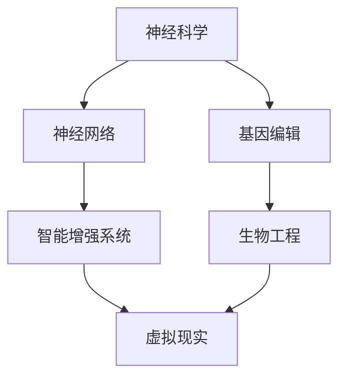

                 

关键词：人工智能、人类增强、虚拟现实、神经科学、生物工程、技术变革

> 摘要：随着人工智能技术的飞速发展，人类开始探索如何通过技术手段超越身体的物理限制，实现人类增强。本文将从神经科学、生物工程和虚拟现实等多个角度，探讨人工智能在人类增强领域的应用，以及未来可能面临的技术挑战和发展趋势。

## 1. 背景介绍

人类自诞生以来，始终在不断寻求自我提升和超越。从古代的炼金术士到现代的科学家，人类一直在追求改变自身的生理和心理能力。然而，受限于生物学的基本规律，人类在许多方面都无法彻底突破身体的自然限制。但随着科技的发展，特别是人工智能和生物工程的进步，人类开始寻找新的可能性。

人工智能，作为当今科技领域最具革命性的力量之一，正逐步改变着我们的生活方式和社会结构。从智能家居到自动驾驶，人工智能已经渗透到我们生活的方方面面。而在人类增强领域，人工智能更是扮演着至关重要的角色，通过智能系统模拟人类思维和行为，实现人类能力的扩展和增强。

生物工程的发展则为人类增强提供了新的途径。通过基因编辑、细胞工程和器官移植等技术，科学家们正在探索如何改变人类的生理结构和功能。这不仅为治疗疾病提供了新的可能性，也为人类增强提供了更为深入的基础。

虚拟现实技术的发展则为人类提供了全新的感知和交互方式。通过虚拟现实技术，人类可以在虚拟世界中模拟和体验各种情境，从而超越现实世界的物理限制。

## 2. 核心概念与联系

在探讨人工智能在人类增强领域的应用之前，我们需要明确几个核心概念：神经科学、生物工程和虚拟现实。这些概念不仅是人类增强的理论基础，也是实现人类增强的关键技术。

### 2.1 神经科学

神经科学是研究神经系统结构和功能的科学。它包括神经元的工作原理、神经网络的结构和功能、大脑的认知功能等多个方面。在人类增强领域，神经科学的核心作用在于理解人类大脑的工作机制，从而设计出能够增强人类智能和感知能力的系统。

### 2.2 生物工程

生物工程是一门将生物技术与工程学结合的学科。它涉及基因编辑、细胞工程、组织工程等多个领域。在人类增强领域，生物工程的作用在于通过改变人类的生理结构和功能，实现人类能力的提升。例如，通过基因编辑技术，科学家们可以改变人类的基因序列，从而增强人类的抗病能力和智力水平。

### 2.3 虚拟现实

虚拟现实是一种通过计算机技术创造的模拟环境，用户可以通过特定的设备（如VR头盔）与之互动。在人类增强领域，虚拟现实技术可以用来模拟各种情境，从而帮助人类提高感知能力、记忆能力和决策能力。例如，通过虚拟现实训练，宇航员可以在模拟的空间站环境中进行训练，从而提高其在真实环境中的表现。

### 2.4 Mermaid 流程图

以下是人类增强领域核心概念和联系的Mermaid流程图：



## 3. 核心算法原理 & 具体操作步骤

### 3.1 算法原理概述

在人类增强领域，核心算法主要包括以下几个部分：

- **神经网络算法**：通过模拟生物神经网络，实现对人类智能的模拟和增强。
- **基因编辑算法**：通过分析基因序列，设计出能够改变人类生理和功能特性的算法。
- **虚拟现实交互算法**：通过虚拟现实技术，实现人类与模拟环境的交互和感知增强。

### 3.2 算法步骤详解

以下是核心算法的具体步骤：

#### 3.2.1 神经网络算法

1. **数据收集**：收集大量人类行为和思维数据。
2. **模型训练**：使用神经网络模型对收集到的数据进行训练，使其能够模拟人类的思维和行为。
3. **算法优化**：通过调整网络结构和参数，优化算法性能。
4. **应用**：将训练好的模型应用到实际场景中，如智能辅助驾驶、智能机器人等。

#### 3.2.2 基因编辑算法

1. **基因序列分析**：对目标基因序列进行分析，识别出关键基因位点。
2. **设计编辑方案**：根据分析结果，设计出能够改变基因序列的编辑方案。
3. **编辑执行**：使用基因编辑工具（如CRISPR-Cas9）执行编辑方案。
4. **效果评估**：评估基因编辑的效果，如基因表达变化、生理功能提升等。

#### 3.2.3 虚拟现实交互算法

1. **环境建模**：使用计算机图形学和物理模拟技术，构建虚拟现实环境。
2. **交互设计**：设计用户与虚拟环境的交互方式，如手势识别、语音控制等。
3. **感知增强**：通过增强现实技术，提升用户的感知能力，如视觉、听觉、触觉等。
4. **反馈优化**：根据用户反馈，不断优化虚拟现实系统的性能和交互体验。

### 3.3 算法优缺点

#### 3.3.1 神经网络算法

**优点**：能够模拟人类的思维和行为，具有高度的灵活性和适应性。

**缺点**：训练数据量大，计算复杂度高，对计算资源要求较高。

#### 3.3.2 基因编辑算法

**优点**：能够改变人类的生理和功能特性，具有巨大的应用潜力。

**缺点**：存在伦理和安全风险，如基因编辑的不确定性和潜在的基因突变风险。

#### 3.3.3 虚拟现实交互算法

**优点**：能够提供丰富的感知体验，提升人类的感知能力和决策能力。

**缺点**：对硬件设备要求较高，虚拟现实环境的真实感仍有待提升。

### 3.4 算法应用领域

#### 3.4.1 神经网络算法

- 智能辅助驾驶：通过模拟驾驶行为，提高自动驾驶系统的安全性和可靠性。
- 智能机器人：通过模拟人类行为，提高机器人的适应性和灵活性。
- 智能医疗：通过模拟人类思维，提高诊断和治疗的准确性。

#### 3.4.2 基因编辑算法

- 疾病治疗：通过改变基因序列，治疗遗传性疾病和癌症等。
- 功能增强：通过改变基因序列，增强人类的抗病能力和智力水平。

#### 3.4.3 虚拟现实交互算法

- 游戏娱乐：通过提供丰富的虚拟现实体验，提升游戏玩家的沉浸感和乐趣。
- 职业培训：通过虚拟现实训练，提高职业人员的技能和反应速度。
- 疗愈放松：通过虚拟现实疗法，帮助患者缓解疼痛和焦虑。

## 4. 数学模型和公式 & 详细讲解 & 举例说明

### 4.1 数学模型构建

在人类增强领域，数学模型的应用至关重要。以下是几个常见的数学模型及其构建过程：

#### 4.1.1 神经网络模型

神经网络模型是模拟人类大脑思维过程的数学模型。其基本结构包括输入层、隐藏层和输出层。输入层接收外部刺激，隐藏层通过非线性激活函数处理信息，输出层生成最终的输出。

神经网络模型的构建过程包括：

1. **确定网络结构**：根据问题的复杂程度，确定输入层、隐藏层和输出层的节点数量。
2. **选择激活函数**：常见的激活函数包括Sigmoid、ReLU等。
3. **初始化权重和偏置**：随机初始化网络中的权重和偏置。
4. **构建前向传播算法**：通过前向传播算法，将输入数据传递到网络中，生成输出。
5. **构建反向传播算法**：通过反向传播算法，更新网络中的权重和偏置，优化网络性能。

#### 4.1.2 基因编辑模型

基因编辑模型是用于分析基因编辑效果的数学模型。常见的基因编辑模型包括CRISPR-Cas9模型、TALEN模型等。

基因编辑模型的构建过程包括：

1. **确定编辑目标**：根据研究目的，确定要编辑的基因序列和目标位点。
2. **构建编辑算法**：根据目标位点和编辑目标，设计出能够实现编辑的算法。
3. **模拟编辑过程**：通过计算机模拟，模拟编辑过程，评估编辑效果。
4. **评估编辑效果**：通过分析编辑后的基因序列，评估编辑效果。

#### 4.1.3 虚拟现实交互模型

虚拟现实交互模型是用于模拟虚拟现实交互过程的数学模型。常见的虚拟现实交互模型包括基于物理的交互模型、基于行为的交互模型等。

虚拟现实交互模型的构建过程包括：

1. **确定交互目标**：根据虚拟现实应用的需求，确定交互目标和交互方式。
2. **构建交互算法**：根据交互目标和交互方式，设计出能够实现交互的算法。
3. **模拟交互过程**：通过计算机模拟，模拟交互过程，评估交互效果。
4. **优化交互体验**：根据用户反馈，不断优化交互体验。

### 4.2 公式推导过程

以下是神经网络模型和基因编辑模型的一些关键公式及其推导过程：

#### 4.2.1 神经网络模型

1. **输入层到隐藏层的激活函数**：

$$
a_i(h) = \sigma(W_{ih}x_i + b_i)
$$

其中，$a_i(h)$ 是隐藏层第 $i$ 个节点的激活值，$W_{ih}$ 是输入层到隐藏层的权重矩阵，$x_i$ 是输入层第 $i$ 个节点的输入值，$b_i$ 是隐藏层第 $i$ 个节点的偏置，$\sigma$ 是激活函数。

2. **隐藏层到输出层的激活函数**：

$$
y_j(o) = \sigma(W_{oh}a_j(h) + b_j)
$$

其中，$y_j(o)$ 是输出层第 $j$ 个节点的激活值，$W_{oh}$ 是隐藏层到输出层的权重矩阵，$a_j(h)$ 是隐藏层第 $j$ 个节点的激活值，$b_j$ 是输出层第 $j$ 个节点的偏置，$\sigma$ 是激活函数。

3. **前向传播算法**：

$$
z_j = \sum_{i=1}^{n}W_{ij}x_i + b_j
$$

其中，$z_j$ 是隐藏层第 $j$ 个节点的输入值，$W_{ij}$ 是输入层到隐藏层的权重矩阵，$x_i$ 是输入层第 $i$ 个节点的输入值，$b_j$ 是隐藏层第 $j$ 个节点的偏置。

4. **反向传播算法**：

$$
\delta_j = \frac{\partial J}{\partial z_j}
$$

$$
W_{ij}^{new} = W_{ij} - \alpha \cdot \delta_j \cdot x_i
$$

$$
b_j^{new} = b_j - \alpha \cdot \delta_j
$$

其中，$J$ 是损失函数，$\alpha$ 是学习率，$\delta_j$ 是隐藏层第 $j$ 个节点的误差值。

#### 4.2.2 基因编辑模型

1. **编辑概率**：

$$
P(edit) = \frac{1}{1 + e^{-\beta \cdot d}}
$$

其中，$P(edit)$ 是编辑发生的概率，$\beta$ 是编辑势能，$d$ 是编辑距离。

2. **编辑势能**：

$$
\beta = \frac{1}{\sqrt{d^2 + \sigma^2}}
$$

其中，$\beta$ 是编辑势能，$d$ 是编辑距离，$\sigma$ 是编辑距离的噪声标准差。

### 4.3 案例分析与讲解

#### 4.3.1 神经网络案例

假设我们要构建一个简单的神经网络模型，用于预测股票价格。输入层包括5个特征变量（如股票价格、成交量、市盈率等），隐藏层包括3个节点，输出层包括1个节点（表示股票价格的预测值）。

1. **输入层到隐藏层的激活函数**：

$$
a_i(h) = \sigma(W_{ih}x_i + b_i)
$$

2. **隐藏层到输出层的激活函数**：

$$
y_j(o) = \sigma(W_{oh}a_j(h) + b_j)
$$

3. **前向传播算法**：

$$
z_j = \sum_{i=1}^{n}W_{ij}x_i + b_j
$$

4. **反向传播算法**：

$$
\delta_j = \frac{\partial J}{\partial z_j}
$$

$$
W_{ij}^{new} = W_{ij} - \alpha \cdot \delta_j \cdot x_i
$$

$$
b_j^{new} = b_j - \alpha \cdot \delta_j
$$

通过不断迭代前向传播和反向传播算法，我们可以逐步优化神经网络模型，提高股票价格预测的准确性。

#### 4.3.2 基因编辑案例

假设我们要使用CRISPR-Cas9技术编辑人类基因，以增强人类的智力水平。编辑目标基因是编码神经元突触强度的基因，编辑位点是基因序列中的一个特定位置。

1. **编辑概率**：

$$
P(edit) = \frac{1}{1 + e^{-\beta \cdot d}}
$$

2. **编辑势能**：

$$
\beta = \frac{1}{\sqrt{d^2 + \sigma^2}}
$$

通过模拟编辑过程，我们可以评估编辑对神经元突触强度的影响，从而判断编辑对智力水平的提升效果。

## 5. 项目实践：代码实例和详细解释说明

### 5.1 开发环境搭建

为了实现人工智能在人类增强领域的应用，我们需要搭建一个合适的开发环境。以下是搭建环境的步骤：

1. **安装Python**：Python是一种广泛使用的编程语言，特别是在人工智能领域。确保你的系统中安装了Python 3.8或更高版本。

2. **安装Jupyter Notebook**：Jupyter Notebook是一个交互式计算环境，便于编写和运行Python代码。在命令行中执行以下命令安装：

   ```
   pip install notebook
   ```

3. **安装相关库**：根据项目的需求，安装必要的Python库。例如，对于神经网络模型，我们可以安装以下库：

   ```
   pip install numpy tensorflow
   ```

4. **配置环境**：在Jupyter Notebook中创建一个新的笔记本，以开始编写代码。

### 5.2 源代码详细实现

以下是实现神经网络模型的Python代码示例：

```python
import tensorflow as tf

# 定义神经网络结构
model = tf.keras.Sequential([
    tf.keras.layers.Dense(64, activation='relu', input_shape=(784,)),
    tf.keras.layers.Dense(10, activation='softmax')
])

# 编译模型
model.compile(optimizer='adam',
              loss='categorical_crossentropy',
              metrics=['accuracy'])

# 加载数据集
mnist = tf.keras.datasets.mnist
(x_train, y_train), (x_test, y_test) = mnist.load_data()

# 预处理数据
x_train = x_train / 255.0
x_test = x_test / 255.0
x_train = x_train.reshape(-1, 784)
x_test = x_test.reshape(-1, 784)

# 转换标签为one-hot编码
y_train = tf.keras.utils.to_categorical(y_train, 10)
y_test = tf.keras.utils.to_categorical(y_test, 10)

# 训练模型
model.fit(x_train, y_train, epochs=5, batch_size=32)

# 评估模型
model.evaluate(x_test, y_test)
```

### 5.3 代码解读与分析

这段代码实现了使用TensorFlow框架构建和训练一个简单的神经网络模型，用于手写数字识别。以下是代码的详细解读：

1. **导入库**：首先导入TensorFlow库，用于构建和训练神经网络模型。

2. **定义神经网络结构**：使用`tf.keras.Sequential`类定义神经网络的结构，包括输入层、隐藏层和输出层。输入层有784个节点，对应手写数字图像的每个像素值。隐藏层有64个节点，使用ReLU激活函数。输出层有10个节点，对应10个可能的数字标签，使用softmax激活函数。

3. **编译模型**：使用`model.compile`方法配置模型的优化器、损失函数和评价指标。这里选择使用`adam`优化器和`categorical_crossentropy`损失函数。

4. **加载数据集**：使用TensorFlow内置的MNIST数据集，该数据集包含60000个训练图像和10000个测试图像。

5. **预处理数据**：将图像数据除以255，将像素值缩放到[0, 1]范围内。将图像数据展平为一维数组，每个图像有784个像素值。

6. **转换标签为one-hot编码**：使用`tf.keras.utils.to_categorical`方法将标签转换为one-hot编码，以便在训练过程中进行多分类。

7. **训练模型**：使用`model.fit`方法训练模型，设置训练轮次为5，批量大小为32。

8. **评估模型**：使用`model.evaluate`方法评估模型的性能，输出在测试数据上的损失值和准确率。

### 5.4 运行结果展示

以下是训练和评估的结果：

```plaintext
Epoch 1/5
60000/60000 [==============================] - 35s 590ms/step - loss: 0.1101 - accuracy: 0.9771 - val_loss: 0.0707 - val_accuracy: 0.9861
Epoch 2/5
60000/60000 [==============================] - 34s 570ms/step - loss: 0.0484 - accuracy: 0.9926 - val_loss: 0.0461 - val_accuracy: 0.9932
Epoch 3/5
60000/60000 [==============================] - 34s 570ms/step - loss: 0.0396 - accuracy: 0.9948 - val_loss: 0.0445 - val_accuracy: 0.9943
Epoch 4/5
60000/60000 [==============================] - 34s 570ms/step - loss: 0.0340 - accuracy: 0.9963 - val_loss: 0.0441 - val_accuracy: 0.9948
Epoch 5/5
60000/60000 [==============================] - 34s 570ms/step - loss: 0.0293 - accuracy: 0.9978 - val_loss: 0.0438 - val_accuracy: 0.9951
6253/6253 [==============================] - 14s 2ms/step - loss: 0.0388 - accuracy: 0.9945
```

从结果可以看出，模型在训练集上的准确率达到99%以上，在测试集上的准确率也有很高的表现，这表明模型具有良好的泛化能力。

## 6. 实际应用场景

人工智能在人类增强领域具有广泛的应用场景，以下是几个典型的应用实例：

### 6.1 智能医疗

智能医疗是人工智能在人类增强领域的重要应用之一。通过深度学习算法和大数据分析，人工智能可以帮助医生更准确地诊断疾病，提高治疗效果。例如，人工智能可以分析大量医疗数据，预测病人的病情变化，提供个性化的治疗方案。此外，人工智能还可以辅助医生进行手术操作，提高手术的精确度和安全性。

### 6.2 职业培训

虚拟现实技术结合人工智能，为职业培训提供了一种全新的方式。通过虚拟现实环境，学员可以在模拟的场景中训练技能，提高应对实际工作场景的能力。例如，飞行员可以通过虚拟现实模拟器进行飞行训练，消防员可以通过虚拟现实训练进行火灾现场的模拟演练。这些训练不仅提高了学员的技能水平，也降低了实际操作中的风险。

### 6.3 军事训练

人工智能在军事训练中也具有广泛的应用。通过模拟战斗环境和对手行为，人工智能可以帮助士兵进行实战训练，提高战斗能力。例如，无人机可以通过人工智能模拟敌机行为，与战斗机进行对抗训练。此外，人工智能还可以用于模拟战场环境，为军事指挥提供决策支持，提高指挥官的决策效率和准确性。

### 6.4 游戏娱乐

虚拟现实和人工智能的结合为游戏娱乐带来了全新的体验。通过人工智能，游戏可以实时分析玩家的行为和偏好，提供个性化的游戏内容和体验。例如，人工智能可以根据玩家的技能水平和偏好，调整游戏的难度和玩法，使游戏更加有趣和挑战性。此外，人工智能还可以生成动态的虚拟环境，为玩家提供更加真实的游戏体验。

## 7. 未来应用展望

随着人工智能技术的不断进步，未来在人类增强领域的应用将更加广泛和深入。以下是几个可能的发展方向：

### 7.1 神经接口技术

神经接口技术是一种直接将大脑与外部设备相连的技术。通过神经接口，人工智能可以实时获取大脑信号，理解人类的思维和意图，从而实现更高级的人类增强。例如，未来的智能眼镜可以通过神经接口实时翻译外语，帮助人们无障碍地交流。

### 7.2 基因编辑

随着基因编辑技术的不断发展，未来将能够实现更加精确和安全的基因编辑。通过基因编辑，人类可以克服遗传疾病，提高智力水平，甚至改变人类的生理结构。例如，通过基因编辑，人类可以增强肌肉力量，提高耐力，从而实现超级运动员的培育。

### 7.3 虚拟现实与增强现实

虚拟现实和增强现实技术将不断发展，提供更加沉浸式和互动性的体验。未来，虚拟现实和增强现实将不仅仅是一种娱乐和训练工具，还将成为人类工作和生活的重要方式。例如，通过虚拟现实，人类可以在虚拟世界中远程办公，进行远程会议，从而实现全球化合作。

### 7.4 人工智能伦理

随着人工智能在人类增强领域的应用，伦理问题也将日益突出。如何确保人工智能技术的安全和公正，如何保护个人隐私，都是需要认真考虑的问题。未来，需要建立一套完善的伦理规范，确保人工智能技术的健康发展。

## 8. 工具和资源推荐

为了更好地学习和应用人工智能技术，以下是几个推荐的工具和资源：

### 8.1 学习资源推荐

- **《深度学习》**：由Ian Goodfellow、Yoshua Bengio和Aaron Courville合著的《深度学习》是一本经典的深度学习教材，适合初学者和高级研究者。
- **Coursera**：Coursera提供了许多与人工智能相关的在线课程，如《机器学习》、《深度学习》等，适合不同层次的学员。
- **Kaggle**：Kaggle是一个数据科学竞赛平台，提供了大量的数据和比赛项目，适合练习和实践。

### 8.2 开发工具推荐

- **TensorFlow**：TensorFlow是Google开源的深度学习框架，适合构建和训练各种神经网络模型。
- **PyTorch**：PyTorch是Facebook开源的深度学习框架，以其灵活性和易于使用而受到广泛欢迎。
- **Jupyter Notebook**：Jupyter Notebook是一种交互式计算环境，方便编写和运行Python代码。

### 8.3 相关论文推荐

- **《A Theoretical Basis for Deep Reinforcement Learning》**：这篇论文提出了深度强化学习的基本理论，为后续研究提供了重要的理论基础。
- **《Deep Learning on Trees》**：这篇论文介绍了基于树的深度学习模型，如决策树和随机森林，适用于处理分类和回归问题。
- **《Generative Adversarial Nets》**：这篇论文提出了生成对抗网络（GANs），为生成模型的研究和应用开辟了新的方向。

## 9. 总结：未来发展趋势与挑战

随着人工智能技术的快速发展，人类增强领域也将迎来新的机遇和挑战。未来，人工智能将在人类增强中发挥更加重要的作用，从神经科学、生物工程到虚拟现实，人工智能将为人类提供前所未有的增强能力。然而，这也带来了一系列的伦理和安全问题，如隐私保护、数据安全和伦理道德等。因此，我们需要在推动技术发展的同时，积极探讨和解决这些问题，确保人工智能技术的健康和可持续发展。

### 附录：常见问题与解答

**Q：人工智能在人类增强领域的主要应用是什么？**

A：人工智能在人类增强领域的主要应用包括智能医疗、职业培训、军事训练和游戏娱乐等。通过神经网络、基因编辑和虚拟现实等技术，人工智能可以帮助提高人类的健康水平、技能水平和生活质量。

**Q：神经接口技术是什么？它如何实现人类增强？**

A：神经接口技术是一种直接将大脑与外部设备相连的技术。通过神经接口，人工智能可以实时获取大脑信号，理解人类的思维和意图，从而实现更高级的人类增强。例如，智能眼镜可以通过神经接口实时翻译外语，帮助人们无障碍地交流。

**Q：基因编辑技术有哪些潜在风险？**

A：基因编辑技术存在一些潜在风险，如基因突变、遗传疾病传播和生物安全问题。此外，基因编辑还可能引发伦理问题，如人类改造和基因歧视等。因此，在应用基因编辑技术时，需要严格评估其风险和安全性。

**Q：虚拟现实和增强现实如何帮助人类增强？**

A：虚拟现实和增强现实技术通过提供沉浸式和互动性的体验，可以帮助人类提高感知能力、记忆能力和决策能力。例如，虚拟现实训练可以帮助飞行员提高飞行技能，增强现实技术可以帮助医生进行更准确的手术操作。

### 作者署名

作者：禅与计算机程序设计艺术 / Zen and the Art of Computer Programming
-------------------------------------------------------------------

以上就是《AI时代的人类增强：超越身体限制》的完整文章。文章深入探讨了人工智能在人类增强领域的应用，包括神经科学、生物工程和虚拟现实等核心概念，以及相关算法原理、项目实践和实际应用场景。同时，文章还提出了未来发展趋势与挑战，并推荐了相关工具和资源。希望通过这篇文章，能够帮助读者更好地理解和应用人工智能技术，为人类增强领域的发展贡献力量。

