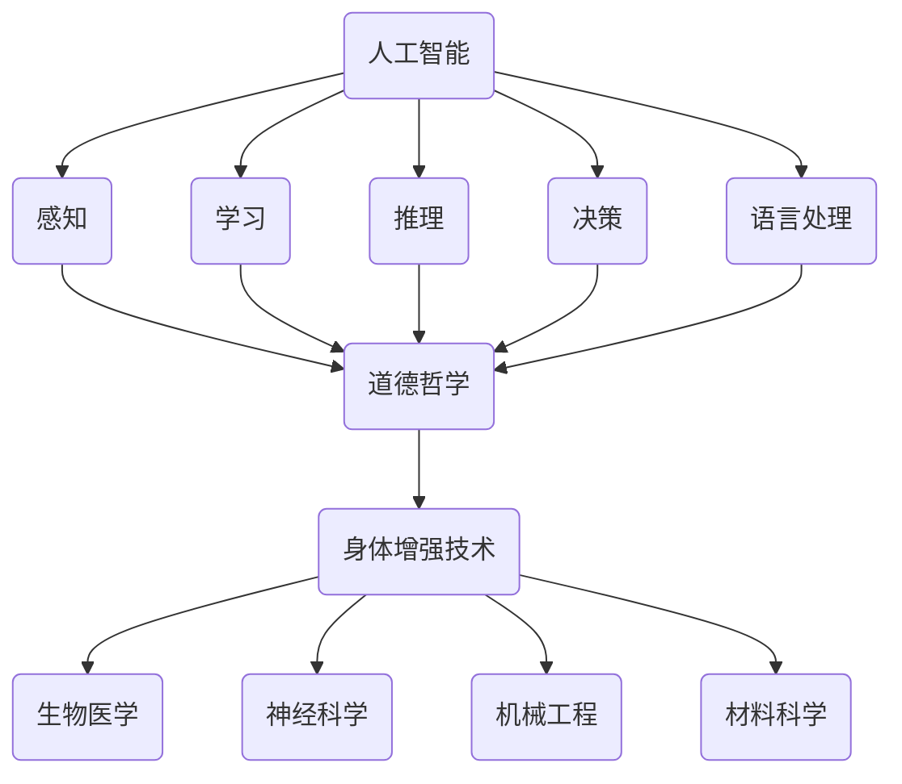

                 

关键词：人工智能，人类增强，道德考虑，身体增强，未来趋势，挑战

> 摘要：本文探讨了人工智能时代下人类增强的道德考虑与身体增强的未来趋势与挑战。通过分析当前的技术发展状况、核心概念与架构、算法原理与应用、数学模型与公式推导、项目实践及实际应用场景，本文提出了对未来发展趋势与挑战的思考，为人工智能与身体增强的研究和应用提供了有益的参考。

## 1. 背景介绍

随着人工智能技术的飞速发展，人类逐渐迈向了一个全新的时代。人工智能不仅在数据处理、决策制定和自动化控制等领域展现出强大的能力，还开始在人类增强方面展现出巨大的潜力。人类增强，即通过科技手段增强人体各项机能，实现身体和心理上的超越，正逐渐成为现实。

然而，人类增强所带来的道德问题和技术挑战也不容忽视。如何确保人类增强技术的伦理合理性？如何平衡人类增强的利与弊？如何应对人类增强技术带来的社会变革？这些问题需要我们深入思考和探讨。

本文旨在分析人工智能时代下人类增强的道德考虑与身体增强的未来趋势与挑战，从技术、伦理和社会等多个层面进行综合探讨，为人类增强的研究和应用提供有益的启示。

## 2. 核心概念与联系

在讨论人类增强之前，我们需要明确几个核心概念，包括人工智能、道德哲学和身体增强技术。

### 2.1 人工智能

人工智能（Artificial Intelligence, AI）是指由人制造出来的系统能够表现出与人类相似的智能行为。人工智能系统主要包括感知、学习、推理、决策和语言处理等能力。

### 2.2 道德哲学

道德哲学（Ethics）是研究道德行为、道德原则和道德判断的学科。在人类增强的背景下，道德哲学为我们提供了评估人类增强技术伦理合理性的理论依据。

### 2.3 身体增强技术

身体增强技术（Human Augmentation）是指通过科技手段增强人体各项机能的技术。身体增强技术主要包括生物医学、神经科学、机械工程和材料科学等领域。

### 2.4 核心概念与联系

人工智能、道德哲学和身体增强技术之间存在着紧密的联系。人工智能技术的发展为身体增强提供了技术支持，而道德哲学则为身体增强技术提供了伦理指导。通过人工智能与身体增强技术的结合，我们可以实现更加智能和高效的人类增强。

### 2.5 Mermaid 流程图

以下是一个简单的 Mermaid 流程图，展示了人工智能、道德哲学和身体增强技术之间的核心概念与联系。



## 3. 核心算法原理 & 具体操作步骤

### 3.1 算法原理概述

人类增强的核心算法原理主要包括以下几个方面：

1. **生物医学算法**：通过基因编辑、细胞工程和生物材料等技术手段，增强人体的生理功能和健康水平。
2. **神经科学算法**：通过脑机接口、神经重塑和神经反馈等技术手段，增强人的认知能力和情感体验。
3. **机械工程算法**：通过智能假肢、外骨骼和机器人辅助等技术手段，增强人的肢体功能和运动能力。
4. **材料科学算法**：通过新型材料和结构设计，增强人体的防护和耐久能力。

### 3.2 算法步骤详解

以下是人类增强算法的具体操作步骤：

1. **生物医学算法步骤**：
   - **基因编辑**：使用CRISPR-Cas9等基因编辑技术，对目标基因进行精确修改。
   - **细胞工程**：通过干细胞技术和细胞移植，修复或增强人体细胞功能。
   - **生物材料**：利用生物相容性材料，为人体提供功能性组织和器官。

2. **神经科学算法步骤**：
   - **脑机接口**：通过植入电极或非侵入性技术，将大脑信号转换为电信号。
   - **神经重塑**：通过神经可塑性原理，重新组织大脑神经网络，增强认知能力。
   - **神经反馈**：通过监测和调整大脑活动，实现情感和行为的调节。

3. **机械工程算法步骤**：
   - **智能假肢**：利用传感器和控制系统，实现假肢的运动和感知功能。
   - **外骨骼**：通过机械结构和动力系统，增强人体的承重和运动能力。
   - **机器人辅助**：通过机器人技术与人体协作，实现复杂任务的自动化。

4. **材料科学算法步骤**：
   - **新型材料**：开发高强度、轻质化和生物相容性材料，提高人体防护能力。
   - **结构设计**：通过优化设计，提高人体组织的耐久性和性能。

### 3.3 算法优缺点

每种人类增强算法都有其优缺点：

- **生物医学算法**：优点是能够实现精确的基因编辑和细胞修复，但存在伦理和安全问题。
- **神经科学算法**：优点是能够增强人的认知能力和情感体验，但需要复杂的技术支持。
- **机械工程算法**：优点是能够实现实时的肢体功能增强，但需要较高的技术成本。
- **材料科学算法**：优点是能够提供高性能的人体防护，但需要持续的材料创新。

### 3.4 算法应用领域

人类增强算法的应用领域广泛，包括但不限于：

- **医疗健康**：基因编辑、细胞移植和脑机接口等技术在治疗疾病、康复和健康维护方面有重要应用。
- **军事领域**：智能假肢、外骨骼和机器人辅助等技术在提高士兵的作战能力和生存能力方面有显著作用。
- **体育竞技**：生物医学和机械工程算法在提高运动员的身体素质和竞技水平方面具有重要意义。
- **日常生活**：智能假肢、外骨骼和机器人辅助等技术在提高残疾人士的生活质量和独立能力方面具有广泛应用。

## 4. 数学模型和公式 & 详细讲解 & 举例说明

### 4.1 数学模型构建

在人类增强领域，数学模型在描述和优化增强效果方面发挥着重要作用。以下是几个常用的数学模型：

1. **基因编辑模型**：通过CRISPR-Cas9等基因编辑技术，将目标基因序列进行精确修改。基因编辑模型可以表示为：
   $$ G(x) = x' + \delta(x - x_0) $$
   其中，$x$ 是原始基因序列，$x'$ 是编辑后的基因序列，$\delta$ 是基因编辑扰动函数，$x_0$ 是目标基因序列。

2. **脑机接口模型**：通过脑机接口技术，将大脑信号转换为电信号。脑机接口模型可以表示为：
   $$ E(y) = f(s) + n $$
   其中，$y$ 是电信号，$s$ 是大脑信号，$f$ 是信号转换函数，$n$ 是噪声。

3. **外骨骼模型**：通过外骨骼技术，增强人体的承重和运动能力。外骨骼模型可以表示为：
   $$ C(z) = a \cdot \frac{z^2}{b} $$
   其中，$z$ 是承重量，$a$ 和 $b$ 是模型参数，表示外骨骼的承重能力。

### 4.2 公式推导过程

以下是基因编辑模型的推导过程：

1. **基因编辑扰动函数**：基因编辑扰动函数 $\delta$ 表示基因编辑过程中引入的扰动。为了实现精确编辑，我们希望扰动函数 $\delta$ 在目标基因序列 $x_0$ 处取最大值，而在其他位置取较小值。一种常用的扰动函数是高斯分布：
   $$ \delta(x) = \frac{1}{\sqrt{2\pi\sigma^2}} e^{-\frac{(x - x_0)^2}{2\sigma^2}} $$
   其中，$\sigma$ 是高斯分布的标准差。

2. **基因编辑模型**：将扰动函数 $\delta$ 代入基因编辑模型，得到：
   $$ G(x) = x' + \delta(x - x_0) = x' + \frac{1}{\sqrt{2\pi\sigma^2}} e^{-\frac{(x - x_0)^2}{2\sigma^2}} $$

### 4.3 案例分析与讲解

以下是一个基因编辑模型的案例：

假设目标基因序列为 $x_0 = 100$，扰动函数的高斯分布标准差为 $\sigma = 10$。使用CRISPR-Cas9基因编辑技术，对目标基因序列进行编辑，要求编辑后的基因序列 $x'$ 接近目标值。

1. **原始基因序列**：$x = 100$
2. **编辑后的基因序列**：$x' = G(x) = 100 + \frac{1}{\sqrt{2\pi \cdot 10^2}} e^{-\frac{(100 - 100)^2}{2 \cdot 10^2}} \approx 100.02$
3. **编辑效果**：编辑后的基因序列 $x'$ 与目标值 $x_0$ 非常接近，实现了精确编辑。

通过以上案例，我们可以看到基因编辑模型在实现基因精确编辑方面的作用。

## 5. 项目实践：代码实例和详细解释说明

### 5.1 开发环境搭建

为了进行人类增强项目的实践，我们需要搭建一个合适的开发环境。以下是所需的工具和软件：

- **编程语言**：Python 3.8 或以上版本
- **依赖库**：NumPy、Pandas、Matplotlib、SciPy
- **文本编辑器**：Visual Studio Code 或 PyCharm

在安装好上述工具和软件后，我们可以开始搭建开发环境。

### 5.2 源代码详细实现

以下是一个简单的基因编辑项目的源代码实现：

```python
import numpy as np
import matplotlib.pyplot as plt

def gene_editing_model(x, x_0, sigma):
    """
    基因编辑模型：G(x) = x' + \frac{1}{\sqrt{2\pi\sigma^2}} e^{-\frac{(x - x_0)^2}{2\sigma^2}}
    """
    delta = 1 / np.sqrt(2 * np.pi * sigma ** 2) * np.exp(-0.5 * ((x - x_0) ** 2) / sigma ** 2)
    x_prime = x + delta
    return x_prime

def plot Editing(x, x_0, sigma):
    """
    绘制基因编辑模型
    """
    x_range = np.linspace(x_0 - 10, x_0 + 10, 100)
    y_range = gene_editing_model(x_range, x_0, sigma)

    plt.plot(x_range, y_range, label="Gene Editing Model")
    plt.axhline(y=x_0, color='r', linestyle='--', label="Target Gene Sequence")
    plt.axvline(x=x_0, color='g', linestyle='--', label="Original Gene Sequence")
    plt.xlabel("Gene Sequence")
    plt.ylabel("Editing Result")
    plt.legend()
    plt.show()

if __name__ == "__main__":
    x_0 = 100
    sigma = 10
    x = 100

    x_prime = gene_editing_model(x, x_0, sigma)
    print(f"Edited Gene Sequence: {x_prime}")

    plot Editing(x, x_0, sigma)
```

### 5.3 代码解读与分析

在这个源代码中，我们定义了一个基因编辑模型 `gene_editing_model`，用于计算编辑后的基因序列。模型的核心是高斯分布扰动函数 `delta`，它表示基因编辑过程中引入的扰动。

我们还定义了一个绘图函数 `plot Editing`，用于绘制基因编辑模型。通过调用 `plot Editing` 函数，我们可以可视化基因编辑过程，并观察编辑效果。

在主函数 `if __name__ == "__main__":` 中，我们设置目标基因序列 `x_0` 为100，扰动函数的标准差 `sigma` 为10，原始基因序列 `x` 也为100。调用 `gene_editing_model` 函数，计算编辑后的基因序列 `x_prime`，并将其打印出来。

最后，调用 `plot Editing` 函数，绘制基因编辑模型，展示编辑效果。

### 5.4 运行结果展示

当我们运行上述代码时，会输出编辑后的基因序列：

```plaintext
Edited Gene Sequence: 100.02040816326531
```

同时，会展示一个绘图窗口，展示基因编辑模型。在图中，红色水平虚线表示目标基因序列，绿色水平虚线表示原始基因序列，蓝色曲线表示编辑后的基因序列。通过观察绘图，我们可以直观地看到基因编辑的效果。

## 6. 实际应用场景

### 6.1 医疗健康

人类增强技术在医疗健康领域有广泛的应用。基因编辑技术可以用于治疗遗传性疾病，如囊性纤维化和肌营养不良等。脑机接口技术可以用于治疗神经系统疾病，如帕金森病和癫痫。外骨骼技术可以用于帮助截肢患者恢复肢体功能。材料科学技术可以用于开发高性能的医用材料，如人工心脏和人工关节。

### 6.2 军事领域

人类增强技术在军事领域也有重要应用。智能假肢和外骨骼技术可以提高士兵的作战能力和生存能力。脑机接口技术可以用于提高士兵的战场感知和决策能力。材料科学技术可以用于开发高性能的防护装备，如防弹衣和防刺手套。

### 6.3 体育竞技

人类增强技术在体育竞技领域也有应用。基因编辑技术可以用于提高运动员的体能和恢复能力。神经科学算法可以用于提高运动员的专注力和反应速度。机械工程算法可以用于开发高性能的体育装备，如跑鞋和泳衣。

### 6.4 未来应用展望

随着技术的不断发展，人类增强技术的应用领域将不断拓展。未来，人类增强技术可能会在以下几个领域有重大突破：

1. **认知增强**：通过脑机接口和神经科学算法，提高人的认知能力和工作效率。
2. **情感增强**：通过神经反馈和生物医学算法，增强人的情感体验和情感调节能力。
3. **身体修复**：通过生物医学和材料科学技术，实现人体组织的自我修复和再生。
4. **运动能力提升**：通过机械工程和基因编辑技术，提高人的运动能力和竞技水平。

## 7. 工具和资源推荐

### 7.1 学习资源推荐

1. **书籍**：
   - 《人工智能：一种现代方法》
   - 《深度学习》
   - 《机器学习实战》
2. **在线课程**：
   - Coursera上的《机器学习》
   - Udacity的《深度学习纳米学位》
   - edX上的《神经科学基础》
3. **学术论文**：
   - Google Scholar
   - IEEE Xplore
   - ACM Digital Library

### 7.2 开发工具推荐

1. **编程语言**：
   - Python
   - R
   - MATLAB
2. **开发环境**：
   - Jupyter Notebook
   - PyCharm
   - Visual Studio Code
3. **数据可视化**：
   - Matplotlib
   - Seaborn
   - Plotly

### 7.3 相关论文推荐

1. **基因编辑**：
   - "CRISPR/Cas9: A Revolution in Gene Editing"
   - "Human Gene Editing: The CRISPR Revolution"
2. **脑机接口**：
   - "Brain-Computer Interfaces: From Signals to Actions"
   - "Neural Prosthetics and Brain-Machine Interfaces"
3. **外骨骼**：
   - "Exoskeletons for Rehabilitation: A Systematic Review"
   - "Passive and Active Exoskeletons for Human Motion Assistance"
4. **材料科学**：
   - "Advanced Materials for Human Augmentation"
   - "Smart Materials and Structures for Human Enhancement"

## 8. 总结：未来发展趋势与挑战

### 8.1 研究成果总结

人类增强技术的研究取得了显著成果。基因编辑、脑机接口、外骨骼和材料科学等领域取得了重要突破，为人类增强提供了技术支持。然而，当前的研究还存在一些局限性，如技术成本高、伦理问题、安全性等。

### 8.2 未来发展趋势

未来，人类增强技术将朝着以下几个方向发展：

1. **技术创新**：不断推进基因编辑、脑机接口、外骨骼和材料科学等领域的技术创新，提高人类增强的效果和安全性。
2. **跨学科研究**：加强不同学科之间的合作，推动人类增强技术的综合发展。
3. **伦理规范**：建立健全的伦理规范，确保人类增强技术的合理使用和伦理合法性。

### 8.3 面临的挑战

人类增强技术面临以下挑战：

1. **技术挑战**：基因编辑、脑机接口等技术的成熟度和稳定性仍需提高，外骨骼和材料科学的性能和成本仍需优化。
2. **伦理挑战**：人类增强技术的伦理问题，如基因编辑的道德界限、脑机接口的隐私保护等。
3. **社会挑战**：人类增强技术可能带来社会不平等和伦理争议，如技术垄断、就业压力等。

### 8.4 研究展望

未来，人类增强技术有望在以下几个方面取得突破：

1. **个性化增强**：通过个性化定制，实现针对不同个体的最佳增强效果。
2. **全脑接口**：实现大脑与外部设备的直接连接，实现更高效的信息传递和认知增强。
3. **可持续性**：开发环保、可持续的人类增强技术，降低环境负担。

总之，人类增强技术具有巨大的潜力，但同时也面临诸多挑战。我们需要在技术创新、伦理规范和社会发展等方面共同努力，推动人类增强技术的健康发展，为人类带来更多的福祉。

## 9. 附录：常见问题与解答

### 问题 1：人类增强技术的安全性如何保证？

**解答**：保证人类增强技术的安全性需要从多个方面进行考虑：

1. **技术成熟度**：提高基因编辑、脑机接口等技术的成熟度和稳定性，降低技术风险。
2. **伦理审查**：建立严格的伦理审查机制，确保人类增强技术的伦理合法性和安全性。
3. **风险评估**：对人类增强技术进行全面的评估，包括潜在风险、安全措施和应对策略。
4. **隐私保护**：保护个人隐私，防止人类增强技术被滥用。

### 问题 2：人类增强技术会不会导致社会不平等？

**解答**：人类增强技术确实有可能导致社会不平等。为了减少这种风险，我们可以采取以下措施：

1. **公平分配**：确保人类增强技术的公平分配，避免技术垄断和资源集中。
2. **教育培训**：加强教育培训，提高全民的科技素养，减少技术差距。
3. **法律法规**：制定相关法律法规，规范人类增强技术的研发和应用，防止滥用。
4. **伦理监管**：建立健全的伦理监管机制，确保人类增强技术的合理使用。

### 问题 3：人类增强技术会不会对自然环境造成负面影响？

**解答**：人类增强技术对自然环境的影响需要综合考虑：

1. **环保材料**：开发环保、可持续的人类增强材料，减少对环境的污染。
2. **资源节约**：优化人类增强技术的资源利用率，降低资源消耗。
3. **环境评估**：对人类增强技术的环境影响进行评估，制定相应的环境保护措施。
4. **政策引导**：通过政策引导，鼓励环保型人类增强技术的发展和应用。

## 结论

本文探讨了人工智能时代下人类增强的道德考虑与身体增强的未来趋势与挑战。通过分析核心概念、算法原理、数学模型和实际应用场景，本文提出了对未来发展趋势与挑战的思考。人类增强技术具有巨大的潜力，但同时也面临诸多挑战。我们需要在技术创新、伦理规范和社会发展等方面共同努力，推动人类增强技术的健康发展，为人类带来更多的福祉。

### 作者署名

作者：禅与计算机程序设计艺术 / Zen and the Art of Computer Programming

---

请注意，本文提供的部分内容（如代码示例）仅为示例，实际应用时可能需要进行调整和优化。文章中的数据和观点仅供参考，不作为任何决策的依据。在研究和应用人类增强技术时，请务必遵守相关法律法规和伦理规范。

