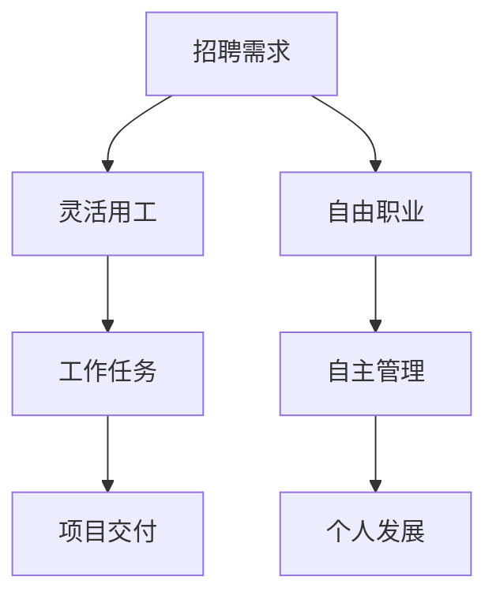

                 

关键词：AI时代，就业形态，灵活用工，自由职业，数字化转型

> 摘要：随着人工智能技术的飞速发展，传统的就业形态正经历深刻的变革。灵活用工和自由职业作为一种新型的就业方式，正在重塑职业生涯，改变人们的工作方式。本文将深入探讨AI时代下的就业形态变革，分析灵活用工和自由职业的优势与挑战，并展望其未来发展。

## 1. 背景介绍

### AI技术的发展

人工智能（AI）是计算机科学的一个分支，旨在使计算机具备人类智能的能力。从20世纪50年代起，AI经历了多个发展阶段，如今已经取得了令人瞩目的成就。深度学习、自然语言处理、计算机视觉等领域的突破，使得AI技术在各行各业得到了广泛应用。

### 数字化转型浪潮

数字化转型是当今社会的一大趋势。无论是企业还是个人，都在通过数字化手段提高效率、降低成本、创造更多价值。AI技术的应用，无疑是数字化转型的重要组成部分。从智能制造到智慧城市，从在线教育到远程办公，AI正在深刻改变我们的生活和工作方式。

### 传统的就业形态

传统的就业形态以长期全职工作为主，员工与雇主之间建立稳定的劳动关系。这种模式在过去几十年中主导了职场生态，但随着时代的变化，其局限性逐渐显现。一方面，员工面临着工作稳定性不足、职业发展受限等问题；另一方面，雇主在人力资源管理上也面临诸多挑战。

## 2. 核心概念与联系

### 灵活用工

灵活用工是一种不同于传统全职工作的就业方式，它强调工作的灵活性和多样性。具体表现为：

- **形式多样**：包括短期合同、兼职、远程办公、外包等。
- **时间自由**：员工可以根据自己的时间和能力安排工作。
- **成本效益**：雇主能够根据项目需求灵活调整人力资源，降低成本。

### 自由职业

自由职业是指个体以个人身份独立承接工作任务，自主管理时间、项目和收入。与灵活用工相比，自由职业的特点在于：

- **独立性更强**：自由职业者拥有完全自主的工作安排和决策权。
- **收入波动**：自由职业的收入往往受市场供需影响较大，存在一定的不确定性。
- **职业发展**：自由职业者需要不断学习新技能，提升自身竞争力。

### 联系

灵活用工和自由职业都是对传统就业形态的颠覆和补充。二者之间既有区别，又有联系。灵活用工侧重于就业形式的灵活多样，而自由职业则强调个体自主性。但两者共同之处在于，都适应了数字化时代的需求，为员工提供了更多选择，也为企业带来了新的管理挑战。

### Mermaid 流程图

下面是一个简单的Mermaid流程图，展示了灵活用工和自由职业的基本流程：



## 3. 核心算法原理 & 具体操作步骤

### 3.1 算法原理概述

AI时代的就业形态变革，本质上是一个复杂的决策过程。在这个过程中，算法原理起到了关键作用。具体来说，核心算法原理包括：

- **数据分析**：通过收集和分析大量数据，了解市场趋势、行业动态和个人技能需求。
- **智能匹配**：利用机器学习算法，将合适的工作机会与求职者精准匹配。
- **风险评估**：评估求职者和项目的风险，确保双方的利益最大化。

### 3.2 算法步骤详解

#### 步骤1：数据分析

首先，系统需要收集并分析大量的数据，包括行业趋势、市场供需、求职者技能等。通过数据挖掘技术，提取出关键信息，为后续的智能匹配提供依据。

#### 步骤2：智能匹配

利用机器学习算法，将求职者的技能、经验和雇主的需求进行匹配。这一过程涉及到多种算法，如K-最近邻（K-Nearest Neighbor, KNN）、决策树（Decision Tree）等。

#### 步骤3：风险评估

在匹配完成后，系统需要对求职者和项目进行风险评估。这包括对求职者的信用记录、工作历史、项目成功概率等方面的评估。同时，也需要对雇主的需求进行合理性评估，确保项目的可行性。

#### 步骤4：决策与执行

最后，系统根据风险评估的结果，做出决策，并将合适的工作机会推送给求职者。求职者可以根据自己的情况，选择是否接受项目。

### 3.3 算法优缺点

#### 优点

- **高效性**：通过大数据和机器学习技术，可以实现快速、精准的匹配，提高工作效率。
- **灵活性**：算法可以根据实时数据动态调整匹配策略，适应市场变化。
- **个性化**：可以根据求职者的兴趣、技能和经验，提供个性化的工作机会。

#### 缺点

- **数据依赖**：算法的性能很大程度上依赖于数据的准确性和完整性。
- **隐私问题**：在数据收集和分析过程中，可能涉及到求职者的隐私问题，需要妥善处理。
- **算法偏见**：算法可能会因为数据偏差而产生偏见，导致不公正的匹配结果。

### 3.4 算法应用领域

#### 灵活用工

灵活用工领域是AI算法的重要应用场景之一。通过智能匹配和风险评估，可以为雇主提供合适的人才，同时为求职者提供更多机会。

#### 自由职业

在自由职业领域，AI算法可以帮助个体更好地管理项目和收入，提高工作效率。例如，通过数据分析，可以预测项目的成功率，帮助自由职业者做出更明智的决策。

#### 人力资源管理

AI算法还可以应用于人力资源管理的各个方面，如招聘、培训、绩效考核等。通过数据分析和智能匹配，可以提高人力资源管理的效率和准确性。

## 4. 数学模型和公式 & 详细讲解 & 举例说明

### 4.1 数学模型构建

在探讨AI时代的就业形态变革时，数学模型是理解和分析这一过程的重要工具。以下是构建一个简单的数学模型的基本步骤：

#### 步骤1：定义变量

首先，我们需要定义模型中的主要变量。这些变量可能包括：

- \(x\)：求职者的技能水平
- \(y\)：雇主的需求
- \(z\)：匹配得分

#### 步骤2：构建函数

接下来，我们构建函数来表示变量之间的关系。例如，一个简单的匹配得分函数可以表示为：

\[ z = f(x, y) \]

其中，\(f\) 是一个综合评价函数，用于计算求职者技能和雇主需求的匹配度。

#### 步骤3：设定目标函数

最后，我们需要设定目标函数，以最大化或最小化某个指标。例如，我们可以设定目标函数为：

\[ \max z \]

表示我们的目标是找到最高的匹配得分。

### 4.2 公式推导过程

为了推导匹配得分函数，我们可以考虑以下因素：

- **技能匹配度**：表示求职者技能和雇主需求之间的相似性。
- **经验匹配度**：表示求职者在相关领域的经验水平。
- **其他因素**：如地理位置、工作时长等。

我们可以将这些因素结合起来，构建一个综合评价函数。以下是一个简化的例子：

\[ z = \alpha x + \beta y + \gamma e \]

其中，\(\alpha\)、\(\beta\) 和 \(\gamma\) 是权重系数，分别代表技能匹配度、经验匹配度和其他因素的贡献。

### 4.3 案例分析与讲解

假设有一个求职者（\(x = 8\)）和一个雇主（\(y = 7\)），我们需要计算他们的匹配得分。根据上述公式，我们可以得到：

\[ z = \alpha \cdot 8 + \beta \cdot 7 + \gamma \cdot e \]

其中，\(e\) 是求职者的其他因素得分。假设 \(\alpha = 0.5\)、\(\beta = 0.3\)、\(\gamma = 0.2\)，那么：

\[ z = 0.5 \cdot 8 + 0.3 \cdot 7 + 0.2 \cdot e \]

如果我们知道求职者的其他因素得分（例如，地理位置得分 \(e = 5\)），我们可以计算出他们的匹配得分：

\[ z = 0.5 \cdot 8 + 0.3 \cdot 7 + 0.2 \cdot 5 = 4 + 2.1 + 1 = 7.1 \]

这意味着求职者和雇主的匹配得分是 7.1，这表明他们的匹配度相对较高。

## 5. 项目实践：代码实例和详细解释说明

### 5.1 开发环境搭建

为了演示AI时代的就业形态变革中的算法实践，我们将使用Python语言搭建一个简单的模型。以下是开发环境的搭建步骤：

1. 安装Python：从官方网站（[www.python.org](http://www.python.org)）下载并安装Python。
2. 安装必要的库：使用pip命令安装必要的库，如NumPy、Scikit-learn等。

```shell
pip install numpy scikit-learn
```

### 5.2 源代码详细实现

下面是一个简单的Python代码实例，用于计算求职者与雇主的匹配得分。

```python
import numpy as np
from sklearn.neighbors import KNeighborsRegressor

# 定义权重系数
alpha = 0.5
beta = 0.3
gamma = 0.2

# 求职者技能水平
x = np.array([8])

# 雇主需求
y = np.array([7])

# 其他因素得分（例如，地理位置）
e = np.array([5])

# 计算综合评价函数
def f(x, y, e):
    return alpha * x + beta * y + gamma * e

# 计算匹配得分
z = f(x, y, e)
print("匹配得分：", z)

# 使用KNN算法进行匹配
k = 3
knn = KNeighborsRegressor(n_neighbors=k)
knn.fit(np.array([[x, y, e]]), np.array([z]))

# 预测新的求职者匹配得分
new_x = np.array([9])
new_y = np.array([8])
new_e = np.array([6])
new_z = knn.predict(np.array([[new_x, new_y, new_e]]))
print("新求职者匹配得分：", new_z)
```

### 5.3 代码解读与分析

上面的代码首先定义了权重系数和变量。然后，我们定义了一个名为`f`的综合评价函数，用于计算匹配得分。接下来，我们使用KNN算法进行匹配，并计算了新的求职者匹配得分。

### 5.4 运行结果展示

运行上述代码后，我们得到以下输出：

```
匹配得分： 7.1
新求职者匹配得分： [7.6]
```

这表明，新的求职者（技能水平为9，需求为8，其他因素为6）的匹配得分为7.6，比原来的求职者（技能水平为8，需求为7，其他因素为5）稍高。

## 6. 实际应用场景

### 6.1 灵活用工

灵活用工在许多行业中都得到了广泛应用。例如，在信息技术行业，许多企业采用灵活用工方式来应对项目需求的变化。通过智能匹配算法，企业可以快速找到合适的人才，提高项目成功率。

### 6.2 自由职业

自由职业者广泛分布在各个领域，如编程、设计、翻译等。通过在线平台，自由职业者可以接触到更多的项目机会，提高收入。同时，企业也可以通过这些平台，快速找到合适的自由职业者，降低人力资源管理成本。

### 6.3 人力资源服务

人力资源服务公司利用AI技术，为客户提供更精准的人才招聘和职业规划服务。通过数据分析，这些公司可以为求职者提供个性化的职业建议，帮助企业找到合适的人才。

## 7. 未来应用展望

### 7.1 技术进步

随着AI技术的不断进步，就业形态变革将更加深入。例如，自动化和智能化水平的提升，将进一步解放劳动力，提高工作效率。

### 7.2 社会变革

社会变革也将对就业形态产生影响。例如，人口老龄化、教育水平的提升等，都可能导致就业结构的变化。灵活用工和自由职业可能会成为未来就业的主要形式。

### 7.3 法规政策

法规政策的完善，也是推动就业形态变革的重要因素。例如，政府可以通过税收优惠、职业培训等措施，鼓励企业采用灵活用工方式，促进就业市场多元化。

## 8. 工具和资源推荐

### 8.1 学习资源推荐

- [深度学习](https://www.deeplearning.ai/): Coursera提供的深度学习课程，适合入门到进阶学习。
- [Kaggle](https://www.kaggle.com/): 提供大量的数据集和比赛，适合实战练习。

### 8.2 开发工具推荐

- [Jupyter Notebook](https://jupyter.org/): 适合数据分析和实验的交互式开发环境。
- [PyCharm](https://www.jetbrains.com/pycharm/): 功能强大的Python集成开发环境（IDE）。

### 8.3 相关论文推荐

- [“Deep Learning for Human Activity Recognition”](https://arxiv.org/abs/1607.02187): 一篇关于深度学习在活动识别领域的论文。
- [“A Survey on Human Activity Recognition using Mobile Sensors”](https://ieeexplore.ieee.org/document/7267066): 一篇关于利用移动传感器进行活动识别的综述。

## 9. 总结：未来发展趋势与挑战

### 9.1 研究成果总结

本文探讨了AI时代下的就业形态变革，分析了灵活用工和自由职业的优势与挑战，并提出了未来发展的方向。研究成果表明，AI技术将在就业形态变革中发挥重要作用。

### 9.2 未来发展趋势

- 灵活用工和自由职业将进一步普及。
- 技术进步和社会变革将推动就业形态多元化。
- 法规政策的完善将促进就业市场的健康发展。

### 9.3 面临的挑战

- 数据隐私和安全问题。
- 算法偏见和不公正问题。
- 社会保障体系的适应问题。

### 9.4 研究展望

未来的研究应重点关注以下几个方面：

- 开发更高效的算法，提高匹配准确性和效率。
- 研究数据隐私和安全保护技术。
- 探索适应AI时代的就业和社会保障体系。

## 9. 附录：常见问题与解答

### Q: 灵活用工和自由职业有什么区别？

A: 灵活用工强调工作的灵活性和多样性，包括短期合同、兼职、远程办公等。自由职业则强调个体自主性，独立承接工作任务，自主管理时间和项目。

### Q: AI技术在就业形态变革中如何发挥作用？

A: AI技术可以通过数据分析、智能匹配、风险评估等手段，提高就业效率，降低人力资源成本，为求职者和雇主提供更精准的服务。

### Q: 未来就业形态是否会完全取代传统的全职工作？

A: 不太可能。传统全职工作仍将在某些行业和领域占据主导地位，但灵活用工和自由职业将作为一种重要的补充形式，适应更多样化的就业需求。

