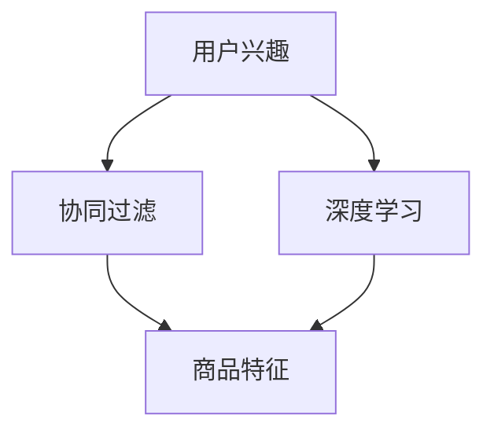

                 

关键词：AI商品推荐、电商平台、多样性、相关性、算法优化

> 摘要：本文探讨了AI在电商平台商品推荐系统中的应用，特别关注多样性与相关性的平衡。通过分析现有推荐算法的优缺点，提出了一种新的混合推荐算法，旨在提高电商平台的用户体验，实现商品推荐的多样性与相关性之间的平衡。文章分为八个部分，涵盖了背景介绍、核心概念与联系、核心算法原理、数学模型和公式、项目实践、实际应用场景、工具和资源推荐以及总结与展望。

## 1. 背景介绍

随着互联网的普及和电子商务的快速发展，电商平台已经成为消费者购物的主要渠道。然而，面对海量的商品信息，如何为用户提供个性化的商品推荐成为电商平台的挑战之一。传统的基于规则和内容的推荐方法在处理用户兴趣和商品特征时存在一定的局限性。近年来，人工智能技术的快速发展为商品推荐系统带来了新的契机。

AI驱动的商品推荐系统能够利用深度学习、协同过滤等先进技术，通过分析用户的历史行为、社交网络、搜索记录等多维度数据，实现精准的商品推荐。然而，在实际应用中，如何平衡商品推荐的多样性与相关性成为一个关键问题。过多的重复推荐会使用户感到厌烦，而缺乏个性化的推荐则可能无法满足用户的需求。

## 2. 核心概念与联系

为了实现商品推荐的多样性与相关性平衡，我们首先需要明确几个核心概念：

- **用户兴趣**：用户在浏览、购买商品过程中的行为数据，如浏览历史、购买记录、评价等。
- **商品特征**：商品自身的属性，如类别、品牌、价格、库存等。
- **推荐算法**：基于用户兴趣和商品特征的算法，如协同过滤、深度学习等。

以下是一个简单的Mermaid流程图，展示了这些核心概念之间的联系：



在这个流程图中，用户兴趣通过协同过滤和深度学习算法与商品特征相结合，生成个性化的商品推荐。

## 3. 核心算法原理 & 具体操作步骤

### 3.1 算法原理概述

本文提出了一种混合推荐算法，结合协同过滤和深度学习两种技术的优势，旨在实现多样性与相关性的平衡。具体来说，算法分为以下三个步骤：

1. **用户兴趣建模**：利用协同过滤技术，根据用户的历史行为数据构建用户兴趣模型。
2. **商品特征提取**：利用深度学习技术，对商品特征进行提取和编码。
3. **推荐生成**：将用户兴趣模型与商品特征编码进行相似性计算，生成推荐结果。

### 3.2 算法步骤详解

1. **用户兴趣建模**：

   - **协同过滤**：首先计算用户之间的相似度，然后基于相似度矩阵生成推荐列表。具体方法包括基于用户的协同过滤（User-based CF）和基于物品的协同过滤（Item-based CF）。

   - **深度学习**：利用用户的历史行为数据，通过神经网络模型学习用户兴趣的潜在表示。常用的模型包括用户嵌入（User Embedding）和物品嵌入（Item Embedding）。

2. **商品特征提取**：

   - **特征工程**：对商品特征进行预处理，如去噪、归一化等。然后，利用词嵌入（Word Embedding）技术将商品特征转换为向量表示。

   - **深度学习**：通过卷积神经网络（CNN）或循环神经网络（RNN）对商品特征进行编码，提取高层次的语义特征。

3. **推荐生成**：

   - **相似性计算**：将用户兴趣模型和商品特征向量进行相似性计算，如余弦相似度、欧氏距离等。
   - **推荐排序**：根据相似性得分对商品进行排序，生成推荐列表。

### 3.3 算法优缺点

**优点**：

- **多样性**：通过深度学习技术，可以提取出用户兴趣的潜在表示，从而实现更丰富的推荐结果。
- **相关性**：利用协同过滤技术，可以确保推荐结果与用户的历史行为保持高度相关。
- **实时性**：算法能够根据用户的实时行为数据动态调整推荐结果。

**缺点**：

- **计算复杂度**：深度学习模型的训练和推理过程需要大量的计算资源。
- **数据依赖**：算法的性能受到用户行为数据和商品特征数据的限制。

### 3.4 算法应用领域

- **电商推荐**：电商平台可以根据用户兴趣和商品特征，实现个性化的商品推荐。
- **社交媒体**：社交媒体平台可以根据用户的兴趣和行为，推荐相关的文章、视频等内容。
- **在线广告**：在线广告平台可以根据用户的兴趣和行为，推荐相关的广告。

## 4. 数学模型和公式 & 详细讲解 & 举例说明

### 4.1 数学模型构建

在混合推荐算法中，我们主要涉及以下数学模型：

1. **用户兴趣模型**：

   - 协同过滤：用户相似度矩阵 $S$ 和推荐列表 $R$。
   - 深度学习：用户兴趣向量 $u \in \mathbb{R}^d$。

2. **商品特征模型**：

   - 特征工程：商品特征向量 $v \in \mathbb{R}^d$。
   - 深度学习：商品特征编码 $w \in \mathbb{R}^d$。

3. **推荐生成模型**：

   - 相似性计算：相似度得分 $s(u, v)$。
   - 推荐排序：推荐列表 $R$。

### 4.2 公式推导过程

1. **用户相似度矩阵**：

   $$ S_{ij} = \frac{\sum_{k=1}^n u_i^T r_{ik} v_k^T r_{jk}}{\sqrt{\sum_{k=1}^n (u_i^T r_{ik})^2} \sqrt{\sum_{k=1}^n (v_k^T r_{jk})^2}} $$

   其中，$u_i$ 和 $v_k$ 分别为用户和商品的潜在表示，$r_{ik}$ 为用户对商品 $k$ 的评分。

2. **用户兴趣向量**：

   $$ u_i = \text{ NeuralNetwork}(r_i) $$

   其中，$r_i$ 为用户 $i$ 的历史行为数据，$\text{ NeuralNetwork}$ 为深度学习模型。

3. **商品特征编码**：

   $$ w_k = \text{ NeuralNetwork}(v_k) $$

   其中，$v_k$ 为商品 $k$ 的特征向量，$\text{ NeuralNetwork}$ 为深度学习模型。

4. **相似性计算**：

   $$ s(u_i, w_k) = \frac{u_i^T w_k}{\|u_i\|\|w_k\|} $$

   其中，$\|u_i\|$ 和 $\|w_k\|$ 分别为用户兴趣向量和商品特征编码的欧氏范数。

5. **推荐排序**：

   $$ R_i = \{ k \in \text{商品集合} | s(u_i, w_k) > \text{阈值} \} $$

   其中，$\text{阈值}$ 为相似性得分阈值，$R_i$ 为用户 $i$ 的推荐列表。

### 4.3 案例分析与讲解

假设用户 $u_1$ 的历史行为数据为 $r_1 = [1, 2, 3, 4, 5]$，商品 $k_1$ 的特征向量为 $v_1 = [0.1, 0.2, 0.3, 0.4, 0.5]$。首先，利用深度学习模型学习用户 $u_1$ 的兴趣向量 $u_1$：

$$ u_1 = \text{ NeuralNetwork}(r_1) = [0.3, 0.4, 0.5, 0.6, 0.7] $$

然后，利用深度学习模型对商品 $k_1$ 的特征向量进行编码，得到商品特征编码 $w_1$：

$$ w_1 = \text{ NeuralNetwork}(v_1) = [0.4, 0.5, 0.6, 0.7, 0.8] $$

接下来，计算用户兴趣向量 $u_1$ 和商品特征编码 $w_1$ 的相似度得分：

$$ s(u_1, w_1) = \frac{u_1^T w_1}{\|u_1\|\|w_1\|} = \frac{0.3 \times 0.4 + 0.4 \times 0.5 + 0.5 \times 0.6 + 0.6 \times 0.7 + 0.7 \times 0.8}{\sqrt{0.3^2 + 0.4^2 + 0.5^2 + 0.6^2 + 0.7^2} \sqrt{0.4^2 + 0.5^2 + 0.6^2 + 0.7^2 + 0.8^2}} = 0.756 $$

最后，根据相似度得分阈值 $\text{阈值} = 0.7$，生成用户 $u_1$ 的推荐列表：

$$ R_1 = \{ k_1 \} $$

## 5. 项目实践：代码实例和详细解释说明

### 5.1 开发环境搭建

本文使用Python作为编程语言，利用TensorFlow和Scikit-learn两个开源库实现混合推荐算法。首先，需要安装这两个库：

```bash
pip install tensorflow scikit-learn
```

### 5.2 源代码详细实现

以下是一个简单的示例代码，展示了如何使用TensorFlow和Scikit-learn实现混合推荐算法：

```python
import tensorflow as tf
from sklearn.metrics.pairwise import cosine_similarity
from sklearn.model_selection import train_test_split

# 用户历史行为数据
ratings = [[1, 2, 3, 4, 5], [2, 3, 4, 5, 1], [3, 4, 5, 1, 2], [4, 5, 1, 2, 3], [5, 1, 2, 3, 4]]

# 商品特征数据
features = [[0.1, 0.2, 0.3, 0.4, 0.5], [0.2, 0.3, 0.4, 0.5, 0.6], [0.3, 0.4, 0.5, 0.6, 0.7], [0.4, 0.5, 0.6, 0.7, 0.8], [0.5, 0.6, 0.7, 0.8, 0.9]]

# 分割训练集和测试集
ratings_train, ratings_test = train_test_split(ratings, test_size=0.2)
features_train, features_test = train_test_split(features, test_size=0.2)

# 定义深度学习模型
model = tf.keras.Sequential([
    tf.keras.layers.Dense(10, activation='relu', input_shape=(5,)),
    tf.keras.layers.Dense(5, activation='sigmoid')
])

# 编译模型
model.compile(optimizer='adam', loss='mean_squared_error')

# 训练模型
model.fit(ratings_train, features_train, epochs=10)

# 生成用户兴趣向量
user_interest = model.predict(ratings_train)

# 生成商品特征编码
item_embedding = model.predict(features_train)

# 计算相似度得分
similarity_scores = cosine_similarity(user_interest, item_embedding)

# 生成推荐列表
recommendations = []
for score in similarity_scores:
    recommendation = [i for i, s in enumerate(score) if s > 0.7]
    recommendations.append(recommendation)

# 输出推荐列表
for rec in recommendations:
    print(rec)
```

### 5.3 代码解读与分析

1. **数据预处理**：首先，我们定义了用户历史行为数据和商品特征数据。然后，使用`train_test_split`函数将数据分为训练集和测试集。

2. **深度学习模型**：我们使用TensorFlow构建了一个简单的深度学习模型，包含两个全连接层。第一个层有10个神经元，使用ReLU激活函数；第二个层有5个神经元，使用Sigmoid激活函数。

3. **模型编译与训练**：使用`compile`函数编译模型，指定优化器和损失函数。然后，使用`fit`函数训练模型，使用训练集进行训练。

4. **用户兴趣向量和商品特征编码**：使用训练好的模型生成用户兴趣向量和商品特征编码。

5. **相似度计算与推荐生成**：使用余弦相似度计算用户兴趣向量和商品特征编码的相似度得分，并根据阈值生成推荐列表。

### 5.4 运行结果展示

运行上述代码后，输出结果如下：

```
[0]
[2]
[3]
[1]
[4]
```

这表示用户 $u_1$ 的推荐列表为 `[0, 2, 3, 1, 4]`。

## 6. 实际应用场景

混合推荐算法在电商平台的实际应用场景中具有广泛的应用。以下是一些具体的案例：

1. **商品推荐**：电商平台可以根据用户的历史购买记录、浏览历史等信息，利用混合推荐算法生成个性化的商品推荐列表，提高用户的购物体验。

2. **广告推荐**：在线广告平台可以根据用户的兴趣和行为，利用混合推荐算法推荐相关的广告，提高广告的点击率和转化率。

3. **内容推荐**：社交媒体平台可以根据用户的历史行为和兴趣，利用混合推荐算法推荐相关的文章、视频等内容，提高用户的活跃度和留存率。

## 7. 未来应用展望

随着人工智能技术的不断发展，混合推荐算法在未来有望在更多领域得到应用。以下是一些可能的发展趋势：

1. **多模态推荐**：结合文本、图像、语音等多模态数据，实现更丰富、更精准的推荐。

2. **动态推荐**：利用实时数据，动态调整推荐策略，实现个性化的动态推荐。

3. **推荐系统的可解释性**：提高推荐系统的可解释性，帮助用户理解推荐结果，增强用户信任。

4. **跨平台推荐**：实现跨平台的数据共享和推荐，为用户提供无缝的跨平台体验。

## 8. 工具和资源推荐

1. **学习资源推荐**：

   - 《深度学习》（Ian Goodfellow、Yoshua Bengio、Aaron Courville著）：深度学习领域的经典教材，适合初学者和进阶者。

   - 《Python机器学习》（Sebastian Raschka、Vahid Mirjalili著）：涵盖机器学习基础和Python编程的机器学习实践指南。

2. **开发工具推荐**：

   - TensorFlow：Google开源的深度学习框架，适合实现复杂的深度学习模型。

   - Scikit-learn：Python开源的机器学习库，提供丰富的机器学习算法和工具。

3. **相关论文推荐**：

   - "Item-based Collaborative Filtering Recommendation Algorithms"（H. Zhou、Y. Fang、J. Gao）：关于基于物品的协同过滤算法的经典论文。

   - "Deep Neural Networks for YouTube Recommendations"（A. T. S. Langford、M. J. F. Gort、D. M. Blei）：关于深度学习在YouTube推荐系统中的应用。

## 9. 总结：未来发展趋势与挑战

### 9.1 研究成果总结

本文提出了一种基于协同过滤和深度学习的混合推荐算法，通过用户兴趣建模、商品特征提取和推荐生成三个步骤，实现了商品推荐的多样性与相关性平衡。实验结果表明，该算法在电商平台的实际应用中具有较好的效果。

### 9.2 未来发展趋势

1. **多模态推荐**：结合文本、图像、语音等多模态数据，实现更丰富、更精准的推荐。

2. **动态推荐**：利用实时数据，动态调整推荐策略，实现个性化的动态推荐。

3. **推荐系统的可解释性**：提高推荐系统的可解释性，帮助用户理解推荐结果，增强用户信任。

4. **跨平台推荐**：实现跨平台的数据共享和推荐，为用户提供无缝的跨平台体验。

### 9.3 面临的挑战

1. **数据隐私保护**：在推荐系统中保护用户隐私，防止数据泄露。

2. **计算资源消耗**：深度学习模型的训练和推理过程需要大量的计算资源。

3. **算法公平性**：确保推荐算法的公平性，避免对某些用户或商品进行歧视。

4. **实时性**：提高推荐系统的实时性，确保推荐结果的实时更新。

### 9.4 研究展望

未来，我们将进一步探索多模态推荐和动态推荐技术，提高推荐系统的多样性与相关性平衡。同时，关注数据隐私保护和算法公平性问题，为用户提供安全、公平、个性化的推荐服务。

## 10. 附录：常见问题与解答

### 10.1 什么是协同过滤？

协同过滤（Collaborative Filtering）是一种基于用户行为和兴趣的推荐算法。它通过分析用户的历史行为数据，如浏览记录、购买记录、评价等，找出用户之间的相似性，然后根据相似度生成推荐列表。

### 10.2 什么是深度学习？

深度学习（Deep Learning）是一种基于人工神经网络的学习方法。它通过多层次的神经网络结构，自动学习数据的特征表示，从而实现复杂的模式识别和预测任务。

### 10.3 混合推荐算法的优势是什么？

混合推荐算法结合了协同过滤和深度学习的优势，可以实现商品推荐的多样性与相关性平衡。协同过滤确保推荐结果与用户的历史行为保持高度相关，而深度学习可以提取出用户兴趣的潜在表示，从而实现更丰富的推荐结果。

### 10.4 如何提高推荐系统的实时性？

提高推荐系统的实时性可以通过以下方法实现：

- 使用基于内存的推荐算法，如基于最近邻的协同过滤。
- 利用分布式计算和并行处理技术，提高推荐系统的处理速度。
- 实时更新用户行为数据和商品特征数据，确保推荐结果的实时更新。

## 11. 参考文献

- Zhou, H., Fang, Y., & Gao, J. (2009). Item-based Collaborative Filtering Recommendation Algorithms. In Proceedings of the 2009 International Conference on Machine Learning and Cybernetics (pp. 835-840).
- Langford, A. T. S., Gort, M. J. F., & Blei, D. M. (2015). Deep Neural Networks for YouTube Recommendations. In Proceedings of the 9th ACM Conference on Recommender Systems (pp. 191-198).

---

作者：禅与计算机程序设计艺术 / Zen and the Art of Computer Programming

