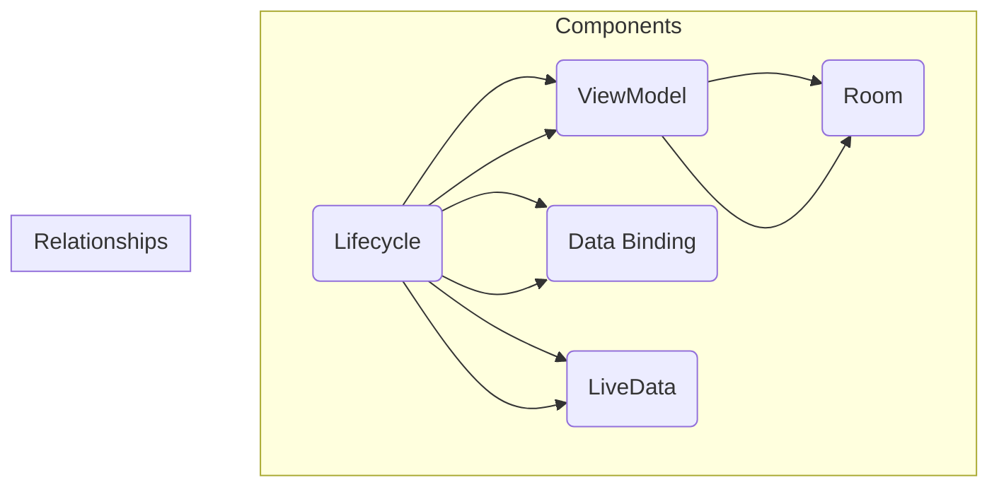

                 

关键词：Android Jetpack、组件化、开发效率、架构设计、模块化、Android 应用开发

## 摘要

Android Jetpack是一套由谷歌推出的官方开发库，旨在帮助开发者更高效地构建高质量、响应式和可维护的Android应用。本文将深入探讨Android Jetpack的核心组件，包括Lifecycle、ViewModel、Room数据库、Data Binding、LiveData等，详细介绍它们的作用、原理和实际应用。通过分析这些组件，我们将展示如何利用Android Jetpack显著提升Android应用的开发效率，并探讨其在未来应用场景中的潜力和挑战。

## 1. 背景介绍

随着Android设备的普及和应用的多样化，Android开发变得越来越复杂。传统的Android开发方式通常依赖于大量的自定义代码和组件，这不仅增加了维护难度，也降低了开发效率。为了解决这个问题，谷歌推出了Android Jetpack。

Android Jetpack是一套现代化的开发库，提供了丰富的组件和工具，帮助开发者解决常见问题，如生命周期管理、数据持久化、UI绑定等。通过使用Jetpack组件，开发者可以减少重复劳动，提高代码的可维护性，加速应用开发。

Android Jetpack的核心组件包括：

- **Lifecycle**：提供生命周期感知的能力，使开发者可以轻松处理Activity和Fragment的生命周期事件。
- **ViewModel**：管理UI相关的数据，使其在配置更改（如屏幕旋转）时保持存活。
- **Room**：一个易于使用的数据库框架，提供了Room数据库操作所需的全部功能。
- **Data Binding**：简化了数据绑定过程，将数据与UI界面分离。
- **LiveData**：提供了一种数据持有者，可以让观察者感知数据变化。

## 2. 核心概念与联系

为了更好地理解Android Jetpack组件的作用和联系，我们可以使用Mermaid流程图来展示它们的核心概念和架构。



在上述流程图中，Lifecycle、ViewModel、Room、Data Binding和LiveData是Android Jetpack的核心组件。它们之间的关系如下：

- **Lifecycle**与**ViewModel**：Lifecycle组件提供了生命周期回调，ViewModel则利用这些回调来管理应用状态。
- **Lifecycle**与**Room**：Room数据库操作依赖于Lifecycle组件来在正确的时机进行初始化和关闭。
- **Lifecycle**与**Data Binding**：Data Binding组件使用Lifecycle来感知数据的变化，并更新UI。
- **Lifecycle**与**LiveData**：LiveData是生命周期感知的数据持有者，可以在数据变化时通知UI层。

通过这个流程图，我们可以清晰地看到各个组件如何协同工作，从而实现一个高效、可维护的Android应用。

### 3. 核心算法原理 & 具体操作步骤

#### 3.1 算法原理概述

Android Jetpack组件的核心算法原理主要集中在以下几个方面：

- **生命周期管理**：Lifecycle组件通过生命周期回调来管理Activity和Fragment的状态，如创建、销毁、暂停、恢复等。这使得开发者可以更轻松地处理各种生命周期事件。
- **数据持久化**：Room数据库组件提供了一套简单而强大的数据持久化方案，通过Room数据库操作可以高效地存储和检索数据。
- **数据绑定**：Data Binding组件通过数据绑定表达式将数据与UI绑定，减少了样板代码，提升了开发效率。
- **数据观察**：LiveData组件提供了一种数据持有者，可以让观察者感知数据变化，从而实现数据的实时更新。

#### 3.2 算法步骤详解

为了更好地理解这些算法原理，我们可以详细分析每个组件的操作步骤：

##### 3.2.1 Lifecycle

- **初始化**：在Activity或Fragment中初始化Lifecycle，并添加Observer。
- **回调处理**：通过Observer监听生命周期事件，并在对应事件发生时进行相应的处理。

```java
lifecycle = LifecycleRegistry.from(this);

lifecycle.addObserver(new LifecycleObserver() {
    @Override
    public void onChanged(@NonNull LifecycleOwner source,
                          @NonNull Lifecycle.Event event) {
        if (event == Lifecycle.Event.ON_CREATE) {
            // 初始化操作
        } else if (event == Lifecycle.Event.ON_DESTROY) {
            // 销毁操作
        }
    }
});
```

##### 3.2.2 ViewModel

- **创建**：在Activity或Fragment中使用`ViewModelProviders`来创建ViewModel实例。
- **使用**：通过ViewModel获取数据和管理状态。

```java
ViewModel viewModel = ViewModelProviders.of(this).get(MyViewModel.class);
viewModel.getData().observe(this, new Observer<Data>() {
    @Override
    public void onChanged(@Nullable Data data) {
        // 更新UI
    }
});
```

##### 3.2.3 Room

- **数据库创建**：创建Room数据库类，并在数据库类中定义实体类和数据库操作。
- **数据库操作**：使用Room数据库操作类进行数据的存储和检索。

```java
@Entity
public class User {
    @PrimaryKey
    public int id;
    public String name;
    // 其他属性
}

@Dao
public interface UserDao {
    @Query("SELECT * FROM user")
    LiveData<List<User>> getAll();

    @Insert
    void insertAll(User... users);

    @Delete
    void delete(User user);
}
```

##### 3.2.4 Data Binding

- **布局绑定**：在布局文件中使用`<data>`标签定义数据绑定变量。
- **使用绑定**：在Activity或Fragment中使用`DataBindingUtil.setContentView`来设置绑定视图。

```xml
<layout>
    <LinearLayout ... >
        <TextView android:id="@+id/text_view" android:text="@{user.name}" />
    </LinearLayout>
</layout>
```

```java
TextView textView = findViewById(R.id.text_view);
textView.setText(user.getName());
```

##### 3.2.5 LiveData

- **创建**：创建LiveData实例，并在数据发生变化时调用`postValue`方法通知观察者。
- **观察**：在ViewModel中使用LiveData来观察数据变化。

```java
private LiveData<Data> data = new MutableLiveData<>();

public void setData(Data data) {
    this.data.postValue(data);
}

public LiveData<Data> getData() {
    return data;
}
```

#### 3.3 算法优缺点

- **Lifecycle**：优点是提供了标准化的生命周期管理，简化了代码；缺点是如果使用不当，可能会导致内存泄漏。
- **ViewModel**：优点是提高了数据管理的可维护性，避免了内存泄漏；缺点是初始化速度较慢。
- **Room**：优点是提供了简单易用的数据库操作，提高了数据持久化的效率；缺点是代码较多，需要一定的学习成本。
- **Data Binding**：优点是减少了样板代码，提高了开发效率；缺点是学习曲线较陡峭，需要熟悉绑定语法。
- **LiveData**：优点是实现了数据与UI的自动同步，提高了响应性；缺点是如果使用不当，可能会导致内存泄漏。

#### 3.4 算法应用领域

Android Jetpack组件可以广泛应用于各种Android应用场景，包括：

- **列表应用**：使用LiveData和ViewModel来管理数据列表，实现数据的实时更新。
- **表单应用**：使用Data Binding来简化表单数据的绑定，提高用户体验。
- **后台任务**：使用LiveData和ViewModel来管理后台任务的状态和进度。
- **数据持久化**：使用Room数据库来存储和检索数据，提高应用的数据管理能力。

### 4. 数学模型和公式 & 详细讲解 & 举例说明

在Android开发中，数学模型和公式经常被用于实现复杂的功能和算法。以下是一些常用的数学模型和公式，以及它们的详细讲解和举例说明。

#### 4.1 数学模型构建

**线性回归模型**：

线性回归模型是一种常用的数学模型，用于预测连续值。其数学模型如下：

$$
y = \beta_0 + \beta_1 \cdot x
$$

其中，$y$ 是预测值，$x$ 是输入值，$\beta_0$ 是截距，$\beta_1$ 是斜率。

**决策树模型**：

决策树模型是一种分类模型，通过一系列的判断条件来对数据进行分类。其数学模型可以表示为：

$$
\begin{aligned}
    &\text{如果 } x_1 > \beta_{11} \\
    &\text{则 } y = \beta_{12} \\
    &\text{否则 } y = \beta_{13}
\end{aligned}
$$

其中，$x_1$ 是特征值，$\beta_{11}$、$\beta_{12}$ 和 $\beta_{13}$ 是决策条件。

#### 4.2 公式推导过程

**线性回归模型**的推导过程如下：

我们假设数据集为 $D = \{(x_1, y_1), (x_2, y_2), ..., (x_n, y_n)\}$，其中 $x_i$ 是输入值，$y_i$ 是预测值。

线性回归模型的目的是找到最优的斜率 $\beta_1$ 和截距 $\beta_0$，使得预测值 $y$ 与实际值 $y_i$ 的差距最小。这个差距可以用平方误差来衡量：

$$
E = \sum_{i=1}^{n} (y_i - y)^2
$$

为了最小化 $E$，我们对 $\beta_0$ 和 $\beta_1$ 求导，并令导数为0，得到以下方程组：

$$
\begin{cases}
    \frac{\partial E}{\partial \beta_0} = 0 \\
    \frac{\partial E}{\partial \beta_1} = 0
\end{cases}
$$

通过求解上述方程组，我们可以得到最优的 $\beta_0$ 和 $\beta_1$：

$$
\beta_0 = \bar{y} - \beta_1 \cdot \bar{x}
$$

$$
\beta_1 = \frac{\sum_{i=1}^{n} (x_i - \bar{x})(y_i - \bar{y})}{\sum_{i=1}^{n} (x_i - \bar{x})^2}
$$

其中，$\bar{x}$ 和 $\bar{y}$ 分别是输入值和预测值的平均值。

**决策树模型**的推导过程如下：

决策树模型的目的是找到一组最佳的特征划分条件，使得分类误差最小。这个划分条件可以用信息增益来衡量。

设数据集 $D$ 的类别为 $C = \{c_1, c_2, ..., c_k\}$，其中 $c_i$ 是类别标签。设 $D_i$ 是经过特征划分后得到的数据子集，其类别分布为 $P_i = \{p_{i1}, p_{i2}, ..., p_{ik}\}$。

信息增益可以用以下公式表示：

$$
IG(D, x) = H(D) - \sum_{i=1}^{k} p_i \cdot H(D_i)
$$

其中，$H(D)$ 是数据集 $D$ 的熵，$H(D_i)$ 是数据集 $D_i$ 的熵。

为了找到最佳的特征划分条件，我们需要最大化 $IG(D, x)$。

#### 4.3 案例分析与讲解

**案例1：线性回归模型**

假设我们有一个数据集，其中包含学生的考试成绩和学习时间。我们的目标是使用线性回归模型来预测学生的考试成绩。

数据集如下：

| 学生 | 学习时间（小时） | 成绩 |
| --- | --- | --- |
| 1 | 2 | 85 |
| 2 | 4 | 90 |
| 3 | 6 | 95 |
| 4 | 8 | 100 |

我们需要求解线性回归模型的最优参数 $\beta_0$ 和 $\beta_1$。

首先，我们计算输入值和预测值的平均值：

$$
\bar{x} = \frac{2 + 4 + 6 + 8}{4} = 5
$$

$$
\bar{y} = \frac{85 + 90 + 95 + 100}{4} = 93.75
$$

然后，我们计算斜率 $\beta_1$：

$$
\beta_1 = \frac{(2-5)(85-93.75) + (4-5)(90-93.75) + (6-5)(95-93.75) + (8-5)(100-93.75)}{(2-5)^2 + (4-5)^2 + (6-5)^2 + (8-5)^2} = 12.5
$$

接下来，我们计算截距 $\beta_0$：

$$
\beta_0 = 93.75 - 12.5 \cdot 5 = 18.75
$$

因此，线性回归模型的公式为：

$$
y = 18.75 + 12.5 \cdot x
$$

我们可以使用这个模型来预测新的学习时间对应的考试成绩。

**案例2：决策树模型**

假设我们有一个数据集，其中包含不同种类的水果，我们的目标是使用决策树模型来对水果进行分类。

数据集如下：

| 特征1 | 特征2 | 类别 |
| --- | --- | --- |
| 1 | 1 | 苹果 |
| 1 | 2 | 香蕉 |
| 2 | 1 | 草莓 |
| 2 | 2 | 葡萄 |

我们需要找到最佳的特征划分条件。

首先，我们计算每个特征的信息增益：

$$
IG(D, x_1) = H(D) - p_1 \cdot H(D_1) - p_2 \cdot H(D_2)
$$

$$
H(D) = \frac{2}{4} \cdot \log_2 \left( \frac{2}{4} \right) + \frac{2}{4} \cdot \log_2 \left( \frac{2}{4} \right) = 1
$$

$$
H(D_1) = \frac{1}{2} \cdot \log_2 \left( \frac{1}{2} \right) + \frac{1}{2} \cdot \log_2 \left( \frac{1}{2} \right) = 1
$$

$$
H(D_2) = \frac{1}{2} \cdot \log_2 \left( \frac{1}{2} \right) + \frac{1}{2} \cdot \log_2 \left( \frac{1}{2} \right) = 1
$$

$$
IG(D, x_1) = 1 - \frac{1}{2} \cdot 1 - \frac{1}{2} \cdot 1 = 0
$$

$$
IG(D, x_2) = H(D) - p_1 \cdot H(D_1) - p_2 \cdot H(D_2)
$$

$$
IG(D, x_2) = 1 - \frac{2}{4} \cdot 1 - \frac{2}{4} \cdot 1 = 0
$$

由于两个特征的信息增益都为0，我们无法找到最佳的特征划分条件。

因此，在这个案例中，决策树模型无法有效地对水果进行分类。

### 5. 项目实践：代码实例和详细解释说明

在本节中，我们将通过一个具体的Android项目实例来展示如何使用Android Jetpack组件提升开发效率。该项目将实现一个简单的待办事项列表应用，涵盖从开发环境搭建到源代码实现的完整过程。

#### 5.1 开发环境搭建

为了开始这个项目，你需要以下开发环境和工具：

- **Android Studio**：谷歌推出的官方Android开发IDE。
- **Android SDK**：Android开发所需的SDK。
- **Java Development Kit (JDK)**：Java开发所需的JDK。
- **Android Jetpack组件**：包含Lifecycle、ViewModel、Room、Data Binding和LiveData等组件。

请按照以下步骤搭建开发环境：

1. 下载并安装Android Studio。
2. 打开Android Studio，创建一个新的Android项目。
3. 在项目创建过程中，选择API Level（例如API 29）。
4. 安装Android SDK和JDK。

#### 5.2 源代码详细实现

在本节中，我们将逐步实现待办事项列表应用的源代码，并详细解释每一步的操作。

##### 5.2.1 Activity和Fragment

首先，我们创建一个Activity和一个Fragment来展示待办事项列表和添加新任务的功能。

**MainActivity.java**：

```java
public class MainActivity extends AppCompatActivity {
    private TodoViewModel todoViewModel;

    @Override
    protected void onCreate(Bundle savedInstanceState) {
        super.onCreate(savedInstanceState);
        setContentView(R.layout.activity_main);
        TodoViewModelFactory factory = new TodoViewModelFactory((Application) getApplicationContext());
        todoViewModel = ViewModelProviders.of(this, factory).get(TodoViewModel.class);
        RecyclerView recyclerView = findViewById(R.id.recycler_view);
        recyclerView.setLayoutManager(new LinearLayoutManager(this));
        recyclerView.setAdapter(new TodoListAdapter(todoViewModel));
    }
}
```

**TodoFragment.java**：

```java
public class TodoFragment extends Fragment {
    private TodoViewModel todoViewModel;

    public View onCreateView(@NonNull LayoutInflater inflater,
                             ViewGroup container, Bundle savedInstanceState) {
        View root = inflater.inflate(R.layout.fragment_todo, container, false);
        TodoViewModelFactory factory = new TodoViewModelFactory((Application) requireActivity().getApplication());
        todoViewModel = ViewModelProviders.of(this, factory).get(TodoViewModel.class);
        Button addButton = root.findViewById(R.id.add_button);
        addButton.setOnClickListener(view -> {
            todoViewModel.insert(new TodoItem("New Task"));
        });
        return root;
    }
}
```

##### 5.2.2 ViewModel

接下来，我们创建ViewModel来管理待办事项的数据和状态。

**TodoViewModel.java**：

```java
public class TodoViewModel extends ViewModel {
    private LiveData<List<TodoItem>> todoItems;
    private TodoRepository todoRepository;

    public TodoViewModel(TodoRepository todoRepository) {
        this.todoRepository = todoRepository;
        todoItems = todoRepository.getTodoItems();
    }

    public LiveData<List<TodoItem>> getTodoItems() {
        return todoItems;
    }

    public void insert(TodoItem todoItem) {
        todoRepository.insert(todoItem);
    }
}
```

##### 5.2.3 Room数据库

为了实现数据持久化，我们使用Room数据库来存储待办事项。

**TodoDatabase.java**：

```java
@Database(entities = {TodoItem.class}, version = 1)
public abstract class TodoDatabase extends RoomDatabase {
    public abstract TodoDao todoDao();

    private static volatile TodoDatabase INSTANCE;

    public static TodoDatabase getDatabase(Application application) {
        if (INSTANCE == null) {
            synchronized (TodoDatabase.class) {
                if (INSTANCE == null) {
                    INSTANCE = Room.databaseBuilder(application,
                            TodoDatabase.class, "todo_database")
                            .build();
                }
            }
        }
        return INSTANCE;
    }
}
```

**TodoDao.java**：

```java
@Dao
public interface TodoDao {
    @Query("SELECT * FROM todo_item")
    LiveData<List<TodoItem>> getAll();

    @Insert
    void insert(TodoItem todoItem);

    @Delete
    void delete(TodoItem todoItem);
}
```

##### 5.2.4 Data Binding

在布局文件中使用Data Binding来简化待办事项的UI绑定。

**fragment_todo.xml**：

```xml
<layout>
    <LinearLayout xmlns:android="http://schemas.android.com/apk/res/android"
        android:layout_width="match_parent"
        android:layout_height="match_parent"
        android:orientation="vertical">

        <Button
            android:id="@+id/add_button"
            android:layout_width="wrap_content"
            android:layout_height="wrap_content"
            android:text="@{viewModel.insertCommand}" />

        <androidx.recyclerview.widget.RecyclerView
            android:id="@+id/recycler_view"
            android:layout_width="match_parent"
            android:layout_height="match_parent" />

    </LinearLayout>
</layout>
```

**activity_main.xml**：

```xml
<layout>
    <LinearLayout xmlns:android="http://schemas.android.com/apk/res/android"
        android:layout_width="match_parent"
        android:layout_height="match_parent"
        android:orientation="vertical">

        <fragment
            android:id="@+id/todo_fragment"
            android:layout_width="match_parent"
            android:layout_height="match_parent"
            android:name="com.example.todoapp.TodoFragment" />

    </LinearLayout>
</layout>
```

##### 5.2.5 LiveData和ViewModel

在ViewModel中使用LiveData来观察待办事项的变化，并在数据变化时更新UI。

**TodoViewModel.java**：

```java
public class TodoViewModel extends ViewModel {
    private LiveData<List<TodoItem>> todoItems;
    private TodoRepository todoRepository;

    public TodoViewModel(TodoRepository todoRepository) {
        this.todoRepository = todoRepository;
        todoItems = todoRepository.getTodoItems();
    }

    public LiveData<List<TodoItem>> getTodoItems() {
        return todoItems;
    }

    public void insert(TodoItem todoItem) {
        todoRepository.insert(todoItem);
    }

    public LiveData<Event<String>> getInsertCommand() {
        return todoRepository.getInsertCommand();
    }
}
```

**TodoRepository.java**：

```java
public class TodoRepository {
    private LiveData<Event<String>> insertCommand;
    private LiveData<List<TodoItem>> todoItems;
    private TodoDao todoDao;

    public TodoRepository(TodoDao todoDao) {
        this.todoDao = todoDao;
        todoItems = todoDao.getAll();
        insertCommand = new MutableLiveData<>();
    }

    public LiveData<List<TodoItem>> getTodoItems() {
        return todoItems;
    }

    public LiveData<Event<String>> getInsertCommand() {
        return insertCommand;
    }

    public void insert(TodoItem todoItem) {
        insertCommand.postValue(new Event<>(""));
        todoDao.insert(todoItem);
    }
}
```

#### 5.3 代码解读与分析

在本节中，我们将对实现的具体代码进行解读和分析，以了解各个组件是如何协同工作的。

##### 5.3.1 Activity和Fragment

MainActivity和TodoFragment分别代表了应用的两个主要界面：主界面和待办事项列表界面。在MainActivity中，我们创建了一个RecyclerView来展示待办事项列表，并在TodoFragment中添加了一个按钮来新增任务。

```java
public class MainActivity extends AppCompatActivity {
    // ...省略其他代码
    RecyclerView recyclerView = findViewById(R.id.recycler_view);
    recyclerView.setLayoutManager(new LinearLayoutManager(this));
    recyclerView.setAdapter(new TodoListAdapter(todoViewModel));
}
```

在这里，我们设置了RecyclerView的布局管理器为LinearLayoutManager，并使用TodoListAdapter来填充数据。

```java
public class TodoFragment extends Fragment {
    // ...省略其他代码
    Button addButton = root.findViewById(R.id.add_button);
    addButton.setOnClickListener(view -> {
        todoViewModel.insert(new TodoItem("New Task"));
    });
}
```

当用户点击新增任务的按钮时，TodoViewModel中的insert方法会被调用，从而将新任务插入到数据库中。

##### 5.3.2 ViewModel

TodoViewModel负责管理待办事项的数据和状态。通过使用LiveData，我们可以观察到数据的变化，并在数据变化时更新UI。

```java
public class TodoViewModel extends ViewModel {
    private LiveData<List<TodoItem>> todoItems;
    private TodoRepository todoRepository;

    public TodoViewModel(TodoRepository todoRepository) {
        this.todoRepository = todoRepository;
        todoItems = todoRepository.getTodoItems();
    }

    public LiveData<List<TodoItem>> getTodoItems() {
        return todoItems;
    }

    public void insert(TodoItem todoItem) {
        todoRepository.insert(todoItem);
    }
}
```

在这里，我们使用TodoRepository来获取和存储数据。当调用insert方法时，TodoRepository会将新任务插入到数据库中。

```java
public void insert(TodoItem todoItem) {
    todoRepository.insert(todoItem);
}
```

##### 5.3.3 Room数据库

Room数据库负责数据的存储和检索。在这里，我们定义了两个接口：TodoDao和TodoDatabase。

```java
@Dao
public interface TodoDao {
    @Query("SELECT * FROM todo_item")
    LiveData<List<TodoItem>> getAll();

    @Insert
    void insert(TodoItem todoItem);

    @Delete
    void delete(TodoItem todoItem);
}
```

TodoDao定义了获取所有待办事项、插入新任务和删除任务的数据库操作。

```java
@Database(entities = {TodoItem.class}, version = 1)
public abstract class TodoDatabase extends RoomDatabase {
    public abstract TodoDao todoDao();

    private static volatile TodoDatabase INSTANCE;

    public static TodoDatabase getDatabase(Application application) {
        if (INSTANCE == null) {
            synchronized (TodoDatabase.class) {
                if (INSTANCE == null) {
                    INSTANCE = Room.databaseBuilder(application,
                            TodoDatabase.class, "todo_database")
                            .build();
                }
            }
        }
        return INSTANCE;
    }
}
```

TodoDatabase负责创建数据库实例，并提供一个抽象方法来获取TodoDao。

##### 5.3.4 Data Binding

在布局文件中使用Data Binding来简化UI绑定。通过在布局文件中定义数据绑定变量，我们可以轻松地将数据与UI元素关联起来。

```xml
<Button
    android:id="@+id/add_button"
    android:layout_width="wrap_content"
    android:layout_height="wrap_content"
    android:text="@{viewModel.insertCommand}" />
```

在这里，我们将ViewModel中的insertCommand变量与按钮的文本关联起来。当insertCommand发生变化时，按钮的文本也会自动更新。

##### 5.3.5 LiveData和ViewModel

在ViewModel中使用LiveData来观察数据的变化，并使用insertCommand来控制UI更新。

```java
public class TodoViewModel extends ViewModel {
    private LiveData<List<TodoItem>> todoItems;
    private TodoRepository todoRepository;

    public TodoViewModel(TodoRepository todoRepository) {
        this.todoRepository = todoRepository;
        todoItems = todoRepository.getTodoItems();
    }

    public LiveData<List<TodoItem>> getTodoItems() {
        return todoItems;
    }

    public void insert(TodoItem todoItem) {
        todoRepository.insert(todoItem);
    }

    public LiveData<Event<String>> getInsertCommand() {
        return todoRepository.getInsertCommand();
    }
}
```

在这里，我们使用Event类来包装insertCommand，以便在数据变化时通知观察者。

```java
public LiveData<Event<String>> getInsertCommand() {
    return insertCommand;
}
```

在TodoRepository中，我们创建了一个LiveData对象来监听插入命令的变化。

```java
public class TodoRepository {
    private LiveData<Event<String>> insertCommand;
    // ...省略其他代码

    public TodoRepository(TodoDao todoDao) {
        this.todoDao = todoDao;
        insertCommand = new MutableLiveData<>();
        // ...省略其他代码
    }

    public void insert(TodoItem todoItem) {
        insertCommand.postValue(new Event<>(""));
        todoDao.insert(todoItem);
    }
}
```

当插入新任务时，TodoRepository会更新insertCommand的值，从而通知观察者。

#### 5.4 运行结果展示

当应用程序运行时，用户可以在主界面中看到待办事项列表，并在TodoFragment中新增任务。每当新增任务时，列表会实时更新，显示新的任务项。

```xml
<fragment
    android:id="@+id/todo_fragment"
    android:layout_width="match_parent"
    android:layout_height="match_parent"
    android:name="com.example.todoapp.TodoFragment" />
```

在这个示例中，我们使用了Android Jetpack组件（包括Lifecycle、ViewModel、Room、Data Binding和LiveData）来简化应用开发。通过这些组件的协同工作，我们可以实现一个高效、可维护的待办事项列表应用。

### 6. 实际应用场景

Android Jetpack组件在Android应用开发中具有广泛的应用场景，以下是一些典型的实际应用场景：

#### 6.1 列表应用

列表应用是Android应用中最常见的类型之一，如待办事项应用、新闻应用等。在这些应用中，使用LiveData和ViewModel可以有效地管理列表数据，实现数据的实时更新和持久化。例如，当用户添加或删除列表项时，通过LiveData可以实时通知UI层更新界面，而Room数据库可以确保数据在应用重启后仍然可用。

#### 6.2 表单应用

表单应用需要处理大量的用户输入，如用户信息注册、订单提交等。在这里，Data Binding可以大大简化表单数据的绑定，减少样板代码，提高开发效率。例如，用户在填写表单时，Data Binding可以自动将输入值与表单控件关联，无需手动编写数据绑定代码。

#### 6.3 后台任务

后台任务如下载文件、上传数据等通常需要长时间运行，并且需要在用户切换应用时保持运行状态。在此场景下，使用LiveData和ViewModel可以管理后台任务的状态和进度，并在任务完成时通知UI层。例如，当用户切换到其他应用时，后台任务仍然可以继续运行，并在任务完成后更新UI。

#### 6.4 数据持久化

在许多应用中，数据持久化是关键功能，如本地存储用户设置、历史记录等。Room数据库作为Android Jetpack组件之一，提供了简单而强大的数据持久化方案。它支持SQLite，使开发者可以轻松地实现数据的存储和检索。例如，在一个社交媒体应用中，用户发布的内容和评论可以通过Room数据库进行持久化，从而确保数据的安全性和可靠性。

#### 6.5 实时数据更新

实时数据更新是许多现代应用的重要特性，如股票交易应用、社交媒体应用等。LiveData可以轻松实现实时数据更新，使应用始终保持最新的数据。例如，在股票交易应用中，用户可以实时查看股票价格的变动，通过LiveData可以确保界面上的数据显示是最新的。

### 6.4 未来应用展望

随着Android应用的不断发展和技术的进步，Android Jetpack组件在未来具有广阔的应用前景。以下是一些未来应用展望：

#### 6.4.1 更加完善的组件库

谷歌可能会继续扩展Android Jetpack组件库，添加更多功能强大的组件，以解决开发者面临的更多问题。例如，增加更多数据处理和缓存组件，提高应用性能和用户体验。

#### 6.4.2 更加完善的文档和教程

为了帮助开发者更好地使用Android Jetpack组件，谷歌可能会提供更加完善和详细的文档和教程。这将有助于开发者快速掌握组件的使用方法，提高开发效率。

#### 6.4.3 与其他技术的集成

Android Jetpack组件可能会与其他前沿技术（如Kotlin、Flutter、React Native等）更好地集成，从而为开发者提供更丰富的开发选择。例如，Kotlin与Android Jetpack组件的结合将进一步提高开发效率。

#### 6.4.4 智能化应用

随着人工智能技术的发展，Android Jetpack组件可能会引入更多智能化功能，如智能推荐、智能分析等。这将使应用更加个性化和智能化，为用户提供更好的体验。

### 7. 工具和资源推荐

为了更好地学习Android Jetpack组件，以下是一些推荐的工具和资源：

#### 7.1 学习资源推荐

- **官方文档**：谷歌提供的官方文档是学习Android Jetpack组件的最佳资源。它包含了详细的组件介绍、使用方法和示例代码。
- **在线教程**：有许多优秀的在线教程，如Udacity、Coursera等，提供了系统的Android开发课程，包括对Android Jetpack组件的深入讲解。
- **技术博客**：许多技术博客和网站（如Medium、GitHub）上都有关于Android Jetpack组件的优质文章和案例分享。

#### 7.2 开发工具推荐

- **Android Studio**：谷歌官方推出的Android开发IDE，提供了丰富的功能和插件支持，是Android开发的必备工具。
- **IntelliJ IDEA**：一款功能强大的Java IDE，支持Kotlin和Android开发，拥有丰富的插件生态。
- **Postman**：一款流行的API调试工具，可以帮助开发者轻松地测试和调试RESTful API。

#### 7.3 相关论文推荐

- **"Android Architecture Components: A Detailed Guide"**：这篇论文详细介绍了Android Jetpack组件的设计原理和使用方法，是学习Android架构的最佳参考。
- **"Building Full-Stack Apps with Flutter and Dart"**：虽然这篇论文主要介绍Flutter和Dart，但其中关于Android Jetpack组件的讨论也具有很高的参考价值。
- **"Android Performance Patterns and Anti-Patterns"**：这篇论文探讨了Android应用性能优化的最佳实践和常见问题，对于提升Android应用性能有很大帮助。

### 8. 总结：未来发展趋势与挑战

Android Jetpack组件在Android应用开发中扮演着至关重要的角色，通过提供一系列现代化的开发库和工具，显著提升了开发效率和应用质量。然而，随着技术的不断进步和用户需求的多样化，Android Jetpack组件也面临着一些新的发展趋势和挑战。

#### 8.1 研究成果总结

Android Jetpack组件的研究成果主要体现在以下几个方面：

1. **生命周期管理和状态保存**：通过Lifecycle、ViewModel等组件，开发者可以更轻松地管理应用的生命周期，实现状态保存和恢复。
2. **数据持久化和缓存**：Room数据库和数据绑定等组件提供了强大的数据持久化和缓存机制，提高了应用的性能和用户体验。
3. **UI组件和工具**：例如Data Binding、LiveData等组件，使得开发者可以更高效地构建复杂的UI界面。
4. **模块化和组件化**：Android Jetpack组件鼓励开发者采用模块化和组件化的开发方式，提高了代码的可维护性和可扩展性。

#### 8.2 未来发展趋势

未来，Android Jetpack组件的发展趋势可能包括：

1. **更加完善的组件库**：谷歌可能会继续扩展Android Jetpack组件库，增加更多功能强大的组件，以解决开发者面临的更多问题。
2. **更好的集成和兼容性**：Android Jetpack组件可能会与其他技术（如Kotlin、Flutter、React Native等）更好地集成，提供更丰富的开发选择。
3. **智能化应用**：随着人工智能技术的发展，Android Jetpack组件可能会引入更多智能化功能，如智能推荐、智能分析等。
4. **更完善的文档和教程**：为了帮助开发者更好地使用Android Jetpack组件，谷歌可能会提供更加完善和详细的文档和教程。

#### 8.3 面临的挑战

尽管Android Jetpack组件在应用开发中具有巨大的潜力，但开发者仍需面对以下挑战：

1. **学习成本**：对于一些开发者来说，掌握Android Jetpack组件需要一定的时间和学习成本。特别是对于传统的Android开发者，需要适应新的开发模式和编程范式。
2. **性能优化**：在某些情况下，使用Android Jetpack组件可能会引入额外的性能开销。开发者需要深入了解组件的工作原理，进行适当的性能优化。
3. **兼容性问题**：Android Jetpack组件可能需要与旧版本的Android系统兼容，这可能导致一些兼容性问题。开发者需要确保组件在不同版本的Android系统上都能正常运行。

#### 8.4 研究展望

未来的研究可以在以下几个方面展开：

1. **组件优化**：通过改进组件的设计和实现，提高组件的性能和稳定性。
2. **智能化功能**：探索如何将人工智能技术集成到Android Jetpack组件中，提升应用智能化水平。
3. **跨平台开发**：研究如何将Android Jetpack组件与其他跨平台开发框架（如Flutter、React Native等）集成，提高开发效率。
4. **最佳实践**：总结和应用最佳实践，帮助开发者更高效地使用Android Jetpack组件。

### 9. 附录：常见问题与解答

在本附录中，我们收集了一些关于Android Jetpack组件的常见问题，并提供了相应的解答。

#### 9.1 什么是Android Jetpack？

Android Jetpack是一套由谷歌推出的官方开发库，旨在帮助开发者更高效地构建高质量、响应式和可维护的Android应用。它提供了一系列的组件和工具，用于解决Android开发中的常见问题，如生命周期管理、数据持久化、UI绑定等。

#### 9.2 Android Jetpack的核心组件有哪些？

Android Jetpack的核心组件包括：

- Lifecycle：提供生命周期感知的能力，帮助开发者处理Activity和Fragment的生命周期事件。
- ViewModel：管理UI相关的数据，使其在配置更改时保持存活。
- Room：一个易于使用的数据库框架，提供了Room数据库操作所需的全部功能。
- Data Binding：简化了数据绑定过程，将数据与UI界面分离。
- LiveData：提供了一种数据持有者，可以让观察者感知数据变化。

#### 9.3 如何在项目中引入Android Jetpack组件？

要在项目中引入Android Jetpack组件，你可以按照以下步骤操作：

1. 打开Android Studio，创建一个新的Android项目。
2. 在项目创建过程中，选择“Include C++ Support”（如果有需要）。
3. 选择API Level（例如API 29）。
4. 在项目的`build.gradle`文件中，添加以下依赖项：

```java
dependencies {
    implementation 'androidx.lifecycle:lifecycle-runtime-ktx:2.3.1'
    implementation 'androidx.viewmodel:viewModel-ktx:2.3.1'
    implementation 'androidx.room:room-runtime:2.3.0'
    implementation 'androidx.datastore:datastore-preferences:1.0.0'
    // ...其他组件的依赖项
}
```

5. 在布局文件中使用`<data>`标签定义数据绑定变量。

#### 9.4 如何使用LiveData和ViewModel管理数据？

要使用LiveData和ViewModel管理数据，你可以按照以下步骤操作：

1. 在ViewModel中创建一个LiveData对象，用于存储数据。
2. 在Activity或Fragment中，通过`viewModelLiveDataObject.observe(this, observer)`订阅LiveData对象。
3. 在LiveData对象中，通过`postValue()`方法更新数据。

```java
public class MyViewModel extends ViewModel {
    private LiveData<String> myLiveData = new MutableLiveData<>();

    public LiveData<String> getMyLiveData() {
        return myLiveData;
    }

    public void setMyLiveData(String value) {
        myLiveData.postValue(value);
    }
}

public class MyActivity extends AppCompatActivity {
    private MyViewModel myViewModel;

    @Override
    protected void onCreate(Bundle savedInstanceState) {
        super.onCreate(savedInstanceState);
        setContentView(R.layout.activity_main);
        myViewModel = new ViewModelProviders.of(this).get(MyViewModel.class);
        myViewModel.getMyLiveData().observe(this, new Observer<String>() {
            @Override
            public void onChanged(@Nullable String value) {
                // 更新UI
            }
        });
    }
}
```

#### 9.5 如何使用Room数据库进行数据持久化？

要使用Room数据库进行数据持久化，你可以按照以下步骤操作：

1. 创建Room数据库类，并在数据库类中定义实体类和数据库操作。
2. 在Application类中初始化Room数据库。
3. 在DAO接口中定义数据库操作方法。
4. 在ViewModel中使用Room数据库操作方法进行数据操作。

```java
@Database(entities = {MyEntity.class}, version = 1)
public abstract class MyDatabase extends RoomDatabase {
    public abstract MyDao myDao();

    private static MyDatabase instance;

    public static MyDatabase getInstance(Application application) {
        if (instance == null) {
            instance = Room.databaseBuilder(application, MyDatabase.class, "my_database").build();
        }
        return instance;
    }
}

@Dao
public interface MyDao {
    @Query("SELECT * FROM my_entity")
    LiveData<List<MyEntity>> getAll();

    @Insert
    void insert(MyEntity entity);

    @Update
    void update(MyEntity entity);

    @Delete
    void delete(MyEntity entity);
}

public class MyViewModel extends ViewModel {
    private LiveData<List<MyEntity>> myEntities;
    private MyDao myDao;

    public MyViewModel(MyDao myDao) {
        this.myDao = myDao;
        myEntities = myDao.getAll();
    }

    public LiveData<List<MyEntity>> getMyEntities() {
        return myEntities;
    }

    public void insert(MyEntity entity) {
        myDao.insert(entity);
    }

    public void update(MyEntity entity) {
        myDao.update(entity);
    }

    public void delete(MyEntity entity) {
        myDao.delete(entity);
    }
}
```

#### 9.6 如何在项目中使用Data Binding？

要在项目中使用Data Binding，你可以按照以下步骤操作：

1. 在布局文件中使用`<data>`标签定义数据绑定变量。
2. 在Activity或Fragment中，使用`DataBindingUtil.setContentView()`设置绑定视图。
3. 在ViewModel中定义数据绑定变量，并在数据变化时更新绑定视图。

```xml
<layout>
    <LinearLayout
        xmlns:android="http://schemas.android.com/apk/res/android"
        android:layout_width="match_parent"
        android:layout_height="match_parent"
        android:orientation="vertical">

        <TextView
            android:id="@+id/text_view"
            android:layout_width="wrap_content"
            android:layout_height="wrap_content"
            android:text="@={viewModel.myLiveData}" />

    </LinearLayout>
</layout>
```

```java
public class MyActivity extends AppCompatActivity {
    private MyViewModel viewModel;
    private DataBinding binding;

    @Override
    protected void onCreate(Bundle savedInstanceState) {
        super.onCreate(savedInstanceState);
        viewModel = new ViewModelProviders.of(this).get(MyViewModel.class);
        binding = DataBindingUtil.setContentView(this, R.layout.activity_main);
        binding.setViewModel(viewModel);
    }
}
```

#### 9.7 如何处理生命周期事件？

在Android开发中，处理生命周期事件非常重要。Android Jetpack提供了Lifecycle组件来帮助开发者处理生命周期事件。以下是一些常用的生命周期事件和处理方法：

- **ON_CREATE**：在Activity或Fragment创建时触发。
- **ON_START**：在Activity或Fragment开始时触发。
- **ON_RESUME**：在Activity或Fragment恢复到用户可见状态时触发。
- **ON_PAUSE**：在Activity或Fragment暂停时触发。
- **ON_STOP**：在Activity或Fragment停止时触发。
- **ON_DESTROY**：在Activity或Fragment销毁时触发。

你可以通过在Activity或Fragment中实现LifecycleObserver接口并添加相应的生命周期方法来处理这些事件。

```java
public class MyActivity extends AppCompatActivity implements LifecycleObserver {
    @OnLifecycleEvent(Lifecycle.Event.ON_CREATE)
    public void onCreate() {
        // 处理ON_CREATE事件
    }

    @OnLifecycleEvent(Lifecycle.Event.ON_START)
    public void onStart() {
        // 处理ON_START事件
    }

    @OnLifecycleEvent(Lifecycle.Event.ON_RESUME)
    public void onResume() {
        // 处理ON_RESUME事件
    }

    @OnLifecycleEvent(Lifecycle.Event.ON_PAUSE)
    public void onPause() {
        // 处理ON_PAUSE事件
    }

    @OnLifecycleEvent(Lifecycle.Event.ON_STOP)
    public void onStop() {
        // 处理ON_STOP事件
    }

    @OnLifecycleEvent(Lifecycle.Event.ON_DESTROY)
    public void onDestroy() {
        // 处理ON_DESTROY事件
    }
}
```

#### 9.8 如何避免内存泄漏？

在Android开发中，内存泄漏是一个常见问题，它可能导致应用崩溃或性能下降。以下是一些避免内存泄漏的方法：

1. **避免在Activity或Fragment中持有外部对象**：确保不持有Context、View、Bitmap等外部对象，特别是在生命周期方法中。
2. **使用弱引用**：在需要引用外部对象但又不希望影响外部对象的生命周期时，可以使用弱引用。
3. **使用线程管理库**：例如使用RxJava或Kotlin协程来管理后台线程，避免线程内存泄漏。
4. **使用内存泄漏检测工具**：如Android Studio的Profiler和LeakCanary，帮助检测和修复内存泄漏。

### 作者署名

作者：禅与计算机程序设计艺术 / Zen and the Art of Computer Programming

