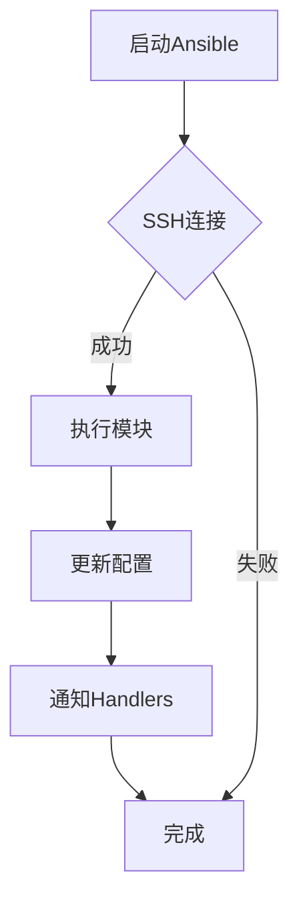

                 

关键词：Ansible，自动化，IT运维，工作流程，简化，配置管理，应用部署

> 摘要：本文将深入探讨Ansible自动化工具在IT运维工作中的应用，通过详细的原理阐述、实践案例解析，以及未来发展趋势的分析，帮助读者了解如何利用Ansible简化IT运维工作流程，提高工作效率。

## 1. 背景介绍

在信息化时代，IT运维成为了企业运营中不可或缺的一环。随着业务的快速扩展，IT基础设施的复杂度和规模也在不断增加。传统的手动运维方式不仅效率低下，还容易出现人为错误。为了应对这些挑战，自动化运维工具应运而生，Ansible就是其中之一。

Ansible是一款开源的自动化工具，由Michael DeHaan创建，旨在简化IT基础设施的配置和管理。它基于Python语言编写，使用SSH协议进行远程执行，无需在目标主机上安装额外软件。Ansible的配置管理功能使得管理员可以轻松地批量管理服务器，部署应用，配置环境，从而大大降低了运维的复杂度。

## 2. 核心概念与联系

### 2.1 核心概念

- **Ansible工作原理**：Ansible通过SSH协议连接到目标主机，执行预定义的命令或脚本，实现配置管理和应用部署。
- **Playbooks**：Ansible的核心概念是Playbooks，它是一种YAML格式的配置文件，用于描述要执行的任务。Playbooks可以包含多个“plays”，每个“play”包含一个或多个“handlers”。
- **模块（Modules）**：Ansible模块是用于执行特定任务的脚本。Ansible自带了大量的模块，可以执行从简单的文件操作到复杂的数据库配置等多种任务。

### 2.2 Mermaid 流程图



## 3. 核心算法原理 & 具体操作步骤

### 3.1 算法原理概述

Ansible使用了一种称为“Agentless”的工作原理，无需在目标主机上安装代理程序。它通过SSH连接到目标主机，执行预定义的Playbooks。Playbooks中包含了一系列的模块调用，这些模块负责执行具体任务。

### 3.2 算法步骤详解

1. **定义Playbooks**：创建YAML格式的Playbooks文件，描述要执行的任务。
2. **配置SSH密钥**：为了确保安全的远程连接，需要配置SSH密钥。
3. **执行Playbooks**：使用Ansible命令行工具执行Playbooks。
4. **监控与调试**：执行过程中，可以通过日志文件监控任务状态，并进行调试。

### 3.3 算法优缺点

**优点**：
- **简单易用**：Ansible使用简单的YAML格式，易于学习和使用。
- **无代理**：无需在目标主机上安装代理，降低安全隐患。
- **模块化**：丰富的模块支持，可以执行各种任务。

**缺点**：
- **性能**：由于依赖SSH连接，性能可能受到一定影响。
- **权限管理**：权限管理相对复杂，需要精心配置。

### 3.4 算法应用领域

Ansible适用于各种IT运维场景，包括：
- **服务器配置**：批量配置Linux服务器。
- **应用部署**：自动化部署Web应用。
- **持续集成**：与CI/CD工具集成，实现自动化测试和部署。

## 4. 数学模型和公式 & 详细讲解 & 举例说明

### 4.1 数学模型构建

Ansible的配置管理涉及到许多数学模型，例如：

- **哈希算法**：用于验证文件的完整性。
- **排序算法**：用于排序配置项。

### 4.2 公式推导过程

- **哈希算法**：$$H(M) = Hash(M)$$
- **排序算法**：$$S(A) = Sort(A)$$

### 4.3 案例分析与讲解

以服务器配置为例，我们使用Ansible配置Nginx服务。具体的Playbook如下：

```yaml
---
- name: Install Nginx
  hosts: all
  become: yes
  tasks:
    - name: Install Nginx package
      apt:
        name: nginx
        state: present

    - name: Configure Nginx
      template:
        src: nginx.conf.j2
        dest: /etc/nginx/nginx.conf

    - name: Start Nginx service
      service:
        name: nginx
        state: started
        enabled: yes
```

在这个Playbook中，我们首先安装了Nginx包，然后配置了Nginx的配置文件，最后启动了Nginx服务。

## 5. 项目实践：代码实例和详细解释说明

### 5.1 开发环境搭建

为了使用Ansible，我们首先需要在控制节点和目标主机上安装Ansible。以下是安装步骤：

1. 在控制节点上安装Ansible：

```bash
sudo apt update
sudo apt install ansible
```

2. 在目标主机上安装SSH密钥：

```bash
sudo apt update
sudo apt install openssh-server
```

3. 将控制节点的公钥添加到目标主机的`~/.ssh/authorized_keys`文件中。

### 5.2 源代码详细实现

以下是一个简单的Ansible Playbook，用于安装和配置Nginx：

```yaml
---
- hosts: all
  become: yes
  tasks:
    - name: Install Nginx
      apt:
        name: nginx
        state: present

    - name: Configure Nginx
      template:
        src: nginx.conf.j2
        dest: /etc/nginx/nginx.conf

    - name: Start Nginx service
      service:
        name: nginx
        state: started
        enabled: yes
```

在这个Playbook中，我们首先定义了要执行的任务，包括安装Nginx包、配置Nginx以及启动Nginx服务。

### 5.3 代码解读与分析

- `hosts`: 定义了要执行任务的宿主节点。
- `become`: 用于提升权限，执行需要root权限的任务。
- `tasks`: 定义了具体的任务列表。

在这个示例中，我们使用了Ansible的`apt`模块来安装软件包，`template`模块来配置文件，`service`模块来管理服务。

### 5.4 运行结果展示

执行Playbook后，Nginx将被安装在所有目标主机上，并配置和启动。

```bash
sudo ansible-playbook -i inventory example.yml
```

## 6. 实际应用场景

### 6.1 数据中心运维

在数据中心，Ansible可以用于批量配置和管理服务器，部署应用，监控系统状态等。

### 6.2 云服务提供商

云服务提供商可以使用Ansible来自动化云基础设施的配置和管理，提高资源利用率和服务质量。

### 6.3 持续集成与持续部署（CI/CD）

Ansible可以与CI/CD工具集成，实现自动化测试和部署，加快软件发布周期。

## 7. 工具和资源推荐

### 7.1 学习资源推荐

- [Ansible官方文档](https://docs.ansible.com/ansible/)
- [Ansible社区论坛](https://discuss.ansible.com/)

### 7.2 开发工具推荐

- [Visual Studio Code](https://code.visualstudio.com/)：用于编写Ansible Playbooks。
- [Ansible Editor](https://github.com/ansible/ansible-editor)：用于编辑Ansible Playbooks。

### 7.3 相关论文推荐

- [DeHaan, Michael. "Ansible: automating everything." Linux Journal 2014.](http://www.linuxjournal.com/content/ansible-automating-everything)
- [Wilkins, Don. "Ansible Automation for Cloud and Datacenter Operations."](https://www.amazon.com/dp/1484205025)

## 8. 总结：未来发展趋势与挑战

### 8.1 研究成果总结

Ansible已成为IT运维领域的热门工具，其简单易用、无代理、模块化等特性受到了广泛认可。

### 8.2 未来发展趋势

- **模块化扩展**：继续丰富模块库，满足更多场景需求。
- **集成更多工具**：与CI/CD、云服务等工具的深度集成。

### 8.3 面临的挑战

- **性能优化**：提高执行速度和稳定性。
- **权限管理**：简化权限配置，提高安全性。

### 8.4 研究展望

Ansible在未来有望在更多领域得到应用，成为自动化运维的支柱工具。

## 9. 附录：常见问题与解答

### 9.1 如何安装Ansible？

```bash
sudo apt update
sudo apt install ansible
```

### 9.2 如何创建Playbook？

```yaml
---
- hosts: all
  become: yes
  tasks:
    - name: Install Nginx
      apt:
        name: nginx
        state: present
```

### 9.3 如何执行Playbook？

```bash
sudo ansible-playbook -i inventory example.yml
```

---

作者：禅与计算机程序设计艺术 / Zen and the Art of Computer Programming
-----------------------------------------------------------------------------

