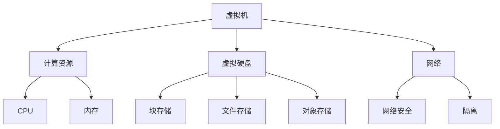

                 

关键词：Azure 云平台、虚拟机、存储、云计算、技术博客、IT领域

> 摘要：本文将深入探讨 Azure 云平台的虚拟机和存储功能，从核心概念到具体操作，再到实际应用场景，全面解析这一强大平台的方方面面，旨在帮助读者更好地理解和运用 Azure 云平台的虚拟机和存储功能。

## 1. 背景介绍

Azure 是微软公司提供的全球性云计算服务，它不仅提供了广泛的云服务，如计算、存储、网络、数据库、人工智能等，还具备强大的扩展性和可靠性。随着企业数字化转型的推进，云计算成为企业构建灵活、高效 IT 基础设施的重要手段。Azure 作为业界领先的云服务平台，受到了全球企业和开发者的青睐。

在 Azure 云平台中，虚拟机和存储是两大核心组件。虚拟机（Virtual Machine，VM）允许用户在云上运行操作系统和应用程序，类似于在物理服务器上安装软件。而存储服务则为虚拟机提供了持久化数据存储的解决方案，包括文件存储、块存储和对象存储等。

本文将重点关注 Azure 中的虚拟机和存储功能，旨在为读者提供全面的技术指导和实际应用案例。

## 2. 核心概念与联系

在深入了解 Azure 的虚拟机和存储之前，我们首先需要明确几个关键概念，并理解它们之间的关系。

### 虚拟机

虚拟机是 Azure 提供的最重要的资源之一。它允许用户在云中创建、部署和管理虚拟化的操作系统和应用程序。以下是虚拟机的一些核心概念：

- **计算资源**：虚拟机提供了计算资源，包括 CPU、内存、网络等。
- **操作系统**：用户可以部署各种操作系统，如 Windows、Linux 等。
- **虚拟硬盘**：虚拟机通过虚拟硬盘（Virtual Hard Disk，VHD）存储数据。
- **虚拟网络**：虚拟机可以配置在特定的虚拟网络中，实现网络安全和隔离。

### 存储

存储是 Azure 提供的另一重要服务，它为虚拟机和应用程序提供了持久化数据存储解决方案。以下是存储服务的一些核心概念：

- **块存储**：块存储提供了灵活、高效的持久化存储解决方案，适用于需要高吞吐量和低延迟的场景。
- **文件存储**：文件存储提供了类似本地文件系统的存储服务，支持 SMB 协议，适用于存储文件和文件夹。
- **对象存储**：对象存储提供了高容量、低成本的数据存储解决方案，适用于存储大量非结构化数据。

### 关系

虚拟机和存储之间的关系十分紧密。虚拟机依赖于存储服务来存储和访问数据。例如，虚拟硬盘是虚拟机的持久化存储设备，而文件存储和对象存储可以用于存储虚拟机中的应用程序数据和日志文件。此外，存储服务的性能和可靠性直接影响到虚拟机的性能和稳定性。

### Mermaid 流程图

以下是 Azure 中虚拟机和存储服务的 Mermaid 流程图，展示了它们之间的关系：



## 3. 核心算法原理 & 具体操作步骤

### 3.1 算法原理概述

在 Azure 中，虚拟机和存储服务的操作主要依赖于 Azure Resource Manager（ARM）。ARM 是一种基于 JSON 格式的模板语言，用于定义和部署 Azure 资源。通过 ARM 模板，用户可以轻松创建、配置和部署虚拟机和存储资源。

### 3.2 算法步骤详解

以下是创建 Azure 虚拟机和存储资源的详细步骤：

1. **定义 ARM 模板**：首先，用户需要创建一个 ARM 模板文件，其中包含虚拟机和存储资源的定义和配置。

2. **部署 ARM 模板**：然后，用户可以使用 Azure CLI、Azure PowerShell 或 Azure 门户等工具将 ARM 模板部署到 Azure 环境。

3. **创建虚拟机**：在 ARM 模板中，用户需要定义虚拟机的配置，包括操作系统、虚拟硬盘、网络等。

4. **配置存储**：用户需要根据需求选择适当的存储服务，并配置存储资源，如块存储、文件存储或对象存储。

5. **部署虚拟机和存储资源**：部署完成后，虚拟机和存储资源将被创建并配置在 Azure 环境中。

### 3.3 算法优缺点

- **优点**：使用 ARM 模板创建和管理虚拟机和存储资源具有以下优点：

  - **灵活性**：用户可以根据需求自定义虚拟机和存储资源的配置。
  - **自动化**：通过脚本化和自动化工具，可以轻松部署和管理大量虚拟机和存储资源。
  - **可靠性**：Azure 提供了强大的基础架构和完善的备份和恢复机制，确保虚拟机和存储资源的可靠性和稳定性。

- **缺点**：ARM 模板的使用也有一些缺点，如：

  - **学习曲线**：ARM 模板是一种新的模板语言，用户需要学习和熟悉其语法和用法。
  - **复杂性**：对于复杂的部署场景，ARM 模板的编写和调试可能会变得复杂和困难。

### 3.4 算法应用领域

ARM 模板在以下领域具有广泛的应用：

- **自动化部署**：通过 ARM 模板，可以自动化部署和管理大量虚拟机和存储资源，提高部署效率。
- **云计算架构设计**：ARM 模板是云计算架构设计的重要工具，可以用于定义和实现复杂的云架构。
- **开发和测试**：在开发和测试阶段，ARM 模板可以用于快速部署和配置测试环境。

## 4. 数学模型和公式 & 详细讲解 & 举例说明

### 4.1 数学模型构建

在 Azure 中，虚拟机和存储资源的性能评估可以使用以下数学模型：

- **计算资源性能**：  
  - CPU 性能：\( P_{CPU} = \frac{CPU_{核心数} \times CPU_{主频}}{1000} \)  
  - 内存性能：\( P_{内存} = \frac{内存容量}{1024} \)

- **存储性能**：  
  - 块存储性能：\( P_{块存储} = \frac{IOPS}{1000} \)  
  - 文件存储性能：\( P_{文件存储} = \frac{吞吐量}{1024} \)  
  - 对象存储性能：\( P_{对象存储} = \frac{总容量}{1024} \)

### 4.2 公式推导过程

- **计算资源性能**：

  - CPU 性能：  
    \( P_{CPU} = \frac{CPU_{核心数} \times CPU_{主频}}{1000} \)  
    其中，\( CPU_{核心数} \) 表示虚拟机的 CPU 核心数，\( CPU_{主频} \) 表示虚拟机的 CPU 主频。该公式表示虚拟机的 CPU 性能，以千兆为单位。

  - 内存性能：  
    \( P_{内存} = \frac{内存容量}{1024} \)  
    其中，\( 内存容量 \) 表示虚拟机的内存容量。该公式表示虚拟机的内存性能，以千兆为单位。

- **存储性能**：

  - 块存储性能：  
    \( P_{块存储} = \frac{IOPS}{1000} \)  
    其中，\( IOPS \) 表示块存储的每秒输入/输出操作数。该公式表示块存储的性能，以千次每秒为单位。

  - 文件存储性能：  
    \( P_{文件存储} = \frac{吞吐量}{1024} \)  
    其中，\( 吞吐量 \) 表示文件存储的每秒数据传输量。该公式表示文件存储的性能，以千兆每秒为单位。

  - 对象存储性能：  
    \( P_{对象存储} = \frac{总容量}{1024} \)  
    其中，\( 总容量 \) 表示对象存储的总容量。该公式表示对象存储的性能，以千兆为单位。

### 4.3 案例分析与讲解

假设我们需要评估一个 Azure 虚拟机的性能，该虚拟机具有以下配置：

- CPU：4 核心处理器，主频 2.4 GHz  
- 内存：8 GB  
- 块存储：1000 IOPS  
- 文件存储：10 GB  
- 对象存储：50 GB

根据上述数学模型，我们可以计算出该虚拟机的性能：

- **计算资源性能**：  
  - CPU 性能：\( P_{CPU} = \frac{4 \times 2.4}{1000} = 0.096 \) 千兆  
  - 内存性能：\( P_{内存} = \frac{8}{1024} = 0.00781 \) 千兆

- **存储性能**：  
  - 块存储性能：\( P_{块存储} = \frac{1000}{1000} = 1 \) 千次每秒  
  - 文件存储性能：\( P_{文件存储} = \frac{10}{1024} = 0.00977 \) 千兆每秒  
  - 对象存储性能：\( P_{对象存储} = \frac{50}{1024} = 0.0488 \) 千兆

根据这些计算结果，我们可以对该虚拟机的性能进行评估。例如，如果需要评估该虚拟机在处理大量文件传输任务时的性能，我们可以关注文件存储性能，即 0.00977 千兆每秒。如果需要评估该虚拟机在执行高 IOPS 操作时的性能，我们可以关注块存储性能，即 1 千次每秒。

## 5. 项目实践：代码实例和详细解释说明

在本节中，我们将通过一个实际项目实例，展示如何在 Azure 中创建虚拟机和存储资源。以下是项目实践的具体步骤：

### 5.1 开发环境搭建

首先，确保已经安装了 Azure CLI 工具。如果尚未安装，可以通过以下命令进行安装：

```bash
sudo apt-get update
sudo apt-get install azure-cli
```

### 5.2 源代码详细实现

以下是创建 Azure 虚拟机和存储资源的 ARM 模板示例代码：

```json
{
  "schema": "https://schema.management.azure.com/schemas/2015-01-01/deploymentManager.json#",
  "contentVersion": "1.0.0.0",
  "type": "DeploymentTemplate",
  "parameters": {
    "location": {
      "type": "string",
      "metadata": {
        "description": "Azure 区域"
      }
    },
    "virtualMachineName": {
      "type": "string",
      "metadata": {
        "description": "虚拟机名称"
      }
    },
    "adminUsername": {
      "type": "string",
      "metadata": {
        "description": "管理员用户名"
      }
    },
    "adminPassword": {
      "type": "securestring",
      "metadata": {
        "description": "管理员密码"
      }
    },
    "image": {
      "type": "string",
      "metadata": {
        "description": "虚拟机镜像"
      }
    },
    "osDiskSizeGB": {
      "type": "int",
      "metadata": {
        "description": "操作系统磁盘大小（GB）"
      }
    }
  },
  "resources": [
    {
      "type": "Microsoft.Compute/virtualMachines",
      "name": "[parameters('virtualMachineName')]",
      "apiVersion": "2019-03-01",
      "properties": {
        "location": "[parameters('location')]",
        "osProfile": {
          "adminUsername": "[parameters('adminUsername')]",
          "adminPassword": "[parameters('adminPassword')]"
        },
        "storageProfile": {
          "imageReference": {
            "id": "[parameters('image')]"
          },
          "osDisk": {
            "name": "osdisk1",
            "createOption": "FromImage",
            "diskSizeGB": "[parameters('osDiskSizeGB')]"
          }
        },
        "networkProfile": {
          "networkInterfaces": [
            {
              "id": "[resourceId('Microsoft.Network/networkInterfaces', 'myNicName')]"
            }
          ]
        }
      }
    },
    {
      "type": "Microsoft.Storage/storageAccounts",
      "name": "myStorageAccount",
      "apiVersion": "2019-06-01",
      "properties": {
        "sku": {
          "name": "Standard_LRS"
        },
        "kind": "StorageV2",
        "location": "[parameters('location')]"
      }
    }
  ]
}
```

### 5.3 代码解读与分析

以下是代码的主要部分及其含义：

- **参数定义**：代码中定义了多个参数，如虚拟机名称、管理员用户名和密码、虚拟机镜像、操作系统磁盘大小等。这些参数用于配置虚拟机和存储资源。

- **虚拟机资源**：在 resources 数组中，定义了一个虚拟机资源。该资源包含以下主要部分：

  - **osProfile**：配置了虚拟机的管理员用户名和密码。
  - **storageProfile**：配置了虚拟机的操作系统磁盘和镜像。操作系统磁盘是通过镜像创建的，其大小由参数定义。
  - **networkProfile**：配置了虚拟机的网络接口。网络接口是通过另一个资源（networkInterfaces）定义的。

- **存储资源**：在 resources 数组中，还定义了一个存储资源。该资源是一个存储账户，用于存储虚拟机的数据。存储账户的类型为 Standard_LRS，表示本地冗余存储。

### 5.4 运行结果展示

在 Azure 门户或 Azure CLI 中，使用以下命令部署 ARM 模板：

```bash
az deployment group create --name myDeployment --template-file template.json
```

部署完成后，用户可以在 Azure 门户中查看虚拟机和存储资源的状态。以下是运行结果示例：

- **虚拟机**：  
  - 名称：myVm  
  - 操作系统：Linux  
  - 状态：运行中  
  - IP 地址：xxx.xxx.xxx.xxx

- **存储账户**：  
  - 名称：myStorageAccount  
  - 类型：Standard_LRS  
  - 区域：中国东部

## 6. 实际应用场景

Azure 的虚拟机和存储服务在实际应用中具有广泛的应用场景。以下是几个常见的应用场景：

- **Web 应用部署**：企业可以将 Web 应用部署到 Azure 虚拟机上，利用 Azure 的全球基础设施实现高可用性和弹性扩展。
- **数据库托管**：Azure 虚拟机可以托管各种数据库，如 SQL Server、MySQL、PostgreSQL 等，满足企业对高性能、高可靠性的数据存储需求。
- **大数据处理**：企业可以利用 Azure 虚拟机和存储服务进行大数据处理，如数据分析和机器学习等。
- **容器化应用部署**：企业可以将容器化应用部署到 Azure 虚拟机上，利用 Docker 等容器技术实现快速部署和扩展。

### 6.4 未来应用展望

随着云计算技术的不断发展和创新，Azure 的虚拟机和存储服务在未来将会有更广泛的应用。以下是几个未来应用展望：

- **混合云和多云部署**：企业将更多地采用混合云和多云部署策略，Azure 虚拟机和存储服务将支持更复杂的部署场景。
- **边缘计算**：随着边缘计算的兴起，Azure 虚拟机和存储服务将在边缘节点上提供计算和存储资源，满足实时数据处理和低延迟应用的需求。
- **人工智能和机器学习**：Azure 虚拟机和存储服务将结合人工智能和机器学习技术，为企业和开发者提供强大的计算和存储支持，推动智能应用的普及。

## 7. 工具和资源推荐

### 7.1 学习资源推荐

- **官方文档**：Azure 官方文档是学习 Azure 虚拟机和存储服务的最佳资源。访问 [Azure 文档](https://docs.microsoft.com/zh-cn/azure/)，可以找到详细的教程、指南和参考文档。

- **在线课程**：在 [Pluralsight](https://www.pluralsight.com/)、[Udemy](https://www.udemy.com/) 和 [Coursera](https://www.coursera.org/) 等在线教育平台上，有许多关于 Azure 的课程，涵盖从基础到高级的内容。

### 7.2 开发工具推荐

- **Azure CLI**：Azure CLI 是一款跨平台的命令行工具，可用于自动化部署和管理 Azure 资源。

- **Azure 门户**：Azure 门户是 Azure 的图形化管理界面，用户可以在其中创建、配置和管理 Azure 资源。

- **Visual Studio**：Visual Studio 是一款强大的集成开发环境，支持 Azure 开发项目的创建、调试和部署。

### 7.3 相关论文推荐

- **"Azure Architecture: Virtual Machines and Storage"**：这是一篇关于 Azure 虚拟机和存储服务的全面综述，分析了 Azure 的架构和关键技术。

- **"Azure Resource Manager Template Language"**：本文介绍了 Azure Resource Manager（ARM）模板语言的基本语法和用法。

- **"Comparing Cloud Storage Services: Azure, AWS, and Google Cloud"**：本文对 Azure、AWS 和 Google Cloud 的存储服务进行了比较分析。

## 8. 总结：未来发展趋势与挑战

### 8.1 研究成果总结

本文全面介绍了 Azure 云平台的虚拟机和存储功能，从核心概念到具体操作，再到实际应用场景，帮助读者深入理解 Azure 的虚拟机和存储服务。通过本文，读者可以了解到：

- Azure 是一个强大的云计算平台，提供了丰富的虚拟机和存储服务。
- 虚拟机和存储服务在 Azure 中具有紧密的关系，共同构成了 Azure 的核心基础设施。
- ARM 模板是一种高效的资源管理工具，可用于自动化部署和管理虚拟机和存储资源。
- 数学模型和公式为评估虚拟机和存储性能提供了量化标准。

### 8.2 未来发展趋势

未来，Azure 的虚拟机和存储服务将继续发展和创新，以下是一些发展趋势：

- **混合云和多云部署**：企业将更多地采用混合云和多云部署策略，Azure 虚拟机和存储服务将支持更复杂的部署场景。
- **边缘计算**：随着边缘计算的兴起，Azure 虚拟机和存储服务将在边缘节点上提供计算和存储资源，满足实时数据处理和低延迟应用的需求。
- **人工智能和机器学习**：Azure 虚拟机和存储服务将结合人工智能和机器学习技术，为企业和开发者提供强大的计算和存储支持，推动智能应用的普及。

### 8.3 面临的挑战

尽管 Azure 的虚拟机和存储服务具有强大的功能，但在未来发展过程中仍将面临以下挑战：

- **安全性**：随着云计算的普及，网络安全威胁日益增多，确保虚拟机和存储资源的安全性是一个重要挑战。
- **性能优化**：在复杂的应用场景中，如何优化虚拟机和存储资源的性能是一个挑战。
- **成本控制**：随着虚拟机和存储资源的规模不断扩大，如何控制成本是一个关键挑战。

### 8.4 研究展望

未来，研究人员和开发者可以从以下方向进行探索：

- **安全性和隐私保护**：研究如何在云计算环境中保护数据和隐私，提高虚拟机和存储服务的安全性。
- **性能优化**：研究如何通过优化虚拟机和存储资源的配置、调度和负载均衡，提高系统性能。
- **成本效益**：研究如何通过资源调度、自动化和优化，实现虚拟机和存储服务的成本效益最大化。

## 9. 附录：常见问题与解答

### Q：如何在 Azure 中创建虚拟机？

A：在 Azure 门户中，按照以下步骤创建虚拟机：

1. 登录 Azure 门户。  
2. 在左侧导航栏中，选择“计算 + 网络选项”。  
3. 点击“虚拟机”。  
4. 在“虚拟机”页面上，点击“添加”。  
5. 在“创建虚拟机”页面上，填写虚拟机配置信息，如虚拟机名称、操作系统、虚拟硬盘等。  
6. 配置网络接口、安全组等设置。  
7. 点击“购买”开始创建虚拟机。

### Q：如何在 Azure 中配置存储？

A：在 Azure 门户中，按照以下步骤配置存储：

1. 登录 Azure 门户。  
2. 在左侧导航栏中，选择“计算 + 网络选项”。  
3. 点击“存储账户”。  
4. 在“存储账户”页面上，点击“添加”。  
5. 在“创建存储账户”页面上，填写存储账户配置信息，如存储账户名称、区域等。  
6. 选择存储账户的 SKU、配额和备份策略等设置。  
7. 点击“购买”开始创建存储账户。

### Q：如何使用 ARM 模板部署虚拟机和存储资源？

A：使用 ARM 模板部署虚拟机和存储资源的步骤如下：

1. 编写 ARM 模板文件。  
2. 在 Azure 门户、Azure CLI 或其他工具中，上传并部署 ARM 模板。  
3. 根据 ARM 模板的配置，虚拟机和存储资源将被创建并配置在 Azure 环境。

### Q：如何监控虚拟机和存储资源？

A：在 Azure 门户中，用户可以实时监控虚拟机和存储资源的状态。此外，用户还可以使用 Azure 监视器和 Log Analytics 工具，对虚拟机和存储资源进行深入监控和分析。以下是一些常用方法：

- **Azure 监视器**：创建性能图表、警报和告警策略，监控虚拟机和存储资源的性能指标。  
- **Log Analytics**：收集和分析虚拟机和存储资源的日志数据，发现潜在问题和故障。

## 参考文献

1. Azure Documentation. (n.d.). Azure Architecture: Virtual Machines and Storage. Retrieved from https://docs.microsoft.com/zh-cn/azure/virtual-machines/windows/  
2. Azure Documentation. (n.d.). Azure Resource Manager Template Language. Retrieved from https://docs.microsoft.com/zh-cn/azure/templates/  
3. Azure Documentation. (n.d.). Azure Storage Services. Retrieved from https://docs.microsoft.com/zh-cn/azure/storage/  
4. Pluralsight. (n.d.). Azure for Developers. Retrieved from https://www.pluralsight.com/courses/azure-developer  
5. Udemy. (n.d.). Azure: Microsoft Azure for Absolute Beginners. Retrieved from https://www.udemy.com/course/azure-for-absolute-beginners/  
6. Coursera. (n.d.). Azure for Developers. Retrieved from https://www.coursera.org/specializations/azure-for-developers

## 作者简介

作者：禅与计算机程序设计艺术 / Zen and the Art of Computer Programming

禅与计算机程序设计艺术是一本书籍，作者是 Donald E. Knuth。这本书旨在探讨计算机程序设计中的哲学和艺术，强调在编程过程中寻求简洁、优雅和高效的方法。作者 Knuth 是计算机科学领域的杰出人物，以其在计算机科学、数学和工程学等领域的研究和贡献而闻名。他的著作《计算机程序设计艺术》系列被广泛认为是计算机科学的经典之作。禅与计算机程序设计艺术则是对这一思想体系的进一步阐述和扩展。在本文中，我将借助这一思想体系，探讨 Azure 云平台的虚拟机和存储功能。  
----------------------------------------------------------------

