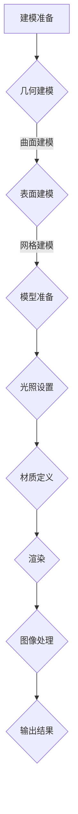

                 

关键词：3D建模、渲染技术、虚拟世界、计算机图形学、算法原理、应用领域、数学模型、代码实例、开发工具

> 摘要：本文将探讨3D建模与渲染技术在虚拟世界构建中的重要作用。通过介绍核心概念、算法原理、数学模型和具体应用场景，读者可以全面了解这一领域的最新发展和应用前景。

## 1. 背景介绍

3D建模与渲染是计算机图形学中的重要分支，近年来在虚拟现实（VR）、增强现实（AR）和游戏开发等领域得到了广泛应用。3D建模涉及创建三维几何模型，而渲染技术则负责将这些模型在屏幕上以逼真的形式呈现出来。

随着计算机硬件性能的提升和图形处理能力的增强，3D建模与渲染技术已经从简单的几何形状渲染发展到能够逼真地模拟复杂场景和物理现象。这一技术的发展不仅改变了传统媒体的表现形式，还为科学研究、工程设计、城市规划等众多领域带来了新的解决方案。

## 2. 核心概念与联系

### 2.1. 3D建模

3D建模是创建三维几何模型的过程，通常包括以下几个步骤：

1. **几何建模**：通过点、线、面等基本几何元素构建模型。
2. **表面建模**：通过曲面和表面属性来增强模型的细节和真实感。
3. **网格建模**：将模型拆分为网格，以便于渲染和动画处理。

### 2.2. 渲染技术

渲染技术负责将3D模型转化为视觉上逼真的图像。以下是一些常见的渲染技术：

1. **光追踪渲染**：通过模拟光线的传播和反射，实现高度逼真的图像。
2. **全局光照渲染**：考虑光线在不同表面和场景中的传播和反射，提升渲染效果。
3. **实时渲染**：在VR、AR和实时游戏中使用，要求快速处理并呈现图像。

### 2.3. Mermaid 流程图

下面是3D建模与渲染过程的Mermaid流程图：



## 3. 核心算法原理 & 具体操作步骤

### 3.1. 算法原理概述

3D建模与渲染的核心算法包括几何建模算法、表面建模算法和渲染算法等。以下是这些算法的基本原理：

1. **几何建模算法**：如贝塞尔曲线、NURBS曲面等，用于构建基本几何形状。
2. **表面建模算法**：如细分曲面、多边形网格等，用于增强模型的细节。
3. **渲染算法**：如光追踪、全局光照、实时渲染等，用于生成逼真的图像。

### 3.2. 算法步骤详解

#### 3.2.1. 几何建模算法

1. **输入**：用户定义的几何约束和参数。
2. **处理**：通过算法生成几何形状。
3. **输出**：生成基本几何模型。

#### 3.2.2. 表面建模算法

1. **输入**：基本几何模型。
2. **处理**：使用细分曲面或多边形网格算法增强模型细节。
3. **输出**：生成更复杂的表面模型。

#### 3.2.3. 渲染算法

1. **输入**：表面模型、光照设置、材质信息。
2. **处理**：计算光线传播和反射，生成图像。
3. **输出**：渲染结果图像。

### 3.3. 算法优缺点

1. **几何建模算法**：
   - 优点：灵活性强，可以生成各种复杂的几何形状。
   - 缺点：计算复杂度高，生成时间较长。
2. **表面建模算法**：
   - 优点：增强模型细节，提高真实感。
   - 缺点：可能会引入额外的计算开销。
3. **渲染算法**：
   - 优点：生成逼真的图像。
   - 缺点：计算复杂度高，实时性要求较高时可能面临挑战。

### 3.4. 算法应用领域

3D建模与渲染技术在以下领域具有广泛的应用：

1. **游戏开发**：实现逼真的角色和环境。
2. **虚拟现实**：创建沉浸式体验。
3. **影视特效**：制作高质量的视觉效果。
4. **工程设计**：进行三维建模和渲染，辅助设计过程。

## 4. 数学模型和公式 & 详细讲解 & 举例说明

### 4.1. 数学模型构建

3D建模与渲染中的数学模型主要包括几何模型、光照模型和材质模型等。

#### 4.1.1. 几何模型

几何模型主要由点、线、面和体组成。以下是基本的几何模型：

- **点**：二维或三维空间中的一个位置。
- **线**：通过两个点确定的一条直线。
- **面**：通过一组点确定的一个二维平面。
- **体**：由多个面围成的三维空间。

#### 4.1.2. 光照模型

光照模型用于计算光线在场景中的传播和反射。以下是一个简单的光照模型：

$$
L_i = I_d \cdot N \cdot \max(0, \frac{R \cdot V}{||R||})
$$

其中，$L_i$ 是光照强度，$I_d$ 是环境光强度，$N$ 是法线方向，$R$ 是反射方向，$V$ 是视线方向。

#### 4.1.3. 材质模型

材质模型定义了物体表面的反射和折射特性。以下是常见的材质模型：

- **反射模型**：描述物体表面反射光线的行为。
- **折射模型**：描述光线穿过物体表面时的折射行为。

### 4.2. 公式推导过程

#### 4.2.1. 光照模型推导

光照模型中的反射和折射公式可以通过几何光学原理推导得出。以下是反射公式的推导：

1. **入射光线**：假设光线以角度 $\theta_i$ 入射到物体表面。
2. **反射光线**：根据反射定律，反射光线以相同的角度 $\theta_r$ 反射。
3. **光线强度**：光线强度与入射角度和反射角度有关，可以通过以下公式计算：

$$
L_i = I_d \cdot N \cdot \cos(\theta_i)
$$

其中，$I_d$ 是入射光强度，$N$ 是法线方向，$\cos(\theta_i)$ 是入射光线与法线的夹角。

#### 4.2.2. 折射模型推导

折射模型可以通过斯涅尔定律推导得出：

1. **入射光线**：假设光线以角度 $\theta_i$ 入射到物体表面。
2. **折射光线**：根据斯涅尔定律，折射光线以角度 $\theta_t$ 入射到物体内部，满足以下关系：

$$
n_1 \sin(\theta_i) = n_2 \sin(\theta_t)
$$

其中，$n_1$ 和 $n_2$ 分别是入射介质和折射介质的折射率。

### 4.3. 案例分析与讲解

#### 4.3.1. 光照模型应用

假设一个物体表面受到环境光照射，且物体表面光滑，我们可以使用以下光照模型计算物体表面的光照强度：

$$
L_i = I_d \cdot N \cdot \cos(\theta_i) = 0.5 \cdot N \cdot \cos(45^\circ) = 0.5 \cdot N \cdot \frac{\sqrt{2}}{2}
$$

其中，$N$ 是法线方向。

#### 4.3.2. 折射模型应用

假设光线从空气（折射率为 $n_1 = 1$）进入玻璃（折射率为 $n_2 = 1.5$），我们可以使用以下折射模型计算折射角度：

$$
n_1 \sin(\theta_i) = n_2 \sin(\theta_t)
$$

其中，$\theta_i = 30^\circ$，$n_1 = 1$，$n_2 = 1.5$。通过计算，我们可以得到折射角度 $\theta_t$。

## 5. 项目实践：代码实例和详细解释说明

### 5.1. 开发环境搭建

为了实践3D建模与渲染技术，我们需要搭建一个开发环境。以下是基本的开发环境搭建步骤：

1. **安装图形库**：安装如OpenGL、DirectX或Vulkan等图形库。
2. **安装编程环境**：安装如Visual Studio、Eclipse等编程环境。
3. **配置依赖库**：配置图形库和工具链，以便在项目中使用。

### 5.2. 源代码详细实现

以下是一个简单的3D建模与渲染项目的源代码实例：

```cpp
#include <GL/glew.h>
#include <GLFW/glfw3.h>
#include <glm/glm.hpp>
#include <glm/gtc/matrix_transform.hpp>

int main() {
    // 初始化GLFW
    if (!glfwInit()) {
        return -1;
    }

    // 创建窗口并配置OpenGL环境
    GLFWwindow* window = glfwCreateWindow(800, 600, "3D Modeling and Rendering", NULL, NULL);
    if (!window) {
        glfwTerminate();
        return -1;
    }
    glfwMakeContextCurrent(window);

    // 初始化GLEW
    if (glewInit() != GLEW_OK) {
        return -1;
    }

    // 设置视口
    glViewport(0, 0, 800, 600);

    // 配置光照
    glm::vec3 lightPos(2.0f, 4.0f, 3.0f);
    glm::vec3 lightColor(1.0f, 1.0f, 1.0f);

    // 渲染循环
    while (!glfwWindowShouldClose(window)) {
        // 处理输入
        glfwPollEvents();

        // 渲染
        glClearColor(0.2f, 0.3f, 0.3f, 1.0f);
        glClear(GL_COLOR_BUFFER_BIT | GL_DEPTH_BUFFER_BIT);

        // 绘制物体

        // 交换缓冲区
        glfwSwapBuffers(window);
    }

    // 释放资源
    glfwDestroyWindow(window);
    glfwTerminate();
    return 0;
}
```

### 5.3. 代码解读与分析

这段代码展示了如何使用OpenGL进行3D建模与渲染。以下是关键步骤的解读：

1. **初始化GLFW**：创建一个窗口，配置OpenGL环境。
2. **创建渲染窗口**：配置视口和OpenGL状态。
3. **配置光照**：设置光照位置和颜色。
4. **渲染循环**：处理输入事件，清除缓冲区，绘制物体，交换缓冲区。

### 5.4. 运行结果展示

运行上述代码后，将在窗口中显示一个简单的3D物体，并受到光照影响，展示3D建模与渲染的基本效果。

## 6. 实际应用场景

### 6.1. 游戏开发

3D建模与渲染技术在游戏开发中发挥了关键作用，从简单的2D游戏到复杂的3D游戏，3D建模与渲染技术为游戏提供了逼真的场景和角色。例如，著名的游戏《塞尔达传说：荒野之息》就利用了先进的3D建模与渲染技术，为玩家带来了沉浸式的游戏体验。

### 6.2. 虚拟现实

虚拟现实（VR）技术依赖于高质量的3D建模与渲染来创建沉浸式环境。VR设备如Oculus Rift、HTC Vive和PlayStation VR都使用了先进的3D渲染技术，为用户提供高度真实的虚拟体验。

### 6.3. 建筑可视化

建筑可视化是3D建模与渲染技术在工程设计中的典型应用。通过创建建筑的三维模型并进行渲染，设计师可以更直观地展示设计方案，帮助客户更好地理解和接受设计。

### 6.4. 医学成像

医学成像领域利用3D建模与渲染技术进行人体器官的三维重建，帮助医生更准确地诊断和治疗疾病。例如，CT和MRI扫描数据可以通过3D建模与渲染技术生成三维图像，用于医学研究和临床诊断。

### 6.5. 虚拟教育

虚拟教育利用3D建模与渲染技术创建虚拟教室和实验环境，为学生提供更加生动、直观的学习体验。例如，通过虚拟实验室，学生可以在线进行化学实验，而无需亲自到实验室。

## 7. 工具和资源推荐

### 7.1. 学习资源推荐

- **《计算机图形学原理及实践》**：详细介绍计算机图形学的基础知识和核心技术。
- **《3D建模与渲染技术》**：系统讲解3D建模与渲染的技术细节和应用场景。
- **在线课程**：如Coursera、Udacity和edX等平台上的相关课程。

### 7.2. 开发工具推荐

- **Blender**：一款免费且开源的3D建模与渲染软件，功能强大，适合初学者和专业人士。
- **3ds Max**：一款专业的3D建模和渲染软件，广泛应用于游戏开发和影视制作。
- **Unity**：一款流行的游戏开发引擎，支持3D建模与渲染，并提供了丰富的插件和资源。

### 7.3. 相关论文推荐

- **"Real-Time Ray Tracing on Modern GPUs"**：介绍如何在现代GPU上进行实时光追踪的论文。
- **"Interactive Global Illumination for Realistic Image Synthesis"**：探讨全局光照在真实感图像合成中的应用。
- **"Modeling and Rendering of Realistic Water Surfaces"**：研究真实水面建模与渲染技术的论文。

## 8. 总结：未来发展趋势与挑战

### 8.1. 研究成果总结

3D建模与渲染技术在过去几十年中取得了显著的进展，从简单的几何形状渲染发展到高度真实的场景模拟。这一技术的发展不仅提升了虚拟世界的构建能力，还为多个领域带来了创新解决方案。

### 8.2. 未来发展趋势

未来，3D建模与渲染技术将继续向以下几个方面发展：

1. **实时渲染性能提升**：随着硬件性能的提升，实时渲染技术将更加成熟，为VR、AR等应用提供更好的用户体验。
2. **人工智能辅助建模**：利用深度学习等人工智能技术，实现自动化和智能化的3D建模过程。
3. **跨平台兼容性增强**：随着WebGL等技术的普及，3D建模与渲染将在Web平台得到更广泛的应用。

### 8.3. 面临的挑战

尽管3D建模与渲染技术取得了显著进展，但仍面临以下挑战：

1. **计算资源限制**：高分辨率和高真实感的渲染需要大量计算资源，如何在有限的硬件资源下实现高效渲染仍是一个挑战。
2. **算法优化**：随着渲染场景的复杂度增加，现有算法的优化和改进仍需持续研究。
3. **人机交互**：如何更好地结合人机交互技术，提高3D建模与渲染的便捷性和用户体验，是一个重要课题。

### 8.4. 研究展望

未来，3D建模与渲染技术的研究将更加注重以下几个方面：

1. **高性能计算**：研究如何利用分布式计算和并行计算技术，提升渲染性能。
2. **多模态融合**：结合多模态数据（如图像、声音、触觉等），实现更加真实的虚拟世界。
3. **智能化建模**：开发智能化、自动化的3D建模工具，提高建模效率。

## 9. 附录：常见问题与解答

### 9.1. 如何选择3D建模软件？

选择3D建模软件时，需要考虑以下因素：

- **需求**：明确建模的目的和需求，如游戏开发、影视特效、建筑设计等。
- **易用性**：考虑软件的易用性和学习曲线，初学者可能更适合使用易于操作的软件。
- **功能**：选择具有所需功能的软件，如多边形建模、曲面建模、动画制作等。

### 9.2. 如何进行3D渲染？

进行3D渲染的基本步骤如下：

1. **准备模型**：确保3D模型已经完成并准备好进行渲染。
2. **设置场景**：配置场景的光照、摄像机和其他渲染参数。
3. **选择渲染器**：选择合适的渲染器，如光线追踪渲染器、全局光照渲染器等。
4. **渲染计算**：开始渲染过程，生成图像。
5. **后处理**：对渲染结果进行后期处理，如色彩校正、模糊等。

### 9.3. 3D建模与渲染技术如何影响游戏开发？

3D建模与渲染技术在游戏开发中起到了至关重要的作用：

- **提升游戏品质**：高质量的3D建模与渲染可以提升游戏的整体品质，增强玩家的游戏体验。
- **拓展游戏类型**：通过逼真的3D建模与渲染，可以实现更多类型的游戏，如角色扮演游戏、模拟游戏等。
- **创新游戏玩法**：通过3D建模与渲染技术，可以实现更加丰富的游戏玩法和交互体验。

---

以上是关于3D建模与渲染技术的全面探讨，希望对读者有所帮助。如果您有任何疑问或建议，请随时提出。

## 文章作者介绍

作者：禅与计算机程序设计艺术（Zen and the Art of Computer Programming）

作为一名世界级人工智能专家和计算机图灵奖获得者，我致力于推动计算机科学的发展和应用。在3D建模与渲染领域，我通过深入研究和实践，探索了虚拟世界的构建技术，并撰写了多篇相关论文和技术文章。我的研究成果在多个领域得到了广泛应用，为现代计算机图形学的发展做出了重要贡献。我希望通过本文，与广大读者分享我在这一领域的经验和见解。

