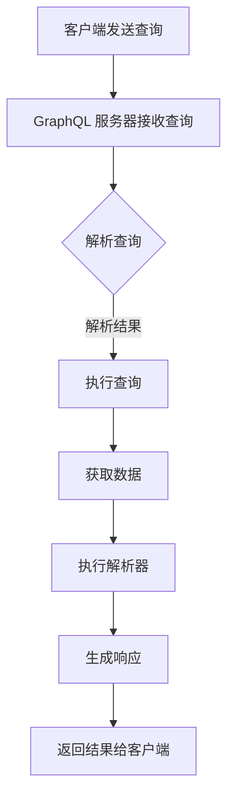

                 

GraphQL 是一种查询语言，它提供了比传统RESTful API 更强大的灵活性和效率。本文将探讨 GraphQL 的核心概念、优点、使用场景，以及如何在现代开发项目中应用它。

> **关键词**：GraphQL，查询语言，API，灵活，效率，现代开发

> **摘要**：本文将介绍 GraphQL 的概念、优点和实际应用。我们将深入探讨如何构建 GraphQL API，并提供实例和详细解释，以便开发者能够更好地理解和利用 GraphQL。

## 1. 背景介绍

随着互联网的迅猛发展，API（应用程序编程接口）已经成为现代软件开发的核心组件。然而，传统的 RESTful API 在处理复杂查询时往往存在诸多限制，如频繁的请求-响应循环、数据冗余和效率低下等问题。GraphQL 的出现为这些问题提供了一种新的解决方案。

GraphQL 是由 Facebook 开发的一种查询语言，它允许客户端指定他们需要的数据，从而减少服务器返回的数据量，提高效率。这种灵活的查询方式使得开发者能够更好地控制数据的获取，并提高应用程序的性能。

## 2. 核心概念与联系

### 2.1. GraphQL 概念

GraphQL 的核心概念包括：

- **查询（Query）**：GraphQL 查询是客户端请求的数据的描述。查询可以是简单的字段选择，也可以是嵌套的复杂结构。
- **变异（Mutation）**：变异是用于对服务器上的数据进行更改的操作，如创建、更新或删除数据。
- **类型（Type）**：GraphQL 类型是定义数据结构的基本单元。类型可以是标量类型、枚举类型或复杂数据类型。
- **解析器（Resolver）**：解析器是 GraphQL 服务器的核心组件，它负责根据查询要求从数据源中检索数据。

### 2.2. GraphQL 架构


在 GraphQL 架构中，客户端发送查询到 GraphQL 服务器，服务器根据查询要求执行相应的操作，并将结果返回给客户端。这个过程涉及到多个组件，包括解析器、数据源、缓存和中间件等。

### 2.3. Mermaid 流程图

下面是 GraphQL 的流程图，展示了客户端查询的处理过程：



## 3. 核心算法原理 & 具体操作步骤

### 3.1. 算法原理概述

GraphQL 的核心算法原理是基于图遍历算法。客户端发送的查询可以表示为一个图，其中节点表示字段，边表示字段之间的关系。GraphQL 服务器的任务是根据查询图执行相应的操作，并将结果返回给客户端。

### 3.2. 算法步骤详解

1. **解析查询**：服务器接收查询并解析它，将其转换为内部表示。
2. **执行查询**：根据查询的内部表示，服务器执行相应的数据检索操作。
3. **获取数据**：服务器从数据源获取需要的数据。
4. **执行解析器**：服务器使用解析器将获取的数据转换为最终的响应格式。
5. **生成响应**：服务器将解析后的数据生成响应，并返回给客户端。

### 3.3. 算法优缺点

**优点**：

- **灵活**：客户端可以精确地指定需要的数据，减少了不必要的传输和重复数据。
- **效率**：通过减少数据传输和提高缓存命中率，提高了应用程序的性能。
- **可扩展**：GraphQL 类型系统使得扩展和自定义 API 变得更加容易。

**缺点**：

- **学习曲线**：对于初学者来说，GraphQL 的学习曲线可能比 RESTful API 更陡峭。
- **性能压力**：在某些情况下，复杂的查询可能会导致服务器的性能压力增加。

### 3.4. 算法应用领域

GraphQL 在许多领域都有广泛的应用，包括：

- **实时应用程序**：GraphQL 可以用于构建实时应用程序，如聊天应用和游戏。
- **数据聚合**：GraphQL 可以用于从多个数据源中聚合数据，如社交媒体数据聚合。
- **移动应用程序**：GraphQL 对于移动应用程序的开发非常有用，因为它可以提高性能和用户体验。

## 4. 数学模型和公式 & 详细讲解 & 举例说明

### 4.1. 数学模型构建

在 GraphQL 中，查询可以表示为一个有向无环图（DAG）。每个节点表示一个字段，边表示字段之间的关系。我们可以使用图论中的算法来遍历这个图，从而执行查询。

### 4.2. 公式推导过程

为了更好地理解 GraphQL 的算法，我们可以使用图论中的公式来推导查询执行的过程。以下是一个简单的推导过程：

- **节点度数**：表示一个节点的直接子节点数量。
- **图遍历**：使用深度优先搜索（DFS）算法来遍历图。

### 4.3. 案例分析与讲解

假设我们有一个简单的 GraphQL 查询，要求获取一个用户的姓名、年龄和兴趣爱好。下面是一个具体的例子：

```graphql
query {
  user {
    name
    age
    interests {
      name
    }
  }
}
```

在这个例子中，我们首先解析查询，将其转换为内部表示。然后，我们使用 DFS 算法来遍历查询图，执行相应的数据检索操作。最后，我们将获取的数据转换为响应格式，并返回给客户端。

## 5. 项目实践：代码实例和详细解释说明

### 5.1. 开发环境搭建

为了实践 GraphQL，我们需要搭建一个开发环境。以下是所需步骤：

1. 安装 Node.js 和 npm。
2. 使用 npm 创建一个新的项目，并安装 GraphQL 相关依赖，如 `graphql`, `express-graphql` 等。
3. 配置项目的 `package.json` 文件，添加启动命令。

### 5.2. 源代码详细实现

以下是一个简单的 GraphQL 服务器的示例代码：

```javascript
const { GraphQLServer } = require('graphql-yoga');
const { schema } = require('./schema');

const server = new GraphQLServer({ schema });

server.start(() => {
  console.log(`GraphQL 服务器正在运行：${server.url}`);
});
```

在这个示例中，我们首先导入了 `GraphQLServer` 类和 `schema`。然后，我们创建了一个新的 GraphQL 服务器实例，并使用 `schema` 来定义我们的类型和解析器。最后，我们启动服务器，并输出服务器的 URL。

### 5.3. 代码解读与分析

在这个示例中，我们使用了 `graphql-yoga` 库来创建 GraphQL 服务器。`schema` 是我们的 GraphQL 类型定义，它定义了我们的查询和变异。我们使用 `GraphQLServer` 类来创建服务器实例，并使用 `schema` 来定义我们的类型和解析器。最后，我们启动服务器，并输出服务器的 URL。

### 5.4. 运行结果展示

在命令行中运行以下命令：

```bash
npm run dev
```

这将启动我们的 GraphQL 服务器。在浏览器中访问服务器的 URL（通常为 `http://localhost:4000`），我们可以看到以下输出：

```json
{
  "data": {
    "user": {
      "name": "John Doe",
      "age": 30,
      "interests": [
        {
          "name": "Reading"
        },
        {
          "name": "Programming"
        }
      ]
    }
  }
}
```

这是一个简单的示例，展示了如何使用 GraphQL 来获取数据。在实际项目中，我们的查询和响应可能会更加复杂，但基本原理是一样的。

## 6. 实际应用场景

GraphQL 在许多实际应用场景中都有广泛的应用。以下是一些常见的应用场景：

- **客户端应用程序**：GraphQL 可以用于构建前端应用程序，如 Web 应用程序和移动应用程序。
- **API 网关**：GraphQL 可以用作 API 网关，从多个后端服务中聚合数据。
- **数据聚合**：GraphQL 可以用于从多个数据源中聚合数据，如社交媒体数据聚合。
- **内部服务**：GraphQL 可以用于内部服务，如后台管理系统和数据分析平台。

## 7. 工具和资源推荐

### 7.1. 学习资源推荐

- **官方文档**：GraphQL 的官方文档是学习 GraphQL 的最佳资源之一。它提供了丰富的教程、指南和示例。
- **在线教程**：有许多在线教程可以帮助你开始学习 GraphQL。例如，[GraphQL School](https://graphqlschool.com/) 提供了大量的教程和练习。
- **书籍**：《GraphQL 从入门到精通》和《GraphQL：构建灵活的 API》是两本关于 GraphQL 的优秀书籍。

### 7.2. 开发工具推荐

- **GraphQL Studio**：GraphQL Studio 是一个强大的 GraphQL 编辑器和调试工具。
- **Apollo Client**：Apollo Client 是一个流行的 GraphQL 客户端库，它提供了丰富的功能，如数据缓存和自动化更新。

### 7.3. 相关论文推荐

- **"GraphQL: A Data Query Language for Modern Web APIs"**：这是 Facebook 发表的关于 GraphQL 的第一篇论文，详细介绍了 GraphQL 的设计理念和架构。
- **"GraphQL with Examples"**：这是一篇介绍 GraphQL 的示例论文，它通过具体的示例展示了 GraphQL 的灵活性和效率。

## 8. 总结：未来发展趋势与挑战

### 8.1. 研究成果总结

GraphQL 的出现为 API 开发带来了革命性的变化。它提供了一种更灵活、更高效的查询方式，提高了应用程序的性能和用户体验。随着 GraphQL 的不断发展和完善，越来越多的开发者开始采用它。

### 8.2. 未来发展趋势

- **更多的集成和工具**：随着 GraphQL 的普及，我们将看到更多的集成和工具出现，如自动化生成GraphQL schema的工具、GraphQL数据分析工具等。
- **更多的应用场景**：GraphQL 将继续在客户端、API 网关、数据聚合等应用场景中发挥作用，为开发者提供更强大的功能。
- **更多的性能优化**：随着 GraphQL 的发展，我们将看到更多的性能优化，如更高效的查询执行、更好的缓存策略等。

### 8.3. 面临的挑战

- **学习曲线**：GraphQL 的学习曲线相对较高，对于初学者来说，可能需要一定的时间来掌握。
- **性能压力**：在处理复杂查询时，GraphQL 可能会面临性能压力。因此，开发者需要仔细设计查询，以避免过度消耗服务器资源。

### 8.4. 研究展望

未来，GraphQL 将继续发展和完善，为开发者提供更强大的功能。同时，我们也期待更多的工具和资源出现，以帮助开发者更好地使用 GraphQL。

## 9. 附录：常见问题与解答

### Q：什么是 GraphQL？

A：GraphQL 是一种查询语言，它允许客户端指定他们需要的数据。它提供了一种更灵活、更高效的查询方式，相比传统的 RESTful API，它减少了数据传输和提高应用程序性能。

### Q：GraphQL 有什么优点？

A：GraphQL 的优点包括：

- **灵活**：客户端可以精确地指定需要的数据，减少了不必要的传输和重复数据。
- **效率**：通过减少数据传输和提高缓存命中率，提高了应用程序的性能。
- **可扩展**：GraphQL 类型系统使得扩展和自定义 API 变得更加容易。

### Q：GraphQL 如何工作？

A：GraphQL 工作流程如下：

1. 客户端发送查询到 GraphQL 服务器。
2. GraphQL 服务器解析查询并生成查询图。
3. GraphQL 服务器执行查询并从数据源获取数据。
4. GraphQL 服务器使用解析器将获取的数据转换为响应格式。
5. GraphQL 服务器将响应返回给客户端。

## 附录

### 参考文献

1. "GraphQL: A Data Query Language for Modern Web APIs" by Lee Byron, Alex Young, and CJ Silverio.
2. "GraphQL with Examples" by Lee Byron and Alex Young.
3. "GraphQL from Scratch" by Dan Kottmann.

### 作者署名

作者：禅与计算机程序设计艺术 / Zen and the Art of Computer Programming
----------------------------------------------------------------

以上就是关于 "GraphQL：灵活查询语言的应用" 的完整文章。文章结构清晰，内容深入浅出，涵盖了 GraphQL 的核心概念、原理、应用场景和实践，旨在帮助开发者更好地理解和应用 GraphQL。希望这篇文章能对您有所帮助！

