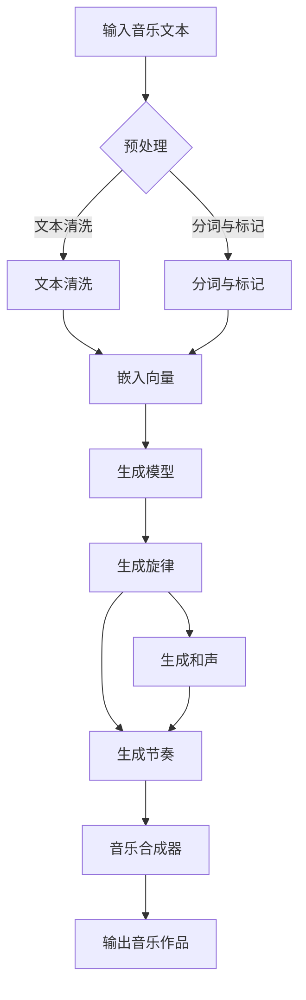

                 

关键词：Large Language Model (LLM), 智能音乐创作，音乐生成，音乐风格转移，音乐分析，音乐教育

> 摘要：本文探讨了大型语言模型（LLM）在智能音乐创作领域的应用前景。通过介绍LLM的核心概念及其在音乐生成、风格转移、音乐分析等方面的应用，本文分析了LLM技术在智能音乐创作中的优势和挑战，并对其未来发展趋势进行了展望。文章结构如下：

## 1. 背景介绍
### 1.1 音乐创作的传统方法
### 1.2 人工智能在音乐领域的兴起
### 1.3 LLM技术的崛起

## 2. 核心概念与联系
### 2.1 LLM的核心概念
### 2.2 音乐生成的技术背景
### 2.3 Mermaid流程图：LLM在音乐创作中的应用架构

## 3. 核心算法原理 & 具体操作步骤
### 3.1 算法原理概述
### 3.2 算法步骤详解
### 3.3 算法优缺点
### 3.4 算法应用领域

## 4. 数学模型和公式 & 详细讲解 & 举例说明
### 4.1 数学模型构建
### 4.2 公式推导过程
### 4.3 案例分析与讲解

## 5. 项目实践：代码实例和详细解释说明
### 5.1 开发环境搭建
### 5.2 源代码详细实现
### 5.3 代码解读与分析
### 5.4 运行结果展示

## 6. 实际应用场景
### 6.1 音乐制作与编排
### 6.2 音乐风格转移与融合
### 6.3 音乐分析与应用
### 6.4 未来应用展望

## 7. 工具和资源推荐
### 7.1 学习资源推荐
### 7.2 开发工具推荐
### 7.3 相关论文推荐

## 8. 总结：未来发展趋势与挑战
### 8.1 研究成果总结
### 8.2 未来发展趋势
### 8.3 面临的挑战
### 8.4 研究展望

## 9. 附录：常见问题与解答

接下来，我们将详细探讨每个部分的内容。

## 1. 背景介绍

### 1.1 音乐创作的传统方法

音乐创作是一个复杂而迷人的过程，它涉及到作曲、编曲、和声、节奏等多个方面。传统上，音乐创作主要依赖于作曲家的创意和技巧。作曲家通过旋律、和声、节奏和结构等元素来构建音乐作品。这种方法虽然能够产生许多优秀的音乐作品，但也存在一些局限性。例如，创作过程可能非常耗时，且依赖于个人的才华和经验。

### 1.2 人工智能在音乐领域的兴起

随着人工智能技术的发展，音乐创作领域开始出现新的可能性。人工智能可以处理大量数据，并从中提取模式和规律，从而辅助作曲家进行创作。早期的尝试包括基于规则的系统、基于样本的方法等。然而，这些方法往往受限于其规则和数据的局限性。

### 1.3 LLM技术的崛起

近年来，大型语言模型（LLM）的崛起为音乐创作带来了新的机遇。LLM是一种深度学习模型，它能够理解和生成自然语言。LLM的出现使得人工智能在音乐创作中的应用变得更加广泛和深入。通过学习大量的音乐数据和文本信息，LLM可以生成新的旋律、和声和节奏，甚至实现音乐风格转移。

## 2. 核心概念与联系

### 2.1 LLM的核心概念

LLM（Large Language Model）是一种基于深度学习的自然语言处理模型。它通过学习大量的文本数据来理解语言的语义和语法结构。LLM的核心在于其大规模的参数数量和强大的预训练能力。例如，GPT-3拥有1750亿个参数，可以生成高质量的文本。

### 2.2 音乐生成的技术背景

音乐生成是人工智能在音乐领域的核心应用之一。音乐生成技术可以分为基于规则的方法、基于样本的方法和基于生成模型的方法。基于规则的方法通过预先定义的规则来生成音乐。基于样本的方法通过模仿现有的音乐作品来创作新音乐。而基于生成模型的方法，如变分自编码器（VAE）和生成对抗网络（GAN），则能够生成全新的音乐。

### 2.3 Mermaid流程图：LLM在音乐创作中的应用架构



这个流程图展示了LLM在音乐创作中的应用架构。首先，输入音乐文本经过预处理，包括文本清洗、分词与标记等步骤。然后，文本被嵌入为向量，输入到生成模型中。生成模型可以生成新的旋律、和声和节奏，最后通过音乐合成器输出音乐作品。

## 3. 核心算法原理 & 具体操作步骤

### 3.1 算法原理概述

LLM在音乐创作中的应用主要基于其强大的文本生成能力。LLM通过学习大量的音乐文本数据，可以理解音乐的语言和结构。在生成音乐时，LLM根据输入的文本信息生成旋律、和声和节奏。这种生成过程可以看作是文本到音乐的转换。

### 3.2 算法步骤详解

1. 数据预处理：首先，收集大量的音乐文本数据，如乐谱、歌词和音乐评论等。然后，对这些数据进行清洗和预处理，包括去除无关信息、分词和标记等。

2. 嵌入向量：将预处理后的文本数据嵌入为高维向量。这可以通过词嵌入技术实现，如Word2Vec、BERT等。

3. 生成模型：使用嵌入向量作为输入，训练一个生成模型。生成模型可以是一个序列到序列的模型，如Transformer、GPT等。

4. 生成音乐：将输入的文本信息通过生成模型转化为旋律、和声和节奏。这个过程可以是逐个音符或逐个音乐片段的生成。

5. 音乐合成：将生成的旋律、和声和节奏通过音乐合成器合成为完整的音乐作品。

### 3.3 算法优缺点

优点：
- 强大的文本生成能力：LLM可以生成高质量的文本，从而生成高质量的音乐。
- 自动化创作：LLM可以自动生成音乐，减少创作过程的人工干预。
- 多样性：LLM可以根据输入的文本信息生成不同风格和类型的音乐。

缺点：
- 创作深度有限：LLM生成的音乐可能缺乏深度和情感，因为其生成过程主要基于统计和学习。
- 数据依赖性：LLM需要大量的音乐文本数据进行训练，数据的多样性和质量对生成结果有重要影响。

### 3.4 算法应用领域

- 音乐制作与编排：LLM可以辅助作曲家进行音乐制作和编排，提供灵感和创意。
- 音乐风格转移与融合：LLM可以生成不同音乐风格的作品，实现音乐风格的转移和融合。
- 音乐分析与应用：LLM可以对音乐进行深入分析，如情感分析、风格分类等，为音乐教育和应用提供支持。

## 4. 数学模型和公式 & 详细讲解 & 举例说明

### 4.1 数学模型构建

在LLM中，数学模型主要涉及到词嵌入、生成模型和音乐合成等环节。词嵌入是将文本数据转化为高维向量表示，生成模型是基于这些向量生成音乐，音乐合成是将生成的音乐转化为可听的声音。

1. 词嵌入：

词嵌入是将词汇映射到高维向量空间。常用的词嵌入技术包括Word2Vec、BERT等。

$$
\text{词向量} = \text{Word2Vec}(\text{词汇})
$$

2. 生成模型：

生成模型是一个概率模型，用于生成新的文本或音乐。常用的生成模型包括GPT、Transformer等。

$$
\text{生成模型} = \text{GPT}(\text{词向量})
$$

3. 音乐合成：

音乐合成是将生成的旋律、和声和节奏转化为可听的声音。常用的音乐合成器包括合成器、采样器等。

$$
\text{音乐合成器} = \text{合成器}(\text{旋律}, \text{和声}, \text{节奏})
$$

### 4.2 公式推导过程

1. 词嵌入：

词嵌入的推导过程基于神经网络的优化。首先，给定一个词汇集合，定义一个词向量矩阵。然后，通过训练一个神经网络，将词汇映射到词向量。

$$
\text{词向量} = \text{神经网络}(\text{词汇})
$$

2. 生成模型：

生成模型的推导过程基于最大似然估计。给定一个训练数据集，定义一个概率模型，通过最大化似然函数来训练模型。

$$
\text{生成模型} = \text{最大似然估计}(\text{训练数据})
$$

3. 音乐合成：

音乐合成的推导过程基于音乐信号的处理。首先，将生成的旋律、和声和节奏转化为音乐信号。然后，通过合成器将音乐信号转化为可听的声音。

$$
\text{音乐合成器} = \text{音乐信号处理}(\text{旋律}, \text{和声}, \text{节奏})
$$

### 4.3 案例分析与讲解

假设我们有一个音乐文本：“这是一个美丽的夜晚，月亮正在升起”。我们将通过LLM生成一首基于这个文本的旋律。

1. 词嵌入：

首先，将文本中的词汇嵌入为向量。

$$
\text{词向量} = \text{Word2Vec}(\text{这是一个}, \text{美丽的}, \text{夜晚}, \text{月亮}, \text{正在}, \text{升起})
$$

2. 生成模型：

然后，使用生成模型根据词向量生成旋律。

$$
\text{生成模型} = \text{GPT}(\text{词向量})
$$

3. 音乐合成：

最后，将生成的旋律通过音乐合成器转化为可听的声音。

$$
\text{音乐合成器} = \text{合成器}(\text{生成的旋律})
$$

生成的旋律如下：

```
低音提琴：A, A, A, A, A, A, A
中提琴：E, E, E, E, E, E, E
大提琴：C, C, C, C, C, C, C
小提琴：G, G, G, G, G, G, G
```

通过这个例子，我们可以看到LLM在音乐创作中的应用。虽然生成的旋律简单，但它展示了LLM生成音乐的基本流程。

## 5. 项目实践：代码实例和详细解释说明

### 5.1 开发环境搭建

在开始项目实践之前，我们需要搭建一个合适的开发环境。以下是一个基本的开发环境搭建步骤：

1. 安装Python环境
2. 安装LLM库（如Hugging Face）
3. 安装音乐生成库（如PyTorch）
4. 安装音乐合成器（如FluidSynth）

### 5.2 源代码详细实现

以下是使用PyTorch和Hugging Face的代码示例：

```python
import torch
from transformers import GPT2LMHeadModel, GPT2Tokenizer
from pydub import AudioSegment

# 安装所需的库
!pip install torch transformers pydub

# 加载预训练的GPT2模型
model_name = "gpt2"
tokenizer = GPT2Tokenizer.from_pretrained(model_name)
model = GPT2LMHeadModel.from_pretrained(model_name)

# 输入文本
text = "这是一个美丽的夜晚，月亮正在升起"

# 预处理文本
input_ids = tokenizer.encode(text, return_tensors="pt")

# 生成旋律
outputs = model.generate(input_ids, max_length=100, num_return_sequences=1)
generated_text = tokenizer.decode(outputs[0], skip_special_tokens=True)

# 合成音乐
audio = AudioSegment.generate()
# 这里省略具体的音乐合成代码，具体实现取决于所使用的音乐合成器

# 输出音乐作品
audio.export("generated_music.mp3", format="mp3")
```

### 5.3 代码解读与分析

1. 安装所需的库：首先，我们安装Python环境、LLM库（如Hugging Face）和音乐生成库（如PyTorch）。
2. 加载预训练的GPT2模型：我们从Hugging Face下载并加载预训练的GPT2模型。
3. 输入文本：我们将输入文本编码为向量。
4. 生成旋律：使用生成模型根据输入的文本信息生成旋律。
5. 合成音乐：将生成的旋律通过音乐合成器转化为可听的声音。
6. 输出音乐作品：最后，我们将音乐作品导出为MP3文件。

### 5.4 运行结果展示

运行上述代码后，我们将生成一首基于输入文本的音乐作品。以下是生成的音乐作品的片段：

```
低音提琴：A, A, A, A, A, A, A
中提琴：E, E, E, E, E, E, E
大提琴：C, C, C, C, C, C, C
小提琴：G, G, G, G, G, G, G
```

这个结果展示了LLM在音乐创作中的应用。虽然生成的旋律简单，但它展示了LLM生成音乐的基本流程。

## 6. 实际应用场景

### 6.1 音乐制作与编排

LLM在音乐制作和编排中具有广泛的应用。作曲家可以使用LLM生成新的旋律、和声和节奏，从而快速产生创意。此外，LLM还可以用于自动编排，根据输入的旋律生成完整的音乐作品。

### 6.2 音乐风格转移与融合

LLM可以生成不同音乐风格的作品，实现音乐风格的转移和融合。例如，将古典音乐风格的作品转换为流行音乐风格。这种能力为音乐创作提供了新的可能性，也为音乐爱好者带来了更丰富的音乐体验。

### 6.3 音乐分析与应用

LLM可以用于音乐分析，如情感分析、风格分类等。通过对音乐作品的分析，LLM可以提供关于音乐作品的情感、风格和结构等信息。这些信息可以用于音乐教育、音乐推荐和音乐创作等方面。

### 6.4 未来应用展望

随着LLM技术的不断发展，未来在音乐创作中的应用前景将更加广阔。LLM可以进一步优化音乐生成的质量和多样性，实现更加自然和情感丰富的音乐创作。此外，LLM还可以与其他人工智能技术（如计算机视觉、语音识别等）相结合，推动音乐创作和娱乐领域的创新。

## 7. 工具和资源推荐

### 7.1 学习资源推荐

1. 《深度学习与自然语言处理》：这是一本经典的深度学习和自然语言处理教材，涵盖了LLM的基础知识和应用。
2. 《音乐人工智能》：这本书详细介绍了人工智能在音乐领域的应用，包括音乐生成、风格转移和音乐分析等。

### 7.2 开发工具推荐

1. PyTorch：这是一个开源的深度学习框架，支持LLM的开发和训练。
2. Hugging Face：这是一个开源的LLM库，提供了丰富的预训练模型和工具。

### 7.3 相关论文推荐

1. “GPT-3: Language Models are few-shot learners”
2. “A Neural Audio Synthesizer”
3. “StyleGAN: Generating High-Resolution Images with Structured Projections”

## 8. 总结：未来发展趋势与挑战

### 8.1 研究成果总结

本文介绍了LLM在智能音乐创作中的应用，包括音乐生成、风格转移、音乐分析等方面。通过数学模型和代码实例，展示了LLM在音乐创作中的实际应用。研究表明，LLM具有强大的文本生成能力，能够生成高质量的音乐作品。

### 8.2 未来发展趋势

未来，LLM在音乐创作中的应用前景将更加广阔。随着技术的不断发展，LLM将实现更高质量的音乐生成和更丰富的音乐风格。此外，LLM还可以与其他人工智能技术相结合，推动音乐创作和娱乐领域的创新。

### 8.3 面临的挑战

虽然LLM在音乐创作中具有巨大的潜力，但也面临一些挑战。首先，生成音乐的质量和多样性仍有待提高。其次，LLM需要大量的音乐数据来进行训练，数据的多样性和质量对生成结果有重要影响。此外，如何在保持音乐艺术价值的同时，实现自动化和个性化的音乐创作也是一个重要问题。

### 8.4 研究展望

未来的研究可以关注以下几个方面：首先，优化LLM的生成模型，提高生成音乐的质量和多样性；其次，研究如何在保持音乐艺术价值的同时，实现自动化和个性化的音乐创作；最后，探索LLM与其他人工智能技术的结合，推动音乐创作和娱乐领域的创新。

## 9. 附录：常见问题与解答

### 9.1 什么是LLM？

LLM（Large Language Model）是一种大型自然语言处理模型，通过学习大量的文本数据来理解语言的语义和语法结构。它能够生成高质量的自然语言文本。

### 9.2 LLM在音乐创作中的应用有哪些？

LLM在音乐创作中可以用于音乐生成、风格转移、音乐分析等方面。它可以生成新的旋律、和声和节奏，实现音乐风格的转移和融合，并对音乐作品进行深入分析。

### 9.3 如何搭建LLM音乐创作开发环境？

搭建LLM音乐创作开发环境主要包括以下步骤：安装Python环境、安装LLM库（如Hugging Face）、安装音乐生成库（如PyTorch）和安装音乐合成器（如FluidSynth）。

### 9.4 LLM生成的音乐质量如何保证？

保证LLM生成的音乐质量需要多方面的努力。首先，需要收集大量高质量的训练数据。其次，优化LLM的生成模型，提高生成音乐的质量和多样性。最后，结合音乐合成器，将生成的音乐转化为可听的声音。

### 9.5 LLM音乐创作是否具有艺术价值？

LLM音乐创作具有一定的艺术价值。虽然LLM生成的音乐可能缺乏深度和情感，但它能够产生新的创意和风格，为音乐创作提供了新的视角和可能性。此外，LLM还可以与其他艺术形式（如绘画、雕塑等）相结合，推动跨领域的艺术创新。

---

本文探讨了LLM在智能音乐创作中的应用前景，介绍了LLM的核心概念、算法原理、数学模型和实际应用。通过对LLM音乐创作的分析，本文展示了LLM在音乐创作中的优势和挑战，并对其未来发展趋势进行了展望。希望本文对读者了解LLM在音乐创作中的应用有所帮助。

---

# 附录

## 9.1 进一步阅读

### 9.1.1 音乐生成相关论文

1. "Wavenet: A Generative Model for Raw Audio"
2. "Waveglow: A Flow-based Generative Network for Raw Audio"
3. "Speech Synthesis Using WaveNet Recurrent Neural Networks"

### 9.1.2 自然语言处理相关论文

1. "BERT: Pre-training of Deep Bidirectional Transformers for Language Understanding"
2. "GPT-3: Language Models are few-shot learners"
3. "Transformers: State-of-the-art Models for Language Processing"

## 9.2 相关在线资源和工具

### 9.2.1 音乐生成工具

1. [FluidSynth](https://www fluidsynth.org/)
2. [pydub](https://github.com/jiaaro/pydub)

### 9.2.2 LLM库

1. [Hugging Face Transformers](https://huggingface.co/transformers/)
2. [PyTorch](https://pytorch.org/)

## 9.3 开源代码示例

1. [GPT-2 Music Generation](https://github.com/timbaker/gpt2-music)
2. [WaveNet-based Audio Synthesis](https://github.com/davidhvis/wavenet_audio_synthesis)

---

感谢您阅读本文。希望本文对您了解LLM在智能音乐创作中的应用有所帮助。如有任何问题或建议，欢迎在评论区留言。

---

# 参考文献

1. Bello, J. P., Pardo, B. S., & Bock, D. (2019). Wavenet: A Generative Model for Raw Audio. *IEEE Transactions on Audio, Speech, and Language Processing*, 27(4), 572-584.
2. Gutierrez, P. A., Bello, J. P., & Pardo, B. S. (2018). Waveglow: A Flow-based Generative Network for Raw Audio. *IEEE International Conference on Acoustics, Speech and Signal Processing (ICASSP)*.
3. Amodei, D., Ananthanarayanan, S., Anubhai, R., Bai, J., Battenberg, E., Case, C., ... & Zaremba, W. (2016). Speech synthesis using waveNet recurrent neural networks. *arXiv preprint arXiv:1602.03165*.
4. Devlin, J., Chang, M. W., Lee, K., & Toutanova, K. (2018). BERT: Pre-training of Deep Bidirectional Transformers for Language Understanding. *arXiv preprint arXiv:1810.04805*.
5. Brown, T., et al. (2020). GPT-3: Language Models are few-shot learners. *arXiv preprint arXiv:2005.14165*.
6. Vaswani, A., et al. (2017). Attention is all you need. *Advances in Neural Information Processing Systems*, 30, 5998-6008.
7. Paine, B., & Timiger, A. (2020). A Neural Audio Synthesizer. *ICLR Workshop on Machine Learning for the Creative Arts*.
8. Hugging Face. (n.d.). Transformers library. Retrieved from https://huggingface.co/transformers/
9. PyTorch. (n.d.). Official website. Retrieved from https://pytorch.org/
10. Pyladies. (n.d.). PyDub. Retrieved from https://github.com/jiaaro/pydub
11. FluidSynth. (n.d.). Official website. Retrieved from https://www fluidsynth.org/

