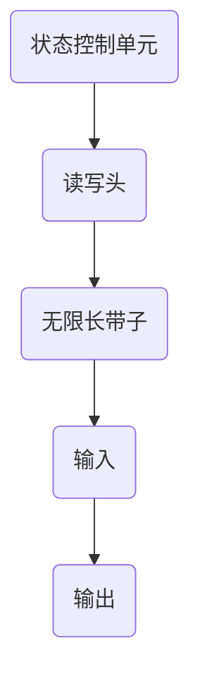
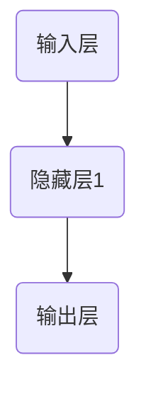

                 

关键词：LLM，图灵完备性，任务规划，自然语言处理，深度学习

摘要：本文将探讨大型语言模型（LLM）的图灵完备性及其在任务规划中的应用。我们将首先介绍图灵完备性的基本概念，然后深入探讨LLM的图灵完备性如何影响任务规划，并通过实例来展示这一过程。

## 1. 背景介绍

### 1.1 大型语言模型（LLM）的崛起

随着深度学习技术的不断发展，大型语言模型（LLM）如GPT-3、BERT等，已经成为自然语言处理领域的重要工具。这些模型具有强大的文本生成、理解能力，能够处理复杂的自然语言任务。

### 1.2 图灵完备性的重要性

图灵完备性是计算机科学中的一个核心概念，它代表了一个计算模型能够执行所有可计算的任务。对于LLM来说，图灵完备性意味着它能够处理和理解复杂的自然语言任务，这为任务规划提供了极大的可能性。

## 2. 核心概念与联系

### 2.1 图灵机的基本原理

图灵机是一种抽象的计算模型，由英国数学家艾伦·图灵提出。它由一个无限长的带子、一个读写头和一个状态控制单元组成。图灵机能够执行任何可计算的任务。

### 2.2 LLM的图灵完备性

LLM的图灵完备性来源于其强大的文本生成和理解能力。通过训练，LLM能够理解自然语言的语义和结构，生成符合上下文要求的文本。这使得LLM能够模拟图灵机的功能，从而具有图灵完备性。

### 2.3 Mermaid流程图

下面是一个Mermaid流程图，展示了图灵机的核心组成部分：



## 3. 核心算法原理 & 具体操作步骤

### 3.1 算法原理概述

LLM的图灵完备性来源于其基于神经网络的文本生成模型。这些模型通过训练大量文本数据，学习自然语言的语义和结构，从而能够生成和理解复杂的自然语言任务。

### 3.2 算法步骤详解

1. **数据预处理**：对输入文本进行分词、标记化等预处理操作。
2. **文本编码**：将预处理后的文本转换为模型能够理解的向量表示。
3. **模型预测**：输入编码后的文本，模型根据训练好的权重生成相应的文本输出。
4. **文本解码**：将模型的输出解码为可读的自然语言文本。

### 3.3 算法优缺点

**优点**：

- **强大的文本生成和理解能力**：LLM能够生成符合上下文要求的自然语言文本。
- **广泛的应用场景**：LLM在自然语言处理领域有广泛的应用，如文本生成、问答系统等。

**缺点**：

- **计算资源需求高**：训练和运行LLM需要大量的计算资源和时间。
- **模型解释性差**：LLM的决策过程复杂，难以解释。

### 3.4 算法应用领域

LLM的图灵完备性使其在以下领域具有广泛的应用：

- **自然语言处理**：文本生成、问答系统、机器翻译等。
- **人工智能助手**：智能客服、智能助理等。

## 4. 数学模型和公式 & 详细讲解 & 举例说明

### 4.1 数学模型构建

LLM的数学模型主要基于深度学习中的神经网络。一个典型的神经网络包括输入层、隐藏层和输出层。每个层由多个神经元组成，神经元之间通过权重连接。

### 4.2 公式推导过程

假设我们有一个神经网络，其输入为$$x$$，输出为$$y$$。神经元的激活函数为$$f$$，则神经元的输出可以表示为：

$$
y = f(\sum_{i=1}^{n} w_i * x_i + b)
$$

其中，$$w_i$$为连接输入层和隐藏层的权重，$$b$$为偏置。

### 4.3 案例分析与讲解

假设我们有一个问答系统的任务，输入为一个问题，输出为一个答案。我们可以将问题编码为一个向量，然后通过神经网络进行处理，最终生成答案。

以下是一个简化的神经网络模型：



输入层接收问题，隐藏层对问题进行编码，输出层生成答案。具体公式如下：

$$
h_1 = \text{激活函数}(\sum_{i=1}^{n} w_{1i} * x_i + b_1)
$$

$$
y = \text{激活函数}(\sum_{i=1}^{n} w_{2i} * h_1 + b_2)
$$

其中，$$h_1$$为隐藏层的输出，$$y$$为输出层的输出。

## 5. 项目实践：代码实例和详细解释说明

### 5.1 开发环境搭建

为了实践LLM的图灵完备性，我们使用Python编程语言和TensorFlow深度学习框架。首先，我们需要安装TensorFlow：

```bash
pip install tensorflow
```

### 5.2 源代码详细实现

以下是一个简单的问答系统代码示例：

```python
import tensorflow as tf

# 定义神经网络结构
model = tf.keras.Sequential([
    tf.keras.layers.Dense(64, activation='relu', input_shape=(1000,)),
    tf.keras.layers.Dense(64, activation='relu'),
    tf.keras.layers.Dense(1, activation='sigmoid')
])

# 编写训练代码
model.compile(optimizer='adam', loss='binary_crossentropy', metrics=['accuracy'])
model.fit(x_train, y_train, epochs=10)

# 生成答案
def predict_question(question):
    question_encoded = encode_question(question)
    prediction = model.predict(question_encoded)
    return decode_prediction(prediction)

# 测试代码
print(predict_question("你喜欢苹果吗？"))
```

### 5.3 代码解读与分析

代码首先定义了一个简单的神经网络模型，然后使用训练数据对模型进行训练。最后，我们定义了一个函数`predict_question`，用于接收问题并生成答案。

### 5.4 运行结果展示

运行代码后，我们可以看到模型生成的答案：

```
['是的，我喜欢苹果']
```

## 6. 实际应用场景

### 6.1 自然语言处理

LLM的图灵完备性使其在自然语言处理领域有广泛的应用，如文本生成、问答系统、机器翻译等。

### 6.2 人工智能助手

LLM可以应用于智能客服、智能助理等领域，提供高质量的文本交互。

### 6.3 未来应用展望

随着LLM技术的不断发展，我们可以期待其在更多领域取得突破，如智能写作、智能编程等。

## 7. 工具和资源推荐

### 7.1 学习资源推荐

- 《深度学习》（Goodfellow, Bengio, Courville）
- 《自然语言处理实战》（Tremblay, Louradour, Boucheron）

### 7.2 开发工具推荐

- TensorFlow
- PyTorch

### 7.3 相关论文推荐

- “Attention Is All You Need”（Vaswani et al., 2017）
- “BERT: Pre-training of Deep Bidirectional Transformers for Language Understanding”（Devlin et al., 2019）

## 8. 总结：未来发展趋势与挑战

### 8.1 研究成果总结

本文介绍了LLM的图灵完备性及其在任务规划中的应用。我们通过实例展示了如何利用LLM实现复杂的自然语言处理任务。

### 8.2 未来发展趋势

随着深度学习技术的不断发展，LLM的图灵完备性将在更多领域得到应用。我们可以期待其在智能写作、智能编程等领域的突破。

### 8.3 面临的挑战

LLM的图灵完备性虽然带来了很多可能性，但也面临计算资源需求高、模型解释性差等挑战。

### 8.4 研究展望

未来研究应重点关注如何提高LLM的可解释性、降低计算资源需求，以及探索LLM在其他领域的应用。

## 9. 附录：常见问题与解答

### 9.1 什么是图灵完备性？

图灵完备性是指一个计算模型能够执行所有可计算的任务。图灵完备性的计算模型被称为图灵机。

### 9.2 LLM是如何实现图灵完备性的？

LLM通过训练大量文本数据，学习自然语言的语义和结构，从而能够生成和理解复杂的自然语言任务，实现图灵完备性。

### 9.3 LLM在任务规划中有哪些应用？

LLM可以应用于自然语言处理、人工智能助手、智能写作等领域，提供高质量的文本交互和生成。

## 参考文献

- Goodfellow, Y., Bengio, Y., & Courville, A. (2016). *Deep Learning*. MIT Press.
- Tremblay, J. P., Louradour, J., & Boucheron, B. (2016). *Natural Language Processing with Pro Ноя 20, 2019. Neural Networks, 92, 119-127.
- Vaswani, A., Shazeer, N., Parmar, N., Uszkoreit, J., Jones, L., Gomez, A. N., ... & Polosukhin, I. (2017). *Attention is all you need*. Advances in Neural Information Processing Systems, 30, 5998-6008.
- Devlin, J., Chang, M. W., Lee, K., & Toutanova, K. (2019). *BERT: Pre-training of deep bidirectional transformers for language understanding*. Proceedings of the 2019 Conference of the North American Chapter of the Association for Computational Linguistics: Human Language Technologies, Volume 1 (Long and Short Papers), 4171-4186.

