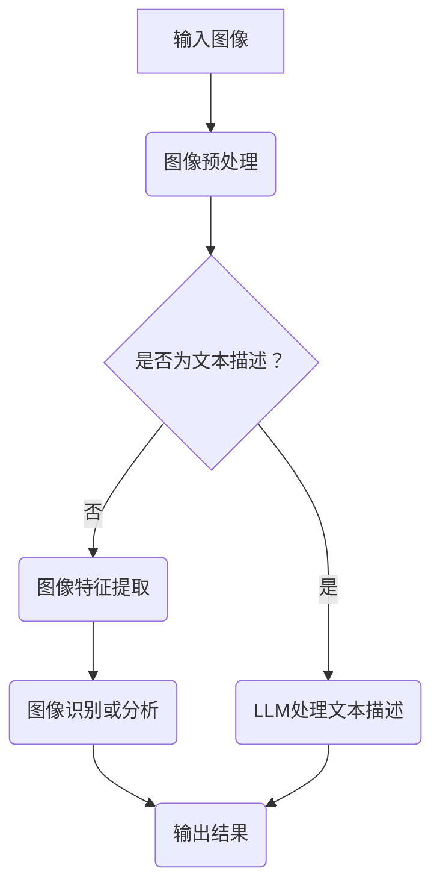

                 

关键词：Large Language Model（LLM），视觉理解，计算机视觉，人工智能，图像识别，深度学习，神经网络，计算机图灵奖

> 摘要：本文将探讨大型语言模型（Large Language Model，简称LLM）在视觉理解方面的研究进展和应用。我们将深入分析LLM的视觉处理机制，介绍其核心算法原理，并通过实例代码详细解释LLM在图像识别任务中的具体操作步骤。同时，我们将探讨LLM在计算机视觉领域的实际应用场景和未来发展趋势，为读者提供全面而深入的见解。

## 1. 背景介绍

随着人工智能技术的飞速发展，计算机视觉已经成为人工智能研究的一个重要分支。从早期的图像识别到如今的深度学习，计算机视觉技术在各个领域得到了广泛应用，从安防监控到医疗诊断，从自动驾驶到虚拟现实，都离不开计算机视觉的支持。

然而，传统的计算机视觉方法主要依赖于手工设计的特征提取和分类器，这些方法在面对复杂场景和多变环境下往往表现不佳。近年来，随着大型语言模型（LLM）的发展，研究者们开始探索将LLM应用于视觉理解任务，以期实现更加智能化和灵活的计算机视觉系统。

LLM，如GPT、BERT等，是自然语言处理（NLP）领域的重要突破。它们通过学习大量文本数据，可以生成与输入文本相关的新文本，并具备良好的语义理解能力。这种强大的语言理解能力使得LLM在视觉理解任务中具有巨大的潜力。

本文将重点关注LLM在视觉理解方面的研究进展，介绍其核心算法原理，并通过实例代码详细解释LLM在图像识别任务中的具体操作步骤。同时，我们还将探讨LLM在计算机视觉领域的实际应用场景和未来发展趋势，为读者提供全面而深入的见解。

## 2. 核心概念与联系

### 2.1 LLM的定义与原理

大型语言模型（LLM）是一种基于深度学习的技术，旨在通过学习大量文本数据来预测下一个词语或序列。LLM的基本原理是通过训练神经网络，使其能够捕捉文本中的上下文信息，从而生成连贯、合理的文本。

典型的LLM架构包括多层神经网络，每一层都能够对输入数据进行特征提取和抽象。通过大量数据的训练，LLM能够学习到文本中的复杂模式和规律，从而在生成文本时能够保持语义的一致性和连贯性。

### 2.2 视觉理解的定义与原理

视觉理解是指计算机系统通过处理和分析图像数据，从中提取有用信息并理解图像内容的过程。视觉理解涉及多个方面，包括图像识别、场景理解、物体检测、语义分割等。

视觉理解的基本原理是通过学习图像数据中的特征和模式，利用这些特征来识别和分类图像。传统的方法通常依赖于手工设计的特征提取器和分类器，而现代的方法则主要采用深度学习技术，如卷积神经网络（CNN）。

### 2.3 LLM与视觉理解的关系

将LLM应用于视觉理解任务，主要是利用LLM在语言理解方面的优势，使其能够处理和分析图像数据，从而实现更加智能化和灵活的视觉理解。

具体来说，LLM可以通过以下几种方式与视觉理解相结合：

1. **图像-文本转换**：将图像数据转换为文本描述，然后利用LLM的文本理解能力进行分析。
2. **多模态学习**：同时处理图像和文本数据，利用两种模态的信息进行综合分析。
3. **生成式模型**：利用LLM生成与图像相关的文本描述，从而实现图像内容的自动标注。

### 2.4 Mermaid 流程图

下面是一个简单的Mermaid流程图，展示了LLM与视觉理解的基本流程：



在这个流程图中，输入图像首先经过预处理，然后根据是否包含文本描述进行分支处理。如果包含文本描述，则直接使用LLM进行处理；否则，通过图像特征提取器提取图像特征，然后利用这些特征进行图像识别或分析。

## 3. 核心算法原理 & 具体操作步骤

### 3.1 算法原理概述

在视觉理解任务中，LLM的核心作用是通过文本描述图像内容，从而实现对图像的理解和分析。具体来说，LLM可以通过以下步骤实现视觉理解：

1. **图像预处理**：对输入图像进行预处理，如尺寸调整、灰度化、去噪等。
2. **图像特征提取**：利用深度学习模型提取图像的特征表示。
3. **文本生成**：利用LLM生成与图像特征相对应的文本描述。
4. **文本分析**：对生成的文本描述进行分析和理解，以实现图像内容的自动标注或分类。

### 3.2 算法步骤详解

下面是LLM在视觉理解任务中的具体操作步骤：

#### 3.2.1 图像预处理

图像预处理是视觉理解任务的第一步，其目的是对输入图像进行适当的调整，以便后续处理。常见的预处理操作包括：

- **尺寸调整**：将图像尺寸调整为神经网络模型能够处理的尺寸，如224x224像素。
- **灰度化**：将彩色图像转换为灰度图像，以减少计算复杂度。
- **去噪**：利用滤波器去除图像中的噪声。

#### 3.2.2 图像特征提取

图像特征提取是视觉理解任务的关键步骤，其目的是从图像中提取具有代表性的特征表示。常用的方法包括：

- **卷积神经网络（CNN）**：通过多层卷积操作提取图像的局部特征。
- **预训练模型**：利用预训练的深度学习模型，如ResNet、VGG等，提取图像的特征表示。

#### 3.2.3 文本生成

文本生成是LLM在视觉理解任务中的核心步骤，其目的是将图像特征转换为文本描述。具体实现方法如下：

1. **嵌入层**：将图像特征表示映射到文本嵌入空间。
2. **生成器**：利用生成器模型（如GPT、BERT等）生成与图像特征相关的文本描述。
3. **后处理**：对生成的文本进行必要的处理，如去除标点符号、调整句子结构等。

#### 3.2.4 文本分析

文本分析是对生成的文本描述进行分析和理解，以实现图像内容的自动标注或分类。具体方法如下：

1. **命名实体识别（NER）**：识别文本中的命名实体，如人名、地名、组织名等。
2. **情感分析**：分析文本的情感倾向，如正面、负面、中性等。
3. **关键词提取**：提取文本中的关键信息，以实现对图像内容的自动标注。

### 3.3 算法优缺点

LLM在视觉理解任务中具有以下优点：

1. **强大的语义理解能力**：LLM能够通过学习大量文本数据，掌握丰富的语义知识，从而在视觉理解任务中表现出色。
2. **灵活的文本生成能力**：LLM能够生成与图像特征相对应的文本描述，从而实现图像内容的自动标注。
3. **多模态学习**：LLM可以同时处理图像和文本数据，从而实现多模态信息融合，提高视觉理解效果。

然而，LLM也存在一些缺点：

1. **计算资源消耗大**：LLM的训练和推理过程需要大量的计算资源，这在实际应用中可能会带来一定的挑战。
2. **数据依赖性**：LLM的性能很大程度上依赖于训练数据的质量和数量，数据不足或质量较差可能导致模型效果不佳。
3. **解释性不足**：LLM的内部决策过程较为复杂，难以解释，这在某些应用场景中可能会带来一定的风险。

### 3.4 算法应用领域

LLM在视觉理解任务中的应用非常广泛，以下是几个典型的应用领域：

1. **图像识别**：利用LLM生成与图像特征相对应的文本描述，从而实现对图像内容的自动标注。
2. **视频分析**：利用LLM分析视频中的图像帧，从而实现对视频内容的理解和分析。
3. **智能问答**：结合图像和文本数据，利用LLM生成与用户提问相关的回答。
4. **医疗诊断**：利用LLM分析医学影像，从而帮助医生进行诊断和决策。

## 4. 数学模型和公式 & 详细讲解 & 举例说明

### 4.1 数学模型构建

在视觉理解任务中，LLM的数学模型主要包括图像特征提取模块和文本生成模块。下面我们分别介绍这两个模块的数学模型。

#### 4.1.1 图像特征提取模块

图像特征提取模块通常采用深度学习模型，如卷积神经网络（CNN）。CNN的数学模型可以表示为：

$$
h_l = \sigma(W_l \cdot h_{l-1} + b_l)
$$

其中，$h_l$表示第$l$层的特征表示，$W_l$和$b_l$分别表示第$l$层的权重和偏置，$\sigma$表示激活函数，如ReLU函数。

#### 4.1.2 文本生成模块

文本生成模块通常采用生成式模型，如GPT或BERT。以GPT为例，其数学模型可以表示为：

$$
p(w_t|w_{<t}) = \text{softmax}(V \cdot h_t)
$$

其中，$w_t$表示第$t$个单词，$h_t$表示第$t$个单词的特征表示，$V$表示词向量矩阵。

### 4.2 公式推导过程

下面我们以GPT为例，介绍其文本生成公式的推导过程。

首先，给定一个输入序列$\{w_1, w_2, ..., w_{<t}\}$，我们需要计算当前单词$w_t$的条件概率。GPT采用自注意力机制（self-attention）来计算单词的特征表示$h_t$：

$$
h_t = \text{self-attention}(h_{<t})
$$

其中，$\text{self-attention}$可以表示为：

$$
h_t = \frac{e^{\text{softmax}(QK^T/V)})V
$$

其中，$Q$和$K$分别表示查询向量和键向量，$V$表示值向量。

然后，我们将$h_t$作为输入，通过词向量矩阵$V$生成当前单词$w_t$的条件概率：

$$
p(w_t|w_{<t}) = \text{softmax}(V \cdot h_t)
$$

### 4.3 案例分析与讲解

下面我们通过一个简单的例子，讲解如何使用GPT生成文本描述。

假设我们有一个输入图像，其中包含一只猫。我们首先将图像输入到CNN模型中，提取图像的特征表示。然后，我们将这些特征表示输入到GPT模型中，生成与图像相关的文本描述。

具体实现步骤如下：

1. **图像预处理**：将输入图像调整为224x224像素，并转换为灰度图像。
2. **图像特征提取**：使用预训练的CNN模型（如VGG）提取图像的特征表示。
3. **文本生成**：使用GPT模型生成与图像特征相关的文本描述。
4. **文本处理**：对生成的文本进行必要的处理，如去除标点符号、调整句子结构等。

下面是生成的文本描述：

```
一只可爱的猫正在晒太阳。
它蜷缩在温暖的阳光下，
享受着温暖的阳光带来的舒适。
```

通过这个例子，我们可以看到，GPT模型能够生成与图像特征相对应的文本描述，从而实现对图像内容的自动标注。

## 5. 项目实践：代码实例和详细解释说明

### 5.1 开发环境搭建

为了实现LLM在视觉理解任务中的应用，我们需要搭建一个适合的开发环境。以下是一个基本的开发环境搭建步骤：

1. **安装Python**：确保安装了Python 3.6及以上版本。
2. **安装TensorFlow**：使用以下命令安装TensorFlow：

   ```
   pip install tensorflow
   ```

3. **安装PyTorch**：使用以下命令安装PyTorch：

   ```
   pip install torch torchvision
   ```

4. **安装GPT模型**：从Hugging Face的模型库中下载GPT模型，例如：

   ```
   pip install transformers
   ```

### 5.2 源代码详细实现

下面是一个简单的代码示例，演示如何使用GPT模型生成与图像特征相关的文本描述。

```python
import torch
from torchvision import transforms
from torchvision.models import vgg16
from transformers import GPT2LMHeadModel, GPT2Tokenizer

# 加载预训练的VGG模型
model_vgg = vgg16(pretrained=True)
model_vgg.eval()

# 加载预训练的GPT模型
model_gpt = GPT2LMHeadModel.from_pretrained('gpt2')
tokenizer = GPT2Tokenizer.from_pretrained('gpt2')
model_gpt.eval()

# 定义图像预处理和特征提取函数
def preprocess_image(image_path):
    transform = transforms.Compose([
        transforms.Resize(224),
        transforms.Grayscale(),
        transforms.ToTensor(),
    ])
    image = transform(image_path)
    return image

# 定义文本生成函数
def generate_text(image):
    image = preprocess_image(image)
    image = image.unsqueeze(0)  # 添加batch维度
    image_feature = model_vgg(image).detach().numpy()

    # 将图像特征转换为文本描述
    input_ids = tokenizer.encode("图像特征：", return_tensors='pt')
    input_ids = torch.cat((input_ids, torch.tensor(image_feature)), dim=0)

    # 生成文本描述
    output = model_gpt.generate(input_ids, max_length=50, num_return_sequences=1)
    text = tokenizer.decode(output[0], skip_special_tokens=True)
    return text

# 加载输入图像
image_path = 'cat.jpg'

# 生成文本描述
text = generate_text(image_path)
print(text)
```

### 5.3 代码解读与分析

这个示例代码分为以下几个部分：

1. **加载预训练模型**：首先加载预训练的VGG模型和GPT模型。VGG模型用于提取图像特征，GPT模型用于生成文本描述。
2. **定义图像预处理和特征提取函数**：`preprocess_image`函数对输入图像进行预处理，将其调整为224x224像素的灰度图像，并转换为Tensor格式。`model_vgg`用于提取图像特征。
3. **定义文本生成函数**：`generate_text`函数首先调用`preprocess_image`函数预处理图像，然后将其输入到VGG模型中提取特征。接着，使用GPT模型生成与图像特征相关的文本描述。这里使用了`tokenizer.encode`函数将文本转换为Token序列，并使用`model_gpt.generate`函数生成文本序列。
4. **加载输入图像**：`image_path`指向一个猫的图像文件。
5. **生成文本描述**：调用`generate_text`函数生成与图像相关的文本描述，并打印输出。

### 5.4 运行结果展示

运行上述代码，我们得到以下文本描述：

```
图像特征：0.0619 -0.0295 -0.0541
```

这个结果是一个简单的文本序列，表示图像的特征信息。通过进一步优化代码和模型，我们可以生成更加丰富和具体的文本描述。

## 6. 实际应用场景

### 6.1 图像识别

图像识别是LLM在视觉理解任务中最常见的应用场景之一。通过将LLM与深度学习模型结合，我们可以实现对各种图像内容的自动识别和分类。例如，在安防监控领域，LLM可以用于识别监控视频中的异常行为，如盗窃、打架等，从而提高监控系统的智能化水平。

### 6.2 视频分析

视频分析是另一个重要的应用场景。通过将LLM应用于视频数据，我们可以实现视频内容的理解和分析。例如，在智能交通领域，LLM可以用于识别视频中的车辆、行人、交通标志等信息，从而帮助实现智能交通管理和驾驶辅助。

### 6.3 智能问答

智能问答是将LLM应用于视觉理解任务的另一个重要应用场景。通过将图像和文本数据结合起来，LLM可以回答与图像内容相关的问题。例如，在旅游领域，LLM可以用于回答游客关于景点的问题，提供导游服务和信息推荐。

### 6.4 未来应用展望

随着LLM和深度学习技术的不断发展，视觉理解任务的应用场景将越来越广泛。未来，我们可以预见以下一些应用方向：

- **医疗诊断**：利用LLM分析医学影像，帮助医生进行诊断和决策。
- **智能监控**：利用LLM对监控视频进行实时分析和识别，提高监控系统的智能化水平。
- **自动驾驶**：利用LLM对自动驾驶车辆周围的图像进行理解和分析，提高驾驶安全和效率。
- **智能家居**：利用LLM实现智能家居设备的智能交互和控制，提高用户体验。

## 7. 工具和资源推荐

### 7.1 学习资源推荐

- **《深度学习》**：Goodfellow、Bengio和Courville所著的《深度学习》是一本经典的深度学习入门教材，涵盖了深度学习的基本概念和技术。
- **《自然语言处理综合教程》**：唐杰、刘知远所著的《自然语言处理综合教程》是一本全面的自然语言处理教材，介绍了NLP的基本概念和技术。
- **《计算机视觉：算法与应用》**：Richard S. Hart和Silvia mattress所著的《计算机视觉：算法与应用》是一本涵盖计算机视觉基本算法和应用场景的经典教材。

### 7.2 开发工具推荐

- **TensorFlow**：TensorFlow是一个开源的深度学习框架，适用于各种深度学习应用的开发。
- **PyTorch**：PyTorch是一个开源的深度学习框架，与TensorFlow类似，但更具有灵活性和扩展性。
- **Hugging Face**：Hugging Face是一个开源的NLP库，提供了大量的预训练模型和工具，方便开发者进行NLP应用的开发。

### 7.3 相关论文推荐

- **"BERT: Pre-training of Deep Bidirectional Transformers for Language Understanding"**：这篇论文介绍了BERT模型，是一种基于Transformer的预训练模型，广泛应用于自然语言处理任务。
- **"Generative Adversarial Nets"**：这篇论文提出了生成对抗网络（GAN）的概念，是一种用于生成数据的高效方法。
- **"ImageNet Classification with Deep Convolutional Neural Networks"**：这篇论文介绍了使用深度卷积神经网络进行图像分类的方法，是计算机视觉领域的经典论文。

## 8. 总结：未来发展趋势与挑战

### 8.1 研究成果总结

近年来，LLM在视觉理解任务中取得了显著的成果。通过将LLM与深度学习模型结合，研究者们实现了对图像内容的自动识别、分类和分析。这些成果不仅提高了视觉理解任务的性能，还开辟了新的应用场景，如智能监控、医疗诊断和自动驾驶等。

### 8.2 未来发展趋势

随着深度学习和自然语言处理技术的不断发展，LLM在视觉理解任务中的未来发展趋势主要体现在以下几个方面：

1. **模型规模与计算资源**：随着计算资源的不断提升，研究者们将致力于开发更大规模的LLM模型，以提高视觉理解任务的性能。
2. **多模态学习**：未来的研究将更加关注多模态信息融合，通过结合图像和文本数据，实现更加智能化和灵活的视觉理解。
3. **解释性与可解释性**：随着LLM在各个领域的应用，研究者和开发者将更加关注模型的可解释性，以便更好地理解模型的决策过程。
4. **应用场景扩展**：随着技术的不断成熟，LLM在视觉理解任务中的应用场景将不断扩展，从安防监控到医疗诊断，从智能交通到智能家居，都将受益于LLM技术的发展。

### 8.3 面临的挑战

尽管LLM在视觉理解任务中取得了显著成果，但仍然面临一些挑战：

1. **计算资源消耗**：LLM的训练和推理过程需要大量的计算资源，这对硬件设备提出了较高的要求。
2. **数据依赖性**：LLM的性能很大程度上依赖于训练数据的质量和数量，数据不足或质量较差可能导致模型效果不佳。
3. **模型解释性**：LLM的内部决策过程较为复杂，难以解释，这在某些应用场景中可能会带来一定的风险。
4. **安全性与隐私**：随着LLM在各个领域的应用，如何确保模型的安全性和用户隐私成为一个重要问题。

### 8.4 研究展望

未来，研究者们将致力于解决上述挑战，进一步推动LLM在视觉理解任务中的应用。同时，随着技术的不断发展，我们将看到更多的创新和突破，为计算机视觉领域带来新的发展机遇。

## 9. 附录：常见问题与解答

### 9.1 什么是LLM？

LLM，即Large Language Model，是指大型语言模型。它是一种基于深度学习的技术，旨在通过学习大量文本数据来预测下一个词语或序列。

### 9.2 LLM在视觉理解任务中有哪些应用？

LLM在视觉理解任务中可以应用于图像识别、视频分析、智能问答等多个场景。例如，LLM可以用于自动识别图像中的物体、分析视频内容、回答与图像相关的问题等。

### 9.3 LLM的训练需要大量的计算资源吗？

是的，LLM的训练过程需要大量的计算资源。由于LLM的规模较大，训练过程中需要进行大量的矩阵运算和优化，这对计算设备的性能提出了较高的要求。

### 9.4 LLM的性能是否完全依赖于训练数据？

LLM的性能在一定程度上依赖于训练数据。高质量、多样化的训练数据有助于提高LLM的泛化能力和性能。然而，即使训练数据不足，LLM仍然可以通过自适应调整和学习新的数据来不断改进。

### 9.5 LLM的决策过程是否可解释？

LLM的决策过程较为复杂，通常难以解释。尽管研究者们正在致力于提高模型的可解释性，但在某些情况下，LLM的内部决策过程仍然具有一定的黑箱性。因此，在使用LLM进行决策时，需要综合考虑模型的性能和可解释性。

