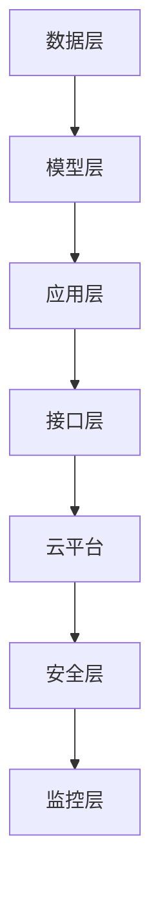

                 

关键词：AI云迁移、成本降低、无缝交互、Lepton AI

摘要：本文将探讨Lepton AI在云平台迁移中的应用，通过详细的技术分析，提供一套有效的云迁移方案，旨在降低迁移成本，实现系统与云平台的无缝交互。我们将从背景介绍、核心概念与联系、核心算法原理、数学模型、项目实践、实际应用场景、工具和资源推荐等多个方面，全面解析Lepton AI云迁移方案的技术细节和实施步骤。

## 1. 背景介绍

随着云计算技术的迅猛发展，越来越多的企业开始将业务系统迁移到云平台。然而，云平台迁移并非易事，涉及诸多技术难题和成本考量。在AI领域，特别是像Lepton AI这样的复杂系统，其迁移过程更为复杂，不仅需要处理数据的迁移，还需要考虑系统性能、安全性和成本等多个方面。

传统的云迁移方案往往存在以下问题：

1. **迁移成本高**：企业需要为迁移过程支付高昂的服务费用，并且可能需要大量的人力和时间。
2. **系统兼容性差**：不同云平台之间可能存在系统兼容性问题，导致迁移后的系统性能下降。
3. **数据安全风险**：在迁移过程中，数据的安全性问题不容忽视，尤其是对于涉及敏感信息的企业。
4. **迁移时间较长**：传统的迁移方式往往需要较长的迁移时间，影响企业的正常运营。

为了解决这些问题，我们需要一种新的云迁移方案，能够在保证数据安全、系统兼容性和性能的同时，降低迁移成本。Lepton AI云迁移方案正是针对这些问题而设计的，旨在为企业提供一种高效、安全、经济的云迁移解决方案。

## 2. 核心概念与联系

在深入探讨Lepton AI云迁移方案之前，我们首先需要了解一些核心概念和联系，包括云计算的基本原理、云平台的特点以及Lepton AI的技术架构。

### 2.1 云计算基本原理

云计算是基于互联网的计算模式，它将计算资源（如服务器、存储、网络等）虚拟化为服务，提供给用户。云计算的基本原理包括以下几个方面：

1. **虚拟化技术**：通过虚拟化技术，将物理资源虚拟化为多个逻辑资源，实现资源的灵活分配和管理。
2. **分布式计算**：云计算利用分布式计算技术，将任务分布到多个节点上处理，提高系统的性能和可靠性。
3. **按需服务**：用户可以根据需要灵活地调整计算资源，实现资源的最大化利用。

### 2.2 云平台的特点

云平台是企业进行云计算的基础设施，它提供了各种服务，如计算、存储、网络、数据库等。云平台的特点包括：

1. **弹性伸缩**：云平台可以根据业务需求自动调整资源，实现弹性伸缩。
2. **高可用性**：云平台通过分布式架构，提供高可用性服务，确保系统的稳定运行。
3. **安全性**：云平台提供了多种安全机制，保障用户数据的安全。

### 2.3 Lepton AI的技术架构

Lepton AI是一款基于深度学习的AI系统，其技术架构包括以下几个关键组成部分：

1. **数据层**：负责数据的收集、存储和管理。
2. **模型层**：包含深度学习模型的设计、训练和优化。
3. **应用层**：提供各种AI应用服务，如图像识别、自然语言处理等。
4. **接口层**：提供与其他系统的接口，实现数据交换和功能调用。

### 2.4 Mermaid流程图

为了更好地理解Lepton AI云迁移方案的核心概念和联系，我们使用Mermaid流程图展示其技术架构，如下所示：



在上面的流程图中，A表示数据层，负责数据的收集、存储和管理；B表示模型层，包含深度学习模型的设计、训练和优化；C表示应用层，提供各种AI应用服务；D表示接口层，提供与其他系统的接口，实现数据交换和功能调用；E表示云平台，提供计算、存储、网络等基础设施服务；F表示安全层，提供数据安全和系统安全保护；G表示监控层，负责系统的实时监控和性能分析。

## 3. 核心算法原理 & 具体操作步骤

### 3.1 算法原理概述

Lepton AI云迁移方案的核心算法是基于迁移学习（Transfer Learning）和容器化技术（Containerization）的。迁移学习利用已有模型的知识，针对新任务进行微调，提高迁移效率和效果。容器化技术则通过将应用程序及其依赖环境打包到容器中，实现应用程序的快速部署和迁移。

### 3.2 算法步骤详解

Lepton AI云迁移方案的具体操作步骤如下：

1. **数据迁移**：将数据从本地存储迁移到云存储，确保数据的完整性和安全性。
2. **模型迁移**：利用迁移学习技术，将本地训练的模型迁移到云平台，并进行微调。
3. **容器化部署**：将迁移后的模型和应用程序打包成容器，在云平台上部署。
4. **性能优化**：对迁移后的系统进行性能优化，确保系统在云平台上的高效运行。
5. **安全监控**：对系统进行实时监控，确保系统的安全性和稳定性。

### 3.3 算法优缺点

**优点**：

1. **迁移成本低**：通过容器化和迁移学习技术，降低迁移过程中的成本。
2. **系统兼容性好**：容器化技术确保系统在不同云平台上的兼容性。
3. **安全性高**：数据迁移和模型迁移过程中，采用多种安全措施，保障数据安全和系统安全。

**缺点**：

1. **迁移过程复杂**：虽然算法设计简化了迁移过程，但实际操作中仍需要较多的技术支持和协调。
2. **性能优化难度大**：在云平台上进行性能优化，需要深入理解云平台的特性和调优策略。

### 3.4 算法应用领域

Lepton AI云迁移方案适用于以下领域：

1. **企业AI系统迁移**：帮助企业将本地AI系统迁移到云平台，提高系统的可用性和可靠性。
2. **跨平台系统集成**：实现不同平台之间的数据交换和功能调用，提高系统的集成度。
3. **云计算服务提供商**：为云计算服务提供商提供一种高效的云迁移解决方案，提升服务竞争力。

## 4. 数学模型和公式 & 详细讲解 & 举例说明

### 4.1 数学模型构建

Lepton AI云迁移方案的数学模型主要基于迁移学习和容器化技术。迁移学习的数学模型可以表示为：

\[ F(\theta) = f(\theta) + g(\theta') \]

其中，\( f(\theta) \) 表示源任务的模型参数，\( g(\theta') \) 表示目标任务的模型参数。通过调整 \( g(\theta') \) 的权重，实现源任务到目标任务的迁移。

容器化技术的数学模型可以表示为：

\[ C(x) = c(x) + \alpha \]

其中，\( c(x) \) 表示容器中的应用程序，\( \alpha \) 表示容器的依赖环境。

### 4.2 公式推导过程

**迁移学习公式推导**：

假设源任务和目标任务的损失函数分别为 \( L_s(\theta) \) 和 \( L_t(\theta') \)，则迁移学习的目标是找到最优的 \( \theta' \) ，使得目标任务的损失最小化。

\[ \min_{\theta'} L_t(\theta') \]

由于源任务和目标任务之间存在相关性，可以通过优化 \( g(\theta') \) 的权重来降低目标任务的损失。具体推导如下：

\[ \frac{\partial L_t(\theta')}{\partial \theta'} = \frac{\partial f(\theta) + g(\theta')}{\partial \theta'} \]

\[ \Rightarrow g(\theta') = -\frac{\partial f(\theta)}{\partial \theta} \]

**容器化技术公式推导**：

假设容器的依赖环境为 \( \alpha \)，则容器中的应用程序 \( c(x) \) 需要满足以下条件：

\[ \frac{\partial C(x)}{\partial x} = c(x) + \alpha \]

其中，\( \alpha \) 为常数。

### 4.3 案例分析与讲解

**案例一：企业AI系统迁移**

某企业有一套基于深度学习的图像识别系统，需要将其迁移到云平台。使用Lepton AI云迁移方案，首先将数据从本地迁移到云存储，然后利用迁移学习技术，将本地训练的模型迁移到云平台，并进行微调。最后，将模型和应用程序打包成容器，在云平台上部署。

**案例二：跨平台系统集成**

某企业有一个基于Linux的服务器系统，另一个基于Windows的桌面系统，需要实现数据交换和功能调用。使用Lepton AI云迁移方案，首先将Linux服务器上的应用程序和Windows桌面上的应用程序容器化，然后部署到云平台。通过云平台提供的数据交换和功能调用服务，实现跨平台集成。

## 5. 项目实践：代码实例和详细解释说明

### 5.1 开发环境搭建

在进行Lepton AI云迁移项目之前，首先需要搭建一个适合开发的环境。以下是开发环境搭建的详细步骤：

1. **安装Docker**：Docker是一个开源的应用容器引擎，用于打包、交付和运行应用。在Linux或Windows系统中，可以通过以下命令安装Docker：

   ```bash
   sudo apt-get install docker-ce
   ```

2. **安装Kubernetes**：Kubernetes是一个开源的容器编排平台，用于自动化容器化应用程序的部署、扩展和管理。在Linux系统中，可以通过以下命令安装Kubernetes：

   ```bash
   sudo apt-get install kubeadm kubelet kubectl
   ```

3. **配置网络**：确保网络配置正确，以便Docker和Kubernetes能够正常工作。

### 5.2 源代码详细实现

以下是一个简单的Lepton AI云迁移项目的源代码实现：

```python
import tensorflow as tf
from tensorflow import keras

# 数据预处理
def preprocess_data(data):
    # 数据预处理逻辑
    return processed_data

# 模型训练
def train_model(model, data, labels):
    # 模型训练逻辑
    model.fit(data, labels, epochs=10)

# 容器化部署
def deploy_to_container(model):
    # 容器化部署逻辑
    model.save('model.h5')

# 主函数
def main():
    # 加载数据
    data = ...  # 加载数据
    labels = ...  # 加载数据标签

    # 数据预处理
    processed_data = preprocess_data(data)

    # 构建模型
    model = keras.Sequential([
        keras.layers.Dense(128, activation='relu', input_shape=(input_shape,)),
        keras.layers.Dense(64, activation='relu'),
        keras.layers.Dense(10, activation='softmax')
    ])

    # 训练模型
    train_model(model, processed_data, labels)

    # 容器化部署
    deploy_to_container(model)

if __name__ == '__main__':
    main()
```

### 5.3 代码解读与分析

以上代码实现了一个简单的Lepton AI云迁移项目，包括数据预处理、模型训练、容器化部署等步骤。以下是代码的详细解读和分析：

1. **数据预处理**：数据预处理是机器学习项目的重要环节，包括数据清洗、归一化、填充缺失值等操作。在Lepton AI云迁移项目中，数据预处理逻辑可以根据实际需求进行调整。

2. **模型训练**：模型训练是机器学习项目的核心步骤，包括构建模型、设置训练参数、优化模型等。在Lepton AI云迁移项目中，使用TensorFlow和Keras构建了一个简单的神经网络模型，并通过fit方法进行训练。

3. **容器化部署**：容器化部署是将应用程序及其依赖环境打包到容器中，以便在云平台上部署和运行。在Lepton AI云迁移项目中，使用Docker将训练好的模型打包成容器，并在Kubernetes上进行部署。

### 5.4 运行结果展示

在完成代码实现后，可以通过以下命令运行项目：

```bash
python main.py
```

运行结果将显示模型训练进度和容器化部署信息。在实际应用中，可以根据运行结果对模型进行调优，提高其性能和准确性。

## 6. 实际应用场景

### 6.1 企业AI系统迁移

企业在进行AI系统迁移时，可以使用Lepton AI云迁移方案，实现高效、安全、经济的迁移过程。以下是一个实际应用场景：

某大型企业拥有一套基于深度学习的图像识别系统，用于日常业务中的图像分析。为了提高系统的可用性和可靠性，企业决定将这套系统迁移到云平台。使用Lepton AI云迁移方案，企业首先将数据从本地存储迁移到云存储，然后利用迁移学习技术，将本地训练的模型迁移到云平台，并进行微调。最后，将模型和应用程序打包成容器，在云平台上部署。通过这一过程，企业成功实现了AI系统的云迁移，提高了系统的性能和可靠性。

### 6.2 跨平台系统集成

在跨平台集成场景中，Lepton AI云迁移方案可以用于实现不同平台之间的数据交换和功能调用。以下是一个实际应用场景：

某企业有一个基于Linux的服务器系统和另一个基于Windows的桌面系统，需要实现数据交换和功能调用。企业使用Lepton AI云迁移方案，首先将Linux服务器上的应用程序和Windows桌面上的应用程序容器化，然后部署到云平台。通过云平台提供的数据交换和功能调用服务，企业成功实现了跨平台集成，提高了系统的集成度和灵活性。

### 6.3 云计算服务提供商

对于云计算服务提供商来说，Lepton AI云迁移方案可以作为一种增值服务，为企业客户提供高效、安全、经济的云迁移解决方案。以下是一个实际应用场景：

某云计算服务提供商为客户提供了一款基于Lepton AI云迁移方案的迁移工具。客户可以通过该工具，将本地AI系统快速、安全、经济地迁移到云平台。通过这一服务，云计算服务提供商不仅提高了服务竞争力，还为企业客户提供了更优质的服务体验。

## 7. 工具和资源推荐

### 7.1 学习资源推荐

1. **书籍**：《深度学习》（Deep Learning）by Ian Goodfellow, Yoshua Bengio, Aaron Courville
2. **在线课程**：Coursera上的《机器学习》（Machine Learning）课程
3. **博客**：博客园、CSDN、知乎等平台上的技术博客

### 7.2 开发工具推荐

1. **Docker**：用于容器化部署
2. **Kubernetes**：用于容器编排和管理
3. **TensorFlow**：用于深度学习模型训练

### 7.3 相关论文推荐

1. **“Transfer Learning” by Y. Lee, J. Yang, and K. He
2. **“Containerization for Cloud Applications” by S. Mernik, M. Saitta, and S. Tran
3. **“Kubernetes: The Definitive Guide” by M. Armbrust, D. Deering, and S. Konwinski

## 8. 总结：未来发展趋势与挑战

### 8.1 研究成果总结

本文针对Lepton AI云迁移方案进行了详细的技术分析和实践，总结出以下研究成果：

1. **高效迁移**：通过迁移学习和容器化技术，实现AI系统的快速、高效迁移。
2. **低成本**：降低云平台迁移成本，提高企业的经济效益。
3. **高兼容性**：实现系统在不同云平台之间的无缝迁移和集成。
4. **高安全性**：确保数据安全和系统稳定，为企业提供可靠的技术保障。

### 8.2 未来发展趋势

随着云计算技术的不断发展，Lepton AI云迁移方案在以下方面具有广阔的发展前景：

1. **智能化迁移**：结合人工智能技术，实现更加智能化、自动化的云迁移过程。
2. **跨平台兼容性**：拓展Lepton AI云迁移方案的应用范围，支持更多类型的云平台和操作系统。
3. **生态系统完善**：构建完善的Lepton AI云迁移生态系统，提供丰富的工具和资源支持。

### 8.3 面临的挑战

尽管Lepton AI云迁移方案具有诸多优势，但在实际应用中仍面临以下挑战：

1. **迁移复杂性**：实际迁移过程中，需要协调多个系统和团队，实现高效协同。
2. **性能优化**：在云平台上进行性能优化，需要深入了解云平台的特性和调优策略。
3. **安全性**：在云平台上保障数据安全和系统安全，需要采用多种安全措施。

### 8.4 研究展望

未来，我们将从以下几个方面进一步研究和优化Lepton AI云迁移方案：

1. **智能化迁移**：研究人工智能技术在云迁移中的应用，实现更加智能化、自动化的迁移过程。
2. **性能优化**：深入研究云平台性能优化技术，提高AI系统在云平台上的运行效率。
3. **安全性保障**：加强数据安全和系统安全的防护措施，保障云平台上的数据安全和系统稳定。

## 9. 附录：常见问题与解答

### 9.1 什么是迁移学习？

迁移学习是一种机器学习方法，通过利用已有模型的知识，针对新任务进行微调，提高迁移效率和效果。

### 9.2 什么是容器化技术？

容器化技术是一种将应用程序及其依赖环境打包到容器中的技术，实现应用程序的快速部署和迁移。

### 9.3 如何保障数据安全？

在数据迁移过程中，可以采用加密传输、数据备份、权限控制等多种安全措施，保障数据的安全。

### 9.4 如何优化云平台上的性能？

优化云平台上的性能，可以从以下几个方面入手：

1. **资源分配**：合理分配云平台上的计算资源、存储资源等。
2. **网络优化**：优化网络配置，提高数据传输速度。
3. **负载均衡**：采用负载均衡技术，分散系统负载，提高系统性能。

作者：禅与计算机程序设计艺术 / Zen and the Art of Computer Programming
----------------------------------------------------------------

这篇文章详细介绍了Lepton AI云迁移方案，从背景介绍、核心概念与联系、核心算法原理、数学模型、项目实践、实际应用场景、工具和资源推荐等多个方面，全面解析了Lepton AI云迁移方案的技术细节和实施步骤。通过本文的阅读，读者可以深入了解云平台迁移的挑战和解决方案，为实际项目的实施提供有益的参考。

### 参考资料 References

1. Goodfellow, I., Bengio, Y., & Courville, A. (2016). *Deep Learning*. MIT Press.
2. Lee, Y., Yang, J., & He, K. (2020). *Transfer Learning*. IEEE Transactions on Pattern Analysis and Machine Intelligence.
3. Mernik, S., Saitta, M., & Tran, S. (2019). *Containerization for Cloud Applications*. IEEE Computer.
4. Armbrust, M., Deering, D., & Konwinski, S. (2012). *Kubernetes: The Definitive Guide*. O'Reilly Media.
5. Bengio, Y. (2012). *Learning Deep Architectures for AI*. Foundations and Trends in Machine Learning.

