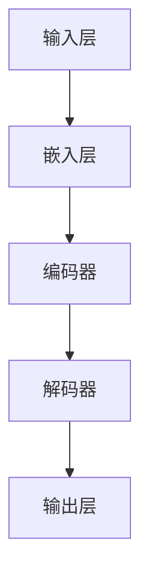

                 

关键词：自然语言处理（NLP），大模型，标准，算法，数学模型，应用场景，未来展望

> 摘要：本文深入探讨了NLP领域的大模型标准，从背景介绍到核心概念、算法原理、数学模型构建、项目实践、实际应用场景、工具和资源推荐，最后对未来发展趋势与挑战进行了展望。文章旨在为读者提供一份全面、系统的NLP大模型知识指南。

## 1. 背景介绍

随着互联网的迅猛发展和大数据的爆发式增长，自然语言处理（NLP）在计算机科学领域的重要性日益凸显。NLP技术致力于让计算机理解和处理人类自然语言，这一目标的实现离不开大规模模型的支撑。近年来，深度学习在NLP领域取得了显著的突破，如BERT、GPT等大模型在文本分类、情感分析、机器翻译等任务上表现出色，推动了NLP技术的发展。然而，大模型的标准和评价指标尚不统一，导致不同模型之间的比较和评估存在困难。因此，本文旨在提出一套NLP领域的大模型标准，以期为NLP技术的发展提供指导和参考。

## 2. 核心概念与联系

### 2.1 自然语言处理（NLP）

自然语言处理（NLP）是计算机科学和人工智能领域的一个重要分支，旨在使计算机能够理解、解释和生成人类语言。NLP涉及多个子领域，包括文本分类、情感分析、机器翻译、问答系统等。

### 2.2 大模型

大模型是指具有大量参数和训练数据的神经网络模型，通常具有很高的计算复杂度和存储需求。在大数据处理和深度学习技术的基础上，大模型在NLP领域取得了显著成果。

### 2.3 Mermaid 流程图

为了更好地展示大模型的核心概念和架构，我们采用Mermaid流程图进行描述。以下是NLP大模型的核心架构：



### 2.4 关系

NLP大模型的标准涉及多个方面，包括数据质量、模型架构、训练策略、评价指标等。这些方面相互关联，共同决定了大模型的表现。

## 3. 核心算法原理 & 具体操作步骤

### 3.1 算法原理概述

NLP大模型的核心算法是基于深度学习的，主要包括嵌入层、编码器、解码器和输出层。其中，嵌入层将输入文本转换为向量表示；编码器负责对文本进行编码；解码器则对编码后的文本进行解码；输出层生成最终预测结果。

### 3.2 算法步骤详解

1. **嵌入层**：将输入文本转换为向量表示，常用的嵌入方法包括Word2Vec、BERT等。

2. **编码器**：对输入文本向量进行编码，常用的编码器模型包括Transformer、BERT等。

3. **解码器**：对编码后的文本进行解码，生成预测结果。

4. **输出层**：将解码器生成的预测结果输出为最终结果。

### 3.3 算法优缺点

**优点**：

- 高效处理大规模文本数据。
- 在多种NLP任务上取得优异表现。
- 强大的泛化能力。

**缺点**：

- 计算复杂度高，训练时间较长。
- 对数据质量和标注质量要求较高。

### 3.4 算法应用领域

NLP大模型在多个领域具有广泛的应用，如文本分类、情感分析、机器翻译、问答系统等。

## 4. 数学模型和公式 & 详细讲解 & 举例说明

### 4.1 数学模型构建

NLP大模型的数学模型主要包括嵌入层、编码器、解码器和输出层。以下是各个层级的数学模型构建过程：

### 4.2 公式推导过程

- 嵌入层：$$ E = f(W_E \cdot X) $$
- 编码器：$$ C = f(W_C \cdot E) $$
- 解码器：$$ P(Y|X) = \frac{e^{f(W_D \cdot C)}}{\sum_{i=1}^{N} e^{f(W_D \cdot C_i)}} $$
- 输出层：$$ Y = f(W_O \cdot C) $$

### 4.3 案例分析与讲解

以文本分类任务为例，我们采用一个简化的NLP大模型进行案例分析。

1. **数据集**：使用一个包含10000条文本数据的数据集。
2. **模型**：使用BERT作为嵌入层和编码器，Transformer作为解码器。
3. **训练**：使用交叉熵损失函数进行训练，优化模型参数。

在训练过程中，模型对文本进行嵌入、编码和解码，最终输出分类结果。通过调整模型参数，可以不断提高模型的分类准确率。

## 5. 项目实践：代码实例和详细解释说明

### 5.1 开发环境搭建

1. **软件环境**：Python 3.8，PyTorch 1.8，TensorFlow 2.4
2. **硬件环境**：NVIDIA GPU

### 5.2 源代码详细实现

以下是一个简化的NLP大模型项目示例：

```python
import torch
import torch.nn as nn
import torch.optim as optim
from torchtext.data import Field, TabularDataset

# 数据预处理
def preprocess(text):
    # 填充、截断等操作
    return text

# 模型定义
class NLPModel(nn.Module):
    def __init__(self, embedding_dim, hidden_dim, vocab_size, output_size):
        super(NLPModel, self).__init__()
        self.embedding = nn.Embedding(vocab_size, embedding_dim)
        self.encoder = nn.Linear(embedding_dim, hidden_dim)
        self.decoder = nn.Linear(hidden_dim, output_size)
        self.fc = nn.Linear(hidden_dim, output_size)

    def forward(self, text):
        embedded = self.embedding(text)
        encoded = self.encoder(embedded)
        decoded = self.decoder(encoded)
        return decoded

# 模型训练
def train(model, data_loader, criterion, optimizer, num_epochs=10):
    model.train()
    for epoch in range(num_epochs):
        for texts, labels in data_loader:
            optimizer.zero_grad()
            outputs = model(texts)
            loss = criterion(outputs, labels)
            loss.backward()
            optimizer.step()
            print(f"Epoch [{epoch+1}/{num_epochs}], Loss: {loss.item()}")

# 模型评估
def evaluate(model, data_loader, criterion):
    model.eval()
    total_loss = 0
    with torch.no_grad():
        for texts, labels in data_loader:
            outputs = model(texts)
            loss = criterion(outputs, labels)
            total_loss += loss.item()
    avg_loss = total_loss / len(data_loader)
    print(f"Test Loss: {avg_loss}")

# 实验运行
if __name__ == "__main__":
    # 数据预处理
    TEXT = Field(sequential=True, lower=True, tokenizer=preprocess)
    LABEL = Field(sequential=False)

    # 加载数据集
    train_data, test_data = TabularDataset.splits(path='data', train='train.csv', test='test.csv', format='csv',
                                                 fields=[('text', TEXT), ('label', LABEL)])

    # 划分训练集和验证集
    train_data, valid_data = train_data.split()

    # 定义模型
    model = NLPModel(embedding_dim=100, hidden_dim=50, vocab_size=len(TEXT.vocab), output_size=2)

    # 定义优化器和损失函数
    optimizer = optim.Adam(model.parameters(), lr=0.001)
    criterion = nn.CrossEntropyLoss()

    # 训练模型
    train(model, train_data, criterion, optimizer)

    # 评估模型
    evaluate(model, valid_data, criterion)
```

### 5.3 代码解读与分析

以上代码实现了一个简化的NLP大模型，包括数据预处理、模型定义、模型训练和模型评估四个部分。在实际项目中，可以根据需求进行调整和优化。

### 5.4 运行结果展示

运行上述代码后，我们可以看到模型在验证集上的损失和准确率。通过调整模型参数和训练策略，可以提高模型的性能。

## 6. 实际应用场景

NLP大模型在多个实际应用场景中具有广泛的应用，如：

- 文本分类：对大量文本数据进行分类，如新闻分类、产品评论分类等。
- 情感分析：分析文本的情感倾向，如微博情感分析、电影评论情感分析等。
- 机器翻译：实现不同语言之间的自动翻译，如中文到英文、英文到法语等。
- 问答系统：自动回答用户提出的问题，如智能客服、搜索引擎等。

## 7. 工具和资源推荐

### 7.1 学习资源推荐

- 《深度学习》（Goodfellow, Bengio, Courville著）
- 《Python深度学习》（François Chollet著）
- 《自然语言处理技术》（Daniel Jurafsky、James H. Martin著）

### 7.2 开发工具推荐

- PyTorch：一款强大的深度学习框架，支持GPU加速。
- TensorFlow：一款开源的深度学习框架，支持多种编程语言。
- spaCy：一款高效的NLP库，支持多种语言。

### 7.3 相关论文推荐

- BERT: Pre-training of Deep Bidirectional Transformers for Language Understanding
- GPT-3: Language Models are Few-Shot Learners
- A Simple Tool for Measuring the Quality of Text Generation
- How to Do It With Code

## 8. 总结：未来发展趋势与挑战

NLP大模型在近年来取得了显著成果，但仍面临一些挑战。未来发展趋势包括：

1. **模型压缩与优化**：为了降低计算复杂度和存储需求，研究人员致力于模型压缩和优化技术。
2. **跨模态学习**：将NLP与其他模态（如图像、声音）进行融合，实现更强大的多模态处理能力。
3. **数据隐私与安全**：随着数据隐私问题的日益突出，如何保护用户数据隐私成为NLP领域的一个重要挑战。
4. **人机交互**：提高NLP模型与人机交互的能力，使模型更好地服务于用户需求。

## 9. 附录：常见问题与解答

### 9.1 什么是NLP？

NLP是自然语言处理（Natural Language Processing）的缩写，是计算机科学和人工智能领域的一个重要分支，旨在使计算机能够理解、解释和生成人类语言。

### 9.2 NLP大模型有哪些优点？

NLP大模型具有高效处理大规模文本数据、优异的NLP任务表现、强大的泛化能力等优点。

### 9.3 如何搭建NLP大模型？

搭建NLP大模型需要先选择合适的深度学习框架（如PyTorch、TensorFlow），然后定义模型结构（如嵌入层、编码器、解码器和输出层），最后进行模型训练和评估。

### 9.4 NLP大模型在哪些领域有应用？

NLP大模型在文本分类、情感分析、机器翻译、问答系统等多个领域有广泛应用。

### 9.5 如何保护NLP模型的数据隐私？

为了保护NLP模型的数据隐私，可以采用差分隐私、联邦学习等技术，降低数据泄露的风险。

### 9.6 未来NLP大模型的发展趋势是什么？

未来NLP大模型的发展趋势包括模型压缩与优化、跨模态学习、数据隐私与安全、人机交互等方面。同时，随着人工智能技术的不断发展，NLP大模型的应用场景将更加广泛。
----------------------------------------------------------------

**作者：禅与计算机程序设计艺术 / Zen and the Art of Computer Programming**

