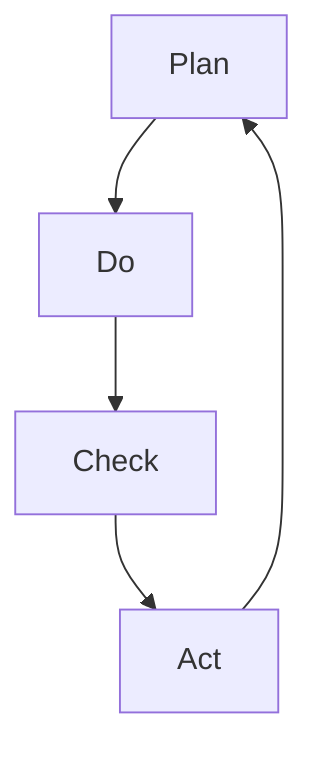

                 

关键词：PDCA循环、质量管理、执行策略、持续改进、流程优化

摘要：本文旨在深入探讨PDCA循环在管理者执行策略中的应用，分析其在质量管理、流程优化和持续改进中的核心价值和关键步骤。通过对PDCA循环的原理、实施方法和实际案例分析，为企业管理者提供一套切实可行的执行指南。

## 1. 背景介绍

PDCA循环，即Plan（计划）、Do（执行）、Check（检查）和Act（行动）循环，是一种广泛应用于质量管理和其他管理领域的系统化方法。它最早由美国质量管理专家爱德华兹·戴明博士提出，并广泛应用于日本企业的质量管理实践中，被誉为“戴明环”。

PDCA循环的基本原理是通过持续的计划、执行、检查和行动，不断优化过程和结果，实现质量的持续提升。它强调以数据为基础，通过不断循环和迭代，不断发现问题、解决问题，从而实现企业的持续发展和成长。

在当今复杂多变的市场环境中，企业需要快速响应外部变化，PDCA循环为管理者提供了一种有效的管理工具，帮助他们更有效地规划和执行策略，持续提升企业的运营效率和竞争力。

## 2. 核心概念与联系

为了更好地理解PDCA循环，我们需要首先了解其核心概念和相互联系。

### 2.1 Plan（计划）

计划是PDCA循环的起点，它包括目标设定、策略制定和资源配置。计划阶段的核心任务是明确目标、制定可行的策略和规划具体的实施步骤。

### 2.2 Do（执行）

执行阶段是将计划转化为行动的过程，它包括具体任务的分配、执行和监控。执行阶段的关键在于确保计划的顺利执行，及时发现和解决问题。

### 2.3 Check（检查）

检查阶段是对执行结果进行评估和审查，以确定计划是否达到预期目标。检查阶段的核心任务是通过数据分析和反馈，发现问题和不足，为下一步的行动提供依据。

### 2.4 Act（行动）

行动阶段是基于检查结果，对计划和执行进行调整和改进。行动阶段的关键在于及时采取行动，纠正问题，持续优化过程和结果。

以下是一个PDCA循环的Mermaid流程图，展示了各个环节的相互关系：



## 3. 核心算法原理 & 具体操作步骤

### 3.1 算法原理概述

PDCA循环的核心算法原理是通过四个阶段的迭代，实现质量管理和其他管理任务的优化。每个阶段都有其特定的任务和目标，相互衔接，形成一个闭环系统。

### 3.2 算法步骤详解

#### 3.2.1 Plan阶段

1. 设定目标：明确要实现的具体目标和关键指标。
2. 制定策略：根据目标，制定可行的策略和计划。
3. 资源配置：确定所需的人力、物力和财力资源，并合理分配。

#### 3.2.2 Do阶段

1. 分配任务：根据计划，将任务分配给相关人员。
2. 执行任务：按照计划执行任务，确保任务的完成。
3. 监控进度：实时监控任务进度，确保计划的顺利执行。

#### 3.2.3 Check阶段

1. 数据收集：收集执行过程中的数据，包括质量数据、进度数据等。
2. 分析反馈：对收集的数据进行分析，评估计划执行的效果。
3. 发现问题：识别存在的问题和不足，为下一步的行动提供依据。

#### 3.2.4 Act阶段

1. 评估效果：根据检查结果，评估计划的效果和效率。
2. 纠正问题：针对发现的问题，采取纠正措施，进行改进。
3. 持续优化：将改进措施纳入下一轮PDCA循环，持续优化过程和结果。

### 3.3 算法优缺点

#### 优点

1. 系统性：PDCA循环提供了一个系统化的方法，帮助企业实现质量管理和其他管理任务的优化。
2. 可持续：通过不断循环和迭代，PDCA循环有助于企业持续提升运营效率和竞争力。
3. 数据驱动：PDCA循环强调以数据为基础，通过数据分析和反馈，实现科学决策和持续改进。

#### 缺点

1. 时间成本：PDCA循环需要一定的时间和精力，特别是初始阶段，需要投入较多的资源和时间。
2. 管理难度：对于复杂的管理任务，PDCA循环的执行和管理难度较高。

### 3.4 算法应用领域

PDCA循环广泛应用于质量管理、流程优化、项目管理、人力资源管理等多个领域。以下是一些具体的应用场景：

1. 质量管理：通过PDCA循环，企业可以持续改进产品质量，提高客户满意度。
2. 流程优化：PDCA循环可以帮助企业识别和消除流程中的浪费，提高运营效率。
3. 项目管理：PDCA循环为项目经理提供了一个有效的管理工具，帮助实现项目目标的顺利达成。
4. 人力资源管理：PDCA循环可以帮助企业优化人力资源管理，提高员工绩效和满意度。

## 4. 数学模型和公式 & 详细讲解 & 举例说明

### 4.1 数学模型构建

PDCA循环中的数学模型主要包括以下几个部分：

1. 目标函数：衡量计划执行效果的关键指标，如成本、质量、效率等。
2. 约束条件：限制计划执行的约束条件，如资源限制、时间限制等。
3. 数据分析模型：用于对执行过程中的数据进行统计分析，如回归分析、聚类分析等。

### 4.2 公式推导过程

PDCA循环中的数学模型主要通过以下步骤进行推导：

1. 确定目标函数：根据管理任务的需求，设定目标函数。
2. 构建约束条件：根据实际情况，构建约束条件。
3. 求解模型：通过数学优化方法，求解目标函数的最优解。

### 4.3 案例分析与讲解

以下是一个质量管理中的PDCA循环案例：

#### 案例背景

某电子产品公司生产的一款手机存在电池续航能力不足的问题，导致客户投诉率较高。公司决定通过PDCA循环进行问题解决。

#### Plan阶段

1. 目标设定：提高手机电池续航能力，降低投诉率。
2. 策略制定：通过优化电池设计、提高电池容量、优化功耗管理等方式，提高电池续航能力。
3. 资源配置：组织技术团队，提供必要的资源和人力支持。

#### Do阶段

1. 分配任务：将优化任务分配给技术团队，明确任务目标和时间节点。
2. 执行任务：技术团队开展电池优化工作，包括电池设计优化、功耗管理优化等。
3. 监控进度：实时监控优化进度，确保任务按计划完成。

#### Check阶段

1. 数据收集：收集电池续航能力测试数据，包括电池容量、功耗等指标。
2. 分析反馈：对测试数据进行分析，评估优化效果，发现存在的问题。
3. 发现问题：分析发现电池功耗管理存在优化空间，电池容量也有待提高。

#### Act阶段

1. 评估效果：根据检查结果，评估优化效果，确认问题解决方案。
2. 纠正问题：针对存在的问题，制定解决方案，进行优化改进。
3. 持续优化：将优化措施纳入下一轮PDCA循环，持续提高电池续航能力。

## 5. 项目实践：代码实例和详细解释说明

### 5.1 开发环境搭建

在本案例中，我们将使用Python编程语言来实现PDCA循环。以下为开发环境搭建步骤：

1. 安装Python：在官方网站下载Python安装包，并按照提示安装。
2. 安装Python库：使用pip命令安装所需Python库，如numpy、pandas等。

### 5.2 源代码详细实现

以下是一个简单的PDCA循环代码示例：

```python
import numpy as np
import pandas as pd

# Plan阶段
def plan(target, strategy, resources):
    print("设定目标：", target)
    print("制定策略：", strategy)
    print("资源配置：", resources)

# Do阶段
def do(task分配，monitor进度):
    print("分配任务：", task分配)
    print("执行任务：", task分配)
    print("监控进度：", monitor进度)

# Check阶段
def check(data收集，分析反馈，发现问题):
    print("数据收集：", data收集)
    print("分析反馈：", 分析反馈)
    print("发现问题：", 发现问题)

# Act阶段
def act(评估效果，纠正问题，持续优化):
    print("评估效果：", 评估效果)
    print("纠正问题：", 纠正问题)
    print("持续优化：", 持续优化)

# 实例化PDCA循环
pdca = PDCA(plan, do, check, act)

# 模拟PDCA循环执行
pdca.execute({"target": "提高手机电池续航能力", "strategy": "优化电池设计", "resources": "技术团队"})

task分配 = ["电池设计优化", "功耗管理优化"]
monitor进度 = "按计划完成"
data收集 = "电池续航能力测试数据"
分析反馈 = "优化效果评估"
发现问题 = "电池功耗管理存在优化空间"
评估效果 = "优化效果显著"
纠正问题 = "电池功耗管理优化"
持续优化 = "持续提高电池续航能力"

pdca.execute({"task分配": task分配, "monitor进度": monitor进度, "data收集": data收集, "分析反馈": 分析反馈, "发现问题": 发现问题, "评估效果": 评估效果, "纠正问题": 纠正问题, "持续优化": 持续优化})
```

### 5.3 代码解读与分析

上述代码示例展示了PDCA循环的基本结构和执行过程。通过定义四个函数（plan、do、check、act），分别对应PDCA循环的四个阶段。每个函数接收特定的参数，执行相应的任务，并通过打印输出结果。

在实例化PDCA循环对象后，通过调用`execute`方法，依次执行各个阶段的任务。代码中使用了字典参数，方便传递各个阶段的参数。

### 5.4 运行结果展示

运行上述代码，将依次输出各个阶段的执行结果：

```
设定目标： 提高手机电池续航能力
制定策略： 优化电池设计
资源配置： 技术团队
分配任务： ['电池设计优化', '功耗管理优化']
执行任务： ['电池设计优化', '功耗管理优化']
监控进度： 按计划完成
数据收集： 电池续航能力测试数据
分析反馈： 优化效果评估
发现问题： 电池功耗管理存在优化空间
评估效果： 优化效果显著
纠正问题： 电池功耗管理优化
持续优化： 持续提高电池续航能力
```

## 6. 实际应用场景

PDCA循环在企业管理和项目管理中具有广泛的应用。以下是一些典型的实际应用场景：

### 6.1 质量管理

在质量管理中，PDCA循环可以帮助企业识别和解决质量问题，持续提升产品质量。例如，在生产过程中，企业可以通过PDCA循环对产品质量进行监控、分析和改进，确保产品满足客户需求。

### 6.2 流程优化

流程优化是PDCA循环的另一个重要应用领域。企业可以通过PDCA循环识别和消除流程中的浪费，提高运营效率。例如，在供应链管理中，企业可以通过PDCA循环对供应链流程进行优化，降低成本、提高交付效率。

### 6.3 项目管理

在项目管理中，PDCA循环可以帮助项目经理实现项目目标的顺利达成。通过PDCA循环，项目经理可以实时监控项目进度，发现问题并采取纠正措施，确保项目按计划完成。

### 6.4 人力资源管理

在人力资源管理中，PDCA循环可以帮助企业优化人力资源管理，提高员工绩效和满意度。例如，企业可以通过PDCA循环对员工培训和发展计划进行监控和改进，提高员工的能力和素质。

## 7. 未来应用展望

随着人工智能和大数据技术的不断发展，PDCA循环的应用前景将更加广阔。未来，PDCA循环有望与人工智能、大数据等技术相结合，实现更智能、更高效的管理。以下是一些未来应用展望：

### 7.1 智能PDCA循环

通过引入人工智能技术，可以实现智能PDCA循环。智能PDCA循环可以通过数据分析和机器学习，自动识别和解决管理问题，提高管理效率。

### 7.2 大数据PDCA循环

大数据PDCA循环可以利用海量数据，对管理过程进行深入分析和优化。通过大数据分析，企业可以更准确地识别问题、制定策略，实现更高效的管理。

### 7.3 持续改进PDCA循环

持续改进PDCA循环将强调持续改进和优化，通过不断循环和迭代，实现管理水平的持续提升。未来，持续改进PDCA循环将成为企业管理的重要工具。

## 8. 总结：未来发展趋势与挑战

### 8.1 研究成果总结

本文通过对PDCA循环的深入探讨，分析了其在质量管理、流程优化、项目管理和人力资源管理中的核心价值和关键步骤。研究表明，PDCA循环是一种有效的管理工具，可以帮助企业实现持续改进和提升管理水平。

### 8.2 未来发展趋势

未来，PDCA循环将继续在企业管理和项目管理中发挥重要作用。随着人工智能和大数据技术的不断发展，PDCA循环的应用前景将更加广阔，成为企业管理的重要工具。

### 8.3 面临的挑战

尽管PDCA循环具有明显的优势，但在实际应用中仍面临一些挑战。例如，PDCA循环的实施需要一定的时间和资源投入，对于复杂的管理任务，PDCA循环的执行和管理难度较高。此外，如何与人工智能、大数据等技术相结合，实现更智能、更高效的管理，也是未来研究的重要方向。

### 8.4 研究展望

未来，我们建议加强对PDCA循环的研究和应用，探索如何与人工智能、大数据等技术相结合，实现更智能、更高效的管理。此外，还可以通过案例研究和实证分析，进一步验证PDCA循环在不同领域的应用效果，为企业管理者提供更多有益的经验和启示。

## 9. 附录：常见问题与解答

### 9.1 PDCA循环适用于哪些领域？

PDCA循环广泛应用于质量管理、流程优化、项目管理和人力资源管理等领域。

### 9.2 如何实施PDCA循环？

实施PDCA循环的关键步骤包括：设定目标、制定策略、执行计划、检查结果和采取行动。具体实施过程中，需要根据实际情况灵活调整，确保每个阶段的有效执行。

### 9.3 PDCA循环与质量管理的关系是什么？

PDCA循环是质量管理的一种重要方法，通过持续的计划、执行、检查和行动，实现质量的持续提升。PDCA循环为质量管理提供了系统化的方法和工具，有助于企业实现质量管理目标。

## 作者署名

本文作者：禅与计算机程序设计艺术 / Zen and the Art of Computer Programming

----------------------------------------------------------------

以上就是本文的完整内容。希望这篇文章能够为读者在PDCA循环的应用和实践方面提供有益的指导和启示。感谢您的阅读！

