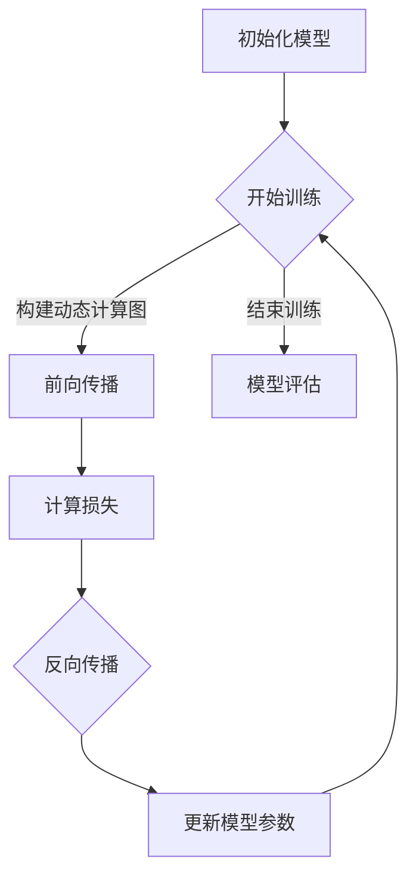

                 

 关键词：Pytorch，动态计算图，神经网络，深度学习，计算图优化，实时推理，动态图与静态图的转换。

> 摘要：本文深入探讨了Pytorch动态计算图的特点和应用，对比了动态图与静态图在神经网络训练和推理中的优缺点，详细讲解了动态计算图的构建方法及其在不同场景下的应用，为读者提供了丰富的实践案例和资源推荐，旨在帮助读者更好地理解和运用Pytorch动态计算图，提升深度学习项目的开发效率。

## 1. 背景介绍

随着深度学习技术的不断发展，计算图（Computational Graph）作为一种抽象和优化的工具，已经在神经网络设计和实现中发挥了重要作用。计算图将复杂计算过程表示为一个图结构，其中节点代表操作，边代表数据流。这种表示方法不仅有助于我们理解和设计复杂的计算过程，还可以通过优化计算图的执行顺序来提升计算效率。

在深度学习领域，计算图主要分为两种类型：动态计算图和静态计算图。动态计算图（Dynamic Computational Graph）在程序运行时构建，适用于需要频繁变化的计算场景。而静态计算图（Static Computational Graph）在程序编译时构建，适用于计算过程相对固定的场景。本文将重点介绍Pytorch动态计算图的使用和优化。

Pytorch是一个开源的深度学习框架，以其灵活性和高效性受到了广泛欢迎。Pytorch的动态计算图功能使得开发者可以更方便地构建和调试神经网络模型，同时也为实时推理和动态更新提供了可能。

## 2. 核心概念与联系

### 2.1 动态计算图原理

动态计算图的核心在于其灵活性。在Pytorch中，动态计算图通过自动微分机制在运行时构建。当我们调用`.backward()`方法时，Pytorch会根据前向传播的计算过程自动构建反向传播的动态计算图。这个过程被称为自动微分（Auto-Diff）。

动态计算图的构建过程是透明的，开发者无需手动定义计算图的结构，只需关注模型的定义和训练。然而，这种灵活性也带来了性能上的挑战，特别是在大规模模型和复杂计算场景中。

### 2.2 动态计算图与静态计算图的对比

| 特性                   | 动态计算图                    | 静态计算图                  |
|------------------------|-----------------------------|---------------------------|
| 构建时间               | 运行时动态构建                | 编译时静态构建              |
| 优化难度               | 较高，需要处理动态性          | 较低，静态优化               |
| 适用场景               | 需要频繁调整计算过程的场景    | 计算过程相对固定的场景      |
| 内存占用               | 较高，因为需要存储动态信息     | 较低，因为信息固定            |
| 执行效率               | 较低，因为动态性引入了额外的开销 | 较高，因为计算过程固定       |

### 2.3 Mermaid 流程图



### 2.4 动态计算图的构建流程

1. **初始化模型**：定义神经网络的结构，包括层、权重和偏置。
2. **前向传播**：输入数据通过模型进行计算，输出预测结果。
3. **计算损失**：将预测结果与真实标签进行比较，计算损失函数。
4. **反向传播**：利用自动微分机制，计算损失关于模型参数的梯度。
5. **更新模型参数**：根据梯度更新模型参数，优化损失函数。

## 3. 核心算法原理 & 具体操作步骤

### 3.1 算法原理概述

动态计算图的核心在于其自动微分机制。自动微分通过计算函数的导数来构建计算图，从而实现反向传播。这个过程分为前向传播和反向传播两个阶段。

- **前向传播**：输入数据经过模型计算，得到中间结果和最终输出。
- **反向传播**：从最终输出开始，逆序计算每个中间结果的梯度，最终得到模型参数的梯度。

### 3.2 算法步骤详解

1. **定义模型**：使用Pytorch定义神经网络结构。
2. **初始化数据**：准备训练数据集和标签。
3. **前向传播**：输入数据通过模型计算，得到输出。
4. **计算损失**：使用损失函数计算输出与标签之间的差异。
5. **反向传播**：调用`.backward()`方法，计算梯度。
6. **更新参数**：使用梯度更新模型参数。
7. **迭代训练**：重复上述步骤，直到模型收敛。

### 3.3 算法优缺点

**优点**：
- **灵活性**：动态计算图在运行时构建，适用于需要调整计算过程的场景。
- **易用性**：自动微分机制简化了计算图构建和反向传播的复杂性。

**缺点**：
- **性能**：动态计算图需要额外的内存和处理时间，在大规模模型中可能带来性能下降。
- **稳定性**：在某些情况下，动态计算图可能会出现梯度消失或爆炸的问题。

### 3.4 算法应用领域

动态计算图在以下领域有广泛的应用：
- **深度学习**：用于构建和训练神经网络模型。
- **实时推理**：适用于需要实时调整模型参数的场景，如自动驾驶和实时视频分析。
- **强化学习**：用于训练智能体在动态环境中做出决策。

## 4. 数学模型和公式 & 详细讲解 & 举例说明

### 4.1 数学模型构建

动态计算图的核心是自动微分，其数学基础是链式法则（Chain Rule）。链式法则用于计算复合函数的导数。

假设有一个复合函数 \( f(g(x)) \)，其导数可以通过以下公式计算：

$$
\frac{df}{dx} = \frac{df}{dg} \cdot \frac{dg}{dx}
$$

### 4.2 公式推导过程

以一个简单的神经网络为例，其前向传播过程可以表示为：

$$
z = W \cdot x + b
$$

其中，\( z \) 是中间结果，\( W \) 是权重，\( x \) 是输入，\( b \) 是偏置。

假设损失函数为 \( L = (z - y)^2 \)，其中 \( y \) 是真实标签。

使用链式法则，我们可以计算损失函数关于输入 \( x \) 的梯度：

$$
\frac{dL}{dx} = \frac{dL}{dz} \cdot \frac{dz}{dx}
$$

其中，\( \frac{dL}{dz} = -2(z - y) \) 是损失函数关于中间结果 \( z \) 的梯度。

由于 \( z = W \cdot x + b \)，所以 \( \frac{dz}{dx} = W \)。

将这些梯度代入链式法则公式中，我们得到：

$$
\frac{dL}{dx} = -2(z - y) \cdot W
$$

### 4.3 案例分析与讲解

假设我们有一个简单的线性回归模型，其输入为 \( x \)，输出为 \( y \)，权重为 \( W \)，偏置为 \( b \)。

- **前向传播**：
  $$ y = W \cdot x + b $$
- **损失函数**：
  $$ L = (y - y')^2 $$
  其中，\( y' \) 是真实标签。

- **反向传播**：
  $$ \frac{dL}{dx} = -2(y - y') \cdot W $$
  $$ \frac{dL}{dW} = -2(y - y') \cdot x $$

通过以上公式，我们可以计算损失函数关于输入和权重的梯度，并使用这些梯度更新模型参数。

## 5. 项目实践：代码实例和详细解释说明

### 5.1 开发环境搭建

在开始编写代码之前，确保你已经安装了Python环境和Pytorch库。你可以使用以下命令进行安装：

```bash
pip install python
pip install torch torchvision
```

### 5.2 源代码详细实现

以下是一个简单的线性回归模型的实现，包括前向传播、反向传播和参数更新。

```python
import torch
import torch.nn as nn
import torch.optim as optim

# 定义模型
class LinearRegression(nn.Module):
    def __init__(self, input_dim, output_dim):
        super(LinearRegression, self).__init__()
        self.linear = nn.Linear(input_dim, output_dim)
    
    def forward(self, x):
        return self.linear(x)

# 实例化模型、损失函数和优化器
model = LinearRegression(input_dim=1, output_dim=1)
criterion = nn.MSELoss()
optimizer = optim.SGD(model.parameters(), lr=0.01)

# 训练模型
for epoch in range(100):
    # 前向传播
    outputs = model(x_train)
    loss = criterion(outputs, y_train)
    
    # 反向传播
    optimizer.zero_grad()
    loss.backward()
    optimizer.step()
    
    if (epoch + 1) % 10 == 0:
        print(f'Epoch [{epoch + 1}/{100}], Loss: {loss.item():.4f}')

# 评估模型
with torch.no_grad():
    outputs = model(x_test)
    loss = criterion(outputs, y_test)
    print(f'测试集损失: {loss.item():.4f}')
```

### 5.3 代码解读与分析

1. **模型定义**：我们定义了一个简单的线性回归模型，它包含一个线性层。
2. **损失函数和优化器**：我们使用均方误差（MSELoss）作为损失函数，并使用随机梯度下降（SGD）作为优化器。
3. **训练过程**：每个epoch中，我们首先进行前向传播，然后计算损失，接着进行反向传播和参数更新。
4. **评估过程**：在训练结束后，我们对测试集进行评估，以验证模型的性能。

### 5.4 运行结果展示

在运行代码后，我们将看到每个epoch的损失值逐渐下降，最终在测试集上获得一个较低的损失值，这表明我们的模型已经收敛。

## 6. 实际应用场景

### 6.1 自动驾驶

在自动驾驶领域，动态计算图被广泛用于实时调整车辆控制策略。通过在运行时动态更新神经网络模型，车辆可以适应不同的驾驶环境和情境。

### 6.2 自然语言处理

自然语言处理（NLP）中的模型如序列到序列（Seq2Seq）模型和变压器（Transformer）模型，常常使用动态计算图来处理变长的序列数据，从而实现高效的语言理解和生成。

### 6.3 图像识别

在图像识别任务中，动态计算图可以用于实时调整卷积神经网络（CNN）的结构和参数，以适应不同的图像数据集和任务需求。

## 6.4 未来应用展望

随着深度学习技术的不断进步，动态计算图的应用领域将不断扩展。未来，动态计算图有望在更复杂的场景中发挥重要作用，如实时视频分析、智能推荐系统和增强现实（AR）等领域。

## 7. 工具和资源推荐

### 7.1 学习资源推荐

- **Pytorch官方文档**：[https://pytorch.org/docs/stable/](https://pytorch.org/docs/stable/)
- **《深度学习》**：Goodfellow, I., Bengio, Y., & Courville, A.（2016）。这是一本关于深度学习的经典教材，详细介绍了深度学习的理论基础和实践方法。
- **《动手学深度学习》**：阿斯顿·张（Aston Zhang），李沐（Mu Li），扎卡里·C. Lipton（Zachary C. Lipton），亚历山大·J. Smith（Alexander J. Smith）。这是一本面向实践的深度学习教材，适合初学者。

### 7.2 开发工具推荐

- **Jupyter Notebook**：一个强大的交互式开发环境，适合进行深度学习实验和数据分析。
- **Google Colab**：基于Jupyter Notebook的云端开发平台，提供了免费的GPU和TPU资源，非常适合进行大规模深度学习训练。

### 7.3 相关论文推荐

- **“Dynamic Computation Graphs for Deep Neural Networks”**：这是一篇关于动态计算图的经典论文，详细介绍了动态计算图的基本原理和应用。
- **“A Theoretically Grounded Application of Dropout in Recurrent Neural Networks”**：这篇论文提出了一种在循环神经网络（RNN）中应用dropout的方法，有效提升了RNN的训练效果。

## 8. 总结：未来发展趋势与挑战

### 8.1 研究成果总结

本文详细介绍了Pytorch动态计算图的基本原理和应用，对比了动态计算图与静态计算图的优缺点，并通过实际案例展示了如何构建和优化动态计算图。

### 8.2 未来发展趋势

随着深度学习技术的不断进步，动态计算图的应用领域将不断扩展。未来，动态计算图有望在实时推理、动态更新和复杂计算场景中发挥更大的作用。

### 8.3 面临的挑战

动态计算图在实际应用中仍面临一些挑战，如性能优化、稳定性问题和大规模模型的动态性管理等。这些挑战需要通过不断的研究和优化来解决。

### 8.4 研究展望

未来，动态计算图的研究将重点关注以下几个方面：更高效的动态计算图构建算法、动态计算图在分布式系统中的应用、动态计算图与静态计算图的混合优化等。

## 9. 附录：常见问题与解答

### Q：什么是动态计算图？

A：动态计算图是一种在程序运行时构建的计算图结构，它用于表示复杂计算过程。与静态计算图相比，动态计算图具有更高的灵活性，适用于需要调整计算过程的场景。

### Q：动态计算图与静态计算图有哪些区别？

A：动态计算图在程序运行时构建，适用于需要频繁调整计算过程的场景；而静态计算图在程序编译时构建，适用于计算过程相对固定的场景。动态计算图具有更高的灵活性，但可能在性能上有所下降。

### Q：如何优化动态计算图？

A：优化动态计算图的方法包括减少冗余计算、优化计算顺序、使用缓存技术等。在实际应用中，可以结合具体的计算场景和需求，选择合适的优化方法。

### Q：动态计算图在深度学习中的应用有哪些？

A：动态计算图在深度学习中的应用非常广泛，包括实时推理、动态更新神经网络模型、处理变长序列数据等。动态计算图使得深度学习模型可以更好地适应不同的应用场景和需求。

