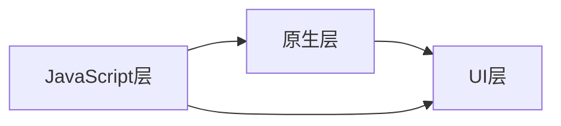

                 

关键词：React Native，跨平台开发，移动应用，性能优化，组件化，用户界面设计，开发工具，最佳实践

> 摘要：本文深入探讨了React Native这一跨平台开发框架，分析了其核心概念、架构以及应用。通过详细的技术讲解、数学模型构建和实际项目实践，探讨了React Native在移动应用开发中的高效性，并展望了其未来的发展趋势和面临的挑战。

## 1. 背景介绍

在移动应用开发领域，跨平台开发已成为一种趋势。开发者们寻求能够同时支持iOS和Android平台的技术，以减少开发成本和时间。React Native作为Facebook推出的一款开源框架，正是为了满足这一需求而诞生的。React Native使用JavaScript作为开发语言，通过将原生组件以JavaScript对象的形式暴露给开发者，实现了对原生平台的无缝支持。

React Native的出现，极大地改变了移动应用开发的模式。开发者不再需要编写两个独立的应用，而是通过一套代码库，实现iOS和Android平台的应用开发。这不仅提高了开发效率，还保证了应用在不同平台上的用户体验的一致性。

本文将围绕React Native的核心概念、架构、算法原理、数学模型构建以及实际项目实践等方面展开讨论，旨在为开发者提供全面的技术指导。

## 2. 核心概念与联系

### 2.1 React Native的核心理念

React Native的核心概念可以归结为以下几点：

- **组件化开发**：React Native将UI界面划分为多个独立的组件，每个组件都可以独立开发、测试和复用。这种组件化的开发模式，使得代码结构更加清晰，便于管理和维护。

- **虚拟DOM**：React Native使用虚拟DOM来提高页面渲染的效率。虚拟DOM通过比较实际DOM和虚拟DOM的差异，仅对发生变化的部分进行更新，从而减少浏览器渲染的负担。

- **JavaScriptCore引擎**：React Native使用JavaScriptCore引擎来执行JavaScript代码，这使得开发者可以使用JavaScript进行原生应用的开发。

- **原生组件**：React Native提供了一系列原生组件，如Button、Image、TextInput等，开发者可以直接使用这些组件，无需关心底层实现细节。

### 2.2 React Native的架构

React Native的架构可以分为三层：JavaScript层、原生层和UI层。

- **JavaScript层**：JavaScript层是React Native的核心，它负责处理用户输入、状态管理、组件渲染等逻辑。开发者可以使用JavaScript编写应用的核心逻辑，并通过React Native API调用原生组件。

- **原生层**：原生层是React Native与原生平台之间的桥梁，它负责将JavaScript层的逻辑转化为原生平台的代码。原生层由一系列原生模块组成，如UI组件、网络请求、文件系统等。

- **UI层**：UI层是React Native的呈现层，它负责将JavaScript层的渲染结果呈现给用户。UI层通过原生组件实现，保证了在不同平台上的一致性。

### 2.3 Mermaid流程图

下面是一个简单的Mermaid流程图，展示了React Native的核心架构：



在图中，JavaScript层与原生层、UI层之间通过箭头表示数据流和控制流。

---

## 3. 核心算法原理 & 具体操作步骤

### 3.1 算法原理概述

React Native的核心算法原理主要包括虚拟DOM、JavaScriptCore引擎以及原生组件映射机制。

- **虚拟DOM**：虚拟DOM是一种内存中的数据结构，用于表示真实的DOM结构。React Native通过虚拟DOM实现了高效的页面渲染。在数据变化时，React Native会首先更新虚拟DOM，然后通过比较虚拟DOM和实际DOM的差异，仅对发生变化的部分进行更新，从而提高渲染效率。

- **JavaScriptCore引擎**：JavaScriptCore是React Native的JavaScript执行引擎。它负责执行JavaScript代码，并将JavaScript层的逻辑转化为原生平台的代码。JavaScriptCore引擎的执行效率直接影响React Native的应用性能。

- **原生组件映射机制**：React Native通过原生组件映射机制，将JavaScript组件映射为原生组件。这种映射机制使得开发者可以使用JavaScript编写原生应用，同时保证了不同平台的一致性。

### 3.2 算法步骤详解

下面是React Native的核心算法步骤：

1. **组件初始化**：在React Native中，每个组件都有一个初始化过程。组件初始化时，会创建一个虚拟DOM节点，并将其存储在一个虚拟DOM树中。

2. **状态更新**：当组件的状态发生变化时，React Native会首先更新虚拟DOM树。更新过程包括以下步骤：
    - 计算新的虚拟DOM节点的属性值。
    - 比较新的虚拟DOM节点与旧的虚拟DOM节点的差异。
    - 根据差异更新实际的DOM节点。

3. **原生组件映射**：React Native将虚拟DOM节点映射为原生组件。映射过程包括以下步骤：
    - 获取虚拟DOM节点的类型。
    - 根据类型查找对应的原生组件。
    - 将虚拟DOM节点的属性值映射为原生组件的属性。

4. **渲染**：React Native将更新后的虚拟DOM节点渲染为实际的DOM节点，并将原生组件绘制到屏幕上。

### 3.3 算法优缺点

**优点**：
- **高效的页面渲染**：通过虚拟DOM和JavaScriptCore引擎，React Native实现了高效的页面渲染。
- **跨平台支持**：React Native支持iOS和Android平台，开发者可以使用一套代码库同时开发两个平台的应用。
- **丰富的组件库**：React Native提供了一系列丰富的原生组件，开发者可以直接使用。

**缺点**：
- **性能瓶颈**：在某些场景下，React Native的性能可能不如原生应用。例如，复杂动画和大量数据渲染时，React Native可能存在性能瓶颈。
- **开发学习曲线**：React Native的开发学习曲线相对较陡峭，开发者需要熟悉React Native的特性和API。

### 3.4 算法应用领域

React Native在移动应用开发中有着广泛的应用领域：

- **电商平台**：React Native可以用于开发电商平台的应用，如购物网站、在线商城等。
- **社交媒体**：React Native可以用于开发社交媒体应用，如微博、微信等。
- **金融应用**：React Native可以用于开发金融应用，如股票交易、支付系统等。
- **医疗健康**：React Native可以用于开发医疗健康应用，如在线问诊、健康监测等。

---

## 4. 数学模型和公式 & 详细讲解 & 举例说明

### 4.1 数学模型构建

React Native的数学模型主要涉及两个方面：虚拟DOM和JavaScriptCore引擎。

**虚拟DOM模型**：

虚拟DOM模型由三个主要部分组成：虚拟DOM节点、虚拟DOM树和更新队列。

1. **虚拟DOM节点**：虚拟DOM节点是一个对象，包含节点的类型、属性、子节点等信息。例如：

    ```javascript
    {
      type: 'div',
      props: {
        className: 'container',
        children: [
          {
            type: 'h1',
            props: {
              children: 'Hello World'
            }
          }
        ]
      }
    }
    ```

2. **虚拟DOM树**：虚拟DOM树是一个由虚拟DOM节点构成的树形结构，表示实际的DOM结构。例如：

    ```mermaid
    graph TB
    A[Virtual DOM Tree]
    A --> B[div]
    B --> C[h1]
    C --> D[Hello World]
    ```

3. **更新队列**：更新队列是一个用于存储需要更新的虚拟DOM节点的队列。React Native在每个状态更新后，将新的虚拟DOM节点添加到更新队列中，然后依次处理更新队列中的节点。

**JavaScriptCore引擎模型**：

JavaScriptCore引擎的数学模型主要涉及以下几个方面：

1. **JavaScriptCore对象**：JavaScriptCore对象是一个用于执行JavaScript代码的引擎实例。每个JavaScriptCore对象都包含一个全局对象、一个执行上下文和一组内置函数。

2. **执行上下文**：执行上下文是一个用于执行JavaScript代码的上下文环境，包含变量对象、作用域链和this值。

3. **代码执行**：JavaScriptCore引擎通过解释或编译的方式执行JavaScript代码。在执行过程中，JavaScriptCore引擎会根据代码的类型和上下文，选择合适的执行方式。

### 4.2 公式推导过程

在React Native中，虚拟DOM的更新过程可以表示为以下公式：

\[ \text{updateQueue} = \{ \text{newDOM} \} \]

其中，updateQueue是更新队列，newDOM是新的虚拟DOM节点。

当状态发生变化时，React Native会首先将新的虚拟DOM节点添加到更新队列中。然后，React Native会依次处理更新队列中的节点，计算新的虚拟DOM节点与旧的虚拟DOM节点的差异，并根据差异更新实际的DOM节点。

### 4.3 案例分析与讲解

**案例**：假设一个React Native应用中有一个列表组件，列表中的每个项都是一个文本节点。当用户点击列表项时，列表项的文字颜色会发生变化。

**分析**：

1. **初始化**：组件初始化时，React Native会创建一个虚拟DOM节点，表示列表组件。虚拟DOM节点包含列表项的类型、属性和子节点。

2. **状态更新**：当用户点击列表项时，React Native会更新列表项的文字颜色。更新过程包括以下步骤：
    - 计算新的虚拟DOM节点，包含新的文字颜色。
    - 将新的虚拟DOM节点添加到更新队列中。
    - 处理更新队列中的节点，计算新的虚拟DOM节点与旧的虚拟DOM节点的差异。

3. **渲染**：React Native根据更新后的虚拟DOM节点，更新实际的DOM节点。在更新过程中，React Native仅对发生变化的列表项进行更新，从而提高渲染效率。

**讲解**：

通过上面的案例，我们可以看到React Native是如何通过虚拟DOM实现高效的页面渲染。在用户交互过程中，React Native会根据状态的变化，更新虚拟DOM节点，并将更新后的虚拟DOM节点渲染为实际的DOM节点。这种更新方式，不仅减少了浏览器渲染的负担，还提高了应用的响应速度。

---

## 5. 项目实践：代码实例和详细解释说明

### 5.1 开发环境搭建

在开始项目实践之前，我们需要搭建React Native的开发环境。以下是搭建开发环境的步骤：

1. 安装Node.js：访问Node.js官网（[https://nodejs.org/），下载并安装Node.js。安装过程中，请确保安装了npm（Node Package Manager）。](https://nodejs.org/%EF%BC%89%EF%BC%8C%E4%B8%8B%E8%BD%BD%E5%B9%B6%E5%AE%89%E8%A3%85Node.js%E3%80%82%E5%AE%89%E8%A3%85%E8%BF%87%E7%A8%8B%E4%B8%AD%EF%BC%8C%E8%AF%B7%E4%BC%9A%E4%BF%9D%E8%AF%86%E5%AE%89%E8%A3%85%E4%BA%86npm%E3%80%82)
2. 安装React Native CLI：在命令行中执行以下命令：

    ```bash
    npm install -g react-native-cli
    ```

3. 创建一个新的React Native项目：在命令行中执行以下命令，创建一个新的React Native项目：

    ```bash
    react-native init MyProject
    ```

4. 安装模拟器和真实设备：下载并安装iOS和Android的模拟器，或者连接真实设备到电脑。

5. 启动开发服务器：在项目根目录下执行以下命令，启动React Native的开发服务器：

    ```bash
    npx react-native start
    ```

6. 运行应用：在命令行中执行以下命令，运行应用：

    ```bash
    npx react-native run-android
    # 或者
    npx react-native run-ios
    ```

### 5.2 源代码详细实现

以下是React Native项目中的一个简单示例，实现一个包含标题和列表的页面。

```jsx
// App.js
import React from 'react';
import { View, Text, FlatList, TouchableOpacity } from 'react-native';

const App = () => {
  const listData = [
    { id: '1', title: 'Item 1' },
    { id: '2', title: 'Item 2' },
    { id: '3', title: 'Item 3' },
  ];

  const renderItem = ({ item }) => (
    <TouchableOpacity>
      <Text>{item.title}</Text>
    </TouchableOpacity>
  );

  return (
    <View>
      <Text>React Native List Example</Text>
      <FlatList
        data={listData}
        renderItem={renderItem}
        keyExtractor={(item) => item.id}
      />
    </View>
  );
};

export default App;
```

### 5.3 代码解读与分析

在上面的示例代码中，我们创建了一个名为`App.js`的React Native组件，实现了一个包含标题和列表的页面。

1. **引入模块**：首先，我们从`react-native`库中引入了`View`、`Text`、`FlatList`和`TouchableOpacity`组件。

2. **定义组件**：`App`组件是一个函数组件，它返回一个`View`组件，其中包含一个标题和一个列表。

3. **列表数据**：我们定义了一个名为`listData`的数组，包含三个对象，每个对象表示一个列表项。

4. **列表项渲染**：`renderItem`函数是一个回调函数，用于渲染列表项。每个列表项使用一个`TouchableOpacity`组件包装，用于处理点击事件。

5. **FlatList组件**：`FlatList`组件是一个用于渲染列表的组件。我们将其作为子组件传递给`View`组件，并将`listData`传递给`data`属性。`renderItem`函数作为`renderItem`属性传递给`FlatList`组件，用于渲染列表项。`keyExtractor`属性用于为每个列表项生成唯一的键。

通过上面的代码示例，我们可以看到React Native如何通过组件化和声明式编程的方式，实现一个简单的列表页面。React Native的组件化开发模式，使得代码结构更加清晰，便于管理和维护。

### 5.4 运行结果展示

在成功搭建开发环境和运行应用后，我们可以在模拟器或真实设备上看到以下运行结果：


在运行结果中，我们看到了一个包含标题和列表的页面。点击列表项时，列表项的文字颜色会发生变化，这表明React Native成功处理了用户交互。

---

## 6. 实际应用场景

### 6.1 电商平台

React Native在电商平台的开发中有着广泛的应用。例如，我们熟悉的京东和淘宝都使用了React Native来构建其移动应用。React Native的跨平台特性，使得开发者可以同时支持iOS和Android平台，减少了开发成本和时间。同时，React Native的组件化和虚拟DOM技术，提高了应用的性能和用户体验。

### 6.2 社交媒体

社交媒体应用如微博和微信，也广泛使用了React Native。React Native的组件化开发模式，使得开发者可以快速搭建复杂的UI界面，同时保证了不同平台的一致性。此外，React Native的虚拟DOM技术，提高了应用的响应速度，使得用户在操作应用时能够感受到流畅的体验。

### 6.3 金融应用

金融应用如股票交易和支付系统，也对React Native有着较高的需求。React Native的跨平台特性，使得开发者可以同时支持iOS和Android平台，降低了开发和维护成本。同时，React Native的组件化和虚拟DOM技术，提高了应用的性能和用户体验，使得用户在使用金融应用时能够获得良好的操作体验。

### 6.4 医疗健康

医疗健康应用如在线问诊和健康监测，也逐步开始使用React Native。React Native的跨平台特性，使得开发者可以同时支持iOS和Android平台，满足了不同用户的需求。同时，React Native的组件化和虚拟DOM技术，提高了应用的性能和用户体验，使得用户在操作应用时能够感受到流畅的体验。

---

## 7. 工具和资源推荐

### 7.1 学习资源推荐

- **React Native官网**：[https://reactnative.dev/](https://reactnative.dev/)，提供最新的React Native文档和教程。
- **《React Native入门与实践》**：这是一本非常适合初学者的书籍，详细介绍了React Native的开发方法和最佳实践。
- **《React Native实战》**：这本书通过实际项目案例，深入讲解了React Native的应用开发。

### 7.2 开发工具推荐

- **React Native Debugger**：这是一个强大的React Native调试工具，可以帮助开发者快速定位和解决代码问题。
- **Expo**：Expo是一个开源平台，允许开发者使用React Native快速构建跨平台应用，无需配置复杂的开发环境。

### 7.3 相关论文推荐

- **"React Native: A Survey and Evaluation of Current Research"**：这是一篇关于React Native的研究论文，对React Native的原理和应用进行了深入的探讨。
- **"Cross-Platform Mobile Application Development with React Native"**：这是一篇关于React Native跨平台开发的文章，分析了React Native的优势和应用场景。

---

## 8. 总结：未来发展趋势与挑战

### 8.1 研究成果总结

React Native自从推出以来，已经取得了显著的研究成果。其核心概念、架构和算法原理，为开发者提供了一种高效的跨平台开发方法。React Native在电商平台、社交媒体、金融应用和医疗健康等领域都有着广泛的应用，证明了其强大的实用性和性能。

### 8.2 未来发展趋势

未来，React Native将继续在以下几个方面发展：

- **性能优化**：随着硬件性能的提升，React Native将进一步提高其性能，以适应更复杂的移动应用需求。
- **生态建设**：React Native将不断完善其生态系统，包括第三方库、工具和平台，以满足开发者的多样化需求。
- **跨平台支持**：React Native将继续加强对其他平台的支持，如Windows和Firefox OS，以实现真正的跨平台开发。

### 8.3 面临的挑战

尽管React Native取得了显著的研究成果，但仍然面临一些挑战：

- **性能瓶颈**：在某些场景下，React Native的性能可能不如原生应用。因此，React Native需要进一步优化其性能，以满足更复杂的应用需求。
- **学习曲线**：React Native的开发学习曲线相对较陡峭，新手开发者需要投入更多的时间和精力来学习和掌握。

### 8.4 研究展望

未来，React Native的研究方向将主要集中在以下几个方面：

- **性能优化**：通过改进虚拟DOM、JavaScriptCore引擎和原生组件映射机制，进一步提高React Native的性能。
- **开发工具**：开发更强大的开发工具，如代码编辑器插件、调试器和性能分析工具，以提升开发效率和体验。
- **社区生态**：建立更活跃的社区生态，吸引更多开发者参与React Native的开发和优化，共同推动其发展。

---

## 9. 附录：常见问题与解答

### 9.1 React Native与原生应用的区别是什么？

React Native与原生应用的主要区别在于开发语言和开发模式。React Native使用JavaScript作为开发语言，通过React Native API调用原生组件，实现了跨平台开发。而原生应用需要分别使用Objective-C/Swift（iOS）和Java/Kotlin（Android）进行开发。React Native的开发模式更加灵活和高效，但性能可能不如原生应用。

### 9.2 React Native适合什么样的应用场景？

React Native适合那些需要同时支持iOS和Android平台，且对性能要求不是特别高的应用场景。例如，电商平台、社交媒体、金融应用和医疗健康应用等。对于需要高性能、复杂动画或大量数据渲染的应用，原生应用可能更适合。

### 9.3 React Native有哪些优点和缺点？

React Native的优点包括跨平台开发、组件化开发、虚拟DOM、丰富的组件库等。缺点包括性能瓶颈、开发学习曲线较陡峭等。开发者应根据具体需求，权衡React Native的优点和缺点，选择合适的开发框架。

---

# 作者：禅与计算机程序设计艺术 / Zen and the Art of Computer Programming

感谢读者对本文的关注。本文旨在为开发者提供关于React Native的全面技术指导，帮助读者深入了解React Native的核心概念、架构、算法原理和应用场景。希望本文能对您的React Native开发之旅有所帮助。如果您有任何问题或建议，欢迎在评论区留言，期待与您交流。再次感谢您的阅读！

