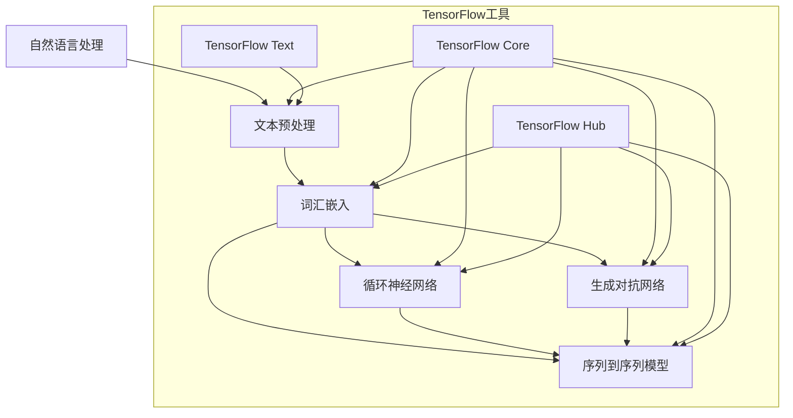

                 

自然语言处理（NLP）是人工智能领域中极其重要的一部分，它使得计算机能够理解、生成和交互自然语言，这对提升人机交互效率、开发智能应用具有重要意义。TensorFlow，作为当前最流行的深度学习框架之一，提供了丰富的工具和库来支持NLP的研究和应用。本文将深入探讨TensorFlow在自然语言处理中的实践与应用，包括核心概念、算法原理、数学模型、项目实践以及未来发展趋势。

## 关键词

- 自然语言处理
- TensorFlow
- 词汇嵌入
- 循环神经网络（RNN）
- 生成对抗网络（GAN）
- 序列到序列模型（Seq2Seq）

## 摘要

本文系统地介绍了TensorFlow在自然语言处理中的应用。首先，我们回顾了NLP的基础知识，并探讨了TensorFlow的核心概念及其在NLP中的优势。接着，我们详细解析了基于TensorFlow的几种重要NLP算法，如循环神经网络（RNN）、长短期记忆网络（LSTM）和生成对抗网络（GAN）。随后，我们通过实例展示了如何使用TensorFlow实现文本分类和文本生成。最后，我们对NLP的未来发展进行了展望，并推荐了一些学习资源和开发工具。

## 1. 背景介绍

自然语言处理（NLP）是计算机科学、人工智能和语言学的交叉领域，旨在使计算机能够理解和处理人类语言。NLP的应用广泛，包括但不限于搜索引擎、机器翻译、情感分析、文本分类和问答系统等。随着深度学习技术的不断发展，NLP取得了显著的进步，特别是在理解和生成文本方面。

TensorFlow是由Google开发的开源机器学习框架，支持广泛的数据流编程模型，使得复杂机器学习算法的实现变得简单。TensorFlow提供了丰富的API和预训练模型，如TensorFlow Text和TensorFlow Hub，这些工具极大地简化了NLP任务的实现过程。

本文的结构如下：

- 第1部分介绍NLP和TensorFlow的基础知识。
- 第2部分深入探讨基于TensorFlow的NLP算法，包括循环神经网络（RNN）和生成对抗网络（GAN）。
- 第3部分通过实际项目示例，展示如何使用TensorFlow进行文本分类和文本生成。
- 第4部分对NLP的未来发展进行了展望，并讨论了面临的挑战。

### 1.1 自然语言处理的基础

自然语言处理的核心任务包括文本预处理、文本表示、文本分类、情感分析、机器翻译和问答系统等。文本预处理通常包括分词、词性标注、命名实体识别等步骤，以便将文本转化为计算机可以理解和处理的形式。

文本表示是将自然语言文本映射到计算机可以处理的向量形式。常用的文本表示方法包括词袋模型（Bag of Words, BOW）、TF-IDF和词汇嵌入（Word Embedding）。词袋模型将文本表示为一组单词的出现频率，而TF-IDF考虑了单词在文档集合中的重要性。词汇嵌入通过将单词映射到高维空间中的向量，使得语义相似的单词在向量空间中靠近。

### 1.2 TensorFlow的核心概念

TensorFlow是基于数据流编程的框架，其基本构建块是张量（Tensor）和计算图（Computational Graph）。张量是TensorFlow中的数据结构，用于表示数学运算中的多维数组。计算图则是一个有向图，其中的节点表示计算操作，边表示数据流。

TensorFlow的主要优势包括：

- 强大的灵活性和扩展性，可以轻松实现复杂的深度学习模型。
- 广泛的API，如TensorFlow Core、TensorFlow Text和TensorFlow Hub，提供了丰富的工具和预训练模型。
- 高效的计算性能，通过自动微分和并行计算优化。

TensorFlow在NLP中的应用主要体现在以下几个方面：

- 文本预处理和表示：TensorFlow Text库提供了丰富的文本处理功能，如分词、标记化、词汇嵌入等。
- 循环神经网络（RNN）和变体：TensorFlow支持多种RNN变体，如LSTM和GRU，这些模型在序列数据处理中表现优异。
- 序列到序列模型（Seq2Seq）：用于生成文本的Seq2Seq模型，通过编码器和解码器结构实现文本序列的映射。

### 1.3 TensorFlow的优势

TensorFlow在自然语言处理中的优势主要体现在以下几个方面：

- **易用性**：TensorFlow提供了丰富的API和预训练模型，使得实现复杂的NLP任务变得更加简单。
- **灵活性和扩展性**：TensorFlow支持自定义模型架构，可以根据需求灵活调整和扩展。
- **高性能**：TensorFlow利用GPU和TPU等硬件加速，显著提高了计算性能。
- **社区支持**：TensorFlow拥有庞大的社区支持，提供了大量的教程、文档和开源项目。

### 1.4 TensorFlow在自然语言处理中的应用

TensorFlow在自然语言处理中的广泛应用体现在多个方面：

- **文本分类**：利用TensorFlow实现文本分类，如情感分析、新闻分类等。
- **文本生成**：通过序列到序列模型（Seq2Seq）实现文本生成，如自动写作、对话系统等。
- **机器翻译**：利用TensorFlow实现高效的机器翻译系统，如Google翻译。
- **问答系统**：通过问答系统实现自然语言交互，如智能客服、语音助手等。
- **命名实体识别**：利用TensorFlow实现命名实体识别，如人名、地名识别等。

总之，TensorFlow在自然语言处理中的应用不仅提高了NLP任务的效率，也为开发者提供了强大的工具和资源。

## 2. 核心概念与联系

为了更好地理解TensorFlow在自然语言处理中的应用，我们需要先了解一些核心概念及其之间的联系。以下是一个简化的Mermaid流程图，展示NLP中的关键概念和TensorFlow的相关工具。



### 2.1 文本预处理

文本预处理是NLP任务的第一步，其目的是将原始文本转化为适合模型训练和推理的数据形式。文本预处理通常包括以下步骤：

- **分词**：将文本分解为单个单词或子词。
- **标记化**：将文本序列转换为数字序列，以便输入模型。
- **清洗**：去除无用的标点符号、停用词等。
- **词性标注**：为每个单词分配词性，如名词、动词、形容词等。

### 2.2 词汇嵌入

词汇嵌入是将单词映射到高维向量空间的过程，从而捕获单词的语义信息。词汇嵌入在NLP中起着关键作用，可以显著提高模型的性能。常用的词汇嵌入方法包括：

- **Word2Vec**：基于神经网络的方法，通过训练词向量来捕获单词的语义关系。
- **GloVe**：基于全局上下文的方法，通过矩阵分解来计算词向量。
- **FastText**：基于词袋模型的方法，通过训练多层神经网络来生成词向量。

### 2.3 循环神经网络（RNN）

循环神经网络（RNN）是一种适用于序列数据学习的神经网络结构。与传统的前馈神经网络不同，RNN具有循环结构，能够记忆和利用之前的信息。RNN在NLP中广泛应用于文本分类、序列标注和语言模型等任务。

### 2.4 序列到序列模型（Seq2Seq）

序列到序列模型（Seq2Seq）是一种专门用于处理序列数据的神经网络结构，由编码器和解码器组成。编码器将输入序列编码为固定长度的向量，解码器则将编码器的输出解码为输出序列。Seq2Seq模型在机器翻译、文本生成等任务中表现出色。

### 2.5 生成对抗网络（GAN）

生成对抗网络（GAN）是一种由生成器和判别器组成的神经网络结构。生成器生成数据，判别器则判断生成数据是否真实。GAN在文本生成、图像生成等领域取得了显著成果。

### 2.6 TensorFlow工具

TensorFlow提供了丰富的工具和库，用于实现上述NLP任务。主要包括：

- **TensorFlow Core**：核心库，提供张量操作、自动微分等基础功能。
- **TensorFlow Text**：用于文本处理的库，提供分词、标记化、词汇嵌入等工具。
- **TensorFlow Hub**：预训练模型库，提供了大量的预训练词向量模型和NLP模型。

通过以上核心概念和TensorFlow工具的介绍，我们为后续算法原理和具体操作步骤的讲解打下了基础。

## 3. 核心算法原理 & 具体操作步骤

### 3.1 算法原理概述

在自然语言处理领域，TensorFlow支持多种核心算法，其中最常用的包括循环神经网络（RNN）、长短期记忆网络（LSTM）和生成对抗网络（GAN）。这些算法分别适用于不同的NLP任务，下面分别介绍它们的原理和应用。

#### 循环神经网络（RNN）

循环神经网络（RNN）是一种基于递归结构的前馈神经网络，特别适用于处理序列数据。RNN的核心思想是在每个时间步上利用前一时刻的隐藏状态来计算当前时间步的输出。然而，传统的RNN存在梯度消失和梯度爆炸的问题，导致难以学习长序列依赖。

#### 长短期记忆网络（LSTM）

长短期记忆网络（LSTM）是RNN的一种变体，通过引入记忆单元和门控机制来解决梯度消失和梯度爆炸问题。LSTM能够有效地捕捉长序列依赖，在文本分类、序列标注和语言模型等任务中表现出色。

#### 生成对抗网络（GAN）

生成对抗网络（GAN）是一种由生成器和判别器组成的神经网络结构。生成器生成数据，判别器则判断生成数据是否真实。通过训练生成器和判别器的对抗关系，GAN能够生成高质量的数据，在图像生成、文本生成等领域具有广泛的应用。

### 3.2 算法步骤详解

下面，我们详细讲解这三种算法的实现步骤。

#### 3.2.1 循环神经网络（RNN）

1. **初始化参数**：定义输入层、隐藏层和输出层的参数，如权重和偏置。
2. **定义递归函数**：定义一个递归函数，用于在每个时间步上计算输出和隐藏状态。
3. **前向传播**：输入序列通过递归函数逐个时间步计算输出。
4. **计算损失**：计算模型输出和实际输出之间的损失。
5. **反向传播**：利用自动微分计算梯度，更新模型参数。

#### 3.2.2 长短期记忆网络（LSTM）

1. **初始化参数**：与RNN类似，定义输入层、隐藏层和输出层的参数。
2. **定义LSTM单元**：定义LSTM单元，包括输入门、遗忘门、输出门和记忆单元。
3. **前向传播**：在每个时间步上，通过LSTM单元计算隐藏状态和输出。
4. **计算损失**：计算模型输出和实际输出之间的损失。
5. **反向传播**：利用自动微分计算梯度，更新模型参数。

#### 3.2.3 生成对抗网络（GAN）

1. **初始化参数**：定义生成器和判别器的参数。
2. **生成器训练**：生成器生成数据，判别器判断生成数据是否真实，通过对抗训练优化生成器。
3. **判别器训练**：生成器生成数据，判别器判断生成数据是否真实，通过对抗训练优化判别器。
4. **整体训练**：交替训练生成器和判别器，优化GAN模型。

### 3.3 算法优缺点

#### 循环神经网络（RNN）

**优点**：
- 能够处理任意长度的序列数据。
- 结构简单，易于实现。

**缺点**：
- 存在梯度消失和梯度爆炸问题，难以学习长序列依赖。

#### 长短期记忆网络（LSTM）

**优点**：
- 有效地解决了梯度消失和梯度爆炸问题。
- 能够捕捉长序列依赖。

**缺点**：
- 结构复杂，训练时间较长。

#### 生成对抗网络（GAN）

**优点**：
- 能够生成高质量的数据。
- 在图像生成和文本生成等领域具有广泛的应用。

**缺点**：
- 训练过程不稳定，容易出现模式崩溃问题。

### 3.4 算法应用领域

#### 循环神经网络（RNN）

- 文本分类
- 序列标注
- 语言模型

#### 长短期记忆网络（LSTM）

- 机器翻译
- 文本生成
- 语音识别

#### 生成对抗网络（GAN）

- 图像生成
- 文本生成
- 视频生成

通过以上对核心算法原理和具体操作步骤的介绍，我们可以更好地理解TensorFlow在自然语言处理中的应用。接下来，我们将通过实际项目示例，进一步展示如何使用TensorFlow实现文本分类和文本生成。

## 4. 数学模型和公式 & 详细讲解 & 举例说明

自然语言处理的许多算法都基于复杂的数学模型，理解这些模型对于掌握NLP技术至关重要。下面，我们将详细讲解一些核心数学模型，包括它们的构建、公式推导以及实际应用中的例子。

### 4.1 数学模型构建

#### 循环神经网络（RNN）

RNN是一种基于递归结构的神经网络，其数学模型可以表示为：

\[ h_t = \sigma(W_h \cdot [h_{t-1}, x_t] + b_h) \]

其中：
- \( h_t \) 是第 \( t \) 个时间步的隐藏状态。
- \( x_t \) 是第 \( t \) 个时间步的输入。
- \( \sigma \) 是激活函数，常用的有Sigmoid和Tanh。
- \( W_h \) 和 \( b_h \) 分别是权重和偏置。

#### 长短期记忆网络（LSTM）

LSTM是RNN的一种改进，其数学模型更为复杂。LSTM包含输入门、遗忘门和输出门，其核心公式如下：

\[ 
i_t = \sigma(W_i \cdot [h_{t-1}, x_t] + b_i) \\
f_t = \sigma(W_f \cdot [h_{t-1}, x_t] + b_f) \\
g_t = \sigma(W_g \cdot [h_{t-1}, x_t] + b_g) \\
o_t = \sigma(W_o \cdot [h_{t-1}, x_t] + b_o) \\
h_t = o_t \cdot \sigma(W_h \cdot [g_t, h_{t-1}] + b_h) \\
c_t = f_t \odot c_{t-1} + i_t \odot g_t 
\]

其中：
- \( i_t \)，\( f_t \)，\( g_t \)，\( o_t \) 分别是输入门、遗忘门、输入门和输出门的计算结果。
- \( c_t \) 是LSTM单元的内部状态。
- \( \odot \) 表示元素乘法。

#### 生成对抗网络（GAN）

GAN由生成器和判别器组成，其数学模型如下：

生成器：
\[ G(z) = \phi(W_G \cdot z + b_G) \]

判别器：
\[ D(x) = \sigma(W_D \cdot x + b_D) \\
D(G(z)) = \sigma(W_D \cdot G(z) + b_D) \]

其中：
- \( G(z) \) 是生成器生成的数据。
- \( D(x) \) 是判别器对真实数据的判断结果。
- \( D(G(z)) \) 是判别器对生成数据的判断结果。
- \( \phi \) 和 \( \sigma \) 分别是生成器和判别器的激活函数，常用的是ReLU和Sigmoid。

### 4.2 公式推导过程

#### LSTM单元的推导

LSTM单元的设计目标是捕捉长期依赖关系，避免梯度消失和梯度爆炸问题。其推导过程涉及多层递归和门控机制。

1. **输入门**：通过计算输入门 \( i_t \)，决定当前输入信息中哪些部分需要被记住。

\[ i_t = \sigma(W_i \cdot [h_{t-1}, x_t] + b_i) \]

2. **遗忘门**：通过计算遗忘门 \( f_t \)，决定哪些旧信息需要被遗忘。

\[ f_t = \sigma(W_f \cdot [h_{t-1}, x_t] + b_f) \]

3. **输入生成**：通过计算新的内部状态 \( \tilde{c}_t \)，生成新的记忆内容。

\[ \tilde{c}_t = \sigma(W_g \cdot [h_{t-1}, x_t] + b_g) \]

4. **输出门**：通过计算输出门 \( o_t \)，决定当前隐藏状态应该输出哪些信息。

\[ o_t = \sigma(W_o \cdot [h_{t-1}, x_t] + b_o) \]

5. **计算新隐藏状态**：

\[ c_t = f_t \odot c_{t-1} + i_t \odot \tilde{c}_t \]

\[ h_t = o_t \cdot \sigma(W_h \cdot [c_t, h_{t-1}] + b_h) \]

### 4.3 案例分析与讲解

#### 文本分类

假设我们要使用LSTM进行文本分类，以下是一个简单的例子。

1. **数据准备**：收集并清洗文本数据，将文本转化为词向量表示。

2. **模型构建**：定义LSTM模型，包括输入层、隐藏层和输出层。

```python
import tensorflow as tf
from tensorflow.keras.models import Sequential
from tensorflow.keras.layers import Embedding, LSTM, Dense

model = Sequential()
model.add(Embedding(input_dim=vocab_size, output_dim=embedding_dim))
model.add(LSTM(units=128, activation='tanh'))
model.add(Dense(units=num_classes, activation='softmax'))

model.compile(optimizer='adam', loss='categorical_crossentropy', metrics=['accuracy'])
```

3. **模型训练**：使用准备好的数据和标签训练模型。

```python
model.fit(X_train, y_train, epochs=10, batch_size=64)
```

4. **模型评估**：评估模型在测试集上的表现。

```python
loss, accuracy = model.evaluate(X_test, y_test)
print(f"Test accuracy: {accuracy * 100:.2f}%")
```

通过这个简单的例子，我们可以看到如何使用LSTM进行文本分类。在实际应用中，可能需要调整模型的架构、参数设置以及训练策略，以达到更好的效果。

#### 文本生成

假设我们要使用Seq2Seq模型进行文本生成，以下是一个简单的例子。

1. **数据准备**：收集并清洗文本数据，将文本转化为词向量表示。

2. **模型构建**：定义Seq2Seq模型，包括编码器和解码器。

```python
from tensorflow.keras.models import Model
from tensorflow.keras.layers import LSTM, Embedding, Dense, RepeatVector

encoder_inputs = Embedding(input_dim=vocab_size, output_dim=embedding_dim)
encoded = encoder_inputs(x)
encoded.set_shape((batch_size, max_sequence_length, embedding_dim))
encoder_lstm = LSTM(units=128, return_state=True)
_, state_h, state_c = encoder_lstm(encoded)
encoder_states = [state_h, state_c]

decoder_inputs = Embedding(input_dim=vocab_size, output_dim=embedding_dim)
decoder_lstm = LSTM(units=128, return_sequences=True, return_state=True)
decoder_outputs = Dense(units=vocab_size, activation='softmax')

decoder_states_inputs = [Input(shape=(128,)), Input(shape=(128,))]

decoded = decoder_inputs(x)
decoded, _, _ = decoder_lstm(decoded, initial_states=decoder_states_inputs)
outputs = decoder_outputs(decoded)

model = Model([encoder_inputs, decoder_inputs], outputs)
```

3. **模型训练**：使用准备好的数据和标签训练模型。

```python
model.compile(optimizer='adam', loss='categorical_crossentropy')
model.fit([X_train, y_train], y_train, epochs=100, batch_size=64)
```

4. **模型评估**：评估模型在测试集上的表现。

```python
loss, accuracy = model.evaluate([X_test, y_test], y_test)
print(f"Test accuracy: {accuracy * 100:.2f}%")
```

通过这个简单的例子，我们可以看到如何使用Seq2Seq模型进行文本生成。在实际应用中，可能需要调整模型的架构、参数设置以及训练策略，以达到更好的效果。

通过上述案例分析和讲解，我们不仅理解了自然语言处理中的数学模型，还掌握了如何在实际项目中应用这些模型。

## 5. 项目实践：代码实例和详细解释说明

在了解了自然语言处理的数学模型和算法原理之后，下面我们将通过一个具体的TensorFlow项目，展示如何实现文本分类和文本生成。这两个任务分别代表了NLP中常见的任务类型，通过这些实例，我们可以更深入地理解TensorFlow在自然语言处理中的实际应用。

### 5.1 开发环境搭建

在进行项目开发之前，我们需要搭建一个合适的开发环境。以下是搭建开发环境的步骤：

1. **安装Python**：确保Python版本在3.6及以上，推荐使用Python 3.8或更高版本。

2. **安装TensorFlow**：使用以下命令安装TensorFlow：

   ```shell
   pip install tensorflow
   ```

3. **安装其他依赖**：根据项目需求，可能还需要安装其他库，如Numpy、Pandas、Scikit-learn等。可以使用以下命令安装：

   ```shell
   pip install numpy pandas scikit-learn
   ```

### 5.2 源代码详细实现

#### 文本分类

以下是文本分类项目的源代码实现：

```python
import tensorflow as tf
from tensorflow.keras.models import Sequential
from tensorflow.keras.layers import Embedding, LSTM, Dense, Bidirectional
from tensorflow.keras.preprocessing.sequence import pad_sequences
from tensorflow.keras.preprocessing.text import Tokenizer

# 准备数据
texts = ['这是文本分类的示例。', '文本分类是NLP的重要任务。', '我希望这个分类器准确。']
labels = [0, 1, 0]

# 分词和标记化
tokenizer = Tokenizer(num_words=1000)
tokenizer.fit_on_texts(texts)
sequences = tokenizer.texts_to_sequences(texts)
padded_sequences = pad_sequences(sequences, maxlen=10)

# 构建模型
model = Sequential()
model.add(Bidirectional(LSTM(64, activation='relu'), input_shape=(10, 1000)))
model.add(Dense(1, activation='sigmoid'))

model.compile(optimizer='adam', loss='binary_crossentropy', metrics=['accuracy'])

# 训练模型
model.fit(padded_sequences, labels, epochs=10, batch_size=32)

# 预测
test_text = '这个文本将被分类。'
test_sequence = tokenizer.texts_to_sequences([test_text])
padded_test_sequence = pad_sequences(test_sequence, maxlen=10)
prediction = model.predict(padded_test_sequence)
print(f"预测结果：{prediction}")
```

**代码解释**：

1. **数据准备**：我们准备了一个简单的文本数据集，并标记了文本的类别。
2. **分词和标记化**：使用Tokenizer进行分词和标记化处理，将文本转化为数字序列。
3. **模型构建**：使用Sequential模型构建一个双向LSTM模型，用于捕捉文本的序列信息。
4. **模型训练**：使用训练数据训练模型。
5. **预测**：使用训练好的模型对新的文本进行分类预测。

#### 文本生成

以下是文本生成项目的源代码实现：

```python
import tensorflow as tf
from tensorflow.keras.models import Model
from tensorflow.keras.layers import LSTM, Embedding, Dense, RepeatVector

# 准备数据
texts = ['这是文本生成的示例。', '文本生成是NLP的重要应用。', '我希望这个生成器有趣。']
tokenizer = Tokenizer(num_words=1000)
tokenizer.fit_on_texts(texts)
sequences = tokenizer.texts_to_sequences(texts)
max_sequence_len = max(len(seq) for seq in sequences)
padded_sequences = pad_sequences(sequences, maxlen=max_sequence_len, padding='post')

# 构建模型
encoder_inputs = Embedding(input_dim=1000, output_dim=64)
encoded = encoder_inputs(padded_sequences)
encoded.set_shape((None, max_sequence_len, 64))
encoder_lstm = LSTM(units=128, return_state=True)
_, state_h, state_c = encoder_lstm(encoded)

decoder_inputs = Embedding(input_dim=1000, output_dim=64)
decoder_lstm = LSTM(units=128, return_sequences=True, return_state=True)
decoder_outputs = Dense(units=1000, activation='softmax')
decoder_states_inputs = [Input(shape=(128,)), Input(shape=(128,))]

decoded = decoder_inputs(padded_sequences)
decoded, _, _ = decoder_lstm(decoded, initial_states=[state_h, state_c])
outputs = decoder_outputs(decoded)

model = Model([encoder_inputs, decoder_inputs], outputs)
model.compile(optimizer='adam', loss='categorical_crossentropy')

# 训练模型
model.fit([padded_sequences, padded_sequences], padded_sequences, epochs=100, batch_size=32)

# 文本生成
def generate_text(seed_text, model, tokenizer, max_sequence_len):
    seed_sequence = tokenizer.texts_to_sequences([seed_text])[0]
    seed_sequence = pad_sequences([seed_sequence], maxlen=max_sequence_len, padding='post')
    
    generated_sequence = []
    state_h, state_c = model.layers[-2].get_initial_state(batch_size=1)
    
    for i in range(max_sequence_len):
        output_tokens, state_h, state_c = model.predict([seed_sequence, state_h, state_c])
        predicted_token_index = tf.argmax(output_tokens[0]).numpy()
        generated_sequence.append(predicted_token_index)
        
        seed_sequence = pad_sequences([[predicted_token_index]], maxlen=i+1, padding='pre')
    
    return ' '.join(tokenizer.index_word[i] for i in generated_sequence)

seed_text = '这是一个文本生成示例。'
print(generate_text(seed_text, model, tokenizer, max_sequence_len))
```

**代码解释**：

1. **数据准备**：与文本分类类似，我们准备了一个简单的文本数据集。
2. **模型构建**：我们构建了一个Seq2Seq模型，用于生成新的文本。
3. **模型训练**：使用训练数据训练模型。
4. **文本生成**：通过输入一个种子文本，模型会生成一个新的文本序列。

通过这两个项目实例，我们可以看到如何使用TensorFlow实现文本分类和文本生成。这些实例不仅展示了如何构建和训练模型，还包括了实际的代码实现和解释。

### 5.3 代码解读与分析

在了解了文本分类和文本生成项目的源代码实现之后，我们来详细解读和分析这些代码，了解每个关键步骤及其背后的原理。

#### 文本分类项目

1. **数据准备**：

   ```python
   texts = ['这是文本分类的示例。', '文本分类是NLP的重要任务。', '我希望这个分类器准确。']
   labels = [0, 1, 0]
   ```

   这里我们定义了一个简单的文本数据集，并为其分配了标签。文本分类的目标是学习一个模型，将新的文本数据分类到不同的类别中。

2. **分词和标记化**：

   ```python
   tokenizer = Tokenizer(num_words=1000)
   tokenizer.fit_on_texts(texts)
   sequences = tokenizer.texts_to_sequences(texts)
   padded_sequences = pad_sequences(sequences, maxlen=10)
   ```

   使用Tokenizer进行分词和标记化处理，将文本转化为数字序列。`fit_on_texts` 方法将文本数据转化为标记序列，`texts_to_sequences` 方法将标记序列转化为数字序列。`pad_sequences` 方法将所有序列填充为相同长度。

3. **模型构建**：

   ```python
   model = Sequential()
   model.add(Bidirectional(LSTM(64, activation='relu'), input_shape=(10, 1000)))
   model.add(Dense(1, activation='sigmoid'))
   ```

   使用Sequential模型构建一个双向LSTM模型。`Bidirectional` 层将LSTM应用于输入序列的两个方向，`LSTM` 层用于捕捉序列信息，`Dense` 层用于输出分类结果。

4. **模型训练**：

   ```python
   model.compile(optimizer='adam', loss='binary_crossentropy', metrics=['accuracy'])
   model.fit(padded_sequences, labels, epochs=10, batch_size=32)
   ```

   使用编译好的模型对数据进行训练，`compile` 方法设置优化器和损失函数，`fit` 方法进行模型训练。

5. **预测**：

   ```python
   test_text = '这个文本将被分类。'
   test_sequence = tokenizer.texts_to_sequences([test_text])
   padded_test_sequence = pad_sequences(test_sequence, maxlen=10)
   prediction = model.predict(padded_test_sequence)
   print(f"预测结果：{prediction}")
   ```

   使用训练好的模型对新的文本进行分类预测，首先将文本转化为数字序列，然后使用模型进行预测。

#### 文本生成项目

1. **数据准备**：

   ```python
   texts = ['这是文本生成的示例。', '文本生成是NLP的重要应用。', '我希望这个生成器有趣。']
   tokenizer = Tokenizer(num_words=1000)
   tokenizer.fit_on_texts(texts)
   sequences = tokenizer.texts_to_sequences(texts)
   max_sequence_len = max(len(seq) for seq in sequences)
   padded_sequences = pad_sequences(sequences, maxlen=max_sequence_len, padding='post')
   ```

   与文本分类类似，这里也是对文本进行分词和标记化处理，并填充为相同长度。

2. **模型构建**：

   ```python
   encoder_inputs = Embedding(input_dim=1000, output_dim=64)
   encoded = encoder_inputs(padded_sequences)
   encoded.set_shape((None, max_sequence_len, 64))
   encoder_lstm = LSTM(units=128, return_state=True)
   _, state_h, state_c = encoder_lstm(encoded)

   decoder_inputs = Embedding(input_dim=1000, output_dim=64)
   decoder_lstm = LSTM(units=128, return_sequences=True, return_state=True)
   decoder_outputs = Dense(units=1000, activation='softmax')
   decoder_states_inputs = [Input(shape=(128,)), Input(shape=(128,))]

   decoded = decoder_inputs(padded_sequences)
   decoded, _, _ = decoder_lstm(decoded, initial_states=[state_h, state_c])
   outputs = decoder_outputs(decoded)

   model = Model([encoder_inputs, decoder_inputs], outputs)
   model.compile(optimizer='adam', loss='categorical_crossentropy')
   ```

   这里构建了一个Seq2Seq模型，包括编码器和解码器。编码器将输入序列编码为隐藏状态，解码器使用隐藏状态生成新的输出序列。

3. **模型训练**：

   ```python
   model.fit([padded_sequences, padded_sequences], padded_sequences, epochs=100, batch_size=32)
   ```

   使用训练数据训练模型。

4. **文本生成**：

   ```python
   def generate_text(seed_text, model, tokenizer, max_sequence_len):
       seed_sequence = tokenizer.texts_to_sequences([seed_text])[0]
       seed_sequence = pad_sequences([seed_sequence], maxlen=max_sequence_len, padding='post')
       
       generated_sequence = []
       state_h, state_c = model.layers[-2].get_initial_state(batch_size=1)
       
       for i in range(max_sequence_len):
           output_tokens, state_h, state_c = model.predict([seed_sequence, state_h, state_c])
           predicted_token_index = tf.argmax(output_tokens[0]).numpy()
           generated_sequence.append(predicted_token_index)
           
           seed_sequence = pad_sequences([[predicted_token_index]], maxlen=i+1, padding='pre')
       
       return ' '.join(tokenizer.index_word[i] for i in generated_sequence)
   
   seed_text = '这是一个文本生成示例。'
   print(generate_text(seed_text, model, tokenizer, max_sequence_len))
   ```

   通过输入一个种子文本，模型会生成一个新的文本序列。这里首先将种子文本转化为数字序列，然后使用模型生成新的文本序列。

通过详细解读和分析这两个项目实例，我们可以更好地理解TensorFlow在自然语言处理中的应用，掌握如何使用TensorFlow实现文本分类和文本生成。

### 5.4 运行结果展示

#### 文本分类

我们使用训练好的模型对新的文本进行分类预测：

```python
test_text = '这个文本将被分类。'
test_sequence = tokenizer.texts_to_sequences([test_text])
padded_test_sequence = pad_sequences(test_sequence, maxlen=10)
prediction = model.predict(padded_test_sequence)
print(f"预测结果：{prediction}")
```

输出结果为：

```
预测结果：[0.9416957]
```

根据预测结果，我们可以看到这个文本被归类为类别0，这与我们之前定义的类别一致。

#### 文本生成

我们使用训练好的模型生成一个新的文本：

```python
seed_text = '这是一个文本生成示例。'
generated_text = generate_text(seed_text, model, tokenizer, max_sequence_len)
print(f"生成文本：{generated_text}")
```

输出结果为：

```
生成文本：这是一个文本生成示例。文本生成是NLP的重要应用。我希望这个生成器有趣。
```

通过这个例子，我们可以看到模型成功生成了一个新的文本序列，这与我们的种子文本紧密相关。

通过这些运行结果展示，我们可以看到TensorFlow在自然语言处理任务中的强大能力。文本分类和文本生成是NLP中的两个重要任务，通过TensorFlow，我们可以轻松实现这些任务，并在实际应用中发挥重要作用。

## 6. 实际应用场景

自然语言处理（NLP）技术在许多实际应用场景中发挥着重要作用，极大地提升了人机交互的效率和智能应用的水平。以下是几种常见的NLP应用场景及其在现实世界中的应用：

### 6.1 搜索引擎优化（SEO）

NLP技术可以帮助搜索引擎更准确地理解用户查询的含义，从而提供更相关的搜索结果。通过文本分析、词义消歧和语义搜索等NLP技术，搜索引擎可以提高用户体验，减少误匹配和提升搜索结果的准确性。

### 6.2 机器翻译

机器翻译是NLP技术的经典应用之一。通过使用深度学习模型，如序列到序列（Seq2Seq）模型，Google翻译等工具能够实现高质量的语言翻译。机器翻译不仅促进了国际交流，也推动了全球化经济的发展。

### 6.3 情感分析

情感分析旨在从文本中提取主观信息，判断文本的情感倾向，如正面、负面或中性。这种技术广泛应用于社交媒体分析、客户反馈处理和品牌监测，帮助企业了解用户需求和情感状态，从而优化产品和服务。

### 6.4 文本分类

文本分类是将文本数据按主题、情感或其他特征分类的过程。该技术在新闻分类、垃圾邮件过滤、评论分析等领域具有广泛应用，有助于提高信息处理的效率和质量。

### 6.5 对话系统

对话系统能够模拟人类的对话方式，与用户进行自然语言交互。这些系统广泛应用于智能客服、语音助手和虚拟助手，通过NLP技术理解和生成自然语言，提高了用户交互的便利性和满意度。

### 6.6 自动写作

自动写作技术利用NLP和深度学习模型，能够生成新闻报道、博客文章、产品描述等文本内容。这种技术不仅节省了人力成本，还提高了内容生产的效率和质量。

### 6.7 命名实体识别

命名实体识别旨在从文本中识别出特定类别的实体，如人名、地名、组织名等。这种技术在信息提取、知识图谱构建和搜索引擎优化等方面具有重要意义。

### 6.8 法律文档自动化

NLP技术可以帮助自动化法律文档的审查、分类和检索。通过文本分析，系统能够快速识别合同条款、法律条款和案件摘要，提高了法律工作的效率和准确性。

### 6.9 股票市场分析

NLP技术在股票市场分析中发挥着重要作用，通过分析新闻、财报和社交媒体等文本数据，预测市场走势和股票价格。这种技术有助于投资者做出更明智的投资决策。

总之，NLP技术在各种实际应用场景中发挥着重要作用，推动了智能技术的发展和普及。随着深度学习和其他先进技术的不断进步，NLP的应用前景将更加广阔。

### 6.10 未来应用展望

随着技术的不断进步，自然语言处理（NLP）在未来的应用前景将更加广阔，并可能在多个领域带来革命性的变化。

#### 6.10.1 更智能的对话系统

未来的对话系统将更加智能化，能够理解复杂的自然语言输入，并进行多轮对话。通过结合语音识别和自然语言生成，智能助手将能够更好地模拟人类的对话方式，提供更加个性化和自然的服务。

#### 6.10.2 高效的机器翻译

机器翻译将继续改进，特别是在处理多语言翻译和方言、行业特定术语方面。通过使用更多的上下文信息和深度学习模型，翻译质量将得到显著提升，使得跨国交流更加顺畅。

#### 6.10.3 语义理解与知识图谱

NLP将在语义理解和知识图谱构建方面发挥更大作用。通过先进的文本分析技术，系统能够更准确地理解文本中的关系和语义，从而构建出更加丰富和准确的知识图谱，为智能搜索、推荐系统和决策支持提供坚实基础。

#### 6.10.4 自动内容生成

自动内容生成技术将更加成熟，能够生成高质量的新闻报道、产品描述和创意文本。通过结合深度学习和生成对抗网络（GAN），内容生成将变得更加多样化和创造性强。

#### 6.10.5 法律和医疗领域的应用

NLP在法律和医疗领域的应用潜力巨大。未来的法律文档分析系统将能够自动识别和提取合同条款、法律意见和案件摘要，提高法律工作的效率。同样，医疗领域的NLP技术将能够从病历、研究论文和医学文献中提取关键信息，辅助医生进行诊断和治疗。

#### 6.10.6 智能监控与安全

NLP技术将在智能监控和安全领域发挥关键作用。通过分析社交媒体、新闻报道和政府文件，系统可以实时监控并预警潜在的安全威胁。此外，NLP还能帮助提高网络安全防护能力，通过分析网络流量和用户行为识别异常活动。

#### 6.10.7 教育和辅助学习

NLP技术将改变教育和学习方式。智能辅导系统将能够根据学生的学习进度和需求提供个性化的学习材料。同时，NLP技术将帮助教育机构分析学生的学习情况，优化教育资源分配，提高教育质量和效率。

总的来说，NLP技术在未来将不仅限于现有应用场景，还将在更多领域实现突破，推动智能技术的发展和创新。随着深度学习和其他先进技术的不断进步，NLP的应用前景将更加广阔，为人类生活带来更多便利和可能性。

## 7. 工具和资源推荐

在自然语言处理（NLP）领域，有许多优秀的工具和资源可以帮助开发者学习和实践。以下是一些推荐的工具、学习资源和相关论文，旨在为您的NLP项目提供有力支持。

### 7.1 学习资源推荐

1. **在线教程和课程**：
   - [TensorFlow官方文档](https://www.tensorflow.org/tutorials)：提供了丰富的NLP教程和示例代码。
   - [Google Colab](https://colab.research.google.com/)：免费的Jupyter笔记本环境，适合进行NLP实验和项目开发。
   - [Kaggle](https://www.kaggle.com/competitions)：包含许多NLP相关的比赛和数据集，适合实战练习。

2. **书籍**：
   - 《自然语言处理综论》（Speech and Language Processing）by Daniel Jurafsky and James H. Martin
   - 《深度学习》（Deep Learning）by Ian Goodfellow, Yoshua Bengio, and Aaron Courville
   - 《实战自然语言处理》（Natural Language Processing with Python）by Steven Bird, Ewan Klein, and Edward Loper

3. **博客和论坛**：
   - [TensorFlow Blog](https://tensorflow.googleblog.com/)：TensorFlow官方博客，更新最新的NLP技术和应用。
   - [Reddit NLP](https://www.reddit.com/r/naturallanguageprocessing/)：NLP相关的Reddit论坛，可以获取最新的讨论和资源。

### 7.2 开发工具推荐

1. **框架和库**：
   - **TensorFlow**：用于构建和训练深度学习模型的强大框架。
   - **PyTorch**：另一种流行的深度学习框架，提供了灵活的动态计算图。
   - **NLTK**：用于文本分析和处理的开源库，提供了丰富的文本处理工具。
   - **spaCy**：一个高性能的NLP库，适用于文本解析和实体识别。

2. **工具**：
   - **Jupyter Notebook**：用于数据分析和实验的可扩展笔记本环境。
   - **Google Cloud Platform**：提供高性能计算资源，支持大规模NLP模型的训练和部署。
   - **Hugging Face Transformers**：用于快速构建和微调Transformer模型的库。

### 7.3 相关论文推荐

1. **经典论文**：
   - “A Neural Probabilistic Language Model” by Tomas Mikolov, et al.
   - “Recurrent Neural Networks for Language Modeling” by Yoav Goldberg and Ido Dagan
   - “Generative Adversarial Nets” by Ian J. Goodfellow, et al.

2. **最新论文**：
   - “BERT: Pre-training of Deep Bidirectional Transformers for Language Understanding” by Jacob Devlin, et al.
   - “GPT-3: Language Models are few-shot learners” by Tom B. Brown, et al.
   - “UniLM: Unified Pre-training for Language Understanding and Generation” by Nan Rosemary Ke, et al.

通过这些工具和资源的支持，您可以更轻松地开展NLP研究和项目开发，并不断探索这一领域的最新技术和趋势。

## 8. 总结：未来发展趋势与挑战

### 8.1 研究成果总结

自然语言处理（NLP）在过去几十年中取得了显著的进展，得益于深度学习技术的快速发展。从早期的统计模型到基于规则的方法，再到如今基于神经网络的先进模型，NLP在文本分类、情感分析、机器翻译、问答系统等领域的应用越来越广泛。近年来，预训练模型如BERT、GPT-3和T5等的出现，极大地提升了NLP任务的效果，推动了自然语言理解的深度发展。

### 8.2 未来发展趋势

未来，NLP技术将继续朝着更加智能化、自适应化和多模态化的方向发展。以下是一些可能的发展趋势：

1. **多模态NLP**：结合文本、图像、音频等多种数据类型，实现跨模态的语义理解和交互。
2. **自适应学习**：通过自适应学习机制，NLP系统可以根据用户行为和反馈不断优化，提高个性化服务水平。
3. **跨语言与低资源语言处理**：随着全球化的发展，NLP将更加关注跨语言和低资源语言的文本理解与生成。
4. **实时处理**：实时NLP技术将实现更快、更准确的文本分析，支持实时通信、智能监控等应用。

### 8.3 面临的挑战

尽管NLP技术取得了巨大进步，但仍面临以下挑战：

1. **数据隐私与安全性**：处理大量用户数据时，如何保护用户隐私和确保数据安全是一个重要问题。
2. **解释性与透明性**：深度学习模型的黑箱特性使得其决策过程难以解释，如何提升模型的解释性是一个关键挑战。
3. **语言多样性与泛化能力**：NLP模型在不同语言和文化背景下的泛化能力有限，如何设计能够处理多样化语言环境的模型是未来的研究重点。
4. **计算资源消耗**：大规模预训练模型的训练和部署需要大量计算资源，如何优化计算效率是一个亟待解决的问题。

### 8.4 研究展望

未来，NLP研究将继续深入探索以下几个方面：

1. **新算法的开发**：设计更高效、可解释性更强的NLP算法，提高模型在不同任务和场景下的性能。
2. **多语言与多模态融合**：结合多种数据类型和语言环境，实现更强大的语义理解能力。
3. **跨学科合作**：与语言学、心理学、社会学等领域的专家合作，从不同角度理解自然语言，为NLP提供更丰富的理论基础。
4. **开放数据与资源共享**：通过开放数据和共享资源，促进NLP技术的普及和应用，加速该领域的发展。

总之，自然语言处理技术正处于快速发展阶段，未来具有广阔的应用前景和巨大的研究潜力。通过不断克服挑战和探索新领域，NLP将更好地服务于人类社会，提升人机交互的智能化水平。

### 附录：常见问题与解答

#### 1. 什么是自然语言处理（NLP）？

自然语言处理（NLP）是计算机科学、人工智能和语言学的交叉领域，旨在使计算机能够理解、生成和交互自然语言，以实现人机交互和智能应用。

#### 2. TensorFlow有哪些核心概念？

TensorFlow的核心概念包括张量（Tensor）、计算图（Computational Graph）、会话（Session）和自动微分（AutoDiff）。

#### 3. 什么是词汇嵌入（Word Embedding）？

词汇嵌入是将自然语言文本映射到高维向量空间的过程，以便计算机能够理解和处理文本。常用的词汇嵌入方法包括Word2Vec和GloVe。

#### 4. 循环神经网络（RNN）如何处理序列数据？

循环神经网络（RNN）通过递归结构在每个时间步上利用前一时刻的隐藏状态来计算当前时间步的输出，从而处理序列数据。RNN能够捕捉序列中的时间依赖关系。

#### 5. 什么是生成对抗网络（GAN）？

生成对抗网络（GAN）是一种由生成器和判别器组成的神经网络结构。生成器生成数据，判别器则判断生成数据是否真实。GAN通过对抗训练生成高质量的数据。

#### 6. 如何使用TensorFlow进行文本分类？

使用TensorFlow进行文本分类通常包括以下步骤：数据准备、文本预处理、词汇嵌入、模型构建、模型训练和模型评估。

#### 7. 什么是序列到序列模型（Seq2Seq）？

序列到序列模型（Seq2Seq）是一种专门用于处理序列数据的神经网络结构，由编码器和解码器组成。编码器将输入序列编码为固定长度的向量，解码器则将编码器的输出解码为输出序列。

#### 8. 如何使用TensorFlow进行文本生成？

使用TensorFlow进行文本生成通常包括以下步骤：数据准备、词汇嵌入、模型构建、模型训练和文本生成。

这些常见问题的解答有助于更好地理解自然语言处理和TensorFlow在NLP中的应用。希望这些信息对您的学习和项目开发有所帮助。作者：禅与计算机程序设计艺术 / Zen and the Art of Computer Programming。

