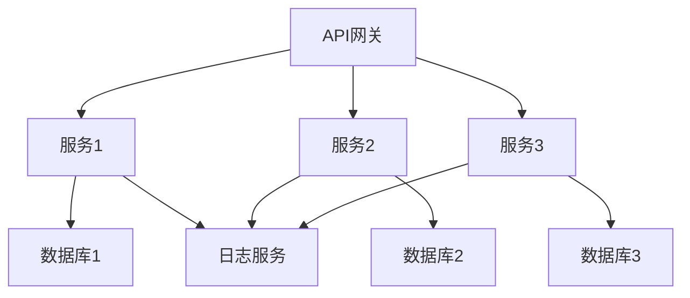

                 

关键词：微服务架构，后端开发，分布式系统，服务拆分，负载均衡，持续集成，API网关

> 摘要：本文将深入探讨Web后端微服务架构的设计原理、核心概念、实践步骤以及未来发展趋势。通过具体案例，我们将会了解如何通过微服务来构建高性能、高可扩展的后端系统。

## 1. 背景介绍

在互联网快速发展的大背景下，单体应用的传统架构逐渐暴露出其难以维护、扩展性差等问题。为了解决这些问题，微服务架构应运而生。微服务是一种设计风格，它将应用程序作为一组小的、独立的、协作的服务来构建，每个服务代表应用程序的一个具体功能模块。这种架构风格具有高可扩展性、高可维护性、高容错性等优点。

### 单体应用与传统架构的缺点

1. **维护困难**：单体应用通常具有复杂的业务逻辑，开发人员需要在同一代码库中处理所有业务逻辑，这使得代码库变得非常庞大和复杂，增加了维护难度。
2. **扩展性差**：单体应用难以进行水平扩展，当系统需要处理大量请求时，往往只能通过垂直扩展（如增加硬件资源）来解决，这会导致成本增加。
3. **高耦合度**：不同的业务模块在单体应用中通常紧密耦合，导致任何一个模块的修改都可能影响到整个系统的稳定性。

### 微服务架构的优点

1. **高可扩展性**：微服务架构允许开发者独立扩展每个服务，以满足不同业务需求。
2. **高可维护性**：每个服务都可以独立开发和部署，降低了系统维护的难度。
3. **高容错性**：当一个服务出现问题时，不会影响到其他服务的正常运行。
4. **高灵活度**：开发者可以根据不同的技术栈来开发不同的服务，提高了技术的选择灵活性。

## 2. 核心概念与联系

### 微服务的核心概念

- **服务拆分**：将大型单体应用拆分成多个独立的服务，每个服务负责特定的功能模块。
- **分布式系统**：微服务架构本质上是分布式系统的实现，不同的服务通过网络进行通信和协作。
- **服务治理**：包括服务注册、发现、监控和负载均衡等。

### 架构的Mermaid流程图



### 各部分联系

- **API网关**：作为整个系统的入口，负责处理外部请求，进行路由、负载均衡等。
- **服务**：每个服务都是独立部署的，它们通过API进行通信。
- **数据库**：每个服务可以有自己的数据库实例，实现数据隔离。
- **日志服务**：用于记录系统的运行日志，方便监控和故障排查。

## 3. 核心算法原理 & 具体操作步骤

### 3.1 算法原理概述

微服务架构的核心在于服务的拆分和协同。具体来说，我们需要关注以下几个方面：

1. **服务拆分策略**：根据业务需求，合理拆分服务，确保每个服务具有独立性和高内聚性。
2. **服务发现与注册**：通过服务注册中心和发现机制，确保服务之间可以动态地发现和调用。
3. **负载均衡**：通过负载均衡算法，合理分配请求，确保系统的高可用性。
4. **分布式事务**：处理跨服务的事务，确保数据的一致性。

### 3.2 算法步骤详解

1. **服务拆分策略**：

   - **功能模块划分**：根据业务需求，将系统划分为多个功能模块。
   - **独立部署**：每个服务都可以独立部署，实现服务之间的解耦。
   - **高内聚性**：每个服务内部保持高内聚，减少服务之间的依赖。

2. **服务发现与注册**：

   - **服务注册**：每个服务启动时，向服务注册中心注册自身信息。
   - **服务发现**：消费者服务通过服务注册中心获取服务提供者的地址信息。

3. **负载均衡**：

   - **轮询算法**：按顺序分配请求。
   - **随机算法**：随机选择服务实例。
   - **权重算法**：根据服务实例的权重分配请求。

4. **分布式事务**：

   - **两阶段提交协议**：确保跨服务的事务在所有参与者达成一致后提交。
   - **补偿事务**：在事务失败时，通过补偿事务来恢复数据的一致性。

### 3.3 算法优缺点

**优点**：

1. **高扩展性**：通过水平扩展服务，可以轻松应对高并发场景。
2. **高可用性**：服务之间相互独立，一个服务的故障不会影响整个系统的运行。
3. **高灵活性**：可以采用不同的技术栈开发不同的服务，提高系统的适应性。

**缺点**：

1. **复杂性**：分布式系统增加了系统的复杂性，需要更多的管理和监控。
2. **性能开销**：服务之间的网络通信会增加一定的性能开销。
3. **一致性问题**：分布式事务和数据一致性问题需要额外的处理。

### 3.4 算法应用领域

微服务架构广泛应用于电商、金融、物流等领域，特别适合处理高并发、高可扩展性的业务场景。

## 4. 数学模型和公式 & 详细讲解 & 举例说明

### 4.1 数学模型构建

微服务架构的数学模型可以从以下几个角度进行构建：

1. **服务数量模型**：根据业务需求，确定服务的数量。
2. **服务负载模型**：根据服务处理的请求量，确定服务所需的资源。
3. **服务质量模型**：根据用户需求，确定服务的响应时间和吞吐量。

### 4.2 公式推导过程

假设我们有一个电商系统，包含多个服务（如商品服务、订单服务、支付服务），每个服务处理的请求量分别为 \(R_1, R_2, R_3\)，资源需求分别为 \(C_1, C_2, C_3\)，响应时间为 \(T_1, T_2, T_3\)。

1. **服务数量模型**：

   \( N = \frac{R}{R_1 + R_2 + R_3} \)

   其中，\( N \) 为服务的数量，\( R \) 为总请求量。

2. **服务负载模型**：

   \( C = \frac{R}{\alpha \cdot N} \)

   其中，\( C \) 为服务所需的资源，\( \alpha \) 为资源利用率。

3. **服务质量模型**：

   \( T = \frac{1}{R \cdot N} \)

   其中，\( T \) 为服务的响应时间。

### 4.3 案例分析与讲解

假设我们的电商系统每天处理 100 万次请求，商品服务、订单服务和支付服务的请求量分别为 40 万、30 万和 30 万，资源利用率 \(\alpha\) 为 0.8。

1. **服务数量模型**：

   \( N = \frac{10000000}{4000000 + 3000000 + 3000000} = 2.5 \)

   即我们需要 3 个服务实例。

2. **服务负载模型**：

   \( C = \frac{10000000}{0.8 \cdot 2.5} = 5000000 \)

   即每个服务实例需要 5000 个资源。

3. **服务质量模型**：

   \( T = \frac{1}{10000000 \cdot 2.5} = 0.0004 \)

   即每个服务的平均响应时间为 0.0004 秒。

## 5. 项目实践：代码实例和详细解释说明

### 5.1 开发环境搭建

在开始项目实践之前，我们需要搭建一个基本的开发环境。以下是所需的软件和工具：

- 操作系统：Linux
- 开发语言：Java
- 依赖管理：Maven
- 服务注册与发现：Consul
- API网关：Spring Cloud Gateway
- 数据库：MySQL
- 日志管理：Logback

### 5.2 源代码详细实现

以下是一个简单的微服务架构示例，包含商品服务、订单服务和支付服务。

**商品服务（ProductService）**

```java
@SpringBootApplication
public class ProductService {
    public static void main(String[] args) {
        SpringApplication.run(ProductService.class, args);
    }
    
    @RestController
    public class ProductController {
        @GetMapping("/products")
        public List<Product> getAllProducts() {
            // 查询所有商品
            return productService.findAll();
        }
    }
}
```

**订单服务（OrderService）**

```java
@SpringBootApplication
public class OrderService {
    public static void main(String[] args) {
        SpringApplication.run(OrderService.class, args);
    }
    
    @RestController
    public class OrderController {
        @PostMapping("/orders")
        public Order createOrder(@RequestBody Order order) {
            // 创建订单
            return orderService.createOrder(order);
        }
    }
}
```

**支付服务（PaymentService）**

```java
@SpringBootApplication
public class PaymentService {
    public static void main(String[] args) {
        SpringApplication.run(PaymentService.class, args);
    }
    
    @RestController
    public class PaymentController {
        @PostMapping("/payments")
        public Payment createPayment(@RequestBody Payment payment) {
            // 创建支付订单
            return paymentService.createPayment(payment);
        }
    }
}
```

### 5.3 代码解读与分析

以上三个服务分别实现了商品查询、订单创建和支付创建的功能。每个服务都是独立部署的，可以通过API网关进行路由和负载均衡。通过服务注册与发现机制，消费者服务可以动态获取服务提供者的地址。

### 5.4 运行结果展示

通过API网关发送请求，例如查询商品：

```json
GET http://api-gateway/products
```

返回结果：

```json
[
  {
    "id": 1,
    "name": "iPhone 13",
    "price": 7999
  },
  {
    "id": 2,
    "name": "MacBook Pro",
    "price": 14999
  }
]
```

## 6. 实际应用场景

### 6.1 电商系统

电商系统是微服务架构的最佳应用场景之一。通过微服务架构，我们可以将电商系统拆分为商品服务、订单服务、支付服务等多个独立服务，实现高扩展性和高可用性。

### 6.2 金融系统

金融系统的复杂性和高安全性要求非常适合微服务架构。通过微服务架构，可以实现金融交易服务、风险控制服务、用户服务等多个独立服务的拆分，提高系统的灵活性和安全性。

### 6.3 物流系统

物流系统涉及到多个环节，如订单处理、仓储管理、配送管理等。通过微服务架构，可以实现对各个环节的独立拆分和协同，提高系统的可维护性和可扩展性。

## 7. 工具和资源推荐

### 7.1 学习资源推荐

- 《微服务设计》：Martin Fowler 著，介绍了微服务架构的设计原则和实践方法。
- 《大规模分布式系统设计》：黄健浩 著，详细讲解了分布式系统设计的核心原理和实践。

### 7.2 开发工具推荐

- Spring Boot：简化了微服务的开发过程，提供了丰富的生态系统。
- Docker：容器化技术，可以快速部署和运行微服务。
- Kubernetes：容器编排工具，可以自动化管理容器化应用。

### 7.3 相关论文推荐

- "Microservices: A Definition of a New Architectural Style"：Martin Fowler 和 James Lewis 的经典论文，详细介绍了微服务架构的定义和设计原则。

## 8. 总结：未来发展趋势与挑战

### 8.1 研究成果总结

微服务架构在近年来取得了显著的研究成果，包括服务拆分策略、服务治理机制、分布式事务处理等方面。同时，随着容器化技术（如Docker和Kubernetes）的普及，微服务架构的实施成本和难度得到了显著降低。

### 8.2 未来发展趋势

1. **服务网格（Service Mesh）**：作为微服务架构的补充，服务网格专注于解决服务之间的通信和流量管理问题，有望进一步提升微服务架构的效率和灵活性。
2. **自动化治理**：通过机器学习和自动化工具，实现服务的自动化发现、监控和优化，降低运维成本。
3. **云原生（Cloud Native）**：随着云计算和微服务架构的融合，云原生技术将逐渐成为主流，实现更高效、更灵活的应用交付。

### 8.3 面临的挑战

1. **复杂性**：分布式系统的复杂性增加，需要更多的管理和监控手段。
2. **一致性**：跨服务的数据一致性是一个难点，需要进一步研究分布式事务处理机制。
3. **性能开销**：服务之间的网络通信会增加一定的性能开销，需要优化网络通信机制。

### 8.4 研究展望

随着云计算和物联网的快速发展，微服务架构将在更多领域得到应用。未来的研究将重点关注如何进一步降低分布式系统的复杂性，提高系统的性能和可维护性，同时确保数据的一致性和安全性。

## 9. 附录：常见问题与解答

### 9.1 微服务与SOA的区别是什么？

微服务和SOA（面向服务架构）都是分布式系统设计的方法论，但它们有本质的区别：

- **服务粒度**：SOA通常采用较大的服务粒度，而微服务强调小型、独立的微服务。
- **服务自治**：微服务强调每个服务的自治性，SOA则更多地关注服务之间的松耦合。
- **技术栈**：微服务允许不同的服务采用不同的技术栈，SOA则通常要求服务遵循统一的技术标准。

### 9.2 如何处理分布式事务？

分布式事务处理是一个复杂的问题，常用的方法包括：

- **两阶段提交协议**：确保跨服务的事务在所有参与者达成一致后提交。
- **补偿事务**：在事务失败时，通过补偿事务来恢复数据的一致性。
- **本地事务**：将事务拆分为多个本地事务，每个本地事务只涉及一个服务，从而降低分布式事务的复杂性。

### 9.3 微服务架构是否适合所有项目？

微服务架构适合处理复杂、高并发、高可扩展性的项目，但对于一些小型项目或业务逻辑较为简单的项目，单体应用架构可能更加适合。微服务架构的引入需要权衡开发成本、运维成本和业务需求。

作者：禅与计算机程序设计艺术 / Zen and the Art of Computer Programming
----------------------------------------------------------------

[END]

