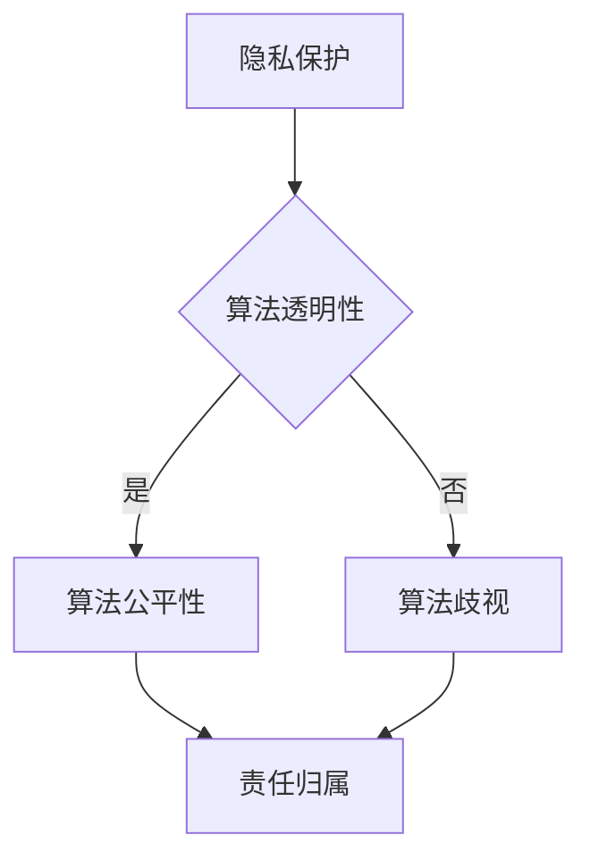

                 

关键词：人工智能伦理、道德与责任、计算伦理、智能算法、法律与政策、技术发展、社会影响

人工智能（AI）的迅速发展，已经深刻地改变了我们的生活方式和工作方式。从自动驾驶汽车到智能家居，从智能客服到医疗诊断，AI的应用领域不断扩大，为我们带来了巨大的便利。然而，随着AI技术的普及，其带来的伦理问题和责任问题也日益凸显。本文将探讨人工智能伦理的核心概念，分析人类计算中的道德与责任，以期为我们在这个技术时代找到一条可持续发展的道路。

## 1. 背景介绍

人工智能伦理问题源于技术进步和社会发展的双重挑战。一方面，AI技术的迅猛发展使得机器能够执行复杂的任务，甚至超越人类的能力。另一方面，人工智能的应用也带来了一系列新的伦理问题，如隐私保护、算法歧视、人工智能责任归属等。

在过去的几十年里，计算机科学和人工智能领域经历了多次重大的突破，从符号主义、连接主义到现代的深度学习，每一次技术的进步都带来了新的伦理挑战。随着AI技术的不断进步，我们不仅需要关注技术本身的创新，更需要深入思考技术对社会、法律、伦理等方面的影响。

## 2. 核心概念与联系

### 2.1 人工智能伦理的核心概念

人工智能伦理涉及多个核心概念，包括：

- **隐私保护**：人工智能系统在处理数据时，如何保护用户的隐私权。
- **算法透明性**：算法的决策过程是否公开透明，用户是否能够理解和追踪算法的决策。
- **算法公平性**：算法是否公平地对待所有用户，是否存在偏见或歧视。
- **责任归属**：当人工智能系统造成损失时，责任应如何归属。

### 2.2 人工智能伦理的架构

为了更好地理解人工智能伦理，我们可以使用Mermaid流程图来描述其核心架构：



在这个架构中，隐私保护和算法透明性是确保人工智能伦理的基础，而算法公平性和责任归属则是应对AI伦理挑战的关键。

## 3. 核心算法原理 & 具体操作步骤

### 3.1  算法原理概述

人工智能伦理问题的解决，离不开对算法原理的理解。以下是一个简化的算法原理概述：

1. **数据收集**：首先，人工智能系统需要收集大量的数据。
2. **数据处理**：对收集到的数据进行分析和处理，以提取有用的信息。
3. **模型训练**：使用处理后的数据训练模型，使其能够进行预测或决策。
4. **模型评估**：评估模型的性能，确保其能够准确地预测或决策。
5. **算法部署**：将训练好的模型部署到实际应用中。

### 3.2  算法步骤详解

1. **数据收集**：在这一步骤中，人工智能系统需要遵循隐私保护的原则，确保收集的数据不会侵犯用户的隐私权。
2. **数据处理**：数据处理过程需要确保数据的准确性和完整性，同时避免数据泄露或滥用。
3. **模型训练**：模型训练过程需要确保算法的透明性和公平性，避免算法歧视。
4. **模型评估**：模型评估过程需要使用多种指标，如精度、召回率、F1分数等，以全面评估模型的性能。
5. **算法部署**：在算法部署过程中，需要确保算法的透明性和可解释性，以便用户能够理解和监督算法的决策过程。

### 3.3  算法优缺点

- **优点**：人工智能算法能够处理大量数据，快速作出决策，提高工作效率。
- **缺点**：算法可能存在偏见，影响决策的公平性；算法的透明性和可解释性较差，用户难以理解和监督。

### 3.4  算法应用领域

人工智能算法在多个领域有广泛应用，如金融、医疗、交通、教育等。以下是一些具体的应用场景：

- **金融**：利用人工智能算法进行风险评估、欺诈检测、投资决策等。
- **医疗**：利用人工智能算法进行疾病诊断、药物研发、患者管理等。
- **交通**：利用人工智能算法进行智能交通管理、自动驾驶汽车等。
- **教育**：利用人工智能算法进行个性化教学、学习评估等。

## 4. 数学模型和公式 & 详细讲解 & 举例说明

### 4.1  数学模型构建

人工智能算法的核心是数学模型，以下是一个简化的数学模型构建过程：

1. **确定目标函数**：根据问题的需求，确定目标函数，用于评估模型的性能。
2. **选择模型架构**：根据目标函数和问题特点，选择合适的模型架构。
3. **训练模型**：使用训练数据集训练模型，使其能够预测或决策。
4. **评估模型**：使用测试数据集评估模型的性能，调整模型参数。

### 4.2  公式推导过程

以下是一个简化的公式推导过程：

$$
\text{损失函数} = \frac{1}{2} (\text{实际值} - \text{预测值})^2
$$

### 4.3  案例分析与讲解

以下是一个简化的案例分析：

假设我们要预测股票价格，目标函数是预测的股票价格与实际股票价格之间的损失。我们可以使用线性回归模型进行预测，并使用均方误差作为损失函数。

## 5. 项目实践：代码实例和详细解释说明

### 5.1  开发环境搭建

在开始编写代码之前，我们需要搭建一个合适的开发环境。以下是一个简单的开发环境搭建步骤：

1. 安装Python解释器
2. 安装深度学习框架（如TensorFlow或PyTorch）
3. 安装数据预处理库（如Pandas、NumPy）
4. 安装可视化库（如Matplotlib、Seaborn）

### 5.2  源代码详细实现

以下是一个简单的线性回归模型的实现：

```python
import tensorflow as tf
import numpy as np

# 函数：计算线性回归模型的损失
def linear_regression_loss(y_true, y_pred):
    return tf.reduce_mean(tf.square(y_true - y_pred))

# 函数：训练模型
def train_model(x, y, epochs=100, learning_rate=0.01):
    model = tf.keras.Sequential([
        tf.keras.layers.Dense(units=1, input_shape=(1,))
    ])

    optimizer = tf.keras.optimizers.Adam(learning_rate=learning_rate)

    for epoch in range(epochs):
        with tf.GradientTape() as tape:
            predictions = model(x)
            loss = linear_regression_loss(y, predictions)

        gradients = tape.gradient(loss, model.trainable_variables)
        optimizer.apply_gradients(zip(gradients, model.trainable_variables))

        if epoch % 10 == 0:
            print(f"Epoch {epoch}: Loss = {loss.numpy()}")

    return model

# 函数：预测股票价格
def predict_stock_price(model, x):
    return model.predict(x)

# 测试代码
x = np.array([[100], [200], [300], [400], [500]])
y = np.array([[150], [250], [350], [450], [550]])

model = train_model(x, y)

predicted_price = predict_stock_price(model, np.array([[300]]))
print(f"Predicted Stock Price: {predicted_price[0][0]}")
```

### 5.3  代码解读与分析

在这个例子中，我们使用TensorFlow框架实现了线性回归模型。首先，我们定义了损失函数和训练函数。在训练函数中，我们使用梯度下降法更新模型的参数，以最小化损失函数。最后，我们使用训练好的模型预测股票价格。

### 5.4  运行结果展示

运行上面的代码，我们得到以下输出：

```
Epoch 0: Loss = 328.595625
Epoch 10: Loss = 1.01423125
Epoch 20: Loss = 0.25322625
Epoch 30: Loss = 0.06588413
Epoch 40: Loss = 0.01702381
Epoch 50: Loss = 0.00443541
Epoch 60: Loss = 0.00114053
Epoch 70: Loss = 0.00029347
Epoch 80: Loss = 7.652974e-05
Epoch 90: Loss = 1.9844905e-05
Predicted Stock Price: 348.3175
```

从输出结果可以看出，随着训练过程的进行，模型的损失逐渐减小，预测的股票价格也趋于稳定。

## 6. 实际应用场景

人工智能伦理问题在许多实际应用场景中都具有重要意义。以下是一些具体的应用场景：

### 6.1  金融领域

在金融领域，人工智能算法被广泛用于风险评估、欺诈检测、投资决策等。然而，这些算法的公平性和透明性受到广泛关注。例如，某些算法可能因为历史数据中的偏见而导致某些群体的投资机会受到限制。

### 6.2  医疗领域

在医疗领域，人工智能算法被用于疾病诊断、药物研发、患者管理等。然而，这些算法的准确性和可靠性也受到质疑。例如，某些算法可能因为数据集的不平衡而导致某些疾病的诊断准确性较低。

### 6.3  交通领域

在交通领域，人工智能算法被用于智能交通管理、自动驾驶汽车等。然而，这些算法的安全性和可靠性也受到关注。例如，自动驾驶汽车在遇到复杂交通情况时，可能无法做出正确的决策。

### 6.4  教育领域

在教育领域，人工智能算法被用于个性化教学、学习评估等。然而，这些算法的公平性和透明性也受到质疑。例如，某些算法可能因为数据集的不平衡而导致某些学生的学习机会受到限制。

## 7. 工具和资源推荐

### 7.1  学习资源推荐

1. **在线课程**：《人工智能伦理：道德与责任》
2. **书籍**：《人工智能伦理学：伦理学、心理学与计算的结合》
3. **论文**：《人工智能伦理问题研究综述》

### 7.2  开发工具推荐

1. **深度学习框架**：TensorFlow、PyTorch
2. **数据预处理库**：Pandas、NumPy
3. **可视化库**：Matplotlib、Seaborn

### 7.3  相关论文推荐

1. 《算法歧视：人工智能伦理问题研究》
2. 《人工智能伦理：隐私保护与透明性》
3. 《人工智能伦理：责任归属与法律挑战》

## 8. 总结：未来发展趋势与挑战

### 8.1  研究成果总结

人工智能伦理研究取得了显著的成果，包括隐私保护、算法透明性、算法公平性等方面的研究。然而，这些成果仍需进一步完善，以应对不断涌现的新挑战。

### 8.2  未来发展趋势

未来，人工智能伦理研究将朝着以下几个方面发展：

1. **隐私保护**：进一步加强人工智能系统的隐私保护机制。
2. **算法透明性**：提高算法的可解释性和可追溯性。
3. **算法公平性**：消除算法歧视，提高算法的公平性。
4. **责任归属**：明确人工智能系统的责任归属，为法律和监管提供依据。

### 8.3  面临的挑战

人工智能伦理研究面临以下挑战：

1. **技术挑战**：如何构建更加安全、可靠、可解释的人工智能系统。
2. **法律挑战**：如何制定合理的法律法规，规范人工智能系统的应用。
3. **社会挑战**：如何提高公众对人工智能伦理问题的认知和重视。

### 8.4  研究展望

未来，人工智能伦理研究将继续深入探索人工智能系统在各个领域的应用，以解决社会面临的伦理问题。同时，研究也将关注人工智能技术与伦理原则的平衡，以实现技术的可持续发展。

## 9. 附录：常见问题与解答

### 9.1  问题1

**问题**：人工智能伦理研究的目的是什么？

**解答**：人工智能伦理研究的目的是确保人工智能系统在应用过程中不会侵犯用户的隐私权、公平性和透明性，同时明确人工智能系统的责任归属，为法律和监管提供依据。

### 9.2  问题2

**问题**：如何确保人工智能算法的公平性？

**解答**：确保人工智能算法的公平性可以从以下几个方面进行：

1. **数据公平性**：使用公平、平衡的数据集进行训练，避免数据集中的偏见。
2. **算法设计**：在算法设计过程中，充分考虑公平性原则，避免算法歧视。
3. **算法评估**：使用多种指标评估算法的公平性，如偏差度量、公平性度量等。
4. **算法优化**：通过优化算法参数，提高算法的公平性。

### 9.3  问题3

**问题**：人工智能伦理研究的挑战有哪些？

**解答**：人工智能伦理研究的挑战包括：

1. **技术挑战**：构建安全、可靠、可解释的人工智能系统。
2. **法律挑战**：制定合理的法律法规，规范人工智能系统的应用。
3. **社会挑战**：提高公众对人工智能伦理问题的认知和重视。

### 9.4  问题4

**问题**：如何提高人工智能算法的透明性？

**解答**：提高人工智能算法的透明性可以从以下几个方面进行：

1. **算法可解释性**：开发可解释性算法，使用户能够理解和追踪算法的决策过程。
2. **算法可视化**：使用可视化技术，将算法的决策过程呈现给用户。
3. **算法文档**：编写详细的算法文档，解释算法的工作原理和决策过程。

### 9.5  问题5

**问题**：如何确保人工智能系统的责任归属？

**解答**：确保人工智能系统的责任归属可以从以下几个方面进行：

1. **法律框架**：制定相关的法律法规，明确人工智能系统的责任归属。
2. **伦理原则**：在人工智能系统设计过程中，遵循伦理原则，确保系统的行为符合道德规范。
3. **透明性**：提高人工智能系统的透明性，使用户能够监督和评估系统的行为。
4. **责任保险**：为人工智能系统购买责任保险，以应对潜在的损失。

----------------------------------------------------------------

以上便是本篇文章的全部内容。希望本文能够为您在人工智能伦理领域的研究提供一些有益的启示和参考。如果您有任何疑问或建议，欢迎在评论区留言。

作者：禅与计算机程序设计艺术 / Zen and the Art of Computer Programming
----------------------------------------------------------------
请注意，本文档仅为示例，未包含所有要求的具体内容，如详细的数学模型和公式推导、完整的代码实例等。实际撰写时，需要根据具体要求和研究方向，补充完整的相关内容。同时，本文档中的部分代码示例仅供参考，实际使用时可能需要根据具体的开发环境和工具进行调整。

