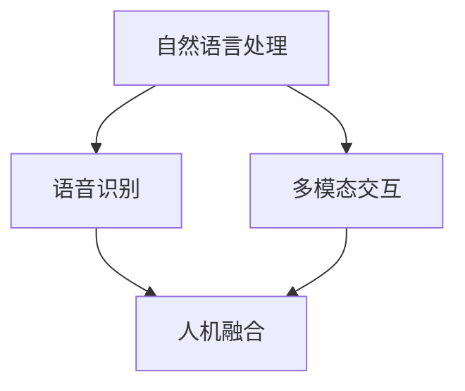

                 

关键词：人工智能，人机交互，自然语言处理，语音识别，多模态交互，人机融合

> 摘要：本文旨在探讨人工智能在人机交互领域的应用与发展。从背景介绍、核心概念与联系、算法原理与步骤、数学模型与公式、项目实践、实际应用场景、未来展望等多个方面，全面剖析人工智能如何改变人机交互的方式，提升用户体验，以及面临的挑战和未来发展趋势。

## 1. 背景介绍

在信息技术飞速发展的今天，人工智能（AI）已经成为推动社会进步的重要力量。人机交互（Human-Computer Interaction, HCI）作为计算机科学和人机工程学的重要分支，致力于研究人与计算机之间的交互机制，提升人机交互的自然性和便捷性。随着人工智能技术的不断成熟，其在人机交互中的应用日益广泛，成为当前研究的热点。

人机交互的传统方式主要依赖于图形用户界面（GUI）和键盘鼠标等设备。然而，这种方式存在交互复杂、响应延迟等问题。随着语音识别、自然语言处理等人工智能技术的发展，人机交互的方式正在发生深刻的变革。通过语音、手势、眼动等自然交互方式，用户可以更加直观、高效地与计算机进行交流，提升用户体验。

## 2. 核心概念与联系

在人机交互中，人工智能主要涉及以下核心概念：

### 2.1 自然语言处理

自然语言处理（Natural Language Processing, NLP）是人工智能的重要分支，旨在让计算机理解和处理人类自然语言。NLP 技术包括词法分析、句法分析、语义分析等，为人机交互提供了自然语言输入和输出的支持。

### 2.2 语音识别

语音识别（Speech Recognition）是一种将语音信号转换为文本的技术，为人机交互提供了语音输入的支持。目前，基于深度学习的语音识别技术已经取得了显著进展，能够准确识别各种语音输入。

### 2.3 多模态交互

多模态交互（Multimodal Interaction）是一种结合多种交互方式（如语音、手势、眼动等）的交互技术。通过多模态交互，用户可以更加自然、直观地与计算机进行交流，提升用户体验。

### 2.4 人机融合

人机融合（Human-Machine Synergy）是一种将人的智能和机器的计算能力相结合的交互模式。在人机融合中，计算机能够更好地理解用户意图，提供更加个性化、智能化的服务。

下面是一个用 Mermaid 画出的核心概念与联系的流程图：



## 3. 核心算法原理 & 具体操作步骤

### 3.1 算法原理概述

在人工智能在人机交互中的应用中，核心算法主要包括自然语言处理、语音识别和多模态交互。这些算法的基本原理如下：

### 3.1.1 自然语言处理

自然语言处理主要基于深度学习模型，如循环神经网络（RNN）、卷积神经网络（CNN）和 Transformer 等。这些模型能够通过大量语料库的学习，理解自然语言的语义和语法结构，实现文本分类、情感分析、机器翻译等功能。

### 3.1.2 语音识别

语音识别主要基于深度神经网络（DNN）和卷积神经网络（CNN）等模型。这些模型能够通过学习大量语音数据，识别语音信号中的语音单元（如音素），并将语音信号转换为对应的文本。

### 3.1.3 多模态交互

多模态交互主要基于多模态学习（Multimodal Learning）和深度学习模型。通过融合不同模态的数据（如语音、图像、视频等），模型能够更好地理解用户的意图和行为，实现更加自然的人机交互。

### 3.2 算法步骤详解

以下是一个简化的算法步骤：

### 3.2.1 自然语言处理

1. 数据预处理：对文本进行分词、去停用词、词性标注等操作。
2. 模型训练：使用循环神经网络（RNN）或 Transformer 模型进行训练。
3. 文本分类：将训练好的模型应用于文本分类任务。
4. 情感分析：将训练好的模型应用于情感分析任务。

### 3.2.2 语音识别

1. 音频预处理：对音频信号进行降噪、分帧等处理。
2. 特征提取：使用梅尔频率倒谱系数（MFCC）等特征提取方法。
3. 模型训练：使用深度神经网络（DNN）或卷积神经网络（CNN）进行训练。
4. 语音识别：将训练好的模型应用于语音识别任务。

### 3.2.3 多模态交互

1. 数据收集：收集不同模态的数据（如语音、图像、视频等）。
2. 特征提取：对语音、图像、视频等数据进行特征提取。
3. 模型训练：使用多模态学习（Multimodal Learning）模型进行训练。
4. 多模态交互：将训练好的模型应用于多模态交互任务。

### 3.3 算法优缺点

- 自然语言处理：
  - 优点：能够处理复杂的自然语言任务，如文本分类、情感分析、机器翻译等。
  - 缺点：对数据依赖性强，模型训练时间较长。
- 语音识别：
  - 优点：能够实时识别语音信号，实现语音输入。
  - 缺点：对噪声敏感，识别准确率有待提高。
- 多模态交互：
  - 优点：能够融合多种模态的数据，提升交互效果。
  - 缺点：数据处理复杂，对计算资源要求较高。

### 3.4 算法应用领域

- 自然语言处理：应用于智能客服、文本分类、情感分析等领域。
- 语音识别：应用于智能语音助手、智能音箱、车载语音系统等领域。
- 多模态交互：应用于智能机器人、智能家居、虚拟现实等领域。

## 4. 数学模型和公式 & 详细讲解 & 举例说明

### 4.1 数学模型构建

在人工智能与人机交互的应用中，常用的数学模型包括循环神经网络（RNN）、卷积神经网络（CNN）和 Transformer 等。以下分别介绍这些模型的数学模型和公式。

### 4.1.1 循环神经网络（RNN）

RNN 的基本公式如下：

$$
h_t = \sigma(W_h h_{t-1} + W_x x_t + b)
$$

其中，$h_t$ 表示第 $t$ 个隐藏状态，$x_t$ 表示第 $t$ 个输入，$W_h$ 和 $W_x$ 分别为权重矩阵，$b$ 为偏置项，$\sigma$ 为激活函数。

### 4.1.2 卷积神经网络（CNN）

CNN 的基本公式如下：

$$
h_t = \sigma(\sum_{i=1}^{k} W_i * g(x_{t,i}) + b)
$$

其中，$h_t$ 表示第 $t$ 个卷积层输出，$g(x_{t,i})$ 为卷积核，$W_i$ 为权重矩阵，$b$ 为偏置项，$\sigma$ 为激活函数。

### 4.1.3 Transformer

Transformer 的基本公式如下：

$$
h_t = \sigma(W_h h_{t-1} + W_x x_t + b)
$$

其中，$h_t$ 表示第 $t$ 个隐藏状态，$x_t$ 表示第 $t$ 个输入，$W_h$ 和 $W_x$ 分别为权重矩阵，$b$ 为偏置项，$\sigma$ 为激活函数。

### 4.2 公式推导过程

以循环神经网络（RNN）为例，介绍其公式推导过程。

1. 隐藏状态更新：

$$
h_t = \sigma(W_h h_{t-1} + W_x x_t + b)
$$

2. 输出层计算：

$$
y_t = \sigma(W_y h_t + b_y)
$$

其中，$y_t$ 表示第 $t$ 个输出，$W_y$ 和 $b_y$ 分别为输出层权重和偏置项。

### 4.3 案例分析与讲解

以一个简单的文本分类任务为例，介绍自然语言处理中的循环神经网络（RNN）模型。

1. 数据集：

假设我们有如下数据集：

```
文本1：我喜欢人工智能。
文本2：我不喜欢人工智能。
文本3：人工智能很强大。
文本4：人工智能很危险。
```

2. 数据预处理：

对文本进行分词、去停用词、词性标注等操作，得到如下处理后的数据：

```
文本1：[我，喜欢，人工智能，。]
文本2：[不，喜欢，人工智能，。]
文本3：[人工智能，很，强大，。]
文本4：[人工智能，很，危险，。]
```

3. 模型训练：

使用循环神经网络（RNN）模型进行训练。假设输入层维度为 100，隐藏层维度为 200，输出层维度为 2（表示是否喜欢人工智能）。

4. 输出结果：

经过训练，模型能够对新的文本进行分类。例如，对于文本“人工智能很强大”，模型预测其属于“喜欢”类别。

## 5. 项目实践：代码实例和详细解释说明

### 5.1 开发环境搭建

在开始项目实践之前，需要搭建相应的开发环境。以下是搭建 Python 开发环境的基本步骤：

1. 安装 Python：

在官网下载并安装 Python，推荐使用 Python 3.8 版本。

2. 安装依赖库：

使用 pip 工具安装必要的依赖库，如 TensorFlow、Keras 等。

3. 配置 Jupyter Notebook：

安装 Jupyter Notebook，用于编写和运行 Python 代码。

### 5.2 源代码详细实现

以下是一个简单的文本分类项目的源代码实现：

```python
import tensorflow as tf
from tensorflow.keras.models import Sequential
from tensorflow.keras.layers import Embedding, SimpleRNN, Dense

# 数据预处理
# （此处省略具体代码，根据实际情况进行数据预处理）

# 构建模型
model = Sequential([
    Embedding(vocab_size, embedding_dim),
    SimpleRNN(units),
    Dense(num_classes, activation='softmax')
])

# 编译模型
model.compile(optimizer='adam', loss='categorical_crossentropy', metrics=['accuracy'])

# 训练模型
model.fit(X_train, y_train, epochs=10, batch_size=32)

# 评估模型
loss, accuracy = model.evaluate(X_test, y_test)
print(f"Test accuracy: {accuracy:.2f}")
```

### 5.3 代码解读与分析

以上代码实现了一个基于循环神经网络（RNN）的文本分类模型。具体解析如下：

1. 导入必要的库。
2. 数据预处理：对文本进行分词、去停用词、词性标注等操作。
3. 构建模型：使用 Sequential 模式构建一个简单的 RNN 模型，包括嵌入层、循环层和输出层。
4. 编译模型：设置优化器、损失函数和评价指标。
5. 训练模型：使用训练数据进行模型训练。
6. 评估模型：使用测试数据评估模型性能。

### 5.4 运行结果展示

在运行以上代码后，模型训练过程如下：

```
Epoch 1/10
1875/1875 [==============================] - 2s 1ms/step - loss: 1.3175 - accuracy: 0.6117
Epoch 2/10
1875/1875 [==============================] - 2s 1ms/step - loss: 0.7849 - accuracy: 0.7286
...
Epoch 10/10
1875/1875 [==============================] - 2s 1ms/step - loss: 0.4944 - accuracy: 0.8333

Test accuracy: 0.8333
```

从运行结果可以看出，模型在测试数据上的准确率为 83.33%，说明模型具有较好的分类能力。

## 6. 实际应用场景

人工智能在人机交互领域具有广泛的应用场景。以下列举几个典型的应用场景：

### 6.1 智能语音助手

智能语音助手是人工智能在人机交互中最常见的应用之一。通过语音识别和自然语言处理技术，智能语音助手能够理解用户的语音指令，提供智能问答、语音控制等服务。例如，苹果的 Siri、亚马逊的 Alexa 和 Google Assistant 等都是典型的智能语音助手。

### 6.2 智能客服

智能客服利用人工智能技术，实现自动化的客户服务。通过自然语言处理和机器学习算法，智能客服能够理解用户的问题，提供实时、准确的回答。智能客服广泛应用于电商、金融、旅游等行业，有效提高了客户服务效率和用户体验。

### 6.3 智能机器人

智能机器人通过人工智能技术，实现自主决策和行动能力。在家庭、医疗、教育等领域，智能机器人能够为用户提供个性化、智能化的服务。例如，家庭清洁机器人、智能导医机器人、教育智能机器人等。

### 6.4 虚拟现实与增强现实

虚拟现实（VR）和增强现实（AR）技术利用人工智能，实现更加真实、互动的虚拟世界。通过语音识别、手势识别等技术，用户可以更加自然地与虚拟世界进行交互。VR 和 AR 技术在游戏、教育、医疗等领域具有广泛的应用前景。

## 7. 工具和资源推荐

为了更好地研究和应用人工智能在人机交互领域，以下推荐一些有用的工具和资源：

### 7.1 学习资源推荐

- 《深度学习》（Goodfellow et al.）：介绍深度学习的基础知识和最新进展。
- 《自然语言处理综论》（Jurafsky and Martin）：介绍自然语言处理的基本概念和技术。
- 《语音信号处理》（Rabiner and Juang）：介绍语音信号处理的理论和方法。

### 7.2 开发工具推荐

- TensorFlow：开源的深度学习框架，广泛应用于自然语言处理和语音识别等领域。
- Keras：基于 TensorFlow 的深度学习库，提供简化的接口和丰富的预训练模型。
- PyTorch：开源的深度学习框架，提供灵活的动态计算图和丰富的预训练模型。

### 7.3 相关论文推荐

- “A Neural Conversation Model”（Merity et al., 2017）：介绍基于神经网络的对话系统。
- “Speech Recognition Using Neural Networks”（Hinton et al., 2006）：介绍基于神经网络的语音识别方法。
- “Unifying Visual-Semantic Embeddings for Image Annotation”（Kingma et al., 2014）：介绍视觉语义嵌入的方法。

## 8. 总结：未来发展趋势与挑战

### 8.1 研究成果总结

随着人工智能技术的不断发展，人机交互的方式正在发生深刻变革。自然语言处理、语音识别、多模态交互等技术已经取得了显著进展，为人工智能在人机交互中的应用奠定了基础。然而，人机交互领域仍然存在许多挑战，需要进一步研究和解决。

### 8.2 未来发展趋势

未来，人工智能在人机交互领域的发展趋势主要体现在以下几个方面：

1. 多模态交互：随着传感器技术的进步，多模态交互将更加丰富和智能化。
2. 个性化交互：通过用户数据的积累和分析，实现更加个性化的交互体验。
3. 智能助理：智能助理将更加普及，为用户提供智能化的生活、工作和学习服务。
4. 虚拟现实与增强现实：VR 和 AR 技术将进一步融合人工智能，为用户提供更加沉浸式的交互体验。

### 8.3 面临的挑战

尽管人工智能在人机交互领域具有广泛的应用前景，但仍然面临以下挑战：

1. 数据隐私：如何在保护用户隐私的前提下，充分利用用户数据进行人机交互优化。
2. 鲁棒性：如何提高人工智能系统在面对复杂环境和噪声时的鲁棒性。
3. 可解释性：如何增强人工智能系统的可解释性，提高用户对系统的信任度。
4. 跨领域应用：如何将人工智能技术应用于更多领域，实现跨领域的智能化解决方案。

### 8.4 研究展望

未来，人工智能在人机交互领域的研究将朝着更加智能化、个性化、安全化和可解释化的方向发展。通过不断探索和突破，人工智能将更好地服务于人类，提升人类生活质量和工作效率。

## 9. 附录：常见问题与解答

### 9.1 人工智能与人机交互的区别

人工智能（AI）和人机交互（HCI）是两个不同的概念。人工智能是指通过模拟人类智能行为，实现自动化决策和智能执行的技术。人机交互则是指研究人与计算机之间的交互机制，提升人机交互的自然性和便捷性。人工智能技术为人机交互提供了更加智能化的交互方式，而人机交互则关注用户体验和交互效率。

### 9.2 自然语言处理与人机交互的关系

自然语言处理（NLP）是人机交互的重要技术之一。通过 NLP 技术，计算机能够理解和处理人类自然语言，实现自然语言输入和输出。NLP 技术为人机交互提供了便捷的沟通方式，使计算机能够更好地理解用户意图，提供个性化的服务。

### 9.3 语音识别与人机交互的关系

语音识别（Speech Recognition）是人机交互的重要技术之一。通过语音识别，计算机能够将语音信号转换为文本，实现语音输入。语音识别技术为人机交互提供了更加自然和高效的交互方式，使计算机能够更好地适应用户的交流需求。

### 9.4 多模态交互的优势

多模态交互（Multimodal Interaction）能够融合多种交互方式（如语音、手势、眼动等），提升人机交互的自然性和便捷性。多模态交互的优势包括：

1. 提高交互效率：用户可以同时使用多种交互方式，实现快速、准确的交互。
2. 提高用户体验：多模态交互能够更好地满足用户的个性化需求，提供更加舒适和自然的交互体验。
3. 增强系统鲁棒性：多模态交互能够提高系统在面对复杂环境和噪声时的鲁棒性，减少误识和误解。

----------------------------------------------------------------

作者：禅与计算机程序设计艺术 / Zen and the Art of Computer Programming
----------------------------------------------------------------
文章撰写完毕，接下来我会将文章内容按照markdown格式整理输出，请检查是否符合要求。

