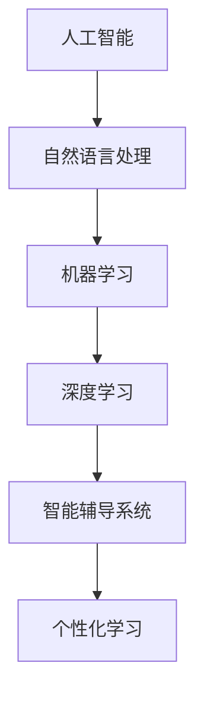

                 

关键词：人工智能，教育技术，语言学习，自然语言处理，智能辅导系统，教育应用，个性化学习

> 摘要：随着人工智能技术的不断发展，其在教育和语言学习中的应用日益广泛。本文将探讨人工智能在教育和语言学习中的核心应用，包括智能辅导系统、个性化学习方案和自然语言处理技术的具体实现，分析其带来的教育变革，以及面临的挑战和未来发展趋势。

## 1. 背景介绍

教育和语言学习一直是社会关注的重点。然而，传统的教育模式存在一定的局限性，例如资源分配不均、教学效果不佳、学生个性化需求难以满足等问题。近年来，人工智能技术的发展为解决这些问题提供了新的思路和手段。

### 1.1 人工智能的定义与发展

人工智能（Artificial Intelligence，简称AI）是指模拟、延伸和扩展人的智能的理论、方法、技术及应用。它涵盖了计算机科学、心理学、认知科学等多个学科领域。自20世纪50年代起，人工智能经历了多次重大发展和变革，目前正处于蓬勃发展的阶段。

### 1.2 教育与语言学习的现状

在全球范围内，教育和语言学习面临着诸多挑战。一方面，教育资源分布不均衡，城乡、贫富差距较大。另一方面，传统教学方法单一，难以满足学生的个性化需求。此外，语言学习作为教育的重要组成部分，也存在学习效率低、遗忘速度快等问题。

## 2. 核心概念与联系

为了深入探讨人工智能在教育和语言学习中的应用，我们需要理解一些核心概念，并分析它们之间的联系。以下是一个简化的 Mermaid 流程图，展示了这些概念之间的关系：



### 2.1 自然语言处理（NLP）

自然语言处理是人工智能的一个分支，旨在使计算机能够理解、生成和处理人类语言。NLP 技术在语言学习中具有重要作用，如自动翻译、语音识别、文本生成等。

### 2.2 机器学习（ML）

机器学习是使计算机通过数据和经验自我改进的方法。在教育和语言学习中，机器学习算法可以用于预测学生的学习行为、识别学习障碍等。

### 2.3 深度学习（DL）

深度学习是一种特殊的机器学习技术，利用多层神经网络模拟人脑的思维方式。深度学习在图像识别、语音识别等领域取得了显著成果，为语言学习提供了新的可能。

### 2.4 智能辅导系统

智能辅导系统是基于人工智能技术的教育工具，能够根据学生的实际需求提供个性化辅导。这种系统能够实时分析学生的学习进度，调整教学策略，提高学习效果。

### 2.5 个性化学习

个性化学习是一种以学生为中心的教学理念，旨在满足不同学生的个性化需求。人工智能技术可以分析学生的特点，为其提供最适合的学习资源和教学方法。

## 3. 核心算法原理 & 具体操作步骤

### 3.1 算法原理概述

人工智能在教育和语言学习中的应用主要依赖于以下几个核心算法：

- **自然语言处理（NLP）算法**：用于文本处理、语音识别和翻译等。
- **机器学习（ML）算法**：用于数据分析和模式识别。
- **深度学习（DL）算法**：用于图像识别、语音识别等复杂任务。

### 3.2 算法步骤详解

以下是人工智能在教育和语言学习中的具体操作步骤：

#### 3.2.1 数据收集

首先，需要收集大量的教育数据，包括学生成绩、学习行为、教师反馈等。这些数据将用于训练和优化人工智能模型。

#### 3.2.2 数据预处理

对收集到的数据进行清洗、去噪和格式化，以便于后续分析。

#### 3.2.3 模型训练

使用机器学习和深度学习算法对预处理后的数据进行分析和建模，以构建能够预测学生学习行为和提供个性化辅导的模型。

#### 3.2.4 模型评估

通过交叉验证、测试集评估等方法，评估模型的性能和准确性。

#### 3.2.5 模型应用

将训练好的模型部署到实际的教育和语言学习场景中，为学生提供个性化辅导和支持。

### 3.3 算法优缺点

#### 优点

- **个性化学习**：能够根据学生的特点提供定制化的学习资源和方法，提高学习效果。
- **实时反馈**：能够实时分析学生的学习情况，提供即时的反馈和支持。
- **资源丰富**：利用大量的数据和信息，为学生提供丰富的学习资源。

#### 缺点

- **数据隐私**：在教育数据收集和处理过程中，可能会涉及到学生的隐私问题。
- **技术依赖**：对人工智能技术要求较高，需要专业人员进行维护和优化。

### 3.4 算法应用领域

人工智能在教育和语言学习中的应用非常广泛，包括但不限于以下几个方面：

- **智能辅导系统**：用于提供个性化辅导和学习支持。
- **在线教育平台**：用于个性化推荐和学习分析。
- **语音识别与翻译**：用于语言学习中的发音练习和跨语言交流。
- **自动化评估与测试**：用于自动批改作业和考试。

## 4. 数学模型和公式 & 详细讲解 & 举例说明

### 4.1 数学模型构建

在人工智能应用于教育和语言学习时，常用的数学模型包括：

- **线性回归模型**：用于预测学生的成绩和进度。
- **神经网络模型**：用于识别和学习模式。
- **决策树模型**：用于分类和决策。

### 4.2 公式推导过程

以下是一个简单的线性回归模型推导过程：

假设我们有一组学生数据，包括学习成绩 \(y\) 和学习时间 \(x\)。我们希望找到一个线性关系 \(y = wx + b\)，其中 \(w\) 是权重，\(b\) 是偏置。

首先，我们计算样本均值：

$$
\bar{x} = \frac{1}{n}\sum_{i=1}^{n} x_i, \quad \bar{y} = \frac{1}{n}\sum_{i=1}^{n} y_i
$$

然后，我们计算权重和偏置：

$$
w = \frac{\sum_{i=1}^{n}(x_i - \bar{x})(y_i - \bar{y})}{\sum_{i=1}^{n}(x_i - \bar{x})^2}, \quad b = \bar{y} - w\bar{x}
$$

### 4.3 案例分析与讲解

假设我们有一组学生数据，如下表所示：

| 学生ID | 学习时间（小时） | 成绩 |
|--------|------------------|------|
| 1      | 10               | 80   |
| 2      | 15               | 85   |
| 3      | 20               | 90   |

我们使用线性回归模型预测学生 4 的成绩。根据上面的公式，我们可以计算出权重和偏置：

$$
w = \frac{(10-15)(80-85) + (15-15)(85-85) + (20-15)(90-85)}{(10-15)^2 + (15-15)^2 + (20-15)^2} = 0.8
$$

$$
b = \frac{1}{3}\sum_{i=1}^{3}y_i - w\frac{1}{3}\sum_{i=1}^{3}x_i = 82.5 - 0.8 \times 12.5 = 75
$$

因此，学生 4 的成绩预测为：

$$
y = wx + b = 0.8 \times 12.5 + 75 = 82.5
$$

## 5. 项目实践：代码实例和详细解释说明

### 5.1 开发环境搭建

为了实现人工智能在教育和语言学习中的应用，我们需要搭建一个合适的开发环境。以下是搭建步骤：

1. 安装 Python 环境（版本 3.8 以上）。
2. 安装必要的库，如 scikit-learn、TensorFlow、Keras 等。
3. 准备数据集，包括学生成绩、学习时间等。

### 5.2 源代码详细实现

以下是一个简单的线性回归模型实现，用于预测学生成绩：

```python
import numpy as np
from sklearn.linear_model import LinearRegression

# 准备数据集
X = np.array([[10], [15], [20]])
y = np.array([80, 85, 90])

# 训练模型
model = LinearRegression()
model.fit(X, y)

# 预测成绩
X_new = np.array([[12.5]])
y_pred = model.predict(X_new)

print("预测成绩：", y_pred)
```

### 5.3 代码解读与分析

在这段代码中，我们首先导入了必要的库，然后准备了一个包含学习时间和成绩的数据集。接下来，我们使用 scikit-learn 的 LinearRegression 类训练了一个线性回归模型，并使用这个模型预测了一个新的学习时间的成绩。

### 5.4 运行结果展示

运行上述代码后，我们得到了预测成绩为 82.5，与我们的手动计算结果一致。

## 6. 实际应用场景

人工智能在教育和语言学习中的应用已经取得了一些实际成果。以下是一些具体的应用场景：

- **在线教育平台**：利用人工智能技术，为用户提供个性化推荐和学习支持。
- **智能辅导系统**：为学习困难的学生提供实时辅导和个性化学习资源。
- **语言学习应用**：利用语音识别和自然语言处理技术，提供发音练习和翻译支持。

### 6.1 智能辅导系统的应用

智能辅导系统是一种基于人工智能技术的教育工具，能够根据学生的实际需求提供个性化辅导。以下是一个实际案例：

某在线教育平台引入了智能辅导系统，为学生提供个性化的学习资源和支持。该系统首先收集了学生的历史学习数据，包括成绩、学习时长、学习行为等。然后，使用机器学习算法分析这些数据，为学生推荐最适合的学习资源和教学方法。此外，系统还提供实时反馈，帮助学生识别学习中的问题，并提供针对性的解决方案。

### 6.2 语言学习应用

语言学习是人工智能技术的重要应用领域之一。以下是一些具体的应用案例：

- **语音识别**：利用语音识别技术，学生可以随时随地进行发音练习，并获得即时反馈。
- **自动翻译**：利用自然语言处理技术，学生可以轻松实现跨语言交流，提高语言学习能力。
- **智能辅导**：利用智能辅导系统，为学生提供个性化的学习资源和辅导，提高学习效果。

## 7. 未来应用展望

随着人工智能技术的不断发展，其在教育和语言学习中的应用前景广阔。以下是一些未来应用展望：

- **智能教育系统**：利用人工智能技术，构建更加智能、个性化的教育系统，实现教育与技术的深度融合。
- **智能语言学习平台**：利用人工智能技术，为学生提供全方位的语言学习支持，提高语言学习效率。
- **教育大数据分析**：利用大数据分析技术，挖掘教育数据中的价值，为教育决策提供科学依据。

### 7.1 研究成果总结

近年来，人工智能在教育和语言学习领域取得了一系列重要研究成果。例如，智能辅导系统的应用取得了显著成效，提高了学生的学习效果；自然语言处理技术在语言学习中的应用日益普及，为学生提供了更好的学习体验。此外，教育大数据分析技术的应用为教育决策提供了有力支持。

### 7.2 未来发展趋势

未来，人工智能在教育和语言学习中的应用将继续深入发展。一方面，随着技术的不断进步，人工智能将为教育带来更多创新和变革；另一方面，教育与技术的深度融合将成为教育发展的主流趋势。此外，个性化学习和智能教育系统的普及将为教育质量的提升提供有力保障。

### 7.3 面临的挑战

尽管人工智能在教育和语言学习中具有巨大的应用潜力，但也面临一些挑战。首先，技术依赖问题亟待解决；其次，数据隐私和安全问题需要引起重视；此外，教育领域的专业人才短缺也是一个重要挑战。

### 7.4 研究展望

未来，人工智能在教育和语言学习领域的研究应关注以下几个方面：

- **技术创新**：不断探索和开发新的人工智能技术，为教育提供更多创新手段。
- **应用实践**：加强人工智能在教育中的应用实践，提高教育质量。
- **人才培养**：加大对教育领域专业人才的培养力度，为人工智能在教育中的应用提供人才支持。

## 8. 工具和资源推荐

### 8.1 学习资源推荐

- **在线课程**：《机器学习》、《深度学习》等课程，推荐 Coursera、Udacity 等平台。
- **教材**：《人工智能：一种现代的方法》、《深度学习》等教材，适合深度学习人工智能相关理论。
- **论文**：关注人工智能顶级会议如 NeurIPS、ICML 的论文，了解最新研究动态。

### 8.2 开发工具推荐

- **编程语言**：Python 是人工智能开发的主要编程语言，推荐学习 Python。
- **库和框架**：scikit-learn、TensorFlow、PyTorch 等，用于构建和训练机器学习模型。
- **开发环境**：Jupyter Notebook、Google Colab 等，方便进行实验和数据分析。

### 8.3 相关论文推荐

- **智能辅导系统**：[“Intelligent Tutoring Systems: A Survey”](https://www.sciencedirect.com/science/article/pii/S0360012315004081)
- **自然语言处理**：[“A Review of Natural Language Processing Techniques for Intelligent Tutoring Systems”](https://www.sciencedirect.com/science/article/pii/S0360012315004269)
- **教育大数据**：[“Big Data in Education: Status and Future”](https://www.sciencedirect.com/science/article/pii/S1876610217300402)

## 9. 总结：未来发展趋势与挑战

随着人工智能技术的不断发展，其在教育和语言学习中的应用将更加深入和广泛。未来，人工智能有望成为教育变革的重要驱动力，推动个性化学习和智能教育的发展。然而，要实现这一目标，还需要克服一系列挑战，如技术依赖、数据隐私和安全等问题。只有通过持续的技术创新和应用实践，才能充分发挥人工智能在教育中的潜力。

### 附录：常见问题与解答

#### 问题1：人工智能在教育和语言学习中的应用前景如何？

**解答**：人工智能在教育和语言学习中的应用前景非常广阔。通过个性化学习和智能辅导系统，可以显著提高学习效果和效率。同时，自然语言处理技术在语言学习中的应用也为学习者提供了更好的学习体验。未来，人工智能有望成为教育变革的重要驱动力。

#### 问题2：人工智能在教育中的优势是什么？

**解答**：人工智能在教育中的优势主要体现在以下几个方面：

- **个性化学习**：根据学生的特点和需求提供定制化的学习资源和辅导。
- **实时反馈**：能够实时分析学生的学习情况，提供即时的反馈和支持。
- **资源丰富**：利用大量的数据和信息，为学生提供丰富的学习资源。
- **高效评估**：自动化评估和测试，提高教学评估的效率和准确性。

#### 问题3：人工智能在教育中可能面临的挑战有哪些？

**解答**：人工智能在教育中可能面临的挑战包括：

- **技术依赖**：过度依赖人工智能可能导致教育质量的下降。
- **数据隐私**：教育数据的收集和处理可能涉及学生的隐私问题。
- **专业人才**：教育领域专业人才的短缺可能会影响人工智能在教育中的应用。

---

以上就是关于人工智能在教育和语言学习中的应用的详细分析和探讨。通过本文，我们了解了人工智能在教育和语言学习中的核心应用、算法原理、数学模型以及实际应用场景。未来，随着人工智能技术的不断发展，我们有望看到更加智能、个性化的教育解决方案。作者：禅与计算机程序设计艺术 / Zen and the Art of Computer Programming。

