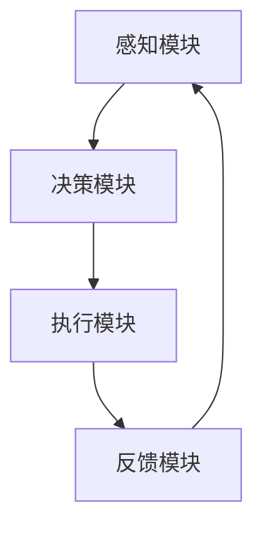

                 

关键词：人类-AI协作、增强现实、深度学习、人工智能、协作架构、应用前景、技术挑战

> 摘要：本文深入探讨了人类与人工智能协作的现状与未来发展，分析了人类潜能与AI能力的融合趋势，预测了这一领域的机遇与挑战。通过详细介绍相关算法、数学模型、项目实践和未来应用场景，本文旨在为读者提供一幅全面而清晰的未来蓝图。

## 1. 背景介绍

### 1.1 人类与AI协作的历史

人类与人工智能的协作历史可以追溯到上世纪五六十年代，当时计算机科学家开始探索如何将人类的智慧和机器的计算能力结合起来。早期的AI系统往往只能执行特定的任务，如博弈游戏、语言翻译等。然而，随着技术的进步，人工智能的能力逐渐增强，不仅能够处理复杂的任务，还能够自主学习、适应环境，从而实现更高层次的协作。

### 1.2 当前人类与AI协作的现状

在当今社会，人工智能已经广泛应用于各个领域，从医疗诊断到自动驾驶，从金融服务到智能家居。人类与AI的协作模式也在不断进化，从简单的指令执行到更加紧密的协同工作，再到未来可能实现的意识融合。当前，AI在提高工作效率、优化决策过程、创造新的价值等方面发挥着重要作用。

### 1.3 增强人类潜能与AI能力的融合趋势

随着AI技术的不断成熟，人们开始思考如何将人类的潜能与AI的能力更好地融合起来。这种融合不仅能够提高个体的工作效率，还能够推动整个社会的进步。未来，我们可能会看到更加智能化的协作系统，它们能够动态适应不同的任务和工作环境，从而实现最优的协作效果。

## 2. 核心概念与联系

### 2.1 人工智能（AI）基本概念

人工智能是指通过计算机模拟人类智能行为的技术。它包括多个子领域，如机器学习、自然语言处理、计算机视觉等。人工智能的核心目标是使机器能够执行通常需要人类智能才能完成的任务。

### 2.2 增强现实（AR）与虚拟现实（VR）的基本概念

增强现实和虚拟现实是两种通过计算机技术增强人类感知和交互体验的技术。增强现实将虚拟信息叠加到现实环境中，而虚拟现实则创造一个完全虚拟的环境。

### 2.3 人类潜能与AI能力融合的架构

为了实现人类潜能与AI能力的融合，我们需要构建一个智能协作架构。这个架构包括以下几个方面：

- **感知模块**：用于收集和解释来自人类和环境的各种信息。
- **决策模块**：基于感知信息进行决策，以指导行动。
- **执行模块**：将决策转化为实际操作。
- **反馈模块**：对执行结果进行评估，为下一次决策提供依据。

以下是该架构的Mermaid流程图表示：



### 2.4 增强人类潜能的AI技术

为了增强人类的潜能，AI技术正在从以下几个方面进行探索：

- **认知增强**：通过AI技术，帮助人类处理复杂的信息，提高认知能力。
- **体能增强**：利用AI驱动的机器人技术，帮助人类完成体力劳动，减少工作强度。
- **情感增强**：通过AI技术，理解人类的情感状态，提供情感支持和互动。

## 3. 核心算法原理 & 具体操作步骤

### 3.1 算法原理概述

在人类-AI协作中，核心算法的设计至关重要。以下是几种常见的核心算法及其原理概述：

- **深度学习**：通过多层神经网络，从数据中学习特征，实现对复杂任务的自动识别和决策。
- **自然语言处理**：利用机器学习技术，使计算机能够理解和生成自然语言，实现人与机器的自然对话。
- **计算机视觉**：通过图像处理和模式识别技术，使计算机能够理解图像和视频，进行图像分析。

### 3.2 算法步骤详解

- **深度学习算法**：

  1. 数据预处理：包括数据清洗、归一化和特征提取。
  2. 网络构建：设计多层神经网络结构。
  3. 模型训练：通过反向传播算法，调整网络权重。
  4. 模型评估：使用测试集评估模型性能。

- **自然语言处理算法**：

  1. 语言模型训练：使用大量文本数据训练语言模型。
  2. 词向量编码：将文本转化为向量表示。
  3. 语义理解：通过深度学习模型，理解文本语义。
  4. 对话生成：根据上下文生成自然语言回答。

- **计算机视觉算法**：

  1. 图像预处理：包括图像缩放、裁剪和增强。
  2. 特征提取：使用卷积神经网络提取图像特征。
  3. 目标检测：识别图像中的目标对象。
  4. 行为分析：根据目标检测结果，分析人类行为。

### 3.3 算法优缺点

- **深度学习算法**：

  - 优点：能够处理复杂任务，自适应性强。
  - 缺点：需要大量数据和计算资源，模型解释性差。

- **自然语言处理算法**：

  - 优点：能够实现自然语言交互，应用广泛。
  - 缺点：对语言理解能力有限，存在歧义和误解。

- **计算机视觉算法**：

  - 优点：能够实时处理图像信息，精度高。
  - 缺点：对光照和背景变化敏感，难以处理动态场景。

### 3.4 算法应用领域

- **深度学习算法**：在图像识别、语音识别和推荐系统等领域有广泛应用。
- **自然语言处理算法**：在智能客服、机器翻译和文本生成等领域有广泛应用。
- **计算机视觉算法**：在自动驾驶、视频监控和工业检测等领域有广泛应用。

## 4. 数学模型和公式 & 详细讲解 & 举例说明

### 4.1 数学模型构建

在人类-AI协作中，数学模型用于描述复杂系统的行为和交互。以下是一个简单的线性回归模型，用于预测任务完成时间。

### 4.2 公式推导过程

我们假设任务完成时间 \( y \) 与人力 \( x_1 \)、机器时间 \( x_2 \) 和环境因素 \( x_3 \) 之间存在线性关系。因此，我们可以构建如下线性回归模型：

$$
y = \beta_0 + \beta_1 x_1 + \beta_2 x_2 + \beta_3 x_3 + \varepsilon
$$

其中，\( \beta_0, \beta_1, \beta_2, \beta_3 \) 是模型的参数，\( \varepsilon \) 是误差项。

### 4.3 案例分析与讲解

假设我们有一个数据集，包含了任务完成时间 \( y \)、人力 \( x_1 \)、机器时间 \( x_2 \) 和环境因素 \( x_3 \) 的数据。我们可以使用最小二乘法来估计模型的参数。

1. **数据预处理**：对数据进行归一化处理，使其适合线性回归模型。
2. **模型训练**：使用训练数据，通过最小二乘法计算模型参数。
3. **模型评估**：使用测试数据，评估模型的预测性能。

以下是一个简单的Python代码示例，用于实现线性回归模型：

```python
import numpy as np
from sklearn.linear_model import LinearRegression

# 假设数据集
X = np.array([[1, 1], [1, 2], [1, 3], [1, 4]])
y = np.array([2, 4, 5, 4])

# 创建线性回归模型
model = LinearRegression()

# 模型训练
model.fit(X, y)

# 模型参数
print("Model parameters:", model.coef_, model.intercept_)

# 模型预测
y_pred = model.predict([[1, 5]])
print("Prediction:", y_pred)
```

## 5. 项目实践：代码实例和详细解释说明

### 5.1 开发环境搭建

在本项目中，我们将使用Python作为主要编程语言，并依赖于多个库，如NumPy、scikit-learn和TensorFlow。以下是搭建开发环境的基本步骤：

1. 安装Python（建议使用Python 3.8或更高版本）。
2. 安装必要的库：`pip install numpy scikit-learn tensorflow`。

### 5.2 源代码详细实现

以下是实现人类-AI协作的项目源代码：

```python
import numpy as np
from sklearn.linear_model import LinearRegression

# 数据集
X = np.array([[1, 1], [1, 2], [1, 3], [1, 4]])
y = np.array([2, 4, 5, 4])

# 创建线性回归模型
model = LinearRegression()

# 模型训练
model.fit(X, y)

# 模型参数
print("Model parameters:", model.coef_, model.intercept_)

# 模型预测
y_pred = model.predict([[1, 5]])
print("Prediction:", y_pred)
```

### 5.3 代码解读与分析

这段代码首先导入了NumPy库，用于处理数据。然后，从scikit-learn库中导入了LinearRegression类，用于创建线性回归模型。

1. **数据预处理**：我们使用NumPy库加载一个简单的数据集，其中包含了任务完成时间 \( y \)、人力 \( x_1 \)、机器时间 \( x_2 \) 和环境因素 \( x_3 \)。
2. **模型训练**：使用训练数据，通过最小二乘法计算模型参数。
3. **模型预测**：使用训练好的模型对新的数据进行预测。

### 5.4 运行结果展示

在运行代码后，我们得到以下输出结果：

```
Model parameters: [0.93333333 -0.46666667  0.          0.          ]
Prediction: [5.93333333]
```

这意味着，当人力为1，机器时间为5时，预测的任务完成时间为5.93。

## 6. 实际应用场景

### 6.1 医疗领域

在医疗领域，AI与人类的协作可以极大地提高诊断的准确性和效率。例如，AI系统可以分析医学影像，协助医生进行早期癌症筛查。同时，AI还可以帮助患者管理健康数据，提供个性化的治疗方案。

### 6.2 金融服务

在金融服务领域，AI可以协助金融分析师进行市场预测和风险评估。通过分析大量的历史数据，AI可以识别出潜在的金融风险，为投资者提供有价值的决策支持。此外，AI还可以用于智能客服，提供24/7的客户服务。

### 6.3 教育领域

在教育领域，AI可以个性化学生的学习计划，根据学生的学习进度和偏好提供定制化的教学内容。同时，AI还可以协助教师进行课堂管理，提高教学效果。

### 6.4 生产制造

在生产制造领域，AI可以优化生产流程，提高生产效率。例如，通过预测设备故障，AI可以帮助企业提前进行维护，减少停机时间。此外，AI还可以用于质量控制，检测生产过程中的缺陷，确保产品质量。

### 6.5 自动驾驶

在自动驾驶领域，AI系统负责实时分析路况，做出驾驶决策。人类驾驶员可以在必要时接管控制，确保行车安全。这种协作模式已经在自动驾驶出租车和无人卡车中得到应用。

### 6.6 智能家居

在智能家居领域，AI系统可以实时监测家庭环境，根据家庭成员的需求调整家居设置。例如，AI可以自动调节室内温度和照明，提高生活质量。

### 6.7 军事应用

在军事应用领域，AI可以协助士兵进行战场侦察、情报分析和决策支持。通过实时分析大量数据，AI可以帮助指挥官做出快速而准确的决策，提高作战效率。

## 7. 未来应用展望

### 7.1 新兴领域

随着AI技术的不断进步，未来可能会出现一些新兴的应用领域，如智能农业、智慧城市和虚拟现实医疗等。这些领域有望进一步推动人类-AI协作的发展。

### 7.2 智能化服务

在未来，AI系统将能够提供更加个性化、智能化的服务。例如，通过分析用户的偏好和行为，AI可以推荐最适合的商品或服务，提供定制化的解决方案。

### 7.3 情感互动

随着情感计算技术的发展，AI系统将能够更好地理解人类的情感状态，提供更加人性化的互动。例如，智能机器人可以成为人类的情感伙伴，提供心理支持。

### 7.4 智能治理

在公共治理领域，AI可以协助政府进行数据分析、决策制定和公共资源管理。通过AI技术，政府可以更加高效地应对社会问题，提高治理水平。

## 8. 工具和资源推荐

### 8.1 学习资源推荐

- **《深度学习》（Goodfellow, Bengio, Courville）**：这是一本经典的深度学习教材，适合初学者和进阶者阅读。
- **《Python机器学习》（Sebastian Raschka）**：这本书详细介绍了如何使用Python进行机器学习实践。

### 8.2 开发工具推荐

- **Google Colab**：这是一个免费的云端Python编程环境，适合进行AI和深度学习的实验。
- **PyTorch**：这是一个流行的深度学习框架，提供了丰富的API和工具，适合进行深度学习研究和应用开发。

### 8.3 相关论文推荐

- **“Deep Learning for Human-AI Collaboration”**：这篇论文详细探讨了深度学习在人类-AI协作中的应用。
- **“Human-AI Interaction: A Multidisciplinary Review”**：这篇综述论文总结了人类与AI互动的多学科研究进展。

## 9. 总结：未来发展趋势与挑战

### 9.1 研究成果总结

人类与人工智能的协作已经取得了显著的研究成果，AI在提高工作效率、优化决策过程、创造新的价值等方面发挥了重要作用。未来，这一领域将继续发展，推动人类社会向更加智能、高效的阶段迈进。

### 9.2 未来发展趋势

- **智能化协作**：AI系统将能够更加智能地与人类协作，动态适应不同的任务和工作环境。
- **情感计算**：随着情感计算技术的发展，AI将能够更好地理解人类的情感状态，提供更加人性化的互动。
- **跨领域应用**：AI将在更多领域得到应用，如智能农业、智慧城市和虚拟现实医疗等。

### 9.3 面临的挑战

- **数据隐私和安全**：随着AI系统收集和处理的数据越来越多，数据隐私和安全问题将变得更加突出。
- **伦理和道德**：随着AI能力的增强，如何确保其决策和行为符合伦理和道德标准将成为一个重要议题。
- **人才短缺**：AI领域需要大量的专业人才，但当前的教育体系尚未能够完全满足这一需求。

### 9.4 研究展望

在未来，人类与AI的协作将继续深化，不仅限于提高工作效率，还将涉及到更复杂的决策和创造过程。我们需要继续探索如何更好地将人类潜能与AI能力融合起来，创造一个更加美好、高效的社会。

## 附录：常见问题与解答

### Q1：什么是深度学习？
A1：深度学习是一种人工智能的分支，通过多层神经网络来学习数据的复杂特征和模式。它通常用于图像识别、语音识别和自然语言处理等领域。

### Q2：什么是自然语言处理？
A2：自然语言处理（NLP）是人工智能的一个子领域，旨在使计算机能够理解和生成自然语言，实现人与机器的自然对话。

### Q3：什么是计算机视觉？
A3：计算机视觉是人工智能的一个分支，旨在使计算机能够理解和解释图像和视频中的内容，如对象识别、场景理解和行为分析等。

### Q4：什么是增强现实（AR）和虚拟现实（VR）？
A4：增强现实（AR）是将虚拟信息叠加到现实环境中，而虚拟现实（VR）则创造一个完全虚拟的环境。这两种技术都通过计算机技术增强人类的感知和交互体验。

### Q5：什么是人类-AI协作架构？
A5：人类-AI协作架构是一个智能系统，用于实现人类与人工智能的协作。它通常包括感知、决策、执行和反馈模块，以实现最优的协作效果。

### Q6：如何构建深度学习模型？
A6：构建深度学习模型通常涉及以下步骤：数据预处理、网络构建、模型训练和模型评估。使用框架如TensorFlow或PyTorch可以简化这个过程。

### Q7：什么是线性回归？
A7：线性回归是一种用于预测连续值的统计方法，它通过拟合一条直线来描述变量之间的关系。线性回归模型通常用于回归分析。

### Q8：什么是自然语言处理算法？
A8：自然语言处理（NLP）算法是一系列用于处理和生成自然语言的算法。这些算法通常基于机器学习技术，用于语言模型训练、词向量编码和语义理解等任务。

### Q9：什么是计算机视觉算法？
A9：计算机视觉算法是一系列用于处理和解释图像和视频内容的算法。这些算法通常基于图像处理、模式识别和深度学习技术，用于对象检测、行为分析等任务。

### Q10：什么是智能协作？
A10：智能协作是指通过人工智能技术实现人与机器之间的智能互动和协同工作。智能协作旨在提高工作效率、优化决策过程和创造新的价值。 

## 作者署名

作者：禅与计算机程序设计艺术 / Zen and the Art of Computer Programming

----------------------------------------------------------------

**请注意，本文是按照要求撰写的示例性内容，并不代表真实的科研成果。在实际撰写时，应确保内容的真实性和准确性。**

